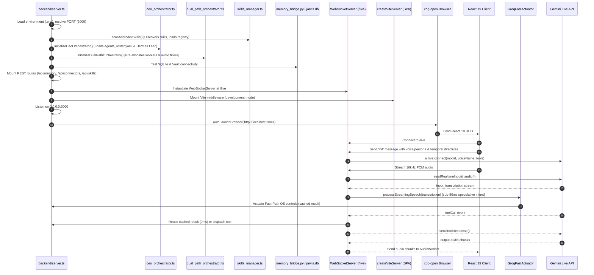

# CODEBASE_REFERENCE.md: J.A.R.V.I.S. Autonomous AI OS Technical Reference Manual

> **Definitive Codebase & Architectural Specification**  
> **System**: J.A.R.V.I.S. Autonomous AI Operating System (React 19 + Express + TypeScript + C++ + Python + Rust + Gemini Live)  
> **Last Verified & Synchronized**: `2026-10-02 06:13:53 IST`  
> **Active Working Branch**: `dev` | **Remote**: `https://github.com/Jarvis-os-tech/JARVIS-V0.git`  

---

## 1. Repository Identity & Core Runtime

*   **Repository Root**: [`/home/g0pi/Downloads/jarvis`](file:///home/g0pi/Downloads/jarvis)
*   **Remote Repository**: `https://github.com/Jarvis-os-tech/JARVIS-V0.git`
*   **Primary Languages & Tech Stacks**:
    *   **Backend Server**: TypeScript / Node.js (ESM), Express 4.21, WebSocket (`ws` 8.21), `@google/genai` (2.4.0), Groq SDK fast actuator, CEO Executive Orchestrator ([`backend/system_modules/ceo/`](file:///home/g0pi/Downloads/jarvis/backend/system_modules/ceo)), Multi-Agent Dual-Path Engine ([`backend/system_modules/intelligent_system/dual_path_orchestrator.ts`](file:///home/g0pi/Downloads/jarvis/backend/system_modules/intelligent_system/dual_path_orchestrator.ts)). Entry point: [`backend/server.ts`](file:///home/g0pi/Downloads/jarvis/backend/server.ts) executed via `tsx`.
    *   **Frontend Client**: React 19.0.1, Vite 6.2.3, Tailwind CSS v4.1.14, Lucide React, Motion, CeoExecutiveHUD ([`frontend/src/components/CeoExecutiveHUD.tsx`](file:///home/g0pi/Downloads/jarvis/frontend/src/components/CeoExecutiveHUD.tsx)). Entry point: [`frontend/src/main.tsx`](file:///home/g0pi/Downloads/jarvis/frontend/src/main.tsx) & [`frontend/src/App.tsx`](file:///home/g0pi/Downloads/jarvis/frontend/src/App.tsx).
    *   **Sub-5ms Native OS Automation**: 18 high-performance C++17 worker binaries compiled with `g++ -O3` in [`whole_controls/native_workers/`](file:///home/g0pi/Downloads/jarvis/whole_controls/native_workers) controlled via direct execution and [`unified_dispatcher.py`](file:///home/g0pi/Downloads/jarvis/whole_controls/python_actuators/unified_dispatcher.py), desktop automation with text deletion (`delete_text`).
    *   **External MCP Connectors**: Google Workspace (Gmail, Calendar, Drive, Docs, Slides, Tasks) and GitHub MCP integrations managed via [`connectors/connectors.py`](file:///home/g0pi/Downloads/jarvis/connectors/connectors.py) and [`connectors/connector-routes.ts`](file:///home/g0pi/Downloads/jarvis/connectors/connector-routes.ts), with Groq speculative actuation protection, relative date parsing, email decoding, and bidirectional SQLite task sync.
    *   **Sovereign 4-Tier Memory Matrix**: SQLite WAL database ([`data/jarvis.db`](file:///home/g0pi/Downloads/jarvis/data/jarvis.db) including `tasks`, `memory_buffer`, and triad tables), Obsidian Markdown vault ([`jarvis_memory_bundle/vault/`](file:///home/g0pi/Downloads/jarvis/jarvis_memory_bundle/vault)), and Rust Memory Engine ([`jarvis_memory_bundle/engine_rust/`](file:///home/g0pi/Downloads/jarvis/jarvis_memory_bundle/engine_rust)).
    *   **Executive Multi-Agent Roster & Skills**: J.A.R.V.I.S. CEO Executive Orchestrator ([`ceo_orchestrator.ts`](file:///home/g0pi/Downloads/jarvis/backend/system_modules/ceo/ceo_orchestrator.ts), [`ceo_roster.ts`](file:///home/g0pi/Downloads/jarvis/backend/system_modules/ceo/ceo_roster.ts), [`agents_roster.yaml`](file:///home/g0pi/Downloads/jarvis/agents_roster.yaml)) orchestrating Hermes as Lead Engineer and 28+ universal skills from `ivfarias/ceo`.
*   **Server Port**: `3000` (managed via `PORT` in `.env` and `Number(process.env.PORT) || 3000` in [`backend/server.ts`](file:///home/g0pi/Downloads/jarvis/backend/server.ts)).
*   **Development Command**: `npm run dev` (executes `tsx backend/server.ts` with embedded Vite middleware).
*   **Browser Auto-Launch**: Upon boot, automatically launches default browser at `http://localhost:3000` via `xdg-open` (Linux), `open` (macOS), or `start` (Windows).
*   **Target Runtimes**: Node.js v20+ / v22+, Python 3.10+, Rust Cargo (edition 2021), Linux (Wayland, Hyprland, Omarchy OS, X11).

---

## 2. Real-Time Git Branch & Commit Telemetry

### Branch Divergence & Release Policy
*   **Branch Policy**: According to [`GEMINI.md`](file:///home/g0pi/Downloads/jarvis/GEMINI.md), **all active development, commits, and pushes MUST target the `dev` branch**. The `main` branch is strictly release-gated and must not receive pushes until the user explicitly confirms (e.g. *"all are ok push to main branch"*).
*   **Current Active Branch**: `dev`
*   **Merge Base**: `Error executing 'git merge-base dev main': warning: refname 'dev' is ambiguous.`
*   **`dev` Branch Ahead**: `dev` is currently **1587 commits ahead** of `main` / `origin/dev`:
    *   `fde79f1aa fix(ci): align integration inputs with release candidate source (#4048)`
    *   `fe3863753 fix(runtime): recover SSH relays and bound startup diagnostics (#4011)`
    *   `e21b7fd8c chore(build): remove bundled Z3 support (#3275)`
    *   `021400be8 refactor(auth): separate sandbox identity from TLS (#3110)`
    *   `2935e9731 fix(gateway): delete finalized ephemeral sandboxes while connected (#3984)`
    *   `5a91572be fix(gator): require full head SHA for /ok to test (#4007)`
    *   `9912d21d3 fix(e2e): keep locally built Kubernetes images off the chart's default registry (#3991)`
    *   `4784e7945 refactor(sandbox): remove unreachable root-side identity and workspace code (#3979)`
    *   `dde8a9a57 fix(server): log polled request responses at debug (#3974)`
    *   `912a077bd feat(service): add bearer authorization passthrough (#3796)`
    *   `374c03596 fix(network): refuse protocol upgrades on GraphQL endpoints (#3841)`
    *   `07a486d75 fix(cli): accept sandbox name before -- in exec (#3901)`
    *   `7caff12d3 perf(otel): stop exporting spans from steady-state polling (#3915)`
    *   `21fea9593 test(tmachine): add K3s conformance scenario (#3848)`
    *   `5acaaba19 test(conformance): verify deletion through sandbox list (#3792)`
    *   `b8ffe5244 test(podman): move podman_preflight into driver-podman integration tests (#3783)`
    *   `b8932d43b Fix/startup provider readiness (#3819)`
    *   `798500ccd fix(policy): validate raw OPA settings and redact startup errors (#3788)`
    *   `252882f37 feat(providers): serve sandbox config files on demand (#3832)`
    *   `5c0c9e446 feat(providers): add OCI Generative AI example provider profile (#3904)`
    *   `ba16b9f2c fix(mcp): explain revision-scoped policy and rejections (#3850)`
    *   `0ea0d3102 fix(supervisor): restore canonical stdin after connection loss (#3852)`
    *   `33a8eac19 feat(helm): configure gateway OCSF JSONL output (#3876)`
    *   `c0eb3dbd3 fix(ci): restore repository permission vetters (#3875)`
    *   `cf1bbb965 docs: remove the architecture directory (#3799)`
    *   `a6eefcf29 fix(network): preserve pipelined requests after chunked inspection (#3861)`
    *   `2ad77ad8a test(sandbox): bind ephemeral port in accepted loopback stream test (#3872)`
    *   `a875add23 feat(server): write gateway OCSF events to JSONL (#3264)`
    *   `12ef86c28 fix(cli): keep policy and provider diagnostics readable (#3444)`
    *   `cfcc3733b fix(e2e): stop sandbox leaks from async Drop cleanup (#3750)`
    *   `9cb72baa2 feat(docker): support corporate proxy CA bundles (#3549)`
    *   `2fe5a0e19 perf(kubernetes): use a TCP readiness probe for the supervisor (#3700)`
    *   `acbac9cb7 feat(sandbox): add main restart policy (#2798)`
    *   `1358941b8 feat(mcp): inspect requests with Tower-selected protocol profiles (#3335)`
    *   `b77f5ddfc test(install): support Bash 3.2 mock capture (#3790)`
    *   `e63cfa118 fix(cli): keep SSH forwards owned by spawned process (#3759)`
    *   `36b0386c9 feat(cli): detach sandbox sessions with Ctrl-D (#3744)`
    *   `45e3308d3 fix(network): refuse protocol upgrades on JSON-RPC and MCP endpoints (#3753)`
    *   `eef8bec0c test(e2e): run podman suite with tmachine (#3637)`
    *   `9f60f55c6 fix(server): retry transient sandbox CAS conflicts (#3501)`
    *   `0c29d8e06 test(conformance): migrate file transfer scenarios (#3597)`
    *   `c63f8ce56 test(cli): migrate gateway-free smoke coverage (#3641)`
    *   `6f00d5cac fix(e2e): reserve distinct corporate proxy fixture ports (#3761)`
    *   `7a4da3124 fix(supervisor): keep session retries during startup (#3765)`
    *   `d009f3012 feat(helm): make cluster-scoped RBAC optional (#3459)`
    *   `6648bd0c2 perf(sandbox): wake orphan reaper on child exit (#3757)`
    *   `87929ad13 docs: keep page URLs aligned with file paths (#3713)`
    *   `8934b74a8 fix(docs): sync redirects with versioned snapshots (#3754)`
    *   `c9da461a5 fix(ci): keep snap canary sandbox name within limit (#3751)`
    *   `d1a19c70e fix(homebrew): overwrite generated gateway config during migration (#3752)`
    *   `f37d89b58 fix(supervisor-network): keep workload bytes read with a mediated CONNECT header (#3745)`
    *   `a3ed8c79c docs: refresh architecture and extensibility pages (#3741)`
    *   `2f1ea658f docs(policy): clarify sandbox-local loopback access (#3740)`
    *   `4ce767fc0 docs: describe 0.1 series in release callouts (#3732)`
    *   `a67567e58 fix(snap): require mTLS for the snap gateway (#3726)`
    *   `f15589952 docs(tutorials): run Pi with OpenRouter (#3722)`
    *   `b52eed72e test(binary-identity): stabilize procfs identity fixtures (#3708)`
    *   `d4f5034d7 fix(gateway)!: make the WebSocket tunnel opt-in (#3727)`
    *   `496ebba29 docs(readme): remove alpha status badge (#3723)`
    *   `73a181d32 docs: streamline README, add policy prover to architecture docs (#3718)`
    *   `6f596828a docs(fern): publish ordered version snapshots (#3721)`
    *   `d7f921190 docs(policy): refresh policy documentation and references (#3563)`
    *   `585bcf0b8 (Fix) ha sandbox resilience with k8s (#3644)`
    *   `854b2370b fix(policy): align quickstart, policy skills, and pypi profile with current behavior (#3695)`
    *   `924486805 docs: refresh architecture and agent guides (#3705)`
    *   `aead95b7a fix(policy): propose rules for unknown DNS hosts (#3707)`
    *   `c93fd94a5 feat(cli): import provider profiles from HTTP URLs (#3706)`
    *   `7a50c0899 fix(cli): stream piped exec stdin beyond gRPC request limit (#3687)`
    *   `468806188 fix(sandbox): deliver complete exec output before success (#3688)`
    *   `c9257c844 fix(policy): restore policy.local and proposal conformance (#3689)`
    *   `5448fb4f9 fix(auth): skip renewal for non-expiring sandbox JWTs (#3686)`
    *   `d376c9075 test(podman): close rootful userns, resource-limit, and daemon-failure CI gaps (#3690)`
    *   `137467296 fix(helm): restore Kubernetes e2e chart rendering (#3692)`
    *   `48725c5fc ci(release): move CodeQL, Trivy, and Zizmor to advisory (#3693)`
    *   `08548713c fix(install): honor pinned releases and speed up prerelease discovery (#3681)`
    *   `f213e9a49 docs(middleware): reorganize and expand middleware guides (#3636)`
    *   `a00ea31c6 ci: restrict copy-pr-bot manual vetters (#3678)`
    *   `52cb8ecee fix(kubernetes): remove NetworkPolicy acknowledgement (#3677)`
    *   `4cd1351e1 fix(test): use portable file mode checks in snap installer tests (#3670)`
    *   `6c864ec9a fix(install): avoid installing incompatible docker snap (#3666)`
    *   `7691f88e0 perf(server): enable WAL for the SQLite store; relax sync only for SSH session issuance (#3543)`
    *   `8369bc11a fix(podman): restore host gateway alias mediation (#3606)`
    *   `6af5520f3 fix(vm): confine OCI layer application to the rootfs (#3550)`
    *   `0518bd4c8 fix(sandbox): preserve local sessions across host sleep (#3573)`
    *   `e60098d74 fix(snap): install openshell snap via install.sh when snap available (#3656)`
    *   `a8f98ec09 fix(auth): remove legacy sandbox JWT admission (#3562)`
    *   `679b19067 feat(testing): support independent gateway and supervisor image overrides (#3341)`
    *   `490055b42 fix(sandbox): keep boundary connection live under stalled relays (#3642)`
    *   `bfd126868 fix(e2e): use POSIX-compatible lowercase conversion in parity runner (#3465)`
    *   `0b351c4a9 fix(helm)!: reduce gateway Secret privileges (#3616)`
    *   `62df64625 fix(identity): assess leaf and ancestor executable identities (#3633)`
    *   `a649aa42f docs: add 0.1.0 upgrade guide outline (#3540)`
    *   `123d95e2e fix(pagination): document list contract and harden SDK pagers (#3279)`
    *   `52aac3786 fix(network): honor HTTP response connection closure (#3581)`
    *   `95632406c fix(server): make HA sandbox create and HA e2e tests reliable (#3635)`
    *   `a408f5dd0 chore(kubernetes): update Agent Sandbox to v1.0.3 (#3578)`
    *   `bed9e5eaf fix(supervisor): use better error message when sandbox connect is not available (#3572)`
    *   `f3e097d6c chore(deps): bump anyio from 4.13.0 to 4.14.2 (#3474)`
    *   `c02683688 ci(e2e): run the Kubernetes HA and credential-driver suites on test:e2e-kubernetes (#3626)`
    *   `fd49df4f4 fix(ci): use approved setup-oras revision (#3625)`
    *   `11f1fe580 fix(vm): relocate per-sandbox Unix sockets to /tmp to fit macOS sun_path (#3544)`
    *   `6cb1140c6 fix(drivers): normalize label namespace (#3609)`
    *   `907f894eb ci(release): publish prereleases with qualification summary (#3593)`
    *   `d3480d2a7 fix(sandbox-backend): use String for CA cert/bundle in boundary protocol (#3456)`
    *   `069ae6bd9 fix(vm): scope GPU filesystem enrichment to assigned workloads (#3580)`
    *   `d02ebe2c4 fix(kubernetes): prevent false sandbox suspension (#3567)`
    *   `c8b20bf0a ci(windows): seed caches on windows branch (#3576)`
    *   `b67117109 fix(sandbox): qualify task memory against workload child (#3574)`
    *   `df88bedb3 fix(podman): support rootless user namespace configurations (#3527)`
    *   `84960e70a fix(kubernetes): scope resource admission RBAC (#3571)`
    *   `feff89796 fix(sandbox): await SFTP writes before acknowledging (#3568)`
    *   `49df4d7ca fix(server): drain supervisor ownership cleanup on shutdown (#3547)`
    *   `bdffa102c feat(api): add durable exec launch admission (#3324)`
    *   `1e34e8c57 fix(drivers): require admission labels for external resources (#3538)`
    *   `f8002d19a fix(e2e): repair the credential driver test (#3565)`
    *   `293fab75d fix(sandbox): support kernels < 5.19 via seccomp WAIT_KILLABLE_RECV fallback (#3420)`
    *   `5a81d2b37 fix(network): bound chunked relay memory (#3537)`
    *   `470a34635 fix(api): make WatchSandbox loss-aware and resumable (#3209)`
    *   `88357775a docs(windows): align Z3 pin with z3-sys 0.13 (#3561)`
    *   `e367d4739 fix(sandbox): reclaim socket descriptors before exhaustion (#3532)`
    *   `4b1c09de2 fix(network): preserve chunked request boundaries (#3530)`
    *   `718dba343 fix(policy)!: reject removed tls endpoint values (#3414)`
    *   `35e0a68e4 feat(kubernetes): support corporate proxy CA bundle (#3447)`
    *   `3107ff1f8 ci(security): stage release finding enforcement (#3552)`
    *   `f8b1fd8b5 fix(supervisor): restore OCSF schema downgrade (#3554)`
    *   `7139df8ca fix(exec): preserve output after stdin EOF and verify stream completion (#3359)`
    *   `ca4573588 fix(driver-vm): resolve lifecycle requests on sandbox_id alone (#3305)`
    *   `50230616d refactor(runtime): retire Community image dependencies (#3386)`
    *   `24706c175 ci(rust): parallelize branch checks (#3462)`
    *   `551a81c72 test(tmachine): add interactive shell testsuite (#3522)`
    *   `c8a4ff5f1 fix(kubernetes): bind bootstrap to runtime identity (#3531)`
    *   `99ed6a9df chore(build): remove stale static-supervisor leftovers (#3520)`
    *   `96c08f111 refactor(isolation)!: make confirmation backend-neutral (#3366)`
    *   `0a770d917 feat(kubernetes): support HA gateway rebalancing (#1868)`
    *   `cb6e88acb fix(vm): unpack registry images correctly and validate prepared disks (#3524)`
    *   `2493d415c feat(extensions)!: normalize protocol negotiation (#3352)`
    *   `251f77e2b ci(security): gate tagged releases on scans (#3523)`
    *   `fa8f6d394 feat(cli): promote profile commands to top level (#3258)`
    *   `cbf026366 fix(ocsf): require network activity endpoints (#3355)`
    *   `484f0768f fix(server): serialize sandbox restart authentication (#3485)`
    *   `dee4f98dd chore(vm): refresh runtime defaults and hardening (#3446)`
    *   `65eb9167d test(tmachine): add Debian installer profile (#3461)`
    *   `190506994 feat(sandbox): expose services during creation (#3439)`
    *   `29e89a2f2 fix(windows): restore MXC MSVC builds (#3488)`
    *   `4cd5e5478 fix(deps): update rustls past RUSTSEC-2026-0285 (#3484)`
    *   `d6f3e1f5f fix(packaging): keep SPDX comments out of Debian control (#3483)`
    *   `fa0bfa490 fix(server): close SQLite stores in policy tests (#3466)`
    *   `5bce19ab4 feat(prover): check process, Landlock, and destination IP containment (#3394)`
    *   `17ce738bf fix(ci)!: remove gateway callback listener dependency (#3365)`
    *   `d91b1999a feat(api)!: use sandbox names as canonical RPC references (#3272)`
    *   `903d9a0e7 chore(license): align repository compliance text (#3467)`
    *   `e38d7254e fix(policy): reject unknown endpoint security modes (#3187)`
    *   `e2939b919 feat(e2e): run the Kubernetes e2e suite on cargo-nextest with machine- and human-readable reports (#3344)`
    *   `c5a8c4d22 chore(vm): bump libkrun to v1.19.4 and libkrunfw to v5.6.1 (#3451)`
    *   `8bd3dcc56 refactor(tmachine): separate installers from environments (#3419)`
    *   `4b2cb7f00 test(tmachine): verify SELinux in Fedora scenarios (#3457)`
    *   `2263685cf test(tmachine): migrate Keycloak provider refresh coverage (#3404)`
    *   `473d1e997 docs(fern): restore dev announcement (#3441)`
    *   `c108c3169 docs(fern): sync announcement configuration (#3436)`
    *   `4443ae733 fix(supervisor): allow withheld credentials at startup (#3438)`
    *   `8b77925eb feat(installer): support prerelease installations (#3364)`
    *   `1d010f418 feat(sandbox): validate configuration before workload activation (#3259)`
    *   `9836bffee fix(kubernetes): stop supervisor before workload (#3424)`
    *   `50c5cf8ed refactor(compute): remove legacy host users encoding (#3248)`
    *   `04146692d refactor(providers)!: make provider profiles import-only (#3383)`
    *   `b7a932a4d docs(inference): remove stale managed endpoint references (#3428)`
    *   `a72351d37 fix(policy)!: require explicit L7 append targets and scope (#3380)`
    *   `cb93f62bf fix(e2e): support distroless supervisor fixture (#3431)`
    *   `faa7969cb fix(sandbox-backend): recover TCP mediation after boundary disconnects (#3403)`
    *   `1fe79f539 fix(sandbox): harden isolated supervisor startup (#3426)`
    *   `fc0716554 test(tmachine): accept scalar playbook inputs (#3418)`
    *   `c31ff5743 fix(ci): use renamed conformance suite in release dev (#3425)`
    *   `07d4ac547 fix(helm): grant secret cleanup permissions (#3363)`
    *   `9708ba999 feat(providers): report applied sandbox provider changes (#3391)`
    *   `769273f09 feat(middleware): add a hook to inspect HTTP responses (#3074)`
    *   `9b9f7905e fix(dev): extract Docker sandbox runtime from sandbox image (#3422)`
    *   `58b5f8f97 feat(prover): add standalone policy boundary checker (#3289)`
    *   `8de26878f fix(supervisor): serialize child registration with reaping (#3142)`
    *   `f419b9c1d fix(python): use portable empty-array expansion for macOS Bash 3.x (#3413)`
    *   `af4b20078 test(conformance): cover sandbox lifecycle in archives (#3375)`
    *   `3dd5ce331 test(parity): align fixture supervisor provenance (#3387)`
    *   `2d99ecf17 fix(sandbox-backend): reauthenticate same-epoch bearer renewals (#3411)`
    *   `a316fd783 feat(api): add durable workspace mutation admission and replay (#3321)`
    *   `0a0a563dd ci(conformance): run tmachine suites in release dev (#3382)`
    *   `fc03bffea ci: consolidate multi-platform image builds (#3408)`
    *   `44afc321c fix(ci): restore release tag push authentication (#3410)`
    *   `6d496f540 fix(supervisor-network): validate and normalize OPA matchers (#3373)`
    *   `7d5b2e4fb ci: consolidate release binary builds (#3405)`
    *   `7e7a8d561 fix(sandbox): pass declared environment to the initial process (#3392)`
    *   `0fd338572 fix(container): use distroless Debian 13 for supervisor (#3393)`
    *   `e92c15cb2 fix(supervisor-network): bound OPA policy load diagnostics (#3369)`
    *   `c502be9fd feat(api): return typed deletion outcomes with explicit missing-target semantics (#3317)`
    *   `d68b7069c refactor(proto)!: use well-known time types (#3113)`
    *   `7c592196e chore(ci): preserve Windows ARM64 locks and test routing (#3347)`
    *   `2ccef9776 feat(policy): establish one canonical authored policy representation (#3334)`
    *   `9c41f057c fix(python): stabilize development tasks under jj (#3354)`
    *   `12a7a3591 chore(tools): upgrade mise to 2026.9.9 (#3385)`
    *   `292559c41 test(tmachine): run smoke tests from nextest archives (#3372)`
    *   `9b52b43b3 test(tmachine): add portable VM-based container runtime testing (#3371)`
    *   `4a3f2678d ci(release): advance seeded prereleases daily at Zurich time (#3239)`
    *   `b3e4ad457 fix(ci): repair RFC 0012 post-merge checks (#3360)`
    *   `314c73343 fix(ci): restore prebuilt Z3 on Windows (#3353)`
    *   `c1f2e7189 feat(isolation): implement the RFC 0012 sandbox architecture (#2942)`
    *   `d95bab543 fix(ci): upstream Windows SDK validation support (#3327)`
    *   `8751e35e2 fix(supervisor-network): reject malformed OPA policy containers (#3337)`
    *   `dbe36eaf8 fix(security): harden Vault credential transport (#3329)`
    *   `607db9991 fix(deps): refresh gateway Debian runtime image (#3350)`
    *   `dfd5238d0 fix(gator): make supervised lifecycle sandbox-native (#3343)`
    *   `481ce566e fix(ocsf): correct HTTP activity context (#3316)`
    *   `39cf4823f feat(api): add structured gateway errors and SDK decoding (#3313)`
    *   `b799fccb8 fix(auth): harden OIDC trust root retrieval (#3332)`
    *   `c195e2326 test(conformance): remove plan-driven continuity tests (#3342)`
    *   `fd3fd9cf7 feat(sandbox): explain failed calls to external tool servers (#3207)`
    *   `26f2f9639 feat(mxc): add Windows host proxy for MXC sandbox network egress (#3163)`
    *   `2d5db4c5b chore(security): document Kubernetes runtime RBAC (#3328)`
    *   `42e9bcf2b feat(e2e): support the Vault credential-driver lane on OpenShift (#3312)`
    *   `cc780d4e1 feat(helm): add BackendTLSPolicy support (#2728)`
    *   `8d19308c0 fix(bootstrap): emit RFC 5280 extensions on generated gateway PKI (#3286)`
    *   `5b9daab93 fix(ci): restore mise run ci on macOS (#3294)`
    *   `5b57f0d15 fix(ci): restore Windows test portability (#3288)`
    *   `bcf4558cf fix(mise): run mise lock --platform linux-x64 (#3291)`
    *   `00f02127a test(supervisor-network): show response body on ssrf_denied assertion failure (#3290)`
    *   `99e83a535 feat(helm): scope ClusterRole/ClusterRoleBinding names by release namespace (#2939)`
    *   `0803c4aa4 refactor(policy)!: remove NetworkBinary harness field (#3222)`
    *   `d99f12a33 fix(ci): align Trivy change detection and scan baselines (#3277)`
    *   `9b4b63ec6 fix(deps): update DOMPurify and runtime image packages (#3276)`
    *   `3eb81beba ci(security): orchestrate security scans with severity gating (#3255)`
    *   `b92620e83 ci(rust): reject stale Cargo lockfiles (#3227)`
    *   `02b664bb0 refactor(config): normalize and enforce gateway schema v2 (#2814)`
    *   `3112e9cd3 fix(mxc): resolve Windows ETW clippy lints (#3270)`
    *   `ae57979b0 feat(mxc): add Windows ETW-to-OCSF audit trail (#3015)`
    *   `0569c3a20 ci(windows): make PR checks opt-in and main jobs advisory (#3268)`
    *   `35f15d8fc fix(packaging): refresh root Cargo lockfile (#3267)`
    *   `38f2aef93 feat(gateway): support selective compute driver builds (#3118)`
    *   `186001085 feat(sdk): add lazy pagination pagers (#3256)`
    *   `33bbda3d3 refactor(persistence): adopt continuation-token pagination (#3249)`
    *   `ddc8bba96 ci(windows): add Windows MSVC CI jobs (#2738)`
    *   `ce25acca5 fix(build): honor Cargo target directory when staging binaries (#3262)`
    *   `226a83b32 fix(supervisor): classify credential placeholders in request bodies (#3246)`
    *   `3c0f58872 refactor(ocsf): rename SandboxContext to EventContext (#3263)`
    *   `e61adb3b1 rfc-0012: Isolation Backend interface (#2048)`
    *   `5643e1f90 fix(policy): normalize protocol names before OPA validation (#3251)`
    *   `90dbe5454 feat(api): add typed workspace selectors (#3245)`
    *   `25021ee31 fix(docker): reclaim sandbox token files on out-of-band removal (#3220)`
    *   `0357daee3 refactor(proto): isolate gateway storage messages (#3169)`
    *   `67374efdf fix(ocsf): emit schema-valid event identities (#3247)`
    *   `c6c857342 fix(driver-docker): scope pending sandbox matching by id and workspace (#3240)`
    *   `bcf96e490 chore(nix): unify Linux cross-compilation toolchains (#3242)`
    *   `2dcf9483e chore(deps): bump google.golang.org/grpc in /sdk/go (#3228)`
    *   `a0814443f feat(docs): publish versioned release snapshots (#3149)`
    *   `3ea0ce896 fix(cli): reconcile provisional container exits (#3204)`
    *   `8211274bf fix(e2e): follow credential storage identity (#3202)`
    *   `ea8eda6d5 feat(supervisor): enforce MCP request protocol versions (#3241)`
    *   `f4dc6be4b refactor(inference): remove managed inference routes (#3195)`
    *   `7f4bd49a4 fix(policy): harden landlock.compatibility validation (#2541)`
    *   `48c449d8c chore(deps): replace ring with AWS-LC (#3243)`
    *   `8af79a7f4 fix(podman): resolve macOS Podman socket dynamically (#3135)`
    *   `3693b3284 ci(trivy): add artifact and PR configuration scans (#3185)`
    *   `6e6b3c890 refactor(cli): remove local Dockerfile image builds (#3214)`
    *   `e87d2f61f refactor(sdk/go): unify functional-option handling with shared applier (#3232)`
    *   `118b250f0 feat(sandbox): support rootfs tar as --from source for VM driver (#2863)`
    *   `b8162822d chore(example): refresh content guard lockfile (#3226)`
    *   `d4f4b704b test(server): stabilize JWKS validation tests (#3225)`
    *   `519e5eb35 feat(e2e): make e2e:kubernetes work transparently on OpenShift (#3183)`
    *   `457f5dfae fix(helm): omit podSecurityContext block when value is null (#3034)`
    *   `bb210ee9d docs: add code of conduct (#3223)`
    *   `e1084e19d fix(supervisor): preserve MCP versions in runtime config (#3199)`
    *   `2ad86c1b2 fix(cli): fail closed when OIDC refresh fails (#2817)`
    *   `6e6e6493b ci(kubernetes): expose e2e test selection (#2260)`
    *   `1510e2c5a feat(compute): advertise resource capabilities (#3010)`
    *   `e4369adcd chore(deps): replace serde_yml with noyalib (#3031)`
    *   `90a4eb794 test(test-guest): support rootful Podman gateways (#3184)`
    *   `320d4ef79 perf(supervisor-network): cache proposal coverage by policy snapshot (#3201)`
    *   `b9c7d5c70 fix(supervisor-network): omit absent L7 selectors from policy data (#3200)`
    *   `592df3e01 feat(policy): preserve exact MCP revision allowlists (#3027)`
    *   `039b26509 feat(middleware): define HTTP response pre-return interface (#3073)`
    *   `c96b9bff4 fix(supervisor): reject MCP initialize batches (#3192)`
    *   `fc0929749 fix(policy): harden advisor transport proposals (#3136)`
    *   `8605943a2 docs: add project governance (#3191)`
    *   `48a8a4bf0 feat(ocsf): configurable schema version for SIEM backward compatibility (#2717)`
    *   `86a107fbf fix(server): preserve in-memory SQLite across reconnects (#3175)`
    *   `80b24fb77 fix(tui): keep sandbox actions visible (#3189)`
    *   `d7cb6e456 fix(dev): inherit non-expiring sandbox JWT in local gateway scripts (#2636)`
    *   `c93b2fa7d docs(gateway-config): fix stale community sandbox image path (#2800)`
    *   `7cc955167 feat(server): support EC and EdDSA keys in OIDC JWKS validation (#2593)`
    *   `08eac8c46 fix(sandbox): detect an available login shell instead of hardcoding /bin/bash (#3147)`
    *   `52b1d78e7 refactor(cli): extract provider commands into commands/provider module (#2605)`
    *   `8719874f2 fix(driver-mxc): implement authenticate_sandbox trait method (#3158)`
    *   `ab9803294 docs: add project maintainers (#3166)`
    *   `17171cd93 refactor(otel): unify compute driver tracing (#2995)`
    *   `5c0187a42 feat(docs): fix Windows bundled-z3 build command in CONTRIBUTING.md (#3141)`
    *   `b8903fdb2 feat(test-guest): allow copy mode overrides (#3091)`
    *   `487b26574 test(conformance): add plan-driven continuity verification (#3107)`
    *   `a04645822 chore(deps): bump google.golang.org/grpc in /sdk/go (#3119)`
    *   `8d7db2540 fix(snap): recover gateway after Docker connection (#2866)`
    *   `64a858dad fix(ci): restore Codex Security scan execution (#3124)`
    *   `e64b0352e feat(middleware): broaden HTTP header mutation authority (#3072)`
    *   `5457905cd fix(sdk-go): update Go IDNA dependencies (#3137)`
    *   `43ca62ee1 chore(ci): remove obsolete Rust cache seeder (#3148)`
    *   `172b65e78 docs: fix first-network-policy sandbox lifecycle flow (#3140)`
    *   `8e73f1db9 fix(deps): remediate h2 advisory (#3085)`
    *   `6c3980d01 fix(middleware): drain websocket session end streams (#3143)`
    *   `bb090f1ec ci: add branch check and test timeouts (#3139)`
    *   `a6b757d35 fix(compute): fence stale container exits during start (#3132)`
    *   `3168f3451 fix(vm): retry transient registry requests (#3134)`
    *   `1e1a8b581 test(e2e): keep lifecycle sandboxes running (#3128)`
    *   `0f0c94bda fix(cli): preserve provider type on credential updates (#3109)`
    *   `5ab68a1ea fix(go-sdk): prevent duplicate credential renewal (#3133)`
    *   `8bc795526 feat(skills): separate public and contributor workflows (#2899)`
    *   `5021f23b0 fix(tui): replace alpha badges with version (#3114)`
    *   `03003cd01 fix(cli): require ANSI-capable terminal before colorizing (#3121)`
    *   `857af42a1 feat(vm): support corporate HTTP forward proxy egress for microVM sandboxes (#3090)`
    *   `387aea069 fix(ci): use multi-arch Fedora image for RPM builds (#3130)`
    *   `b92e9bda4 ci: add Fedora conformance workflow (#3086)`
    *   `06f0aa6fe test(guest): consolidate rootless Podman provisioning (#3125)`
    *   `fd9fc0a13 fix(release): publish prerelease helm charts (#3126)`
    *   `74960ebfa feat(server): add sandbox templates (#2833)`
    *   `2aa6a5f42 chore(gator): adopt authoritative provider profiles (#3108)`
    *   `3c30abcc6 fix(tui): expose workspace switching from providers (#3115)`
    *   `cc4ded208 feat(helm): split gateway and workspace charts (#2643)`
    *   `7b64c5c88 fix(cli): continue multi-item deletes after failures (#3111)`
    *   `9ca19e6c8 refactor(compute): decouple gateway driver composition (#2823)`
    *   `b4afcd8a4 fix(cli): suppress ANSI color when stdout is not a terminal (#3026)`
    *   `5b925dd8a feat(build): add defaults-without-telemetry feature alias (#2843)`
    *   `07453f29f fix(cli): allow multiple provider profiles to be deleted (#3032)`
    *   `11dd373c6 fix(cli): size auto-detected interactive exec terminals (#3084)`
    *   `07df82209 feat(providers): make profiles authoritative (#2962)`
    *   `a547dc9f4 fix(sandbox): reconcile early container exits (#3101)`
    *   `4ef842340 fix(server): release driver-owned sandbox resources on out-of-band removal (#3042)`
    *   `e508c169e fix(helm): honor empty clientCaSecretName for HTTPS-only mode (#2235)`
    *   `b960125e2 fix(gateway): batch SSH session cleanup writes (#3000)`
    *   `7ceea968c fix(policy): ignore advisor provenance during contract inference (#3069)`
    *   `f54a7a617 fix(release): provide conformance binary to e2e (#3097)`
    *   `d5742e01a feat(cli): add structured output to list commands (#3067)`
    *   `a4f9c762c fix(release): handle prerelease tag builds (#3094)`
    *   `c8f13205e ci(release): publish prerelease artifacts (#3093)`
    *   `b14350024 fix(podman): restore rootless workload SIGTERM shutdown (#3036)`
    *   `e04638d2d fix(cli): fail sandbox exec when the relay closes without an exit status (#2957)`
    *   `f7180c0fd feat(ci): add Codex Security release qualification (#3087)`
    *   `bb7046187 test(e2e): run conformance in gateway lanes (#2925)`
    *   `8a13bc129 chore(deps): remove legacy rustls webpki path (#3013)`
    *   `8ffc6c2a1 fix(policy): compose advisor proposals with provider endpoints (#2935)`
    *   `5c541e1e0 fix(kubernetes): prevent stop-start relay race (#3064)`
    *   `22073fcaa test: backfill coverage for OCSF logging (#3065)`
    *   `4eaa1051f docs: correct some comments and references (#3059)`
    *   `9d449ef21 fix(cli): reject out-of-range durations instead of overflowing (#3044)`
    *   `9b6d904e8 feat(compute): delegate sandbox authentication to drivers (#2968)`
    *   `c27a3a3ce fix(compute): recover Error-phase sandboxes on gateway startup (#2269)`
    *   `eb15e1a4c feat(sandbox): add --no-login-shell to skip shell startup files on exec (#2852)`
    *   `883a1f01c fix(ci): preserve VM runtime embedding inputs (#3040)`
    *   `69a05ebb3 fix(sandbox): complete successful main processes (#2884)`
    *   `57c7f743f fix(cli): include provider identity metadata for interceptors on update (#3014)`
    *   `74654ac30 fix(kubernetes): recover compute driver watches (#2842)`
    *   `65745a06e feat!(ci): remove daily minor release automatic workflow (#3008)`
    *   `4c9437b63 ci(codeql): run nightly scans on main (#3007)`
    *   `d1155aa70 fix(ci): normalize macOS binary dependencies (#3006)`
    *   `7eed8da2a chore(deps): bump jdx/mise-action from 4.2.4 to 4.3.0 (#2970)`
    *   `f795a1599 test(network): avoid DNS socket bind race (#2996)`
    *   `1e9ee4712 fix(server): suppress expected session errors on shutdown (#2994)`
    *   `197b41371 fix(dev): harden local cluster and gateway startup (#2993)`
    *   `f68867b86 feat(gateway): identify gateways in exported traces (#2647)`
    *   `981606d2f ci: build release binaries with Nix (#2977)`
    *   `37072ee81 feat(build): publish OCI SBOM and provenance attestations (#2836)`
    *   `ca61ee374 feat(test-guest): add snap lifecycle reproduction harness (#2865)`
    *   `6e43a8bc9 chore(deps): bump google.golang.org/grpc in /sdk/go (#2985)`
    *   `23351771c chore(deps): bump quinn-proto from 0.11.14 to 0.11.17 (#2986)`
    *   `5f90c8579 ci(security): add informational security checks (#2930)`
    *   `5544715a2 ci(stale): increase stale workflow processing budget (#2979)`
    *   `9f88f8ff9 ci: remove rootless podman e2e lane (#2981)`
    *   `bcd517bbe feat(driver-mxc): native Windows MXC compute driver + server wiring (#2721)`
    *   `56088d081 fix(supervisor-network): distinguish absent policy binary from filesystem-access failure (#2948)`
    *   `0618ab046 fix(supervisor): log unmatched L7 route denials (#2916)`
    *   `d0dfb22ba feat(kubernetes): export driver traces over OTLP (#2958)`
    *   `572843baf docs(agents): clarify user-visible PR review feedback (#2910)`
    *   `c39934264 feat(dev): unify local Kubernetes gateway workflow (#2914)`
    *   `8d16a59ea ci(branch-checks): run Rust checks in Nix shells (#2876)`
    *   `8be8b62ab ci(vouch): close approved request discussions (#2929)`
    *   `4e992093f fix(docker): trace standalone driver over OTLP (#2923)`
    *   `a715a90db fix(vm): bump gvproxy to v0.8.9 (#2901)`
    *   `60a9b4dc6 fix(ssh): add EMFILE backoff and exit notification to SSH accept loop (#2705)`
    *   `4d16a2a6f feat(gator): improve review output and launch compatibility (#2896)`
    *   `0e79653a7 feat(tui): show persisted guidance on rejected policy chunks (#2908)`
    *   `74015b951 fix(sandbox): terminate sandbox when proxy accept loop exits unexpectedly (#2370)`
    *   `18ce13b9b feat(providers): expose actionable OAuth refresh failures (#2887)`
    *   `5206bc51b feat(sdk): add OAuth Client Credentials support to SDKs (#2907)`
    *   `38a94931f fix(gateway): let Ready win over stale Suspended in derive_phase (#2933)`
    *   `fb6610df3 feat(build): embed auditable Rust dependency metadata (#2734)`
    *   `e2ca9cb89 fix(test-guest): pin HVF runtime dependencies (#2924)`
    *   `455883905 fix(python): remove CLI from wheel (#2321)`
    *   `4fe5b0f60 fix(ci): allow pasta to receive Podman stop signals (#2900)`
    *   `aa848f164 fix(core): fall back to podman CLI when no API socket is found (#1858)`
    *   `72b9c4ace test(e2e): pin direct podman calls to harness socket on macOS (#2909)`
    *   `0a1f24658 feat(sandbox,podman): trust corporate CA for https:// proxies and intercepted TLS (#2512)`
    *   `d7e137f12 fix(proxy): normalize trailing-dot CONNECT hosts before policy evaluation (#2248)`
    *   `e457974a5 feat(docker): export driver traces over OTLP (#2851)`
    *   `905e99aa2 feat(build): add Nix-native Linux toolchains (#2875)`
    *   `7fc613898 docs(agent): warn on missing workflow labels (#2815)`
    *   `40d1b4866 feat(provider): support for SPIFFE backed token exchange (#1970)`
    *   `e3dc01120 fix(provider): isolate unbound static credentials (#2862)`
    *   `2f7fb6559 chore(docs): relicense Fern stylesheet under Apache 2.0 (#2882)`
    *   `6c38646c5 feat(dev): add dedicated gateway:podman task (#2880)`
    *   `679fe4c33 fix(policy): validate the applicable advisor candidate (#2850)`
    *   `7adc05af7 feat(supervisor): expose sandbox name to middleware request context (#2771)`
    *   `56c45a997 fix(providers): honor configured profile sources in sandboxes (#2878)`
    *   `de4c1fecf fix(test-guest): support RPM installs with DNF5 (#2864)`
    *   `3be2cd8a2 fix(helm): preflight Agent Sandbox APIs (#2867)`
    *   `20d2e867e fix(sandbox): reject stale exit during restart (#2857)`
    *   `82f62fa3c docs(rfc): define stable release policy (#2695)`
    *   `40f822906 feat(compute): add standalone first-party drivers (#2822)`
    *   `dfb06e6a3 test(e2e): align detached sandbox assertions (#2856)`
    *   `0300e6dcb fix(sandbox): order sidecar provider updates by generation (#2849)`
    *   `6c34a3c64 fix(sandbox): stabilize canonical main process tests (#2854)`
    *   `ef296806f feat(sandbox): add canonical main process (#2726)`
    *   `9ae376076 refactor(compute): register compiled drivers (#2786)`
    *   `b2ea81822 feat(network): enable Docker and Podman policy DNS and transparent TCP (#2723)`
    *   `2c0adf486 feat(podman): export driver traces over OTLP (#2782)`
    *   `0c6a3443e feat(network): add policy DNS correlation store (#2713)`
    *   `4d7f402ce feat(policy): establish direct TCP egress foundation (#2711)`
    *   `4c5fce6e5 refactor(compute): support external driver parity (#2744)`
    *   `9505ca5ed chore: remove Bazel build support (#2840)`
    *   `7909fb5d0 refactor(compute): unify gateway restart reconciliation (#2743)`
    *   `701382d01 fix(podman): wait for container stop completion (#2820)`
    *   `c90fd648f fix(cli): reuse sandbox provisioning display (#2816)`
    *   `b7078dc2e chore(gitignore): add Pi agent state (#2813)`
    *   `6e90f3d5a feat(providers): store refresh credentials in credential drivers (#2801)`
    *   `998db0478 feat(policy): allow non-root sandbox identities (#2785)`
    *   `2eb0880a0 feat(cli): support OIDC device authorization grant for headless login (#2795)`
    *   `3a16012db fix(cli): prompt for fresh OIDC login after logout (#2773)`
    *   `0d708d6d5 fix(policy): gate uninspected credentialed endpoints (#2493)`
    *   `8d67250a5 fix(providers): keep refresh credential handles stable (#2780)`
    *   `600bbae84 feat(ocsf): emit AI inference events via ai_operation profile on ApiActivity (#2664)`
    *   `dc374e887 chore(sdk/go): remove coverage.out from tracking (#2774)`
    *   `2115b0c42 fix(driver-podman): compile container spec on macOS (#2789)`
    *   `877ddbacb fix(supervisor-network): canonicalize dot-segments before policy evaluation (#2699)`
    *   `6340d1874 Update docs.yml to remove warning banner (#2687)`
    *   `4dfeff59c docs(rfc): add RFC 0013 native Windows support via MXC (#2071)`
    *   `5d9b0f047 fix(inference): prepend publisher prefix for Vertex non-Anthropic models (#2735)`
    *   `6ebf10e2e fix(build): preserve version prefixes in mise lockfile (#2778)`
    *   `88cf35efe fix(bazel): enable driver extraction in core (#2769)`
    *   `d51a653f9 feat(driver-podman): add userns config (#2562)`
    *   `44bf0df48 feat(middleware): inspect WebSocket text messages (#2477)`
    *   `59479f492 feat(k8s): add namespace-per-workspace support (RFC 0011 Phase 3) (#2656)`
    *   `3581b9e49 CODEOWNERS: remove maxamillion and add sjenning (#2755)`
    *   `ae40cf674 fix(gateway): respect OPENSHELL_BIND_ADDRESS in dev task (#2756)`
    *   `bdabb54cb fix(security): authenticate extension services (#2638)`
    *   `f12f3ef8d fix(macos): restore Homebrew sandbox callbacks (#2739)`
    *   `1074566ce chore(deps): bump astral-sh/setup-uv from 9.0.0 to 10.0.0 (#2747)`
    *   `d0c6dc3fd feat(kubernetes): support corporate upstream proxy (#2633)`
    *   `7a7b3ee21 chore(deps): bump actions/checkout from 7.0.0 to 7.0.1 (#2746)`
    *   `7547edc7f docs(issues): Center reports on user stories (#2615)`
    *   `c4b500a7d feat(helm): cert-manager external issuer + OpenShift passthrough Route (#2468)`
    *   `c5498239e docs(telemetry): split reports into one file per period and add Jul 26 + Aug 10 reports (#2690)`
    *   `35fb27ef1 feat(sdk): add TypeScript SDK (@nvidia/openshell-sdk) (#2122)`
    *   `496659c24 chore(deps): bump Swatinem/rust-cache from 2.9.1 to 2.9.2 (#2670)`
    *   `403dc7590 chore(deps): bump jdx/mise-action from 4.2.0 to 4.2.4 (#2716)`
    *   `8dc55e21e feat(sdk/go): complete Go SDK with domain clients, auth, and hardening (#2702)`
    *   `cd4d90579 ci(cargo-deny): add dependency audit with cargo-deny (#2677)`
    *   `0f8fad23c feat(sandbox): add stop and start operations (#2653)`
    *   `245fe2758 fix(dev): separate Podman Machine loopback listeners (#2725)`
    *   `f24a5aee1 perf(supervisor-network): avoid reparsing native policy input (#2654)`
    *   `d22859c22 fix(gator): separate review budget from approval gate (#2704)`
    *   `dd2b4e3bc feat(cli): warn when --env values look like credentials (#2655)`
    *   `2f96c53b8 feat(gateway,cli): windows compilation support (#2496)`
    *   `0310cbed6 fix(sbom): detect sha256 hashes in expression-form licenses in needs_fix (#1911)`
    *   `3e191558b feat(build): add glibc-static supervisor libc variant (#2682)`
    *   `c825b1f8e perf(supervisor-middleware): remove body clones from local dispatch (#2679)`
    *   `170961997 chore(ci): disable telemetry in internal test runs (#2648)`
    *   `815615f4c fix(gateway-interceptors): configure connect timeout and HTTP/2 keepalive on interceptor gRPC channel (#2618)`
    *   `0120535ef feat(proxy): bind static credentials to provider endpoints (#2510)`
    *   `3ebed4e79 fix(gator): allow same-sha state nudges (#2681)`
    *   `a8bdebe01 fix(sandbox): acknowledge unchanged policy revisions (#2557)`
    *   `f48b05e31 fix(gateway-interceptors): apply tls-native-roots for HTTPS interceptor endpoints (#2666)`
    *   `5e2f0d1b3 fix(policy): prevent implicit authorization inheritance (#2499)`
    *   `4cb77a900 fix(e2e): separate Podman Machine loopback listeners (#2622)`
    *   `8ddd98c3d feat(bazel): build vm driver and pull runtime from Github (#2650)`
    *   `d85339d62 build(bazel): add credential driver targets (#2649)`
    *   `0c7e59a95 fix(deps): bump russh, jsonwebtoken, tar and npm lint deps (#2617)`
    *   `d2c44b0e5 fix(supervisor-middleware): configure HTTP/2 keepalive on middleware gRPC channel (#2608)`
    *   `85d992f76 RFC 0005: Sandbox proxy egress adapter model (#2155)`
    *   `c5f8366cd feat(sdk/go): add Go SDK foundation, types, and sandbox client (A) (#2271)`
    *   `284da54de docs(readme): add theme-aware banner (#2619)`
    *   `f383ee103 feat(mise): run fmt as part of pre-commit (#2621)`
    *   `5548405fc feat(credentials): add provider credential storage drivers (#2437)`
    *   `8c7dd148a perf(net): set TCP_NODELAY on latency-sensitive TCP hops (#2220)`
    *   `490f66f47 docs(cli): recommend providers for secrets (#2603)`
    *   `537805568 feat(sandbox): honor OCI image working directories (#2530)`
    *   `d063751c5 docs: add experimental Bazel build commands to CONTRIBUTING.md (#2600)`
    *   `4d55265f1 test(server): close traced handler before span assertion (#2604)`
    *   `0e9a44cfa feat(build): add system CA root mode (#2324)`
    *   `b9818619b test: disable tests flaky under parallel stress (#2611)`
    *   `832841295 feat(vm): export driver traces over OTLP (#2564)`
    *   `0a3ec7a11 feat(bazel): add rustfmt checks to tests (#2599)`
    *   `704880e5c test(podman): gate gateway discovery test on Linux (#2580)`
    *   `fde96f048 build(bazel): add OpenTelemetry crate targets (#2595)`
    *   `1959ea19b build(bazel): establish RFC 0012 Rust reference graph (#2414)`
    *   `736e431d4 fix(supervisor): quote nft log prefix in bypass rules (#2555)`
    *   `e75331772 test(server): stabilize watch span cancellation test (#2582)`
    *   `c42268ba0 chore(build): bump sccache to 0.16.0 (#2581)`
    *   `584f7dbf9 chore(deps): bump docker/login-action from 4.5.2 to 4.6.0 (#2573)`
    *   `06c2db75d fix(podman): combine sandbox stop and removal (#2570)`
    *   `905b554c7 refactor(network): consolidate proxy egress pipeline (#2373)`
    *   `770d4e6b9 chore(deps): bump actions/attest from 4.2.0 to 4.2.1 (#2572)`
    *   `489bb0d5d fix(server): isolate otel tracing test exporters (#2579)`
    *   `d220d8946 feat(compute): negotiate gateway callback listeners (#2492)`
    *   `1a25439ca refactor(otel): share OTLP trace provider setup (#2567)`
    *   `5541398cc fix(deps): update russh dompurify and base image of the gateway (#2575)`
    *   `596d729e3 fix(ci): preserve KVM access across udev restarts (#2566)`
    *   `02e890ccf docs: document issue lifecycle labels and roadmap sequencing (#2524)`
    *   `fa2429909 feat(gateway): export traces over OTLP (#2534)`
    *   `28f3bee0c fix(server): notify watchers after atomic policy commits (#2556)`
    *   `df698042d refactor(server): isolate gateway listener context (#2542)`
    *   `fe15caa89 test(e2e): add VM-backed E2E suite runner (#2473)`
    *   `7f53f78bd fix(gator): preserve resolved review feedback (#2533)`
    *   `9c019a93f Wire authorization into workspace model (#2445)`
    *   `1cbfc0d51 test(e2e): add reusable QEMU infrastructure for E2E tests (#2471)`
    *   `0cecb5424 fix(cli): bracket IPv6 bind literals in SSH forwards (#2552)`
    *   `eb380d71a ci(e2e): probe VM gateway readiness (#2544)`
    *   `1221b5868 fix(cli): isolate subprocess tests from host OPENSHELL_ env vars (#2523)`
    *   `d0f9301c1 chore(deps): bump actions/stale from 10.4.0 to 11.0.0 (#2536)`
    *   `662dee68e refactor(compute): make sandbox readiness gateway-owned across all drivers (#2153)`
    *   `8d252f473 chore(deps): bump docker/login-action from 4.5.1 to 4.5.2 (#2537)`
    *   `101cbc978 fix(cli): avoid panic on multi-byte UTF-8 in --since duration (#2446)`
    *   `bc14018ca feat(sandbox): use policy-first OCI image identity (#2509)`
    *   `7955c8309 feat(k8s): support configuring workspace PVC storageClassName (#2463)`
    *   `2b7f04fe0 feat(examples): add supervisor middleware content guard (#2169)`
    *   `b1c7ff684 ci: add focused macOS Rust lint (#2515)`
    *   `efb2d9c2e fix(e2e): bound podman stop timeout in tests (#2516)`
    *   `b78c8615e fix(server): stabilize flaky delete telemetry unit test (#2521)`
    *   `7e9a7f511 fix(sandbox): gate Linux-only ordering import (#2513)`
    *   `f00ad23a2 fix(podman): tolerate shutdown transport closes (#2498)`
    *   `24d491a08 refactor(cli): extract gateway commands into commands/gateway module (#2506)`
    *   `52f9e9e90 fix(cli): eliminate flaky subprocess integration tests (#2504)`
    *   `0d5e5c534 fix(cli): write exec stderr events to stderr in interactive mode (#2447)`
    *   `2022d5370 fix(tasks): scope pre-commit to lint checks (#2503)`
    *   `79bcf296c fix(proxy): retry with backoff on transient accept errors instead of exiting (#2369)`
    *   `39bf94e52 fix(server): bind gateway listeners before sandbox resume (#2495)`
    *   `2d108818f fix(policy): avoid panic truncating multi-byte UTF-8 paths for display (#2448)`
    *   `76a5397e6 fix: assorted arithmetic and indexing robustness fixes (#2451)`
    *   `516be602d fix: assorted byte-index slicing safety fixes (#2452)`
    *   `afb462f33 fix(router): strip unsupported Anthropic beta fields from Vertex rawPredict body (#2465)`
    *   `d4cd37be9 chore(deps): bump docker/login-action from 4.4.0 to 4.5.1 (#2488)`
    *   `deced8716 refactor(policy): extract shared L7 endpoint validation (#2389)`
    *   `01daf3a59 chore(deps): bump astral-sh/setup-uv from 8.3.2 to 9.0.0 (#2440)`
    *   `77e5c3221 feat(sandbox,gateway): route sandbox egress through corporate HTTP proxy (#2245)`
    *   `850bd42e8 refactor(tui): default create form state (#2458)`
    *   `b422b6783 feat(cli): add --output json/yaml to sandbox get, status, and sandbox create (#1989)`
    *   `f7cd91082 fix: eliminate parallel Rust test flakes (#2434)`
    *   `21da343c9 refactor(supervisor): pass agent proposal state explicitly (#2421)`
    *   `59f7839f6 fix(auth): report gateway authentication status (#2435)`
    *   `75d24688e fix(examples): add missing workspace fields to governance interceptor (#2436)`
    *   `1d4ac708f fix(policy): keep internal allowed IP proposals pending (#2416)`
    *   `541b97f0b fix(mise): initialize Python dependencies in fresh worktrees (#2429)`
    *   `8a14b3a47 fix(sandbox): skip read-only mounts during recursive chown of /sandbox (#2341)`
    *   `0674a00bb refactor(cli): extract shared helpers into commands/common module (#2359)`
    *   `7b444bd88 fix(agents): make baked payload readable (#2419)`
    *   `cd9a0bf21 fix(driver-k8s): add label selector to sandbox watch stream and list (#2223)`
    *   `ca3180586 fix(vm): reduce registry rootfs staging pressure (#2425)`
    *   `5432d01d5 feat(tui): add config key support to provider create/update forms (#2224)`
    *   `fd1d3de85 fix(e2e): detect gateway workload for health port-forward (#2400)`
    *   `cbdeb4d53 fix(server): prevent unrelated sandbox deletes from blocking deletion events (#2340)`
    *   `ac3d5c96d docs(prover): correct prove() exit code doc comment (#2395)`
    *   `2d5652b2d docs(docker-compose): replace removed OpenClaw community sandbox with NemoClaw redirect (#2405)`
    *   `8b0e54b2f docs(extensibility): add gateway interceptor guide (#2397)`
    *   `d35d52d45 fix(dco): Fix mismatched wording that breaks initial DCO checks (#2399)`
    *   `396a3b7b5 docs(brand): add OpenShell brand assets (#2398)`
    *   `bdd1ce87e fix(cli): respect CARGO_TARGET_DIR in openshell wrapper script (#2391)`
    *   `472e23f96 fix(proxy): include OPA deny reason in CONNECT 403 response (#2363)`
    *   `dae926160 docs(agents): keep project skills synchronized (#2349)`
    *   `3ff15a165 fix(ci): fix mirror SHA detection in e2e-label-help workflow (#2236)`
    *   `744a65d52 fix(driver-podman): avoid panic when HOME is unset on macOS (#2327)`
    *   `e9ac0ee69 chore(deps): bump actions/checkout from 7.0.0 to 7.0.1 (#2381)`
    *   `8d9502d9a perf(build): share sccache across worktrees (#2379)`
    *   `f16908492 fix(supervisor): tailor Landlock rights by inode type (#2380)`
    *   `5952a5a23 feat(workspace): add workspace resource model with scoping, membershi… (#2243)`
    *   `ad29ab964 fix(supervisor-network): warn on unsupported L7 access presets (#2177)`
    *   `745512e32 fix(build): raise open-file limit for host musl cross-compile on macOS (#2307)`
    *   `9377e0d5f fix(providers): allow git clone/fetch via default GitHub provider (#2317)`
    *   `2575585b4 chore(deps): bump actions/attest from 4.1.1 to 4.2.0 (#2357)`
    *   `f32c46d44 chore(ci): pin pr gate action (#2368)`
    *   `a9f713135 fix(ci): grant E2E permissions to release workflows (#2376)`
    *   `a2cd5f8ed fix(gateway): honor tty flag for interactive exec (#2315)`
    *   `80987e91c docs: fix broken links and small inconsistencies (#2329)`
    *   `339eae5ad ci(e2e): reuse prebuilt CLI and gateway artifacts (#2311)`
    *   `9a4f8a80f ci: pin docker actions to commit SHA (#2328)`
    *   `8cf2673c0 docs: bump stated Rust MSRV from 1.88 to 1.90 (#2276)`
    *   `1fd4d2b95 fix(kubernetes): validate sandbox names against RFC 1123 requirements (#2295)`
    *   `98f253b84 fix(cli): preserve symlinks in sandbox upload (#2319)`
    *   `06062027e docs(gator): require inline review comments (#2346)`
    *   `d55674877 feat(supervisor-middleware): add network egress middleware (#2027)`
    *   `d70adafe5 fix(vm-driver): fixes BYOC sandbox creation failing with ext4-fs write access unavailable (#2150)`
    *   `540255179 test(e2e): run VM suite in CI (#2305)`
    *   `32f052442 rfc-0009: supervisor middleware (#1738)`
    *   `aa483ecb9 feat(providers): AWS STS AssumeRole refresh strategy and aws-s3 profile (#1782)`
    *   `d0961cdbb feat(tui): navigate panels via Up/Down arrow overflow at list boundaries (#2287)`
    *   `fe7135a2b chore(deps): bump softprops/action-gh-release from 3.0.1 to 3.0.2 (#2288)`
    *   `1a0c1013b chore(deps): bump actions/setup-node from 6.4.0 to 7.0.0 (#2289)`
    *   `cf4deccd3 fix(gateway): probe Docker socket during driver auto-detection (#2303)`
    *   `008193a2e fix: remove mentions of bundled-z3 in CI and wheel builds (#2322)`
    *   `077adb790 fix(server): persist sandbox labels on create (#2306)`
    *   `dd3f27c8d feat!(openshell-cli): remove openshell policy prove command and z3 dependency (#2318)`
    *   `3dee5570a fix(ci): prune snap assets from dev release (#2302)`
    *   `21aaa8952 feat(gateway): add elevated gateway info (#2202)`
    *   `b4be33e54 feat(ci): introduce merge queue (#2024)`
    *   `392ad6394 fix(driver-vm): run sandbox supervisor as guest pid 1 (#2299)`
    *   `802932138 fix(sdk): initialize sandbox annotations (#2296)`
    *   `e6f319c76 feat(sdk): add openshell-sdk crate (#1862)`
    *   `83003e80f feat(interceptors): initial gateway interceptor implementation and reference example (#2005)`
    *   `994750e3a feat(snap): vendor ssh in openshell snap and remove ssh-keys interface (#2280)`
    *   `e8c16eb16 fix(release-dev): update azure/setup-helm to v5.0.1 (#2274)`
    *   `96fd31fcc rfc-0010: gateway interceptors (#1927)`
    *   `a41cd1256 docs: fix stray bracket in provider create command example (#2275)`
    *   `97e105130 fix(tasks): format all Rust workspaces (#2268)`
    *   `e3d26dd3a fix(policy): keep approved chunk when a mechanistic denial resubmits its endpoint (#2242)`
    *   `df0628676 chore(python): lower minimum supported Python to 3.11 (#2247)`
    *   `ee9b45516 docs(agents): add gator launch skill (#2203)`
    *   `fcc9db307 refactor(jsonrpc): carry typed inspection errors (#2244)`
    *   `4e1ffef84 fix(certgen): stage temp dir inside output dir to fix cross-device rename (#2241)`
    *   `9ad53b3f3 fix(gator): retry review after draft blocker clears (#2200)`
    *   `0fe24a4c5 fix(agents): add confirmation gate to triage-issue batch mode (#2239)`
    *   `88f2656fa fix(tui): redraw after sandbox shell exits (#2230)`
    *   `94cdd697c chore(deps): bump actions/stale from 10.3.0 to 10.4.0 (#2234)`
    *   `bb72d0123 fix(server): allow newlines in exec command arguments (#1965)`
    *   `40194f935 fix(network): fail closed when credential placeholders cannot be rewritten (#2162)`
    *   `614c8c164 feat(kubernetes): support PVC subPath driver config (#2034)`
    *   `8eacb4779 feat(kubernetes): add sidecar supervisor topology (#2076)`
    *   `bebf440b2 fix(helm): propagate supervisor image overrides (#2216)`
    *   `10702133a fix(core): pin supervisor image tag to gateway version for all drivers (#2070)`
    *   `233d207e7 docs(issues): require release and duplicate checks (#2214)`
    *   `8c0ecac8c docs(openshift): simplify install steps and add Helm README entries for OpenShift overrides (#2125)`
    *   `caaa51653 chore(deps): bump astral-sh/setup-uv from 8.3.1 to 8.3.2 (#2206)`
    *   `ccdac9cec fix(mcp): include tool names in policy logs (#2189)`
    *   `5f38b7c42 fix(tui): route warning logs to status bar instead of stderr (#2210)`
    *   `420a855dd test(supervisor-network): add proxy hostname parser regression tests (#2197)`
    *   `497010880 change packit target to new correct copr project (#2185)`
    *   `88710225d docs(telemetry): Added first telemetry report for the community (#2190)`
    *   `83131d7e9 feat(cli): add --secret-material-env to provider refresh configure (#2178)`
    *   `709aa0fe3 chore(deps): bump astral-sh/setup-uv from 8.3.0 to 8.3.1 (#2191)`
    *   `ff9af8e32 fix(sandbox): acknowledge initial policy revision; expose SDK labels/selectors (#2170)`
    *   `5207f1181 docs: update man page date to 2026 (#2135)`
    *   `ed8ce8208 docs: fix Docker version format from 28.04 to 28.0 (#2136)`
    *   `2e2b497fc fix(driver-podman): gate Linux-only Path import (#2188)`
    *   `f7aa3aa3c chore(deps): bump astral-sh/setup-uv from 8.2.0 to 8.3.0 (#2160)`
    *   `a72711697 chore: remove deprecated --keep flag from docs, scripts, and e2e tests (#2126)`
    *   `abe42fb5d fix(podman): deliver sandbox JWTs as secrets (#2156)`
    *   `eba5dd75f docs: warn to redact credentials from log output before sharing (#2124)`
    *   `9c14de7b8 docs: fix article before OpenShell in sync-files (#2133)`
    *   `290297ffa docs(kubernetes): bump cert-manager to v1.20.3 (#2129)`
    *   `5656240c3 docs: fix STYLEGUIDE heading to match filename (#2134)`
    *   `31807d68d chore(deps): bump docker/login-action from 4.2.0 to 4.4.0 (#2146)`
    *   `6252aa17c rfc-0006: add driver config passthrough proposal (#1589)`
    *   `f852d07b6 docs: add Hermes Agent to supported agents table (#2131)`
    *   `6461677c3 feat(policy): accept numeric UIDs for sandbox process identity (#1973)`
    *   `5f9bf9ce5 test(e2e): run rootless podman on ubuntu host (#2119)`
    *   `43bb03026 feat(docker,podman): add SELinux label support for bind mounts (#2092)`
    *   `45060f449 feat(agents): add manifest-driven gator agent (#1826)`
    *   `abcd15d1f feat(helm): add TLS termination for Envoy Gateway ingress (#2015)`
    *   `45614a3fb refactor(api): remove SandboxTemplate.volume_claim_templates (#2088)`
    *   `450685c75 fix(drivers): reject whitespace in mount fields (#2086)`
    *   `914da339b feat(kubernetes): add combined topology config surface (#2074)`
    *   `5477e2f21 docs(mcp): fix granular policy lifecycle examples (#2066)`
    *   `0a25fdf52 refactor(core): remove unused extra bind addresses (#2059)`
    *   `ed0026aae fix(helm): generate namespace-aware SANs in certgen and cert-manager templates (#2062)`
    *   `474d2d4ad fix(CONTRIBUTING): update label format for good first issues (#2056)`
    *   `f27ff1507 fix(providers): reserve credential placeholder revisions (#2049)`
    *   `a22680602 test(e2e): run gpu workloads from manifest (#1709)`
    *   `a5161d0bc refactor(server): normalize compute driver config acquisition (#1974)`
    *   `afc06dd2a fix(supervisor): drop sandbox child capability bounding set (#2001)`
    *   `8cb16de9e chore(deploy): use OCI registry for cert-manager Helm chart (#2041)`
    *   `c7202afdd chore(deps): bump actions/attest from 4.1.0 to 4.1.1 (#2037)`
    *   `d1ef777dd chore(deps): bump actions/checkout from 6.0.3 to 7.0.0 (#2038)`
    *   `7bce1223d feat(policy): add JSON-RPC and MCP L7 policies (#1865)`
    *   `8c784599c fix(python): include generated proto stubs in Linux wheels (#2029)`
    *   `7e0cce405 fix(build): use zig archive tools for cross builds (#2014)`
    *   `45e5a5d12 fix(server): prevent exec relays from hanging on idle connections (#1992)`
    *   `ba21bb32a feat(kubernetes): support agent-sandbox v1beta1 (#2009)`
    *   `f569a0ade feat(sandbox): proxy-side AWS SigV4 credential signing for CONNECT tunnels (#1638)`
    *   `4b78b442e fix(openshell-network-supervisor): gate proxy accept on symlink resolution readiness (#1968)`
    *   `b855d8d87 fix(policy): reserve provider rule namespace (#1991)`
    *   `a242f84bb chore(gitignore): ignore nix result links (#2020)`
    *   `7ea471cd5 chore(deps): remove unused regorus yaml feature (#2021)`
    *   `e3382cb44 fix(server): update driver spec test argument (#2022)`
    *   `75a317ea4 feat(server): support out-of-tree compute drivers via --compute-driver-socket (#1703)`
    *   `f2ecadf65 refactor(cli): replace sandbox_create positional args with SandboxCreateConfig struct (#1997)`
    *   `3ace968b6 chore(deps): bump azure/setup-helm from 5.0.0 to 5.0.1 (#1996)`
    *   `e4d7d4165 fix(snap): use snap-owned XDG directories (#1972)`
    *   `d93293ad1 fix(e2e): stabilize local Docker smoke test (#1935)`
    *   `c636e70a7 fix(e2e): make postgres fixture compatible with OpenShift (#2002)`
    *   `c7879a0a1 test(e2e): stop using custom e2e binary builds (#2000)`
    *   `62b03f005 fix(docs): add step for creating the GatewayClass (#1984)`
    *   `2c545893e feat(cli): add GPU count requests (#1812)`
    *   `8e831f3a5 fix(ci): fix linting issues (#1985)`
    *   `4ee27d995 feat(sandbox,providers): add aws-bedrock as a recognized inference provider (#1704)`
    *   `48545cfb5 feat(sandbox): add GCE metadata emulator for Google Cloud (#1763)`
    *   `48a7d09e8 feat(providers): support profile updates (#1914)`
    *   `d64542f69 fix(supervisor-network): block h2c L7 tunnel escape (#1967)`
    *   `85c52bba8 fix(sbom): handle SPDX expression licenses in extract_licenses (#1898)`
    *   `82d03f1c9 fix(linux): lower host glibc floor to 2.28 to support RHEL/Rocky 8 (#1934)`
    *   `ffc102a02 fix(cli): verify forward listener before success (#1880)`
    *   `f084eb39c fix(sbom): release lock before sleeping in _rate_limit (#1896)`
    *   `b689c8207 fix(python): add encoding=utf-8 to file reads and writes in sandbox.py (#1912)`
    *   `b6428cb9c fix(build): align container engine selection (#1944)`
    *   `ce788b50f chore(deps): bump actions/checkout from 6.0.3 to 7.0.0 (#1960)`
    *   `8d0273346 docs(agents): document stale Helm subchart cleanup (#1957)`
    *   `ed24031ca chore(deps): bump softprops/action-gh-release from 3.0.0 to 3.0.1 (#1966)`
    *   `f23c2c8e8 test(e2e): remove python gpu smoke test (#1948)`
    *   `70fed042c fix(helm): build chart dependencies before lint (#1947)`
    *   `f5e109ae2 feat: build CLI during pull request (#1491)`
    *   `234e69d1a fix(e2e): refresh latest sandbox image for docker runs (#1928)`
    *   `4c75b8542 fix(server): share gateway shutdown channel (#1945)`
    *   `f1245a33b test(e2e): retry transient forward proxy stale policy responses (#1929)`
    *   `5ca39b049 docs(rfc): require issues before RFCs (#1918)`
    *   `36bb9e3ec feat(providers): add DeepInfra as a built-in inference provider (#1902)`
    *   `ff028ce0d feat(server): support TLS certificate hot-reload (#1870)`
    *   `fd6cbf6b6 fix(server): retry sandbox delete phase conflicts (#1905)`
    *   `294c64eed fix(gpu): prefer single CDI devices for local runtimes (#1675)`
    *   `f4a50059e chore(deps): bump astral-sh/setup-uv from 8.0.0 to 8.2.0 (#1926)`
    *   `ec71b1ac7 fix(sandbox): apply initial OCSF JSON setting (#1921)`
    *   `ed65bfd86 feat(cli): add JSON/YAML output format to provider list command (#1830)`
    *   `1ca23bc5c refactor(openshell-sandbox): Split `sandbox` into `process` and `network` subcrates. (#1650)`
    *   `ac3bb631a docs(rfc): improve template and add creation skill (#1889)`
    *   `62aa5e324 ci(branch-checks): align Python checks with pre-commit (#1908)`
    *   `8c0153438 test(e2e): add GPU workload image artifacts (#1484)`
    *   `6c8cf38b6 ci(docs): add docs website automation (#1788)`
    *   `ec197a43e fix(e2e): correct return type of _stub_with_token (#1897)`
    *   `21ff5db95 ci(stale): add stale issue and PR workflow (#1890)`
    *   `fb83d1a3c feat(gateway): add system registry support and source indicators (#1625)`
    *   `e73745f10 feat(gateway): add reconciler lease for HA multi-replica deployments (#1577)`
    *   `f33fd02f4 fix(server): use public tonic body type in gRPC rate limiter (#1872)`
    *   `58a3777d0 fix(drivers): filter bind-backed named volumes (#1861)`
    *   `b6c87a76a feat(server): add grpc rate limiting gateway-wide (#1566)`
    *   `1dc59853f feat(gpu): move device selection to driver config (#1815)`
    *   `7dab612fe feat(helm): support Deployment kind in HA gateway workloads (#1867)`
    *   `4b44d629c fix(helm): use stable gateway container name (#1864)`
    *   `42e7b8094 feat(podman): make container health check interval configurable (#1833)`
    *   `c5ce3ed62 AGENTS.md: Add more detailed signoff guidance (#1852)`
    *   `4a7f8e7c5 fix(ci): use existing snap gateway wrapper (#1859)`
    *   `d8e0ef5b2 fix(ci): pin snap artifact downloads to valid action (#1855)`
    *   `530aaf136 feat(drivers): support docker and podman config mounts (#1785)`
    *   `9e805dc35 fix(build): use zigbuild for musl supervisor staging (#1850)`
    *   `702cbc4f6 feat(providers): support SPIFFE-backed token grants (#1784)`
    *   `c1d3b43dd fix(policy): classify advisory private-IP notes with the canonical is_internal_ip (#1777) (#1824)`
    *   `84c24a0e6 fix(ocsf): widen the shorthand [reason:] budget so denial endpoints stay readable (NVIDIA/NemoClaw#4760) (#1799)`
    *   `27fd31c98 fix(cli)!: require explicit gpu sandbox flag (#1835)`
    *   `713d46c54 feat(snap): expand snap description with setup instructions (#1695)`
    *   `d2a522dd3 feat(snap): switch to prebuilt binaries shared with other packages (#1651)`
    *   `c4ca283c1 refactor(helm): require external postgres for ha (#1844)`
    *   `70acbaf40 refactor(driver-utils): centralize container mount path constants (#1841)`
    *   `3aba30c36 feat(telemetry): add build-time option to compile out telemetry (#1845)`
    *   `3a4463e36 fix(cli): fall back to regular upload when git filtering excludes all files (#1783)`
    *   `4025894a9 chore(snap): remove early snap packaging (#1648)`
    *   `7274a6bea feat(cli): add --env flag to sandbox create/exec and fix env var passthrough (#1730)`
    *   `4da07f6d2 feat(cli): add generic output formatter to eliminate --output flag duplication (#1753)`
    *   `1f5e1234e feat(vm): add vm life cycle extensions (#1583)`
    *   `1399f371e refactor: deduplicate OCSF builder setters and persistence helpers (#1800)`
    *   `f23627966 docs: document DCO commit sign-off requirement (#1811)`
    *   `88b5f3dce test(cli): avoid browser launch in auth rollback test (#1808)`
    *   `25abc9e3c feat(inference): allow local embeddings route (#1774)`
    *   `355888809 refactor(tui): extract shared draw_text_field and draw_confirm_popup helpers (#1790)`
    *   `b392b2eef feat(providersv2): add path auth_style (#1622)`
    *   `13e8318a0 fix(sandbox): stop log push after auth failure (#1787)`
    *   `c3964a651 feat(kubernetes): support driver config passthrough (#1744)`
    *   `35afcf8aa refactor(tui): extract shared setting edit overlay (#1776)`
    *   `97986d905 fix(server): resume unspecified sandbox phase (#1765)`
    *   `e26a1b1ff fix(kubernetes): configure sandbox apparmor profile (#1767)`
    *   `884d4ed5c fix(bootstrap): set docker build platform args (#1761)`
    *   `586c385bd chore(k8s): use upstream agent-sandbox manifest in CI/e2e (#1657)`
    *   `79b77cacc chore(deps): bump actions/checkout from 6.0.2 to 6.0.3 (#1739)`
    *   `a4014f778 fix(cli): respect gateway name for mTLS lookup (#1626)`
    *   `c26d4e8e1 fix(grpc): allow credential rotation when legacy provider.type exceeds current limit (#1350)`
    *   `eea9751c0 feat(cli): support multiple --upload flags on sandbox create (#1635) (#1645)`
    *   `69764d8a9 refactor: deduplicate shared driver and TUI helpers (#1741)`
    *   `76d7453b2 fix(cli): roll back gateway registration when auth fails during gateway add (#1538)`
    *   `b41e0df4e docs: add Hermes Agent to supported agents (#1735)`
    *   `5e32403db feat(k8s-driver): add default_runtime_class_name config for sandbox pods (#1729)`
    *   `5f58cb018 fix(helm): create sandbox JWT secret when cert-manager is enabled (#1700)`
    *   `e4bcfdfaa fix(gateway): allow local sandbox jwt to not expire (#1721)`
    *   `d5b79e5ba refactor(server): deduplicate test helpers and grpc utilities (#1708)`
    *   `1c8417c4d docs(container-gateway): fix Docker driver setup for containerized gateway (#1419)`
    *   `b7ce0be4b ci(release): authenticate snap canary artifact download (#1711)`
    *   `427dacb54 chore(mise): refresh tool lockfile (#1712)`
    *   `1f07bf04b fix(gateway): try harder to detect Podman (#1536)`
    *   `5102cb941 fix(sandbox): restore GPU procfs baseline (#1522)`
    *   `19be5682d feat(snap): add openshell.term desktop app (#1693)`
    *   `61b33ea42 ci(release): fix Ubuntu Snap canary install and registration (#1699)`
    *   `62c421b21 feat(providers): add profile-backed policy visibility (#1640)`
    *   `8bf667f37 fix: update RFC link in agent-driven-policy-management README (#1677)`
    *   `1d2d8c386 ci(release): bring Fedora RPM canary to parity (#1688)`
    *   `ae5127f14 fix: correct example paths in local-inference README (#1676)`
    *   `f061b1d92 feat(providers): add Google Vertex AI inference provider (#1568)`
    *   `79aa355dd refactor(driver): trim compute capability response (#1402)`
    *   `d9908222f feat(kubernetes): support sandbox image pull secrets (#1671)`
    *   `3d441e73a fix(config): reject unknown fields in nested gateway config tables (#1666)`
    *   `29e2539ab refactor: deduplicate shared utilities across driver crates (#1660)`
    *   `019a986e6 fix(gateway): place supervisor_image under podman driver TOML table (#1661)`
    *   `99ca85afb ci(kubernetes): stabilize HA e2e setup (#1659)`
    *   `2d78503a0 ci(release): gate helm/oci artifact publishing on release (#1662)`
    *   `c63ac76d0 feat(telemetry): add anonymous opt-out OpenShell usage telemetry (#1433)`
    *   `eb97fb38e feat(tui): add PageUp/PageDown scrolling to all panes (#1656)`
    *   `7cea9d9b2 fix(gateway): align package TLS bootstrap path (#1601)`
    *   `5045b9c9b ci(release): use bundled Z3 for macOS gateway build (#1658)`
    *   `269dbc6d8 ci(kubernetes): add HA e2e workflow (#1598)`
    *   `28ee29627 fix(e2e): clean up temp files in sandbox-runner on exit (#1647)`
    *   `e98ea3ee9 feat(policy): add agentic approval loop (#1528)`
    *   `f1fc87e1a fix(sandbox): trust exact declared private endpoints (#1560)`
    *   `7036dcf1a chore(vm): generalize crate for multi-device PCIe passthrough (#1573)`
    *   `0f73d117a fix(podman): avoid host-gateway on macOS machines (#1637)`
    *   `f6d0fd175 docs(providers): note that ANTHROPIC_API_KEY requires an API account, not a subscription (#1542)`
    *   `f1ed347a4 fix(driver-podman): bind gateway to 0.0.0.0 in rootless mode (#1623)`
    *   `7d32bf93d fix(helm): vendor chart dependencies before release packaging (#1627)`
    *   `fb03e3819 feat(python-sdk): support OIDC Bearer auth on SandboxClient (#1621)`
    *   `d01d10650 refactor(proto): move phase and current_policy_version into status (#1565)`
    *   `7873f611d feat(flake): add Nix development shell (#1592)`
    *   `188b35503 docs(config): update gateway config reference (#1624)`
    *   `5007042e7 feat(helm): add optional PostgreSQL backing store (#1579)`
    *   `9b9528164 chore: align .python-version with mise.toml (#1618)`
    *   `5bcc462bf build(macos): remove unused import of tracing::warn (#1619)`
    *   `63e3a8fb6 docs: refresh landing terminal demo and apply NVIDIA fern theme (#1615)`
    *   `6c7950da9 ci(snap): add snap release pipeline (#1600)`
    *   `3f520dd4e feat(server): declare gRPC auth (mode + scope + role) at the handler, enforce at the router (#1596)`
    *   `dc1f09838 fix(core): preserve SSH gateway default ports (#1602)`
    *   `b6d58251f fix(cli): preserve symlinks during sandbox upload (#1595)`
    *   `d8010efe2 fix(vm): scope rootfs cache by openshell version (#1587)`
    *   `2bdc968ed fix(gateway): make readiness health checks dependency-aware (#1328)`
    *   `9bfcad449 fix(sandbox): delegate PID limits to runtimes (#1497)`
    *   `fafde3e1b docs(kubernetes): add RBAC section to setup page (#1540)`
    *   `ee637e1ac feat(docker): add provisioning progress events (#1567)`
    *   `db40831dc fix(sandbox): use succinct endpoint denial reason (#1584)`
    *   `b2f0f22cf docs(kubernetes): note that Sandbox volumeClaimTemplates is immutable (#1543)`
    *   `c9056bbc5 fix(sandbox): decouple GPU baseline from network policy (#1524)`
    *   `a3ed4214e fix(sandbox): probe Landlock before build, skip on unsupported kernels (#1585)`
    *   `2e03faf38 fix(cli): replace outdated name reference (#1582)`
    *   `47d208c7b docs(readme): whitespace (#1578)`
    *   `7174983ff fix(sandbox): add mechanistic smoke test for L4 deny and document the L4/L7 split (#1412)`
    *   `9e5aee4a5 docs: add Pi as supported sandbox (#1572)`
    *   `fa84e437a fix(gateway): configure local dev auth (#1575)`
    *   `3460e5fdf docs: add macOS compiler troubleshooting (#1569)`
    *   `88508a01b fix(scripts): replace mapfile with bash 3.2-compatible read loop in helm-k3s-local (#1539)`
    *   `4848c4095 fix(python): raise SandboxError instead of FileNotFoundError or KeyError (#1547)`
    *   `9857fa197 refactor: deduplicate shared code across ocsf builders and driver crates (#1526)`
    *   `cd7024962 ci: pin azure/setup-helm and helm/kind-action to commit SHAs (#1544)`
    *   `286ce7c61 ci(release): skip python rpm in gateway smoke test (#1559)`
    *   `863d2a2ea chore(helm): add missing SPDX header to gateway-config template (#1545)`
    *   `5c3a1f7f3 chore(deps): bump docker/login-action from 4.1.0 to 4.2.0 (#1554)`
    *   `c8d405cc3 ci(release): smoke test rpm artifacts on fedora (#1558)`
    *   `f0f17bf42 fix(cli): propagate --gateway-insecure to OIDC auth flows (#1535)`
    *   `fbd580b2a ci: install cargo-zigbuild from release binaries (#1533)`
    *   `7d38aa8b8 fix(homebrew): repair local driver bootstrap state (#1527)`
    *   `0dc08a185 fix(release): build host Linux binaries with glibc floor (#1490)`
    *   `521eccd47 ci: seed shared Rust caches from main (#1530)`
    *   `603b3e27f docs: update NemoClaw/OpenClaw references (#1529)`
    *   `0cef26521 feat(providers): derive discovery from profiles (#1503)`
    *   `686b24da2 fix(cli): add json output for policy get (#1410)`
    *   `48333e5e7 ci(canary): keep helm jwt secret generation enabled (#1521)`
    *   `18988bd3b docs(rfc): add sandbox resource requirements proposal (#1360)`
    *   `57b71c68f ci(e2e): load single-arch images into kind (#1518)`
    *   `68d428055 fix(docker): use host-gateway callbacks on macOS (#1516)`
    *   `c5c3f03ce docs(sandboxes): add policy advisor guide (#1480)`
    *   `a3b16c18a feat(auth): per-sandbox authentication to gateway (#1404)`
    *   `52389370b ci: deduplicate e2e workflows (#1512)`
    *   `f5b0ad713 fix(packaging): add upgrade migration docs and podman socket retry (#1507)`
    *   `e7f965a98 refactor(sandbox,driver-vm): Start moving to rustix (esp over libc unsafe) (#1505)`
    *   `af753748d fix(server): respect OPENSHELL_PODMAN_SOCKET env var in embedded driver (#1483)`
    *   `f8e3f9b3c fix(ci): resolve mirror gate statuses for fork PRs (#1504)`
    *   `5620c8b22 refactor: deduplicate repeated patterns across crates (#1499)`
    *   `9e8610f6e feat(cli): add JSON/YAML output format to gateway list (#1500)`
    *   `528fb2914 fix(sandbox): allow first-label L7 host wildcards (#1304)`
    *   `2d9e5326f fix(sandbox): skip fork-exec socket ambiguity test on SELinux-enforcing hosts (#1449)`
    *   `e3f009fb9 refactor(server): extract shared relay-await and sandbox-scan helpers (#1495)`
    *   `b93a3d866 fix(scripts): use portable lowercase in normalize_bool for Bash 3.2 (#1493)`
    *   `c143c81fb fix(cli): add auth and TLS support to completion client (#1489)`
    *   `77e6c7a12 test(server): cover service endpoint plaintext security (#1352)`
    *   `2b13bfa47 fix(ci): eliminate image-tag race between concurrent workflows (#1413)`
    *   `bdaa08fbb fix(server): add ConnectSupervisor and RelayStream to SANDBOX_METHODS (#1475)`
    *   `3cde65183 chore(deps): bump azure/setup-helm from 4 to 5 (#1468)`
    *   `c600b11ff docs(agents): add release canary testing skill (#1440)`
    *   `b332ffdf7 refactor: deduplicate shared driver and provider constants (#1474)`
    *   `14c5329f9 docs(providers): add Providers v2 guide (#1442)`
    *   `be6ac9e61 docs(agents): add Docker GPU CDI debug hints (#1448)`
    *   `cade0bb0a test(e2e): default GPU probe image (#1450)`
    *   `2a065a5ff ci(canary): add kind-based helm chart smoke test (#1336)`
    *   `3c8739372 feat(agents): add LSM compatibility checks to review and spike skills (#1451)`
    *   `3b5318497 test(persistence): make CAS conflict test deterministic (#1464)`
    *   `0a8b35c31 fix(build): install binaries built in part build tree (#1462)`
    *   `37ca26907 chore(deps): bump softprops/action-gh-release from 2.6.2 to 3.0.0 (#1458)`
    *   `2cef120dc chore(deps): bump actions/download-artifact from 4.3.0 to 8.0.1 (#1459)`
    *   `2a5a44989 fix(ci): require PR checks to pass (#1461)`
    *   `10af3e609 refactor: deduplicate shared test helpers (#1399)`
    *   `c527341d8 feat(k8s): make default workspace PVC storage size configurable (#1436)`
    *   `d255cdd9c feat(providers): add credential refresh foundation (#1349)`
    *   `f9435b4d4 chore(ci): pin all GitHub Actions to SHA digests (#1233)`
    *   `04a39cabb fix(build): add z3 include path for RHEL/Fedora bindgen compatibility (#1388)`
    *   `d620d65f6 feat(sandbox): inject DENO_CERT into sandbox child environment (#1441)`
    *   `65a3a7c2e test(e2e): close Podman driver test coverage gaps (#1439)`
    *   `436c59a2a fix(rpm): restore 0.0.0.0 bind address for Podman via default gateway.toml (#1438)`
    *   `c5d1d76d9 refactor(sandbox): replace iptables with nftables for network policy enforcement (#1401)`
    *   `702bb56f9 ci: extend artifact attestations to all release binaries (#1398)`
    *   `a7cd1608f docs(helm): add chart readme generation (#1437)`
    *   `3cd238ab1 feat(e2e): enable mTLS for Podman compute driver (#1430)`
    *   `a54758cda test(sandbox): cover inference stream truncation errors (#1418)`
    *   `dbba580e8 fix(security): refresh CI and gateway image dependencies (#1432)`
    *   `f257ed019 refactor(packaging): rely on gateway runtime defaults (#1415)`
    *   `7f16d60ef feat(persistence): implement optimistic concurrency control with CAS (#1292)`
    *   `555680cef fix(docker): fall back to host arch for local builds (#1420)`
    *   `b4c7bc46e fix(sandbox): stabilize forked socket owner test (#1417)`
    *   `71209e6ac feat(rpm): replace init-pki.sh with openshell-gateway generate-certs (#1426)`
    *   `0cbd2d6c9 feat(cli): add -o json/yaml output format to sandbox list (#1422)`
    *   `09bd8a9c6 fix(vm): preserve guest TLS hostname (#1416)`
    *   `f819f7dcb fix(vm): restore sandboxes after gateway restart (#1407)`
    *   `403c75484 fix(ci): skip helm plugin verification in CI image (#1411)`
    *   `910d3f09f feat(vm): boot sandboxes from ext4 root disks (#1263)`
    *   `b61a98dba feat(gateway): add TOML configuration file (RFC 0003) (#1317)`
    *   `283defd28 fix(sandbox): allow HEAD where GET is permitted in L7 policy (#1382)`
    *   `442b0b6b9 feat(exec): add bidirectional streaming for interactive TTY sessions (#1331)`
    *   `63bdcd137 fix(sandbox): exempt host gateway from SSRF block for rootless Podman (#1279)`
    *   `a1fb9bd95 fix(scripts): replace mapfile with bash 3.2-compatible read loop (#1334)`
    *   `f672f75e2 chore: remove SSH handshake secret residuals and fix agent memory (#1403)`
    *   `c8bf387ac feat(tui): add OIDC authentication support (#1405)`
    *   `590acded4 fix(vm): collapse nested if blocks in container engine connect (#1406)`
    *   `c94cddbfb feat(server): separate HTTPS from mTLS authentication (#1351)`
    *   `9f8edb5a4 docs(installation): add container gateway page with docker run and compose examples (#1321)`
    *   `9a7c0df00 fix(sandbox): remove DNS resolution from mechanistic mapper to prevent data exfiltration (#1329)`
    *   `44e843ede feat(vm): fall back to Podman socket when Docker is unavailable (#1370)`
    *   `c27dd88aa fix(vm): enable NFT_LOG kernel module for nftables bypass detection (#1391)`
    *   `f58a434a9 fix(installer): dump gateway logs on startup timeout (#1396)`
    *   `f5b546e41 Revert "perf(build): speed up local CLI rebuilds (#1387)" (#1395)`
    *   `0dee90abd fix(vm): make /sandbox chown non-fatal for virtiofs rootless hosts (#1389)`
    *   `7a0c44444 refactor!(auth): drop SSH handshake secret (#1274)`
    *   `94025d834 fix(server): downgrade expected connection teardown errors to debug (#1369)`
    *   `668c712b6 perf(build): speed up local CLI rebuilds (#1387)`
    *   `6deb1f005 refactor(core): eliminate duplicate utilities across crates (#1381)`
    *   `1c317646c docs: replace --sync with --upload . in sync-files example (#1366)`
    *   `f855c3d8b feat(cli): add sandbox resource flags (#1376)`
    *   `0471c6d2a fix(gateway): keep vm driver opt-in (#1375)`
    *   `52c775701 feat(helm): support custom CA for OIDC issuer TLS verification (#1373)`
    *   `bbfcac8a8 test(e2e): add bypass detection test for sandbox REJECT rules (#1368)`
    *   `c99849bcb fix(cli): cp-style sandbox download and workspace-boundary check (#1353)`
    *   `0c8c72309 fix(images): remove image-specific owner and mode set for gateway binary (#1371)`
    *   `ea2fddbe2 feat(policy): agent-driven policy management — the agent half (#1323)`
    *   `96d909d9a feat(ci): add helm-unittest mise task and CI step (#1367)`
    *   `5159ebc21 fix(server): restrict SQLite database file permissions to 0o600 (#1359)`
    *   `0797fefa4 feat(gateway): add local-domain service routing (#1101)`
    *   `2532687e3 fix(secret): Add custom derive Debug for SecretResolver to prevent secret leakage with {:?} (#1322)`
    *   `afcd3a9ec fix(cli): use OS trust store for reqwest TLS verification (#1342)`
    *   `8322e4fd0 docs: style fixes (#1341)`
    *   `ba77967fc refactor(docker): split gateway/supervisor Dockerfiles and use native rust builds (#1316)`
    *   `3b61c9cdc feat(k8s): support nodeSelector and tolerations from platform_config (#1327)`
    *   `df5a8b943 fix(providers): read opencode config file during credential discovery (#1290)`
    *   `9ea94b645 fix(sandbox): rewrite messaging credential placeholders (#1286)`
    *   `5abc36c46 feat(relay): route forwarding through ForwardTcp (#1029)`
    *   `3f0a0587c docs(rfc): add gateway configuration file RFC (#951)`
    *   `b33bbd21c fix(vm): correct /sandbox ownership when rootfs is built by non-root host (#1176)`
    *   `764d93068 fix(vm): use bash 3.2-safe empty array expansion in supervisor build script (#1311)`
    *   `957daa0a0 docs(helm): document supervisor.sideloadMethod and sandboxNamespace default (#1309)`
    *   `b9b8bc3ff fix(driver-kubernetes): propagate log_level as OPENSHELL_LOG_LEVEL env var (#1310)`
    *   `59475aabf ci(kubernetes): add kube gateway e2e tests and gated CI workflow (#1251)`
    *   `6184d24ea feat(k8s): support ImageVolumeSource for supervisor sideload (#1300)`
    *   `5c98604f0 feat(gpu): honor device IDs in Docker and Podman (#1253)`
    *   `dfd47683e (feat) early snap support (#1238)`
    *   `977be3176 fix(docker): route VM-Docker runtimes through host-gateway (#1301)`
    *   `24cbaa114 feat(driver-kubernetes): disable service account token auto-mounting (#1298)`
    *   `ca6384195 docs(rfc): move policy management RFC to 0002 (#1283)`
    *   `435048216 docs(readme): add roadmap and RFC issue guidance (#1284)`
    *   `8d8377625 fix(docker): add SELinux labeling to bind mounts (#1291)`
    *   `072f22724 fix(installer): guard incompatible v0.0.37 upgrades (#1294)`
    *   `57a80ed2a fix(gateway): update Podman supervisor build task name (#1288)`
    *   `af60d4e46 docs: document OPENSHELL_SSH_HANDSHAKE_SECRET in Getting Started (#1287)`
    *   `1c79b2131 feat: agent-driven policy management MVP (#1151)`
    *   `529be37fd chore(installer): promote package install script (#1261)`
    *   `40417981e fix(helm): derive sandboxNamespace from Release.Namespace instead of hardcoding (#1282)`
    *   `7ad823ea8 fix(install): register local gateway before probing listener (#1280)`
    *   `b8e87431a fix(e2e): isolate kubernetes user namespace test (#1276)`
    *   `316c788ea fix(helm): derive grpcEndpoint from chart context (#1241)`
    *   `eec949dd5 fix(installer): stop forcing Homebrew VM driver (#1277)`
    *   `daa2a362d fix(packaging): enable mTLS for local packages (#1271)`
    *   `31f03456a ci(os-132): remove obsolete shadow workflows (#1273)`
    *   `1d3b741ee feat(providers): support sandbox provider attach lifecycle (#1242)`
    *   `3cfc915bf ci(os-132): remove stale remote buildx mode (#1267)`
    *   `b74d24bcf fix(docs): constrain landing terminal height (#1269)`
    *   `a4efc0b73 feat(server): add generate-certs subcommand; replace alpine PKI hook (#1257)`
    *   `1f35abbef feat(sandbox): add Kubernetes user namespace isolation (hostUsers: false) (#983)`
    *   `645b88051 feat(install): add rpm dev installer support (#1262)`
    *   `52097f2d4 ci(release): run package release canaries (#1256)`
    *   `8ab5ee875 fix(vm): harden compute driver socket (#1248)`
    *   `62619eefc fix(docker): use supervisor image entrypoint path (#1259)`
    *   `084c93b6a fix(installer): repair dev install package and service setup (#1252)`
    *   `49cc5a079 docs(helm): replace hard tabs with spaces in README OpenShift block (#1254)`
    *   `d2e80d1c9 docs(helm): add agent sandbox prerequisite to Helm README (#1249)`
    *   `310e1a5c1 docs(podman): restore driver architecture details (#1244)`
    *   `d2321a2c0 docs: fix broken policy-engine anchor in policies page (#1246)`
    *   `570600391 docs(helm): fix overlay values paths after ci/ reorganization (#1247)`
    *   `d8f614fa3 docs(kubernetes): add initial reference docs (#1243)`
    *   `916a9d966 docs(helm): add install instructions for OpenShift (#1240)`
    *   `028763d4d refactor(vm): remove legacy openshell-vm crate (#1239)`
    *   `909e9034a ci(helm): add helm lint workflow and reorganize chart values under ci/ (#1223)`
    *   `70a0f6c54 refactor(cli): remove gateway lifecycle management (#1221)`
    *   `5bf22fd69 feat(rpm): use :dev image tag for non-release Packit builds (#1218)`
    *   `cdb1de59b feat(providers): add custom profile registry (#1170)`
    *   `8594cb71c feat(helm): set nameOverride to openshell (#1237)`
    *   `728165a12 docs: consolidate documentation structure (#1231)`
    *   `938005584 fix(packaging): let gateway auto-detect package driver (#1236)`
    *   `49e59b148 fix(ci): pin tag release reusable workflows (#1235)`
    *   `cc2114e26 docs(architecture): reset subsystem docs (#1184)`
    *   `fe41d679a fix(installer): install release formula from Homebrew tap (#1222)`
    *   `d45c1a704 fix(scripts): eliminate xargs subshell dependency in docker-cleanup.sh (#1207)`
    *   `fb472f5d6 fix(cli): warn when env gateway overrides selection (#1219)`
    *   `5949b2fa3 feat(installer): support macOS dev installs (#1183)`
    *   `689835c1b chore(deps): bump Swatinem/rust-cache from 2.8.2 to 2.9.1 (#1197)`
    *   `dd0dcffe7 chore(deps): bump mozilla-actions/sccache-action from 0.0.9 to 0.0.10 (#1199)`
    *   `1c37ba97b chore(deps): bump actions/github-script from 7 to 9 (#1198)`
    *   `cdfd548af docs: replace generic Index link text with actual page titles (#1216)`
    *   `fd7df484f docs: fix tutorials card link on index page (#1204)`
    *   `292fad839 chore(deps): bump docker/login-action from 3 to 4 (#1200)`
    *   `035a5a128 chore(deps): bump actions/upload-artifact from 4 to 7 (#1201)`
    *   `8fd574780 ci(helm): add OCI chart release workflow (#1196)`
    *   `df8ac94d1 feat(cli): add --gateway-insecure flag to skip TLS certificate verification (#1212)`
    *   `a1a5a015a docs: fix OpenCode capitalization in provider types table (#1205)`
    *   `b1cba7962 fix(sandbox): add copy-self subcommand for scratch-image init container (#1208)`
    *   `da26ed321 fix(release): stabilize dev build packaging (#1213)`
    *   `23ad858a4 test(e2e): add podman rust suite (#1185)`
    *   `b2feacc2b fix(bootstrap): stabilize release canary gateway startup (#1210)`
    *   `86b8ffd11 fix(docker): copy providers/ into rust-builder stage (#1211)`
    *   `bb4dbd7c6 fix(kube): add RBAC rule for sandbox finalizer updates (#1203)`
    *   `8ace316f8 fix(ci): allowlist dependabot for DCO (#1202)`
    *   `152d05940 ci(vm): remove remaining EKS release assumptions (#1195)`
    *   `9291eaf2d chore(ci): enable Dependabot for GitHub Actions with 48h cooldown (#1188)`
    *   `56ba935e3 docs: add missing provider types to supported providers table (#1180)`
    *   `4d388d267 ci(vm): cleanup vm build infra (#1186)`
    *   `6ce988dce fix(ci): harden packit rpm source prep (#1182)`
    *   `f17806caa fix(ci): sync mise lock header with CI (#1187)`
    *   `d8b84773c feat(rpm): add RPM packaging with Packit/COPR and GHA release publishing (#1126)`
    *   `5b29189b1 chore: Simplify codeowners rules (#1178)`
    *   `c0cc196a0 feat(cli): add openshell gateway list subcommand (#1179)`
    *   `5116cc27b feat(helm): add kubernetes local-dev environment (#1158)`
    *   `e4b4e923a test(e2e): run suites against docker gateway (#1153)`
    *   `b77b60b30 Two podman driver fixes (#1077)`
    *   `8bfd3e191 ci(os-49): fix release jobs on shared runners (#1172)`
    *   `142a3a3d3 fix(examples): harden multi-agent notepad 409 retry and improve docs (#1166)`
    *   `e73a4eae5 ci(os-49): draft release runner cutover (#1164)`
    *   `9efb3464e chore: add new core maintainers to OpenShell (#1167)`
    *   `f56c09c7d docs: update gateway deployment architecture (#1108)`
    *   `9c53d1294 ci(os-49): remove obsolete shadow PR workflows (#1161)`
    *   `e405e4091 fix(ci): include provider profiles in macos docker builds (#1163)`
    *   `043bde279 feat(providers): add profile-backed policy composition (#1037)`
    *   `04e48d585 feat(server): add request-ID middleware for request correlation (#1082)`
    *   `25c4fdecd fix(examples): repair multi-agent notepad uploads (#1152)`
    *   `d73860f52 feat(driver-kubernetes): sideload supervisor binary via init container (#1154)`
    *   `4803889cc ci: cut over non-release workflows to shared runners (#1131)`
    *   `6b2180425 feat(policy): add GraphQL L7 inspection (#1083)`
    *   `213025d94 fix(bootstrap): add no-progress timeout to image build (#1109)`
    *   `a255ad914 fix(e2e): stabilize wildcard host DNS test (#1144)`
    *   `2e0afeabe feat(vm): derive guest rootfs from sandbox images (#957)`
    *   `08001ca61 fix(docker): harden supervisor startup and gateway routing (#1128)`
    *   `721c39f1f docs: fix tutorial links pointing to /tutorials instead of /get-started/tutorials (#1137)`
    *   `c0352272e docs: fix broken link and capitalise GitHub correctly (#1135)`
    *   `32857eb65 fix(helm): grant node read access for GPU capacity checks (#1106)`
    *   `76093e78a refactor(sandbox): remove dead relay_response_to_client wrapper (#1125)`
    *   `5d0a44cba fix(sandbox): invalidate stale l7 tunnels after reload (#1118)`
    *   `4c2564892 fix(sandbox): accept ENOENT in drop_privileges identity lookup tests (#1123)`
    *   `a3aed62cb chore(openshell-core): discover proto files in build script (#1122)`
    *   `55f0e3712 chore(ci): label non-maintainer issues for triage (#1120)`
    *   `8e2820958 chore(ci): label maintainer issues by repo permission (#1116)`
    *   `230824e74 fix(install): refresh dev gateway registration (#1110)`
    *   `fcefdd53b feat(driver-docker): use host networking for sandboxes (#1080)`
    *   `9751872b2 feat(release): add Debian package publishing (#1069)`
    *   `b39af3da8 chore(ci): label mon maintainer issues for triage (#1102)`
    *   `dd98eb25e ci: drop duplicate shadow e2e workflow (#1104)`
    *   `888f1dde8 chore: sync Cargo.lock (#1084)`
    *   `f46b296da test(e2e): skip docker gpu test in rust suite (#1103)`
    *   `ea4915ad3 feat(server): add feat: auto-detection of compute driver at startup (#1088)`
    *   `0c0f3e32e feat(docker): enable CDI GPU sandboxes (#1036)`
    *   `182cbc675 fix(docker): set apparmor=unconfined on sandbox containers (#1078)`
    *   `51351e474 chore(ci): update checkout action to v6 (#1086)`
    *   `084505425 feat(auth): add OIDC/Keycloak authentication with RBAC and scope-based permissions (#935)`
    *   `5c77b0612 ci: add OS-49 phase 5 shadow workflows (#1075)`
    *   `ebbd9dee5 docs(examples): add multi-agent notepad demo (#991)`
    *   `78f0b6fff ci(rust): keep sccache stats non-blocking`
    *   `a656ed7b9 ci(docker): use prebuilt Rust binaries by default (#1027)`
    *   `ee2de81bc fix(sandbox): preserve encoded slash policy from proto (#1073)`
    *   `0914f3f4f fix(sandbox): log L7 parse denials (#1072)`
    *   `24724742a ci(rust): enforce -D warnings on clippy (#1008)`
    *   `2adddaa6b feat: Adding qemu vm driver support with GPU pass-through (#992)`
    *   `c0ffa933e feat(openshell-vm): allow to have tty with exec (#939)`
    *   `4510b0d1b fix(net): catch IPv4-mapped blocked ranges in is_always_blocked_net (#1032)`
    *   `20ffc7253 fix(cli): preserve directory basename for filtered uploads (#1028)`
    *   `d414e69a2 refactor(server): unify policy persistence in objects table (#972)`
    *   `3e69c36f8 feat(ci): add shadow-rust-native-build workflow for OS-49 Phase 4 (PR 4a) (#973)`
    *   `cd5c16d76 chore(tools): sync mise version to v2026.4.25 (#1013)`
    *   `c49ae09d5 fix(ci): grant actions:read and contents:read to E2E label helper (#995)`
    *   `597580542 feat(server): add bundled docker compute driver (#888)`
    *   `385855c82 fix(podman): use podman machine socket path on macOS (#999)`
    *   `b264cb83d chore(mise): add lockfile with multi-platform support and version pin (#946)`
    *   `c890f0ee9 chore(ci): relax agent diagnostic gate (#1001)`
    *   `2646b8c6c fix(sandbox): deny ambiguous socket ownership (#958)`
    *   `cde20dc31 docs: weekly documentation refresh (#993)`
    *   `aee744374 fix(deps): add missing cargo-zigbuild dep for macOS cross-compilation (#986)`
    *   `c4286648b ci(e2e): replace label dispatcher with comment-only helper (#990)`
    *   `e703b597c ci(e2e): add label dispatcher and contributor CI docs (#975)`
    *   `de9dce043 fix(e2e): use high UID range to avoid host user conflicts (#978)`
    *   `e5360b394 docs(rfc): add core architecture RFC (#836)`
    *   `30115bdd1 fix(ci): patch CI container vulnerability toolchain (#959)`
    *   `5e28ea3a4 feat(server): add object meta convention to top-level objects (#919)`
    *   `f8fb38214 fix(scripts): handle docker cleanup when no containers are running (#977)`
    *   `bb5bdb483 fix(ci): ignore local artifacts in license checks (#974)`
    *   `55b0266ed fix(ci): make buildkitd-config opt-in for setup-buildx (#970)`
    *   `a01b6dd82 fix(docs): scope fenced code language linting (#965)`
    *   `daa7d7d2b fix(ci): use nv-gha-runners buildkit mirror to avoid Docker Hub rate limit (#966)`
    *   `d331ed511 feat(ci): add shadow-docker-build workflow for OS-49 Phase 3 (#964)`
    *   `25c827d27 test(e2e): fix filtered upload path assertion (#963)`
    *   `8a3c0b04a feat(docker): add BINARY_SOURCE selector for prebuilt Rust binaries (#945)`
    *   `df38d1f66 feat(ci): add Markdown and Mermaid linting (#933)`
    *   `d44d8a1e2 feat: Openshell driver podman (#904)`
    *   `77a88c313 fix(ci): partition GHA sccache cache per arch in shadow spike (#961)`
    *   `8cf5ebdc8 test(e2e): fix gitignore upload assertion path (#962)`
    *   `a34b25a5b test(e2e): fix rust upload path assertions (#960)`
    *   `87f50f5e5 fix(e2e): add /dev/urandom to provider test sandbox policy (#948)`
    *   `7f8e2109e fix(sandbox): route console logs to stderr (#949)`
    *   `0d301d578 fix(cli): preserve directory basename when uploading to sandbox (#952)`
    *   `a4dfa5ad7 feat(ci): add driver input to setup-buildx action (#941)`
    *   `ef2d99389 fix(ci): expose GHA sccache env in shadow-shared-cpu-spike (#950)`
    *   `75b880b62 chore(ci): add ARC baseline collector for OS-49 runner migration (#927)`
    *   `0a09404c1 feat(ci): add shadow-shared-cpu-spike workflow for OS-49 Phase 2 (#934)`
    *   `550c6e46c chore(helm): remove unused ClusterRole and ClusterRoleBinding (#943)`
    *   `ab3f3e033 fix(ci): post E2E Gate check to the PR when workflow_run fires (#938)`
    *   `3b7d30934 feat(server): add Prometheus metrics infrastructure and gRPC/HTTP request metrics (#920)`
    *   `9bc2e2cc3 fix(ci): rename mise --no-prepare to --no-deps (#942)`
    *   `b19a3dc68 chore(mise): replace deprecated ubi: prefix by github: prefix (#923)`
    *   `8405ceaa6 fix(skills): remove --assignee @me from gh pr/issue create commands (#937)`
    *   `c5d585521 fix(ci): bump helm to 4.1.4 to address plugin vulnerabilities (#928)`
    *   `c6f579279 fix(ci): bump ci-image tooling versions to address vendored CVEs (#929)`
    *   `89dd10bd4 fix(ci): e2e gate must verify work actually ran, not just top-level success (#926)`
    *   `d0a29b64e fix(driver-vm): preflight supervisor cross-compile toolchain in start.sh (#931)`
    *   `4483c860e feat(server,driver-vm,e2e): gateway-owned readiness + VM compute driver e2e (#901)`
    *   `30ddca42d ci(e2e): enable E2E to run on external forks throught the copy-pr-bot flow (#922)`
    *   `2f8e8ac31 fix(sandbox): inject GIT_SSL_CAINFO so git clone trusts the sandbox CA (#918)`
    *   `f954e5927 fix(sandbox): resolve sandbox host aliases in SSRF checks (#912)`
    *   `e28ca0786 fix(sandbox): preserve explicit read-only baseline paths (#910)`
    *   `78b685ed8 feat: add configurable timeout for image transfer to gateway containerd (#914)`
    *   `cbcc4b7ee feat(server): allow disabling health check listener (#915)`
    *   `42c3cf635 fix(k8s-driver): use dedicated kube client without read_timeout for watches (#907)`
    *   `bd113957c feat(server): serve health endpoints on separate unauthenticated port (#903)`
    *   `ba56206f6 feat(server): add request-level logging via tower-http TraceLayer (#895)`
    *   `a6d45528c feat(server,sandbox): supervisor-initiated SSH connect and exec over gRPC-multiplexed relay (#867)`
    *   `c960d480f fix(sandbox): canonicalize HTTP request-targets before L7 policy evaluation (#878)`
    *   `9ac725f00 fix(cli): sandbox get returns currently active runtime policy (#880)`
    *   `b39f5aaa0 feat(install-vm): install gateway + vm driver, add --driver-dir resolution (#887)`
    *   `8a813aba4 fix(sandbox): apply supervisor seccomp prelude (#891)`
    *   `7a0a3d0cc fix(cli,tui): escape and validate SSH session response fields (#876)`
    *   `40e9bf6fe feat(policy): add incremental sandbox policy updates (#860)`
    *   `e39bb3804 test(sandbox): fix flaky arm64 procfs binary_path tests (#881)`
    *   `ae7e90100 fix(sandbox): strip " (deleted)" suffix from unlinked /proc/<pid>/exe paths (#844)`
    *   `5c3015a68 docs(contributing): add bash shell setup example for mise (#877)`
    *   `b7c763204 docs: refresh user-facing docs for recent sandbox and inference changes (#868)`
    *   `2c9c146cb docs: fix TOC structure (#797)`
    *   `e4d6f92d9 feat(vm): add standalone libkrun compute driver (#858)`
    *   `4e8dbcfe5 fix(sandbox): harden seccomp, inference routing, and process limits (#869)`
    *   `3bc8e444b docs(rfc): adopt per-RFC folder structure (#870)`
    *   `5718553b9 feat(release): publish standalone openshell-gateway binaries (#853)`
    *   `3b21df190 feat(sandbox): load system CA certificates for upstream TLS connections (#862)`
    *   `25d2530b3 fix(inference): allowlist routed request headers (#826)`
    *   `ac3fc481c fix(core): exclude vm-dev tag from git describe version glob (#843)`
    *   `1a57519f2 fix(sandbox): escape control characters in format_sse_error (#842)`
    *   `28db08eeb fix(sandbox): disable child core dumps (#821)`
    *   `28e1ff7b4 feat(policy): add deny rules to network policy schema (#822)`
    *   `e0db01e9f fix(sandbox): preserve ownership for existing read_write paths (#827)`
    *   `0bf421636 refactor(server): use ComputeDriver RPC surface in-process (#839)`
    *   `355d845d3 fix(inference): prevent silent truncation of large streaming responses (#834)`
    *   `60035c6a6 refactor(server): extract kubernetes compute driver (#817)`
    *   `fdca543b5 ci: parallelize wheel builds in CI (#820)`
    *   `463f65a0b fix(cli): support plaintext gateway registration (#824)`
    *   `1cabd2563 fix(sandbox): harden seccomp denylist, SSRF protection, and inference policy enforcement (#819)`
    *   `09af1b6ba fix(sandbox): add JSON bodies to proxy 403/502 responses and include port in HTTP log URLs (#809)`
    *   `29a3b1cac fix(sandbox): two-phase Landlock to fix privilege ordering and add enforcement tests (#810)`
    *   `9e721df9d fix(sandbox): resolve symlinked binary paths in network policy matching (#774)`
    *   `2ca553a4a fix(sandbox): validate always-blocked IPs at load time, enrich denial logs, and filter un-fixable proposals (#814) (#815)`
    *   `03486f810 fix(sandbox): split drop_privileges test to unblock non-root CI (#623)`
    *   `dafb7996a fix(docker): add openshell-prover to Dockerfile skeleton stages and provide z3 (#800)`
    *   `d8cf79517 fix(vm): resolve PATH shadowing for pyelftools and Cargo in build-libkrun.sh (#806)`
    *   `3dd6d51c2 fix(cli): use local z3 in dev wrapper (#805)`
    *   `79e6f7303 fix(tui): resolve community image names in sandbox creation (#798)`
    *   `7c314e740 feat(prover): add native Rust policy prover with Z3 solver (#741)`
    *   `8b15ef772 docs(fern): move published docs into docs tree (#796)`
    *   `13051df32 fix(policy): reject TLD wildcard patterns in network policy endpoints (#791)`
    *   `f38a09524 docs(fern): fix redirects for /latest/index.html (#793)`
    *   `57b4dff9c docs(fern): fix architecture diagram image (#792)`
    *   `095812938 feat(ci): add release-vm-dev pipeline and install-vm.sh installer (#788)`
    *   `f92923e06 docs(fern): finalize preview workflow and nav cleanup (#784)`
    *   `ddb85b170 feat(vm): add openshell-vm crate with libkrun microVM gateway (#611)`
    *   `c2e525672 ci(gpu): add separate GPU test workflows (#773)`
    *   `d7acfc142 refactor(server): split grpc.rs into submodules (#777)`
    *   `f0b5fb993 docs(fern): migrate OpenShell docs to Fern (#780)`
    *   `b7779bdef feat(sandbox): integrate OCSF structured logging for sandbox events (#720)`
    *   `428ba4b42 chore(proto): remove unused java_package declarations (#772)`
    *   `13262e1cf feat(cli): add sandbox exec subcommand with TTY support (#752)`
    *   `491c5d813 fix(bootstrap,server): persist sandbox state across gateway stop/start cycles (#739)`
    *   `eea495e6b fix: remediate 9 security findings from external audit (OS-15 through OS-23) (#744)`
    *   `77e55ea98 test(e2e): replace flaky Python live policy update tests with Rust (#742)`
    *   `8887d7c66 fix(sandbox): harden seccomp filter to block dangerous syscalls (#740)`
    *   `b56f8308c fix(security): update OSS dependencies to remediate 3 high-severity CVEs (#737)`
    *   `dd8dd8a60 fix(security): bump container dependencies to remediate 10 CVEs (#736)`
    *   `e83784900 feat(bootstrap): resume gateway from existing state and persist SSH handshake secret (#488)`
    *   `7eb1df64b fix(cli): sandbox upload overwrites files instead of creating directories (#694)`
    *   `c6f308788 fix(sandbox): relay WebSocket frames after HTTP 101 Switching Protocols (#718)`
    *   `1c659c1c1 fix(sandbox/bootstrap): GPU Landlock baseline paths and CDI spec missing diagnosis (#710)`
    *   `d9e8fe55a fix(cli): add missing Copilot variant to CliProviderType enum (#713)`
    *   `e271180f0 docs: add security best practices (#714)`
    *   `219fbe756 docs: add legal disclaimer and alpha banner (#726)`
    *   `2a4cf9100 fix(install): make checksum verification mandatory and validate redirect origin (#724)`
    *   `fa3f79807 fix(bootstrap): use append_path_with_name for tar paths exceeding 100 bytes (#721)`
    *   `0ec5da808 chore(mise): use install_only_stripped precompiled Python flavor (#693)`
    *   `9c8d6c714 fix(sandbox): eliminate Box::leak memory leak in rewrite_forward_request (#715)`
    *   `a2f9da5b8 feat(sandbox): extend L7 credential injection to query params, Basic auth, and URL paths (#708)`
    *   `3b4c1d4ec docs(agents): add security analysis protocol to principal-engineer-reviewer (#711)`
    *   `a1e1d5412 fix(bootstrap): stream image push through temp file to prevent OOM (#700)`
    *   `151fca9dc fix(server): return already_exists for duplicate sandbox names (#695)`
    *   `2538bead5 fix(cluster): pass resolv-conf as kubelet arg and pin k3s image digest (#701)`
    *   `0eebbc840 fix(docker): restore apt cleanup chaining in cluster image (#702)`
    *   `122bc7494 feat(sandbox): switch device plugin to CDI injection mode (#503)`
    *   `047de66b2 feat(bootstrap,cli): switch GPU injection to CDI where supported (#495)`
    *   `ed74a19a6 fix(sandbox): track PTY state per SSH channel to fix terminal resize (#687)`
    *   `36329a105 feat(inference): allow setting custom inference timeout (#672)`
    *   `0815f8295 perf(sandbox): streaming SHA256 and spawn_blocking for identity resolution (#555)`
    *   `e8950e624 feat(sandbox): add L7 query parameter matchers (#617)`
    *   `8c4b17221 Missed input parameter (#645)`
    *   `758c62d18 fix(sandbox): handle per-path Landlock errors instead of abandoning entire ruleset (#677)`
    *   `38655a65e fix(l7): reject requests with both CL and TE headers in inference parser (CWE-444) (#671)`
    *   `0832f11a6 fix(e2e): add uv-managed python binary glob to forward proxy L7 test (#686)`
    *   `c1dd81e5d docs(rfc): add RFC process with draft/review/accepted lifecycle (#678)`
    *   `a69ef0603 fix(ci): skip docs preview deploy for fork PRs (#679)`
    *   `94fbb643b fix(proxy): add L7 inspection to forward proxy path (#666)`
    *   `0ac1fbd21 fix(l7): reject duplicate Content-Length headers to prevent request smuggling (CWE-444) (#663)`
    *   `a7ebf3a6b fix(cluster): add Jetson Linux 5.15-tegra platform compatibility (#568)`
    *   `6828e1464 fix(sandbox): emit warning when Landlock filesystem sandbox degrades silently (#599)`
    *   `0e5ebb6f7 fix(router): use max_completion_tokens for OpenAI GPT-5+ validation (#575)`
    *   `bd7b388ab fix(sandbox): remove double response relay in passthrough credential path (#610)`
    *   `71d78c20b fix(ci): heading-level mismatch in agent dianostic regex (#604)`
    *   `6afe94588 fix(sandbox): block unspecified IPs in SSRF checks (#598)`
    *   `256f7fc88 fix(sandbox,server): fix chunk merge duplicates and OPA variable collision with overlapping policies (#571)`
    *   `3f1917a76 fix(sandbox): treat literal IP in policy host as implicit allowed_ips (#570)`
    *   `0ed1739c9 fix(server): preserve credential key names in redacted provider responses (#569)`
    *   `fbdc4c645 fix(ci): harden CI image tool installation (#572)`
    *   `1a9eea535 feat(tasks): wire e2e:gpu to bootstrap cluster with GPU support (#547)`
    *   `f37b69b5e feat(sandbox): auto-detect TLS and terminate unconditionally for credential injection (#544)`
    *   `79c1ce112 fix(docker): enable dev-settings feature by default in local builds (#523)`
    *   `1f2a85e87 fix(cli): clear stale last-used sandbox on deletion (#510)`
    *   `834f8aa18 fix: security hardening batch 1 (SEC-002 through SEC-010) (#548)`
    *   `b4e20c19f docs(providers): add Groq to the supported providers table (#518)`
    *   `7186a772e fix(docker): propagate OPENSHELL_IMAGE_TAG to cross-compile Dockerfiles (#530)`
    *   `ef196dba9 refactor(sandbox): remove unused pod_template field from CreateSandbox RPC (#522)`
    *   `bbcaed2ea refactor(proto): rename UpdateSettings to UpdateConfig for consistency with read path (#515)`
    *   `0dd3dbc76 ci(release): restrict auto-tag to weekdays only (#507)`
    *   `86a8fa13e docs(ollama): fix references to renamed tutorial file (#513)`
    *   `ba19aade0 docs(ollama): update ollama tutorial and references to match latest (#511)`
    *   `a831a8921 feat(settings): gateway-to-sandbox runtime settings channel (#474)`
    *   `51aeffc9a feat(ocsf): create openshell-ocsf crate — standalone OCSF event types, formatters, and tracing layers (#489)`
    *   `dac6cd953 feat(gpu): disable NFD/GFD and remove nodeAffinity from device plugin chart (#497)`
    *   `eff88b701 feat(providers): add GitHub Copilot CLI agent provider (#476)`
    *   `495fe4cc7 fix(docker): set migrations dir permissions to 755 on COPY (#475)`
    *   `c0cdd665b fix(gateway): allow first live network policy update (#493)`
    *   `5e4d0a0b6 fix(router): increase inference validation token budget (#432)`
    *   `de9dcaa44 fix(e2e): update log-reading helpers for rolling file appender (#480) (#481)`
    *   `564c4118f fix(sandbox): rotate openshell.log daily, keep 3 files (#431)`
    *   `510dcd1d9 docs: add guidance for OpenAI-compatible cloud providers (#458)`
    *   `a4883d828 fix(bootstrap): surface diagnostics for K8s namespace not ready failures (#466)`
    *   `4878b9b08 fix(bootstrap): auto-cleanup Docker resources on failed gateway deploy (#464)`
    *   `a91284821 refactor(build): unify image build graph for cache reuse (#390)`
    *   `e45d41523 chore(repo): migrate github label taxonomy (#454)`
    *   `1a706f33c fix(ci): simplify dev release install instructions to use install.sh (#453)`
    *   `3566e556f fix(ci): use env context instead of secrets in step-level if condition (#452)`
    *   `5565a8bba fix(cli): suppress browser popup during auth via OPENSHELL_NO_BROWSER env var (#419)`
    *   `e26732bfa fix(ci): split vouch gate into two steps with separate tokens (#446)`
    *   `82cb8d2be fix(ci): use ORG_READ_TOKEN for org membership check in vouch gate (#445)`
    *   `73e19134b fix(ci): pass wheel filenames as job output instead of re-downloading (#418)`
    *   `85a3d83d7 fix(ci): fetch author_association via REST API instead of webhook payload (#444)`
    *   `240d0ee3e fix(ci): check author_association before API calls in vouch gate (#442)`
    *   `1d071b8d9 fix(deploy): remove duplicate glob pattern in manifest cleanup loop (#428)`
    *   `dcd991275 fix(ci): use published install script in release workflows (#416)`
    *   `13f13c2ea fix(server): add startup probe for gateway boot (#417)`
    *   `cf66d05c2 fix(installer): remove duplicate app name in install output (#408)`
    *   `efb80e738 docs(ollama): add ollama to community sandboxes catalog and supported agents (#383)`
    *   `925160e84 refactor: simplify install.sh to print PATH guidance (#403)`
    *   `00ae3edb5 fix(docs): resolve Pygments console lexer error in LM Studio tutorial (#402)`
    *   `5439f478a fix(ci): skip auto-tag when no new commits since latest tag (#399)`
    *   `389454f02 fix(verification): send content type (#382)`
    *   `0463046ad docs(inference): Add LM Studio guide (#386)`
    *   `bb4545ff1 fix(ci): skip remote sccache config for fork PRs (#388)`
    *   `18fb7af4e perf(docker): move version ARG below cached layers to fix cache invalidation (#385)`
    *   `48cb68914 ci(release): enable scheduled nightly release auto-tag (#384)`
    *   `8227719d8 fix: use dedicated vouched branch to avoid branch protection (#379)`
    *   `20dab0bbf chore: replace mitchellh/vouch with hand-rolled workflows (#378)`
    *   `c95a954b0 chore: pin mitchellh/vouch actions to SHA (#377)`
    *   `a4e2c9100 chore: add vouch system for first-time contributors (#375)`
    *   `8235fe971 docs: add docs badge to readme (#370)`
    *   `34804e1e8 fix(e2e): replace Docker Hub images in E2E tests to avoid rate limits (#369)`
    *   `241e95dc3 feat(policy): support host wildcards and multi-port endpoints (#366)`
    *   `085b131ae fix(cli): use --name flag in gateway destroy help messages (#368)`
    *   `475ee166a refactor(proxy): distinguish CONNECT_L7 from CONNECT in policy logs (#365)`
    *   `c1195be84 fix(ci): add actions:write permission to release-auto-tag workflow (#361)`
    *   `bee0ea8ea fix(bootstrap): support cgroup v1 hosts by disabling kubelet failCgroupV1 check (#360)`
    *   `a29acae13 chore: update readme (#357)`
    *   `a0aea6904 Added pauses and syntax highlighting to demo for clarity (#358)`
    *   `a458ca6c5 fix(bootstrap): use host cgroup namespace for gateway container (#329)`
    *   `5b7086585 chore: update readme (#356)`
    *   `647b7947f fix: security hardening from aardvark/codex scanner findings (#352)`
    *   `ee40fc82a fix(ci): use github-script for wheel pruning instead of gh CLI (#354)`
    *   `0792dcb42 docs: unify install command in landing page, change docs skill name, update contributing guides (#355)`
    *   `85903b95e docs: add debug-inference skill, Ollama tutorial, and remove stale inference policy references (#353)`
    *   `079c8f8d5 chore: pre-release readiness (#313)`
    *   `2e5e8061a fix(ci): run wheel pruning before moving devel tag (#334)`
    *   `d3e1b31db feat(sandbox): log connection attempts that bypass proxy path (#326)`
    *   `2e65bc421 docs(readme): improve clarity, structure, and contributor discoverability (#336)`
    *   `53d95eb62 fix(ci): prune stale devel wheel assets (#332)`
    *   `76c342f5b Updated brev launchable link in Readme (#333)`
    *   `c33422246 fix(ci): remove legacy wheel publishing machinery (#331)`
    *   `3a328be85 feat(inference): verify endpoints before saving routes (#291)`
    *   `48fd9de52 docs: simplify quickstart install, reorder sections, and clean up sandbox docs (#330)`
    *   `4b8eb4c4f chore(python): refine package metadata (#317)`
    *   `53b7ce711 fix(core): harden file permissions for user config directory (#328)`
    *   `111d2d8d6 fix(ci): use BuildKit secrets instead of build-arg for GITHUB_TOKEN (#327)`
    *   `f6ae1da12 chore: remove remaining navigator and nemoclaw references (#279)`
    *   `ddca0df91 ci(canary): add two-step gateway start + sandbox create canary test (#325)`
    *   `7230d9cc3 docs: few more bits of docs improvement (#324)`
    *   `9fdffc72b feat(bootstrap): add Docker preflight check before gateway startup (#321)`
    *   `aea37e6e6 ci(release): trigger GitLab wheel publish workflows (#323)`
    *   `0a7ffe166 ci(release): gate python wheels on e2e for tagged releases (#319)`
    *   `b0026fbd0 fix(router): stop dropping client-sent default headers like anthropic-version (#320)`
    *   `d34491a3f ci(release): use native GitHub release notes and add e2e gate (#318)`
    *   `847bf4438 fix(cli): check port availability before starting SSH forward (#309)`
    *   `8b9192f8f fix(ci): trigger release-tag workflow via workflow_dispatch from auto-tag (#315)`
    *   `49d8aa42f test(e2e): run host alias checks from docker (#314)`
    *   `bda8b7481 chore(ci): upload Python wheels to release assets (#300)`
    *   `c58049cf2 ci: various CI improvements (#312)`
    *   `83af7a245 feat(sandbox): inject host gateway hostAliases into sandbox pods (#306)`
    *   `ed3c44550 docs: improve the docs more (#308)`
    *   `9bd111718 remove docs switcher (#310)`
    *   `97bad8b7d chore: derive build version from git tags for all components (#305)`
    *   `2e0550a59 ci(release): add auto-tag workflow for patch version bumping (#307)`
    *   `05eade959 feat(cli): add no-verify inference flag (#302)`
    *   `4b23a7e24 feat(bootstrap): restore per-gateway Docker bridge networks (#303)`
    *   `7746c77c3 chore: add docs contributing guides and skills (#301)`
    *   `c420109a6 docs: add dedicated gateway docs, network policy tutorial, and license page (#294)`
    *   `26e540d8d fix(cli): show startup feedback for foreground forwards (#296)`
    *   `1a35265d8 fix(canary): use curl instead of gh CLI for release download (#299)`
    *   `6ddb6aef8 chore: establish agent-first development ethos across project (#293)`
    *   `3bcbd9340 ci(release): add canary triggered after release workflow (#298)`
    *   `1ba798f0f ci(release): pin OPENSHELL_IMAGE_TAG to version for tagged releases (#297)`
    *   `19c323026 feat(ci): add automated release workflow with patch version bumping (#284)`
    *   `2858bd662 fix(cli): use line-based stdin read for gateway recreate prompt (#292)`
    *   `50ea7495c fix(sandbox): bypass proxy for localhost traffic (#290)`
    *   `20c32716a fix(bootstrap): detect missing sandbox supervisor binary during gateway health check (#281)`
    *   `468b02e74 docs: set the version to match the release version, add Adobe Launch tracking script, minor edits  (#287)`
    *   `6b9ac05ba fix(install): use gh CLI for release downloads instead of HTTP (#285)`
    *   `72e026802 feat(sandbox): add gpu sandbox scheduling support (#257)`
    *   `158c92534 docs(examples): add sandbox policy quickstart walkthrough (#266)`
    *   `35037465c docs: Add brev link to readme (#282)`
    *   `764fac79a feat(tui): add log copy and visual selection mode (#276)`
    *   `06a62ddfa ci: speed up E2E pipeline by running on arm64 runners and skipping redundant cluster rebuild (#278)`
    *   `fbd93a463 refactor: rename navigator- crate prefix to openshell- (#277)`
    *   `7b0a24330 ci: remove sandbox docker build from publish and e2e workflows (#275)`
    *   `7430c7543 remove manully generated cli reference (#272)`
    *   `89d21d785 refactor(sandbox): sandboxes are managed as separate community images (#267)`
    *   `b241237bd fix(sandbox): opt Node clients into proxy env support (#269)`
    *   `14e296d31 fix(cli): add --no-keep for ephemeral sandbox create cleanup (#258)`
    *   `6a40f2bed feat(gateway): support adding remote and local gateways (#262)`
    *   `fcf12dff6 feat(tui): support light terminal backgrounds with adaptive theme (#265)`
    *   `2e4c2fcc8 fix(proxy): stream inference responses instead of buffering entire body (#261)`
    *   `b9d10861b refactor(sandbox): move secrets to supervisor placeholders (#192)`
    *   `a453aa7a4 docs: improve tutorial and edit per nv style guide (#240)`
    *   `454327d89 feat(policy): add policy recommendation plumbing (#204) (#222)`
    *   `0ad061465 docs(inference): update the output for inference get (#231)`
    *   `1535f806a feat(sandbox): add configurable imagePullPolicy for sandbox pods (#256)`
    *   `59335ec85 fix(cluster): run helm/kubectl inside container via docker exec (#255)`
    *   `db63d9fd3 fix(cluster): add missing k9s build stage to Dockerfile.cluster (#254)`
    *   `95d7ae077 refactor(cli): remove kubeconfig port, add doctor llm-help, update debug docs (#252)`
    *   `6133e95ef Remove github badge (#251)`
    *   `fe4b01d8e docs: Readme updates (#236)`
    *   `bcc6dad1d feat(cli): launch sandbox editors via managed ssh include (#226)`
    *   `4b6228895 Updated tutorial formatting (#250)`
    *   `3fe445ce0 fix(cli): improve completion coverage and gateway selection (#241)`
    *   `d94d4e116 feat(cluster): add NVIDIA GPU passthrough support for gateway start (#234)`
    *   `f97270f98 refactor(docker): rename server image to gateway (#246)`
    *   `169655a0d feat(sbom): add SBOM generation, license resolution, and CSV export tooling (#239)`
    *   `329725d1b chore(docker): migrate base container images to nvcr.io/nvidia/base/ubuntu:noble-20251013 (#245)`
    *   `b1a77dbfa add version selector (#243)`
    *   `4e893322a update docs per new dev prs (#238)`
    *   `1ad45b4af fix(policy): enforce run_as_user/run_as_group must be 'sandbox' (#230)`
    *   `71684e059 Update tutorial prereqs (#235)`
    *   `1d33d4c2a fix(cluster): skip DNS probe for IP-literal registry hosts (#229)`
    *   `53b3cb76a feat(cli): detect port conflicts before gateway start, add sandbox delete --all, and improve spinner spacing (#225)`
    *   `909901411 fix(cli): improve sandbox provisioning progress indicator (#221)`
    *   `47c4dad0d Updated tutorial name (#224)`
    *   `564c6a9cc docs: Updated tutorial (#223)`
    *   `756950140 refactor(python): rename navigator module to openshell and migrate config to gateway paths (#220)`
    *   `36e824129 fix: switch community sandbox registry to GHCR and align TLS paths (#218)`
    *   `63a07bf16 feat(cli): group help flags and make help for commands consistent with groups (#216)`
    *   `bc25c9b6f docs: add frontmatter, add json output and search extensions, for improving SEO (#217)`
    *   `a666b895e docs: improve the new revision (#215)`
    *   `f4af0ee84 chore: replace all nemoclaw references with openshell (#214)`
    *   `e373f7c05 feat(inference): add sandbox-system inference route for platform-level inference (#209)`
    *   `cd6bdd0cb fix(bootstrap): update hardcoded navigator namespace refs to openshell (#212)`
    *   `d6c6e9767 chore: remove navigator references from codebase (#208)`
    *   `ddfe38b1c feat(tui): add OpenShell splash screen and rebrand title bar (#210)`
    *   `e57c247bc docs: Structural and content updates (#195)`
    *   `984d1a6e5 chore: rename project from NemoClaw to OpenShell (#198)`
    *   `a3af9af2f fix(server): merge provider credentials/config on update instead of replacing (#202)`
    *   `01fe62c45 feat: CLI improvements and fixes (#201)`
    *   `bffda60e9 feat(tui): auto-refresh sandbox policy view when new versions are detected (#200)`
    *   `1cf54ca05 feat(bootstrap): switch container registry from CloudFront CDN to GHCR with token auth (#167)`
    *   `066c2f80f ci(docs): finish setting up PR doc preview workflow (#160)`
    *   `c355ad369 fix(docker): remove unsupported npm dedupe -g command (#194)`
    *   `c5b4ed450 fix(tui): use correct ssh-proxy CLI args in shell connect and exec (#193)`
    *   `a83109c35 fix(containers): remediate high-severity container vulnerabilities and remove openclaw (#191)`
    *   `107c85d1d docs(inference): clarify local inference routing (#190)`
    *   `95410a065 docs: restructure and polish safety and policy section (#189)`
    *   `74ed3aff7 fix(sandbox): improve inference route refresh with conditional fetch and configurable interval (#185)`
    *   `a2de1f24e feat: add Cloudflare tunnel auth support (#178)`
    *   `f8d2d824c docs: Simplified the sandbox docs (#186)`
    *   `1e4faf7b7 feat(cli): auto-create providers for explicit --provider names that match a known type (#183)`
    *   `2a3bc1817 fix(sandbox): treat IPv6 ULA addresses as internal (#173)`
    *   `3d0c4d17e fix(security): add SSH session token expiry, connection limits, and lifecycle cleanup (#182)`
    *   `574ef18df docs: consolidate information architecture and author content (#124)`
    *   `ed53c35d2 feat(cli): improve sandbox provisioning status messages and UX (#175)`
    *   `ffeaf0dd5 fix(sandbox): fix create ordering race, dual-registry credentials, and policy identity clearing (#176)`
    *   `ba78e278a feat(cli): switch community sandbox registry to CloudFront CDN (#170)`
    *   `5177acca3 fix(cli): scope git-aware sandbox uploads to requested path (#171)`
    *   `ec89fec74 fix(ci): use docker-safe publish image tags (#169)`
    *   `b8d873f68 feat(proxy): support plain HTTP forward proxy for private IP endpoints (#158)`
    *   `12035387f fix(ci): drop unnecessary pipefail in docker build workflow (#166)`
    *   `dcc7a09f0 fix(ci): standardize safe tag fetches (#165)`
    *   `68525bb81 fix(build): propagate packaged version through cluster artifacts (#164)`
    *   `07b9d5d00 feat(cli): restructure CLI commands for simpler UX (#156)`
    *   `31d7ca53f refactor(inference): simplify routing — introduce inference.local, remove implicit catch-all (#146)`
    *   `91c7f84cc feat(sandbox): upgrade Landlock to ABI V2 and fix sandbox venv PATH (#151)`
    *   `a8e9b43dc refactor(e2e): replace bash e2e tests with Rust integration tests (#150)`
    *   `890dfcc90 fix(server): add field-level size limits to sandbox and provider creation (#145)`
    *   `338fa121c chore(cluster): upgrade k3s to v1.35.2 and remove K3S_VERSION from mise.toml (#152)`
    *   `8c6341380 fix(docker): remediate container scan vulnerabilities across CI, cluster, and sandbox images (#144)`
    *   `bf2883167 ci: rename GHCR image paths from nv-agent-env to nemoclaw (#126)`
    *   `5dd823a77 fix(server): clamp list RPC page limit to prevent unbounded queries (#140)`
    *   `fc22cfd2f fix(cluster): replace openssl with /dev/urandom in cluster image (#139)`
    *   `ae9e76656 fix(server): prevent unbounded bus entry growth for sandbox IDs (#138)`
    *   `024150e5c feat(policy): add validation layer to reject unsafe sandbox policies (#135)`
    *   `ff99fec81 refactor(tui): rebrand Gator to Term/NemoClaw (#134)`
    *   `dfe7ba732 fix(cluster): add openssl package to cluster image (#137)`
    *   `5e7a2f2dd fix(sandbox): verify effective UID/GID after privilege drop (#132)`
    *   `b02bd9a0f chore(skills): consolidate spike output into single issue (#131)`
    *   `5befdbf30 fix(sandbox): remove control plane bypass from proxy (#128)`
    *   `e9f10719f fix(security): harden sandbox SSH with mandatory HMAC secret, NetworkPolicy, and nonce replay detection (#127)`
    *   `780731f6b feat(e2e): parallelize e2e tests with pytest-xdist (default -n 5) (#102)`
    *   `f0dce007c feat(cli): fall back to last-used sandbox when name is omitted (#70)`
    *   `48129c13b ci(docs): disable publish job until GitHub Pages is configured (#122)`
    *   `c077d1e9f ci: fix docs-build publish job and rename snapshot release to devel (#121)`
    *   `4a78865b9 feat(ci): add CLI binary builds and snapshot release to publish workflow (#110)`
    *   `9d088a27c docs: reset CONTRIBUTING.md and add mise run docs task (#119)`
    *   `11f795a46 docs: setup initial `docs/` infrastructure and scaffolding (#94)`
    *   `3da64744f feat(cli): add --from flag to sandbox create for unified image sources (#89)`
    *   `99bba8028 feat(sandbox): support policy discovery and restrictive defaults on sandbox containers (#84)`
    *   `03939e0a6 chore(ci): remove Gitlab CI config (#95)`
    *   `d920d39dd chore: more contributing improvements (#103)`
    *   `90da02a7e chore: simplify contributing workflow and documentation (#92)`
    *   `05b868b93 fix(ci): replace deleted gsactions/dco-check with contributor-assistant (#98)`
    *   `af8fe4d1d refactor(policy): consolidate duplicated YAML struct hierarchies (#97)`
    *   `1d81fb187 feat(skills): create nemoclaw-cli agent skill (#85)`
    *   `11f19a917 fix(sandbox): fix data corruption in sync --down and hang in sync --up (#93)`
    *   `4b8ca74da fix(cli): add path hints for file-valued flags (#86)`
    *   `66df9f761 feat(tui): add port forwarding support to Gator (#81)`
    *   `c06117eb1 fix(proxy): return 403 for non-CONNECT requests, add deny logging, and revise error messages (#79)`
    *   `9099bc397 chore: rename Navigator to NemoClaw across user facing contracts (#73)`
    *   `46381e65c fix(ci): harden cargo build retry by wiping target dir and disabling sccache (#77)`
    *   `9977a9422 fix(ci): pin Python to 3.12.12 to avoid broken 3.12.13 source build (#74)`
    *   `fc745f824 docs: add system architecture diagram and update arch-doc-writer agent (#72)`
    *   `1d7909cb3 chore: add open-source compliance files and SPDX headers (#71)`
    *   `a17959f76 fix(sandbox): eliminate SSH transport race causing flaky E2E tests (#69)`
    *   `53899f92f chore(ci): switch sccache from local disk to memcached backend (#68)`
    *   `3c732ee21 Update README.md (#67)`
    *   `4e3660ee5 docs(readme): add cluster deploy, upgrading, and sandbox tooling sections (#66)`
    *   `36e5b4e23 chore: move tui-development skill to .agents directory (#65)`
    *   `ec5443893 chore: Update README.md to use nemoclaw registry (#63)`
    *   `9cd00bbfa fix(cluster): fully release resources on destroy to prevent port conflicts (#64)`
    *   `ff5264323 feat(sandbox): allow egress to private IP space via allowed_ips policy field (#60)`
    *   `fc29a30bc fix(ci,publish): harden publish flow and cache nemoclaw wheel builds (#55)`
    *   `2f8645dd7 refactor(cli): remove global --tls-ca, --tls-cert, --tls-key flags (#62)`
    *   `e102808e0 fix(cli): pass cluster name to ssh-proxy child process for correct TLS path resolution (#52)`
    *   `c0547c500 feat(gator): interactive TUI for Navigator (#57)`
    *   `d0e10e97c fix: inference routing improvements (#56)`
    *   `a6155f9a5 chore: remove unnecessary cache config (#54)`
    *   `0b713f76b ci: add publish workflow and refactor e2e into reusable workflow (#53)`
    *   `e0909850e test: bring back e2e tests on Github CI (#48)`
    *   `91dd2e196 fix(providers): use name instead of type on lookup (#46)`
    *   `7ca7dd301 refactor(agents): update agents context after the migration (#45)`
    *   `301537520 feat(cli): add runtime completers for sandbox/cluster/provider names (#44)`
    *   `a71f2a5e7 ci: add GitHub Actions CI workflow with lint, test, and image build (#1)`
    *   `7070264ad fix(logs): reduce log noise and add reconnect observability (!62)`
    *   `29fffe2e8 fix(sandbox): add HTTP/2 keep-alive and reconnect loop for log push (!61)`
    *   `c54f1679b chore: cleanup agent configs`
    *   `52a0d980f chore(sandbox): unpin openclaw`
    *   `a13cced3f chore(build): disable e2e, speed up publish`
    *   `1c5051209 feat(cli): add dynamic shell completion support (!59)`
    *   `5fd4885a7 feat(sandbox): VS Code Remote-SSH support with platform detection fix and network policy (!42)`
    *   `757217f4b feat(sandbox): support live policy updates, history, and policy-aware logs (!55)`
    *   `12dd00e66 fix(sandbox): emit structured CONNECT deny log for inference interception failures (!60)`
    *   `9b71fa4d8 fix(router): replace model ID in request body with route-configured model (!56)`
    *   `e9732a366 fix(cli): use cluster URL port for SSH gateway resolution (!57)`
    *   `f869182d8 feat(sandbox): move inference execution to sandbox-local routing (!79) (!52)`
    *   `07b5ddac3 feat(cluster): speed up local deploy loop with incremental change tracking (!53)`
    *   `beffec715 fix(providers): prevent home path escape in expand_home (!54)`
    *   `7c6623a8d docs(readme): rewrite quickstart, fix macOS build scripts (!32)`
    *   `ffa69af88 fix(sandbox): fail closed when proxy netns setup fails (!50)`
    *   `2d8533894 feat(platform): cleanup api surface area and mtls flows (!39)`
    *   `f88aecfd9 fix(sandbox): avoid repeated TOFU rehashing for unchanged binaries (!47)`
    *   `5f8d09b2e builder skill (!49)`
    *   `9dc6194a2 chore(sandbox): enforce read-only git wire protocol on github.com (!46)`
    *   `c011a1cfb chore: changes for intial openclaw demo`
    *   `6ab4be5eb github skill and policy update (!45)`
    *   `113e92ff0 fix(sandbox): prevent 30s stalls in HTTP proxy response relay (!44)`
    *   `709bf033b fix(ci): update publish job to see all tags`
    *   `34fd3cbf6 feat(inference): inference interception and routing (!38)`
    *   `2f808eae7 feat(cli): replace rsync with tar-over-SSH for sandbox file sync (!41)`
    *   `1808e4f8a fix(ci): resolve sandbox Dockerfile path in multiarch publish script`
    *   `6dc97171e feat(sandbox): add image build/push and fix cluster deploy (!34)`
    *   `82e6b8132 fix(security): reject CONNECT to internal IPs (SSRF defense-in-depth) (!37)`
    *   `e1c5e5a96 chore(docs): update uv install directions to ensure latest`
    *   `ad388219c chore(tests): cleanup unused tests`
    *   `98c0e0842 feat(sandbox): add --policy flag for custom sandbox policy and allow /dev/null in filesystem policy`
    *   `14859fd48 fix(cluster): remove stale image on destroy and verify architecture after pull`
    *   `302551aca security skills (!36)`
    *   `ee989e8c8 Docs(organize docs add sub agents) (!35)`
    *   `1c939a255 feat(sandbox): enable port forwarding and setup openclaw (!33)`
    *   `f1439727b feat(sandbox): L7 protocol-aware inspection with TLS termination (!29)`
    *   `a5400113f chore(ci): add Linux-hosted macOS wheel builds (!30)`
    *   `89a6e04c8 feat(providers): inject provider credentials into sandbox child processes at runtime (!26)`
    *   `6e85e1b91 chore(ci): enable wheel publishing on main`
    *   `8a38d1b56 fix(cli): use raw cluster name for remote kubeconfig path lookup (!25)`
    *   `f362963c7 feat(sandbox): add provider entity to support configuring tools such as claude, outlook, etc (!23)`
    *   `58beed850 chore: ssh session set_nodelay(true)`
    *   `9f90874e0 chore: fix clippy warnings`
    *   `71a2213a3 fix(ci): make the multiplatform wheel build work in CI`
    *   `566010db1 fix(ci): install cargo:cargo-edit on the CI image, add file that got missed`
    *   `96e9945cf chore(ci): add Python wheel publishing + tag release in CI (!22)`
    *   `4ef5c0d2d chore(ci): speed up ci builds and improve caching (!20)`
    *   `ae7378e5c chore: ignore plans for now`
    *   `d2f3ca71d feat(sandbox): add callable python exec API and refresh e2e coverage (!19)`
    *   `6cf026417 refactor(sandbox): consolidate policy data into YAML, remove rego data file (!18)`
    *   `aab1e3424 fix(sandbox): enforce network namespace and proxy policy in SSH sessions (!17)`
    *   `c094769a4 feat(server): add an inference router (!13)`
    *   `cacadd7a9 fix(cluster): preserve gateway TLS settings during cluster deploy`
    *   `0b6aa0f74 feat(cluster): push locally-built images into k3s containerd for local dev (!16)`
    *   `894c419e9 fix(ci): publish_ecr_images correctly publishes images (!15)`
    *   `d159cba8d fix(ci): unset TLS env vars before buildx to avoid context conflict`
    *   `0109d7fdf fix(ci): create docker context for TLS-enabled DinD before buildx`
    *   `868348ce0 fix(ci): create multi-platform buildx builder for ECR publish mode`
    *   `ba849c854 fix(ci): install docker buildx plugin for multi-arch image builds`
    *   `b702b9826 chore: cleanup and organize build files + publish containers`
    *   `ccee9b4d3 fix(docs): update quickstart command`
    *   `87b244650 feat(sandbox): OPA policy engine with process-identity binding`
    *   `4f8c8fcd3 chore: remove plans for now`
    *   `c2a8fec20 feat: add skill for reviewing gitlab mrs`
    *   `24b9654ea feat(cluster): add remote SSH deployment`
    *   `53157595b fix(cluster): use iptables DNS proxy instead of host gateway for k3s DNS`
    *   `eb1d67ba8 build: add publishing for docker images and python wheel`
    *   `00f432de8 feat: add mtls support to plaform`
    *   `ff127c6ab chore(sandbox): add networking tools to sandbox image`
    *   `44f5c8092 chore: add claude/skills link to agent/skills`
    *   `d97183d65 feat(cli): add run semantics to sandbox create`
    *   `e34444adf feat(sandbox): add ssh connect to sandbox + build agent harness`
    *   `3c580b7cb test: add basic lint and test checks to ci`
    *   `207ebe4a4 chore: cleanup docker/kube/helm infra`
    *   `718f54fef Merge branch 'fix/sandbox-netns-isolation' into 'main'`
    *   `96cd21fae docs(sandbox): document network namespace isolation`
    *   `20ba66c63 fix(sandbox): add network namespace isolation for proxy mode`
    *   `8c600fdf8 Merge branch 'getting-started-updates' into 'main'`
    *   `ded48a451 docs: add mise shell examples and document read_write auto-creation`
    *   `e2bdf8f88 Merge branch 'fix/sandbox-read-write-permissions' into 'main'`
    *   `b1b5d9027 fix(sandbox): dynamically create and chown read_write directories`
    *   `ede23ea7c fix(server): cleanup server multiplexing, tls`
    *   `5c5b10c63 chore: cleanup misc docs files`
    *   `c26a7b7f6 fix(sandbox): flaky status updates`
    *   `d5d3c71e9 feat(sandboxes): initial kube sandbox impl`
    *   `5a15de63d feat(server): add support for entity persistence`
    *   `db83ae762 test: add pre-commit hooks`
    *   `516125c3d test(e2e): add e2e tests on skaffold`
    *   `1474dea7a feat(sandbox): add basic network and file sandbox support`
    *   `6652edbfc chore(sandbox): fix sandbox and factory builds`
    *   `1ab244cc6 docs(contributing): add kubernetes development instructions`
    *   `8a59a92e2 feat(dev): add k3d dev cluster`
    *   `04880df32 chore(sandbox): use docker for sandbox`
    *   `cdd1b04a6 chore(docs): cleanup readme contributing`
    *   `b0a719df2 chore(platform): hello world, intial commit`

### Git Visual Branch Graph
```text
* 9ceec26d4 (openshell-upstream/windows) fix(mxc): redact injected secrets from gateway diagnostics (#3853)
* 8f22fe84f ci(windows): run MXC host probe, WebSocket agent, and OpenClaw forwar… (#3826)
| * 049ca16ab (openshell-upstream/pull-request/4005, openshell-upstream/3928-agent-output-container-log/krishicks) feat(sandbox): write agent output to the container log
| | * 3362eb0ac (openshell-upstream/alangou/ci/pin-ci-image-digests) ci: pin CI images by digest and add native architecture smoke checks
| | | * 7d843b32c (openshell-upstream/pull-request/3630, openshell-upstream/hicks/push-qpvtnnwnptmz) feat(helm)!: confine gateway workspace permissions with an admission policy
| | |/  
| |/|   
| * | 71440b28f (openshell-upstream/main, openshell-upstream/HEAD) fix(policy): refresh pending proposals when the sandbox policy changes (#3923)
| * | 8d418f1f6 fix(supervisor): bound pending exec stdin and cancel stalled writers (#3846)
| | | * 0e988adea (openshell-upstream/pull-request/3659, openshell-upstream/add/mxc-examples-missing-files) fix(mxc): align demo workflows with current contracts
| | | * 5acc4bece docs(mxc): add missing demo examples for runbook and mTLS scenario
| | | | * 0ab07b315 (openshell-upstream/pull-request/3001, openshell-upstream/codex/2999-terminal-delete-wait/drew) fix(cli): adapt deletion waits to current API
| | | | * e85c5dda6 feat(cli): use wait flag for sandbox deletion
| | | | * d453375f6 fix(cli): validate terminal delete waits
| | | | * 67d752809 fix(cli): wait for terminal sandbox deletion
| | |_|/  
| |/| |   
| | | | * e19ce67a3 (openshell-upstream/pull-request/4002, openshell-upstream/chore/4000-contributor-guidance/purp) chore(agents): resolve contributor guidance review gaps
| | |_|/  
| |/| |   
| * | | 6e369f239 chore(agents): simplify contributor instructions and workflows (#3987)
| * | | ffcbe6280 fix(cli): start sandbox exec without waiting for piped stdin EOF (#4006)
| * | | f2901393e fix(supervisor): wait for repair when the gateway refuses a startup policy write (#3785)
| * | | 1ad4e428a fix(snap): simplify snap hooks (#3988)
| * | | cb193ef1c ci: use package installers consistently in integration tests (#4056)
| | | | * b8b26cc28 (HEAD -> dev) feat(selection): implement multi-strategy desktop selection awareness with autonomous self-repair
| | | | * 086c1fc4e fix(agents): expand auto-discovery to all 22 local agents and clean database of binary null-byte garbage
| | | | * fa579c29d feat(core): implement dynamic AGI self-repairing engine, native Omarchy 4 integration, and fix wallpaper/folder navigation
| | | | * 0ecc8c03a style(ui): redesign Central Brain console with Inter typography, visual KPI cards, Lucide icons, pagination, and browser guide
| | | | * 29ae0cca3 fix(db): correct SQL string literal for OFFLINE status in getGlobalMetrics
| | | | * cc5d86880 feat(central_brain): implement sovereign multi-agent memory platform with 5 adapters, two-tier summarizer, dual-format ledger sync, and cascade purge
```

### Real-Time Commit Log: `dev` Branch (1587 commits)

| Commit Hash | Author | Date & Time | Commit Message |
| :--- | :--- | :--- | :--- |
| `fde79f1aa` | Simon Scatton | 2026-10-01 13:01:20 +0000 | fix(ci): align integration inputs with release candidate source (#4048) |
| `fe3863753` | Drew Newberry | 2026-10-01 12:47:20 +0000 | fix(runtime): recover SSH relays and bound startup diagnostics (#4011) |
| `e21b7fd8c` | Simon Scatton | 2026-10-01 12:08:33 +0000 | chore(build): remove bundled Z3 support (#3275) |
| `021400be8` | Drew Newberry | 2026-10-01 04:33:25 +0000 | refactor(auth): separate sandbox identity from TLS (#3110) |
| `2935e9731` | John T. Myers | 2026-10-01 00:09:08 +0000 | fix(gateway): delete finalized ephemeral sandboxes while connected (#3984) |
| `5a91572be` | Jim Meyer | 2026-10-01 00:02:25 +0000 | fix(gator): require full head SHA for /ok to test (#4007) |
| `9912d21d3` | krishicks | 2026-09-30 23:06:03 +0000 | fix(e2e): keep locally built Kubernetes images off the chart's default registry (#3991) |
| `4784e7945` | Matthew Grossman | 2026-09-30 23:04:50 +0000 | refactor(sandbox): remove unreachable root-side identity and workspace code (#3979) |
| `dde8a9a57` | krishicks | 2026-09-30 22:54:42 +0000 | fix(server): log polled request responses at debug (#3974) |
| `912a077bd` | Derek Carr | 2026-09-30 20:22:46 +0000 | feat(service): add bearer authorization passthrough (#3796) |
| `374c03596` | Shiju | 2026-09-30 20:10:04 +0000 | fix(network): refuse protocol upgrades on GraphQL endpoints (#3841) |
| `07a486d75` | Eric Curtin | 2026-09-30 18:50:04 +0000 | fix(cli): accept sandbox name before -- in exec (#3901) |
| `7caff12d3` | krishicks | 2026-09-30 15:19:39 +0000 | perf(otel): stop exporting spans from steady-state polling (#3915) |
| `21fea9593` | Simon Scatton | 2026-09-30 14:49:09 +0000 | test(tmachine): add K3s conformance scenario (#3848) |
| `5acaaba19` | Evan Lezar | 2026-09-30 09:15:45 +0000 | test(conformance): verify deletion through sandbox list (#3792) |
| `b8ffe5244` | Polite_realism | 2026-09-30 06:05:18 +0000 | test(podman): move podman_preflight into driver-podman integration tests (#3783) |
| `b8932d43b` | Eric Busto | 2026-09-30 06:03:38 +0000 | Fix/startup provider readiness (#3819) |
| `798500ccd` | Shiju | 2026-09-30 05:59:31 +0000 | fix(policy): validate raw OPA settings and redact startup errors (#3788) |
| `252882f37` | Drew Newberry | 2026-09-30 01:41:32 +0000 | feat(providers): serve sandbox config files on demand (#3832) |
| `5c0c9e446` | Fede Kamelhar | 2026-09-29 22:36:06 +0000 | feat(providers): add OCI Generative AI example provider profile (#3904) |
| `ba16b9f2c` | Shiju | 2026-09-29 21:50:35 +0000 | fix(mcp): explain revision-scoped policy and rejections (#3850) |
| `0ea0d3102` | Shiju | 2026-09-29 20:28:55 +0000 | fix(supervisor): restore canonical stdin after connection loss (#3852) |
| `33a8eac19` | krishicks | 2026-09-29 19:23:43 +0000 | feat(helm): configure gateway OCSF JSONL output (#3876) |
| `c0eb3dbd3` | Piotr Mlocek | 2026-09-29 18:05:21 +0000 | fix(ci): restore repository permission vetters (#3875) |
| `cf1bbb965` | krishicks | 2026-09-29 17:35:22 +0000 | docs: remove the architecture directory (#3799) |
| `a6eefcf29` | Shiju | 2026-09-29 17:04:59 +0000 | fix(network): preserve pipelined requests after chunked inspection (#3861) |
| `2ad77ad8a` | krishicks | 2026-09-29 16:46:52 +0000 | test(sandbox): bind ephemeral port in accepted loopback stream test (#3872) |
| `a875add23` | krishicks | 2026-09-29 16:19:53 +0000 | feat(server): write gateway OCSF events to JSONL (#3264) |
| `12ef86c28` | Shiju | 2026-09-29 15:35:56 +0000 | fix(cli): keep policy and provider diagnostics readable (#3444) |
| `cfcc3733b` | Eric Curtin | 2026-09-29 10:10:29 +0000 | fix(e2e): stop sandbox leaks from async Drop cleanup (#3750) |
| `9cb72baa2` | Philippe Martin | 2026-09-29 05:15:02 +0000 | feat(docker): support corporate proxy CA bundles (#3549) |
| `2fe5a0e19` | Divesh | 2026-09-29 04:47:12 +0000 | perf(kubernetes): use a TCP readiness probe for the supervisor (#3700) |
| `acbac9cb7` | Drew Newberry | 2026-09-29 02:18:30 +0000 | feat(sandbox): add main restart policy (#2798) |
| `1358941b8` | Shiju | 2026-09-28 20:48:50 +0000 | feat(mcp): inspect requests with Tower-selected protocol profiles (#3335) |
| `b77f5ddfc` | Evan Lezar | 2026-09-28 20:41:52 +0000 | test(install): support Bash 3.2 mock capture (#3790) |
| `e63cfa118` | Drew Newberry | 2026-09-28 19:34:13 +0000 | fix(cli): keep SSH forwards owned by spawned process (#3759) |
| `36b0386c9` | Drew Newberry | 2026-09-28 09:36:14 -0700 | feat(cli): detach sandbox sessions with Ctrl-D (#3744) |
| `45e3308d3` | Shiju | 2026-09-28 16:08:19 +0000 | fix(network): refuse protocol upgrades on JSON-RPC and MCP endpoints (#3753) |
| `eef8bec0c` | Evan Lezar | 2026-09-28 11:15:33 +0000 | test(e2e): run podman suite with tmachine (#3637) |
| `9f60f55c6` | Drew Newberry | 2026-09-28 09:23:47 +0000 | fix(server): retry transient sandbox CAS conflicts (#3501) |
| `0c29d8e06` | Evan Lezar | 2026-09-28 09:02:44 +0000 | test(conformance): migrate file transfer scenarios (#3597) |
| `c63f8ce56` | Evan Lezar | 2026-09-28 09:00:30 +0000 | test(cli): migrate gateway-free smoke coverage (#3641) |
| `6f00d5cac` | Drew Newberry | 2026-09-28 07:10:23 +0000 | fix(e2e): reserve distinct corporate proxy fixture ports (#3761) |
| `7a4da3124` | Drew Newberry | 2026-09-28 07:06:19 +0000 | fix(supervisor): keep session retries during startup (#3765) |
| `d009f3012` | ansjindal | 2026-09-28 05:50:07 +0000 | feat(helm): make cluster-scoped RBAC optional (#3459) |
| `6648bd0c2` | Drew Newberry | 2026-09-28 03:08:16 +0000 | perf(sandbox): wake orphan reaper on child exit (#3757) |
| `87929ad13` | Johnny Greco | 2026-09-28 02:08:54 +0000 | docs: keep page URLs aligned with file paths (#3713) |
| `8934b74a8` | Johnny Greco | 2026-09-28 00:27:56 +0000 | fix(docs): sync redirects with versioned snapshots (#3754) |
| `c9da461a5` | Drew Newberry | 2026-09-27 19:20:30 +0000 | fix(ci): keep snap canary sandbox name within limit (#3751) |
| `d1a19c70e` | Drew Newberry | 2026-09-27 18:56:08 +0000 | fix(homebrew): overwrite generated gateway config during migration (#3752) |
| `f37d89b58` | Davanum Srinivas | 2026-09-27 17:49:05 +0000 | fix(supervisor-network): keep workload bytes read with a mediated CONNECT header (#3745) |
| `a3ed8c79c` | Drew Newberry | 2026-09-27 02:18:29 +0000 | docs: refresh architecture and extensibility pages (#3741) |
| `2f1ea658f` | Drew Newberry | 2026-09-26 18:18:28 +0000 | docs(policy): clarify sandbox-local loopback access (#3740) |
| `4ce767fc0` | Drew Newberry | 2026-09-26 03:06:48 +0000 | docs: describe 0.1 series in release callouts (#3732) |
| `a67567e58` | Drew Newberry | 2026-09-26 01:50:02 +0000 | fix(snap): require mTLS for the snap gateway (#3726) |
| `f15589952` | Johnny Greco | 2026-09-26 01:38:59 +0000 | docs(tutorials): run Pi with OpenRouter (#3722) |
| `b52eed72e` | grs | 2026-09-26 00:01:04 +0000 | test(binary-identity): stabilize procfs identity fixtures (#3708) |
| `d4f5034d7` | Drew Newberry | 2026-09-25 23:43:18 +0000 | fix(gateway)!: make the WebSocket tunnel opt-in (#3727) |
| `496ebba29` | Drew Newberry | 2026-09-25 21:04:39 +0000 | docs(readme): remove alpha status badge (#3723) |
| `73a181d32` | Drew Newberry | 2026-09-25 13:53:45 -0700 | docs: streamline README, add policy prover to architecture docs (#3718) |
| `6f596828a` | Piotr Mlocek | 2026-09-25 19:56:05 +0000 | docs(fern): publish ordered version snapshots (#3721) |
| `d7f921190` | Johnny Greco | 2026-09-25 18:19:16 +0000 | docs(policy): refresh policy documentation and references (#3563) |
| `585bcf0b8` | Divesh Chowdary | 2026-09-25 18:10:55 +0000 | (Fix) ha sandbox resilience with k8s (#3644) |
| `854b2370b` | Johnny Greco | 2026-09-25 16:34:43 +0000 | fix(policy): align quickstart, policy skills, and pypi profile with current behavior (#3695) |
| `924486805` | Drew Newberry | 2026-09-25 02:38:00 -0700 | docs: refresh architecture and agent guides (#3705) |
| `aead95b7a` | Piotr Mlocek | 2026-09-25 08:28:41 +0000 | fix(policy): propose rules for unknown DNS hosts (#3707) |
| `c93fd94a5` | Drew Newberry | 2026-09-25 06:12:18 +0000 | feat(cli): import provider profiles from HTTP URLs (#3706) |
| `7a50c0899` | Drew Newberry | 2026-09-25 04:45:57 +0000 | fix(cli): stream piped exec stdin beyond gRPC request limit (#3687) |
| `468806188` | Drew Newberry | 2026-09-25 04:03:49 +0000 | fix(sandbox): deliver complete exec output before success (#3688) |
| `c9257c844` | Piotr Mlocek | 2026-09-24 21:03:26 -0700 | fix(policy): restore policy.local and proposal conformance (#3689) |
| `5448fb4f9` | Piotr Mlocek | 2026-09-25 03:40:09 +0000 | fix(auth): skip renewal for non-expiring sandbox JWTs (#3686) |
| `d376c9075` | Polite_realism | 2026-09-24 23:16:29 -0400 | test(podman): close rootful userns, resource-limit, and daemon-failure CI gaps (#3690) |
| `137467296` | Drew Newberry | 2026-09-24 18:55:45 -0700 | fix(helm): restore Kubernetes e2e chart rendering (#3692) |
| `48725c5fc` | Jim Meyer | 2026-09-25 01:26:59 +0000 | ci(release): move CodeQL, Trivy, and Zizmor to advisory (#3693) |
| `08548713c` | Drew Newberry | 2026-09-24 17:57:42 -0700 | fix(install): honor pinned releases and speed up prerelease discovery (#3681) |
| `f213e9a49` | Piotr Mlocek | 2026-09-24 23:43:31 +0000 | docs(middleware): reorganize and expand middleware guides (#3636) |
| `a00ea31c6` | Jim Meyer | 2026-09-24 22:42:51 +0000 | ci: restrict copy-pr-bot manual vetters (#3678) |
| `52cb8ecee` | Drew Newberry | 2026-09-24 22:41:45 +0000 | fix(kubernetes): remove NetworkPolicy acknowledgement (#3677) |
| `4cd1351e1` | krishicks | 2026-09-24 21:17:12 +0000 | fix(test): use portable file mode checks in snap installer tests (#3670) |
| `6c864ec9a` | Oliver Calder | 2026-09-24 19:46:00 +0000 | fix(install): avoid installing incompatible docker snap (#3666) |
| `7691f88e0` | Jason T. Greene | 2026-09-24 18:42:43 +0000 | perf(server): enable WAL for the SQLite store; relax sync only for SSH session issuance (#3543) |
| `8369bc11a` | grs | 2026-09-24 18:41:59 +0000 | fix(podman): restore host gateway alias mediation (#3606) |
| `6af5520f3` | Evan Lezar | 2026-09-24 17:22:46 +0000 | fix(vm): confine OCI layer application to the rootfs (#3550) |
| `0518bd4c8` | Drew Newberry | 2026-09-24 17:22:30 +0000 | fix(sandbox): preserve local sessions across host sleep (#3573) |
| `e60098d74` | Oliver Calder | 2026-09-24 15:10:08 +0000 | fix(snap): install openshell snap via install.sh when snap available (#3656) |
| `a8f98ec09` | Piotr Mlocek | 2026-09-23 23:57:21 +0000 | fix(auth): remove legacy sandbox JWT admission (#3562) |
| `679b19067` | Mark Campbell | 2026-09-23 23:35:30 +0000 | feat(testing): support independent gateway and supervisor image overrides (#3341) |
| `490055b42` | Drew Newberry | 2026-09-23 23:26:26 +0000 | fix(sandbox): keep boundary connection live under stalled relays (#3642) |
| `bfd126868` | Florent BENOIT | 2026-09-23 22:31:50 +0000 | fix(e2e): use POSIX-compatible lowercase conversion in parity runner (#3465) |
| `0b351c4a9` | krishicks | 2026-09-23 21:35:22 +0000 | fix(helm)!: reduce gateway Secret privileges (#3616) |
| `62df64625` | Jim Meyer | 2026-09-23 21:07:24 +0000 | fix(identity): assess leaf and ancestor executable identities (#3633) |
| `a649aa42f` | Drew Newberry | 2026-09-23 20:26:25 +0000 | docs: add 0.1.0 upgrade guide outline (#3540) |
| `123d95e2e` | Gaizka Menendez | 2026-09-23 18:51:59 +0000 | fix(pagination): document list contract and harden SDK pagers (#3279) |
| `52aac3786` | Drew Newberry | 2026-09-23 12:01:46 -0700 | fix(network): honor HTTP response connection closure (#3581) |
| `95632406c` | krishicks | 2026-09-23 18:45:07 +0000 | fix(server): make HA sandbox create and HA e2e tests reliable (#3635) |
| `a408f5dd0` | Mrunal Patel | 2026-09-23 18:30:24 +0000 | chore(kubernetes): update Agent Sandbox to v1.0.3 (#3578) |
| `bed9e5eaf` | Piotr Mlocek | 2026-09-23 17:31:13 +0000 | fix(supervisor): use better error message when sandbox connect is not available (#3572) |
| `f3e097d6c` | dependabot[bot] | 2026-09-23 17:28:36 +0000 | chore(deps): bump anyio from 4.13.0 to 4.14.2 (#3474) |
| `c02683688` | krishicks | 2026-09-23 15:47:35 +0000 | ci(e2e): run the Kubernetes HA and credential-driver suites on test:e2e-kubernetes (#3626) |
| `fd49df4f4` | Jim Meyer | 2026-09-23 15:35:08 +0000 | fix(ci): use approved setup-oras revision (#3625) |
| `11f1fe580` | Florent BENOIT | 2026-09-23 14:36:57 +0000 | fix(vm): relocate per-sandbox Unix sockets to /tmp to fit macOS sun_path (#3544) |
| `6cb1140c6` | Evan Lezar | 2026-09-23 14:30:27 +0000 | fix(drivers): normalize label namespace (#3609) |
| `907f894eb` | Evan Lezar | 2026-09-23 13:18:30 +0000 | ci(release): publish prereleases with qualification summary (#3593) |
| `d3480d2a7` | Florent BENOIT | 2026-09-23 09:15:34 +0000 | fix(sandbox-backend): use String for CA cert/bundle in boundary protocol (#3456) |
| `069ae6bd9` | Drew Newberry | 2026-09-23 07:14:19 +0000 | fix(vm): scope GPU filesystem enrichment to assigned workloads (#3580) |
| `d02ebe2c4` | Divesh Chowdary | 2026-09-22 21:57:33 -0700 | fix(kubernetes): prevent false sandbox suspension (#3567) |
| `c8b20bf0a` | Drew Newberry | 2026-09-22 21:12:05 -0700 | ci(windows): seed caches on windows branch (#3576) |
| `b67117109` | Drew Newberry | 2026-09-23 03:36:56 +0000 | fix(sandbox): qualify task memory against workload child (#3574) |
| `df88bedb3` | Evan Lezar | 2026-09-23 00:30:29 +0000 | fix(podman): support rootless user namespace configurations (#3527) |
| `84960e70a` | Drew Newberry | 2026-09-23 00:02:10 +0000 | fix(kubernetes): scope resource admission RBAC (#3571) |
| `feff89796` | Drew Newberry | 2026-09-22 23:04:15 +0000 | fix(sandbox): await SFTP writes before acknowledging (#3568) |
| `49df4d7ca` | Evan Lezar | 2026-09-22 22:29:54 +0000 | fix(server): drain supervisor ownership cleanup on shutdown (#3547) |
| `bdffa102c` | Mrunal Patel | 2026-09-22 21:52:19 +0000 | feat(api): add durable exec launch admission (#3324) |
| `1e34e8c57` | Drew Newberry | 2026-09-22 21:22:30 +0000 | fix(drivers): require admission labels for external resources (#3538) |
| `f8002d19a` | krishicks | 2026-09-22 20:55:04 +0000 | fix(e2e): repair the credential driver test (#3565) |
| `293fab75d` | Akram Ben Aissi | 2026-09-22 20:37:19 +0000 | fix(sandbox): support kernels < 5.19 via seccomp WAIT_KILLABLE_RECV fallback (#3420) |
| `5a81d2b37` | Piotr Mlocek | 2026-09-22 20:03:52 +0000 | fix(network): bound chunked relay memory (#3537) |
| `470a34635` | Artem Lytvyn | 2026-09-22 19:45:55 +0000 | fix(api): make WatchSandbox loss-aware and resumable (#3209) |
| `88357775a` | Jim Meyer | 2026-09-22 19:29:24 +0000 | docs(windows): align Z3 pin with z3-sys 0.13 (#3561) |
| `e367d4739` | Piotr Mlocek | 2026-09-22 19:15:51 +0000 | fix(sandbox): reclaim socket descriptors before exhaustion (#3532) |
| `4b1c09de2` | Piotr Mlocek | 2026-09-22 19:04:59 +0000 | fix(network): preserve chunked request boundaries (#3530) |
| `718dba343` | Yuedong Wu | 2026-09-22 17:58:19 +0000 | fix(policy)!: reject removed tls endpoint values (#3414) |
| `35e0a68e4` | Philippe Martin | 2026-09-22 17:57:40 +0000 | feat(kubernetes): support corporate proxy CA bundle (#3447) |
| `3107ff1f8` | Evan Lezar | 2026-09-22 17:21:23 +0000 | ci(security): stage release finding enforcement (#3552) |
| `f8b1fd8b5` | krishicks | 2026-09-22 16:42:15 +0000 | fix(supervisor): restore OCSF schema downgrade (#3554) |
| `7139df8ca` | Varsha | 2026-09-22 14:11:06 +0000 | fix(exec): preserve output after stdin EOF and verify stream completion (#3359) |
| `ca4573588` | Artem Lytvyn | 2026-09-22 14:10:10 +0000 | fix(driver-vm): resolve lifecycle requests on sandbox_id alone (#3305) |
| `50230616d` | Akram Ben Aissi | 2026-09-22 16:43:51 +0400 | refactor(runtime): retire Community image dependencies (#3386) |
| `24706c175` | Simon Scatton | 2026-09-22 08:35:42 +0000 | ci(rust): parallelize branch checks (#3462) |
| `551a81c72` | Evan Lezar | 2026-09-22 07:01:56 +0000 | test(tmachine): add interactive shell testsuite (#3522) |
| `c8a4ff5f1` | John T. Myers | 2026-09-22 05:08:37 +0000 | fix(kubernetes): bind bootstrap to runtime identity (#3531) |
| `99ed6a9df` | Emilien Macchi | 2026-09-22 00:19:37 +0000 | chore(build): remove stale static-supervisor leftovers (#3520) |
| `96c08f111` | Drew Newberry | 2026-09-21 15:27:16 -0700 | refactor(isolation)!: make confirmation backend-neutral (#3366) |
| `0a770d917` | Taylor Mutch | 2026-09-21 21:22:12 +0000 | feat(kubernetes): support HA gateway rebalancing (#1868) |
| `cb6e88acb` | Emilien Macchi | 2026-09-21 16:25:02 -0400 | fix(vm): unpack registry images correctly and validate prepared disks (#3524) |
| `2493d415c` | Seth Jennings | 2026-09-21 15:19:39 -0500 | feat(extensions)!: normalize protocol negotiation (#3352) |
| `251f77e2b` | Evan Lezar | 2026-09-21 18:51:37 +0000 | ci(security): gate tagged releases on scans (#3523) |
| `fa8f6d394` | Shiju | 2026-09-21 17:18:55 +0000 | feat(cli): promote profile commands to top level (#3258) |
| `cbf026366` | krishicks | 2026-09-21 17:13:41 +0000 | fix(ocsf): require network activity endpoints (#3355) |
| `484f0768f` | Drew Newberry | 2026-09-21 10:23:17 +0000 | fix(server): serialize sandbox restart authentication (#3485) |
| `dee4f98dd` | Drew Newberry | 2026-09-21 10:19:30 +0000 | chore(vm): refresh runtime defaults and hardening (#3446) |
| `65eb9167d` | Simon Scatton | 2026-09-21 12:17:11 +0200 | test(tmachine): add Debian installer profile (#3461) |
| `190506994` | Drew Newberry | 2026-09-20 23:19:25 -0700 | feat(sandbox): expose services during creation (#3439) |
| `29e89a2f2` | Drew Newberry | 2026-09-19 21:50:46 -0700 | fix(windows): restore MXC MSVC builds (#3488) |
| `4cd5e5478` | Drew Newberry | 2026-09-19 19:38:23 -0700 | fix(deps): update rustls past RUSTSEC-2026-0285 (#3484) |
| `d6f3e1f5f` | Drew Newberry | 2026-09-19 18:55:33 -0700 | fix(packaging): keep SPDX comments out of Debian control (#3483) |
| `fa0bfa490` | Kaylee Lubick | 2026-09-18 23:08:30 +0000 | fix(server): close SQLite stores in policy tests (#3466) |
| `5bce19ab4` | Johnny Greco | 2026-09-18 21:38:08 +0000 | feat(prover): check process, Landlock, and destination IP containment (#3394) |
| `17ce738bf` | Drew Newberry | 2026-09-18 20:55:55 +0000 | fix(ci)!: remove gateway callback listener dependency (#3365) |
| `d91b1999a` | Drew Newberry | 2026-09-18 11:39:55 -0700 | feat(api)!: use sandbox names as canonical RPC references (#3272) |
| `903d9a0e7` | John T. Myers | 2026-09-18 17:05:18 +0000 | chore(license): align repository compliance text (#3467) |
| `e38d7254e` | Krzysztof Malczuk | 2026-09-18 16:48:33 +0000 | fix(policy): reject unknown endpoint security modes (#3187) |
| `e2939b919` | Jorge | 2026-09-18 15:50:03 +0000 | feat(e2e): run the Kubernetes e2e suite on cargo-nextest with machine- and human-readable reports (#3344) |
| `c5a8c4d22` | Florent BENOIT | 2026-09-18 13:32:04 +0000 | chore(vm): bump libkrun to v1.19.4 and libkrunfw to v5.6.1 (#3451) |
| `8bd3dcc56` | Simon Scatton | 2026-09-18 12:59:20 +0000 | refactor(tmachine): separate installers from environments (#3419) |
| `4b2cb7f00` | Simon Scatton | 2026-09-18 13:57:13 +0200 | test(tmachine): verify SELinux in Fedora scenarios (#3457) |
| `2263685cf` | Evan Lezar | 2026-09-18 13:56:07 +0200 | test(tmachine): migrate Keycloak provider refresh coverage (#3404) |
| `473d1e997` | Piotr Mlocek | 2026-09-18 05:05:14 +0000 | docs(fern): restore dev announcement (#3441) |
| `c108c3169` | Piotr Mlocek | 2026-09-18 03:43:01 +0000 | docs(fern): sync announcement configuration (#3436) |
| `4443ae733` | Drew Newberry | 2026-09-17 20:46:57 -0700 | fix(supervisor): allow withheld credentials at startup (#3438) |
| `8b77925eb` | Drew Newberry | 2026-09-18 00:53:36 +0000 | feat(installer): support prerelease installations (#3364) |
| `1d010f418` | John T. Myers | 2026-09-18 00:16:18 +0000 | feat(sandbox): validate configuration before workload activation (#3259) |
| `9836bffee` | Piotr Mlocek | 2026-09-18 00:13:06 +0000 | fix(kubernetes): stop supervisor before workload (#3424) |
| `50c5cf8ed` | Drew Newberry | 2026-09-17 23:14:35 +0000 | refactor(compute): remove legacy host users encoding (#3248) |
| `04146692d` | Philippe Martin | 2026-09-17 22:59:27 +0000 | refactor(providers)!: make provider profiles import-only (#3383) |
| `b7a932a4d` | John T. Myers | 2026-09-17 22:54:20 +0000 | docs(inference): remove stale managed endpoint references (#3428) |
| `a72351d37` | Shiju | 2026-09-17 22:53:07 +0000 | fix(policy)!: require explicit L7 append targets and scope (#3380) |
| `cb93f62bf` | Piotr Mlocek | 2026-09-17 14:34:14 -0700 | fix(e2e): support distroless supervisor fixture (#3431) |
| `faa7969cb` | Shiju | 2026-09-18 02:58:15 +0530 | fix(sandbox-backend): recover TCP mediation after boundary disconnects (#3403) |
| `1fe79f539` | krishicks | 2026-09-17 20:10:56 +0000 | fix(sandbox): harden isolated supervisor startup (#3426) |
| `fc0716554` | Simon Scatton | 2026-09-17 20:07:32 +0000 | test(tmachine): accept scalar playbook inputs (#3418) |
| `c31ff5743` | Piotr Mlocek | 2026-09-17 19:52:50 +0000 | fix(ci): use renamed conformance suite in release dev (#3425) |
| `07d4ac547` | Drew Newberry | 2026-09-17 19:36:19 +0000 | fix(helm): grant secret cleanup permissions (#3363) |
| `9708ba999` | Shiju | 2026-09-17 19:10:43 +0000 | feat(providers): report applied sandbox provider changes (#3391) |
| `769273f09` | Piotr Mlocek | 2026-09-17 18:54:38 +0000 | feat(middleware): add a hook to inspect HTTP responses (#3074) |
| `9b9f7905e` | John T. Myers | 2026-09-17 18:21:11 +0000 | fix(dev): extract Docker sandbox runtime from sandbox image (#3422) |
| `58b5f8f97` | Johnny Greco | 2026-09-17 17:30:03 +0000 | feat(prover): add standalone policy boundary checker (#3289) |
| `8de26878f` | Drew Newberry | 2026-09-17 16:59:32 +0000 | fix(supervisor): serialize child registration with reaping (#3142) |
| `f419b9c1d` | Florent BENOIT | 2026-09-17 16:30:58 +0000 | fix(python): use portable empty-array expansion for macOS Bash 3.x (#3413) |
| `af4b20078` | Evan Lezar | 2026-09-17 16:10:31 +0000 | test(conformance): cover sandbox lifecycle in archives (#3375) |
| `3dd5ce331` | krishicks | 2026-09-17 15:55:58 +0000 | test(parity): align fixture supervisor provenance (#3387) |
| `2d99ecf17` | Shiju | 2026-09-17 15:51:33 +0000 | fix(sandbox-backend): reauthenticate same-epoch bearer renewals (#3411) |
| `a316fd783` | Mrunal Patel | 2026-09-17 14:51:56 +0000 | feat(api): add durable workspace mutation admission and replay (#3321) |
| `0a0a563dd` | Simon Scatton | 2026-09-17 17:13:56 +0200 | ci(conformance): run tmachine suites in release dev (#3382) |
| `fc03bffea` | Simon Scatton | 2026-09-17 13:46:31 +0000 | ci: consolidate multi-platform image builds (#3408) |
| `44afc321c` | Simon Scatton | 2026-09-17 13:46:22 +0000 | fix(ci): restore release tag push authentication (#3410) |
| `6d496f540` | Shiju | 2026-09-17 12:45:32 +0000 | fix(supervisor-network): validate and normalize OPA matchers (#3373) |
| `7d5b2e4fb` | Simon Scatton | 2026-09-17 12:09:42 +0000 | ci: consolidate release binary builds (#3405) |
| `7e7a8d561` | Carlos Villela | 2026-09-17 05:46:06 +0000 | fix(sandbox): pass declared environment to the initial process (#3392) |
| `0fd338572` | John T. Myers | 2026-09-17 05:29:47 +0000 | fix(container): use distroless Debian 13 for supervisor (#3393) |
| `e92c15cb2` | Shiju | 2026-09-17 04:46:21 +0000 | fix(supervisor-network): bound OPA policy load diagnostics (#3369) |
| `c502be9fd` | Mrunal Patel | 2026-09-16 22:11:19 +0000 | feat(api): return typed deletion outcomes with explicit missing-target semantics (#3317) |
| `d68b7069c` | Derek Carr | 2026-09-16 19:51:45 +0000 | refactor(proto)!: use well-known time types (#3113) |
| `7c592196e` | Piotr Mlocek | 2026-09-16 18:20:43 +0000 | chore(ci): preserve Windows ARM64 locks and test routing (#3347) |
| `2ccef9776` | Johnny Greco | 2026-09-16 17:36:31 +0000 | feat(policy): establish one canonical authored policy representation (#3334) |
| `9c41f057c` | krishicks | 2026-09-16 16:24:38 +0000 | fix(python): stabilize development tasks under jj (#3354) |
| `12a7a3591` | krishicks | 2026-09-16 09:04:50 -0700 | chore(tools): upgrade mise to 2026.9.9 (#3385) |
| `292559c41` | Evan Lezar | 2026-09-16 12:49:55 +0000 | test(tmachine): run smoke tests from nextest archives (#3372) |
| `9b52b43b3` | Simon Scatton | 2026-09-16 11:54:28 +0000 | test(tmachine): add portable VM-based container runtime testing (#3371) |
| `4a3f2678d` | Simon Scatton | 2026-09-16 08:48:18 +0000 | ci(release): advance seeded prereleases daily at Zurich time (#3239) |
| `b3e4ad457` | Drew Newberry | 2026-09-16 04:08:00 +0000 | fix(ci): repair RFC 0012 post-merge checks (#3360) |
| `314c73343` | Prekshi Vyas | 2026-09-16 01:41:53 +0000 | fix(ci): restore prebuilt Z3 on Windows (#3353) |
| `c1f2e7189` | Drew Newberry | 2026-09-16 00:49:14 +0000 | feat(isolation): implement the RFC 0012 sandbox architecture (#2942) |
| `d95bab543` | Prekshi Vyas | 2026-09-15 22:34:36 +0000 | fix(ci): upstream Windows SDK validation support (#3327) |
| `8751e35e2` | Shiju | 2026-09-15 20:00:51 +0000 | fix(supervisor-network): reject malformed OPA policy containers (#3337) |
| `dbe36eaf8` | Seth Jennings | 2026-09-15 19:56:09 +0000 | fix(security): harden Vault credential transport (#3329) |
| `607db9991` | John T. Myers | 2026-09-15 19:38:13 +0000 | fix(deps): refresh gateway Debian runtime image (#3350) |
| `dfd5238d0` | John T. Myers | 2026-09-15 19:04:13 +0000 | fix(gator): make supervised lifecycle sandbox-native (#3343) |
| `481ce566e` | krishicks | 2026-09-15 18:47:55 +0000 | fix(ocsf): correct HTTP activity context (#3316) |
| `39cf4823f` | Mrunal Patel | 2026-09-15 17:51:11 +0000 | feat(api): add structured gateway errors and SDK decoding (#3313) |
| `b799fccb8` | Mrunal Patel | 2026-09-15 17:00:45 +0000 | fix(auth): harden OIDC trust root retrieval (#3332) |
| `c195e2326` | Evan Lezar | 2026-09-15 14:57:07 +0000 | test(conformance): remove plan-driven continuity tests (#3342) |
| `fd3fd9cf7` | Shiju | 2026-09-15 13:46:38 +0000 | feat(sandbox): explain failed calls to external tool servers (#3207) |
| `26f2f9639` | araza008 | 2026-09-14 22:58:49 +0000 | feat(mxc): add Windows host proxy for MXC sandbox network egress (#3163) |
| `2d5db4c5b` | Drew Newberry | 2026-09-14 22:11:42 +0000 | chore(security): document Kubernetes runtime RBAC (#3328) |
| `42e9bcf2b` | Jorge | 2026-09-14 21:55:43 +0000 | feat(e2e): support the Vault credential-driver lane on OpenShift (#3312) |
| `cc780d4e1` | Brandon Squizzato | 2026-09-14 17:39:15 +0000 | feat(helm): add BackendTLSPolicy support (#2728) |
| `8d19308c0` | Max Dubrinsky | 2026-09-14 16:49:44 +0000 | fix(bootstrap): emit RFC 5280 extensions on generated gateway PKI (#3286) |
| `5b9daab93` | krishicks | 2026-09-12 00:17:15 +0000 | fix(ci): restore mise run ci on macOS (#3294) |
| `5b57f0d15` | Piotr Mlocek | 2026-09-11 21:40:08 +0000 | fix(ci): restore Windows test portability (#3288) |
| `bcf4558cf` | krishicks | 2026-09-11 20:38:01 +0000 | fix(mise): run mise lock --platform linux-x64 (#3291) |
| `00f02127a` | Polite_realism | 2026-09-11 19:29:04 +0000 | test(supervisor-network): show response body on ssrf_denied assertion failure (#3290) |
| `99e83a535` | Brandon Squizzato | 2026-09-11 17:57:42 +0000 | feat(helm): scope ClusterRole/ClusterRoleBinding names by release namespace (#2939) |
| `0803c4aa4` | Varsha | 2026-09-11 16:49:14 +0000 | refactor(policy)!: remove NetworkBinary harness field (#3222) |
| `d99f12a33` | alangou | 2026-09-11 10:55:52 +0000 | fix(ci): align Trivy change detection and scan baselines (#3277) |
| `9b4b63ec6` | alangou | 2026-09-11 10:45:29 +0000 | fix(deps): update DOMPurify and runtime image packages (#3276) |
| `3eb81beba` | alangou | 2026-09-11 10:26:56 +0000 | ci(security): orchestrate security scans with severity gating (#3255) |
| `b92620e83` | Piotr Mlocek | 2026-09-11 08:52:41 +0000 | ci(rust): reject stale Cargo lockfiles (#3227) |
| `02b664bb0` | Jesse Jaggars | 2026-09-11 05:00:24 +0000 | refactor(config): normalize and enforce gateway schema v2 (#2814) |
| `3112e9cd3` | Piotr Mlocek | 2026-09-11 04:19:07 +0000 | fix(mxc): resolve Windows ETW clippy lints (#3270) |
| `ae57979b0` | araza008 | 2026-09-11 02:04:26 +0000 | feat(mxc): add Windows ETW-to-OCSF audit trail (#3015) |
| `0569c3a20` | Piotr Mlocek | 2026-09-11 01:29:34 +0000 | ci(windows): make PR checks opt-in and main jobs advisory (#3268) |
| `35f15d8fc` | Piotr Mlocek | 2026-09-11 01:00:07 +0000 | fix(packaging): refresh root Cargo lockfile (#3267) |
| `38f2aef93` | Drew Newberry | 2026-09-11 00:36:09 +0000 | feat(gateway): support selective compute driver builds (#3118) |
| `186001085` | Drew Newberry | 2026-09-11 00:02:08 +0000 | feat(sdk): add lazy pagination pagers (#3256) |
| `33bbda3d3` | Drew Newberry | 2026-09-11 00:02:07 +0000 | refactor(persistence): adopt continuation-token pagination (#3249) |
| `ddc8bba96` | Piotr Mlocek | 2026-09-10 23:53:01 +0000 | ci(windows): add Windows MSVC CI jobs (#2738) |
| `ce25acca5` | Piotr Mlocek | 2026-09-10 23:19:13 +0000 | fix(build): honor Cargo target directory when staging binaries (#3262) |
| `226a83b32` | John T. Myers | 2026-09-10 23:10:01 +0000 | fix(supervisor): classify credential placeholders in request bodies (#3246) |
| `3c0f58872` | krishicks | 2026-09-10 21:46:08 +0000 | refactor(ocsf): rename SandboxContext to EventContext (#3263) |
| `e61adb3b1` | Jordan Ganoff | 2026-09-10 14:50:43 -0700 | rfc-0012: Isolation Backend interface (#2048) |
| `5643e1f90` | Shiju | 2026-09-10 20:40:38 +0000 | fix(policy): normalize protocol names before OPA validation (#3251) |
| `90dbe5454` | Mrunal Patel | 2026-09-10 20:38:50 +0000 | feat(api): add typed workspace selectors (#3245) |
| `25021ee31` | Artem Lytvyn | 2026-09-10 18:23:16 +0000 | fix(docker): reclaim sandbox token files on out-of-band removal (#3220) |
| `0357daee3` | Varsha | 2026-09-10 16:36:07 +0000 | refactor(proto): isolate gateway storage messages (#3169) |
| `67374efdf` | krishicks | 2026-09-10 16:35:24 +0000 | fix(ocsf): emit schema-valid event identities (#3247) |
| `c6c857342` | Artem Lytvyn | 2026-09-10 16:17:12 +0000 | fix(driver-docker): scope pending sandbox matching by id and workspace (#3240) |
| `bcf96e490` | Simon Scatton | 2026-09-10 14:27:12 +0000 | chore(nix): unify Linux cross-compilation toolchains (#3242) |
| `2dcf9483e` | dependabot[bot] | 2026-09-10 14:26:30 +0000 | chore(deps): bump google.golang.org/grpc in /sdk/go (#3228) |
| `a0814443f` | Piotr Mlocek | 2026-09-09 23:34:34 +0000 | feat(docs): publish versioned release snapshots (#3149) |
| `3ea0ce896` | Shiju | 2026-09-09 22:45:32 +0000 | fix(cli): reconcile provisional container exits (#3204) |
| `8211274bf` | Shiju | 2026-09-09 22:44:40 +0000 | fix(e2e): follow credential storage identity (#3202) |
| `ea8eda6d5` | Shiju | 2026-09-09 20:28:55 +0000 | feat(supervisor): enforce MCP request protocol versions (#3241) |
| `f4dc6be4b` | John T. Myers | 2026-09-09 18:47:22 +0000 | refactor(inference): remove managed inference routes (#3195) |
| `7f4bd49a4` | Artem Lytvyn | 2026-09-09 18:22:55 +0000 | fix(policy): harden landlock.compatibility validation (#2541) |
| `48c449d8c` | Simon Scatton | 2026-09-09 17:57:42 +0000 | chore(deps): replace ring with AWS-LC (#3243) |
| `8af79a7f4` | Gaizka Menendez | 2026-09-09 14:10:59 +0000 | fix(podman): resolve macOS Podman socket dynamically (#3135) |
| `3693b3284` | alangou | 2026-09-09 13:58:06 +0000 | ci(trivy): add artifact and PR configuration scans (#3185) |
| `6e6b3c890` | Evie Howard | 2026-09-09 13:28:17 +0000 | refactor(cli): remove local Dockerfile image builds (#3214) |
| `e87d2f61f` | Roland Huss | 2026-09-09 10:24:37 +0000 | refactor(sdk/go): unify functional-option handling with shared applier (#3232) |
| `118b250f0` | Philippe Martin | 2026-09-08 22:36:40 +0000 | feat(sandbox): support rootfs tar as --from source for VM driver (#2863) |
| `b8162822d` | grs | 2026-09-08 21:41:02 +0000 | chore(example): refresh content guard lockfile (#3226) |
| `d4f4b704b` | grs | 2026-09-08 21:04:07 +0000 | test(server): stabilize JWKS validation tests (#3225) |
| `519e5eb35` | Jorge | 2026-09-08 20:37:19 +0000 | feat(e2e): make e2e:kubernetes work transparently on OpenShift (#3183) |
| `457f5dfae` | Jorge | 2026-09-08 20:31:04 +0000 | fix(helm): omit podSecurityContext block when value is null (#3034) |
| `bb210ee9d` | John T. Myers | 2026-09-08 19:14:26 +0000 | docs: add code of conduct (#3223) |
| `e1084e19d` | Shiju | 2026-09-08 17:02:29 +0000 | fix(supervisor): preserve MCP versions in runtime config (#3199) |
| `2ad86c1b2` | Jesse Jaggars | 2026-09-08 15:37:26 +0000 | fix(cli): fail closed when OIDC refresh fails (#2817) |
| `6e6e6493b` | Evan Lezar | 2026-09-07 17:50:40 +0000 | ci(kubernetes): expose e2e test selection (#2260) |
| `1510e2c5a` | Evan Lezar | 2026-09-07 13:32:42 +0000 | feat(compute): advertise resource capabilities (#3010) |
| `e4369adcd` | Evan Lezar | 2026-09-07 13:22:27 +0000 | chore(deps): replace serde_yml with noyalib (#3031) |
| `90a4eb794` | Evan Lezar | 2026-09-07 11:47:35 +0000 | test(test-guest): support rootful Podman gateways (#3184) |
| `320d4ef79` | Shiju | 2026-09-05 18:41:37 +0000 | perf(supervisor-network): cache proposal coverage by policy snapshot (#3201) |
| `b9c7d5c70` | Shiju | 2026-09-05 18:41:13 +0000 | fix(supervisor-network): omit absent L7 selectors from policy data (#3200) |
| `592df3e01` | Shiju | 2026-09-05 04:24:49 +0000 | feat(policy): preserve exact MCP revision allowlists (#3027) |
| `039b26509` | Piotr Mlocek | 2026-09-04 21:18:02 +0000 | feat(middleware): define HTTP response pre-return interface (#3073) |
| `c96b9bff4` | Shiju | 2026-09-04 19:45:11 +0000 | fix(supervisor): reject MCP initialize batches (#3192) |
| `fc0929749` | John T. Myers | 2026-09-04 19:38:00 +0000 | fix(policy): harden advisor transport proposals (#3136) |
| `8605943a2` | John T. Myers | 2026-09-04 19:01:14 +0000 | docs: add project governance (#3191) |
| `48a8a4bf0` | Adel Zaalouk | 2026-09-04 18:43:58 +0000 | feat(ocsf): configurable schema version for SIEM backward compatibility (#2717) |
| `86a107fbf` | Emilien Macchi | 2026-09-04 18:17:50 +0000 | fix(server): preserve in-memory SQLite across reconnects (#3175) |
| `80b24fb77` | John T. Myers | 2026-09-04 17:31:35 +0000 | fix(tui): keep sandbox actions visible (#3189) |
| `d7cb6e456` | Piotr Mlocek | 2026-09-04 17:16:44 +0000 | fix(dev): inherit non-expiring sandbox JWT in local gateway scripts (#2636) |
| `c93b2fa7d` | Yuedong Wu | 2026-09-04 00:16:42 +0000 | docs(gateway-config): fix stale community sandbox image path (#2800) |
| `7cc955167` | Yuedong Wu | 2026-09-04 00:07:29 +0000 | feat(server): support EC and EdDSA keys in OIDC JWKS validation (#2593) |
| `08eac8c46` | Akram Ben Aissi | 2026-09-03 22:25:29 +0000 | fix(sandbox): detect an available login shell instead of hardcoding /bin/bash (#3147) |
| `52b1d78e7` | Varsha | 2026-09-03 21:10:57 +0000 | refactor(cli): extract provider commands into commands/provider module (#2605) |
| `8719874f2` | Jeff MAURY | 2026-09-03 17:56:10 +0000 | fix(driver-mxc): implement authenticate_sandbox trait method (#3158) |
| `ab9803294` | John T. Myers | 2026-09-03 17:18:20 +0000 | docs: add project maintainers (#3166) |
| `17171cd93` | krishicks | 2026-09-03 15:26:14 +0000 | refactor(otel): unify compute driver tracing (#2995) |
| `5c0187a42` | pkhodade-NV | 2026-09-03 14:13:00 +0000 | feat(docs): fix Windows bundled-z3 build command in CONTRIBUTING.md (#3141) |
| `b8903fdb2` | Evan Lezar | 2026-09-03 13:30:32 +0000 | feat(test-guest): allow copy mode overrides (#3091) |
| `487b26574` | Evan Lezar | 2026-09-03 12:05:59 +0000 | test(conformance): add plan-driven continuity verification (#3107) |
| `a04645822` | dependabot[bot] | 2026-09-03 11:37:20 +0000 | chore(deps): bump google.golang.org/grpc in /sdk/go (#3119) |
| `8d7db2540` | Evan Lezar | 2026-09-03 08:21:43 +0000 | fix(snap): recover gateway after Docker connection (#2866) |
| `64a858dad` | alangou | 2026-09-03 07:38:51 +0000 | fix(ci): restore Codex Security scan execution (#3124) |
| `e64b0352e` | Piotr Mlocek | 2026-09-02 22:57:14 +0000 | feat(middleware): broaden HTTP header mutation authority (#3072) |
| `5457905cd` | John T. Myers | 2026-09-02 22:56:17 +0000 | fix(sdk-go): update Go IDNA dependencies (#3137) |
| `43ca62ee1` | Piotr Mlocek | 2026-09-02 22:08:02 +0000 | chore(ci): remove obsolete Rust cache seeder (#3148) |
| `172b65e78` | Russell Bryant | 2026-09-02 21:22:25 +0000 | docs: fix first-network-policy sandbox lifecycle flow (#3140) |
| `8e73f1db9` | Evan Lezar | 2026-09-02 21:03:31 +0000 | fix(deps): remediate h2 advisory (#3085) |
| `6c3980d01` | Piotr Mlocek | 2026-09-02 20:27:32 +0000 | fix(middleware): drain websocket session end streams (#3143) |
| `bb090f1ec` | Piotr Mlocek | 2026-09-02 20:27:27 +0000 | ci: add branch check and test timeouts (#3139) |
| `a6b757d35` | Drew Newberry | 2026-09-02 19:05:35 +0000 | fix(compute): fence stale container exits during start (#3132) |
| `3168f3451` | Drew Newberry | 2026-09-02 19:04:54 +0000 | fix(vm): retry transient registry requests (#3134) |
| `1e1a8b581` | Evan Lezar | 2026-09-02 18:58:02 +0000 | test(e2e): keep lifecycle sandboxes running (#3128) |
| `0f0c94bda` | natedemoss | 2026-09-02 16:52:49 +0000 | fix(cli): preserve provider type on credential updates (#3109) |
| `5ab68a1ea` | John T. Myers | 2026-09-02 16:45:30 +0000 | fix(go-sdk): prevent duplicate credential renewal (#3133) |
| `8bc795526` | Johnny Greco | 2026-09-02 16:02:17 +0000 | feat(skills): separate public and contributor workflows (#2899) |
| `5021f23b0` | John T. Myers | 2026-09-02 15:13:25 +0000 | fix(tui): replace alpha badges with version (#3114) |
| `03003cd01` | Mrunal Patel | 2026-09-02 15:03:10 +0000 | fix(cli): require ANSI-capable terminal before colorizing (#3121) |
| `857af42a1` | Philippe Martin | 2026-09-02 14:56:08 +0000 | feat(vm): support corporate HTTP forward proxy egress for microVM sandboxes (#3090) |
| `387aea069` | Simon Scatton | 2026-09-02 15:51:42 +0200 | fix(ci): use multi-arch Fedora image for RPM builds (#3130) |
| `b92e9bda4` | Simon Scatton | 2026-09-02 13:06:32 +0000 | ci: add Fedora conformance workflow (#3086) |
| `06f0aa6fe` | Evan Lezar | 2026-09-02 09:51:53 +0000 | test(guest): consolidate rootless Podman provisioning (#3125) |
| `fd9fc0a13` | Simon Scatton | 2026-09-02 09:45:59 +0000 | fix(release): publish prerelease helm charts (#3126) |
| `74960ebfa` | grs | 2026-09-02 00:55:29 +0000 | feat(server): add sandbox templates (#2833) |
| `2aa6a5f42` | John T. Myers | 2026-09-02 00:48:01 +0000 | chore(gator): adopt authoritative provider profiles (#3108) |
| `3c30abcc6` | John T. Myers | 2026-09-02 00:47:29 +0000 | fix(tui): expose workspace switching from providers (#3115) |
| `cc4ded208` | Dhiraj Bokde | 2026-09-02 00:23:39 +0000 | feat(helm): split gateway and workspace charts (#2643) |
| `7b64c5c88` | grs | 2026-09-01 23:01:32 +0000 | fix(cli): continue multi-item deletes after failures (#3111) |
| `9ca19e6c8` | Drew Newberry | 2026-09-01 21:13:45 +0000 | refactor(compute): decouple gateway driver composition (#2823) |
| `b4afcd8a4` | Mrunal Patel | 2026-09-01 21:11:31 +0000 | fix(cli): suppress ANSI color when stdout is not a terminal (#3026) |
| `5b925dd8a` | Russell Bryant | 2026-09-01 19:55:42 +0000 | feat(build): add defaults-without-telemetry feature alias (#2843) |
| `07453f29f` | grs | 2026-09-01 19:40:46 +0000 | fix(cli): allow multiple provider profiles to be deleted (#3032) |
| `11dd373c6` | Evan Lezar | 2026-09-01 19:28:16 +0000 | fix(cli): size auto-detected interactive exec terminals (#3084) |
| `07df82209` | John T. Myers | 2026-09-01 19:22:07 +0000 | feat(providers): make profiles authoritative (#2962) |
| `a547dc9f4` | John T. Myers | 2026-09-01 18:42:48 +0000 | fix(sandbox): reconcile early container exits (#3101) |
| `4ef842340` | Polite_realism | 2026-09-01 18:26:16 +0000 | fix(server): release driver-owned sandbox resources on out-of-band removal (#3042) |
| `e508c169e` | Yuedong Wu | 2026-09-01 18:10:40 +0000 | fix(helm): honor empty clientCaSecretName for HTTPS-only mode (#2235) |
| `b960125e2` | Drew Newberry | 2026-09-01 17:05:51 +0000 | fix(gateway): batch SSH session cleanup writes (#3000) |
| `7ceea968c` | John T. Myers | 2026-09-01 17:02:39 +0000 | fix(policy): ignore advisor provenance during contract inference (#3069) |
| `f54a7a617` | Simon Scatton | 2026-09-01 16:58:46 +0000 | fix(release): provide conformance binary to e2e (#3097) |
| `d5742e01a` | Mrunal Patel | 2026-09-01 16:16:01 +0000 | feat(cli): add structured output to list commands (#3067) |
| `a4f9c762c` | Simon Scatton | 2026-09-01 16:12:01 +0000 | fix(release): handle prerelease tag builds (#3094) |
| `c8f13205e` | Simon Scatton | 2026-09-01 15:31:18 +0000 | ci(release): publish prerelease artifacts (#3093) |
| `b14350024` | Evan Lezar | 2026-09-01 15:23:58 +0000 | fix(podman): restore rootless workload SIGTERM shutdown (#3036) |
| `e04638d2d` | rootkiller6788 | 2026-09-01 15:02:35 +0000 | fix(cli): fail sandbox exec when the relay closes without an exit status (#2957) |
| `f7180c0fd` | alangou | 2026-09-01 13:57:14 +0000 | feat(ci): add Codex Security release qualification (#3087) |
| `bb7046187` | Evan Lezar | 2026-09-01 12:36:51 +0000 | test(e2e): run conformance in gateway lanes (#2925) |
| `8a13bc129` | Evan Lezar | 2026-09-01 09:49:01 +0000 | chore(deps): remove legacy rustls webpki path (#3013) |
| `8ffc6c2a1` | John T. Myers | 2026-09-01 01:04:13 +0000 | fix(policy): compose advisor proposals with provider endpoints (#2935) |
| `5c541e1e0` | John T. Myers | 2026-08-31 23:40:15 +0000 | fix(kubernetes): prevent stop-start relay race (#3064) |
| `22073fcaa` | krishicks | 2026-08-31 23:02:30 +0000 | test: backfill coverage for OCSF logging (#3065) |
| `4eaa1051f` | krishicks | 2026-08-31 18:39:53 +0000 | docs: correct some comments and references (#3059) |
| `9d449ef21` | natedemoss | 2026-08-31 18:37:20 +0000 | fix(cli): reject out-of-range durations instead of overflowing (#3044) |
| `9b6d904e8` | Drew Newberry | 2026-08-31 17:41:56 +0000 | feat(compute): delegate sandbox authentication to drivers (#2968) |
| `c27a3a3ce` | Ian Miller | 2026-08-31 16:21:06 +0000 | fix(compute): recover Error-phase sandboxes on gateway startup (#2269) |
| `eb15e1a4c` | Artem Lytvyn | 2026-08-31 16:17:58 +0000 | feat(sandbox): add --no-login-shell to skip shell startup files on exec (#2852) |
| `883a1f01c` | Simon Scatton | 2026-08-31 16:03:00 +0000 | fix(ci): preserve VM runtime embedding inputs (#3040) |
| `69a05ebb3` | Drew Newberry | 2026-08-28 18:21:20 -0700 | fix(sandbox): complete successful main processes (#2884) |
| `57c7f743f` | Sean Lopp | 2026-08-28 23:36:21 +0000 | fix(cli): include provider identity metadata for interceptors on update (#3014) |
| `74654ac30` | Jesse Jaggars | 2026-08-28 18:15:57 +0000 | fix(kubernetes): recover compute driver watches (#2842) |
| `65745a06e` | Simon Scatton | 2026-08-28 14:11:58 +0000 | feat!(ci): remove daily minor release automatic workflow (#3008) |
| `4c9437b63` | alangou | 2026-08-28 13:26:39 +0000 | ci(codeql): run nightly scans on main (#3007) |
| `d1155aa70` | Simon Scatton | 2026-08-28 08:27:17 +0000 | fix(ci): normalize macOS binary dependencies (#3006) |
| `7eed8da2a` | dependabot[bot] | 2026-08-27 23:33:04 +0000 | chore(deps): bump jdx/mise-action from 4.2.4 to 4.3.0 (#2970) |
| `f795a1599` | krishicks | 2026-08-27 21:01:07 +0000 | test(network): avoid DNS socket bind race (#2996) |
| `1e9ee4712` | krishicks | 2026-08-27 20:05:56 +0000 | fix(server): suppress expected session errors on shutdown (#2994) |
| `197b41371` | krishicks | 2026-08-27 17:55:01 +0000 | fix(dev): harden local cluster and gateway startup (#2993) |
| `f68867b86` | krishicks | 2026-08-27 17:27:34 +0000 | feat(gateway): identify gateways in exported traces (#2647) |
| `981606d2f` | Simon Scatton | 2026-08-27 17:25:06 +0000 | ci: build release binaries with Nix (#2977) |
| `37072ee81` | alangou | 2026-08-27 14:53:33 +0000 | feat(build): publish OCI SBOM and provenance attestations (#2836) |
| `ca61ee374` | Evan Lezar | 2026-08-27 13:56:38 +0000 | feat(test-guest): add snap lifecycle reproduction harness (#2865) |
| `6e43a8bc9` | dependabot[bot] | 2026-08-27 13:39:22 +0000 | chore(deps): bump google.golang.org/grpc in /sdk/go (#2985) |
| `23351771c` | dependabot[bot] | 2026-08-27 13:33:36 +0000 | chore(deps): bump quinn-proto from 0.11.14 to 0.11.17 (#2986) |
| `5f90c8579` | alangou | 2026-08-27 13:32:16 +0000 | ci(security): add informational security checks (#2930) |
| `5544715a2` | Evan Lezar | 2026-08-27 12:07:15 +0000 | ci(stale): increase stale workflow processing budget (#2979) |
| `9f88f8ff9` | Evan Lezar | 2026-08-27 08:48:44 +0000 | ci: remove rootless podman e2e lane (#2981) |
| `bcd517bbe` | jamieknvidia | 2026-08-27 07:24:04 +0000 | feat(driver-mxc): native Windows MXC compute driver + server wiring (#2721) |
| `56088d081` | Artem Lytvyn | 2026-08-26 23:26:25 +0000 | fix(supervisor-network): distinguish absent policy binary from filesystem-access failure (#2948) |
| `0618ab046` | William Trépanier | 2026-08-26 21:29:56 +0000 | fix(supervisor): log unmatched L7 route denials (#2916) |
| `d0dfb22ba` | krishicks | 2026-08-26 21:22:51 +0000 | feat(kubernetes): export driver traces over OTLP (#2958) |
| `572843baf` | krishicks | 2026-08-26 15:39:18 +0000 | docs(agents): clarify user-visible PR review feedback (#2910) |
| `c39934264` | krishicks | 2026-08-26 14:44:47 +0000 | feat(dev): unify local Kubernetes gateway workflow (#2914) |
| `8d16a59ea` | Simon Scatton | 2026-08-26 13:09:00 +0000 | ci(branch-checks): run Rust checks in Nix shells (#2876) |
| `8be8b62ab` | Evan Lezar | 2026-08-26 06:31:42 +0000 | ci(vouch): close approved request discussions (#2929) |
| `4e992093f` | Evan Lezar | 2026-08-26 06:27:21 +0000 | fix(docker): trace standalone driver over OTLP (#2923) |
| `a715a90db` | Evan Lezar | 2026-08-26 04:54:52 +0000 | fix(vm): bump gvproxy to v0.8.9 (#2901) |
| `60a9b4dc6` | Polite_realism | 2026-08-25 21:07:10 +0000 | fix(ssh): add EMFILE backoff and exit notification to SSH accept loop (#2705) |
| `4d16a2a6f` | John T. Myers | 2026-08-25 19:59:04 +0000 | feat(gator): improve review output and launch compatibility (#2896) |
| `0e79653a7` | Vyncint Ng | 2026-08-25 18:37:36 +0000 | feat(tui): show persisted guidance on rejected policy chunks (#2908) |
| `74015b951` | Polite_realism | 2026-08-25 18:30:59 +0000 | fix(sandbox): terminate sandbox when proxy accept loop exits unexpectedly (#2370) |
| `18ce13b9b` | Mrunal Patel | 2026-08-25 18:00:00 +0000 | feat(providers): expose actionable OAuth refresh failures (#2887) |
| `5206bc51b` | Seth Jennings | 2026-08-25 17:53:47 +0000 | feat(sdk): add OAuth Client Credentials support to SDKs (#2907) |
| `38a94931f` | Russell Bryant | 2026-08-25 17:04:43 +0000 | fix(gateway): let Ready win over stale Suspended in derive_phase (#2933) |
| `fb6610df3` | alangou | 2026-08-25 14:36:15 +0000 | feat(build): embed auditable Rust dependency metadata (#2734) |
| `e2ca9cb89` | Evan Lezar | 2026-08-25 14:01:29 +0000 | fix(test-guest): pin HVF runtime dependencies (#2924) |
| `455883905` | Simon Scatton | 2026-08-25 13:20:42 +0000 | fix(python): remove CLI from wheel (#2321) |
| `4fe5b0f60` | Evan Lezar | 2026-08-25 12:43:45 +0000 | fix(ci): allow pasta to receive Podman stop signals (#2900) |
| `aa848f164` | Russell Bryant | 2026-08-25 11:49:22 +0000 | fix(core): fall back to podman CLI when no API socket is found (#1858) |
| `72b9c4ace` | Russell Bryant | 2026-08-24 22:04:25 +0000 | test(e2e): pin direct podman calls to harness socket on macOS (#2909) |
| `0a1f24658` | Philippe Martin | 2026-08-24 21:10:25 +0000 | feat(sandbox,podman): trust corporate CA for https:// proxies and intercepted TLS (#2512) |
| `d7e137f12` | Artem Lytvyn | 2026-08-24 20:25:48 +0000 | fix(proxy): normalize trailing-dot CONNECT hosts before policy evaluation (#2248) |
| `e457974a5` | krishicks | 2026-08-24 18:39:21 +0000 | feat(docker): export driver traces over OTLP (#2851) |
| `905e99aa2` | Simon Scatton | 2026-08-24 12:16:00 +0000 | feat(build): add Nix-native Linux toolchains (#2875) |
| `7fc613898` | krishicks | 2026-08-24 08:10:10 +0000 | docs(agent): warn on missing workflow labels (#2815) |
| `40d1b4866` | grs | 2026-08-24 05:42:30 +0000 | feat(provider): support for SPIFFE backed token exchange (#1970) |
| `e3dc01120` | Prekshi Vyas | 2026-08-23 20:36:19 +0000 | fix(provider): isolate unbound static credentials (#2862) |
| `2f7fb6559` | Drew Newberry | 2026-08-21 19:50:00 +0000 | chore(docs): relicense Fern stylesheet under Apache 2.0 (#2882) |
| `6c38646c5` | krishicks | 2026-08-21 19:11:19 +0000 | feat(dev): add dedicated gateway:podman task (#2880) |
| `679fe4c33` | John T. Myers | 2026-08-21 19:05:53 +0000 | fix(policy): validate the applicable advisor candidate (#2850) |
| `7adc05af7` | Artem Lytvyn | 2026-08-21 18:50:13 +0000 | feat(supervisor): expose sandbox name to middleware request context (#2771) |
| `56c45a997` | Drew Newberry | 2026-08-21 17:29:04 +0000 | fix(providers): honor configured profile sources in sandboxes (#2878) |
| `de4c1fecf` | Evan Lezar | 2026-08-21 14:40:47 +0000 | fix(test-guest): support RPM installs with DNF5 (#2864) |
| `3be2cd8a2` | Evan Lezar | 2026-08-21 14:32:19 +0000 | fix(helm): preflight Agent Sandbox APIs (#2867) |
| `20d2e867e` | Drew Newberry | 2026-08-21 03:56:35 +0000 | fix(sandbox): reject stale exit during restart (#2857) |
| `82f62fa3c` | Drew Newberry | 2026-08-21 03:55:45 +0000 | docs(rfc): define stable release policy (#2695) |
| `40f822906` | Drew Newberry | 2026-08-21 02:49:55 +0000 | feat(compute): add standalone first-party drivers (#2822) |
| `dfb06e6a3` | Drew Newberry | 2026-08-20 17:45:01 -0700 | test(e2e): align detached sandbox assertions (#2856) |
| `0300e6dcb` | John T. Myers | 2026-08-20 23:53:48 +0000 | fix(sandbox): order sidecar provider updates by generation (#2849) |
| `6c34a3c64` | Drew Newberry | 2026-08-20 16:33:15 -0700 | fix(sandbox): stabilize canonical main process tests (#2854) |
| `ef296806f` | Drew Newberry | 2026-08-20 22:18:23 +0000 | feat(sandbox): add canonical main process (#2726) |
| `9ae376076` | Drew Newberry | 2026-08-20 21:42:31 +0000 | refactor(compute): register compiled drivers (#2786) |
| `b2ea81822` | John T. Myers | 2026-08-20 19:26:53 +0000 | feat(network): enable Docker and Podman policy DNS and transparent TCP (#2723) |
| `2c0adf486` | krishicks | 2026-08-20 18:43:16 +0000 | feat(podman): export driver traces over OTLP (#2782) |
| `0c6a3443e` | John T. Myers | 2026-08-20 18:17:57 +0000 | feat(network): add policy DNS correlation store (#2713) |
| `4d7f402ce` | John T. Myers | 2026-08-20 16:43:09 +0000 | feat(policy): establish direct TCP egress foundation (#2711) |
| `4c5fce6e5` | Drew Newberry | 2026-08-20 15:56:29 +0000 | refactor(compute): support external driver parity (#2744) |
| `9505ca5ed` | Simon Scatton | 2026-08-20 15:08:09 +0000 | chore: remove Bazel build support (#2840) |
| `7909fb5d0` | Drew Newberry | 2026-08-20 10:12:41 +0000 | refactor(compute): unify gateway restart reconciliation (#2743) |
| `701382d01` | Piotr Mlocek | 2026-08-20 01:00:11 +0000 | fix(podman): wait for container stop completion (#2820) |
| `c90fd648f` | Seth Jennings | 2026-08-19 22:02:17 +0000 | fix(cli): reuse sandbox provisioning display (#2816) |
| `b7078dc2e` | krishicks | 2026-08-19 21:42:44 +0000 | chore(gitignore): add Pi agent state (#2813) |
| `6e90f3d5a` | Mrunal Patel | 2026-08-19 21:37:24 +0000 | feat(providers): store refresh credentials in credential drivers (#2801) |
| `998db0478` | Drew Newberry | 2026-08-19 21:20:14 +0000 | feat(policy): allow non-root sandbox identities (#2785) |
| `2eb0880a0` | Jesse Jaggars | 2026-08-19 17:44:46 +0000 | feat(cli): support OIDC device authorization grant for headless login (#2795) |
| `3a16012db` | grs | 2026-08-19 15:46:27 +0000 | fix(cli): prompt for fresh OIDC login after logout (#2773) |
| `0d708d6d5` | alangou | 2026-08-19 15:18:02 +0000 | fix(policy): gate uninspected credentialed endpoints (#2493) |
| `8d67250a5` | Mrunal Patel | 2026-08-18 20:45:36 +0000 | fix(providers): keep refresh credential handles stable (#2780) |
| `600bbae84` | Adel Zaalouk | 2026-08-18 16:30:03 +0000 | feat(ocsf): emit AI inference events via ai_operation profile on ApiActivity (#2664) |
| `dc374e887` | Roland Huss | 2026-08-18 11:56:48 +0000 | chore(sdk/go): remove coverage.out from tracking (#2774) |
| `2115b0c42` | Evan Lezar | 2026-08-18 11:54:07 +0000 | fix(driver-podman): compile container spec on macOS (#2789) |
| `877ddbacb` | alangou | 2026-08-17 23:04:23 +0000 | fix(supervisor-network): canonicalize dot-segments before policy evaluation (#2699) |
| `6340d1874` | Kirit Thadaka | 2026-08-17 22:45:13 +0000 | Update docs.yml to remove warning banner (#2687) |
| `4dfeff59c` | Shailendra Singh | 2026-08-17 19:51:13 +0000 | docs(rfc): add RFC 0013 native Windows support via MXC (#2071) |
| `5d9b0f047` | Polite_realism | 2026-08-17 19:40:46 +0000 | fix(inference): prepend publisher prefix for Vertex non-Anthropic models (#2735) |
| `6ebf10e2e` | alangou | 2026-08-17 19:26:02 +0000 | fix(build): preserve version prefixes in mise lockfile (#2778) |
| `88cf35efe` | Simon Scatton | 2026-08-17 08:59:24 +0000 | fix(bazel): enable driver extraction in core (#2769) |
| `d51a653f9` | Giuseppe Scrivano | 2026-08-15 17:10:47 +0000 | feat(driver-podman): add userns config (#2562) |
| `44bf0df48` | Piotr Mlocek | 2026-08-14 21:51:42 +0000 | feat(middleware): inspect WebSocket text messages (#2477) |
| `59479f492` | Derek Carr | 2026-08-14 21:22:41 +0000 | feat(k8s): add namespace-per-workspace support (RFC 0011 Phase 3) (#2656) |
| `3581b9e49` | Seth Jennings | 2026-08-14 21:16:56 +0000 | CODEOWNERS: remove maxamillion and add sjenning (#2755) |
| `ae40cf674` | krishicks | 2026-08-14 21:04:16 +0000 | fix(gateway): respect OPENSHELL_BIND_ADDRESS in dev task (#2756) |
| `bdabb54cb` | Piotr Mlocek | 2026-08-14 20:34:10 +0000 | fix(security): authenticate extension services (#2638) |
| `f12f3ef8d` | Drew Newberry | 2026-08-14 18:38:20 +0000 | fix(macos): restore Homebrew sandbox callbacks (#2739) |
| `1074566ce` | dependabot[bot] | 2026-08-14 17:41:03 +0000 | chore(deps): bump astral-sh/setup-uv from 9.0.0 to 10.0.0 (#2747) |
| `d0c6dc3fd` | LR90 | 2026-08-14 16:16:43 +0000 | feat(kubernetes): support corporate upstream proxy (#2633) |
| `7a7b3ee21` | dependabot[bot] | 2026-08-14 15:58:13 +0000 | chore(deps): bump actions/checkout from 7.0.0 to 7.0.1 (#2746) |
| `7547edc7f` | krishicks | 2026-08-14 15:50:59 +0000 | docs(issues): Center reports on user stories (#2615) |
| `c4b500a7d` | Jesse Jaggars | 2026-08-14 00:12:11 +0000 | feat(helm): cert-manager external issuer + OpenShift passthrough Route (#2468) |
| `c5498239e` | Kirit Thadaka | 2026-08-13 20:56:00 +0000 | docs(telemetry): split reports into one file per period and add Jul 26 + Aug 10 reports (#2690) |
| `35fb27ef1` | Max Dubrinsky | 2026-08-13 20:50:38 +0000 | feat(sdk): add TypeScript SDK (@nvidia/openshell-sdk) (#2122) |
| `496659c24` | dependabot[bot] | 2026-08-13 20:39:09 +0000 | chore(deps): bump Swatinem/rust-cache from 2.9.1 to 2.9.2 (#2670) |
| `403dc7590` | dependabot[bot] | 2026-08-13 20:34:33 +0000 | chore(deps): bump jdx/mise-action from 4.2.0 to 4.2.4 (#2716) |
| `8dc55e21e` | Roland Huss | 2026-08-13 19:15:21 +0000 | feat(sdk/go): complete Go SDK with domain clients, auth, and hardening (#2702) |
| `cd4d90579` | Ignas Baranauskas | 2026-08-13 15:01:08 +0000 | ci(cargo-deny): add dependency audit with cargo-deny (#2677) |
| `0f8fad23c` | Seth Jennings | 2026-08-13 06:13:54 +0000 | feat(sandbox): add stop and start operations (#2653) |
| `245fe2758` | krishicks | 2026-08-12 22:45:15 +0000 | fix(dev): separate Podman Machine loopback listeners (#2725) |
| `f24a5aee1` | Shiju | 2026-08-12 16:57:04 +0000 | perf(supervisor-network): avoid reparsing native policy input (#2654) |
| `d22859c22` | John T. Myers | 2026-08-12 16:07:41 +0000 | fix(gator): separate review budget from approval gate (#2704) |
| `dd2b4e3bc` | Artem Lytvyn | 2026-08-11 22:40:55 +0100 | feat(cli): warn when --env values look like credentials (#2655) |
| `2f96c53b8` | araza008 | 2026-08-11 16:00:36 -0500 | feat(gateway,cli): windows compilation support (#2496) |
| `0310cbed6` | Mesut Oezdil | 2026-08-11 20:45:22 +0200 | fix(sbom): detect sha256 hashes in expression-form licenses in needs_fix (#1911) |
| `3e191558b` | Emilien Macchi | 2026-08-11 13:43:09 -0400 | feat(build): add glibc-static supervisor libc variant (#2682) |
| `c825b1f8e` | Shiju | 2026-08-11 03:05:41 +0530 | perf(supervisor-middleware): remove body clones from local dispatch (#2679) |
| `170961997` | Matthew Grossman | 2026-08-10 14:07:29 -0700 | chore(ci): disable telemetry in internal test runs (#2648) |
| `815615f4c` | Artem Lytvyn | 2026-08-10 20:39:44 +0100 | fix(gateway-interceptors): configure connect timeout and HTTP/2 keepalive on interceptor gRPC channel (#2618) |
| `0120535ef` | John T. Myers | 2026-08-10 12:19:45 -0700 | feat(proxy): bind static credentials to provider endpoints (#2510) |
| `3ebed4e79` | John T. Myers | 2026-08-10 09:42:37 -0700 | fix(gator): allow same-sha state nudges (#2681) |
| `a8bdebe01` | Nave Cohen | 2026-08-10 17:51:13 +0300 | fix(sandbox): acknowledge unchanged policy revisions (#2557) |
| `f48b05e31` | Saurabh Agarwal | 2026-08-09 22:52:06 -0400 | fix(gateway-interceptors): apply tls-native-roots for HTTPS interceptor endpoints (#2666) |
| `5e2f0d1b3` | Shiju | 2026-08-10 05:24:04 +0530 | fix(policy): prevent implicit authorization inheritance (#2499) |
| `4cb77a900` | Matthew Grossman | 2026-08-07 10:39:44 -0700 | fix(e2e): separate Podman Machine loopback listeners (#2622) |
| `8ddd98c3d` | Simon Scatton | 2026-08-07 14:40:28 +0200 | feat(bazel): build vm driver and pull runtime from Github (#2650) |
| `d85339d62` | Simon Scatton | 2026-08-07 11:40:24 +0200 | build(bazel): add credential driver targets (#2649) |
| `0c7e59a95` | alangou | 2026-08-06 11:39:43 +0200 | fix(deps): bump russh, jsonwebtoken, tar and npm lint deps (#2617) |
| `d2c44b0e5` | Artem Lytvyn | 2026-08-06 00:16:59 +0100 | fix(supervisor-middleware): configure HTTP/2 keepalive on middleware gRPC channel (#2608) |
| `85d992f76` | John T. Myers | 2026-08-05 14:55:18 -0700 | RFC 0005: Sandbox proxy egress adapter model (#2155) |
| `c5f8366cd` | Roland Huss | 2026-08-05 22:25:44 +0200 | feat(sdk/go): add Go SDK foundation, types, and sandbox client (A) (#2271) |
| `284da54de` | Johnny Greco | 2026-08-05 15:01:50 -0400 | docs(readme): add theme-aware banner (#2619) |
| `f383ee103` | krishicks | 2026-08-05 11:17:14 -0700 | feat(mise): run fmt as part of pre-commit (#2621) |
| `5548405fc` | Seth Jennings | 2026-08-05 11:29:41 -0500 | feat(credentials): add provider credential storage drivers (#2437) |
| `8c7dd148a` | Jim Meyer | 2026-08-04 10:59:13 -0700 | perf(net): set TCP_NODELAY on latency-sensitive TCP hops (#2220) |
| `490f66f47` | krishicks | 2026-08-04 10:53:19 -0700 | docs(cli): recommend providers for secrets (#2603) |
| `537805568` | Matthew Grossman | 2026-08-04 10:38:51 -0700 | feat(sandbox): honor OCI image working directories (#2530) |
| `d063751c5` | Roland Huss | 2026-08-04 19:19:13 +0200 | docs: add experimental Bazel build commands to CONTRIBUTING.md (#2600) |
| `4d55265f1` | krishicks | 2026-08-04 10:00:56 -0700 | test(server): close traced handler before span assertion (#2604) |
| `0e9a44cfa` | Polite_realism | 2026-08-04 11:55:44 -0400 | feat(build): add system CA root mode (#2324) |
| `b9818619b` | Simon Scatton | 2026-08-04 17:38:50 +0200 | test: disable tests flaky under parallel stress (#2611) |
| `832841295` | krishicks | 2026-08-03 13:52:22 -0700 | feat(vm): export driver traces over OTLP (#2564) |
| `0a3ec7a11` | Simon Scatton | 2026-08-03 18:37:15 +0200 | feat(bazel): add rustfmt checks to tests (#2599) |
| `704880e5c` | krishicks | 2026-08-03 08:04:56 -0700 | test(podman): gate gateway discovery test on Linux (#2580) |
| `fde96f048` | Simon Scatton | 2026-08-03 15:44:23 +0200 | build(bazel): add OpenTelemetry crate targets (#2595) |
| `1959ea19b` | Simon Scatton | 2026-08-03 11:05:40 +0200 | build(bazel): establish RFC 0012 Rust reference graph (#2414) |
| `736e431d4` | Grace Smith | 2026-08-01 17:30:52 +0100 | fix(supervisor): quote nft log prefix in bypass rules (#2555) |
| `e75331772` | Piotr Mlocek | 2026-07-31 17:40:48 -0700 | test(server): stabilize watch span cancellation test (#2582) |
| `c42268ba0` | Matthew Grossman | 2026-07-31 16:15:36 -0700 | chore(build): bump sccache to 0.16.0 (#2581) |
| `584f7dbf9` | dependabot[bot] | 2026-07-31 22:40:45 +0000 | chore(deps): bump docker/login-action from 4.5.2 to 4.6.0 (#2573) |
| `06c2db75d` | Piotr Mlocek | 2026-07-31 14:22:44 -0700 | fix(podman): combine sandbox stop and removal (#2570) |
| `905b554c7` | John T. Myers | 2026-07-31 13:59:00 -0700 | refactor(network): consolidate proxy egress pipeline (#2373) |
| `770d4e6b9` | dependabot[bot] | 2026-07-31 19:33:57 +0000 | chore(deps): bump actions/attest from 4.2.0 to 4.2.1 (#2572) |
| `489bb0d5d` | krishicks | 2026-07-31 11:56:28 -0700 | fix(server): isolate otel tracing test exporters (#2579) |
| `d220d8946` | Evan Lezar | 2026-07-31 18:41:06 +0200 | feat(compute): negotiate gateway callback listeners (#2492) |
| `1a25439ca` | krishicks | 2026-07-31 08:22:13 -0700 | refactor(otel): share OTLP trace provider setup (#2567) |
| `5541398cc` | alangou | 2026-07-31 14:54:03 +0200 | fix(deps): update russh dompurify and base image of the gateway (#2575) |
| `596d729e3` | Matthew Grossman | 2026-07-30 15:29:04 -0700 | fix(ci): preserve KVM access across udev restarts (#2566) |
| `02e890ccf` | krishicks | 2026-07-30 13:38:18 -0700 | docs: document issue lifecycle labels and roadmap sequencing (#2524) |
| `fa2429909` | krishicks | 2026-07-30 13:29:42 -0700 | feat(gateway): export traces over OTLP (#2534) |
| `28f3bee0c` | Nave Cohen | 2026-07-30 20:05:48 +0300 | fix(server): notify watchers after atomic policy commits (#2556) |
| `df698042d` | Evan Lezar | 2026-07-30 07:38:22 +0200 | refactor(server): isolate gateway listener context (#2542) |
| `fe15caa89` | Drew Newberry | 2026-07-29 21:50:44 -0700 | test(e2e): add VM-backed E2E suite runner (#2473) |
| `7f53f78bd` | Drew Newberry | 2026-07-29 19:27:07 -0700 | fix(gator): preserve resolved review feedback (#2533) |
| `9c019a93f` | Derek Carr | 2026-07-29 20:31:32 -0400 | Wire authorization into workspace model (#2445) |
| `1cbfc0d51` | Drew Newberry | 2026-07-29 16:41:29 -0700 | test(e2e): add reusable QEMU infrastructure for E2E tests (#2471) |
| `0cecb5424` | Russell Bryant | 2026-07-29 19:12:11 -0400 | fix(cli): bracket IPv6 bind literals in SSH forwards (#2552) |
| `eb380d71a` | Evan Lezar | 2026-07-29 20:33:16 +0200 | ci(e2e): probe VM gateway readiness (#2544) |
| `1221b5868` | Roland Huss | 2026-07-29 14:10:34 +0200 | fix(cli): isolate subprocess tests from host OPENSHELL_ env vars (#2523) |
| `d0f9301c1` | dependabot[bot] | 2026-07-29 10:11:23 +0000 | chore(deps): bump actions/stale from 10.4.0 to 11.0.0 (#2536) |
| `662dee68e` | Evan Lezar | 2026-07-29 12:10:53 +0200 | refactor(compute): make sandbox readiness gateway-owned across all drivers (#2153) |
| `8d252f473` | dependabot[bot] | 2026-07-29 09:55:03 +0000 | chore(deps): bump docker/login-action from 4.5.1 to 4.5.2 (#2537) |
| `101cbc978` | Andrew White | 2026-07-29 03:22:58 -0500 | fix(cli): avoid panic on multi-byte UTF-8 in --since duration (#2446) |
| `bc14018ca` | Matthew Grossman | 2026-07-28 22:27:21 -0700 | feat(sandbox): use policy-first OCI image identity (#2509) |
| `7955c8309` | LR90 | 2026-07-29 11:35:00 +0800 | feat(k8s): support configuring workspace PVC storageClassName (#2463) |
| `2b7f04fe0` | Piotr Mlocek | 2026-07-28 14:54:56 -0700 | feat(examples): add supervisor middleware content guard (#2169) |
| `b1c7ff684` | Evan Lezar | 2026-07-28 21:12:19 +0200 | ci: add focused macOS Rust lint (#2515) |
| `efb2d9c2e` | Evan Lezar | 2026-07-28 19:45:30 +0200 | fix(e2e): bound podman stop timeout in tests (#2516) |
| `b78c8615e` | Derek Carr | 2026-07-28 11:56:41 -0400 | fix(server): stabilize flaky delete telemetry unit test (#2521) |
| `7e9a7f511` | Evan Lezar | 2026-07-28 16:39:41 +0200 | fix(sandbox): gate Linux-only ordering import (#2513) |
| `f00ad23a2` | Evan Lezar | 2026-07-28 10:00:37 +0200 | fix(podman): tolerate shutdown transport closes (#2498) |
| `24d491a08` | Varsha | 2026-07-27 17:52:00 -0700 | refactor(cli): extract gateway commands into commands/gateway module (#2506) |
| `52f9e9e90` | Roland Huss | 2026-07-28 00:47:44 +0200 | fix(cli): eliminate flaky subprocess integration tests (#2504) |
| `0d5e5c534` | Andrew White | 2026-07-27 15:34:23 -0500 | fix(cli): write exec stderr events to stderr in interactive mode (#2447) |
| `2022d5370` | Drew Newberry | 2026-07-27 13:25:23 -0700 | fix(tasks): scope pre-commit to lint checks (#2503) |
| `79bcf296c` | Polite_realism | 2026-07-27 14:15:10 -0400 | fix(proxy): retry with backoff on transient accept errors instead of exiting (#2369) |
| `39bf94e52` | Evan Lezar | 2026-07-27 17:02:04 +0200 | fix(server): bind gateway listeners before sandbox resume (#2495) |
| `2d108818f` | Andrew White | 2026-07-27 09:40:26 -0500 | fix(policy): avoid panic truncating multi-byte UTF-8 paths for display (#2448) |
| `76a5397e6` | Andrew White | 2026-07-27 09:39:40 -0500 | fix: assorted arithmetic and indexing robustness fixes (#2451) |
| `516be602d` | Andrew White | 2026-07-27 09:38:09 -0500 | fix: assorted byte-index slicing safety fixes (#2452) |
| `afb462f33` | Adel Zaalouk | 2026-07-27 16:37:33 +0200 | fix(router): strip unsupported Anthropic beta fields from Vertex rawPredict body (#2465) |
| `d4cd37be9` | dependabot[bot] | 2026-07-27 10:58:37 +0200 | chore(deps): bump docker/login-action from 4.4.0 to 4.5.1 (#2488) |
| `deced8716` | Grace Smith | 2026-07-24 18:48:24 +0100 | refactor(policy): extract shared L7 endpoint validation (#2389) |
| `01daf3a59` | dependabot[bot] | 2026-07-24 10:15:00 -0700 | chore(deps): bump astral-sh/setup-uv from 8.3.2 to 9.0.0 (#2440) |
| `77e5c3221` | Philippe Martin | 2026-07-24 18:51:52 +0200 | feat(sandbox,gateway): route sandbox egress through corporate HTTP proxy (#2245) |
| `850bd42e8` | Evan Lezar | 2026-07-24 18:28:42 +0200 | refactor(tui): default create form state (#2458) |
| `b422b6783` | Roland Huss | 2026-07-24 18:10:41 +0200 | feat(cli): add --output json/yaml to sandbox get, status, and sandbox create (#1989) |
| `f7cd91082` | Piotr Mlocek | 2026-07-24 08:47:44 -0700 | fix: eliminate parallel Rust test flakes (#2434) |
| `21da343c9` | Evan Lezar | 2026-07-24 11:19:01 +0200 | refactor(supervisor): pass agent proposal state explicitly (#2421) |
| `59f7839f6` | Drew Newberry | 2026-07-23 13:01:28 -0700 | fix(auth): report gateway authentication status (#2435) |
| `75d24688e` | Pavel Anni | 2026-07-23 10:33:21 -0400 | fix(examples): add missing workspace fields to governance interceptor (#2436) |
| `1d4ac708f` | alangou | 2026-07-23 14:17:21 +0200 | fix(policy): keep internal allowed IP proposals pending (#2416) |
| `541b97f0b` | Matthew Grossman | 2026-07-22 16:08:23 -0700 | fix(mise): initialize Python dependencies in fresh worktrees (#2429) |
| `8a14b3a47` | Varsha | 2026-07-22 14:37:07 -0700 | fix(sandbox): skip read-only mounts during recursive chown of /sandbox (#2341) |
| `0674a00bb` | Varsha | 2026-07-22 12:27:00 -0700 | refactor(cli): extract shared helpers into commands/common module (#2359) |
| `7b444bd88` | Evan Lezar | 2026-07-22 20:59:10 +0200 | fix(agents): make baked payload readable (#2419) |
| `cd9a0bf21` | Roland Huss | 2026-07-22 20:46:36 +0200 | fix(driver-k8s): add label selector to sandbox watch stream and list (#2223) |
| `ca3180586` | Piotr Mlocek | 2026-07-22 11:26:48 -0700 | fix(vm): reduce registry rootfs staging pressure (#2425) |
| `5432d01d5` | Artem Lytvyn | 2026-07-22 19:26:22 +0100 | feat(tui): add config key support to provider create/update forms (#2224) |
| `fd1d3de85` | krishicks | 2026-07-22 07:40:30 -0700 | fix(e2e): detect gateway workload for health port-forward (#2400) |
| `cbdeb4d53` | Piotr Mlocek | 2026-07-22 05:02:37 -0700 | fix(server): prevent unrelated sandbox deletes from blocking deletion events (#2340) |
| `ac3d5c96d` | Evie Howard | 2026-07-22 11:20:39 +0100 | docs(prover): correct prove() exit code doc comment (#2395) |
| `2d5652b2d` | Matias Schimuneck | 2026-07-22 06:53:37 -0300 | docs(docker-compose): replace removed OpenClaw community sandbox with NemoClaw redirect (#2405) |
| `8b0e54b2f` | Drew Newberry | 2026-07-21 15:17:31 -0700 | docs(extensibility): add gateway interceptor guide (#2397) |
| `d35d52d45` | Matthew Grossman | 2026-07-21 14:02:37 -0700 | fix(dco): Fix mismatched wording that breaks initial DCO checks (#2399) |
| `396a3b7b5` | Drew Newberry | 2026-07-21 13:20:21 -0700 | docs(brand): add OpenShell brand assets (#2398) |
| `bdd1ce87e` | Jesse Jaggars | 2026-07-21 13:03:45 -0400 | fix(cli): respect CARGO_TARGET_DIR in openshell wrapper script (#2391) |
| `472e23f96` | Adel Zaalouk | 2026-07-21 18:14:32 +0200 | fix(proxy): include OPA deny reason in CONNECT 403 response (#2363) |
| `dae926160` | Piotr Mlocek | 2026-07-21 07:54:23 -0700 | docs(agents): keep project skills synchronized (#2349) |
| `3ff15a165` | Roland Huss | 2026-07-21 16:01:44 +0200 | fix(ci): fix mirror SHA detection in e2e-label-help workflow (#2236) |
| `744a65d52` | Mesut Oezdil | 2026-07-21 16:01:19 +0200 | fix(driver-podman): avoid panic when HOME is unset on macOS (#2327) |
| `e9ac0ee69` | dependabot[bot] | 2026-07-21 14:57:18 +0200 | chore(deps): bump actions/checkout from 7.0.0 to 7.0.1 (#2381) |
| `8d9502d9a` | Matthew Grossman | 2026-07-20 21:22:01 -0700 | perf(build): share sccache across worktrees (#2379) |
| `f16908492` | Drew Newberry | 2026-07-20 20:59:02 -0700 | fix(supervisor): tailor Landlock rights by inode type (#2380) |
| `5952a5a23` | Derek Carr | 2026-07-20 20:59:18 -0400 | feat(workspace): add workspace resource model with scoping, membershi… (#2243) |
| `ad29ab964` | Yuedong Wu | 2026-07-21 08:36:45 +0800 | fix(supervisor-network): warn on unsupported L7 access presets (#2177) |
| `745512e32` | Jim Meyer | 2026-07-20 14:11:20 -0700 | fix(build): raise open-file limit for host musl cross-compile on macOS (#2307) |
| `9377e0d5f` | Russell Bryant | 2026-07-20 17:07:17 -0400 | fix(providers): allow git clone/fetch via default GitHub provider (#2317) |
| `2575585b4` | dependabot[bot] | 2026-07-20 20:49:03 +0000 | chore(deps): bump actions/attest from 4.1.1 to 4.2.0 (#2357) |
| `f32c46d44` | Evan Lezar | 2026-07-20 22:48:00 +0200 | chore(ci): pin pr gate action (#2368) |
| `a9f713135` | Piotr Mlocek | 2026-07-20 13:47:13 -0700 | fix(ci): grant E2E permissions to release workflows (#2376) |
| `a2cd5f8ed` | emonq | 2026-07-21 01:47:37 +0800 | fix(gateway): honor tty flag for interactive exec (#2315) |
| `80987e91c` | Mesut Oezdil | 2026-07-20 19:46:31 +0200 | docs: fix broken links and small inconsistencies (#2329) |
| `339eae5ad` | Evan Lezar | 2026-07-20 18:24:02 +0200 | ci(e2e): reuse prebuilt CLI and gateway artifacts (#2311) |
| `9a4f8a80f` | Mesut Oezdil | 2026-07-20 15:07:28 +0200 | ci: pin docker actions to commit SHA (#2328) |
| `8cf2673c0` | Mesut Oezdil | 2026-07-17 21:28:23 +0200 | docs: bump stated Rust MSRV from 1.88 to 1.90 (#2276) |
| `1fd4d2b95` | Krzysztof Malczuk | 2026-07-17 20:11:26 +0100 | fix(kubernetes): validate sandbox names against RFC 1123 requirements (#2295) |
| `98f253b84` | LR90 | 2026-07-18 01:32:00 +0800 | fix(cli): preserve symlinks in sandbox upload (#2319) |
| `06062027e` | John T. Myers | 2026-07-17 10:26:19 -0700 | docs(gator): require inline review comments (#2346) |
| `d55674877` | Piotr Mlocek | 2026-07-16 17:47:49 -0700 | feat(supervisor-middleware): add network egress middleware (#2027) |
| `d70adafe5` | bornav | 2026-07-17 02:28:53 +0200 | fix(vm-driver): fixes BYOC sandbox creation failing with ext4-fs write access unavailable (#2150) |
| `540255179` | Drew Newberry | 2026-07-16 16:46:39 -0700 | test(e2e): run VM suite in CI (#2305) |
| `32f052442` | Piotr Mlocek | 2026-07-16 15:52:20 -0700 | rfc-0009: supervisor middleware (#1738) |
| `aa483ecb9` | Russell Bryant | 2026-07-16 16:28:01 -0400 | feat(providers): AWS STS AssumeRole refresh strategy and aws-s3 profile (#1782) |
| `d0961cdbb` | Varsha | 2026-07-16 10:27:53 -0700 | feat(tui): navigate panels via Up/Down arrow overflow at list boundaries (#2287) |
| `fe7135a2b` | dependabot[bot] | 2026-07-16 10:26:50 -0700 | chore(deps): bump softprops/action-gh-release from 3.0.1 to 3.0.2 (#2288) |
| `1a0c1013b` | dependabot[bot] | 2026-07-16 10:26:16 -0700 | chore(deps): bump actions/setup-node from 6.4.0 to 7.0.0 (#2289) |
| `cf4deccd3` | krishicks | 2026-07-16 10:02:24 -0700 | fix(gateway): probe Docker socket during driver auto-detection (#2303) |
| `008193a2e` | Simon Scatton | 2026-07-16 18:58:53 +0200 | fix: remove mentions of bundled-z3 in CI and wheel builds (#2322) |
| `077adb790` | Matthew Grossman | 2026-07-16 09:13:23 -0700 | fix(server): persist sandbox labels on create (#2306) |
| `dd3f27c8d` | Simon Scatton | 2026-07-16 18:09:34 +0200 | feat!(openshell-cli): remove openshell policy prove command and z3 dependency (#2318) |
| `3dee5570a` | Piotr Mlocek | 2026-07-15 16:24:54 -0700 | fix(ci): prune snap assets from dev release (#2302) |
| `21aaa8952` | Evan Lezar | 2026-07-16 00:04:57 +0200 | feat(gateway): add elevated gateway info (#2202) |
| `b4be33e54` | Evan Lezar | 2026-07-16 00:03:52 +0200 | feat(ci): introduce merge queue (#2024) |
| `392ad6394` | Drew Newberry | 2026-07-15 12:24:51 -0700 | fix(driver-vm): run sandbox supervisor as guest pid 1 (#2299) |
| `802932138` | Drew Newberry | 2026-07-15 08:13:50 -0700 | fix(sdk): initialize sandbox annotations (#2296) |
| `e6f319c76` | Max Dubrinsky | 2026-07-15 01:35:46 -0400 | feat(sdk): add openshell-sdk crate (#1862) |
| `83003e80f` | Drew Newberry | 2026-07-14 20:58:36 -0700 | feat(interceptors): initial gateway interceptor implementation and reference example (#2005) |
| `994750e3a` | Oliver Calder | 2026-07-14 22:05:33 -0500 | feat(snap): vendor ssh in openshell snap and remove ssh-keys interface (#2280) |
| `e8c16eb16` | krishicks | 2026-07-14 16:29:14 -0700 | fix(release-dev): update azure/setup-helm to v5.0.1 (#2274) |
| `96fd31fcc` | Drew Newberry | 2026-07-14 16:12:32 -0700 | rfc-0010: gateway interceptors (#1927) |
| `a41cd1256` | Mesut Oezdil | 2026-07-14 23:06:03 +0200 | docs: fix stray bracket in provider create command example (#2275) |
| `97e105130` | krishicks | 2026-07-14 10:37:38 -0700 | fix(tasks): format all Rust workspaces (#2268) |
| `e3d26dd3a` | Tinson Lai | 2026-07-14 07:30:32 +0800 | fix(policy): keep approved chunk when a mechanistic denial resubmits its endpoint (#2242) |
| `df0628676` | Max Dubrinsky | 2026-07-13 15:36:13 -0400 | chore(python): lower minimum supported Python to 3.11 (#2247) |
| `ee9b45516` | John T. Myers | 2026-07-13 10:30:41 -0700 | docs(agents): add gator launch skill (#2203) |
| `fcc9db307` | Shiju | 2026-07-13 22:47:15 +0530 | refactor(jsonrpc): carry typed inspection errors (#2244) |
| `4e1ffef84` | Grace Smith | 2026-07-13 17:20:25 +0100 | fix(certgen): stage temp dir inside output dir to fix cross-device rename (#2241) |
| `9ad53b3f3` | John T. Myers | 2026-07-13 09:04:16 -0700 | fix(gator): retry review after draft blocker clears (#2200) |
| `0fe24a4c5` | Roland Huss | 2026-07-13 18:00:28 +0200 | fix(agents): add confirmation gate to triage-issue batch mode (#2239) |
| `88f2656fa` | John T. Myers | 2026-07-13 08:52:25 -0700 | fix(tui): redraw after sandbox shell exits (#2230) |
| `94cdd697c` | dependabot[bot] | 2026-07-13 06:02:44 +0000 | chore(deps): bump actions/stale from 10.3.0 to 10.4.0 (#2234) |
| `bb72d0123` | Adel Zaalouk | 2026-07-13 02:28:57 +0200 | fix(server): allow newlines in exec command arguments (#1965) |
| `40194f935` | Tony Luo | 2026-07-12 00:40:36 +0800 | fix(network): fail closed when credential placeholders cannot be rewritten (#2162) |
| `614c8c164` | mjamiv | 2026-07-10 16:17:37 -0400 | feat(kubernetes): support PVC subPath driver config (#2034) |
| `8eacb4779` | Taylor Mutch | 2026-07-10 13:01:39 -0700 | feat(kubernetes): add sidecar supervisor topology (#2076) |
| `bebf440b2` | Taylor Mutch | 2026-07-10 12:31:11 -0700 | fix(helm): propagate supervisor image overrides (#2216) |
| `10702133a` | Florent BENOIT | 2026-07-10 20:26:49 +0200 | fix(core): pin supervisor image tag to gateway version for all drivers (#2070) |
| `233d207e7` | Evan Lezar | 2026-07-10 18:51:39 +0200 | docs(issues): require release and duplicate checks (#2214) |
| `8c0ecac8c` | Christian Zaccaria | 2026-07-10 16:45:56 +0100 | docs(openshift): simplify install steps and add Helm README entries for OpenShift overrides (#2125) |
| `caaa51653` | dependabot[bot] | 2026-07-10 15:42:13 +0000 | chore(deps): bump astral-sh/setup-uv from 8.3.1 to 8.3.2 (#2206) |
| `ccdac9cec` | Kirit Thadaka | 2026-07-10 08:38:26 -0700 | fix(mcp): include tool names in policy logs (#2189) |
| `5f38b7c42` | Ian Miller | 2026-07-10 16:37:30 +0100 | fix(tui): route warning logs to status bar instead of stderr (#2210) |
| `420a855dd` | Shane Utt | 2026-07-09 17:34:40 -0400 | test(supervisor-network): add proxy hostname parser regression tests (#2197) |
| `497010880` | Adam Miller | 2026-07-09 14:38:24 -0500 | change packit target to new correct copr project (#2185) |
| `88710225d` | Kirit Thadaka | 2026-07-09 12:12:57 -0700 | docs(telemetry): Added first telemetry report for the community (#2190) |
| `83131d7e9` | hunglp6d | 2026-07-09 22:58:21 +0700 | feat(cli): add --secret-material-env to provider refresh configure (#2178) |
| `709aa0fe3` | dependabot[bot] | 2026-07-09 00:14:26 -0700 | chore(deps): bump astral-sh/setup-uv from 8.3.0 to 8.3.1 (#2191) |
| `ff9af8e32` | Kyle Zheng | 2026-07-08 17:24:26 -0700 | fix(sandbox): acknowledge initial policy revision; expose SDK labels/selectors (#2170) |
| `5207f1181` | Mesut Oezdil | 2026-07-09 01:57:50 +0200 | docs: update man page date to 2026 (#2135) |
| `ed8ce8208` | Mesut Oezdil | 2026-07-09 01:57:07 +0200 | docs: fix Docker version format from 28.04 to 28.0 (#2136) |
| `2e2b497fc` | krishicks | 2026-07-08 16:28:52 -0700 | fix(driver-podman): gate Linux-only Path import (#2188) |
| `f7aa3aa3c` | dependabot[bot] | 2026-07-07 09:13:39 -0700 | chore(deps): bump astral-sh/setup-uv from 8.2.0 to 8.3.0 (#2160) |
| `a72711697` | Ignas Baranauskas | 2026-07-07 13:36:25 +0100 | chore: remove deprecated --keep flag from docs, scripts, and e2e tests (#2126) |
| `abe42fb5d` | Adam Miller | 2026-07-06 18:42:47 -0500 | fix(podman): deliver sandbox JWTs as secrets (#2156) |
| `eba5dd75f` | Evan Lezar | 2026-07-06 19:19:25 +0200 | docs: warn to redact credentials from log output before sharing (#2124) |
| `9c14de7b8` | Mesut Oezdil | 2026-07-06 19:17:17 +0200 | docs: fix article before OpenShell in sync-files (#2133) |
| `290297ffa` | Mesut Oezdil | 2026-07-06 19:16:33 +0200 | docs(kubernetes): bump cert-manager to v1.20.3 (#2129) |
| `5656240c3` | Mesut Oezdil | 2026-07-06 19:08:55 +0200 | docs: fix STYLEGUIDE heading to match filename (#2134) |
| `31807d68d` | dependabot[bot] | 2026-07-06 13:52:03 +0000 | chore(deps): bump docker/login-action from 4.2.0 to 4.4.0 (#2146) |
| `6252aa17c` | Evan Lezar | 2026-07-06 09:56:34 +0200 | rfc-0006: add driver config passthrough proposal (#1589) |
| `f852d07b6` | Mesut Oezdil | 2026-07-03 19:55:26 +0200 | docs: add Hermes Agent to supported agents table (#2131) |
| `6461677c3` | Seth Jennings | 2026-07-02 15:31:06 -0500 | feat(policy): accept numeric UIDs for sandbox process identity (#1973) |
| `5f9bf9ce5` | Evan Lezar | 2026-07-02 21:53:26 +0200 | test(e2e): run rootless podman on ubuntu host (#2119) |
| `43bb03026` | Florian Bergmann | 2026-07-02 17:16:52 +0200 | feat(docker,podman): add SELinux label support for bind mounts (#2092) |
| `45060f449` | John T. Myers | 2026-07-01 10:22:40 -0700 | feat(agents): add manifest-driven gator agent (#1826) |
| `abcd15d1f` | Huabing (Robin) Zhao | 2026-07-01 23:49:35 +0800 | feat(helm): add TLS termination for Envoy Gateway ingress (#2015) |
| `45614a3fb` | Evan Lezar | 2026-07-01 16:04:47 +0200 | refactor(api): remove SandboxTemplate.volume_claim_templates (#2088) |
| `450685c75` | Evan Lezar | 2026-07-01 16:04:07 +0200 | fix(drivers): reject whitespace in mount fields (#2086) |
| `914da339b` | Taylor Mutch | 2026-06-30 15:07:55 -0700 | feat(kubernetes): add combined topology config surface (#2074) |
| `5477e2f21` | Shiju | 2026-07-01 02:06:37 +0530 | docs(mcp): fix granular policy lifecycle examples (#2066) |
| `0a25fdf52` | Evan Lezar | 2026-06-30 19:37:10 +0200 | refactor(core): remove unused extra bind addresses (#2059) |
| `ed0026aae` | Akram Ben Aissi | 2026-06-30 19:53:27 +0400 | fix(helm): generate namespace-aware SANs in certgen and cert-manager templates (#2062) |
| `474d2d4ad` | Jorge | 2026-06-30 16:04:33 +0200 | fix(CONTRIBUTING): update label format for good first issues (#2056) |
| `f27ff1507` | John T. Myers | 2026-06-30 01:57:10 -0700 | fix(providers): reserve credential placeholder revisions (#2049) |
| `a22680602` | Evan Lezar | 2026-06-30 09:54:12 +0200 | test(e2e): run gpu workloads from manifest (#1709) |
| `a5161d0bc` | Evan Lezar | 2026-06-29 18:59:08 +0200 | refactor(server): normalize compute driver config acquisition (#1974) |
| `afc06dd2a` | alangou | 2026-06-29 17:10:15 +0200 | fix(supervisor): drop sandbox child capability bounding set (#2001) |
| `8cb16de9e` | Yuedong Wu | 2026-06-29 21:44:07 +0800 | chore(deploy): use OCI registry for cert-manager Helm chart (#2041) |
| `c7202afdd` | dependabot[bot] | 2026-06-29 13:57:14 +0200 | chore(deps): bump actions/attest from 4.1.0 to 4.1.1 (#2037) |
| `d1ef777dd` | dependabot[bot] | 2026-06-29 13:56:52 +0200 | chore(deps): bump actions/checkout from 6.0.3 to 7.0.0 (#2038) |
| `7bce1223d` | krishicks | 2026-06-26 15:52:16 -0700 | feat(policy): add JSON-RPC and MCP L7 policies (#1865) |
| `8c784599c` | Max Dubrinsky | 2026-06-26 18:23:33 -0400 | fix(python): include generated proto stubs in Linux wheels (#2029) |
| `7e0cce405` | Taylor Mutch | 2026-06-26 13:35:54 -0700 | fix(build): use zig archive tools for cross builds (#2014) |
| `45e5a5d12` | Gal Zaidman | 2026-06-26 23:33:32 +0300 | fix(server): prevent exec relays from hanging on idle connections (#1992) |
| `ba21bb32a` | Taylor Mutch | 2026-06-26 11:44:52 -0700 | feat(kubernetes): support agent-sandbox v1beta1 (#2009) |
| `f569a0ade` | Jesse Jaggars | 2026-06-26 13:52:24 -0400 | feat(sandbox): proxy-side AWS SigV4 credential signing for CONNECT tunnels (#1638) |
| `4b78b442e` | Calum Murray | 2026-06-26 12:17:07 -0400 | fix(openshell-network-supervisor): gate proxy accept on symlink resolution readiness (#1968) |
| `b855d8d87` | John T. Myers | 2026-06-26 08:28:35 -0700 | fix(policy): reserve provider rule namespace (#1991) |
| `a242f84bb` | Evan Lezar | 2026-06-26 16:23:44 +0200 | chore(gitignore): ignore nix result links (#2020) |
| `7ea471cd5` | Evan Lezar | 2026-06-26 16:14:08 +0200 | chore(deps): remove unused regorus yaml feature (#2021) |
| `e3382cb44` | Evan Lezar | 2026-06-26 15:59:15 +0200 | fix(server): update driver spec test argument (#2022) |
| `75a317ea4` | st-gr | 2026-06-26 03:32:20 -0700 | feat(server): support out-of-tree compute drivers via --compute-driver-socket (#1703) |
| `f2ecadf65` | Yuedong Wu | 2026-06-26 15:30:25 +0800 | refactor(cli): replace sandbox_create positional args with SandboxCreateConfig struct (#1997) |
| `3ace968b6` | dependabot[bot] | 2026-06-25 16:42:32 -0700 | chore(deps): bump azure/setup-helm from 5.0.0 to 5.0.1 (#1996) |
| `e4d7d4165` | Piotr Mlocek | 2026-06-25 11:46:34 -0700 | fix(snap): use snap-owned XDG directories (#1972) |
| `d93293ad1` | Evan Lezar | 2026-06-25 16:51:27 +0200 | fix(e2e): stabilize local Docker smoke test (#1935) |
| `c636e70a7` | Seth Jennings | 2026-06-25 09:18:25 -0500 | fix(e2e): make postgres fixture compatible with OpenShift (#2002) |
| `c7879a0a1` | Simon Scatton | 2026-06-25 15:08:04 +0200 | test(e2e): stop using custom e2e binary builds (#2000) |
| `62b03f005` | Huabing (Robin) Zhao | 2026-06-25 01:11:01 +0800 | fix(docs): add step for creating the GatewayClass (#1984) |
| `2c545893e` | Evan Lezar | 2026-06-24 06:49:02 +0200 | feat(cli): add GPU count requests (#1812) |
| `8e831f3a5` | Taylor Mutch | 2026-06-23 20:05:34 -0700 | fix(ci): fix linting issues (#1985) |
| `4ee27d995` | st-gr | 2026-06-23 13:10:37 -0700 | feat(sandbox,providers): add aws-bedrock as a recognized inference provider (#1704) |
| `48545cfb5` | Robert Sturla | 2026-06-23 21:05:07 +0100 | feat(sandbox): add GCE metadata emulator for Google Cloud (#1763) |
| `48a7d09e8` | John T. Myers | 2026-06-23 11:34:46 -0700 | feat(providers): support profile updates (#1914) |
| `d64542f69` | ddurst-nvidia | 2026-06-22 15:48:55 -0700 | fix(supervisor-network): block h2c L7 tunnel escape (#1967) |
| `85c52bba8` | Mesut Oezdil | 2026-06-23 00:36:24 +0200 | fix(sbom): handle SPDX expression licenses in extract_licenses (#1898) |
| `82d03f1c9` | Piotr Mlocek | 2026-06-22 14:09:26 -0700 | fix(linux): lower host glibc floor to 2.28 to support RHEL/Rocky 8 (#1934) |
| `ffc102a02` | Shiju | 2026-06-23 00:50:28 +0530 | fix(cli): verify forward listener before success (#1880) |
| `f084eb39c` | Mesut Oezdil | 2026-06-22 20:28:13 +0200 | fix(sbom): release lock before sleeping in _rate_limit (#1896) |
| `b689c8207` | Mesut Oezdil | 2026-06-22 19:35:11 +0200 | fix(python): add encoding=utf-8 to file reads and writes in sandbox.py (#1912) |
| `b6428cb9c` | Evan Lezar | 2026-06-22 17:50:16 +0200 | fix(build): align container engine selection (#1944) |
| `ce788b50f` | dependabot[bot] | 2026-06-22 15:09:53 +0000 | chore(deps): bump actions/checkout from 6.0.3 to 7.0.0 (#1960) |
| `8d0273346` | Evan Lezar | 2026-06-22 14:00:05 +0200 | docs(agents): document stale Helm subchart cleanup (#1957) |
| `ed24031ca` | dependabot[bot] | 2026-06-22 05:27:19 +0000 | chore(deps): bump softprops/action-gh-release from 3.0.0 to 3.0.1 (#1966) |
| `f23c2c8e8` | Evan Lezar | 2026-06-18 00:21:49 +0200 | test(e2e): remove python gpu smoke test (#1948) |
| `70fed042c` | Evan Lezar | 2026-06-18 00:20:54 +0200 | fix(helm): build chart dependencies before lint (#1947) |
| `f5e109ae2` | Jeff MAURY | 2026-06-17 21:20:39 +0200 | feat: build CLI during pull request (#1491) |
| `234e69d1a` | krishicks | 2026-06-17 04:03:55 -0700 | fix(e2e): refresh latest sandbox image for docker runs (#1928) |
| `4c75b8542` | Evan Lezar | 2026-06-17 10:48:54 +0200 | fix(server): share gateway shutdown channel (#1945) |
| `f1245a33b` | Drew Newberry | 2026-06-16 17:11:58 -0700 | test(e2e): retry transient forward proxy stale policy responses (#1929) |
| `5ca39b049` | Drew Newberry | 2026-06-16 16:52:56 -0700 | docs(rfc): require issues before RFCs (#1918) |
| `36bb9e3ec` | mmilutinovic371 | 2026-06-17 01:39:03 +0200 | feat(providers): add DeepInfra as a built-in inference provider (#1902) |
| `ff028ce0d` | Yuedong Wu | 2026-06-17 07:16:13 +0800 | feat(server): support TLS certificate hot-reload (#1870) |
| `fd6cbf6b6` | Taylor Mutch | 2026-06-16 10:42:03 -0700 | fix(server): retry sandbox delete phase conflicts (#1905) |
| `294c64eed` | Evan Lezar | 2026-06-16 10:14:49 +0200 | fix(gpu): prefer single CDI devices for local runtimes (#1675) |
| `f4a50059e` | dependabot[bot] | 2026-06-15 22:24:46 -0700 | chore(deps): bump astral-sh/setup-uv from 8.0.0 to 8.2.0 (#1926) |
| `ec71b1ac7` | Taylor Mutch | 2026-06-15 22:20:38 -0700 | fix(sandbox): apply initial OCSF JSON setting (#1921) |
| `ed65bfd86` | Jeff MAURY | 2026-06-15 23:52:50 +0200 | feat(cli): add JSON/YAML output format to provider list command (#1830) |
| `1ca23bc5c` | rhubenov | 2026-06-15 22:16:23 +0300 | refactor(openshell-sandbox): Split `sandbox` into `process` and `network` subcrates. (#1650) |
| `ac3bb631a` | krishicks | 2026-06-15 12:03:47 -0700 | docs(rfc): improve template and add creation skill (#1889) |
| `62aa5e324` | Taylor Mutch | 2026-06-15 11:58:01 -0700 | ci(branch-checks): align Python checks with pre-commit (#1908) |
| `8c0153438` | Evan Lezar | 2026-06-15 20:26:06 +0200 | test(e2e): add GPU workload image artifacts (#1484) |
| `6c8cf38b6` | Piotr Mlocek | 2026-06-15 09:08:28 -0700 | ci(docs): add docs website automation (#1788) |
| `ec197a43e` | Mesut Oezdil | 2026-06-13 23:20:59 +0200 | fix(e2e): correct return type of _stub_with_token (#1897) |
| `21ff5db95` | Taylor Mutch | 2026-06-12 13:16:02 -0700 | ci(stale): add stale issue and PR workflow (#1890) |
| `fb83d1a3c` | Alex Lewontin | 2026-06-11 19:25:12 -0400 | feat(gateway): add system registry support and source indicators (#1625) |
| `e73745f10` | Derek Carr | 2026-06-11 12:25:57 -0400 | feat(gateway): add reconciler lease for HA multi-replica deployments (#1577) |
| `f33fd02f4` | alangou | 2026-06-11 17:29:57 +0200 | fix(server): use public tonic body type in gRPC rate limiter (#1872) |
| `58a3777d0` | Evan Lezar | 2026-06-11 17:03:33 +0200 | fix(drivers): filter bind-backed named volumes (#1861) |
| `b6c87a76a` | alangou | 2026-06-11 13:49:41 +0200 | feat(server): add grpc rate limiting gateway-wide (#1566) |
| `1dc59853f` | Evan Lezar | 2026-06-11 12:53:06 +0200 | feat(gpu): move device selection to driver config (#1815) |
| `7dab612fe` | Taylor Mutch | 2026-06-10 16:52:07 -0700 | feat(helm): support Deployment kind in HA gateway workloads (#1867) |
| `4b44d629c` | Taylor Mutch | 2026-06-10 15:59:16 -0700 | fix(helm): use stable gateway container name (#1864) |
| `42e7b8094` | Sergey | 2026-06-11 01:08:45 +0300 | feat(podman): make container health check interval configurable (#1833) |
| `c5ce3ed62` | Russell Bryant | 2026-06-10 17:24:13 -0400 | AGENTS.md: Add more detailed signoff guidance (#1852) |
| `4a7f8e7c5` | Evan Lezar | 2026-06-10 22:14:43 +0200 | fix(ci): use existing snap gateway wrapper (#1859) |
| `d8e0ef5b2` | Drew Newberry | 2026-06-10 12:05:24 -0700 | fix(ci): pin snap artifact downloads to valid action (#1855) |
| `530aaf136` | Drew Newberry | 2026-06-10 11:46:20 -0700 | feat(drivers): support docker and podman config mounts (#1785) |
| `9e805dc35` | Evan Lezar | 2026-06-10 20:09:39 +0200 | fix(build): use zigbuild for musl supervisor staging (#1850) |
| `702cbc4f6` | Taylor Mutch | 2026-06-10 10:54:39 -0700 | feat(providers): support SPIFFE-backed token grants (#1784) |
| `c1d3b43dd` | LateNightHackathon | 2026-06-10 11:51:38 -0500 | fix(policy): classify advisory private-IP notes with the canonical is_internal_ip (#1777) (#1824) |
| `84c24a0e6` | LateNightHackathon | 2026-06-10 11:36:31 -0500 | fix(ocsf): widen the shorthand [reason:] budget so denial endpoints stay readable (NVIDIA/NemoClaw#4760) (#1799) |
| `27fd31c98` | Evan Lezar | 2026-06-10 09:59:19 +0200 | fix(cli)!: require explicit gpu sandbox flag (#1835) |
| `713d46c54` | Zygmunt Krynicki | 2026-06-10 03:52:15 +0200 | feat(snap): expand snap description with setup instructions (#1695) |
| `d2a522dd3` | Zygmunt Krynicki | 2026-06-10 03:40:42 +0200 | feat(snap): switch to prebuilt binaries shared with other packages (#1651) |
| `c4ca283c1` | Taylor Mutch | 2026-06-09 16:39:24 -0700 | refactor(helm): require external postgres for ha (#1844) |
| `70acbaf40` | Eric Curtin | 2026-06-09 22:20:06 +0100 | refactor(driver-utils): centralize container mount path constants (#1841) |
| `3aba30c36` | Russell Bryant | 2026-06-09 17:19:26 -0400 | feat(telemetry): add build-time option to compile out telemetry (#1845) |
| `3a4463e36` | Russell Bryant | 2026-06-09 01:16:50 -0400 | fix(cli): fall back to regular upload when git filtering excludes all files (#1783) |
| `4025894a9` | Zygmunt Krynicki | 2026-06-09 07:09:09 +0200 | chore(snap): remove early snap packaging (#1648) |
| `7274a6bea` | Russell Bryant | 2026-06-08 17:30:05 -0400 | feat(cli): add --env flag to sandbox create/exec and fix env var passthrough (#1730) |
| `4da07f6d2` | Jeff MAURY | 2026-06-08 21:51:48 +0200 | feat(cli): add generic output formatter to eliminate --output flag duplication (#1753) |
| `1f5e1234e` | Patrick Riel | 2026-06-08 12:45:35 -0600 | feat(vm): add vm life cycle extensions (#1583) |
| `1399f371e` | Eric Curtin | 2026-06-08 16:59:29 +0100 | refactor: deduplicate OCSF builder setters and persistence helpers (#1800) |
| `f23627966` | Evan Lezar | 2026-06-08 17:58:14 +0200 | docs: document DCO commit sign-off requirement (#1811) |
| `88b5f3dce` | Evan Lezar | 2026-06-08 17:06:46 +0200 | test(cli): avoid browser launch in auth rollback test (#1808) |
| `25abc9e3c` | Shiju | 2026-06-07 22:57:34 +0530 | feat(inference): allow local embeddings route (#1774) |
| `355888809` | Eric Curtin | 2026-06-07 18:26:38 +0100 | refactor(tui): extract shared draw_text_field and draw_confirm_popup helpers (#1790) |
| `b392b2eef` | Calum Murray | 2026-06-05 20:14:05 -0400 | feat(providersv2): add path auth_style (#1622) |
| `13e8318a0` | John T. Myers | 2026-06-05 14:34:24 -0700 | fix(sandbox): stop log push after auth failure (#1787) |
| `c3964a651` | Evan Lezar | 2026-06-05 21:23:23 +0200 | feat(kubernetes): support driver config passthrough (#1744) |
| `35afcf8aa` | Eric Curtin | 2026-06-05 18:03:43 +0100 | refactor(tui): extract shared setting edit overlay (#1776) |
| `97986d905` | Shiju | 2026-06-05 08:00:46 +0530 | fix(server): resume unspecified sandbox phase (#1765) |
| `e26a1b1ff` | Taylor Mutch | 2026-06-04 17:24:59 -0700 | fix(kubernetes): configure sandbox apparmor profile (#1767) |
| `884d4ed5c` | Shiju | 2026-06-05 02:10:16 +0530 | fix(bootstrap): set docker build platform args (#1761) |
| `586c385bd` | Roshni Malani | 2026-06-04 11:35:06 -0700 | chore(k8s): use upstream agent-sandbox manifest in CI/e2e (#1657) |
| `79b77cacc` | dependabot[bot] | 2026-06-04 09:21:01 -0700 | chore(deps): bump actions/checkout from 6.0.2 to 6.0.3 (#1739) |
| `a4014f778` | Alex Lewontin | 2026-06-04 11:30:58 -0400 | fix(cli): respect gateway name for mTLS lookup (#1626) |
| `c26d4e8e1` | LateNightHackathon | 2026-06-04 10:14:16 -0500 | fix(grpc): allow credential rotation when legacy provider.type exceeds current limit (#1350) |
| `eea9751c0` | Philippe Martin | 2026-06-04 16:58:56 +0200 | feat(cli): support multiple --upload flags on sandbox create (#1635) (#1645) |
| `69764d8a9` | Eric Curtin | 2026-06-04 15:04:39 +0100 | refactor: deduplicate shared driver and TUI helpers (#1741) |
| `76d7453b2` | Adel Zaalouk | 2026-06-04 16:02:49 +0200 | fix(cli): roll back gateway registration when auth fails during gateway add (#1538) |
| `b41e0df4e` | shannonsands | 2026-06-04 15:15:41 +1000 | docs: add Hermes Agent to supported agents (#1735) |
| `5e32403db` | Seth Jennings | 2026-06-03 17:09:59 -0500 | feat(k8s-driver): add default_runtime_class_name config for sandbox pods (#1729) |
| `5f58cb018` | Taylor Mutch | 2026-06-03 12:26:49 -0700 | fix(helm): create sandbox JWT secret when cert-manager is enabled (#1700) |
| `e4bcfdfaa` | Taylor Mutch | 2026-06-03 11:50:56 -0700 | fix(gateway): allow local sandbox jwt to not expire (#1721) |
| `d5b79e5ba` | Eric Curtin | 2026-06-03 18:14:55 +0100 | refactor(server): deduplicate test helpers and grpc utilities (#1708) |
| `1c8417c4d` | Eric Curtin | 2026-06-03 17:41:41 +0100 | docs(container-gateway): fix Docker driver setup for containerized gateway (#1419) |
| `b7ce0be4b` | krishicks | 2026-06-03 09:33:21 -0700 | ci(release): authenticate snap canary artifact download (#1711) |
| `427dacb54` | krishicks | 2026-06-03 09:03:43 -0700 | chore(mise): refresh tool lockfile (#1712) |
| `1f07bf04b` | krishicks | 2026-06-03 08:01:44 -0700 | fix(gateway): try harder to detect Podman (#1536) |
| `5102cb941` | Evan Lezar | 2026-06-03 11:08:21 +0200 | fix(sandbox): restore GPU procfs baseline (#1522) |
| `19be5682d` | Zygmunt Krynicki | 2026-06-03 08:46:26 +0200 | feat(snap): add openshell.term desktop app (#1693) |
| `61b33ea42` | krishicks | 2026-06-02 18:12:04 -0700 | ci(release): fix Ubuntu Snap canary install and registration (#1699) |
| `62c421b21` | John T. Myers | 2026-06-02 17:39:01 -0700 | feat(providers): add profile-backed policy visibility (#1640) |
| `8bf667f37` | Mesut Oezdil | 2026-06-03 00:08:14 +0200 | fix: update RFC link in agent-driven-policy-management README (#1677) |
| `1d2d8c386` | krishicks | 2026-06-02 15:04:57 -0700 | ci(release): bring Fedora RPM canary to parity (#1688) |
| `ae5127f14` | Mesut Oezdil | 2026-06-02 23:53:14 +0200 | fix: correct example paths in local-inference README (#1676) |
| `f061b1d92` | Adam Miller | 2026-06-02 10:45:50 -0500 | feat(providers): add Google Vertex AI inference provider (#1568) |
| `79aa355dd` | Evan Lezar | 2026-06-02 17:18:35 +0200 | refactor(driver): trim compute capability response (#1402) |
| `d9908222f` | Taylor Mutch | 2026-06-01 20:28:50 -0700 | feat(kubernetes): support sandbox image pull secrets (#1671) |
| `3d441e73a` | Piotr Mlocek | 2026-06-01 17:12:42 -0700 | fix(config): reject unknown fields in nested gateway config tables (#1666) |
| `29e2539ab` | Eric Curtin | 2026-06-01 23:38:15 +0100 | refactor: deduplicate shared utilities across driver crates (#1660) |
| `019a986e6` | Jesse Jaggars | 2026-06-01 18:25:22 -0400 | fix(gateway): place supervisor_image under podman driver TOML table (#1661) |
| `99ca85afb` | Taylor Mutch | 2026-06-01 15:17:32 -0700 | ci(kubernetes): stabilize HA e2e setup (#1659) |
| `2d78503a0` | krishicks | 2026-06-01 14:50:18 -0700 | ci(release): gate helm/oci artifact publishing on release (#1662) |
| `c63ac76d0` | Kirit Thadaka | 2026-06-01 14:35:51 -0700 | feat(telemetry): add anonymous opt-out OpenShell usage telemetry (#1433) |
| `eb97fb38e` | Major Hayden | 2026-06-01 15:01:26 -0500 | feat(tui): add PageUp/PageDown scrolling to all panes (#1656) |
| `7cea9d9b2` | Taylor Mutch | 2026-06-01 12:56:10 -0700 | fix(gateway): align package TLS bootstrap path (#1601) |
| `5045b9c9b` | Piotr Mlocek | 2026-06-01 12:24:58 -0700 | ci(release): use bundled Z3 for macOS gateway build (#1658) |
| `269dbc6d8` | Taylor Mutch | 2026-06-01 10:54:30 -0700 | ci(kubernetes): add HA e2e workflow (#1598) |
| `28ee29627` | Mesut Oezdil | 2026-06-01 17:35:11 +0200 | fix(e2e): clean up temp files in sandbox-runner on exit (#1647) |
| `e98ea3ee9` | Alexander Watson | 2026-05-29 21:11:31 -0700 | feat(policy): add agentic approval loop (#1528) |
| `f1fc87e1a` | mjamiv | 2026-05-29 19:18:42 -0400 | fix(sandbox): trust exact declared private endpoints (#1560) |
| `7036dcf1a` | Patrick Riel | 2026-05-29 16:43:32 -0600 | chore(vm): generalize crate for multi-device PCIe passthrough (#1573) |
| `0f73d117a` | Taylor Mutch | 2026-05-29 15:38:56 -0700 | fix(podman): avoid host-gateway on macOS machines (#1637) |
| `f6d0fd175` | Mesut Oezdil | 2026-05-29 22:15:43 +0200 | docs(providers): note that ANTHROPIC_API_KEY requires an API account, not a subscription (#1542) |
| `f1ed347a4` | Naveen Malik | 2026-05-29 14:03:26 -0400 | fix(driver-podman): bind gateway to 0.0.0.0 in rootless mode (#1623) |
| `7d32bf93d` | Taylor Mutch | 2026-05-29 08:56:23 -0700 | fix(helm): vendor chart dependencies before release packaging (#1627) |
| `fb03e3819` | Mrunal Patel | 2026-05-29 08:44:20 -0700 | feat(python-sdk): support OIDC Bearer auth on SandboxClient (#1621) |
| `d01d10650` | Derek Carr | 2026-05-29 11:39:12 -0400 | refactor(proto): move phase and current_policy_version into status (#1565) |
| `7873f611d` | Simon Scatton | 2026-05-29 06:06:30 +0200 | feat(flake): add Nix development shell (#1592) |
| `188b35503` | Taylor Mutch | 2026-05-28 20:51:06 -0700 | docs(config): update gateway config reference (#1624) |
| `5007042e7` | Saurabh Agarwal | 2026-05-28 21:31:41 -0400 | feat(helm): add optional PostgreSQL backing store (#1579) |
| `9b9528164` | Calum Murray | 2026-05-28 20:38:10 -0400 | chore: align .python-version with mise.toml (#1618) |
| `5bcc462bf` | Calum Murray | 2026-05-28 20:10:27 -0400 | build(macos): remove unused import of tracing::warn (#1619) |
| `63e3a8fb6` | Andrew Schilling | 2026-05-28 15:44:02 -0500 | docs: refresh landing terminal demo and apply NVIDIA fern theme (#1615) |
| `6c7950da9` | Drew Newberry | 2026-05-27 15:50:03 -0700 | ci(snap): add snap release pipeline (#1600) |
| `3f520dd4e` | Mrunal Patel | 2026-05-27 17:14:54 -0400 | feat(server): declare gRPC auth (mode + scope + role) at the handler, enforce at the router (#1596) |
| `dc1f09838` | Taylor Mutch | 2026-05-27 14:12:36 -0700 | fix(core): preserve SSH gateway default ports (#1602) |
| `b6d58251f` | John T. Myers | 2026-05-27 11:46:17 -0700 | fix(cli): preserve symlinks during sandbox upload (#1595) |
| `d8010efe2` | Drew Newberry | 2026-05-27 11:00:47 -0700 | fix(vm): scope rootfs cache by openshell version (#1587) |
| `2bdc968ed` | alangou | 2026-05-27 20:00:06 +0200 | fix(gateway): make readiness health checks dependency-aware (#1328) |
| `9bfcad449` | mjamiv | 2026-05-27 12:07:49 -0400 | fix(sandbox): delegate PID limits to runtimes (#1497) |
| `fafde3e1b` | Mesut Oezdil | 2026-05-27 17:53:25 +0200 | docs(kubernetes): add RBAC section to setup page (#1540) |
| `ee637e1ac` | Drew Newberry | 2026-05-27 08:52:41 -0700 | feat(docker): add provisioning progress events (#1567) |
| `db40831dc` | krishicks | 2026-05-27 08:25:09 -0700 | fix(sandbox): use succinct endpoint denial reason (#1584) |
| `b2f0f22cf` | Mesut Oezdil | 2026-05-27 17:13:52 +0200 | docs(kubernetes): note that Sandbox volumeClaimTemplates is immutable (#1543) |
| `c9056bbc5` | Evan Lezar | 2026-05-27 10:20:07 +0200 | fix(sandbox): decouple GPU baseline from network policy (#1524) |
| `a3ed4214e` | Davanum Srinivas | 2026-05-26 20:27:46 -0400 | fix(sandbox): probe Landlock before build, skip on unsupported kernels (#1585) |
| `2e03faf38` | krishicks | 2026-05-26 15:46:27 -0700 | fix(cli): replace outdated name reference (#1582) |
| `47d208c7b` | krishicks | 2026-05-26 15:30:10 -0700 | docs(readme): whitespace (#1578) |
| `7174983ff` | Mesut Oezdil | 2026-05-27 00:09:37 +0200 | fix(sandbox): add mechanistic smoke test for L4 deny and document the L4/L7 split (#1412) |
| `9e5aee4a5` | Vegard Stikbakke | 2026-05-26 22:53:19 +0200 | docs: add Pi as supported sandbox (#1572) |
| `fa84e437a` | krishicks | 2026-05-26 11:52:36 -0700 | fix(gateway): configure local dev auth (#1575) |
| `3460e5fdf` | Ann Marie Fred | 2026-05-26 12:45:21 -0500 | docs: add macOS compiler troubleshooting (#1569) |
| `88508a01b` | Mesut Oezdil | 2026-05-26 18:06:46 +0200 | fix(scripts): replace mapfile with bash 3.2-compatible read loop in helm-k3s-local (#1539) |
| `4848c4095` | Mesut Oezdil | 2026-05-26 17:34:31 +0200 | fix(python): raise SandboxError instead of FileNotFoundError or KeyError (#1547) |
| `9857fa197` | Eric Curtin | 2026-05-26 16:12:43 +0100 | refactor: deduplicate shared code across ocsf builders and driver crates (#1526) |
| `cd7024962` | Mesut Oezdil | 2026-05-25 23:03:32 +0200 | ci: pin azure/setup-helm and helm/kind-action to commit SHAs (#1544) |
| `286ce7c61` | Piotr Mlocek | 2026-05-25 13:41:04 -0700 | ci(release): skip python rpm in gateway smoke test (#1559) |
| `863d2a2ea` | Mesut Oezdil | 2026-05-25 21:28:47 +0200 | chore(helm): add missing SPDX header to gateway-config template (#1545) |
| `5c3a1f7f3` | dependabot[bot] | 2026-05-25 11:53:51 -0700 | chore(deps): bump docker/login-action from 4.1.0 to 4.2.0 (#1554) |
| `c8d405cc3` | Piotr Mlocek | 2026-05-25 11:20:24 -0700 | ci(release): smoke test rpm artifacts on fedora (#1558) |
| `f0f17bf42` | Adel Zaalouk | 2026-05-22 22:40:12 +0200 | fix(cli): propagate --gateway-insecure to OIDC auth flows (#1535) |
| `fbd580b2a` | Piotr Mlocek | 2026-05-22 12:40:09 -0700 | ci: install cargo-zigbuild from release binaries (#1533) |
| `7d38aa8b8` | Taylor Mutch | 2026-05-22 12:12:39 -0700 | fix(homebrew): repair local driver bootstrap state (#1527) |
| `0dc08a185` | Piotr Mlocek | 2026-05-22 12:12:03 -0700 | fix(release): build host Linux binaries with glibc floor (#1490) |
| `521eccd47` | Piotr Mlocek | 2026-05-22 12:11:10 -0700 | ci: seed shared Rust caches from main (#1530) |
| `603b3e27f` | Drew Newberry | 2026-05-22 10:31:59 -0700 | docs: update NemoClaw/OpenClaw references (#1529) |
| `0cef26521` | John T. Myers | 2026-05-22 08:54:15 -0700 | feat(providers): derive discovery from profiles (#1503) |
| `686b24da2` | mjamiv | 2026-05-22 08:39:27 -0600 | fix(cli): add json output for policy get (#1410) |
| `48333e5e7` | Taylor Mutch | 2026-05-22 07:21:57 -0700 | ci(canary): keep helm jwt secret generation enabled (#1521) |
| `18988bd3b` | Evan Lezar | 2026-05-22 16:11:11 +0200 | docs(rfc): add sandbox resource requirements proposal (#1360) |
| `57b71c68f` | Taylor Mutch | 2026-05-22 06:06:58 -0700 | ci(e2e): load single-arch images into kind (#1518) |
| `68d428055` | Taylor Mutch | 2026-05-22 06:02:38 -0700 | fix(docker): use host-gateway callbacks on macOS (#1516) |
| `c5c3f03ce` | John T. Myers | 2026-05-21 18:06:42 -0700 | docs(sandboxes): add policy advisor guide (#1480) |
| `a3b16c18a` | Taylor Mutch | 2026-05-21 17:58:55 -0700 | feat(auth): per-sandbox authentication to gateway (#1404) |
| `52389370b` | Taylor Mutch | 2026-05-21 17:44:05 -0700 | ci: deduplicate e2e workflows (#1512) |
| `f5b0ad713` | Adam Miller | 2026-05-21 17:57:13 -0500 | fix(packaging): add upgrade migration docs and podman socket retry (#1507) |
| `e7f965a98` | Colin Walters | 2026-05-21 16:20:21 -0400 | refactor(sandbox,driver-vm): Start moving to rustix (esp over libc unsafe) (#1505) |
| `af753748d` | Russell Bryant | 2026-05-21 16:03:48 -0400 | fix(server): respect OPENSHELL_PODMAN_SOCKET env var in embedded driver (#1483) |
| `f8e3f9b3c` | Piotr Mlocek | 2026-05-21 11:25:07 -0700 | fix(ci): resolve mirror gate statuses for fork PRs (#1504) |
| `5620c8b22` | Eric Curtin | 2026-05-21 18:50:49 +0100 | refactor: deduplicate repeated patterns across crates (#1499) |
| `9e8610f6e` | Florent BENOIT | 2026-05-21 19:39:20 +0200 | feat(cli): add JSON/YAML output format to gateway list (#1500) |
| `528fb2914` | mjamiv | 2026-05-21 10:32:37 -0600 | fix(sandbox): allow first-label L7 host wildcards (#1304) |
| `2d9e5326f` | Derek Carr | 2026-05-21 12:13:57 -0400 | fix(sandbox): skip fork-exec socket ambiguity test on SELinux-enforcing hosts (#1449) |
| `e3f009fb9` | Eric Curtin | 2026-05-21 15:23:36 +0100 | refactor(server): extract shared relay-await and sandbox-scan helpers (#1495) |
| `b93a3d866` | Florent BENOIT | 2026-05-21 16:15:07 +0200 | fix(scripts): use portable lowercase in normalize_bool for Bash 3.2 (#1493) |
| `c143c81fb` | Seth Jennings | 2026-05-21 08:52:23 -0500 | fix(cli): add auth and TLS support to completion client (#1489) |
| `77e6c7a12` | Drew Newberry | 2026-05-20 14:44:16 -0700 | test(server): cover service endpoint plaintext security (#1352) |
| `2b13bfa47` | Mesut Oezdil | 2026-05-21 00:06:25 +0300 | fix(ci): eliminate image-tag race between concurrent workflows (#1413) |
| `bdaa08fbb` | Adel Zaalouk | 2026-05-20 19:01:56 +0200 | fix(server): add ConnectSupervisor and RelayStream to SANDBOX_METHODS (#1475) |
| `3cde65183` | dependabot[bot] | 2026-05-20 09:35:48 -0700 | chore(deps): bump azure/setup-helm from 4 to 5 (#1468) |
| `c600b11ff` | Taylor Mutch | 2026-05-20 09:34:57 -0700 | docs(agents): add release canary testing skill (#1440) |
| `b332ffdf7` | Eric Curtin | 2026-05-20 17:24:57 +0100 | refactor: deduplicate shared driver and provider constants (#1474) |
| `14c5329f9` | John T. Myers | 2026-05-20 08:57:24 -0700 | docs(providers): add Providers v2 guide (#1442) |
| `be6ac9e61` | Evan Lezar | 2026-05-20 14:43:54 +0200 | docs(agents): add Docker GPU CDI debug hints (#1448) |
| `cade0bb0a` | Evan Lezar | 2026-05-20 13:25:09 +0200 | test(e2e): default GPU probe image (#1450) |
| `2a065a5ff` | Taylor Mutch | 2026-05-19 17:25:57 -0700 | ci(canary): add kind-based helm chart smoke test (#1336) |
| `3c8739372` | Derek Carr | 2026-05-19 20:19:27 -0400 | feat(agents): add LSM compatibility checks to review and spike skills (#1451) |
| `3b5318497` | Piotr Mlocek | 2026-05-19 16:46:52 -0700 | test(persistence): make CAS conflict test deterministic (#1464) |
| `0a8b35c31` | Zygmunt Krynicki | 2026-05-20 00:33:25 +0200 | fix(build): install binaries built in part build tree (#1462) |
| `37ca26907` | dependabot[bot] | 2026-05-19 15:17:39 -0700 | chore(deps): bump softprops/action-gh-release from 2.6.2 to 3.0.0 (#1458) |
| `2cef120dc` | dependabot[bot] | 2026-05-19 15:17:23 -0700 | chore(deps): bump actions/download-artifact from 4.3.0 to 8.0.1 (#1459) |
| `2a5a44989` | Piotr Mlocek | 2026-05-19 14:46:23 -0700 | fix(ci): require PR checks to pass (#1461) |
| `10af3e609` | Eric Curtin | 2026-05-19 20:26:12 +0100 | refactor: deduplicate shared test helpers (#1399) |
| `c527341d8` | Seth Jennings | 2026-05-19 13:42:16 -0500 | feat(k8s): make default workspace PVC storage size configurable (#1436) |
| `d255cdd9c` | John T. Myers | 2026-05-19 07:42:10 -0700 | feat(providers): add credential refresh foundation (#1349) |
| `f9435b4d4` | Florencio Cano | 2026-05-19 07:36:48 +0200 | chore(ci): pin all GitHub Actions to SHA digests (#1233) |
| `04a39cabb` | Russell Bryant | 2026-05-18 23:16:27 -0400 | fix(build): add z3 include path for RHEL/Fedora bindgen compatibility (#1388) |
| `d620d65f6` | Alec Fong | 2026-05-18 20:06:25 -0700 | feat(sandbox): inject DENO_CERT into sandbox child environment (#1441) |
| `65a3a7c2e` | Russell Bryant | 2026-05-18 20:09:16 -0400 | test(e2e): close Podman driver test coverage gaps (#1439) |
| `436c59a2a` | Adam Miller | 2026-05-18 18:48:35 -0500 | fix(rpm): restore 0.0.0.0 bind address for Podman via default gateway.toml (#1438) |
| `c5d1d76d9` | Russell Bryant | 2026-05-18 19:37:17 -0400 | refactor(sandbox): replace iptables with nftables for network policy enforcement (#1401) |
| `702bb56f9` | Mesut Oezdil | 2026-05-19 00:39:39 +0200 | ci: extend artifact attestations to all release binaries (#1398) |
| `a7cd1608f` | Taylor Mutch | 2026-05-18 15:26:17 -0700 | docs(helm): add chart readme generation (#1437) |
| `3cd238ab1` | Russell Bryant | 2026-05-18 18:22:43 -0400 | feat(e2e): enable mTLS for Podman compute driver (#1430) |
| `a54758cda` | mjamiv | 2026-05-18 16:07:03 -0600 | test(sandbox): cover inference stream truncation errors (#1418) |
| `dbba580e8` | John T. Myers | 2026-05-18 14:25:08 -0700 | fix(security): refresh CI and gateway image dependencies (#1432) |
| `f257ed019` | Drew Newberry | 2026-05-18 14:13:19 -0700 | refactor(packaging): rely on gateway runtime defaults (#1415) |
| `7f16d60ef` | Derek Carr | 2026-05-18 16:35:46 -0400 | feat(persistence): implement optimistic concurrency control with CAS (#1292) |
| `555680cef` | Evan Lezar | 2026-05-18 21:24:36 +0200 | fix(docker): fall back to host arch for local builds (#1420) |
| `b4c7bc46e` | Derek Carr | 2026-05-18 12:57:34 -0400 | fix(sandbox): stabilize forked socket owner test (#1417) |
| `71209e6ac` | Adam Miller | 2026-05-18 11:34:53 -0500 | feat(rpm): replace init-pki.sh with openshell-gateway generate-certs (#1426) |
| `0cbd2d6c9` | Florent BENOIT | 2026-05-18 18:06:48 +0200 | feat(cli): add -o json/yaml output format to sandbox list (#1422) |
| `09bd8a9c6` | Drew Newberry | 2026-05-17 13:05:32 -0700 | fix(vm): preserve guest TLS hostname (#1416) |
| `f819f7dcb` | Drew Newberry | 2026-05-15 15:08:59 -0700 | fix(vm): restore sandboxes after gateway restart (#1407) |
| `403c75484` | Drew Newberry | 2026-05-15 14:05:17 -0700 | fix(ci): skip helm plugin verification in CI image (#1411) |
| `910d3f09f` | Drew Newberry | 2026-05-15 13:23:10 -0700 | feat(vm): boot sandboxes from ext4 root disks (#1263) |
| `b61a98dba` | Taylor Mutch | 2026-05-15 12:43:48 -0700 | feat(gateway): add TOML configuration file (RFC 0003) (#1317) |
| `283defd28` | Mesut Oezdil | 2026-05-15 21:25:07 +0200 | fix(sandbox): allow HEAD where GET is permitted in L7 policy (#1382) |
| `442b0b6b9` | Florent BENOIT | 2026-05-15 21:12:44 +0200 | feat(exec): add bidirectional streaming for interactive TTY sessions (#1331) |
| `63bdcd137` | Adam Miller | 2026-05-15 13:53:50 -0500 | fix(sandbox): exempt host gateway from SSRF block for rootless Podman (#1279) |
| `a1fb9bd95` | Florent BENOIT | 2026-05-15 20:38:25 +0200 | fix(scripts): replace mapfile with bash 3.2-compatible read loop (#1334) |
| `f672f75e2` | Adam Miller | 2026-05-15 13:08:31 -0500 | chore: remove SSH handshake secret residuals and fix agent memory (#1403) |
| `c8bf387ac` | Seth Jennings | 2026-05-15 13:07:54 -0500 | feat(tui): add OIDC authentication support (#1405) |
| `590acded4` | Taylor Mutch | 2026-05-15 10:41:41 -0700 | fix(vm): collapse nested if blocks in container engine connect (#1406) |
| `c94cddbfb` | Seth Jennings | 2026-05-15 11:43:30 -0500 | feat(server): separate HTTPS from mTLS authentication (#1351) |
| `9f8edb5a4` | Eric Curtin | 2026-05-15 17:22:19 +0100 | docs(installation): add container gateway page with docker run and compose examples (#1321) |
| `9a7c0df00` | Russell Bryant | 2026-05-15 12:14:17 -0400 | fix(sandbox): remove DNS resolution from mechanistic mapper to prevent data exfiltration (#1329) |
| `44e843ede` | Russell Bryant | 2026-05-15 01:19:03 -0400 | feat(vm): fall back to Podman socket when Docker is unavailable (#1370) |
| `c27dd88aa` | Russell Bryant | 2026-05-15 01:18:10 -0400 | fix(vm): enable NFT_LOG kernel module for nftables bypass detection (#1391) |
| `f58a434a9` | Drew Newberry | 2026-05-14 21:15:03 -0700 | fix(installer): dump gateway logs on startup timeout (#1396) |
| `f5b546e41` | Drew Newberry | 2026-05-14 17:45:37 -0700 | Revert "perf(build): speed up local CLI rebuilds (#1387)" (#1395) |
| `0dee90abd` | Russell Bryant | 2026-05-14 16:24:23 -0400 | fix(vm): make /sandbox chown non-fatal for virtiofs rootless hosts (#1389) |
| `7a0c44444` | Taylor Mutch | 2026-05-14 13:14:30 -0700 | refactor!(auth): drop SSH handshake secret (#1274) |
| `94025d834` | Russell Bryant | 2026-05-14 15:56:54 -0400 | fix(server): downgrade expected connection teardown errors to debug (#1369) |
| `668c712b6` | John T. Myers | 2026-05-14 11:44:36 -0700 | perf(build): speed up local CLI rebuilds (#1387) |
| `6deb1f005` | Eric Curtin | 2026-05-14 15:25:35 +0100 | refactor(core): eliminate duplicate utilities across crates (#1381) |
| `1c317646c` | Mesut Oezdil | 2026-05-14 07:45:20 +0200 | docs: replace --sync with --upload . in sync-files example (#1366) |
| `f855c3d8b` | Drew Newberry | 2026-05-13 22:37:47 -0700 | feat(cli): add sandbox resource flags (#1376) |
| `0471c6d2a` | Drew Newberry | 2026-05-13 22:32:58 -0700 | fix(gateway): keep vm driver opt-in (#1375) |
| `52c775701` | Seth Jennings | 2026-05-13 21:10:30 -0500 | feat(helm): support custom CA for OIDC issuer TLS verification (#1373) |
| `bbfcac8a8` | Russell Bryant | 2026-05-13 20:41:10 -0400 | test(e2e): add bypass detection test for sandbox REJECT rules (#1368) |
| `c99849bcb` | Tinson Lai | 2026-05-14 08:17:06 +0800 | fix(cli): cp-style sandbox download and workspace-boundary check (#1353) |
| `0c8c72309` | Seth Jennings | 2026-05-13 17:32:32 -0500 | fix(images): remove image-specific owner and mode set for gateway binary (#1371) |
| `ea2fddbe2` | Alexander Watson | 2026-05-13 15:24:18 -0700 | feat(policy): agent-driven policy management — the agent half (#1323) |
| `96d909d9a` | Mesut Oezdil | 2026-05-13 23:06:44 +0200 | feat(ci): add helm-unittest mise task and CI step (#1367) |
| `5159ebc21` | alangou | 2026-05-13 18:49:44 +0200 | fix(server): restrict SQLite database file permissions to 0o600 (#1359) |
| `0797fefa4` | Piotr Mlocek | 2026-05-12 17:44:55 -0700 | feat(gateway): add local-domain service routing (#1101) |
| `2532687e3` | alangou | 2026-05-13 02:33:26 +0200 | fix(secret): Add custom derive Debug for SecretResolver to prevent secret leakage with {:?} (#1322) |
| `afcd3a9ec` | Seth Jennings | 2026-05-12 18:41:01 -0500 | fix(cli): use OS trust store for reqwest TLS verification (#1342) |
| `8322e4fd0` | Miyoung Choi | 2026-05-12 16:36:15 -0700 | docs: style fixes (#1341) |
| `ba77967fc` | Taylor Mutch | 2026-05-12 16:05:49 -0700 | refactor(docker): split gateway/supervisor Dockerfiles and use native rust builds (#1316) |
| `3b61c9cdc` | Arnon Rotem-Gal-Oz | 2026-05-12 22:44:38 +0300 | feat(k8s): support nodeSelector and tolerations from platform_config (#1327) |
| `df5a8b943` | Eric Curtin | 2026-05-12 15:43:23 +0100 | fix(providers): read opencode config file during credential discovery (#1290) |
| `9ea94b645` | Aaron Erickson 🦞 | 2026-05-11 22:40:44 -0700 | fix(sandbox): rewrite messaging credential placeholders (#1286) |
| `5abc36c46` | Piotr Mlocek | 2026-05-11 21:23:37 -0700 | feat(relay): route forwarding through ForwardTcp (#1029) |
| `3f0a0587c` | Taylor Mutch | 2026-05-11 14:58:11 -0700 | docs(rfc): add gateway configuration file RFC (#951) |
| `b33bbd21c` | Florent BENOIT | 2026-05-11 22:56:49 +0200 | fix(vm): correct /sandbox ownership when rootfs is built by non-root host (#1176) |
| `764d93068` | Florent BENOIT | 2026-05-11 22:50:30 +0200 | fix(vm): use bash 3.2-safe empty array expansion in supervisor build script (#1311) |
| `957daa0a0` | Mesut Oezdil | 2026-05-11 22:21:56 +0200 | docs(helm): document supervisor.sideloadMethod and sandboxNamespace default (#1309) |
| `b9b8bc3ff` | Mesut Oezdil | 2026-05-11 22:19:09 +0200 | fix(driver-kubernetes): propagate log_level as OPENSHELL_LOG_LEVEL env var (#1310) |
| `59475aabf` | Taylor Mutch | 2026-05-11 12:57:23 -0700 | ci(kubernetes): add kube gateway e2e tests and gated CI workflow (#1251) |
| `6184d24ea` | Mrunal Patel | 2026-05-11 09:09:14 -0700 | feat(k8s): support ImageVolumeSource for supervisor sideload (#1300) |
| `5c98604f0` | Evan Lezar | 2026-05-11 17:09:37 +0200 | feat(gpu): honor device IDs in Docker and Podman (#1253) |
| `dfd47683e` | Zygmunt Krynicki | 2026-05-11 06:12:30 +0200 | (feat) early snap support (#1238) |
| `977be3176` | Tinson Lai | 2026-05-11 12:05:20 +0800 | fix(docker): route VM-Docker runtimes through host-gateway (#1301) |
| `24cbaa114` | Derek Carr | 2026-05-09 20:44:21 -0400 | feat(driver-kubernetes): disable service account token auto-mounting (#1298) |
| `ca6384195` | Drew Newberry | 2026-05-09 11:30:30 -0700 | docs(rfc): move policy management RFC to 0002 (#1283) |
| `435048216` | Drew Newberry | 2026-05-09 11:28:09 -0700 | docs(readme): add roadmap and RFC issue guidance (#1284) |
| `8d8377625` | Derek Carr | 2026-05-09 14:18:34 -0400 | fix(docker): add SELinux labeling to bind mounts (#1291) |
| `072f22724` | Drew Newberry | 2026-05-09 11:10:57 -0700 | fix(installer): guard incompatible v0.0.37 upgrades (#1294) |
| `57a80ed2a` | Russell Bryant | 2026-05-09 01:17:12 -0400 | fix(gateway): update Podman supervisor build task name (#1288) |
| `af60d4e46` | Russell Bryant | 2026-05-09 01:16:47 -0400 | docs: document OPENSHELL_SSH_HANDSHAKE_SECRET in Getting Started (#1287) |
| `1c79b2131` | Alexander Watson | 2026-05-08 17:14:27 -0700 | feat: agent-driven policy management MVP (#1151) |
| `529be37fd` | Drew Newberry | 2026-05-08 17:04:15 -0700 | chore(installer): promote package install script (#1261) |
| `40417981e` | Saurabh Agarwal | 2026-05-08 19:15:01 -0400 | fix(helm): derive sandboxNamespace from Release.Namespace instead of hardcoding (#1282) |
| `7ad823ea8` | Drew Newberry | 2026-05-08 15:14:54 -0700 | fix(install): register local gateway before probing listener (#1280) |
| `b8e87431a` | Drew Newberry | 2026-05-08 14:46:57 -0700 | fix(e2e): isolate kubernetes user namespace test (#1276) |
| `316c788ea` | Taylor Mutch | 2026-05-08 14:10:19 -0700 | fix(helm): derive grpcEndpoint from chart context (#1241) |
| `eec949dd5` | Drew Newberry | 2026-05-08 13:49:22 -0700 | fix(installer): stop forcing Homebrew VM driver (#1277) |
| `daa2a362d` | Drew Newberry | 2026-05-08 13:02:12 -0700 | fix(packaging): enable mTLS for local packages (#1271) |
| `31f03456a` | jtoelke2 | 2026-05-08 14:45:22 -0500 | ci(os-132): remove obsolete shadow workflows (#1273) |
| `1d3b741ee` | John T. Myers | 2026-05-08 11:14:44 -0700 | feat(providers): support sandbox provider attach lifecycle (#1242) |
| `3cfc915bf` | jtoelke2 | 2026-05-08 12:20:42 -0500 | ci(os-132): remove stale remote buildx mode (#1267) |
| `b74d24bcf` | Drew Newberry | 2026-05-08 10:16:04 -0700 | fix(docs): constrain landing terminal height (#1269) |
| `a4efc0b73` | Taylor Mutch | 2026-05-08 09:49:07 -0700 | feat(server): add generate-certs subcommand; replace alpine PKI hook (#1257) |
| `1f35abbef` | Mrunal Patel | 2026-05-08 09:39:48 -0700 | feat(sandbox): add Kubernetes user namespace isolation (hostUsers: false) (#983) |
| `645b88051` | Drew Newberry | 2026-05-08 07:45:30 -0700 | feat(install): add rpm dev installer support (#1262) |
| `52097f2d4` | Drew Newberry | 2026-05-07 21:57:55 -0700 | ci(release): run package release canaries (#1256) |
| `8ab5ee875` | Drew Newberry | 2026-05-07 20:03:16 -0700 | fix(vm): harden compute driver socket (#1248) |
| `62619eefc` | Drew Newberry | 2026-05-07 17:39:44 -0700 | fix(docker): use supervisor image entrypoint path (#1259) |
| `084c93b6a` | Drew Newberry | 2026-05-07 16:05:40 -0700 | fix(installer): repair dev install package and service setup (#1252) |
| `49cc5a079` | Taylor Mutch | 2026-05-07 15:12:16 -0700 | docs(helm): replace hard tabs with spaces in README OpenShift block (#1254) |
| `d2e80d1c9` | Seth Jennings | 2026-05-07 15:35:29 -0500 | docs(helm): add agent sandbox prerequisite to Helm README (#1249) |
| `310e1a5c1` | Drew Newberry | 2026-05-07 13:22:24 -0700 | docs(podman): restore driver architecture details (#1244) |
| `d2321a2c0` | Mesut Oezdil | 2026-05-07 22:19:42 +0200 | docs: fix broken policy-engine anchor in policies page (#1246) |
| `570600391` | Mesut Oezdil | 2026-05-07 21:58:59 +0200 | docs(helm): fix overlay values paths after ci/ reorganization (#1247) |
| `d8f614fa3` | Taylor Mutch | 2026-05-07 12:55:56 -0700 | docs(kubernetes): add initial reference docs (#1243) |
| `916a9d966` | Seth Jennings | 2026-05-07 14:36:31 -0500 | docs(helm): add install instructions for OpenShift (#1240) |
| `028763d4d` | Drew Newberry | 2026-05-07 10:50:20 -0700 | refactor(vm): remove legacy openshell-vm crate (#1239) |
| `909e9034a` | Taylor Mutch | 2026-05-07 10:36:27 -0700 | ci(helm): add helm lint workflow and reorganize chart values under ci/ (#1223) |
| `70a0f6c54` | Drew Newberry | 2026-05-07 09:54:13 -0700 | refactor(cli): remove gateway lifecycle management (#1221) |
| `5bf22fd69` | Adam Miller | 2026-05-07 11:45:03 -0500 | feat(rpm): use :dev image tag for non-release Packit builds (#1218) |
| `cdb1de59b` | John T. Myers | 2026-05-07 09:41:25 -0700 | feat(providers): add custom profile registry (#1170) |
| `8594cb71c` | Seth Jennings | 2026-05-07 11:33:41 -0500 | feat(helm): set nameOverride to openshell (#1237) |
| `728165a12` | Drew Newberry | 2026-05-07 09:14:08 -0700 | docs: consolidate documentation structure (#1231) |
| `938005584` | Drew Newberry | 2026-05-07 09:13:43 -0700 | fix(packaging): let gateway auto-detect package driver (#1236) |
| `49e59b148` | Drew Newberry | 2026-05-07 09:00:41 -0700 | fix(ci): pin tag release reusable workflows (#1235) |
| `cc2114e26` | Drew Newberry | 2026-05-07 08:59:02 -0700 | docs(architecture): reset subsystem docs (#1184) |
| `fe41d679a` | Drew Newberry | 2026-05-06 18:42:46 -0700 | fix(installer): install release formula from Homebrew tap (#1222) |
| `d45c1a704` | Derek Carr | 2026-05-06 21:15:53 -0400 | fix(scripts): eliminate xargs subshell dependency in docker-cleanup.sh (#1207) |
| `fb472f5d6` | John T. Myers | 2026-05-06 16:58:27 -0700 | fix(cli): warn when env gateway overrides selection (#1219) |
| `5949b2fa3` | Drew Newberry | 2026-05-06 15:50:07 -0700 | feat(installer): support macOS dev installs (#1183) |
| `689835c1b` | dependabot[bot] | 2026-05-06 15:07:51 -0700 | chore(deps): bump Swatinem/rust-cache from 2.8.2 to 2.9.1 (#1197) |
| `dd0dcffe7` | dependabot[bot] | 2026-05-06 15:07:13 -0700 | chore(deps): bump mozilla-actions/sccache-action from 0.0.9 to 0.0.10 (#1199) |
| `1c37ba97b` | dependabot[bot] | 2026-05-06 15:06:59 -0700 | chore(deps): bump actions/github-script from 7 to 9 (#1198) |
| `cdfd548af` | Mesut Oezdil | 2026-05-07 00:06:11 +0200 | docs: replace generic Index link text with actual page titles (#1216) |
| `fd7df484f` | Mesut Oezdil | 2026-05-07 00:05:36 +0200 | docs: fix tutorials card link on index page (#1204) |
| `292fad839` | dependabot[bot] | 2026-05-06 13:52:17 -0700 | chore(deps): bump docker/login-action from 3 to 4 (#1200) |
| `035a5a128` | dependabot[bot] | 2026-05-06 13:51:36 -0700 | chore(deps): bump actions/upload-artifact from 4 to 7 (#1201) |
| `8fd574780` | Taylor Mutch | 2026-05-06 13:50:37 -0700 | ci(helm): add OCI chart release workflow (#1196) |
| `df8ac94d1` | Seth Jennings | 2026-05-06 15:12:35 -0500 | feat(cli): add --gateway-insecure flag to skip TLS certificate verification (#1212) |
| `a1a5a015a` | Mesut Oezdil | 2026-05-06 22:03:27 +0200 | docs: fix OpenCode capitalization in provider types table (#1205) |
| `b1cba7962` | Taylor Mutch | 2026-05-06 13:02:26 -0700 | fix(sandbox): add copy-self subcommand for scratch-image init container (#1208) |
| `da26ed321` | Drew Newberry | 2026-05-06 13:00:44 -0700 | fix(release): stabilize dev build packaging (#1213) |
| `23ad858a4` | Drew Newberry | 2026-05-06 12:25:49 -0700 | test(e2e): add podman rust suite (#1185) |
| `b2feacc2b` | jtoelke2 | 2026-05-06 13:55:09 -0500 | fix(bootstrap): stabilize release canary gateway startup (#1210) |
| `86b8ffd11` | Taylor Mutch | 2026-05-06 11:12:04 -0700 | fix(docker): copy providers/ into rust-builder stage (#1211) |
| `bb4dbd7c6` | Seth Jennings | 2026-05-06 12:12:38 -0500 | fix(kube): add RBAC rule for sandbox finalizer updates (#1203) |
| `8ace316f8` | John T. Myers | 2026-05-06 09:33:43 -0700 | fix(ci): allowlist dependabot for DCO (#1202) |
| `152d05940` | jtoelke2 | 2026-05-06 11:27:02 -0500 | ci(vm): remove remaining EKS release assumptions (#1195) |
| `9291eaf2d` | Florencio Cano | 2026-05-06 18:16:14 +0200 | chore(ci): enable Dependabot for GitHub Actions with 48h cooldown (#1188) |
| `56ba935e3` | Mesut Oezdil | 2026-05-06 18:09:18 +0200 | docs: add missing provider types to supported providers table (#1180) |
| `4d388d267` | Drew Newberry | 2026-05-06 08:58:02 -0700 | ci(vm): cleanup vm build infra (#1186) |
| `6ce988dce` | Drew Newberry | 2026-05-06 06:55:25 -0700 | fix(ci): harden packit rpm source prep (#1182) |
| `f17806caa` | Drew Newberry | 2026-05-05 23:09:54 -0700 | fix(ci): sync mise lock header with CI (#1187) |
| `d8b84773c` | Adam Miller | 2026-05-05 17:42:00 -0500 | feat(rpm): add RPM packaging with Packit/COPR and GHA release publishing (#1126) |
| `5b29189b1` | Taylor Mutch | 2026-05-05 14:42:13 -0700 | chore: Simplify codeowners rules (#1178) |
| `c0cc196a0` | Max Dubrinsky | 2026-05-05 17:28:34 -0400 | feat(cli): add openshell gateway list subcommand (#1179) |
| `5116cc27b` | Taylor Mutch | 2026-05-05 13:42:21 -0700 | feat(helm): add kubernetes local-dev environment (#1158) |
| `e4b4e923a` | Drew Newberry | 2026-05-05 13:28:08 -0700 | test(e2e): run suites against docker gateway (#1153) |
| `b77b60b30` | Colin Walters | 2026-05-05 14:35:38 -0400 | Two podman driver fixes (#1077) |
| `8bfd3e191` | jtoelke2 | 2026-05-05 10:46:14 -0500 | ci(os-49): fix release jobs on shared runners (#1172) |
| `142a3a3d3` | Alexander Watson | 2026-05-05 08:36:12 -0700 | fix(examples): harden multi-agent notepad 409 retry and improve docs (#1166) |
| `e73a4eae5` | jtoelke2 | 2026-05-05 10:18:29 -0500 | ci(os-49): draft release runner cutover (#1164) |
| `9efb3464e` | Drew Newberry | 2026-05-05 07:29:32 -0700 | chore: add new core maintainers to OpenShell (#1167) |
| `f56c09c7d` | Drew Newberry | 2026-05-04 22:52:29 -0700 | docs: update gateway deployment architecture (#1108) |
| `9c53d1294` | jtoelke2 | 2026-05-04 22:14:54 -0500 | ci(os-49): remove obsolete shadow PR workflows (#1161) |
| `e405e4091` | John T. Myers | 2026-05-04 19:27:34 -0700 | fix(ci): include provider profiles in macos docker builds (#1163) |
| `043bde279` | John T. Myers | 2026-05-04 18:34:33 -0700 | feat(providers): add profile-backed policy composition (#1037) |
| `04e48d585` | Saurabh Agarwal | 2026-05-04 19:14:58 -0400 | feat(server): add request-ID middleware for request correlation (#1082) |
| `25c4fdecd` | Alexander Watson | 2026-05-04 13:31:25 -0700 | fix(examples): repair multi-agent notepad uploads (#1152) |
| `d73860f52` | Taylor Mutch | 2026-05-04 13:00:28 -0700 | feat(driver-kubernetes): sideload supervisor binary via init container (#1154) |
| `4803889cc` | jtoelke2 | 2026-05-04 14:34:16 -0500 | ci: cut over non-release workflows to shared runners (#1131) |
| `6b2180425` | John T. Myers | 2026-05-04 11:50:09 -0700 | feat(policy): add GraphQL L7 inspection (#1083) |
| `213025d94` | Tinson Lai | 2026-05-05 01:39:54 +0800 | fix(bootstrap): add no-progress timeout to image build (#1109) |
| `a255ad914` | Drew Newberry | 2026-05-04 07:59:56 -0700 | fix(e2e): stabilize wildcard host DNS test (#1144) |
| `2e0afeabe` | Drew Newberry | 2026-05-03 23:23:30 -0700 | feat(vm): derive guest rootfs from sandbox images (#957) |
| `08001ca61` | Drew Newberry | 2026-05-03 21:38:20 -0700 | fix(docker): harden supervisor startup and gateway routing (#1128) |
| `721c39f1f` | Mesut Oezdil | 2026-05-02 22:35:31 +0200 | docs: fix tutorial links pointing to /tutorials instead of /get-started/tutorials (#1137) |
| `c0352272e` | Mesut Oezdil | 2026-05-02 17:06:34 +0200 | docs: fix broken link and capitalise GitHub correctly (#1135) |
| `32857eb65` | jtoelke2 | 2026-05-01 17:49:49 -0500 | fix(helm): grant node read access for GPU capacity checks (#1106) |
| `76093e78a` | Mesut Oezdil | 2026-05-02 00:15:41 +0200 | refactor(sandbox): remove dead relay_response_to_client wrapper (#1125) |
| `5d0a44cba` | John T. Myers | 2026-05-01 13:01:30 -0700 | fix(sandbox): invalidate stale l7 tunnels after reload (#1118) |
| `4c2564892` | ddurst-nvidia | 2026-05-01 13:01:10 -0700 | fix(sandbox): accept ENOENT in drop_privileges identity lookup tests (#1123) |
| `a3aed62cb` | ddurst-nvidia | 2026-05-01 12:04:55 -0700 | chore(openshell-core): discover proto files in build script (#1122) |
| `55f0e3712` | John T. Myers | 2026-05-01 11:08:56 -0700 | chore(ci): label non-maintainer issues for triage (#1120) |
| `8e2820958` | John T. Myers | 2026-05-01 09:09:30 -0700 | chore(ci): label maintainer issues by repo permission (#1116) |
| `230824e74` | Drew Newberry | 2026-05-01 08:34:00 -0700 | fix(install): refresh dev gateway registration (#1110) |
| `fcefdd53b` | Drew Newberry | 2026-05-01 08:09:11 -0700 | feat(driver-docker): use host networking for sandboxes (#1080) |
| `9751872b2` | Drew Newberry | 2026-05-01 07:51:45 -0700 | feat(release): add Debian package publishing (#1069) |
| `b39af3da8` | John T. Myers | 2026-05-01 07:18:49 -0700 | chore(ci): label mon maintainer issues for triage (#1102) |
| `dd98eb25e` | jtoelke2 | 2026-04-30 22:31:03 -0500 | ci: drop duplicate shadow e2e workflow (#1104) |
| `888f1dde8` | Taylor Mutch | 2026-04-30 20:09:01 -0700 | chore: sync Cargo.lock (#1084) |
| `f46b296da` | Piotr Mlocek | 2026-04-30 18:59:43 -0700 | test(e2e): skip docker gpu test in rust suite (#1103) |
| `ea4915ad3` | Seth Jennings | 2026-04-30 19:39:26 -0500 | feat(server): add feat: auto-detection of compute driver at startup (#1088) |
| `0c0f3e32e` | Evan Lezar | 2026-04-30 22:23:57 +0200 | feat(docker): enable CDI GPU sandboxes (#1036) |
| `182cbc675` | Evan Lezar | 2026-04-30 22:23:36 +0200 | fix(docker): set apparmor=unconfined on sandbox containers (#1078) |
| `51351e474` | Drew Newberry | 2026-04-30 13:22:47 -0700 | chore(ci): update checkout action to v6 (#1086) |
| `084505425` | Mrunal Patel | 2026-04-30 10:37:23 -0700 | feat(auth): add OIDC/Keycloak authentication with RBAC and scope-based permissions (#935) |
| `5c77b0612` | jtoelke2 | 2026-04-30 12:18:08 -0500 | ci: add OS-49 phase 5 shadow workflows (#1075) |
| `ebbd9dee5` | Alexander Watson | 2026-04-30 09:25:19 -0700 | docs(examples): add multi-agent notepad demo (#991) |
| `78f0b6fff` | jtoelke2 | 2026-04-29 21:20:43 -0500 | ci(rust): keep sccache stats non-blocking |
| `a656ed7b9` | jtoelke2 | 2026-04-29 19:23:02 -0500 | ci(docker): use prebuilt Rust binaries by default (#1027) |
| `ee2de81bc` | Piotr Mlocek | 2026-04-29 16:36:49 -0700 | fix(sandbox): preserve encoded slash policy from proto (#1073) |
| `0914f3f4f` | John T. Myers | 2026-04-29 16:15:37 -0700 | fix(sandbox): log L7 parse denials (#1072) |
| `24724742a` | Drew Newberry | 2026-04-29 12:12:53 -0700 | ci(rust): enforce -D warnings on clippy (#1008) |
| `2adddaa6b` | vince-brisebois | 2026-04-29 09:18:27 -0700 | feat: Adding qemu vm driver support with GPU pass-through (#992) |
| `c0ffa933e` | Florent BENOIT | 2026-04-29 16:49:45 +0200 | feat(openshell-vm): allow to have tty with exec (#939) |
| `4510b0d1b` | Mesut Oezdil | 2026-04-29 16:40:38 +0200 | fix(net): catch IPv4-mapped blocked ranges in is_always_blocked_net (#1032) |
| `20ffc7253` | John T. Myers | 2026-04-28 18:42:53 -0700 | fix(cli): preserve directory basename for filtered uploads (#1028) |
| `d414e69a2` | John T. Myers | 2026-04-28 16:15:14 -0700 | refactor(server): unify policy persistence in objects table (#972) |
| `3e69c36f8` | jtoelke2 | 2026-04-28 15:32:55 -0500 | feat(ci): add shadow-rust-native-build workflow for OS-49 Phase 4 (PR 4a) (#973) |
| `cd5c16d76` | Taylor Mutch | 2026-04-28 12:49:54 -0700 | chore(tools): sync mise version to v2026.4.25 (#1013) |
| `c49ae09d5` | Piotr Mlocek | 2026-04-28 10:16:27 -0700 | fix(ci): grant actions:read and contents:read to E2E label helper (#995) |
| `597580542` | Drew Newberry | 2026-04-27 17:38:02 -0700 | feat(server): add bundled docker compute driver (#888) |
| `385855c82` | Florent BENOIT | 2026-04-28 01:16:12 +0200 | fix(podman): use podman machine socket path on macOS (#999) |
| `b264cb83d` | Piotr Mlocek | 2026-04-27 16:07:15 -0700 | chore(mise): add lockfile with multi-platform support and version pin (#946) |
| `c890f0ee9` | John T. Myers | 2026-04-27 15:56:58 -0700 | chore(ci): relax agent diagnostic gate (#1001) |
| `2646b8c6c` | John T. Myers | 2026-04-27 15:12:45 -0700 | fix(sandbox): deny ambiguous socket ownership (#958) |
| `cde20dc31` | Miyoung Choi | 2026-04-27 12:57:05 -0700 | docs: weekly documentation refresh (#993) |
| `aee744374` | Florent BENOIT | 2026-04-27 21:36:08 +0200 | fix(deps): add missing cargo-zigbuild dep for macOS cross-compilation (#986) |
| `c4286648b` | Piotr Mlocek | 2026-04-27 11:11:52 -0700 | ci(e2e): replace label dispatcher with comment-only helper (#990) |
| `e703b597c` | Piotr Mlocek | 2026-04-27 09:49:01 -0700 | ci(e2e): add label dispatcher and contributor CI docs (#975) |
| `de9dce043` | Derek Carr | 2026-04-27 12:46:39 -0400 | fix(e2e): use high UID range to avoid host user conflicts (#978) |
| `e5360b394` | Drew Newberry | 2026-04-27 08:05:11 -0700 | docs(rfc): add core architecture RFC (#836) |
| `30115bdd1` | John T. Myers | 2026-04-27 07:56:53 -0700 | fix(ci): patch CI container vulnerability toolchain (#959) |
| `5e28ea3a4` | Derek Carr | 2026-04-27 10:16:07 -0400 | feat(server): add object meta convention to top-level objects (#919) |
| `f8fb38214` | Derek Carr | 2026-04-27 02:02:40 -0400 | fix(scripts): handle docker cleanup when no containers are running (#977) |
| `bb5bdb483` | John T. Myers | 2026-04-24 15:07:41 -0700 | fix(ci): ignore local artifacts in license checks (#974) |
| `55b0266ed` | jtoelke2 | 2026-04-24 16:35:14 -0500 | fix(ci): make buildkitd-config opt-in for setup-buildx (#970) |
| `a01b6dd82` | Piotr Mlocek | 2026-04-24 14:23:31 -0700 | fix(docs): scope fenced code language linting (#965) |
| `daa7d7d2b` | jtoelke2 | 2026-04-24 15:53:59 -0500 | fix(ci): use nv-gha-runners buildkit mirror to avoid Docker Hub rate limit (#966) |
| `d331ed511` | jtoelke2 | 2026-04-24 14:33:25 -0500 | feat(ci): add shadow-docker-build workflow for OS-49 Phase 3 (#964) |
| `25c827d27` | Drew Newberry | 2026-04-24 11:46:04 -0700 | test(e2e): fix filtered upload path assertion (#963) |
| `8a3c0b04a` | jtoelke2 | 2026-04-24 13:31:24 -0500 | feat(docker): add BINARY_SOURCE selector for prebuilt Rust binaries (#945) |
| `df38d1f66` | Piotr Mlocek | 2026-04-24 11:27:02 -0700 | feat(ci): add Markdown and Mermaid linting (#933) |
| `d44d8a1e2` | Adam Miller | 2026-04-24 12:30:14 -0500 | feat: Openshell driver podman (#904) |
| `77a88c313` | jtoelke2 | 2026-04-24 11:39:09 -0500 | fix(ci): partition GHA sccache cache per arch in shadow spike (#961) |
| `8cf5ebdc8` | John T. Myers | 2026-04-24 09:26:50 -0700 | test(e2e): fix gitignore upload assertion path (#962) |
| `a34b25a5b` | Drew Newberry | 2026-04-24 08:28:40 -0700 | test(e2e): fix rust upload path assertions (#960) |
| `87f50f5e5` | Derek Carr | 2026-04-24 10:51:04 -0400 | fix(e2e): add /dev/urandom to provider test sandbox policy (#948) |
| `7f8e2109e` | John T. Myers | 2026-04-24 07:49:49 -0700 | fix(sandbox): route console logs to stderr (#949) |
| `0d301d578` | mjamiv | 2026-04-23 23:49:15 -0600 | fix(cli): preserve directory basename when uploading to sandbox (#952) |
| `a4dfa5ad7` | jtoelke2 | 2026-04-23 22:58:31 -0500 | feat(ci): add driver input to setup-buildx action (#941) |
| `ef2d99389` | jtoelke2 | 2026-04-23 22:58:21 -0500 | fix(ci): expose GHA sccache env in shadow-shared-cpu-spike (#950) |
| `75b880b62` | jtoelke2 | 2026-04-23 16:52:47 -0500 | chore(ci): add ARC baseline collector for OS-49 runner migration (#927) |
| `0a09404c1` | jtoelke2 | 2026-04-23 16:51:47 -0500 | feat(ci): add shadow-shared-cpu-spike workflow for OS-49 Phase 2 (#934) |
| `550c6e46c` | Taylor Mutch | 2026-04-23 13:52:27 -0700 | chore(helm): remove unused ClusterRole and ClusterRoleBinding (#943) |
| `ab3f3e033` | Piotr Mlocek | 2026-04-23 13:02:56 -0700 | fix(ci): post E2E Gate check to the PR when workflow_run fires (#938) |
| `3b7d30934` | Seth Jennings | 2026-04-23 14:53:13 -0500 | feat(server): add Prometheus metrics infrastructure and gRPC/HTTP request metrics (#920) |
| `9bc2e2cc3` | Piotr Mlocek | 2026-04-23 11:26:24 -0700 | fix(ci): rename mise --no-prepare to --no-deps (#942) |
| `b19a3dc68` | Florent BENOIT | 2026-04-23 19:59:55 +0200 | chore(mise): replace deprecated ubi: prefix by github: prefix (#923) |
| `8405ceaa6` | Seth Jennings | 2026-04-23 11:49:18 -0500 | fix(skills): remove --assignee @me from gh pr/issue create commands (#937) |
| `c5d585521` | John T. Myers | 2026-04-23 09:38:01 -0700 | fix(ci): bump helm to 4.1.4 to address plugin vulnerabilities (#928) |
| `c6f579279` | John T. Myers | 2026-04-23 09:37:08 -0700 | fix(ci): bump ci-image tooling versions to address vendored CVEs (#929) |
| `89dd10bd4` | Piotr Mlocek | 2026-04-23 08:28:27 -0700 | fix(ci): e2e gate must verify work actually ran, not just top-level success (#926) |
| `d0a29b64e` | Piotr Mlocek | 2026-04-23 08:27:27 -0700 | fix(driver-vm): preflight supervisor cross-compile toolchain in start.sh (#931) |
| `4483c860e` | Drew Newberry | 2026-04-22 16:42:35 -0700 | feat(server,driver-vm,e2e): gateway-owned readiness + VM compute driver e2e (#901) |
| `30ddca42d` | Piotr Mlocek | 2026-04-22 14:15:10 -0700 | ci(e2e): enable E2E to run on external forks throught the copy-pr-bot flow (#922) |
| `2f8e8ac31` | Tinson Lai | 2026-04-23 04:35:21 +0800 | fix(sandbox): inject GIT_SSL_CAINFO so git clone trusts the sandbox CA (#918) |
| `f954e5927` | John T. Myers | 2026-04-22 12:37:32 -0700 | fix(sandbox): resolve sandbox host aliases in SSRF checks (#912) |
| `e28ca0786` | John T. Myers | 2026-04-22 12:18:24 -0700 | fix(sandbox): preserve explicit read-only baseline paths (#910) |
| `78b685ed8` | Trevor McKay | 2026-04-22 11:13:27 -0400 | feat: add configurable timeout for image transfer to gateway containerd (#914) |
| `cbcc4b7ee` | Taylor Mutch | 2026-04-22 07:57:53 -0700 | feat(server): allow disabling health check listener (#915) |
| `42c3cf635` | Seth Jennings | 2026-04-21 15:57:08 -0500 | fix(k8s-driver): use dedicated kube client without read_timeout for watches (#907) |
| `bd113957c` | Seth Jennings | 2026-04-21 15:26:09 -0500 | feat(server): serve health endpoints on separate unauthenticated port (#903) |
| `ba56206f6` | Seth Jennings | 2026-04-21 12:38:43 -0500 | feat(server): add request-level logging via tower-http TraceLayer (#895) |
| `a6d45528c` | Piotr Mlocek | 2026-04-21 08:38:18 -0700 | feat(server,sandbox): supervisor-initiated SSH connect and exec over gRPC-multiplexed relay (#867) |
| `c960d480f` | John T. Myers | 2026-04-21 07:08:07 -0700 | fix(sandbox): canonicalize HTTP request-targets before L7 policy evaluation (#878) |
| `9ac725f00` | Taylor Mutch | 2026-04-20 16:44:48 -0700 | fix(cli): sandbox get returns currently active runtime policy (#880) |
| `b39f5aaa0` | Drew Newberry | 2026-04-20 15:15:01 -0700 | feat(install-vm): install gateway + vm driver, add --driver-dir resolution (#887) |
| `8a813aba4` | John T. Myers | 2026-04-20 13:09:23 -0700 | fix(sandbox): apply supervisor seccomp prelude (#891) |
| `7a0a3d0cc` | John T. Myers | 2026-04-20 11:38:20 -0700 | fix(cli,tui): escape and validate SSH session response fields (#876) |
| `40e9bf6fe` | John T. Myers | 2026-04-20 08:00:02 -0700 | feat(policy): add incremental sandbox policy updates (#860) |
| `e39bb3804` | Piotr Mlocek | 2026-04-17 17:47:37 -0700 | test(sandbox): fix flaky arm64 procfs binary_path tests (#881) |
| `ae7e90100` | mjamiv | 2026-04-17 16:25:59 -0500 | fix(sandbox): strip " (deleted)" suffix from unlinked /proc/<pid>/exe paths (#844) |
| `5c3015a68` | Mrunal Patel | 2026-04-17 14:06:29 -0700 | docs(contributing): add bash shell setup example for mise (#877) |
| `b7c763204` | Miyoung Choi | 2026-04-17 13:15:59 -0700 | docs: refresh user-facing docs for recent sandbox and inference changes (#868) |
| `2c9c146cb` | Miyoung Choi | 2026-04-17 13:15:29 -0700 | docs: fix TOC structure (#797) |
| `e4d6f92d9` | Drew Newberry | 2026-04-17 08:50:57 -0700 | feat(vm): add standalone libkrun compute driver (#858) |
| `4e8dbcfe5` | John T. Myers | 2026-04-17 08:26:11 -0700 | fix(sandbox): harden seccomp, inference routing, and process limits (#869) |
| `3bc8e444b` | Drew Newberry | 2026-04-16 22:00:36 -0700 | docs(rfc): adopt per-RFC folder structure (#870) |
| `5718553b9` | Drew Newberry | 2026-04-16 16:58:24 -0700 | feat(release): publish standalone openshell-gateway binaries (#853) |
| `3b21df190` | Matthias Oßwald | 2026-04-16 22:40:25 +0200 | feat(sandbox): load system CA certificates for upstream TLS connections (#862) |
| `25d2530b3` | John T. Myers | 2026-04-15 15:19:18 -0700 | fix(inference): allowlist routed request headers (#826) |
| `ac3fc481c` | mjamiv | 2026-04-15 11:02:35 -0500 | fix(core): exclude vm-dev tag from git describe version glob (#843) |
| `1a57519f2` | mjamiv | 2026-04-15 09:28:08 -0500 | fix(sandbox): escape control characters in format_sse_error (#842) |
| `28db08eeb` | John T. Myers | 2026-04-14 22:28:18 -0700 | fix(sandbox): disable child core dumps (#821) |
| `28e1ff7b4` | John T. Myers | 2026-04-14 21:52:14 -0700 | feat(policy): add deny rules to network policy schema (#822) |
| `e0db01e9f` | John T. Myers | 2026-04-14 21:51:47 -0700 | fix(sandbox): preserve ownership for existing read_write paths (#827) |
| `0bf421636` | Drew Newberry | 2026-04-14 21:49:30 -0700 | refactor(server): use ComputeDriver RPC surface in-process (#839) |
| `355d845d3` | John T. Myers | 2026-04-14 13:34:39 -0700 | fix(inference): prevent silent truncation of large streaming responses (#834) |
| `60035c6a6` | Drew Newberry | 2026-04-14 13:32:05 -0700 | refactor(server): extract kubernetes compute driver (#817) |
| `fdca543b5` | Piotr Mlocek | 2026-04-13 17:20:53 -0700 | ci: parallelize wheel builds in CI (#820) |
| `463f65a0b` | Drew Newberry | 2026-04-13 17:08:08 -0700 | fix(cli): support plaintext gateway registration (#824) |
| `1cabd2563` | John T. Myers | 2026-04-13 12:16:10 -0700 | fix(sandbox): harden seccomp denylist, SSRF protection, and inference policy enforcement (#819) |
| `09af1b6ba` | John T. Myers | 2026-04-13 10:56:03 -0700 | fix(sandbox): add JSON bodies to proxy 403/502 responses and include port in HTTP log URLs (#809) |
| `29a3b1cac` | John T. Myers | 2026-04-13 10:55:34 -0700 | fix(sandbox): two-phase Landlock to fix privilege ordering and add enforcement tests (#810) |
| `9e721df9d` | John T. Myers | 2026-04-13 10:10:46 -0700 | fix(sandbox): resolve symlinked binary paths in network policy matching (#774) |
| `2ca553a4a` | John T. Myers | 2026-04-13 09:47:50 -0700 | fix(sandbox): validate always-blocked IPs at load time, enrich denial logs, and filter un-fixable proposals (#814) (#815) |
| `03486f810` | Evan Lezar | 2026-04-13 14:53:55 +0200 | fix(sandbox): split drop_privileges test to unblock non-root CI (#623) |
| `dafb7996a` | John T. Myers | 2026-04-10 17:25:23 -0700 | fix(docker): add openshell-prover to Dockerfile skeleton stages and provide z3 (#800) |
| `d8cf79517` | vince-brisebois | 2026-04-10 15:48:25 -0700 | fix(vm): resolve PATH shadowing for pyelftools and Cargo in build-libkrun.sh (#806) |
| `3dd6d51c2` | John T. Myers | 2026-04-10 13:36:19 -0700 | fix(cli): use local z3 in dev wrapper (#805) |
| `79e6f7303` | John T. Myers | 2026-04-09 16:11:21 -0700 | fix(tui): resolve community image names in sandbox creation (#798) |
| `7c314e740` | Alexander Watson | 2026-04-09 15:26:11 -0700 | feat(prover): add native Rust policy prover with Z3 solver (#741) |
| `8b15ef772` | Piotr Mlocek | 2026-04-09 15:02:27 -0700 | docs(fern): move published docs into docs tree (#796) |
| `13051df32` | John T. Myers | 2026-04-09 13:11:35 -0700 | fix(policy): reject TLD wildcard patterns in network policy endpoints (#791) |
| `f38a09524` | Lawrence Lane | 2026-04-09 15:17:38 -0400 | docs(fern): fix redirects for /latest/index.html (#793) |
| `57b4dff9c` | Piotr Mlocek | 2026-04-09 11:52:34 -0700 | docs(fern): fix architecture diagram image (#792) |
| `095812938` | Drew Newberry | 2026-04-09 09:01:36 -0700 | feat(ci): add release-vm-dev pipeline and install-vm.sh installer (#788) |
| `f92923e06` | Piotr Mlocek | 2026-04-09 07:43:34 -0700 | docs(fern): finalize preview workflow and nav cleanup (#784) |
| `ddb85b170` | Drew Newberry | 2026-04-08 22:00:01 -0700 | feat(vm): add openshell-vm crate with libkrun microVM gateway (#611) |
| `c2e525672` | Piotr Mlocek | 2026-04-08 10:01:44 -0700 | ci(gpu): add separate GPU test workflows (#773) |
| `d7acfc142` | Drew Newberry | 2026-04-08 09:56:01 -0700 | refactor(server): split grpc.rs into submodules (#777) |
| `f0b5fb993` | Lawrence Lane | 2026-04-08 12:42:19 -0400 | docs(fern): migrate OpenShell docs to Fern (#780) |
| `b7779bdef` | John T. Myers | 2026-04-07 13:01:13 -0700 | feat(sandbox): integrate OCSF structured logging for sandbox events (#720) |
| `428ba4b42` | Drew Newberry | 2026-04-06 13:52:50 -0700 | chore(proto): remove unused java_package declarations (#772) |
| `13262e1cf` | Drew Newberry | 2026-04-04 21:43:52 -0700 | feat(cli): add sandbox exec subcommand with TTY support (#752) |
| `491c5d813` | Drew Newberry | 2026-04-02 23:14:59 -0700 | fix(bootstrap,server): persist sandbox state across gateway stop/start cycles (#739) |
| `eea495e6b` | John T. Myers | 2026-04-02 20:32:59 -0700 | fix: remediate 9 security findings from external audit (OS-15 through OS-23) (#744) |
| `77e55ea98` | John T. Myers | 2026-04-02 15:06:32 -0700 | test(e2e): replace flaky Python live policy update tests with Rust (#742) |
| `8887d7c66` | John T. Myers | 2026-04-02 14:30:51 -0700 | fix(sandbox): harden seccomp filter to block dangerous syscalls (#740) |
| `b56f8308c` | John T. Myers | 2026-04-02 12:54:59 -0700 | fix(security): update OSS dependencies to remediate 3 high-severity CVEs (#737) |
| `dd8dd8a60` | John T. Myers | 2026-04-02 09:50:36 -0700 | fix(security): bump container dependencies to remediate 10 CVEs (#736) |
| `e83784900` | Drew Newberry | 2026-04-02 09:50:10 -0700 | feat(bootstrap): resume gateway from existing state and persist SSH handshake secret (#488) |
| `7eb1df64b` | Drew Newberry | 2026-04-02 08:42:05 -0700 | fix(cli): sandbox upload overwrites files instead of creating directories (#694) |
| `c6f308788` | John T. Myers | 2026-04-01 21:39:41 -0700 | fix(sandbox): relay WebSocket frames after HTTP 101 Switching Protocols (#718) |
| `1c659c1c1` | Piotr Mlocek | 2026-04-01 18:04:25 -0700 | fix(sandbox/bootstrap): GPU Landlock baseline paths and CDI spec missing diagnosis (#710) |
| `d9e8fe55a` | John T. Myers | 2026-04-01 17:11:47 -0700 | fix(cli): add missing Copilot variant to CliProviderType enum (#713) |
| `e271180f0` | Miyoung Choi | 2026-04-01 16:45:42 -0700 | docs: add security best practices (#714) |
| `219fbe756` | Miyoung Choi | 2026-04-01 16:44:56 -0700 | docs: add legal disclaimer and alpha banner (#726) |
| `2a4cf9100` | Drew Newberry | 2026-04-01 13:34:12 -0700 | fix(install): make checksum verification mandatory and validate redirect origin (#724) |
| `fa3f79807` | John T. Myers | 2026-03-31 22:07:41 -0700 | fix(bootstrap): use append_path_with_name for tar paths exceeding 100 bytes (#721) |
| `0ec5da808` | Drew Newberry | 2026-03-31 22:07:09 -0700 | chore(mise): use install_only_stripped precompiled Python flavor (#693) |
| `9c8d6c714` | John T. Myers | 2026-03-31 19:53:46 -0700 | fix(sandbox): eliminate Box::leak memory leak in rewrite_forward_request (#715) |
| `a2f9da5b8` | John T. Myers | 2026-03-31 17:21:58 -0700 | feat(sandbox): extend L7 credential injection to query params, Basic auth, and URL paths (#708) |
| `3b4c1d4ec` | John T. Myers | 2026-03-31 14:40:00 -0700 | docs(agents): add security analysis protocol to principal-engineer-reviewer (#711) |
| `a1e1d5412` | Drew Newberry | 2026-03-31 12:07:12 -0700 | fix(bootstrap): stream image push through temp file to prevent OOM (#700) |
| `151fca9dc` | Drew Newberry | 2026-03-31 11:37:20 -0700 | fix(server): return already_exists for duplicate sandbox names (#695) |
| `2538bead5` | Drew Newberry | 2026-03-31 09:35:31 -0700 | fix(cluster): pass resolv-conf as kubelet arg and pin k3s image digest (#701) |
| `0eebbc840` | Piotr Mlocek | 2026-03-31 08:55:31 -0700 | fix(docker): restore apt cleanup chaining in cluster image (#702) |
| `122bc7494` | Evan Lezar | 2026-03-31 17:35:39 +0200 | feat(sandbox): switch device plugin to CDI injection mode (#503) |
| `047de66b2` | Evan Lezar | 2026-03-31 17:23:52 +0200 | feat(bootstrap,cli): switch GPU injection to CDI where supported (#495) |
| `ed74a19a6` | John T. Myers | 2026-03-30 16:08:26 -0700 | fix(sandbox): track PTY state per SSH channel to fix terminal resize (#687) |
| `36329a105` | Peter Andreas Entschev | 2026-03-31 00:02:30 +0200 | feat(inference): allow setting custom inference timeout (#672) |
| `0815f8295` | Rafael Marcelino Koike | 2026-03-30 17:29:00 -0400 | perf(sandbox): streaming SHA256 and spawn_blocking for identity resolution (#555) |
| `e8950e624` | John T. Myers | 2026-03-30 13:53:12 -0700 | feat(sandbox): add L7 query parameter matchers (#617) |
| `8c4b17221` | Vinicius Corrêa | 2026-03-30 17:50:25 -0300 | Missed input parameter (#645) |
| `758c62d18` | John T. Myers | 2026-03-30 13:19:19 -0700 | fix(sandbox): handle per-path Landlock errors instead of abandoning entire ruleset (#677) |
| `38655a65e` | LateNightHackathon | 2026-03-30 14:12:29 -0500 | fix(l7): reject requests with both CL and TE headers in inference parser (CWE-444) (#671) |
| `0832f11a6` | John T. Myers | 2026-03-30 11:58:45 -0700 | fix(e2e): add uv-managed python binary glob to forward proxy L7 test (#686) |
| `c1dd81e5d` | Drew Newberry | 2026-03-30 10:00:04 -0700 | docs(rfc): add RFC process with draft/review/accepted lifecycle (#678) |
| `a69ef0603` | John T. Myers | 2026-03-30 09:43:42 -0700 | fix(ci): skip docs preview deploy for fork PRs (#679) |
| `94fbb643b` | LateNightHackathon | 2026-03-30 11:24:38 -0500 | fix(proxy): add L7 inspection to forward proxy path (#666) |
| `0ac1fbd21` | LateNightHackathon | 2026-03-29 18:24:08 -0500 | fix(l7): reject duplicate Content-Length headers to prevent request smuggling (CWE-444) (#663) |
| `a7ebf3a6b` | Evan Lezar | 2026-03-26 14:58:46 +0100 | fix(cluster): add Jetson Linux 5.15-tegra platform compatibility (#568) |
| `6828e1464` | John T. Myers | 2026-03-25 21:41:57 -0700 | fix(sandbox): emit warning when Landlock filesystem sandbox degrades silently (#599) |
| `0e5ebb6f7` | Maxime Grenu | 2026-03-26 00:20:30 +0100 | fix(router): use max_completion_tokens for OpenAI GPT-5+ validation (#575) |
| `bd7b388ab` | John T. Myers | 2026-03-25 08:20:23 -0700 | fix(sandbox): remove double response relay in passthrough credential path (#610) |
| `71d78c20b` | Minh Dang Quang | 2026-03-25 21:36:01 +0700 | fix(ci): heading-level mismatch in agent dianostic regex (#604) |
| `6afe94588` | John T. Myers | 2026-03-24 15:54:19 -0700 | fix(sandbox): block unspecified IPs in SSRF checks (#598) |
| `256f7fc88` | John T. Myers | 2026-03-24 14:15:07 -0700 | fix(sandbox,server): fix chunk merge duplicates and OPA variable collision with overlapping policies (#571) |
| `3f1917a76` | John T. Myers | 2026-03-24 13:17:38 -0700 | fix(sandbox): treat literal IP in policy host as implicit allowed_ips (#570) |
| `0ed1739c9` | John T. Myers | 2026-03-24 13:14:45 -0700 | fix(server): preserve credential key names in redacted provider responses (#569) |
| `fbdc4c645` | Piotr Mlocek | 2026-03-24 12:40:04 -0700 | fix(ci): harden CI image tool installation (#572) |
| `1a9eea535` | Evan Lezar | 2026-03-24 19:31:24 +0100 | feat(tasks): wire e2e:gpu to bootstrap cluster with GPU support (#547) |
| `f37b69b5e` | John T. Myers | 2026-03-23 18:45:18 -0700 | feat(sandbox): auto-detect TLS and terminate unconditionally for credential injection (#544) |
| `79c1ce112` | Drew Newberry | 2026-03-23 16:09:04 -0700 | fix(docker): enable dev-settings feature by default in local builds (#523) |
| `1f2a85e87` | Serge Panev | 2026-03-23 15:54:01 -0700 | fix(cli): clear stale last-used sandbox on deletion (#510) |
| `834f8aa18` | John T. Myers | 2026-03-23 14:41:03 -0700 | fix: security hardening batch 1 (SEC-002 through SEC-010) (#548) |
| `b4e20c19f` | Khai Le | 2026-03-22 03:34:23 +0700 | docs(providers): add Groq to the supported providers table (#518) |
| `7186a772e` | Drew Newberry | 2026-03-21 10:58:58 -0700 | fix(docker): propagate OPENSHELL_IMAGE_TAG to cross-compile Dockerfiles (#530) |
| `ef196dba9` | Drew Newberry | 2026-03-21 08:50:34 -0700 | refactor(sandbox): remove unused pod_template field from CreateSandbox RPC (#522) |
| `bbcaed2ea` | John T. Myers | 2026-03-20 16:45:59 -0700 | refactor(proto): rename UpdateSettings to UpdateConfig for consistency with read path (#515) |
| `0dd3dbc76` | Drew Newberry | 2026-03-20 16:44:02 -0700 | ci(release): restrict auto-tag to weekdays only (#507) |
| `86a8fa13e` | Parth Sareen | 2026-03-20 15:29:21 -0700 | docs(ollama): fix references to renamed tutorial file (#513) |
| `ba19aade0` | Parth Sareen | 2026-03-20 14:42:54 -0700 | docs(ollama): update ollama tutorial and references to match latest (#511) |
| `a831a8921` | John T. Myers | 2026-03-20 14:08:57 -0700 | feat(settings): gateway-to-sandbox runtime settings channel (#474) |
| `51aeffc9a` | John T. Myers | 2026-03-20 12:19:26 -0700 | feat(ocsf): create openshell-ocsf crate — standalone OCSF event types, formatters, and tracing layers (#489) |
| `dac6cd953` | Evan Lezar | 2026-03-20 18:45:30 +0100 | feat(gpu): disable NFD/GFD and remove nodeAffinity from device plugin chart (#497) |
| `eff88b701` | Hector Flores | 2026-03-20 12:18:37 -0500 | feat(providers): add GitHub Copilot CLI agent provider (#476) |
| `495fe4cc7` | Evan Lezar | 2026-03-20 14:09:24 +0100 | fix(docker): set migrations dir permissions to 755 on COPY (#475) |
| `c0cdd665b` | Piotr Mlocek | 2026-03-19 20:09:52 -0700 | fix(gateway): allow first live network policy update (#493) |
| `5e4d0a0b6` | Glen Maddern | 2026-03-20 09:47:28 +1100 | fix(router): increase inference validation token budget (#432) |
| `de9dcaa44` | Drew Newberry | 2026-03-19 14:06:39 -0700 | fix(e2e): update log-reading helpers for rolling file appender (#480) (#481) |
| `564c4118f` | Serge Panev | 2026-03-19 10:20:12 -0700 | fix(sandbox): rotate openshell.log daily, keep 3 files (#431) |
| `510dcd1d9` | Miyoung Choi | 2026-03-19 09:58:33 -0700 | docs: add guidance for OpenAI-compatible cloud providers (#458) |
| `a4883d828` | Drew Newberry | 2026-03-19 09:13:11 -0700 | fix(bootstrap): surface diagnostics for K8s namespace not ready failures (#466) |
| `4878b9b08` | Drew Newberry | 2026-03-18 21:24:21 -0700 | fix(bootstrap): auto-cleanup Docker resources on failed gateway deploy (#464) |
| `a91284821` | Drew Newberry | 2026-03-18 15:01:04 -0700 | refactor(build): unify image build graph for cache reuse (#390) |
| `e45d41523` | Drew Newberry | 2026-03-18 14:01:48 -0700 | chore(repo): migrate github label taxonomy (#454) |
| `1a706f33c` | Drew Newberry | 2026-03-18 13:53:03 -0700 | fix(ci): simplify dev release install instructions to use install.sh (#453) |
| `3566e556f` | John T. Myers | 2026-03-18 10:20:27 -0700 | fix(ci): use env context instead of secrets in step-level if condition (#452) |
| `5565a8bba` | Drew Newberry | 2026-03-18 09:38:51 -0700 | fix(cli): suppress browser popup during auth via OPENSHELL_NO_BROWSER env var (#419) |
| `e26732bfa` | John T. Myers | 2026-03-18 09:29:23 -0700 | fix(ci): split vouch gate into two steps with separate tokens (#446) |
| `82cb8d2be` | John T. Myers | 2026-03-18 09:24:19 -0700 | fix(ci): use ORG_READ_TOKEN for org membership check in vouch gate (#445) |
| `73e19134b` | Piotr Mlocek | 2026-03-18 09:20:18 -0700 | fix(ci): pass wheel filenames as job output instead of re-downloading (#418) |
| `85a3d83d7` | John T. Myers | 2026-03-18 09:12:56 -0700 | fix(ci): fetch author_association via REST API instead of webhook payload (#444) |
| `240d0ee3e` | John T. Myers | 2026-03-18 08:53:10 -0700 | fix(ci): check author_association before API calls in vouch gate (#442) |
| `1d071b8d9` | Yuxi Shi | 2026-03-18 15:05:20 +0800 | fix(deploy): remove duplicate glob pattern in manifest cleanup loop (#428) |
| `dcd991275` | Drew Newberry | 2026-03-17 21:09:26 -0700 | fix(ci): use published install script in release workflows (#416) |
| `13f13c2ea` | Drew Newberry | 2026-03-17 17:08:52 -0700 | fix(server): add startup probe for gateway boot (#417) |
| `cf66d05c2` | Drew Newberry | 2026-03-17 14:35:27 -0700 | fix(installer): remove duplicate app name in install output (#408) |
| `efb80e738` | Parth Sareen | 2026-03-17 14:02:40 -0700 | docs(ollama): add ollama to community sandboxes catalog and supported agents (#383) |
| `925160e84` | Drew Newberry | 2026-03-17 12:22:25 -0700 | refactor: simplify install.sh to print PATH guidance (#403) |
| `00ae3edb5` | Piotr Mlocek | 2026-03-17 10:45:36 -0700 | fix(docs): resolve Pygments console lexer error in LM Studio tutorial (#402) |
| `5439f478a` | Drew Newberry | 2026-03-17 09:28:55 -0700 | fix(ci): skip auto-tag when no new commits since latest tag (#399) |
| `389454f02` | will-lms | 2026-03-17 12:26:22 -0400 | fix(verification): send content type (#382) |
| `0463046ad` | will-lms | 2026-03-17 00:30:42 -0400 | docs(inference): Add LM Studio guide (#386) |
| `bb4545ff1` | Drew Newberry | 2026-03-16 19:04:34 -0700 | fix(ci): skip remote sccache config for fork PRs (#388) |
| `18fb7af4e` | Piotr Mlocek | 2026-03-16 18:56:30 -0700 | perf(docker): move version ARG below cached layers to fix cache invalidation (#385) |
| `48cb68914` | Drew Newberry | 2026-03-16 17:44:58 -0700 | ci(release): enable scheduled nightly release auto-tag (#384) |
| `8227719d8` | John T. Myers | 2026-03-16 16:07:57 -0700 | fix: use dedicated vouched branch to avoid branch protection (#379) |
| `20dab0bbf` | John T. Myers | 2026-03-16 15:56:51 -0700 | chore: replace mitchellh/vouch with hand-rolled workflows (#378) |
| `c95a954b0` | John T. Myers | 2026-03-16 15:18:37 -0700 | chore: pin mitchellh/vouch actions to SHA (#377) |
| `a4e2c9100` | John T. Myers | 2026-03-16 15:06:50 -0700 | chore: add vouch system for first-time contributors (#375) |
| `8235fe971` | Kirit Thadaka | 2026-03-16 14:56:44 -0700 | docs: add docs badge to readme (#370) |
| `34804e1e8` | Piotr Mlocek | 2026-03-16 13:51:32 -0700 | fix(e2e): replace Docker Hub images in E2E tests to avoid rate limits (#369) |
| `241e95dc3` | John T. Myers | 2026-03-16 13:36:33 -0700 | feat(policy): support host wildcards and multi-port endpoints (#366) |
| `085b131ae` | Drew Newberry | 2026-03-16 12:48:56 -0700 | fix(cli): use --name flag in gateway destroy help messages (#368) |
| `475ee166a` | John T. Myers | 2026-03-16 11:56:43 -0700 | refactor(proxy): distinguish CONNECT_L7 from CONNECT in policy logs (#365) |
| `c1195be84` | Drew Newberry | 2026-03-16 10:47:50 -0700 | fix(ci): add actions:write permission to release-auto-tag workflow (#361) |
| `bee0ea8ea` | Drew Newberry | 2026-03-16 10:36:14 -0700 | fix(bootstrap): support cgroup v1 hosts by disabling kubelet failCgroupV1 check (#360) |
| `a29acae13` | Drew Newberry | 2026-03-16 09:36:08 -0700 | chore: update readme (#357) |
| `a0aea6904` | Alexander Watson | 2026-03-16 09:05:34 -0700 | Added pauses and syntax highlighting to demo for clarity (#358) |
| `a458ca6c5` | Drew Newberry | 2026-03-16 08:20:05 -0700 | fix(bootstrap): use host cgroup namespace for gateway container (#329) |
| `5b7086585` | Drew Newberry | 2026-03-16 08:10:31 -0700 | chore: update readme (#356) |
| `647b7947f` | John T. Myers | 2026-03-16 07:55:19 -0700 | fix: security hardening from aardvark/codex scanner findings (#352) |
| `ee40fc82a` | Piotr Mlocek | 2026-03-16 07:53:02 -0700 | fix(ci): use github-script for wheel pruning instead of gh CLI (#354) |
| `0792dcb42` | Miyoung Choi | 2026-03-16 07:51:42 -0700 | docs: unify install command in landing page, change docs skill name, update contributing guides (#355) |
| `85903b95e` | Piotr Mlocek | 2026-03-16 07:26:25 -0700 | docs: add debug-inference skill, Ollama tutorial, and remove stale inference policy references (#353) |
| `079c8f8d5` | Drew Newberry | 2026-03-16 06:27:27 -0700 | chore: pre-release readiness (#313) |
| `2e5e8061a` | Piotr Mlocek | 2026-03-16 00:59:36 -0700 | fix(ci): run wheel pruning before moving devel tag (#334) |
| `d3e1b31db` | John T. Myers | 2026-03-16 00:32:13 -0700 | feat(sandbox): log connection attempts that bypass proxy path (#326) |
| `2e65bc421` | Drew Newberry | 2026-03-15 23:21:46 -0700 | docs(readme): improve clarity, structure, and contributor discoverability (#336) |
| `53d95eb62` | Piotr Mlocek | 2026-03-15 20:25:26 -0700 | fix(ci): prune stale devel wheel assets (#332) |
| `76c342f5b` | Kirit Thadaka | 2026-03-15 20:17:01 -0700 | Updated brev launchable link in Readme (#333) |
| `c33422246` | Piotr Mlocek | 2026-03-15 19:50:45 -0700 | fix(ci): remove legacy wheel publishing machinery (#331) |
| `3a328be85` | Piotr Mlocek | 2026-03-15 19:36:23 -0700 | feat(inference): verify endpoints before saving routes (#291) |
| `48fd9de52` | Drew Newberry | 2026-03-15 18:11:59 -0700 | docs: simplify quickstart install, reorder sections, and clean up sandbox docs (#330) |
| `4b8eb4c4f` | Piotr Mlocek | 2026-03-15 16:47:14 -0700 | chore(python): refine package metadata (#317) |
| `53b7ce711` | Drew Newberry | 2026-03-15 15:55:41 -0700 | fix(core): harden file permissions for user config directory (#328) |
| `111d2d8d6` | Drew Newberry | 2026-03-15 12:53:44 -0700 | fix(ci): use BuildKit secrets instead of build-arg for GITHUB_TOKEN (#327) |
| `f6ae1da12` | Drew Newberry | 2026-03-15 12:44:08 -0700 | chore: remove remaining navigator and nemoclaw references (#279) |
| `ddca0df91` | Drew Newberry | 2026-03-15 11:20:07 -0700 | ci(canary): add two-step gateway start + sandbox create canary test (#325) |
| `7230d9cc3` | Miyoung Choi | 2026-03-15 10:46:18 -0700 | docs: few more bits of docs improvement (#324) |
| `9fdffc72b` | Drew Newberry | 2026-03-15 09:45:19 -0700 | feat(bootstrap): add Docker preflight check before gateway startup (#321) |
| `aea37e6e6` | Piotr Mlocek | 2026-03-15 09:12:35 -0700 | ci(release): trigger GitLab wheel publish workflows (#323) |
| `0a7ffe166` | Drew Newberry | 2026-03-15 00:39:00 -0700 | ci(release): gate python wheels on e2e for tagged releases (#319) |
| `b0026fbd0` | John T. Myers | 2026-03-14 23:53:36 -0700 | fix(router): stop dropping client-sent default headers like anthropic-version (#320) |
| `d34491a3f` | Drew Newberry | 2026-03-14 22:44:12 -0700 | ci(release): use native GitHub release notes and add e2e gate (#318) |
| `847bf4438` | Drew Newberry | 2026-03-14 21:27:17 -0700 | fix(cli): check port availability before starting SSH forward (#309) |
| `8b9192f8f` | Drew Newberry | 2026-03-14 20:12:48 -0700 | fix(ci): trigger release-tag workflow via workflow_dispatch from auto-tag (#315) |
| `49d8aa42f` | Piotr Mlocek | 2026-03-14 20:09:58 -0700 | test(e2e): run host alias checks from docker (#314) |
| `bda8b7481` | Piotr Mlocek | 2026-03-14 18:58:12 -0700 | chore(ci): upload Python wheels to release assets (#300) |
| `c58049cf2` | Drew Newberry | 2026-03-14 18:31:50 -0700 | ci: various CI improvements (#312) |
| `83af7a245` | Drew Newberry | 2026-03-14 16:54:03 -0700 | feat(sandbox): inject host gateway hostAliases into sandbox pods (#306) |
| `ed3c44550` | Miyoung Choi | 2026-03-14 16:34:37 -0700 | docs: improve the docs more (#308) |
| `9bd111718` | Miyoung Choi | 2026-03-14 16:26:33 -0700 | remove docs switcher (#310) |
| `97bad8b7d` | John T. Myers | 2026-03-14 14:58:33 -0700 | chore: derive build version from git tags for all components (#305) |
| `2e0550a59` | Drew Newberry | 2026-03-14 14:44:33 -0700 | ci(release): add auto-tag workflow for patch version bumping (#307) |
| `05eade959` | Piotr Mlocek | 2026-03-14 14:02:36 -0700 | feat(cli): add no-verify inference flag (#302) |
| `4b23a7e24` | Drew Newberry | 2026-03-14 13:36:06 -0700 | feat(bootstrap): restore per-gateway Docker bridge networks (#303) |
| `7746c77c3` | Miyoung Choi | 2026-03-14 10:28:59 -0700 | chore: add docs contributing guides and skills (#301) |
| `c420109a6` | Miyoung Choi | 2026-03-14 09:53:01 -0700 | docs: add dedicated gateway docs, network policy tutorial, and license page (#294) |
| `26e540d8d` | Piotr Mlocek | 2026-03-13 21:51:08 -0700 | fix(cli): show startup feedback for foreground forwards (#296) |
| `1a35265d8` | Drew Newberry | 2026-03-13 21:47:36 -0700 | fix(canary): use curl instead of gh CLI for release download (#299) |
| `6ddb6aef8` | John T. Myers | 2026-03-13 21:13:24 -0700 | chore: establish agent-first development ethos across project (#293) |
| `3bcbd9340` | Drew Newberry | 2026-03-13 20:22:38 -0700 | ci(release): add canary triggered after release workflow (#298) |
| `1ba798f0f` | Drew Newberry | 2026-03-13 19:28:35 -0700 | ci(release): pin OPENSHELL_IMAGE_TAG to version for tagged releases (#297) |
| `19c323026` | Drew Newberry | 2026-03-13 17:44:22 -0700 | feat(ci): add automated release workflow with patch version bumping (#284) |
| `2858bd662` | Drew Newberry | 2026-03-13 15:51:09 -0700 | fix(cli): use line-based stdin read for gateway recreate prompt (#292) |
| `50ea7495c` | Piotr Mlocek | 2026-03-13 15:30:08 -0700 | fix(sandbox): bypass proxy for localhost traffic (#290) |
| `20c32716a` | Drew Newberry | 2026-03-13 15:07:50 -0700 | fix(bootstrap): detect missing sandbox supervisor binary during gateway health check (#281) |
| `468b02e74` | Miyoung Choi | 2026-03-13 12:05:46 -0700 | docs: set the version to match the release version, add Adobe Launch tracking script, minor edits  (#287) |
| `6b9ac05ba` | Drew Newberry | 2026-03-13 11:58:34 -0700 | fix(install): use gh CLI for release downloads instead of HTTP (#285) |
| `72e026802` | Piotr Mlocek | 2026-03-13 11:32:43 -0700 | feat(sandbox): add gpu sandbox scheduling support (#257) |
| `158c92534` | Alexander Watson | 2026-03-13 11:32:32 -0700 | docs(examples): add sandbox policy quickstart walkthrough (#266) |
| `35037465c` | Kirit Thadaka | 2026-03-13 10:04:38 -0700 | docs: Add brev link to readme (#282) |
| `764fac79a` | John T. Myers | 2026-03-13 09:34:54 -0700 | feat(tui): add log copy and visual selection mode (#276) |
| `06a62ddfa` | Drew Newberry | 2026-03-13 02:06:47 -0700 | ci: speed up E2E pipeline by running on arm64 runners and skipping redundant cluster rebuild (#278) |
| `fbd93a463` | Drew Newberry | 2026-03-13 02:02:18 -0700 | refactor: rename navigator- crate prefix to openshell- (#277) |
| `7b0a24330` | Drew Newberry | 2026-03-13 00:56:07 -0700 | ci: remove sandbox docker build from publish and e2e workflows (#275) |
| `7430c7543` | Miyoung Choi | 2026-03-12 22:08:17 -0700 | remove manully generated cli reference (#272) |
| `89d21d785` | Drew Newberry | 2026-03-12 22:06:52 -0700 | refactor(sandbox): sandboxes are managed as separate community images (#267) |
| `b241237bd` | Piotr Mlocek | 2026-03-12 17:43:07 -0700 | fix(sandbox): opt Node clients into proxy env support (#269) |
| `14e296d31` | Piotr Mlocek | 2026-03-12 17:18:39 -0700 | fix(cli): add --no-keep for ephemeral sandbox create cleanup (#258) |
| `6a40f2bed` | Drew Newberry | 2026-03-12 16:19:47 -0700 | feat(gateway): support adding remote and local gateways (#262) |
| `fcf12dff6` | John T. Myers | 2026-03-12 13:15:57 -0700 | feat(tui): support light terminal backgrounds with adaptive theme (#265) |
| `2e4c2fcc8` | John T. Myers | 2026-03-12 10:36:41 -0700 | fix(proxy): stream inference responses instead of buffering entire body (#261) |
| `b9d10861b` | Drew Newberry | 2026-03-12 10:30:46 -0700 | refactor(sandbox): move secrets to supervisor placeholders (#192) |
| `a453aa7a4` | Miyoung Choi | 2026-03-12 08:49:00 -0700 | docs: improve tutorial and edit per nv style guide (#240) |
| `454327d89` | John T. Myers | 2026-03-12 08:28:26 -0700 | feat(policy): add policy recommendation plumbing (#204) (#222) |
| `0ad061465` | Piotr Mlocek | 2026-03-12 00:32:52 -0700 | docs(inference): update the output for inference get (#231) |
| `1535f806a` | Drew Newberry | 2026-03-12 00:00:53 -0700 | feat(sandbox): add configurable imagePullPolicy for sandbox pods (#256) |
| `59335ec85` | Drew Newberry | 2026-03-11 23:00:48 -0700 | fix(cluster): run helm/kubectl inside container via docker exec (#255) |
| `db63d9fd3` | Drew Newberry | 2026-03-11 22:06:31 -0700 | fix(cluster): add missing k9s build stage to Dockerfile.cluster (#254) |
| `95d7ae077` | Drew Newberry | 2026-03-11 21:25:25 -0700 | refactor(cli): remove kubeconfig port, add doctor llm-help, update debug docs (#252) |
| `6133e95ef` | Kirit Thadaka | 2026-03-11 20:31:50 -0700 | Remove github badge (#251) |
| `fe4b01d8e` | Kirit Thadaka | 2026-03-11 20:29:32 -0700 | docs: Readme updates (#236) |
| `bcc6dad1d` | Drew Newberry | 2026-03-11 20:06:38 -0700 | feat(cli): launch sandbox editors via managed ssh include (#226) |
| `4b6228895` | Kirit Thadaka | 2026-03-11 20:04:03 -0700 | Updated tutorial formatting (#250) |
| `3fe445ce0` | Piotr Mlocek | 2026-03-11 16:57:40 -0700 | fix(cli): improve completion coverage and gateway selection (#241) |
| `d94d4e116` | Drew Newberry | 2026-03-11 16:53:24 -0700 | feat(cluster): add NVIDIA GPU passthrough support for gateway start (#234) |
| `f97270f98` | Drew Newberry | 2026-03-11 16:01:26 -0700 | refactor(docker): rename server image to gateway (#246) |
| `169655a0d` | John T. Myers | 2026-03-11 15:34:00 -0700 | feat(sbom): add SBOM generation, license resolution, and CSV export tooling (#239) |
| `329725d1b` | Drew Newberry | 2026-03-11 15:11:34 -0700 | chore(docker): migrate base container images to nvcr.io/nvidia/base/ubuntu:noble-20251013 (#245) |
| `b1a77dbfa` | Miyoung Choi | 2026-03-11 14:25:00 -0700 | add version selector (#243) |
| `4e893322a` | Miyoung Choi | 2026-03-11 13:48:03 -0700 | update docs per new dev prs (#238) |
| `1ad45b4af` | John T. Myers | 2026-03-11 12:46:59 -0700 | fix(policy): enforce run_as_user/run_as_group must be 'sandbox' (#230) |
| `71684e059` | Kirit Thadaka | 2026-03-11 11:43:13 -0700 | Update tutorial prereqs (#235) |
| `1d33d4c2a` | Drew Newberry | 2026-03-11 09:20:56 -0700 | fix(cluster): skip DNS probe for IP-literal registry hosts (#229) |
| `53b3cb76a` | Drew Newberry | 2026-03-11 01:06:23 -0700 | feat(cli): detect port conflicts before gateway start, add sandbox delete --all, and improve spinner spacing (#225) |
| `909901411` | Drew Newberry | 2026-03-10 23:34:04 -0700 | fix(cli): improve sandbox provisioning progress indicator (#221) |
| `47c4dad0d` | Kirit Thadaka | 2026-03-10 23:10:32 -0700 | Updated tutorial name (#224) |
| `564c6a9cc` | Kirit Thadaka | 2026-03-10 22:50:21 -0700 | docs: Updated tutorial (#223) |
| `756950140` | Drew Newberry | 2026-03-10 22:24:04 -0700 | refactor(python): rename navigator module to openshell and migrate config to gateway paths (#220) |
| `36e824129` | Drew Newberry | 2026-03-10 19:38:22 -0700 | fix: switch community sandbox registry to GHCR and align TLS paths (#218) |
| `63a07bf16` | Piotr Mlocek | 2026-03-10 18:29:40 -0700 | feat(cli): group help flags and make help for commands consistent with groups (#216) |
| `bc25c9b6f` | Miyoung Choi | 2026-03-10 18:04:25 -0700 | docs: add frontmatter, add json output and search extensions, for improving SEO (#217) |
| `a666b895e` | Miyoung Choi | 2026-03-10 17:40:17 -0700 | docs: improve the new revision (#215) |
| `f4af0ee84` | Drew Newberry | 2026-03-10 16:10:57 -0700 | chore: replace all nemoclaw references with openshell (#214) |
| `e373f7c05` | John T. Myers | 2026-03-10 15:30:07 -0700 | feat(inference): add sandbox-system inference route for platform-level inference (#209) |
| `cd6bdd0cb` | Drew Newberry | 2026-03-10 15:18:55 -0700 | fix(bootstrap): update hardcoded navigator namespace refs to openshell (#212) |
| `d6c6e9767` | Drew Newberry | 2026-03-10 14:46:11 -0700 | chore: remove navigator references from codebase (#208) |
| `ddfe38b1c` | John T. Myers | 2026-03-10 14:36:27 -0700 | feat(tui): add OpenShell splash screen and rebrand title bar (#210) |
| `e57c247bc` | Kirit Thadaka | 2026-03-10 12:15:02 -0700 | docs: Structural and content updates (#195) |
| `984d1a6e5` | Drew Newberry | 2026-03-10 11:49:09 -0700 | chore: rename project from NemoClaw to OpenShell (#198) |
| `a3af9af2f` | John T. Myers | 2026-03-10 08:42:55 -0700 | fix(server): merge provider credentials/config on update instead of replacing (#202) |
| `01fe62c45` | Drew Newberry | 2026-03-10 07:58:29 -0700 | feat: CLI improvements and fixes (#201) |
| `bffda60e9` | John T. Myers | 2026-03-10 00:02:32 -0700 | feat(tui): auto-refresh sandbox policy view when new versions are detected (#200) |
| `1cf54ca05` | Drew Newberry | 2026-03-09 23:46:23 -0700 | feat(bootstrap): switch container registry from CloudFront CDN to GHCR with token auth (#167) |
| `066c2f80f` | Miyoung Choi | 2026-03-09 22:58:27 -0700 | ci(docs): finish setting up PR doc preview workflow (#160) |
| `c355ad369` | Drew Newberry | 2026-03-09 22:12:34 -0700 | fix(docker): remove unsupported npm dedupe -g command (#194) |
| `c5b4ed450` | John T. Myers | 2026-03-09 21:57:29 -0700 | fix(tui): use correct ssh-proxy CLI args in shell connect and exec (#193) |
| `a83109c35` | Drew Newberry | 2026-03-09 21:39:14 -0700 | fix(containers): remediate high-severity container vulnerabilities and remove openclaw (#191) |
| `107c85d1d` | Piotr Mlocek | 2026-03-09 21:34:14 -0700 | docs(inference): clarify local inference routing (#190) |
| `95410a065` | Miyoung Choi | 2026-03-09 21:26:35 -0700 | docs: restructure and polish safety and policy section (#189) |
| `74ed3aff7` | Piotr Mlocek | 2026-03-09 19:16:46 -0700 | fix(sandbox): improve inference route refresh with conditional fetch and configurable interval (#185) |
| `a2de1f24e` | Drew Newberry | 2026-03-09 18:39:42 -0700 | feat: add Cloudflare tunnel auth support (#178) |
| `f8d2d824c` | Kirit Thadaka | 2026-03-09 16:52:30 -0700 | docs: Simplified the sandbox docs (#186) |
| `1e4faf7b7` | Drew Newberry | 2026-03-09 14:36:01 -0700 | feat(cli): auto-create providers for explicit --provider names that match a known type (#183) |
| `2a3bc1817` | Piotr Mlocek | 2026-03-09 13:38:40 -0700 | fix(sandbox): treat IPv6 ULA addresses as internal (#173) |
| `3d0c4d17e` | John T. Myers | 2026-03-09 11:39:23 -0700 | fix(security): add SSH session token expiry, connection limits, and lifecycle cleanup (#182) |
| `574ef18df` | Miyoung Choi | 2026-03-09 11:33:56 -0700 | docs: consolidate information architecture and author content (#124) |
| `ed53c35d2` | Drew Newberry | 2026-03-08 16:36:50 -0700 | feat(cli): improve sandbox provisioning status messages and UX (#175) |
| `ffeaf0dd5` | Drew Newberry | 2026-03-08 15:57:00 -0700 | fix(sandbox): fix create ordering race, dual-registry credentials, and policy identity clearing (#176) |
| `ba78e278a` | Drew Newberry | 2026-03-07 19:52:27 -0800 | feat(cli): switch community sandbox registry to CloudFront CDN (#170) |
| `5177acca3` | Piotr Mlocek | 2026-03-07 19:08:30 -0800 | fix(cli): scope git-aware sandbox uploads to requested path (#171) |
| `ec89fec74` | Piotr Mlocek | 2026-03-07 06:03:21 -0800 | fix(ci): use docker-safe publish image tags (#169) |
| `b8d873f68` | John T. Myers | 2026-03-06 19:31:46 -0800 | feat(proxy): support plain HTTP forward proxy for private IP endpoints (#158) |
| `12035387f` | Piotr Mlocek | 2026-03-06 19:17:53 -0800 | fix(ci): drop unnecessary pipefail in docker build workflow (#166) |
| `dcc7a09f0` | Piotr Mlocek | 2026-03-06 18:58:49 -0800 | fix(ci): standardize safe tag fetches (#165) |
| `68525bb81` | Piotr Mlocek | 2026-03-06 18:17:03 -0800 | fix(build): propagate packaged version through cluster artifacts (#164) |
| `07b9d5d00` | Drew Newberry | 2026-03-06 16:26:39 -0800 | feat(cli): restructure CLI commands for simpler UX (#156) |
| `31d7ca53f` | Piotr Mlocek | 2026-03-06 13:54:23 -0800 | refactor(inference): simplify routing — introduce inference.local, remove implicit catch-all (#146) |
| `91c7f84cc` | Drew Newberry | 2026-03-06 11:55:57 -0800 | feat(sandbox): upgrade Landlock to ABI V2 and fix sandbox venv PATH (#151) |
| `a8e9b43dc` | Drew Newberry | 2026-03-06 09:01:49 -0800 | refactor(e2e): replace bash e2e tests with Rust integration tests (#150) |
| `890dfcc90` | John T. Myers | 2026-03-06 08:08:05 -0800 | fix(server): add field-level size limits to sandbox and provider creation (#145) |
| `338fa121c` | Drew Newberry | 2026-03-06 01:35:06 -0800 | chore(cluster): upgrade k3s to v1.35.2 and remove K3S_VERSION from mise.toml (#152) |
| `8c6341380` | Drew Newberry | 2026-03-05 22:08:31 -0800 | fix(docker): remediate container scan vulnerabilities across CI, cluster, and sandbox images (#144) |
| `bf2883167` | Drew Newberry | 2026-03-05 17:01:56 -0800 | ci: rename GHCR image paths from nv-agent-env to nemoclaw (#126) |
| `5dd823a77` | John T. Myers | 2026-03-05 16:30:59 -0800 | fix(server): clamp list RPC page limit to prevent unbounded queries (#140) |
| `fc22cfd2f` | Drew Newberry | 2026-03-05 16:20:19 -0800 | fix(cluster): replace openssl with /dev/urandom in cluster image (#139) |
| `ae9e76656` | John T. Myers | 2026-03-05 15:58:01 -0800 | fix(server): prevent unbounded bus entry growth for sandbox IDs (#138) |
| `024150e5c` | John T. Myers | 2026-03-05 15:54:55 -0800 | feat(policy): add validation layer to reject unsafe sandbox policies (#135) |
| `ff99fec81` | John T. Myers | 2026-03-05 15:13:13 -0800 | refactor(tui): rebrand Gator to Term/NemoClaw (#134) |
| `dfe7ba732` | Drew Newberry | 2026-03-05 14:43:03 -0800 | fix(cluster): add openssl package to cluster image (#137) |
| `5e7a2f2dd` | John T. Myers | 2026-03-05 14:27:48 -0800 | fix(sandbox): verify effective UID/GID after privilege drop (#132) |
| `b02bd9a0f` | John T. Myers | 2026-03-05 13:31:20 -0800 | chore(skills): consolidate spike output into single issue (#131) |
| `5befdbf30` | Piotr Mlocek | 2026-03-05 12:50:26 -0800 | fix(sandbox): remove control plane bypass from proxy (#128) |
| `e9f10719f` | John T. Myers | 2026-03-05 12:21:18 -0800 | fix(security): harden sandbox SSH with mandatory HMAC secret, NetworkPolicy, and nonce replay detection (#127) |
| `780731f6b` | John T. Myers | 2026-03-05 08:04:53 -0800 | feat(e2e): parallelize e2e tests with pytest-xdist (default -n 5) (#102) |
| `f0dce007c` | Drew Newberry | 2026-03-05 01:09:47 -0800 | feat(cli): fall back to last-used sandbox when name is omitted (#70) |
| `48129c13b` | Drew Newberry | 2026-03-05 00:39:44 -0800 | ci(docs): disable publish job until GitHub Pages is configured (#122) |
| `c077d1e9f` | Drew Newberry | 2026-03-05 00:26:48 -0800 | ci: fix docs-build publish job and rename snapshot release to devel (#121) |
| `4a78865b9` | Drew Newberry | 2026-03-04 23:57:22 -0800 | feat(ci): add CLI binary builds and snapshot release to publish workflow (#110) |
| `9d088a27c` | Drew Newberry | 2026-03-04 22:39:51 -0800 | docs: reset CONTRIBUTING.md and add mise run docs task (#119) |
| `11f795a46` | Miyoung Choi | 2026-03-04 22:31:45 -0800 | docs: setup initial `docs/` infrastructure and scaffolding (#94) |
| `3da64744f` | Drew Newberry | 2026-03-04 21:15:13 -0800 | feat(cli): add --from flag to sandbox create for unified image sources (#89) |
| `99bba8028` | Drew Newberry | 2026-03-04 17:17:22 -0800 | feat(sandbox): support policy discovery and restrictive defaults on sandbox containers (#84) |
| `03939e0a6` | Piotr Mlocek | 2026-03-04 14:24:06 -0800 | chore(ci): remove Gitlab CI config (#95) |
| `d920d39dd` | Drew Newberry | 2026-03-04 13:20:24 -0800 | chore: more contributing improvements (#103) |
| `90da02a7e` | Drew Newberry | 2026-03-04 13:06:32 -0800 | chore: simplify contributing workflow and documentation (#92) |
| `05b868b93` | John T. Myers | 2026-03-04 11:11:48 -0800 | fix(ci): replace deleted gsactions/dco-check with contributor-assistant (#98) |
| `af8fe4d1d` | John T. Myers | 2026-03-04 10:35:54 -0800 | refactor(policy): consolidate duplicated YAML struct hierarchies (#97) |
| `1d81fb187` | John T. Myers | 2026-03-04 09:52:55 -0800 | feat(skills): create nemoclaw-cli agent skill (#85) |
| `11f19a917` | Piotr Mlocek | 2026-03-04 08:35:04 -0800 | fix(sandbox): fix data corruption in sync --down and hang in sync --up (#93) |
| `4b8ca74da` | Piotr Mlocek | 2026-03-03 21:40:57 -0800 | fix(cli): add path hints for file-valued flags (#86) |
| `66df9f761` | John T. Myers | 2026-03-03 17:31:44 -0800 | feat(tui): add port forwarding support to Gator (#81) |
| `c06117eb1` | John T. Myers | 2026-03-03 13:06:17 -0800 | fix(proxy): return 403 for non-CONNECT requests, add deny logging, and revise error messages (#79) |
| `9099bc397` | Drew Newberry | 2026-03-03 11:41:19 -0800 | chore: rename Navigator to NemoClaw across user facing contracts (#73) |
| `46381e65c` | Drew Newberry | 2026-03-03 11:32:07 -0800 | fix(ci): harden cargo build retry by wiping target dir and disabling sccache (#77) |
| `9977a9422` | Drew Newberry | 2026-03-03 10:23:56 -0800 | fix(ci): pin Python to 3.12.12 to avoid broken 3.12.13 source build (#74) |
| `fc745f824` | John T. Myers | 2026-03-03 10:04:38 -0800 | docs: add system architecture diagram and update arch-doc-writer agent (#72) |
| `1d7909cb3` | Alexander Watson | 2026-03-03 09:30:56 -0800 | chore: add open-source compliance files and SPDX headers (#71) |
| `a17959f76` | Drew Newberry | 2026-03-03 01:24:57 -0800 | fix(sandbox): eliminate SSH transport race causing flaky E2E tests (#69) |
| `53899f92f` | Drew Newberry | 2026-03-03 00:20:31 -0800 | chore(ci): switch sccache from local disk to memcached backend (#68) |
| `3c732ee21` | Drew Newberry | 2026-03-02 20:48:06 -0800 | Update README.md (#67) |
| `4e3660ee5` | Drew Newberry | 2026-03-02 20:43:36 -0800 | docs(readme): add cluster deploy, upgrading, and sandbox tooling sections (#66) |
| `36e5b4e23` | Drew Newberry | 2026-03-02 20:37:24 -0800 | chore: move tui-development skill to .agents directory (#65) |
| `ec5443893` | Drew Newberry | 2026-03-02 20:23:25 -0800 | chore: Update README.md to use nemoclaw registry (#63) |
| `9cd00bbfa` | Drew Newberry | 2026-03-02 20:21:56 -0800 | fix(cluster): fully release resources on destroy to prevent port conflicts (#64) |
| `ff5264323` | John T. Myers | 2026-03-02 19:29:34 -0800 | feat(sandbox): allow egress to private IP space via allowed_ips policy field (#60) |
| `fc29a30bc` | Drew Newberry | 2026-03-02 18:41:58 -0800 | fix(ci,publish): harden publish flow and cache nemoclaw wheel builds (#55) |
| `2f8645dd7` | Drew Newberry | 2026-03-02 18:07:49 -0800 | refactor(cli): remove global --tls-ca, --tls-cert, --tls-key flags (#62) |
| `e102808e0` | Drew Newberry | 2026-03-02 13:52:44 -0800 | fix(cli): pass cluster name to ssh-proxy child process for correct TLS path resolution (#52) |
| `c0547c500` | John T. Myers | 2026-03-02 09:56:42 -0800 | feat(gator): interactive TUI for Navigator (#57) |
| `d0e10e97c` | Piotr Mlocek | 2026-03-02 07:48:00 -0800 | fix: inference routing improvements (#56) |
| `a6155f9a5` | Drew Newberry | 2026-03-01 23:36:53 -0800 | chore: remove unnecessary cache config (#54) |
| `0b713f76b` | Drew Newberry | 2026-03-01 23:20:53 -0800 | ci: add publish workflow and refactor e2e into reusable workflow (#53) |
| `e0909850e` | Drew Newberry | 2026-03-01 22:48:51 -0800 | test: bring back e2e tests on Github CI (#48) |
| `91dd2e196` | Drew Newberry | 2026-02-27 16:12:09 -0800 | fix(providers): use name instead of type on lookup (#46) |
| `7ca7dd301` | Piotr Mlocek | 2026-02-27 12:35:50 -0800 | refactor(agents): update agents context after the migration (#45) |
| `301537520` | Piotr Mlocek | 2026-02-27 10:57:04 -0800 | feat(cli): add runtime completers for sandbox/cluster/provider names (#44) |
| `a71f2a5e7` | Drew Newberry | 2026-02-27 10:10:28 -0800 | ci: add GitHub Actions CI workflow with lint, test, and image build (#1) |
| `7070264ad` | John Myers | 2026-02-26 15:41:50 -0800 | fix(logs): reduce log noise and add reconnect observability (!62) |
| `29fffe2e8` | John Myers | 2026-02-26 14:45:50 -0800 | fix(sandbox): add HTTP/2 keep-alive and reconnect loop for log push (!61) |
| `c54f1679b` | Drew Newberry | 2026-02-26 20:25:39 -0800 | chore: cleanup agent configs |
| `52a0d980f` | Drew Newberry | 2026-02-26 12:32:27 -0800 | chore(sandbox): unpin openclaw |
| `a13cced3f` | Drew Newberry | 2026-02-26 10:52:40 -0800 | chore(build): disable e2e, speed up publish |
| `1c5051209` | Piotr Mlocek | 2026-02-26 10:33:00 -0800 | feat(cli): add dynamic shell completion support (!59) |
| `5fd4885a7` | Drew Newberry | 2026-02-26 09:06:37 -0800 | feat(sandbox): VS Code Remote-SSH support with platform detection fix and network policy (!42) |
| `757217f4b` | John Myers | 2026-02-25 17:50:41 -0800 | feat(sandbox): support live policy updates, history, and policy-aware logs (!55) |
| `12dd00e66` | John Myers | 2026-02-25 16:43:12 -0800 | fix(sandbox): emit structured CONNECT deny log for inference interception failures (!60) |
| `9b71fa4d8` | Piotr Mlocek | 2026-02-25 12:50:48 -0800 | fix(router): replace model ID in request body with route-configured model (!56) |
| `e9732a366` | John Myers | 2026-02-25 11:54:00 -0800 | fix(cli): use cluster URL port for SSH gateway resolution (!57) |
| `f869182d8` | Piotr Mlocek | 2026-02-25 09:57:42 -0800 | feat(sandbox): move inference execution to sandbox-local routing (!79) (!52) |
| `07b5ddac3` | Drew Newberry | 2026-02-25 08:34:43 -0800 | feat(cluster): speed up local deploy loop with incremental change tracking (!53) |
| `beffec715` | Drew Newberry | 2026-02-25 07:31:39 -0800 | fix(providers): prevent home path escape in expand_home (!54) |
| `7c6623a8d` | Roshni Malani | 2026-02-24 14:14:28 -0800 | docs(readme): rewrite quickstart, fix macOS build scripts (!32) |
| `ffa69af88` | John Myers | 2026-02-24 12:29:26 -0800 | fix(sandbox): fail closed when proxy netns setup fails (!50) |
| `2d8533894` | Drew Newberry | 2026-02-24 11:33:33 -0800 | feat(platform): cleanup api surface area and mtls flows (!39) |
| `f88aecfd9` | Piotr Mlocek | 2026-02-24 09:30:43 -0800 | fix(sandbox): avoid repeated TOFU rehashing for unchanged binaries (!47) |
| `5f8d09b2e` | John Myers | 2026-02-23 23:38:32 -0800 | builder skill (!49) |
| `9dc6194a2` | John Myers | 2026-02-23 23:22:27 -0800 | chore(sandbox): enforce read-only git wire protocol on github.com (!46) |
| `c011a1cfb` | Drew Newberry | 2026-02-23 22:56:27 -0800 | chore: changes for intial openclaw demo |
| `6ab4be5eb` | John Myers | 2026-02-23 17:13:34 -0800 | github skill and policy update (!45) |
| `113e92ff0` | John Myers | 2026-02-23 15:40:55 -0800 | fix(sandbox): prevent 30s stalls in HTTP proxy response relay (!44) |
| `709bf033b` | Piotr Mlocek | 2026-02-23 13:18:06 -0800 | fix(ci): update publish job to see all tags |
| `34fd3cbf6` | Piotr Mlocek | 2026-02-23 11:48:48 -0800 | feat(inference): inference interception and routing (!38) |
| `2f808eae7` | Drew Newberry | 2026-02-23 08:22:52 -0800 | feat(cli): replace rsync with tar-over-SSH for sandbox file sync (!41) |
| `1808e4f8a` | Drew Newberry | 2026-02-22 21:22:54 -0800 | fix(ci): resolve sandbox Dockerfile path in multiarch publish script |
| `6dc97171e` | Drew Newberry | 2026-02-22 20:32:18 -0800 | feat(sandbox): add image build/push and fix cluster deploy (!34) |
| `82e6b8132` | John Myers | 2026-02-20 10:17:46 -0800 | fix(security): reject CONNECT to internal IPs (SSRF defense-in-depth) (!37) |
| `e1c5e5a96` | Drew Newberry | 2026-02-20 07:58:40 -0800 | chore(docs): update uv install directions to ensure latest |
| `ad388219c` | Drew Newberry | 2026-02-19 23:20:21 -0800 | chore(tests): cleanup unused tests |
| `98c0e0842` | Drew Newberry | 2026-02-19 23:12:32 -0800 | feat(sandbox): add --policy flag for custom sandbox policy and allow /dev/null in filesystem policy |
| `14859fd48` | Drew Newberry | 2026-02-19 21:39:46 -0800 | fix(cluster): remove stale image on destroy and verify architecture after pull |
| `302551aca` | John Myers | 2026-02-19 20:00:29 -0800 | security skills (!36) |
| `ee989e8c8` | John Myers | 2026-02-19 18:04:36 -0800 | Docs(organize docs add sub agents) (!35) |
| `1c939a255` | Drew Newberry | 2026-02-19 16:03:23 -0800 | feat(sandbox): enable port forwarding and setup openclaw (!33) |
| `f1439727b` | John Myers | 2026-02-19 09:01:26 -0800 | feat(sandbox): L7 protocol-aware inspection with TLS termination (!29) |
| `a5400113f` | Piotr Mlocek | 2026-02-17 22:25:52 -0800 | chore(ci): add Linux-hosted macOS wheel builds (!30) |
| `89a6e04c8` | Drew Newberry | 2026-02-17 13:40:10 -0800 | feat(providers): inject provider credentials into sandbox child processes at runtime (!26) |
| `6e85e1b91` | Piotr Mlocek | 2026-02-17 10:43:12 -0800 | chore(ci): enable wheel publishing on main |
| `8a38d1b56` | Drew Newberry | 2026-02-17 07:43:42 -0800 | fix(cli): use raw cluster name for remote kubeconfig path lookup (!25) |
| `f362963c7` | Drew Newberry | 2026-02-16 14:40:32 -0800 | feat(sandbox): add provider entity to support configuring tools such as claude, outlook, etc (!23) |
| `58beed850` | Drew Newberry | 2026-02-16 12:17:19 -0800 | chore: ssh session set_nodelay(true) |
| `9f90874e0` | Drew Newberry | 2026-02-16 09:16:30 -0800 | chore: fix clippy warnings |
| `71a2213a3` | Piotr Mlocek | 2026-02-13 19:01:14 -0800 | fix(ci): make the multiplatform wheel build work in CI |
| `566010db1` | Piotr Mlocek | 2026-02-13 15:21:09 -0800 | fix(ci): install cargo:cargo-edit on the CI image, add file that got missed |
| `96e9945cf` | Piotr Mlocek | 2026-02-13 12:13:04 -0800 | chore(ci): add Python wheel publishing + tag release in CI (!22) |
| `4ef5c0d2d` | Drew Newberry | 2026-02-13 11:06:25 -0800 | chore(ci): speed up ci builds and improve caching (!20) |
| `ae7378e5c` | Drew Newberry | 2026-02-12 23:33:25 -0800 | chore: ignore plans for now |
| `d2f3ca71d` | Drew Newberry | 2026-02-12 23:30:24 -0800 | feat(sandbox): add callable python exec API and refresh e2e coverage (!19) |
| `6cf026417` | Piotr Mlocek | 2026-02-12 17:09:07 -0800 | refactor(sandbox): consolidate policy data into YAML, remove rego data file (!18) |
| `aab1e3424` | Piotr Mlocek | 2026-02-12 14:48:00 -0800 | fix(sandbox): enforce network namespace and proxy policy in SSH sessions (!17) |
| `c094769a4` | Piotr Mlocek | 2026-02-11 19:09:14 -0800 | feat(server): add an inference router (!13) |
| `cacadd7a9` | Piotr Mlocek | 2026-02-11 12:44:51 -0800 | fix(cluster): preserve gateway TLS settings during cluster deploy |
| `0b6aa0f74` | Drew Newberry | 2026-02-11 09:26:02 -0800 | feat(cluster): push locally-built images into k3s containerd for local dev (!16) |
| `894c419e9` | Drew Newberry | 2026-02-10 23:04:32 -0800 | fix(ci): publish_ecr_images correctly publishes images (!15) |
| `d159cba8d` | Drew Newberry | 2026-02-10 18:52:39 -0800 | fix(ci): unset TLS env vars before buildx to avoid context conflict |
| `0109d7fdf` | Drew Newberry | 2026-02-10 18:22:52 -0800 | fix(ci): create docker context for TLS-enabled DinD before buildx |
| `868348ce0` | Drew Newberry | 2026-02-10 17:55:07 -0800 | fix(ci): create multi-platform buildx builder for ECR publish mode |
| `ba849c854` | Drew Newberry | 2026-02-10 17:25:13 -0800 | fix(ci): install docker buildx plugin for multi-arch image builds |
| `b702b9826` | Drew Newberry | 2026-02-10 15:38:40 -0800 | chore: cleanup and organize build files + publish containers |
| `ccee9b4d3` | Piotr Mlocek | 2026-02-10 15:16:24 -0800 | fix(docs): update quickstart command |
| `87b244650` | John Myers | 2026-02-10 10:57:31 -0800 | feat(sandbox): OPA policy engine with process-identity binding |
| `4f8c8fcd3` | Drew Newberry | 2026-02-10 10:05:51 -0800 | chore: remove plans for now |
| `c2a8fec20` | Drew Newberry | 2026-02-10 08:52:34 -0800 | feat: add skill for reviewing gitlab mrs |
| `24b9654ea` | Drew Newberry | 2026-02-10 08:25:43 -0800 | feat(cluster): add remote SSH deployment |
| `53157595b` | Piotr Mlocek | 2026-02-06 17:34:40 -0800 | fix(cluster): use iptables DNS proxy instead of host gateway for k3s DNS |
| `eb1d67ba8` | Piotr Mlocek | 2026-02-05 19:27:42 -0800 | build: add publishing for docker images and python wheel |
| `00f432de8` | Drew Newberry | 2026-02-05 17:24:48 -0800 | feat: add mtls support to plaform |
| `ff127c6ab` | John Myers | 2026-02-05 15:54:02 -0800 | chore(sandbox): add networking tools to sandbox image |
| `44f5c8092` | Drew Newberry | 2026-02-05 09:25:48 -0800 | chore: add claude/skills link to agent/skills |
| `d97183d65` | Drew Newberry | 2026-02-05 08:06:44 -0800 | feat(cli): add run semantics to sandbox create |
| `e34444adf` | Drew Newberry | 2026-02-05 07:58:20 -0800 | feat(sandbox): add ssh connect to sandbox + build agent harness |
| `3c580b7cb` | Drew Newberry | 2026-02-05 00:14:13 -0800 | test: add basic lint and test checks to ci |
| `207ebe4a4` | Drew Newberry | 2026-02-04 22:59:10 -0800 | chore: cleanup docker/kube/helm infra |
| `718f54fef` | John Myers | 2026-02-04 15:54:56 -0800 | Merge branch 'fix/sandbox-netns-isolation' into 'main' |
| `96cd21fae` | John Myers | 2026-02-04 15:03:33 -0800 | docs(sandbox): document network namespace isolation |
| `20ba66c63` | John Myers | 2026-02-04 15:00:10 -0800 | fix(sandbox): add network namespace isolation for proxy mode |
| `8c600fdf8` | John Myers | 2026-02-04 13:33:18 -0800 | Merge branch 'getting-started-updates' into 'main' |
| `ded48a451` | John Myers | 2026-02-04 13:32:39 -0800 | docs: add mise shell examples and document read_write auto-creation |
| `e2bdf8f88` | John Myers | 2026-02-04 13:29:55 -0800 | Merge branch 'fix/sandbox-read-write-permissions' into 'main' |
| `b1b5d9027` | John Myers | 2026-02-04 13:10:01 -0800 | fix(sandbox): dynamically create and chown read_write directories |
| `ede23ea7c` | Drew Newberry | 2026-02-04 11:41:04 -0800 | fix(server): cleanup server multiplexing, tls |
| `5c5b10c63` | Drew Newberry | 2026-02-03 23:17:10 -0800 | chore: cleanup misc docs files |
| `c26a7b7f6` | Drew Newberry | 2026-02-03 23:14:54 -0800 | fix(sandbox): flaky status updates |
| `d5d3c71e9` | Drew Newberry | 2026-02-03 21:58:05 -0800 | feat(sandboxes): initial kube sandbox impl |
| `5a15de63d` | Drew Newberry | 2026-02-02 18:18:04 -0800 | feat(server): add support for entity persistence |
| `db83ae762` | Drew Newberry | 2026-02-02 17:31:53 -0800 | test: add pre-commit hooks |
| `516125c3d` | Drew Newberry | 2026-02-02 17:19:00 -0800 | test(e2e): add e2e tests on skaffold |
| `1474dea7a` | Drew Newberry | 2026-02-02 16:16:00 -0800 | feat(sandbox): add basic network and file sandbox support |
| `6652edbfc` | Drew Newberry | 2026-02-02 10:58:51 -0800 | chore(sandbox): fix sandbox and factory builds |
| `1ab244cc6` | Drew Newberry | 2026-01-30 00:16:40 -0800 | docs(contributing): add kubernetes development instructions |
| `8a59a92e2` | Drew Newberry | 2026-01-30 00:12:56 -0800 | feat(dev): add k3d dev cluster |
| `04880df32` | Drew Newberry | 2026-01-29 22:22:55 -0800 | chore(sandbox): use docker for sandbox |
| `cdd1b04a6` | Drew Newberry | 2026-01-29 17:47:19 -0800 | chore(docs): cleanup readme contributing |
| `b0a719df2` | Drew Newberry | 2026-01-29 12:29:27 -0800 | chore(platform): hello world, intial commit |

### Real-Time Commit Log: `main` Branch (21 commits)

| Commit Hash | Author | Date & Time | Commit Message |
| :--- | :--- | :--- | :--- |
| `79b053072` | Jarvis-os-tech | 2026-09-29 13:10:49 +0530 | Merge branch 'dev' into main |
| `973888db8` | Jarvis-os-tech | 2026-09-29 13:09:24 +0530 | feat(connectors): enhance Google Workspace & GitHub MCP tools with Groq speculative actuation and date/email normalization |
| `c5dd417d2` | Jarvis-os-tech | 2026-09-29 10:37:13 +0530 | Merge branch 'dev' into main |
| `ca0ecb595` | Jarvis-os-tech | 2026-09-29 10:28:44 +0530 | fix(security): remove leaked firebase credentials and load config from environment variables |
| `6a6ed5222` | Jarvis-os-tech | 2026-09-29 10:10:32 +0530 | feat(pwa): add progressive web app support for mobile and linux |
| `71ded2ce2` | Jarvis-os-tech | 2026-09-29 10:10:32 +0530 | feat(pwa): add progressive web app support for mobile and linux |
| `1d69c7b2c` | Jarvis-os-tech | 2026-09-28 22:20:58 +0530 | feat(skills): implement universal skills & plugins engine with textbar /skills command and multi-agent sharing |
| `0a2e77501` | Jarvis-os-tech | 2026-09-28 21:53:53 +0530 | feat(memory): integrate real SQLite memory and autonomous memory control (add, rewrite, remove) |
| `892aa2f12` | Jarvis-os-tech | 2026-09-28 19:39:24 +0530 | fix: revert global npm cli, restore local project workflow, and fix connector array crash |
| `3f1862e5e` | Jarvis-os-tech | 2026-09-28 08:43:28 +0530 | fix(cli): prevent double browser tabs and branch switching |
| `2cd06c34f` | Jarvis-os-tech | 2026-09-28 08:37:30 +0530 | feat: replace desktop with global NPM CLI |
| `b99016059` | Jarvis-os-tech | 2026-09-28 07:52:43 +0530 | feat(desktop): isolate production desktop runtime from dev workspace with interactive main update gating |
| `c7612d2b6` | Jarvis-os-tech | 2026-09-28 07:21:45 +0530 | feat(connectors): add MCP connectors with Python engine and HUD UI |
| `7297c8ecd` | Jarvis-os-tech | 2026-09-28 07:13:40 +0530 | fix(connectors): resolve callback route precedence and add urlencoded token exchange |
| `27ed8efb4` | Jarvis-os-tech | 2026-09-28 07:00:53 +0530 | feat(mid-sentence): add Groq ultra-fast mid-sentence tool actuator with direct C++ native execution |
| `0250c9ca2` | Jarvis-os-tech | 2026-09-27 16:26:33 +0530 | chore: sync .release_commit with latest production sha |
| `416af497d` | Jarvis-os-tech | 2026-09-27 16:23:00 +0530 | feat(desktop): add native browser app launcher, server supervisor, and production main updater |
| `0d483c18e` | Jarvis-os-tech | 2026-09-27 15:11:21 +0530 | feat: integrate dynamic OS controls, parallel tools, and AudioWorklet voice engine |
| `8b65452df` | Jarvis-os-tech | 2026-09-27 07:37:19 +0530 | docs: establish dev branch workflow and main branch release gate |
| `12436ce1d` | Jarvis-os-tech | 2026-09-27 07:25:44 +0530 | feat(memory): integrate dynamic self-improving memory bundle with live audio fixes |
| `0ffeb3275` | Jarvis-os-tech | 2026-09-26 19:20:39 +0530 | feat: initial commit for JARVIS-V0 |

### Real-Time Working Tree Status
```text
M .env.example
 M .gitignore
A  .gitmodules
 M backend/server.ts
 M backend/skills_manager.ts
 M backend/system_modules/intelligent_system/file_controls.ts
 M backend/system_modules/intelligent_system/system_controls.ts
A  external/OpenShell
 M frontend/src/App.tsx
 M frontend/src/components/Header.tsx
 M package.json
A  protocols/a2a
 M skills/skills_registry.json
?? backend/__tests__/a2a_protocol.test.ts
?? backend/system_modules/intelligent_system/a2a_hub.ts
?? backend/system_modules/intelligent_system/a2a_types.ts
?? backend/system_modules/intelligent_system/cli_agent_bridge.ts
?? backend/system_modules/intelligent_system/cli_agent_registry.ts
?? backend/system_modules/intelligent_system/cli_agents_manifest.json
?? backend/system_modules/intelligent_system/cli_supervisor_loop.ts
?? backend/system_modules/intelligent_system/ide_agent_bridge.ts
?? backend/system_modules/intelligent_system/openshell_policy.json
?? backend/system_modules/intelligent_system/openshell_policy.ts
?? backend/system_modules/intelligent_system/openshell_runtime.ts
?? backend/system_modules/intelligent_system/web_agent_bridge.ts
?? frontend/src/components/AgentSquadDrawer.tsx
?? frontend/src/components/SecurityHUDModal.tsx
?? scripts/install_openshell.sh
?? scripts/launch_jarvis_browser.sh
?? scripts/sync_openshell.sh
?? scripts/sync_protocols.sh
```

---

## 3. Full Dependency Inventory

### Production Dependencies (`package.json`)
*   **`@google/genai` (^2.4.0)**: Core SDK powering Google Gemini 2.5 / 3.8 models, WebSocket Live Bidirectional streaming audio session (`/live`), text generations, multimodal image ingestion, and tool response loops.
*   **`express` (^4.21.2)**: Core HTTP application server. Routes memory endpoints, OAuth authentication callbacks, skills management APIs, and health checks.
*   **`ws` (^8.21.3)**: High-performance WebSocket server bound to `/live` for bidirectional audio/video/text streaming between React client and Gemini Live.
*   **`react` (^19.0.1) & `react-dom` (^19.0.1)**: Modern React 19 SPA powering the holographic Arc-Reactor HUD, memory inspection modals, CeoExecutiveHUD, and coworker switching.
*   **`vite` (^6.2.3)**: Frontend bundler and development server, embedded as Express middleware in development mode for instant Hot Module Replacement (HMR).
*   **`@tailwindcss/vite` (^4.1.14) & `tailwindcss` (^4.1.14)**: Next-generation Tailwind CSS v4 styling engine providing responsive cyan HUD aesthetics.
*   **`motion` (^12.23.24)**: High-fps hardware-accelerated fluid UI physics and micro-interactions for persona cards and audio wave pulses.
*   **`lucide-react` (^0.546.0)**: Complete icon library for Arc-Reactor controls, connectors, hardware stats, and coworker avatars.
*   **`dotenv` (^17.2.3)**: Loads environment secrets from `.env` (API keys, ports, Groq credentials, OAuth configs).
*   **`googleapis` (^174.0.1)** & **`@react-oauth/google` (^0.13.5)**: Google Workspace and OAuth client integration.
*   **`firebase` (^12.19.0)**: Firebase applet configuration integration.

### Development Dependencies
*   **`tsx` (^4.21.0)**: TypeScript execute daemon running [`backend/server.ts`](file:///home/g0pi/Downloads/jarvis/backend/server.ts) with zero build overhead.
*   **`typescript` (~5.8.2)**: Strict type checking (`tsc --noEmit`) across server, system modules, and frontend.
*   **`esbuild` (^0.25.0)**: Ultra-fast bundler backing Vite and TypeScript transforms.

### Rust Engine Dependencies (`jarvis_memory_bundle/engine_rust/Cargo.toml`)
*   **`tokio` (1.36)**: Asynchronous runtime with full multi-threading and timers.
*   **`axum` (0.7)**: Ergonomic Web & REST server running on port `50051`.
*   **`rusqlite` (0.31)**: Bundled SQLite client with FTS5 full-text search extensions.
*   **`serde` & `serde_json` (1.0)**: High-speed JSON serialization for graph nodes, memory triples, and diary events.

---

## 4. Startup & Runtime Flow

The complete boot lifecycle is orchestrated inside [`backend/server.ts`](file:///home/g0pi/Downloads/jarvis/backend/server.ts):



### Step-by-Step Prose Boot Sequence
1.  **Environment Ingestion**: Reads `.env` from workspace root. Checks `GEMINI_API_KEY`, `GROQ_API_KEY`, `PORT` (3000), `AUTO_LAUNCH` flag, and `OPERATOR_NAME`.
2.  **Universal Skills Scan**: [`skills_manager.ts`](file:///home/g0pi/Downloads/jarvis/backend/skills_manager.ts) inspects `./skills/`, `./.agents/skills/`, and `~/.agents/skills/`, parses `SKILL.md` frontmatter, extracts automation scripts, and updates [`skills/skills_registry.json`](file:///home/g0pi/Downloads/jarvis/skills/skills_registry.json).
3.  **CEO Orchestrator & Roster Initialization**: [`ceo_orchestrator.ts`](file:///home/g0pi/Downloads/jarvis/backend/system_modules/ceo/ceo_orchestrator.ts) ingests [`agents_roster.yaml`](file:///home/g0pi/Downloads/jarvis/agents_roster.yaml), loads active agent personas, and binds Hermes as Lead Engineer for multi-agent workflows.
4.  **Multi-Agent Dual-Path Engine Warmup**: [`dual_path_orchestrator.ts`](file:///home/g0pi/Downloads/jarvis/backend/system_modules/intelligent_system/dual_path_orchestrator.ts) prepares the fast path (<10ms) and slow path (<300ms SLA with [`filler_audio_synthesizer.ts`](file:///home/g0pi/Downloads/jarvis/backend/system_modules/intelligent_system/filler_audio_synthesizer.ts)).
5.  **Memory Subsystem Bridge**: Initializes SQLite connection to [`data/jarvis.db`](file:///home/g0pi/Downloads/jarvis/data/jarvis.db) and verifies Obsidian vault paths in [`jarvis_memory_bundle/vault/`](file:///home/g0pi/Downloads/jarvis/jarvis_memory_bundle/vault).
6.  **REST Route Mounting**: Registers `/api/health`, `/api/memory/*` (including `/clear` and `/:category/clear`), `/api/connectors/*` (from [`connectors/connector-routes.ts`](file:///home/g0pi/Downloads/jarvis/connectors/connector-routes.ts)), `/api/skills/*`, and `/api/chat` fallback.
7.  **WebSocket Gateway Creation**: Hooks `ws.WebSocketServer` onto the HTTP server at endpoint `/live`.
8.  **Vite Dev Server Integration & Auto-Launch**: In dev mode, creates a Vite server in middleware mode targeting [`frontend/`](file:///home/g0pi/Downloads/jarvis/frontend). Binds to `0.0.0.0:3000` and invokes `autoLaunchBrowser('http://localhost:3000')` via `xdg-open`.

---

## 5. Complete Module Map (All 2601 Files)

Below is an exhaustive, 100% complete accounting of every single source file in the repository (2601 files cataloged across 10 subsections with zero omissions):

### 5.1 Backend Server, CEO System & Intelligent Core (`backend/`) (54 files)

| File Path | Lines | Role | Verified Responsibilities |
| :--- | :---: | :--- | :--- |
| [backend/README.md](file:///home/g0pi/Downloads/jarvis/backend/README.md) | 23 | Backend Documentation | Overview of backend services and execution instructions. |
| [backend/__tests__/a2a_protocol.test.ts](file:///home/g0pi/Downloads/jarvis/backend/__tests__/a2a_protocol.test.ts) | 103 | TypeScript Module | Frontend or backend TypeScript source file. |
| [backend/__tests__/dual_path_orchestrator.test.ts](file:///home/g0pi/Downloads/jarvis/backend/__tests__/dual_path_orchestrator.test.ts) | 276 | Dual-Path Test Suite | Unit and integration tests for fast vs slow path routing and latency constraints. |
| [backend/__tests__/memory_and_text_deletion.test.ts](file:///home/g0pi/Downloads/jarvis/backend/__tests__/memory_and_text_deletion.test.ts) | 133 | Memory & Deletion Tests | Validates clear_memory, memory removal endpoints, and desktop delete_text actuation. |
| [backend/memory_bridge.py](file:///home/g0pi/Downloads/jarvis/backend/memory_bridge.py) | 544 | Memory Bridge Subprocess | Python CLI bridge connecting Express with SQLite triad tables (personal_details, preferences, instructions) and Obsidian vault. |
| [backend/server.ts](file:///home/g0pi/Downloads/jarvis/backend/server.ts) | 1934 | Core Server & WS Gateway | Express router, Gemini Live WebSocket (/live), Groq fast actuator integration, tool dispatching, Vite middleware, temporal directives. |
| [backend/skills_manager.ts](file:///home/g0pi/Downloads/jarvis/backend/skills_manager.ts) | 586 | Universal Skills Engine | Scans, parses, installs, and executes domain skills across project, local .agents, and global home directories. |
| [backend/system_modules/ceo/ceo_orchestrator.ts](file:///home/g0pi/Downloads/jarvis/backend/system_modules/ceo/ceo_orchestrator.ts) | 339 | CEO Executive Orchestrator | Core orchestration engine implementing ivfarias/ceo framework, managing multi-agent roster and mission workflows. |
| [backend/system_modules/ceo/ceo_roster.ts](file:///home/g0pi/Downloads/jarvis/backend/system_modules/ceo/ceo_roster.ts) | 285 | CEO Agent Roster Loader | Parses agents_roster.yaml, validating active agent personas, capabilities, and system prompts. |
| [backend/system_modules/ceo/ceo_session_logger.ts](file:///home/g0pi/Downloads/jarvis/backend/system_modules/ceo/ceo_session_logger.ts) | 229 | CEO Session Logger | Persists executive decisions, delegation logs, and mission lifecycles in durable session logs. |
| [backend/system_modules/ceo/ceo_tools.ts](file:///home/g0pi/Downloads/jarvis/backend/system_modules/ceo/ceo_tools.ts) | 147 | CEO Live Tools | Declares ceo_get_roster, ceo_execute_mission, ceo_prescribe_workflow, and ceo_query_agent_sessions. |
| [backend/system_modules/ceo/index.ts](file:///home/g0pi/Downloads/jarvis/backend/system_modules/ceo/index.ts) | 4 | CEO Module Exports | Re-exports orchestrator, roster, logger, and tools for server consumption. |
| [backend/system_modules/intelligent_system/a2a_hub.ts](file:///home/g0pi/Downloads/jarvis/backend/system_modules/intelligent_system/a2a_hub.ts) | 397 | TypeScript Module | Frontend or backend TypeScript source file. |
| [backend/system_modules/intelligent_system/a2a_types.ts](file:///home/g0pi/Downloads/jarvis/backend/system_modules/intelligent_system/a2a_types.ts) | 119 | TypeScript Module | Frontend or backend TypeScript source file. |
| [backend/system_modules/intelligent_system/agent_memory.ts](file:///home/g0pi/Downloads/jarvis/backend/system_modules/intelligent_system/agent_memory.ts) | 156 | 4-Tier Memory Controller | Coordinates short-term, episodic, semantic, and long-term memory operations for autonomous agents. |
| [backend/system_modules/intelligent_system/automatic_greeting.ts](file:///home/g0pi/Downloads/jarvis/backend/system_modules/intelligent_system/automatic_greeting.ts) | 87 | Context-Aware Greeting | Generates dynamic greetings based on time of day, system status, and recent tasks. |
| [backend/system_modules/intelligent_system/autonomous_engine.test.ts](file:///home/g0pi/Downloads/jarvis/backend/system_modules/intelligent_system/autonomous_engine.test.ts) | 27 | Autonomous Engine Tests | Validates background loop execution and task scheduling. |
| [backend/system_modules/intelligent_system/autonomous_engine.ts](file:///home/g0pi/Downloads/jarvis/backend/system_modules/intelligent_system/autonomous_engine.ts) | 101 | Autonomous Engine | Background task loop driving proactive assistant operations. |
| [backend/system_modules/intelligent_system/brain_core.ts](file:///home/g0pi/Downloads/jarvis/backend/system_modules/intelligent_system/brain_core.ts) | 235 | Intelligent Brain Core | Central decision and reasoning coordinator for autonomous actions and proactive assistance. |
| [backend/system_modules/intelligent_system/cli_agent_bridge.ts](file:///home/g0pi/Downloads/jarvis/backend/system_modules/intelligent_system/cli_agent_bridge.ts) | 230 | TypeScript Module | Frontend or backend TypeScript source file. |
| [backend/system_modules/intelligent_system/cli_agent_registry.ts](file:///home/g0pi/Downloads/jarvis/backend/system_modules/intelligent_system/cli_agent_registry.ts) | 179 | TypeScript Module | Frontend or backend TypeScript source file. |
| [backend/system_modules/intelligent_system/cli_agents_manifest.json](file:///home/g0pi/Downloads/jarvis/backend/system_modules/intelligent_system/cli_agents_manifest.json) | 146 | JSON Configuration | Configuration or data file in JSON format. |
| [backend/system_modules/intelligent_system/cli_supervisor_loop.ts](file:///home/g0pi/Downloads/jarvis/backend/system_modules/intelligent_system/cli_supervisor_loop.ts) | 233 | TypeScript Module | Frontend or backend TypeScript source file. |
| [backend/system_modules/intelligent_system/dual_path_orchestrator.ts](file:///home/g0pi/Downloads/jarvis/backend/system_modules/intelligent_system/dual_path_orchestrator.ts) | 346 | Dual-Path Orchestrator | Routes user voice requests to Fast Path (<10ms) or Slow Path (<300ms SLA) with instant audio filler synthesis. |
| [backend/system_modules/intelligent_system/dual_path_types.ts](file:///home/g0pi/Downloads/jarvis/backend/system_modules/intelligent_system/dual_path_types.ts) | 117 | Dual-Path Type Definitions | TypeScript interfaces for execution paths, agent pools, and audio filler buffers. |
| [backend/system_modules/intelligent_system/dynamic_resolver.ts](file:///home/g0pi/Downloads/jarvis/backend/system_modules/intelligent_system/dynamic_resolver.ts) | 251 | Dynamic System Resolver | Dynamic command, path, and intent resolution engine that prevents brittle hardcoded assumptions. |
| [backend/system_modules/intelligent_system/experience_learner.ts](file:///home/g0pi/Downloads/jarvis/backend/system_modules/intelligent_system/experience_learner.ts) | 126 | Continuous Experience Learner | Records execution episodes, diagnoses outcomes, and extracts behavioral rules into memory. |
| [backend/system_modules/intelligent_system/file_controls.test.ts](file:///home/g0pi/Downloads/jarvis/backend/system_modules/intelligent_system/file_controls.test.ts) | 52 | File Controls Unit Tests | Tests file operations and path boundary traversal protections. |
| [backend/system_modules/intelligent_system/file_controls.ts](file:///home/g0pi/Downloads/jarvis/backend/system_modules/intelligent_system/file_controls.ts) | 236 | Local File Controls | Provides write_file, append_file, rewrite_file, remove_file, read_file, and list_directory with protected system path guards. |
| [backend/system_modules/intelligent_system/filler_audio_synthesizer.ts](file:///home/g0pi/Downloads/jarvis/backend/system_modules/intelligent_system/filler_audio_synthesizer.ts) | 190 | Vocal Filler Synthesizer | Synthesizes or buffers conversational vocal fillers to eliminate silence during slow-path reasoning. |
| [backend/system_modules/intelligent_system/groq_fast_actuator.ts](file:///home/g0pi/Downloads/jarvis/backend/system_modules/intelligent_system/groq_fast_actuator.ts) | 711 | Groq Fast Actuator | Sub-80ms speculative intent parser with connector tool registration, anti-hijacking guard, and mutating tool execution protection. |
| [backend/system_modules/intelligent_system/ide_agent_bridge.ts](file:///home/g0pi/Downloads/jarvis/backend/system_modules/intelligent_system/ide_agent_bridge.ts) | 141 | TypeScript Module | Frontend or backend TypeScript source file. |
| [backend/system_modules/intelligent_system/intelligent_types.ts](file:///home/g0pi/Downloads/jarvis/backend/system_modules/intelligent_system/intelligent_types.ts) | 50 | System Type Definitions | TypeScript interfaces for personas, tools, memory entries, and voice transfer events. |
| [backend/system_modules/intelligent_system/intent_router.ts](file:///home/g0pi/Downloads/jarvis/backend/system_modules/intelligent_system/intent_router.ts) | 276 | Dual-Path Intent Router | Classifies streaming user transcripts to identify required execution speed and agent specialization. |
| [backend/system_modules/intelligent_system/internet_knowledge_gatherer.ts](file:///home/g0pi/Downloads/jarvis/backend/system_modules/intelligent_system/internet_knowledge_gatherer.ts) | 129 | Internet Knowledge Gatherer | Proactive external documentation, manpage, and web search fetcher for real-time problem-solving. |
| [backend/system_modules/intelligent_system/key_pool_rotator.ts](file:///home/g0pi/Downloads/jarvis/backend/system_modules/intelligent_system/key_pool_rotator.ts) | 169 | API Key Pool Rotator | Rotates across Gemini and Groq API keys to prevent rate-limiting and maximize uptime. |
| [backend/system_modules/intelligent_system/multi_agent_pool.ts](file:///home/g0pi/Downloads/jarvis/backend/system_modules/intelligent_system/multi_agent_pool.ts) | 347 | Multi-Agent Pool | Manages warm agent workers and dispatches complex tasks across agent instances. |
| [backend/system_modules/intelligent_system/omarchy_quattro_core.ts](file:///home/g0pi/Downloads/jarvis/backend/system_modules/intelligent_system/omarchy_quattro_core.ts) | 428 | Omarchy Quattro Engine | Pre-built Omarchy 4 core integrating 367+ command center tools directly into J.A.R.V.I.S. |
| [backend/system_modules/intelligent_system/openshell_policy.json](file:///home/g0pi/Downloads/jarvis/backend/system_modules/intelligent_system/openshell_policy.json) | 121 | JSON Configuration | Configuration or data file in JSON format. |
| [backend/system_modules/intelligent_system/openshell_policy.ts](file:///home/g0pi/Downloads/jarvis/backend/system_modules/intelligent_system/openshell_policy.ts) | 267 | TypeScript Module | Frontend or backend TypeScript source file. |
| [backend/system_modules/intelligent_system/openshell_runtime.ts](file:///home/g0pi/Downloads/jarvis/backend/system_modules/intelligent_system/openshell_runtime.ts) | 406 | TypeScript Module | Frontend or backend TypeScript source file. |
| [backend/system_modules/intelligent_system/personas.ts](file:///home/g0pi/Downloads/jarvis/backend/system_modules/intelligent_system/personas.ts) | 94 | Coworker Personas Matrix | Defines the 6 specialized AI Coworker personas (Jarvis, Friday, Ultron, Edith, Karen, Vision) with voice models and prompt rules. |
| [backend/system_modules/intelligent_system/selection_awareness.ts](file:///home/g0pi/Downloads/jarvis/backend/system_modules/intelligent_system/selection_awareness.ts) | 750 | TypeScript Module | Frontend or backend TypeScript source file. |
| [backend/system_modules/intelligent_system/self_repair.ts](file:///home/g0pi/Downloads/jarvis/backend/system_modules/intelligent_system/self_repair.ts) | 324 | Autonomous Self-Repair Engine | Intercepts command and tool failures, probes alternative strategies, and heals system automatically. |
| [backend/system_modules/intelligent_system/system_controls.ts](file:///home/g0pi/Downloads/jarvis/backend/system_modules/intelligent_system/system_controls.ts) | 335 | OS Control Actuator | Dispatches Gemini Live tool calls to compiled native C++ workers or unified_dispatcher.py with sub-10ms latency. |
| [backend/system_modules/intelligent_system/system_environment.ts](file:///home/g0pi/Downloads/jarvis/backend/system_modules/intelligent_system/system_environment.ts) | 110 | System Environment Detector | Detects OS, desktop environment (Hyprland, Wayland, X11), display servers, and audio subsystems. |
| [backend/system_modules/intelligent_system/voice_transfer_protocol.ts](file:///home/g0pi/Downloads/jarvis/backend/system_modules/intelligent_system/voice_transfer_protocol.ts) | 134 | Voice Transfer Protocol | Handles sub-second persona handoffs and voice identity switching without session tear-down. |
| [backend/system_modules/intelligent_system/web_agent_bridge.ts](file:///home/g0pi/Downloads/jarvis/backend/system_modules/intelligent_system/web_agent_bridge.ts) | 120 | TypeScript Module | Frontend or backend TypeScript source file. |
| [backend/system_modules/intelligent_system/workspace_tools.ts](file:///home/g0pi/Downloads/jarvis/backend/system_modules/intelligent_system/workspace_tools.ts) | 290 | Workspace Tool Declarations | Defines project-level file, terminal, and search tools for developer assistance. |
| [backend/system_modules/voice_latency/audio_latency_types.ts](file:///home/g0pi/Downloads/jarvis/backend/system_modules/voice_latency/audio_latency_types.ts) | 22 | Audio Latency Interfaces | Type contracts for audio buffers, latency stats, and telemetry events. |
| [backend/system_modules/voice_latency/audio_processor.ts](file:///home/g0pi/Downloads/jarvis/backend/system_modules/voice_latency/audio_processor.ts) | 90 | Audio Buffer Processor | PCM16 / Float32 conversion and real-time audio normalization. |
| [backend/system_modules/voice_latency/audio_queue_player.ts](file:///home/g0pi/Downloads/jarvis/backend/system_modules/voice_latency/audio_queue_player.ts) | 138 | Server Audio Queue | Schedules and buffers synthesized model audio frames. |
| [backend/system_modules/voice_latency/latency_optimizations.ts](file:///home/g0pi/Downloads/jarvis/backend/system_modules/voice_latency/latency_optimizations.ts) | 93 | Latency Tuning Utilities | Jitter buffering, chunk sizing, and silence truncation algorithms. |
| [backend/system_modules/voice_latency/websocket_streamer.ts](file:///home/g0pi/Downloads/jarvis/backend/system_modules/voice_latency/websocket_streamer.ts) | 182 | WebSocket Audio Streamer | Optimized low-latency binary PCM audio chunk streamer. |

### 5.2 External MCP Connectors & UI (`connectors/`) (20 files)

| File Path | Lines | Role | Verified Responsibilities |
| :--- | :---: | :--- | :--- |
| [connectors/BUILD_GUIDE.md](file:///home/g0pi/Downloads/jarvis/connectors/BUILD_GUIDE.md) | 402 | Connector Build Manual | Comprehensive developer guide for extending Google & GitHub integrations. |
| [connectors/README.md](file:///home/g0pi/Downloads/jarvis/connectors/README.md) | 55 | Connectors Documentation | Architectural overview and setup guide for external integrations. |
| [connectors/__init__.py](file:///home/g0pi/Downloads/jarvis/connectors/__init__.py) | 32 | Python Module Init | Python package marker for connectors module. |
| [connectors/connector-agent.ts](file:///home/g0pi/Downloads/jarvis/connectors/connector-agent.ts) | 101 | Connector Dispatcher | TypeScript bridge declaring 26 connector tools and forwarding calls to connectors.py via execFile. |
| [connectors/connector-registry.ts](file:///home/g0pi/Downloads/jarvis/connectors/connector-registry.ts) | 306 | Connector Tool Registry | Comprehensive parameter schemas and uppercase type metadata (OBJECT, STRING, ARRAY) for all Google and GitHub tools. |
| [connectors/connector-routes.ts](file:///home/g0pi/Downloads/jarvis/connectors/connector-routes.ts) | 139 | Connector REST Routes | Express endpoints for connector listing, status polling, OAuth callbacks, and token management. |
| [connectors/connector-service.ts](file:///home/g0pi/Downloads/jarvis/connectors/connector-service.ts) | 72 | Connector Service Client | Client-side connector management and token exchange operations. |
| [connectors/connectors.py](file:///home/g0pi/Downloads/jarvis/connectors/connectors.py) | 982 | Python Connector Engine | Autonomous engine managing Google Workspace (Gmail, Calendar, Drive, Docs, Slides, Tasks) and GitHub MCP tool execution, date parsing, email decoding, and token encryption. |
| [connectors/github-mcp.ts](file:///home/g0pi/Downloads/jarvis/connectors/github-mcp.ts) | 23 | GitHub MCP Client | Helper declarations for GitHub repos, issues, pull requests, and notifications. |
| [connectors/google-mcp.ts](file:///home/g0pi/Downloads/jarvis/connectors/google-mcp.ts) | 39 | Google Workspace MCP | Helper declarations for Gmail, Calendar, Drive, Docs, and Tasks. |
| [connectors/index.ts](file:///home/g0pi/Downloads/jarvis/connectors/index.ts) | 13 | Connectors Index | Exports connector dispatchers and route configurations. |
| [connectors/types.ts](file:///home/g0pi/Downloads/jarvis/connectors/types.ts) | 69 | Connector Type Definitions | Interfaces for OAuth tokens, connector states, and tool execution payloads. |
| [connectors/ui/ConnectorButton.tsx](file:///home/g0pi/Downloads/jarvis/connectors/ui/ConnectorButton.tsx) | 90 | HUD Action Button | Toolbar button launching the Connectors modal with connection indicator dot. |
| [connectors/ui/ConnectorCard.tsx](file:///home/g0pi/Downloads/jarvis/connectors/ui/ConnectorCard.tsx) | 100 | Connector Card Widget | Interactive card for a single connector with connect/disconnect actions and tool badges. |
| [connectors/ui/ConnectorDetail.tsx](file:///home/g0pi/Downloads/jarvis/connectors/ui/ConnectorDetail.tsx) | 229 | Connector Detail Modal | Shows detailed scopes, tool lists, and troubleshooting info for an integration. |
| [connectors/ui/ConnectorMenu.tsx](file:///home/g0pi/Downloads/jarvis/connectors/ui/ConnectorMenu.tsx) | 93 | Context Menu | Quick popover menu for inspecting connector status. |
| [connectors/ui/ConnectorsView.tsx](file:///home/g0pi/Downloads/jarvis/connectors/ui/ConnectorsView.tsx) | 198 | Connectors HUD View | Main modal view rendering all available integration cards and connection states. |
| [connectors/ui/connector-types.ts](file:///home/g0pi/Downloads/jarvis/connectors/ui/connector-types.ts) | 40 | UI Connector Types | React prop and state interfaces for connector components. |
| [connectors/ui/index.ts](file:///home/g0pi/Downloads/jarvis/connectors/ui/index.ts) | 12 | UI Index | Re-exports all UI components for connectors. |
| [connectors/ui/useConnectors.ts](file:///home/g0pi/Downloads/jarvis/connectors/ui/useConnectors.ts) | 206 | Connectors React Hook | Manages connector fetch, status polling, and OAuth trigger state. |

### 5.3 Native Workers & System Controls (`whole_controls/`) (53 files)

| File Path | Lines | Role | Verified Responsibilities |
| :--- | :---: | :--- | :--- |
| [whole_controls/GUIDE_VOICE_AGENT_PARALLEL_INTEGRATION.md](file:///home/g0pi/Downloads/jarvis/whole_controls/GUIDE_VOICE_AGENT_PARALLEL_INTEGRATION.md) | 374 | Integration Architecture Guide | Defines the sub-10ms C++ execution model and parallel tool execution guidelines. |
| [whole_controls/native_workers/Makefile](file:///home/g0pi/Downloads/jarvis/whole_controls/native_workers/Makefile) | 19 | Native C++ Build Makefile | Compiles all 18 C++ workers with g++ -O3 -Wall -Wextra -std=c++17 into bin/. |
| [whole_controls/native_workers/bin/desktop_control](file:///home/g0pi/Downloads/jarvis/whole_controls/native_workers/bin/desktop_control) | 422 | Compiled C++ Native Binary | High-performance ELF binary compiled with -O3 for 'desktop_control' system action. |
| [whole_controls/native_workers/bin/file_search](file:///home/g0pi/Downloads/jarvis/whole_controls/native_workers/bin/file_search) | 79 | Compiled C++ Native Binary | High-performance ELF binary compiled with -O3 for 'file_search' system action. |
| [whole_controls/native_workers/bin/firewall_audit](file:///home/g0pi/Downloads/jarvis/whole_controls/native_workers/bin/firewall_audit) | 133 | Compiled C++ Native Binary | High-performance ELF binary compiled with -O3 for 'firewall_audit' system action. |
| [whole_controls/native_workers/bin/hardware_ctrl](file:///home/g0pi/Downloads/jarvis/whole_controls/native_workers/bin/hardware_ctrl) | 243 | Compiled C++ Native Binary | High-performance ELF binary compiled with -O3 for 'hardware_ctrl' system action. |
| [whole_controls/native_workers/bin/jarvis_sysctl](file:///home/g0pi/Downloads/jarvis/whole_controls/native_workers/bin/jarvis_sysctl) | 77 | Compiled C++ Native Binary | High-performance ELF binary compiled with -O3 for 'jarvis_sysctl' system action. |
| [whole_controls/native_workers/bin/media_ctrl](file:///home/g0pi/Downloads/jarvis/whole_controls/native_workers/bin/media_ctrl) | 82 | Compiled C++ Native Binary | High-performance ELF binary compiled with -O3 for 'media_ctrl' system action. |
| [whole_controls/native_workers/bin/memory_tester](file:///home/g0pi/Downloads/jarvis/whole_controls/native_workers/bin/memory_tester) | 104 | Compiled C++ Native Binary | High-performance ELF binary compiled with -O3 for 'memory_tester' system action. |
| [whole_controls/native_workers/bin/net_inspector](file:///home/g0pi/Downloads/jarvis/whole_controls/native_workers/bin/net_inspector) | 121 | Compiled C++ Native Binary | High-performance ELF binary compiled with -O3 for 'net_inspector' system action. |
| [whole_controls/native_workers/bin/omarchy_ctrl](file:///home/g0pi/Downloads/jarvis/whole_controls/native_workers/bin/omarchy_ctrl) | 114 | Compiled C++ Native Binary | High-performance ELF binary compiled with -O3 for 'omarchy_ctrl' system action. |
| [whole_controls/native_workers/bin/open_app](file:///home/g0pi/Downloads/jarvis/whole_controls/native_workers/bin/open_app) | 76 | Compiled C++ Native Binary | High-performance ELF binary compiled with -O3 for 'open_app' system action. |
| [whole_controls/native_workers/bin/pc_spec](file:///home/g0pi/Downloads/jarvis/whole_controls/native_workers/bin/pc_spec) | 561 | Compiled C++ Native Binary | High-performance ELF binary compiled with -O3 for 'pc_spec' system action. |
| [whole_controls/native_workers/bin/process_ctrl](file:///home/g0pi/Downloads/jarvis/whole_controls/native_workers/bin/process_ctrl) | 305 | Compiled C++ Native Binary | High-performance ELF binary compiled with -O3 for 'process_ctrl' system action. |
| [whole_controls/native_workers/bin/service_ctrl](file:///home/g0pi/Downloads/jarvis/whole_controls/native_workers/bin/service_ctrl) | 136 | Compiled C++ Native Binary | High-performance ELF binary compiled with -O3 for 'service_ctrl' system action. |
| [whole_controls/native_workers/bin/storage_scan](file:///home/g0pi/Downloads/jarvis/whole_controls/native_workers/bin/storage_scan) | 129 | Compiled C++ Native Binary | High-performance ELF binary compiled with -O3 for 'storage_scan' system action. |
| [whole_controls/native_workers/bin/sys_telemetry](file:///home/g0pi/Downloads/jarvis/whole_controls/native_workers/bin/sys_telemetry) | 126 | Compiled C++ Native Binary | High-performance ELF binary compiled with -O3 for 'sys_telemetry' system action. |
| [whole_controls/native_workers/bin/thermal_scan](file:///home/g0pi/Downloads/jarvis/whole_controls/native_workers/bin/thermal_scan) | 136 | Compiled C++ Native Binary | High-performance ELF binary compiled with -O3 for 'thermal_scan' system action. |
| [whole_controls/native_workers/bin/vision_ctrl](file:///home/g0pi/Downloads/jarvis/whole_controls/native_workers/bin/vision_ctrl) | 143 | Compiled C++ Native Binary | High-performance ELF binary compiled with -O3 for 'vision_ctrl' system action. |
| [whole_controls/native_workers/bin/wifi_scan](file:///home/g0pi/Downloads/jarvis/whole_controls/native_workers/bin/wifi_scan) | 142 | Compiled C++ Native Binary | High-performance ELF binary compiled with -O3 for 'wifi_scan' system action. |
| [whole_controls/native_workers/desktop_control.cpp](file:///home/g0pi/Downloads/jarvis/whole_controls/native_workers/desktop_control.cpp) | 894 | C++ Desktop Automation Worker | Simulates mouse movement, clicks, typing, and key combinations via X11/uinput interop. |
| [whole_controls/native_workers/file_search.cpp](file:///home/g0pi/Downloads/jarvis/whole_controls/native_workers/file_search.cpp) | 177 | C++ Fast File Search Worker | Multi-threaded recursive directory search for filenames and patterns. |
| [whole_controls/native_workers/firewall_audit.cpp](file:///home/g0pi/Downloads/jarvis/whole_controls/native_workers/firewall_audit.cpp) | 189 | C++ Firewall Security Worker | Audits iptables / nftables / ufw security rules and open ports. |
| [whole_controls/native_workers/hardware_ctrl.cpp](file:///home/g0pi/Downloads/jarvis/whole_controls/native_workers/hardware_ctrl.cpp) | 583 | C++ Audio & Brightness Worker | Direct control over PipeWire/PulseAudio volume and backlight brightness. |
| [whole_controls/native_workers/jarvis_sysctl.cpp](file:///home/g0pi/Downloads/jarvis/whole_controls/native_workers/jarvis_sysctl.cpp) | 105 | C++ Kernel Sysctl Worker | Queries and modifies Linux kernel parameters for performance tuning. |
| [whole_controls/native_workers/media_ctrl.cpp](file:///home/g0pi/Downloads/jarvis/whole_controls/native_workers/media_ctrl.cpp) | 136 | C++ Media Controller Worker | Controls MPRIS2 media players (Spotify, VLC, Chrome, Firefox). |
| [whole_controls/native_workers/memory_tester.cpp](file:///home/g0pi/Downloads/jarvis/whole_controls/native_workers/memory_tester.cpp) | 187 | C++ RAM Diagnostic Worker | Performs rapid hardware memory integrity and allocation stress checks. |
| [whole_controls/native_workers/net_inspector.cpp](file:///home/g0pi/Downloads/jarvis/whole_controls/native_workers/net_inspector.cpp) | 191 | C++ Network Inspector Worker | Active network interfaces, routing tables, and bandwidth telemetry. |
| [whole_controls/native_workers/omarchy_ctrl.cpp](file:///home/g0pi/Downloads/jarvis/whole_controls/native_workers/omarchy_ctrl.cpp) | 410 | C++ Omarchy/Hyprland Worker | Sub-millisecond IPC for Hyprland window management, workspaces, and themes. |
| [whole_controls/native_workers/open_app.cpp](file:///home/g0pi/Downloads/jarvis/whole_controls/native_workers/open_app.cpp) | 169 | C++ App Launcher Worker | Fast application launcher resolving .desktop files and binary paths. |
| [whole_controls/native_workers/pc_spec.cpp](file:///home/g0pi/Downloads/jarvis/whole_controls/native_workers/pc_spec.cpp) | 997 | C++ Hardware Spec Worker | Detailed CPU, RAM, GPU, motherboard, and disk specification scanner. |
| [whole_controls/native_workers/process_ctrl.cpp](file:///home/g0pi/Downloads/jarvis/whole_controls/native_workers/process_ctrl.cpp) | 238 | C++ Process Manager Worker | Scans, signals, and terminates processes by name or PID. |
| [whole_controls/native_workers/service_ctrl.cpp](file:///home/g0pi/Downloads/jarvis/whole_controls/native_workers/service_ctrl.cpp) | 199 | C++ Systemd Service Worker | Inspects and restarts systemd user and system service units. |
| [whole_controls/native_workers/storage_scan.cpp](file:///home/g0pi/Downloads/jarvis/whole_controls/native_workers/storage_scan.cpp) | 134 | C++ Disk Storage Worker | Partition utilization, mount points, and I/O performance stats. |
| [whole_controls/native_workers/sys_telemetry.cpp](file:///home/g0pi/Downloads/jarvis/whole_controls/native_workers/sys_telemetry.cpp) | 178 | C++ System Telemetry Worker | Instantaneous CPU utilization, RAM usage, load averages, and uptime. |
| [whole_controls/native_workers/thermal_scan.cpp](file:///home/g0pi/Downloads/jarvis/whole_controls/native_workers/thermal_scan.cpp) | 149 | C++ Thermal Sensor Worker | Reads CPU/GPU thermal zones and fan speeds via sysfs. |
| [whole_controls/native_workers/vision_ctrl.cpp](file:///home/g0pi/Downloads/jarvis/whole_controls/native_workers/vision_ctrl.cpp) | 297 | C++ Vision & Camera Worker | V4L2 camera control and screen capture coordinate stream manager. |
| [whole_controls/native_workers/wifi_scan.cpp](file:///home/g0pi/Downloads/jarvis/whole_controls/native_workers/wifi_scan.cpp) | 208 | C++ WiFi Scanner Worker | Scans available wireless SSIDs, signal strengths, and security standards. |
| [whole_controls/python_actuators/__init__.py](file:///home/g0pi/Downloads/jarvis/whole_controls/python_actuators/__init__.py) | 74 | Actuators Module Init | Exports all python actuator modules. |
| [whole_controls/python_actuators/app_closer.py](file:///home/g0pi/Downloads/jarvis/whole_controls/python_actuators/app_closer.py) | 108 | App Closer Actuator | Closes active windows, browser tabs (Ctrl+W), or specific processes. |
| [whole_controls/python_actuators/app_launcher.py](file:///home/g0pi/Downloads/jarvis/whole_controls/python_actuators/app_launcher.py) | 232 | App Launcher Actuator | Launches applications and web shortcuts with smart alias resolution. |
| [whole_controls/python_actuators/clipboard_manager.py](file:///home/g0pi/Downloads/jarvis/whole_controls/python_actuators/clipboard_manager.py) | 75 | Clipboard Actuator | Reads and writes clipboard text across Wayland (wl-clipboard) and X11 (xclip). |
| [whole_controls/python_actuators/desktop_automation.py](file:///home/g0pi/Downloads/jarvis/whole_controls/python_actuators/desktop_automation.py) | 164 | Desktop Automation Actuator | Mouse clicking, scrolling, typing, text deletion (delete_text), and screenshot capture. |
| [whole_controls/python_actuators/media_controller.py](file:///home/g0pi/Downloads/jarvis/whole_controls/python_actuators/media_controller.py) | 62 | Media Control Actuator | Play, pause, skip, and stop via playerctl / MPRIS2. |
| [whole_controls/python_actuators/omarchy_skills.py](file:///home/g0pi/Downloads/jarvis/whole_controls/python_actuators/omarchy_skills.py) | 152 | Hyprland Desktop Skills | Controls workspaces, themes, wallpapers, and notifications. |
| [whole_controls/python_actuators/power_session.py](file:///home/g0pi/Downloads/jarvis/whole_controls/python_actuators/power_session.py) | 41 | Session Power Actuator | Locks screen, suspends, reboots, or powers off the system. |
| [whole_controls/python_actuators/settings_and_hardware.py](file:///home/g0pi/Downloads/jarvis/whole_controls/python_actuators/settings_and_hardware.py) | 170 | Hardware & Settings Actuator | Adjusts master audio volume, display brightness, and power profiles. |
| [whole_controls/python_actuators/shell_and_tasks.py](file:///home/g0pi/Downloads/jarvis/whole_controls/python_actuators/shell_and_tasks.py) | 81 | Linux Shell Actuator | Executes arbitrary bash commands asynchronously with timeout guards. |
| [whole_controls/python_actuators/system_services.py](file:///home/g0pi/Downloads/jarvis/whole_controls/python_actuators/system_services.py) | 88 | Systemd Services Actuator | Manages system services, restarts, and status inspections. |
| [whole_controls/python_actuators/unified_dispatcher.py](file:///home/g0pi/Downloads/jarvis/whole_controls/python_actuators/unified_dispatcher.py) | 346 | Python Unified Dispatcher | Central async routing layer connecting Voice Agent tool calls to C++ workers or Python actuators. |
| [whole_controls/python_actuators/vision_controller.py](file:///home/g0pi/Downloads/jarvis/whole_controls/python_actuators/vision_controller.py) | 37 | Vision Stream Actuator | Starts and stops camera optical feeds and screen sharing modes. |
| [whole_controls/voice_agent_bridge/tool_declarations.json](file:///home/g0pi/Downloads/jarvis/whole_controls/voice_agent_bridge/tool_declarations.json) | 433 | Voice Agent Tool Declarations | Gemini Live function declarations for all 22 OS and hardware controls. |
| [whole_controls/voice_agent_bridge/voice_agent_parallel_harness.py](file:///home/g0pi/Downloads/jarvis/whole_controls/voice_agent_bridge/voice_agent_parallel_harness.py) | 230 | Parallel Tool Test Harness | Benchmark script verifying concurrent tool execution under load. |

### 5.4 Sovereign Memory Bundle & Rust Engine (`jarvis_memory_bundle/`) (102 files)

| File Path | Lines | Role | Verified Responsibilities |
| :--- | :---: | :--- | :--- |
| [jarvis_memory_bundle/GUIDE.md](file:///home/g0pi/Downloads/jarvis/jarvis_memory_bundle/GUIDE.md) | 415 | Memory Bundle Component | Supporting sovereign memory bundle file. |
| [jarvis_memory_bundle/README.md](file:///home/g0pi/Downloads/jarvis/jarvis_memory_bundle/README.md) | 64 | Memory Bundle Component | Supporting sovereign memory bundle file. |
| [jarvis_memory_bundle/brain_adapter/actuator_handlers.py](file:///home/g0pi/Downloads/jarvis/jarvis_memory_bundle/brain_adapter/actuator_handlers.py) | 61 | Agent Brain Adapter | Bridging adapter integrating conversational LLM turns with memory. |
| [jarvis_memory_bundle/brain_adapter/memory_adapter.py](file:///home/g0pi/Downloads/jarvis/jarvis_memory_bundle/brain_adapter/memory_adapter.py) | 146 | Agent Brain Adapter | Bridging adapter integrating conversational LLM turns with memory. |
| [jarvis_memory_bundle/cli.py](file:///home/g0pi/Downloads/jarvis/jarvis_memory_bundle/cli.py) | 173 | Memory Bundle Component | Supporting sovereign memory bundle file. |
| [jarvis_memory_bundle/engine_rust/Cargo.lock](file:///home/g0pi/Downloads/jarvis/jarvis_memory_bundle/engine_rust/Cargo.lock) | 1767 | Rust Memory Engine Source | Rust crate component (Cargo.lock) providing high-throughput Axum/Tokio FTS5 memory search. |
| [jarvis_memory_bundle/engine_rust/Cargo.toml](file:///home/g0pi/Downloads/jarvis/jarvis_memory_bundle/engine_rust/Cargo.toml) | 33 | Rust Memory Engine Source | Rust crate component (Cargo.toml) providing high-throughput Axum/Tokio FTS5 memory search. |
| [jarvis_memory_bundle/engine_rust/examples/server_demo.rs](file:///home/g0pi/Downloads/jarvis/jarvis_memory_bundle/engine_rust/examples/server_demo.rs) | 43 | Rust Memory Engine Source | Rust crate component (server_demo.rs) providing high-throughput Axum/Tokio FTS5 memory search. |
| [jarvis_memory_bundle/engine_rust/examples/tree_demo.rs](file:///home/g0pi/Downloads/jarvis/jarvis_memory_bundle/engine_rust/examples/tree_demo.rs) | 115 | Rust Memory Engine Source | Rust crate component (tree_demo.rs) providing high-throughput Axum/Tokio FTS5 memory search. |
| [jarvis_memory_bundle/engine_rust/src/config.rs](file:///home/g0pi/Downloads/jarvis/jarvis_memory_bundle/engine_rust/src/config.rs) | 110 | Rust Memory Engine Source | Rust crate component (config.rs) providing high-throughput Axum/Tokio FTS5 memory search. |
| [jarvis_memory_bundle/engine_rust/src/db/connection.rs](file:///home/g0pi/Downloads/jarvis/jarvis_memory_bundle/engine_rust/src/db/connection.rs) | 80 | Rust Memory Engine Source | Rust crate component (connection.rs) providing high-throughput Axum/Tokio FTS5 memory search. |
| [jarvis_memory_bundle/engine_rust/src/db/mod.rs](file:///home/g0pi/Downloads/jarvis/jarvis_memory_bundle/engine_rust/src/db/mod.rs) | 5 | Rust Memory Engine Source | Rust crate component (mod.rs) providing high-throughput Axum/Tokio FTS5 memory search. |
| [jarvis_memory_bundle/engine_rust/src/db/schema.rs](file:///home/g0pi/Downloads/jarvis/jarvis_memory_bundle/engine_rust/src/db/schema.rs) | 273 | Rust Memory Engine Source | Rust crate component (schema.rs) providing high-throughput Axum/Tokio FTS5 memory search. |
| [jarvis_memory_bundle/engine_rust/src/error.rs](file:///home/g0pi/Downloads/jarvis/jarvis_memory_bundle/engine_rust/src/error.rs) | 30 | Rust Memory Engine Source | Rust crate component (error.rs) providing high-throughput Axum/Tokio FTS5 memory search. |
| [jarvis_memory_bundle/engine_rust/src/lib.rs](file:///home/g0pi/Downloads/jarvis/jarvis_memory_bundle/engine_rust/src/lib.rs) | 40 | Rust Memory Engine Source | Rust crate component (lib.rs) providing high-throughput Axum/Tokio FTS5 memory search. |
| [jarvis_memory_bundle/engine_rust/src/main.rs](file:///home/g0pi/Downloads/jarvis/jarvis_memory_bundle/engine_rust/src/main.rs) | 421 | Rust Memory Engine Source | Rust crate component (main.rs) providing high-throughput Axum/Tokio FTS5 memory search. |
| [jarvis_memory_bundle/engine_rust/src/mcp/mod.rs](file:///home/g0pi/Downloads/jarvis/jarvis_memory_bundle/engine_rust/src/mcp/mod.rs) | 3 | Rust Memory Engine Source | Rust crate component (mod.rs) providing high-throughput Axum/Tokio FTS5 memory search. |
| [jarvis_memory_bundle/engine_rust/src/mcp/server.rs](file:///home/g0pi/Downloads/jarvis/jarvis_memory_bundle/engine_rust/src/mcp/server.rs) | 553 | Rust Memory Engine Source | Rust crate component (server.rs) providing high-throughput Axum/Tokio FTS5 memory search. |
| [jarvis_memory_bundle/engine_rust/src/miners/mod.rs](file:///home/g0pi/Downloads/jarvis/jarvis_memory_bundle/engine_rust/src/miners/mod.rs) | 3 | Rust Memory Engine Source | Rust crate component (mod.rs) providing high-throughput Axum/Tokio FTS5 memory search. |
| [jarvis_memory_bundle/engine_rust/src/miners/transcript_miner.rs](file:///home/g0pi/Downloads/jarvis/jarvis_memory_bundle/engine_rust/src/miners/transcript_miner.rs) | 292 | Rust Memory Engine Source | Rust crate component (transcript_miner.rs) providing high-throughput Axum/Tokio FTS5 memory search. |
| [jarvis_memory_bundle/engine_rust/src/repository/conversation_repo.rs](file:///home/g0pi/Downloads/jarvis/jarvis_memory_bundle/engine_rust/src/repository/conversation_repo.rs) | 224 | Rust Memory Engine Source | Rust crate component (conversation_repo.rs) providing high-throughput Axum/Tokio FTS5 memory search. |
| [jarvis_memory_bundle/engine_rust/src/repository/diary_repo.rs](file:///home/g0pi/Downloads/jarvis/jarvis_memory_bundle/engine_rust/src/repository/diary_repo.rs) | 115 | Rust Memory Engine Source | Rust crate component (diary_repo.rs) providing high-throughput Axum/Tokio FTS5 memory search. |
| [jarvis_memory_bundle/engine_rust/src/repository/edge_repo.rs](file:///home/g0pi/Downloads/jarvis/jarvis_memory_bundle/engine_rust/src/repository/edge_repo.rs) | 143 | Rust Memory Engine Source | Rust crate component (edge_repo.rs) providing high-throughput Axum/Tokio FTS5 memory search. |
| [jarvis_memory_bundle/engine_rust/src/repository/graph_repo.rs](file:///home/g0pi/Downloads/jarvis/jarvis_memory_bundle/engine_rust/src/repository/graph_repo.rs) | 274 | Rust Memory Engine Source | Rust crate component (graph_repo.rs) providing high-throughput Axum/Tokio FTS5 memory search. |
| [jarvis_memory_bundle/engine_rust/src/repository/knowledge_triple_repo.rs](file:///home/g0pi/Downloads/jarvis/jarvis_memory_bundle/engine_rust/src/repository/knowledge_triple_repo.rs) | 254 | Rust Memory Engine Source | Rust crate component (knowledge_triple_repo.rs) providing high-throughput Axum/Tokio FTS5 memory search. |
| [jarvis_memory_bundle/engine_rust/src/repository/mod.rs](file:///home/g0pi/Downloads/jarvis/jarvis_memory_bundle/engine_rust/src/repository/mod.rs) | 331 | Rust Memory Engine Source | Rust crate component (mod.rs) providing high-throughput Axum/Tokio FTS5 memory search. |
| [jarvis_memory_bundle/engine_rust/src/repository/node_repo.rs](file:///home/g0pi/Downloads/jarvis/jarvis_memory_bundle/engine_rust/src/repository/node_repo.rs) | 330 | Rust Memory Engine Source | Rust crate component (node_repo.rs) providing high-throughput Axum/Tokio FTS5 memory search. |
| [jarvis_memory_bundle/engine_rust/src/search/fts5_search.rs](file:///home/g0pi/Downloads/jarvis/jarvis_memory_bundle/engine_rust/src/search/fts5_search.rs) | 200 | Rust Memory Engine Source | Rust crate component (fts5_search.rs) providing high-throughput Axum/Tokio FTS5 memory search. |
| [jarvis_memory_bundle/engine_rust/src/search/graph_search.rs](file:///home/g0pi/Downloads/jarvis/jarvis_memory_bundle/engine_rust/src/search/graph_search.rs) | 145 | Rust Memory Engine Source | Rust crate component (graph_search.rs) providing high-throughput Axum/Tokio FTS5 memory search. |
| [jarvis_memory_bundle/engine_rust/src/search/hybrid_ranker.rs](file:///home/g0pi/Downloads/jarvis/jarvis_memory_bundle/engine_rust/src/search/hybrid_ranker.rs) | 323 | Rust Memory Engine Source | Rust crate component (hybrid_ranker.rs) providing high-throughput Axum/Tokio FTS5 memory search. |
| [jarvis_memory_bundle/engine_rust/src/search/mod.rs](file:///home/g0pi/Downloads/jarvis/jarvis_memory_bundle/engine_rust/src/search/mod.rs) | 64 | Rust Memory Engine Source | Rust crate component (mod.rs) providing high-throughput Axum/Tokio FTS5 memory search. |
| [jarvis_memory_bundle/engine_rust/src/search/profiles.rs](file:///home/g0pi/Downloads/jarvis/jarvis_memory_bundle/engine_rust/src/search/profiles.rs) | 53 | Rust Memory Engine Source | Rust crate component (profiles.rs) providing high-throughput Axum/Tokio FTS5 memory search. |
| [jarvis_memory_bundle/engine_rust/src/search/query_normalizer.rs](file:///home/g0pi/Downloads/jarvis/jarvis_memory_bundle/engine_rust/src/search/query_normalizer.rs) | 233 | Rust Memory Engine Source | Rust crate component (query_normalizer.rs) providing high-throughput Axum/Tokio FTS5 memory search. |
| [jarvis_memory_bundle/engine_rust/src/search/recency_scorer.rs](file:///home/g0pi/Downloads/jarvis/jarvis_memory_bundle/engine_rust/src/search/recency_scorer.rs) | 47 | Rust Memory Engine Source | Rust crate component (recency_scorer.rs) providing high-throughput Axum/Tokio FTS5 memory search. |
| [jarvis_memory_bundle/engine_rust/src/search/vector_search.rs](file:///home/g0pi/Downloads/jarvis/jarvis_memory_bundle/engine_rust/src/search/vector_search.rs) | 174 | Rust Memory Engine Source | Rust crate component (vector_search.rs) providing high-throughput Axum/Tokio FTS5 memory search. |
| [jarvis_memory_bundle/engine_rust/src/security/mod.rs](file:///home/g0pi/Downloads/jarvis/jarvis_memory_bundle/engine_rust/src/security/mod.rs) | 3 | Rust Memory Engine Source | Rust crate component (mod.rs) providing high-throughput Axum/Tokio FTS5 memory search. |
| [jarvis_memory_bundle/engine_rust/src/security/secret_scanner.rs](file:///home/g0pi/Downloads/jarvis/jarvis_memory_bundle/engine_rust/src/security/secret_scanner.rs) | 214 | Rust Memory Engine Source | Rust crate component (secret_scanner.rs) providing high-throughput Axum/Tokio FTS5 memory search. |
| [jarvis_memory_bundle/engine_rust/src/server/events.rs](file:///home/g0pi/Downloads/jarvis/jarvis_memory_bundle/engine_rust/src/server/events.rs) | 31 | Rust Memory Engine Source | Rust crate component (events.rs) providing high-throughput Axum/Tokio FTS5 memory search. |
| [jarvis_memory_bundle/engine_rust/src/server/mod.rs](file:///home/g0pi/Downloads/jarvis/jarvis_memory_bundle/engine_rust/src/server/mod.rs) | 50 | Rust Memory Engine Source | Rust crate component (mod.rs) providing high-throughput Axum/Tokio FTS5 memory search. |
| [jarvis_memory_bundle/engine_rust/src/server/routes.rs](file:///home/g0pi/Downloads/jarvis/jarvis_memory_bundle/engine_rust/src/server/routes.rs) | 506 | Rust Memory Engine Source | Rust crate component (routes.rs) providing high-throughput Axum/Tokio FTS5 memory search. |
| [jarvis_memory_bundle/engine_rust/src/server/state.rs](file:///home/g0pi/Downloads/jarvis/jarvis_memory_bundle/engine_rust/src/server/state.rs) | 66 | Rust Memory Engine Source | Rust crate component (state.rs) providing high-throughput Axum/Tokio FTS5 memory search. |
| [jarvis_memory_bundle/engine_rust/src/server/wakeup.rs](file:///home/g0pi/Downloads/jarvis/jarvis_memory_bundle/engine_rust/src/server/wakeup.rs) | 222 | Rust Memory Engine Source | Rust crate component (wakeup.rs) providing high-throughput Axum/Tokio FTS5 memory search. |
| [jarvis_memory_bundle/engine_rust/src/tree/buffer.rs](file:///home/g0pi/Downloads/jarvis/jarvis_memory_bundle/engine_rust/src/tree/buffer.rs) | 258 | Rust Memory Engine Source | Rust crate component (buffer.rs) providing high-throughput Axum/Tokio FTS5 memory search. |
| [jarvis_memory_bundle/engine_rust/src/tree/engine.rs](file:///home/g0pi/Downloads/jarvis/jarvis_memory_bundle/engine_rust/src/tree/engine.rs) | 114 | Rust Memory Engine Source | Rust crate component (engine.rs) providing high-throughput Axum/Tokio FTS5 memory search. |
| [jarvis_memory_bundle/engine_rust/src/tree/flush.rs](file:///home/g0pi/Downloads/jarvis/jarvis_memory_bundle/engine_rust/src/tree/flush.rs) | 48 | Rust Memory Engine Source | Rust crate component (flush.rs) providing high-throughput Axum/Tokio FTS5 memory search. |
| [jarvis_memory_bundle/engine_rust/src/tree/mod.rs](file:///home/g0pi/Downloads/jarvis/jarvis_memory_bundle/engine_rust/src/tree/mod.rs) | 13 | Rust Memory Engine Source | Rust crate component (mod.rs) providing high-throughput Axum/Tokio FTS5 memory search. |
| [jarvis_memory_bundle/engine_rust/src/tree/retrieval.rs](file:///home/g0pi/Downloads/jarvis/jarvis_memory_bundle/engine_rust/src/tree/retrieval.rs) | 90 | Rust Memory Engine Source | Rust crate component (retrieval.rs) providing high-throughput Axum/Tokio FTS5 memory search. |
| [jarvis_memory_bundle/engine_rust/src/tree/seal.rs](file:///home/g0pi/Downloads/jarvis/jarvis_memory_bundle/engine_rust/src/tree/seal.rs) | 136 | Rust Memory Engine Source | Rust crate component (seal.rs) providing high-throughput Axum/Tokio FTS5 memory search. |
| [jarvis_memory_bundle/engine_rust/src/tree/summarizer.rs](file:///home/g0pi/Downloads/jarvis/jarvis_memory_bundle/engine_rust/src/tree/summarizer.rs) | 154 | Rust Memory Engine Source | Rust crate component (summarizer.rs) providing high-throughput Axum/Tokio FTS5 memory search. |
| [jarvis_memory_bundle/engine_rust/src/types.rs](file:///home/g0pi/Downloads/jarvis/jarvis_memory_bundle/engine_rust/src/types.rs) | 364 | Rust Memory Engine Source | Rust crate component (types.rs) providing high-throughput Axum/Tokio FTS5 memory search. |
| [jarvis_memory_bundle/engine_rust/src/vault/bootstrap.rs](file:///home/g0pi/Downloads/jarvis/jarvis_memory_bundle/engine_rust/src/vault/bootstrap.rs) | 117 | Rust Memory Engine Source | Rust crate component (bootstrap.rs) providing high-throughput Axum/Tokio FTS5 memory search. |
| [jarvis_memory_bundle/engine_rust/src/vault/frontmatter.rs](file:///home/g0pi/Downloads/jarvis/jarvis_memory_bundle/engine_rust/src/vault/frontmatter.rs) | 103 | Rust Memory Engine Source | Rust crate component (frontmatter.rs) providing high-throughput Axum/Tokio FTS5 memory search. |
| [jarvis_memory_bundle/engine_rust/src/vault/mod.rs](file:///home/g0pi/Downloads/jarvis/jarvis_memory_bundle/engine_rust/src/vault/mod.rs) | 7 | Rust Memory Engine Source | Rust crate component (mod.rs) providing high-throughput Axum/Tokio FTS5 memory search. |
| [jarvis_memory_bundle/engine_rust/src/vault/writer.rs](file:///home/g0pi/Downloads/jarvis/jarvis_memory_bundle/engine_rust/src/vault/writer.rs) | 372 | Rust Memory Engine Source | Rust crate component (writer.rs) providing high-throughput Axum/Tokio FTS5 memory search. |
| [jarvis_memory_bundle/engine_rust/src/workers/archivist.rs](file:///home/g0pi/Downloads/jarvis/jarvis_memory_bundle/engine_rust/src/workers/archivist.rs) | 65 | Rust Memory Engine Source | Rust crate component (archivist.rs) providing high-throughput Axum/Tokio FTS5 memory search. |
| [jarvis_memory_bundle/engine_rust/src/workers/decay_worker.rs](file:///home/g0pi/Downloads/jarvis/jarvis_memory_bundle/engine_rust/src/workers/decay_worker.rs) | 42 | Rust Memory Engine Source | Rust crate component (decay_worker.rs) providing high-throughput Axum/Tokio FTS5 memory search. |
| [jarvis_memory_bundle/engine_rust/src/workers/git_watcher.rs](file:///home/g0pi/Downloads/jarvis/jarvis_memory_bundle/engine_rust/src/workers/git_watcher.rs) | 45 | Rust Memory Engine Source | Rust crate component (git_watcher.rs) providing high-throughput Axum/Tokio FTS5 memory search. |
| [jarvis_memory_bundle/engine_rust/src/workers/mod.rs](file:///home/g0pi/Downloads/jarvis/jarvis_memory_bundle/engine_rust/src/workers/mod.rs) | 3 | Rust Memory Engine Source | Rust crate component (mod.rs) providing high-throughput Axum/Tokio FTS5 memory search. |
| [jarvis_memory_bundle/engine_rust/tests/search_benchmark.rs](file:///home/g0pi/Downloads/jarvis/jarvis_memory_bundle/engine_rust/tests/search_benchmark.rs) | 96 | Rust Memory Engine Source | Rust crate component (search_benchmark.rs) providing high-throughput Axum/Tokio FTS5 memory search. |
| [jarvis_memory_bundle/engine_rust/tests/server_tests.rs](file:///home/g0pi/Downloads/jarvis/jarvis_memory_bundle/engine_rust/tests/server_tests.rs) | 245 | Rust Memory Engine Source | Rust crate component (server_tests.rs) providing high-throughput Axum/Tokio FTS5 memory search. |
| [jarvis_memory_bundle/engine_rust/tests/tree_tests.rs](file:///home/g0pi/Downloads/jarvis/jarvis_memory_bundle/engine_rust/tests/tree_tests.rs) | 118 | Rust Memory Engine Source | Rust crate component (tree_tests.rs) providing high-throughput Axum/Tokio FTS5 memory search. |
| [jarvis_memory_bundle/examples/01_continuous_dialogue.py](file:///home/g0pi/Downloads/jarvis/jarvis_memory_bundle/examples/01_continuous_dialogue.py) | 48 | Memory Example Script | Demonstrates dual-store search, memory storage, or semantic recall. |
| [jarvis_memory_bundle/examples/02_obsidian_notes.py](file:///home/g0pi/Downloads/jarvis/jarvis_memory_bundle/examples/02_obsidian_notes.py) | 56 | Memory Example Script | Demonstrates dual-store search, memory storage, or semantic recall. |
| [jarvis_memory_bundle/examples/03_dual_store_search.py](file:///home/g0pi/Downloads/jarvis/jarvis_memory_bundle/examples/03_dual_store_search.py) | 51 | Memory Example Script | Demonstrates dual-store search, memory storage, or semantic recall. |
| [jarvis_memory_bundle/python/__init__.py](file:///home/g0pi/Downloads/jarvis/jarvis_memory_bundle/python/__init__.py) | 184 | Python Memory Subsystem | Core Python memory management, pattern mining, or SQLite abstraction. |
| [jarvis_memory_bundle/python/agent_memory.py](file:///home/g0pi/Downloads/jarvis/jarvis_memory_bundle/python/agent_memory.py) | 150 | Python Memory Subsystem | Core Python memory management, pattern mining, or SQLite abstraction. |
| [jarvis_memory_bundle/python/cognee_bridge.py](file:///home/g0pi/Downloads/jarvis/jarvis_memory_bundle/python/cognee_bridge.py) | 346 | Python Memory Subsystem | Core Python memory management, pattern mining, or SQLite abstraction. |
| [jarvis_memory_bundle/python/config.py](file:///home/g0pi/Downloads/jarvis/jarvis_memory_bundle/python/config.py) | 49 | Python Memory Subsystem | Core Python memory management, pattern mining, or SQLite abstraction. |
| [jarvis_memory_bundle/python/engine.py](file:///home/g0pi/Downloads/jarvis/jarvis_memory_bundle/python/engine.py) | 640 | Python Memory Subsystem | Core Python memory management, pattern mining, or SQLite abstraction. |
| [jarvis_memory_bundle/python/hermes_bridge.py](file:///home/g0pi/Downloads/jarvis/jarvis_memory_bundle/python/hermes_bridge.py) | 144 | Python Memory Subsystem | Core Python memory management, pattern mining, or SQLite abstraction. |
| [jarvis_memory_bundle/python/miner.py](file:///home/g0pi/Downloads/jarvis/jarvis_memory_bundle/python/miner.py) | 177 | Python Memory Subsystem | Core Python memory management, pattern mining, or SQLite abstraction. |
| [jarvis_memory_bundle/python/summarizer.py](file:///home/g0pi/Downloads/jarvis/jarvis_memory_bundle/python/summarizer.py) | 289 | Python Memory Subsystem | Core Python memory management, pattern mining, or SQLite abstraction. |
| [jarvis_memory_bundle/python/types.py](file:///home/g0pi/Downloads/jarvis/jarvis_memory_bundle/python/types.py) | 111 | Python Memory Subsystem | Core Python memory management, pattern mining, or SQLite abstraction. |
| [jarvis_memory_bundle/python/vault.py](file:///home/g0pi/Downloads/jarvis/jarvis_memory_bundle/python/vault.py) | 487 | Obsidian Vault File | Zettelkasten knowledge note, interaction journal, atomic fact, or Obsidian configuration. |
| [jarvis_memory_bundle/vault/.gitkeep](file:///home/g0pi/Downloads/jarvis/jarvis_memory_bundle/vault/.gitkeep) | 0 | Obsidian Vault File | Zettelkasten knowledge note, interaction journal, atomic fact, or Obsidian configuration. |
| [jarvis_memory_bundle/vault/.obsidian/.gitkeep](file:///home/g0pi/Downloads/jarvis/jarvis_memory_bundle/vault/.obsidian/.gitkeep) | 0 | Obsidian Vault File | Zettelkasten knowledge note, interaction journal, atomic fact, or Obsidian configuration. |
| [jarvis_memory_bundle/vault/.obsidian/README.md](file:///home/g0pi/Downloads/jarvis/jarvis_memory_bundle/vault/.obsidian/README.md) | 9 | Obsidian Vault File | Zettelkasten knowledge note, interaction journal, atomic fact, or Obsidian configuration. |
| [jarvis_memory_bundle/vault/.obsidian/app.json](file:///home/g0pi/Downloads/jarvis/jarvis_memory_bundle/vault/.obsidian/app.json) | 3 | Obsidian Vault File | Zettelkasten knowledge note, interaction journal, atomic fact, or Obsidian configuration. |
| [jarvis_memory_bundle/vault/.obsidian/appearance.json](file:///home/g0pi/Downloads/jarvis/jarvis_memory_bundle/vault/.obsidian/appearance.json) | 1 | Obsidian Vault File | Zettelkasten knowledge note, interaction journal, atomic fact, or Obsidian configuration. |
| [jarvis_memory_bundle/vault/.obsidian/core-plugins.json](file:///home/g0pi/Downloads/jarvis/jarvis_memory_bundle/vault/.obsidian/core-plugins.json) | 33 | Obsidian Vault File | Zettelkasten knowledge note, interaction journal, atomic fact, or Obsidian configuration. |
| [jarvis_memory_bundle/vault/.obsidian/daily-notes.json](file:///home/g0pi/Downloads/jarvis/jarvis_memory_bundle/vault/.obsidian/daily-notes.json) | 5 | Obsidian Vault File | Zettelkasten knowledge note, interaction journal, atomic fact, or Obsidian configuration. |
| [jarvis_memory_bundle/vault/.obsidian/graph.json](file:///home/g0pi/Downloads/jarvis/jarvis_memory_bundle/vault/.obsidian/graph.json) | 22 | Obsidian Vault File | Zettelkasten knowledge note, interaction journal, atomic fact, or Obsidian configuration. |
| [jarvis_memory_bundle/vault/MEMORY.md](file:///home/g0pi/Downloads/jarvis/jarvis_memory_bundle/vault/MEMORY.md) | 27 | Obsidian Vault File | Zettelkasten knowledge note, interaction journal, atomic fact, or Obsidian configuration. |
| [jarvis_memory_bundle/vault/agents/.gitkeep](file:///home/g0pi/Downloads/jarvis/jarvis_memory_bundle/vault/agents/.gitkeep) | 0 | Obsidian Vault File | Zettelkasten knowledge note, interaction journal, atomic fact, or Obsidian configuration. |
| [jarvis_memory_bundle/vault/coder/.gitkeep](file:///home/g0pi/Downloads/jarvis/jarvis_memory_bundle/vault/coder/.gitkeep) | 0 | Obsidian Vault File | Zettelkasten knowledge note, interaction journal, atomic fact, or Obsidian configuration. |
| [jarvis_memory_bundle/vault/context/.gitkeep](file:///home/g0pi/Downloads/jarvis/jarvis_memory_bundle/vault/context/.gitkeep) | 0 | Obsidian Vault File | Zettelkasten knowledge note, interaction journal, atomic fact, or Obsidian configuration. |
| [jarvis_memory_bundle/vault/conversations/.gitkeep](file:///home/g0pi/Downloads/jarvis/jarvis_memory_bundle/vault/conversations/.gitkeep) | 0 | Obsidian Vault File | Zettelkasten knowledge note, interaction journal, atomic fact, or Obsidian configuration. |
| [jarvis_memory_bundle/vault/creative/.gitkeep](file:///home/g0pi/Downloads/jarvis/jarvis_memory_bundle/vault/creative/.gitkeep) | 0 | Obsidian Vault File | Zettelkasten knowledge note, interaction journal, atomic fact, or Obsidian configuration. |
| [jarvis_memory_bundle/vault/decisions/.gitkeep](file:///home/g0pi/Downloads/jarvis/jarvis_memory_bundle/vault/decisions/.gitkeep) | 0 | Obsidian Vault File | Zettelkasten knowledge note, interaction journal, atomic fact, or Obsidian configuration. |
| [jarvis_memory_bundle/vault/default/.gitkeep](file:///home/g0pi/Downloads/jarvis/jarvis_memory_bundle/vault/default/.gitkeep) | 0 | Obsidian Vault File | Zettelkasten knowledge note, interaction journal, atomic fact, or Obsidian configuration. |
| [jarvis_memory_bundle/vault/execution/.gitkeep](file:///home/g0pi/Downloads/jarvis/jarvis_memory_bundle/vault/execution/.gitkeep) | 0 | Obsidian Vault File | Zettelkasten knowledge note, interaction journal, atomic fact, or Obsidian configuration. |
| [jarvis_memory_bundle/vault/facts/.gitkeep](file:///home/g0pi/Downloads/jarvis/jarvis_memory_bundle/vault/facts/.gitkeep) | 0 | Obsidian Vault File | Zettelkasten knowledge note, interaction journal, atomic fact, or Obsidian configuration. |
| [jarvis_memory_bundle/vault/finance/.gitkeep](file:///home/g0pi/Downloads/jarvis/jarvis_memory_bundle/vault/finance/.gitkeep) | 0 | Obsidian Vault File | Zettelkasten knowledge note, interaction journal, atomic fact, or Obsidian configuration. |
| [jarvis_memory_bundle/vault/knowledge/.gitkeep](file:///home/g0pi/Downloads/jarvis/jarvis_memory_bundle/vault/knowledge/.gitkeep) | 0 | Obsidian Vault File | Zettelkasten knowledge note, interaction journal, atomic fact, or Obsidian configuration. |
| [jarvis_memory_bundle/vault/lessons/.gitkeep](file:///home/g0pi/Downloads/jarvis/jarvis_memory_bundle/vault/lessons/.gitkeep) | 0 | Obsidian Vault File | Zettelkasten knowledge note, interaction journal, atomic fact, or Obsidian configuration. |
| [jarvis_memory_bundle/vault/memory.db](file:///home/g0pi/Downloads/jarvis/jarvis_memory_bundle/vault/memory.db) | 1762 | Obsidian Vault File | Zettelkasten knowledge note, interaction journal, atomic fact, or Obsidian configuration. |
| [jarvis_memory_bundle/vault/ops/.gitkeep](file:///home/g0pi/Downloads/jarvis/jarvis_memory_bundle/vault/ops/.gitkeep) | 0 | Obsidian Vault File | Zettelkasten knowledge note, interaction journal, atomic fact, or Obsidian configuration. |
| [jarvis_memory_bundle/vault/patterns/.gitkeep](file:///home/g0pi/Downloads/jarvis/jarvis_memory_bundle/vault/patterns/.gitkeep) | 0 | Obsidian Vault File | Zettelkasten knowledge note, interaction journal, atomic fact, or Obsidian configuration. |
| [jarvis_memory_bundle/vault/personal/.gitkeep](file:///home/g0pi/Downloads/jarvis/jarvis_memory_bundle/vault/personal/.gitkeep) | 0 | Obsidian Vault File | Zettelkasten knowledge note, interaction journal, atomic fact, or Obsidian configuration. |
| [jarvis_memory_bundle/vault/research/.gitkeep](file:///home/g0pi/Downloads/jarvis/jarvis_memory_bundle/vault/research/.gitkeep) | 0 | Obsidian Vault File | Zettelkasten knowledge note, interaction journal, atomic fact, or Obsidian configuration. |
| [jarvis_memory_bundle/vault/skills/.gitkeep](file:///home/g0pi/Downloads/jarvis/jarvis_memory_bundle/vault/skills/.gitkeep) | 0 | Obsidian Vault File | Zettelkasten knowledge note, interaction journal, atomic fact, or Obsidian configuration. |
| [jarvis_memory_bundle/vault/summaries/.gitkeep](file:///home/g0pi/Downloads/jarvis/jarvis_memory_bundle/vault/summaries/.gitkeep) | 0 | Obsidian Vault File | Zettelkasten knowledge note, interaction journal, atomic fact, or Obsidian configuration. |

### 5.5 Frontend Client, React 19 HUD & Components (`frontend/`) (43 files)

| File Path | Lines | Role | Verified Responsibilities |
| :--- | :---: | :--- | :--- |
| [frontend/README.md](file:///home/g0pi/Downloads/jarvis/frontend/README.md) | 32 | Frontend Documentation | Overview of client architecture and setup instructions. |
| [frontend/firebase-applet-config.example.json](file:///home/g0pi/Downloads/jarvis/frontend/firebase-applet-config.example.json) | 11 | JSON Configuration | Configuration or data file in JSON format. |
| [frontend/index.html](file:///home/g0pi/Downloads/jarvis/frontend/index.html) | 33 | SPA HTML Entry | Holographic theme meta tags, PWA links, and root DOM node. |
| [frontend/public/audio-processors/capture.worklet.js](file:///home/g0pi/Downloads/jarvis/frontend/public/audio-processors/capture.worklet.js) | 33 | Audio Capture Worklet | AudioWorkletProcessor capturing 16kHz PCM audio from microphone. |
| [frontend/public/audio-processors/playback.worklet.js](file:///home/g0pi/Downloads/jarvis/frontend/public/audio-processors/playback.worklet.js) | 55 | Audio Playback Worklet | AudioWorkletProcessor playing PCM16 audio chunks without main thread stutter. |
| [frontend/public/favicon.ico](file:///home/g0pi/Downloads/jarvis/frontend/public/favicon.ico) | 273 | Repository Asset | Supporting configuration or resource file. |
| [frontend/public/favicon.svg](file:///home/g0pi/Downloads/jarvis/frontend/public/favicon.svg) | 107 | Repository Asset | Supporting configuration or resource file. |
| [frontend/public/icons/icon-maskable.svg](file:///home/g0pi/Downloads/jarvis/frontend/public/icons/icon-maskable.svg) | 90 | Repository Asset | Supporting configuration or resource file. |
| [frontend/public/icons/icon.svg](file:///home/g0pi/Downloads/jarvis/frontend/public/icons/icon.svg) | 107 | Repository Asset | Supporting configuration or resource file. |
| [frontend/public/manifest.json](file:///home/g0pi/Downloads/jarvis/frontend/public/manifest.json) | 88 | JSON Configuration | Configuration or data file in JSON format. |
| [frontend/public/manifest.webmanifest](file:///home/g0pi/Downloads/jarvis/frontend/public/manifest.webmanifest) | 88 | Repository Asset | Supporting configuration or resource file. |
| [frontend/public/sw.js](file:///home/g0pi/Downloads/jarvis/frontend/public/sw.js) | 120 | Repository Asset | Supporting configuration or resource file. |
| [frontend/src/App.tsx](file:///home/g0pi/Downloads/jarvis/frontend/src/App.tsx) | 1231 | Main Application Root | Coordinates audio session, WebSocket events, Arc-Reactor visualizer, optical stream PiP, CEO HUD, and modal toggles. |
| [frontend/src/components/AgentSquadDrawer.tsx](file:///home/g0pi/Downloads/jarvis/frontend/src/components/AgentSquadDrawer.tsx) | 346 | TypeScript Module | Frontend or backend TypeScript source file. |
| [frontend/src/components/ApiKeyModal.tsx](file:///home/g0pi/Downloads/jarvis/frontend/src/components/ApiKeyModal.tsx) | 171 | API Key Modal | Modal for verifying and updating Gemini and Groq API keys. |
| [frontend/src/components/CeoExecutiveHUD.tsx](file:///home/g0pi/Downloads/jarvis/frontend/src/components/CeoExecutiveHUD.tsx) | 462 | CEO Executive HUD | Full-screen or floating executive command HUD visualizing active missions, agents roster, and session logs. |
| [frontend/src/components/CommandInputBar.tsx](file:///home/g0pi/Downloads/jarvis/frontend/src/components/CommandInputBar.tsx) | 202 | Tactical Command Bar | Multimodal input bar with autocomplete support for /skills and CEO directives. |
| [frontend/src/components/ConnectorsModal.tsx](file:///home/g0pi/Downloads/jarvis/frontend/src/components/ConnectorsModal.tsx) | 979 | Connectors Manager Modal | Full modal for connecting Google Workspace & GitHub MCP tools with live OAuth indicators. |
| [frontend/src/components/Header.tsx](file:///home/g0pi/Downloads/jarvis/frontend/src/components/Header.tsx) | 185 | HUD Header Bar | Top navigation bar rendering system status indicators, clock, and quick toggles. |
| [frontend/src/components/JarvisMemoryHUD.tsx](file:///home/g0pi/Downloads/jarvis/frontend/src/components/JarvisMemoryHUD.tsx) | 293 | Memory Matrix HUD | Real-time overlay displaying sovereign memory triads, facts, search, and recall statistics. |
| [frontend/src/components/OAuthTroubleshooterModal.tsx](file:///home/g0pi/Downloads/jarvis/frontend/src/components/OAuthTroubleshooterModal.tsx) | 384 | OAuth Troubleshooter | Interactive wizard guiding setup of Google Cloud Console redirect URIs. |
| [frontend/src/components/PersonaCard.tsx](file:///home/g0pi/Downloads/jarvis/frontend/src/components/PersonaCard.tsx) | 92 | Coworker Persona Card | Card displaying persona role, voice model, traits, and active speaking status. |
| [frontend/src/components/PwaInstallButton.tsx](file:///home/g0pi/Downloads/jarvis/frontend/src/components/PwaInstallButton.tsx) | 173 | PWA Install Prompt | Prompts user to install J.A.R.V.I.S. as a native Progressive Web App on desktop or mobile. |
| [frontend/src/components/QuickPrompts.tsx](file:///home/g0pi/Downloads/jarvis/frontend/src/components/QuickPrompts.tsx) | 49 | Quick Action Chips | Clickable prompt chips for rapid testing and common commands. |
| [frontend/src/components/SecurityHUDModal.tsx](file:///home/g0pi/Downloads/jarvis/frontend/src/components/SecurityHUDModal.tsx) | 347 | TypeScript Module | Frontend or backend TypeScript source file. |
| [frontend/src/components/SettingsModal.tsx](file:///home/g0pi/Downloads/jarvis/frontend/src/components/SettingsModal.tsx) | 156 | Settings Modal | Configures voice models, system instructions, auto-launch, and themes. |
| [frontend/src/components/VisionPreviewModal.tsx](file:///home/g0pi/Downloads/jarvis/frontend/src/components/VisionPreviewModal.tsx) | 175 | Vision Preview PiP | Picture-in-picture floating overlay rendering live camera or screen sharing feed. |
| [frontend/src/components/VoiceTransferBanner.tsx](file:///home/g0pi/Downloads/jarvis/frontend/src/components/VoiceTransferBanner.tsx) | 50 | Voice Transfer Banner | Animated HUD notification displayed when Coworker persona transfer occurs. |
| [frontend/src/components/VoiceVisualizer.tsx](file:///home/g0pi/Downloads/jarvis/frontend/src/components/VoiceVisualizer.tsx) | 341 | Arc-Reactor Visualizer | Interactive canvas rendering pulsing concentric holographic rings reflecting real-time voice telemetry. |
| [frontend/src/data/personas.ts](file:///home/g0pi/Downloads/jarvis/frontend/src/data/personas.ts) | 75 | Frontend Personas Data | Client-side metadata for the 6 Coworker personas. |
| [frontend/src/index.css](file:///home/g0pi/Downloads/jarvis/frontend/src/index.css) | 46 | Tailwind v4 Stylesheet | Base styles, theme variables, and holographic glowing visual utilities. |
| [frontend/src/main.tsx](file:///home/g0pi/Downloads/jarvis/frontend/src/main.tsx) | 13 | React Client Entrypoint | Mounts App into DOM root with StrictMode. |
| [frontend/src/serviceWorkerRegistration.ts](file:///home/g0pi/Downloads/jarvis/frontend/src/serviceWorkerRegistration.ts) | 69 | PWA Service Worker Registration | Registers and updates the progressive web app service worker. |
| [frontend/src/services/authService.ts](file:///home/g0pi/Downloads/jarvis/frontend/src/services/authService.ts) | 108 | Auth Service | Client authentication state management. |
| [frontend/src/services/demoVoiceService.ts](file:///home/g0pi/Downloads/jarvis/frontend/src/services/demoVoiceService.ts) | 191 | Demo Voice Service | Local audio synthesis fallback for offline or keyless operation. |
| [frontend/src/services/memoryEngine.ts](file:///home/g0pi/Downloads/jarvis/frontend/src/services/memoryEngine.ts) | 822 | Client Memory Engine | Manages local working context and synchronizes with server memory endpoints in real time. |
| [frontend/src/services/workspaceService.ts](file:///home/g0pi/Downloads/jarvis/frontend/src/services/workspaceService.ts) | 246 | Workspace Service | Interacts with workspace tools and directory APIs. |
| [frontend/src/types.ts](file:///home/g0pi/Downloads/jarvis/frontend/src/types.ts) | 142 | Frontend Type Definitions | Interfaces for audio state, coworkers, telemetry, memory matrix, and settings. |
| [frontend/src/utils/audio.ts](file:///home/g0pi/Downloads/jarvis/frontend/src/utils/audio.ts) | 197 | Audio Utility Functions | Base64 encoding/decoding, PCM conversion, and AudioContext helpers. |
| [frontend/src/utils/automatic_greeting.ts](file:///home/g0pi/Downloads/jarvis/frontend/src/utils/automatic_greeting.ts) | 87 | Client Greeting Generator | Selects contextual greeting phrases based on current state. |
| [frontend/src/utils/voice_transfer.ts](file:///home/g0pi/Downloads/jarvis/frontend/src/utils/voice_transfer.ts) | 150 | Client Handoff Detector | Client-side regex fallback for detecting verbal coworker switch requests. |
| [frontend/src/vite-env.d.ts](file:///home/g0pi/Downloads/jarvis/frontend/src/vite-env.d.ts) | 16 | Vite Environment Types | TypeScript client type definitions for Vite client environment. |
| [frontend/vite.config.ts](file:///home/g0pi/Downloads/jarvis/frontend/vite.config.ts) | 30 | Vite Bundler Config | Configures React plugin, Tailwind CSS v4, and dev server options. |

### 5.6 Executive CEO Roster, Agents & Universal Skills (`.agents/`, `skills/`) (80 files)

| File Path | Lines | Role | Verified Responsibilities |
| :--- | :---: | :--- | :--- |
| [.agents/README.md](file:///home/g0pi/Downloads/jarvis/.agents/README.md) | 23 | Agents Roster Documentation | Overview of multi-agent workflows and autonomous engineer guidelines. |
| [.agents/ceo_resources/checklists/code-quality-checklist.yaml](file:///home/g0pi/Downloads/jarvis/.agents/ceo_resources/checklists/code-quality-checklist.yaml) | 323 | CEO Operational Resource | Executive checklist, prompt guidelines, technical preferences, or framework definition. |
| [.agents/ceo_resources/checklists/openai-sdk-compliance-checklist.yaml](file:///home/g0pi/Downloads/jarvis/.agents/ceo_resources/checklists/openai-sdk-compliance-checklist.yaml) | 121 | CEO Operational Resource | Executive checklist, prompt guidelines, technical preferences, or framework definition. |
| [.agents/ceo_resources/data/calculation-best-practices.yaml](file:///home/g0pi/Downloads/jarvis/.agents/ceo_resources/data/calculation-best-practices.yaml) | 66 | CEO Operational Resource | Executive checklist, prompt guidelines, technical preferences, or framework definition. |
| [.agents/ceo_resources/data/channel-best-practices.yaml](file:///home/g0pi/Downloads/jarvis/.agents/ceo_resources/data/channel-best-practices.yaml) | 254 | CEO Operational Resource | Executive checklist, prompt guidelines, technical preferences, or framework definition. |
| [.agents/ceo_resources/data/gpt-5-prompting-guide.md](file:///home/g0pi/Downloads/jarvis/.agents/ceo_resources/data/gpt-5-prompting-guide.md) | 539 | CEO Operational Resource | Executive checklist, prompt guidelines, technical preferences, or framework definition. |
| [.agents/ceo_resources/data/kb.yaml](file:///home/g0pi/Downloads/jarvis/.agents/ceo_resources/data/kb.yaml) | 128 | CEO Operational Resource | Executive checklist, prompt guidelines, technical preferences, or framework definition. |
| [.agents/ceo_resources/data/marketing-frameworks.yaml](file:///home/g0pi/Downloads/jarvis/.agents/ceo_resources/data/marketing-frameworks.yaml) | 275 | CEO Operational Resource | Executive checklist, prompt guidelines, technical preferences, or framework definition. |
| [.agents/ceo_resources/data/optimization-best-practices.md](file:///home/g0pi/Downloads/jarvis/.agents/ceo_resources/data/optimization-best-practices.md) | 440 | CEO Operational Resource | Executive checklist, prompt guidelines, technical preferences, or framework definition. |
| [.agents/ceo_resources/data/technical-preferences.yaml](file:///home/g0pi/Downloads/jarvis/.agents/ceo_resources/data/technical-preferences.yaml) | 3 | CEO Operational Resource | Executive checklist, prompt guidelines, technical preferences, or framework definition. |
| [.agents/ceo_resources/templates/analytics-report-tmpl.yaml](file:///home/g0pi/Downloads/jarvis/.agents/ceo_resources/templates/analytics-report-tmpl.yaml) | 54 | CEO Operational Resource | Executive checklist, prompt guidelines, technical preferences, or framework definition. |
| [.agents/ceo_resources/templates/architecture-tmpl.yaml](file:///home/g0pi/Downloads/jarvis/.agents/ceo_resources/templates/architecture-tmpl.yaml) | 30 | CEO Operational Resource | Executive checklist, prompt guidelines, technical preferences, or framework definition. |
| [.agents/ceo_resources/templates/marketing-strategy-tmpl.yaml](file:///home/g0pi/Downloads/jarvis/.agents/ceo_resources/templates/marketing-strategy-tmpl.yaml) | 293 | CEO Operational Resource | Executive checklist, prompt guidelines, technical preferences, or framework definition. |
| [.agents/ceo_resources/utils/flatten-project.sh](file:///home/g0pi/Downloads/jarvis/.agents/ceo_resources/utils/flatten-project.sh) | 234 | CEO Operational Resource | Executive checklist, prompt guidelines, technical preferences, or framework definition. |
| [.agents/ceo_resources/utils/generate-indexes.sh](file:///home/g0pi/Downloads/jarvis/.agents/ceo_resources/utils/generate-indexes.sh) | 466 | CEO Operational Resource | Executive checklist, prompt guidelines, technical preferences, or framework definition. |
| [.agents/skills/analyze-project-context/CREATION-LOG.md](file:///home/g0pi/Downloads/jarvis/.agents/skills/analyze-project-context/CREATION-LOG.md) | 262 | Skill Supporting Resource | Configuration, template, or documentation resource for 'analyze-project-context' skill. |
| [.agents/skills/analyze-project-context/SKILL.md](file:///home/g0pi/Downloads/jarvis/.agents/skills/analyze-project-context/SKILL.md) | 306 | Skill Specification | Autonomous agent skill definition, operational workflows, and directives for 'analyze-project-context'. |
| [.agents/skills/brainstorming/SKILL.md](file:///home/g0pi/Downloads/jarvis/.agents/skills/brainstorming/SKILL.md) | 54 | Skill Specification | Autonomous agent skill definition, operational workflows, and directives for 'brainstorming'. |
| [.agents/skills/code-quality-check/SKILL.md](file:///home/g0pi/Downloads/jarvis/.agents/skills/code-quality-check/SKILL.md) | 86 | Skill Specification | Autonomous agent skill definition, operational workflows, and directives for 'code-quality-check'. |
| [.agents/skills/create-deep-research-prompt/SKILL.md](file:///home/g0pi/Downloads/jarvis/.agents/skills/create-deep-research-prompt/SKILL.md) | 57 | Skill Specification | Autonomous agent skill definition, operational workflows, and directives for 'create-deep-research-prompt'. |
| [.agents/skills/developing-marketing-strategy/SKILL.md](file:///home/g0pi/Downloads/jarvis/.agents/skills/developing-marketing-strategy/SKILL.md) | 68 | Skill Specification | Autonomous agent skill definition, operational workflows, and directives for 'developing-marketing-strategy'. |
| [.agents/skills/dispatching-parallel-agents/SKILL.md](file:///home/g0pi/Downloads/jarvis/.agents/skills/dispatching-parallel-agents/SKILL.md) | 180 | Skill Specification | Autonomous agent skill definition, operational workflows, and directives for 'dispatching-parallel-agents'. |
| [.agents/skills/document-project-state/SKILL.md](file:///home/g0pi/Downloads/jarvis/.agents/skills/document-project-state/SKILL.md) | 59 | Skill Specification | Autonomous agent skill definition, operational workflows, and directives for 'document-project-state'. |
| [.agents/skills/executing-plans/SKILL.md](file:///home/g0pi/Downloads/jarvis/.agents/skills/executing-plans/SKILL.md) | 76 | Skill Specification | Autonomous agent skill definition, operational workflows, and directives for 'executing-plans'. |
| [.agents/skills/finishing-a-development-branch/SKILL.md](file:///home/g0pi/Downloads/jarvis/.agents/skills/finishing-a-development-branch/SKILL.md) | 200 | Skill Specification | Autonomous agent skill definition, operational workflows, and directives for 'finishing-a-development-branch'. |
| [.agents/skills/promptify/SKILL.md](file:///home/g0pi/Downloads/jarvis/.agents/skills/promptify/SKILL.md) | 45 | Skill Specification | Autonomous agent skill definition, operational workflows, and directives for 'promptify'. |
| [.agents/skills/receiving-code-review/SKILL.md](file:///home/g0pi/Downloads/jarvis/.agents/skills/receiving-code-review/SKILL.md) | 213 | Skill Specification | Autonomous agent skill definition, operational workflows, and directives for 'receiving-code-review'. |
| [.agents/skills/requesting-code-review/SKILL.md](file:///home/g0pi/Downloads/jarvis/.agents/skills/requesting-code-review/SKILL.md) | 105 | Skill Specification | Autonomous agent skill definition, operational workflows, and directives for 'requesting-code-review'. |
| [.agents/skills/requesting-code-review/code-reviewer.md](file:///home/g0pi/Downloads/jarvis/.agents/skills/requesting-code-review/code-reviewer.md) | 146 | Skill Supporting Resource | Configuration, template, or documentation resource for 'requesting-code-review' skill. |
| [.agents/skills/speckit-checklist/SKILL.md](file:///home/g0pi/Downloads/jarvis/.agents/skills/speckit-checklist/SKILL.md) | 227 | Skill Specification | Autonomous agent skill definition, operational workflows, and directives for 'speckit-checklist'. |
| [.agents/skills/speckit-constitution/SKILL.md](file:///home/g0pi/Downloads/jarvis/.agents/skills/speckit-constitution/SKILL.md) | 279 | Skill Specification | Autonomous agent skill definition, operational workflows, and directives for 'speckit-constitution'. |
| [.agents/skills/speckit-plan/SKILL.md](file:///home/g0pi/Downloads/jarvis/.agents/skills/speckit-plan/SKILL.md) | 200 | Skill Specification | Autonomous agent skill definition, operational workflows, and directives for 'speckit-plan'. |
| [.agents/skills/speckit-specify/SKILL.md](file:///home/g0pi/Downloads/jarvis/.agents/skills/speckit-specify/SKILL.md) | 148 | Skill Specification | Autonomous agent skill definition, operational workflows, and directives for 'speckit-specify'. |
| [.agents/skills/speckit-tasks/SKILL.md](file:///home/g0pi/Downloads/jarvis/.agents/skills/speckit-tasks/SKILL.md) | 242 | Skill Specification | Autonomous agent skill definition, operational workflows, and directives for 'speckit-tasks'. |
| [.agents/skills/speckit/CREATION-LOG.md](file:///home/g0pi/Downloads/jarvis/.agents/skills/speckit/CREATION-LOG.md) | 242 | Skill Supporting Resource | Configuration, template, or documentation resource for 'speckit' skill. |
| [.agents/skills/speckit/SKILL.md](file:///home/g0pi/Downloads/jarvis/.agents/skills/speckit/SKILL.md) | 357 | Skill Specification | Autonomous agent skill definition, operational workflows, and directives for 'speckit'. |
| [.agents/skills/subagent-driven-development/SKILL.md](file:///home/g0pi/Downloads/jarvis/.agents/skills/subagent-driven-development/SKILL.md) | 240 | Skill Specification | Autonomous agent skill definition, operational workflows, and directives for 'subagent-driven-development'. |
| [.agents/skills/subagent-driven-development/code-quality-reviewer-prompt.md](file:///home/g0pi/Downloads/jarvis/.agents/skills/subagent-driven-development/code-quality-reviewer-prompt.md) | 20 | Skill Supporting Resource | Configuration, template, or documentation resource for 'subagent-driven-development' skill. |
| [.agents/skills/subagent-driven-development/implementer-prompt.md](file:///home/g0pi/Downloads/jarvis/.agents/skills/subagent-driven-development/implementer-prompt.md) | 78 | Skill Supporting Resource | Configuration, template, or documentation resource for 'subagent-driven-development' skill. |
| [.agents/skills/subagent-driven-development/spec-reviewer-prompt.md](file:///home/g0pi/Downloads/jarvis/.agents/skills/subagent-driven-development/spec-reviewer-prompt.md) | 61 | Skill Supporting Resource | Configuration, template, or documentation resource for 'subagent-driven-development' skill. |
| [.agents/skills/systematic-debugging/CREATION-LOG.md](file:///home/g0pi/Downloads/jarvis/.agents/skills/systematic-debugging/CREATION-LOG.md) | 119 | Skill Supporting Resource | Configuration, template, or documentation resource for 'systematic-debugging' skill. |
| [.agents/skills/systematic-debugging/SKILL.md](file:///home/g0pi/Downloads/jarvis/.agents/skills/systematic-debugging/SKILL.md) | 296 | Skill Specification | Autonomous agent skill definition, operational workflows, and directives for 'systematic-debugging'. |
| [.agents/skills/systematic-debugging/condition-based-waiting-example.ts](file:///home/g0pi/Downloads/jarvis/.agents/skills/systematic-debugging/condition-based-waiting-example.ts) | 158 | Skill Supporting Resource | Configuration, template, or documentation resource for 'systematic-debugging' skill. |
| [.agents/skills/systematic-debugging/condition-based-waiting.md](file:///home/g0pi/Downloads/jarvis/.agents/skills/systematic-debugging/condition-based-waiting.md) | 115 | Skill Supporting Resource | Configuration, template, or documentation resource for 'systematic-debugging' skill. |
| [.agents/skills/systematic-debugging/defense-in-depth.md](file:///home/g0pi/Downloads/jarvis/.agents/skills/systematic-debugging/defense-in-depth.md) | 122 | Skill Supporting Resource | Configuration, template, or documentation resource for 'systematic-debugging' skill. |
| [.agents/skills/systematic-debugging/find-polluter.sh](file:///home/g0pi/Downloads/jarvis/.agents/skills/systematic-debugging/find-polluter.sh) | 63 | Skill Executable Script | Automated execution script providing capabilities for 'systematic-debugging' skill. |
| [.agents/skills/systematic-debugging/root-cause-tracing.md](file:///home/g0pi/Downloads/jarvis/.agents/skills/systematic-debugging/root-cause-tracing.md) | 169 | Skill Supporting Resource | Configuration, template, or documentation resource for 'systematic-debugging' skill. |
| [.agents/skills/systematic-debugging/test-academic.md](file:///home/g0pi/Downloads/jarvis/.agents/skills/systematic-debugging/test-academic.md) | 14 | Skill Supporting Resource | Configuration, template, or documentation resource for 'systematic-debugging' skill. |
| [.agents/skills/systematic-debugging/test-pressure-1.md](file:///home/g0pi/Downloads/jarvis/.agents/skills/systematic-debugging/test-pressure-1.md) | 58 | Skill Supporting Resource | Configuration, template, or documentation resource for 'systematic-debugging' skill. |
| [.agents/skills/systematic-debugging/test-pressure-2.md](file:///home/g0pi/Downloads/jarvis/.agents/skills/systematic-debugging/test-pressure-2.md) | 68 | Skill Supporting Resource | Configuration, template, or documentation resource for 'systematic-debugging' skill. |
| [.agents/skills/systematic-debugging/test-pressure-3.md](file:///home/g0pi/Downloads/jarvis/.agents/skills/systematic-debugging/test-pressure-3.md) | 69 | Skill Supporting Resource | Configuration, template, or documentation resource for 'systematic-debugging' skill. |
| [.agents/skills/test-driven-development/SKILL.md](file:///home/g0pi/Downloads/jarvis/.agents/skills/test-driven-development/SKILL.md) | 371 | Skill Specification | Autonomous agent skill definition, operational workflows, and directives for 'test-driven-development'. |
| [.agents/skills/test-driven-development/testing-anti-patterns.md](file:///home/g0pi/Downloads/jarvis/.agents/skills/test-driven-development/testing-anti-patterns.md) | 299 | Skill Supporting Resource | Configuration, template, or documentation resource for 'test-driven-development' skill. |
| [.agents/skills/typesafe-ai/LICENSE](file:///home/g0pi/Downloads/jarvis/.agents/skills/typesafe-ai/LICENSE) | 21 | Skill Supporting Resource | Configuration, template, or documentation resource for 'typesafe-ai' skill. |
| [.agents/skills/typesafe-ai/SKILL.md](file:///home/g0pi/Downloads/jarvis/.agents/skills/typesafe-ai/SKILL.md) | 149 | Skill Specification | Autonomous agent skill definition, operational workflows, and directives for 'typesafe-ai'. |
| [.agents/skills/use-context7/SKILL.md](file:///home/g0pi/Downloads/jarvis/.agents/skills/use-context7/SKILL.md) | 85 | Skill Specification | Autonomous agent skill definition, operational workflows, and directives for 'use-context7'. |
| [.agents/skills/using-ceo/SKILL.md](file:///home/g0pi/Downloads/jarvis/.agents/skills/using-ceo/SKILL.md) | 86 | Skill Specification | Autonomous agent skill definition, operational workflows, and directives for 'using-ceo'. |
| [.agents/skills/using-git-worktrees/SKILL.md](file:///home/g0pi/Downloads/jarvis/.agents/skills/using-git-worktrees/SKILL.md) | 217 | Skill Specification | Autonomous agent skill definition, operational workflows, and directives for 'using-git-worktrees'. |
| [.agents/skills/verification-before-completion/SKILL.md](file:///home/g0pi/Downloads/jarvis/.agents/skills/verification-before-completion/SKILL.md) | 139 | Skill Specification | Autonomous agent skill definition, operational workflows, and directives for 'verification-before-completion'. |
| [.agents/skills/writing-plans/SKILL.md](file:///home/g0pi/Downloads/jarvis/.agents/skills/writing-plans/SKILL.md) | 116 | Skill Specification | Autonomous agent skill definition, operational workflows, and directives for 'writing-plans'. |
| [.agents/skills/writing-skills/SKILL.md](file:///home/g0pi/Downloads/jarvis/.agents/skills/writing-skills/SKILL.md) | 655 | Skill Specification | Autonomous agent skill definition, operational workflows, and directives for 'writing-skills'. |
| [.agents/skills/writing-skills/anthropic-best-practices.md](file:///home/g0pi/Downloads/jarvis/.agents/skills/writing-skills/anthropic-best-practices.md) | 1150 | Skill Supporting Resource | Configuration, template, or documentation resource for 'writing-skills' skill. |
| [.agents/skills/writing-skills/examples/CLAUDE_MD_TESTING.md](file:///home/g0pi/Downloads/jarvis/.agents/skills/writing-skills/examples/CLAUDE_MD_TESTING.md) | 189 | Skill Supporting Resource | Configuration, template, or documentation resource for 'writing-skills' skill. |
| [.agents/skills/writing-skills/graphviz-conventions.dot](file:///home/g0pi/Downloads/jarvis/.agents/skills/writing-skills/graphviz-conventions.dot) | 172 | Skill Supporting Resource | Configuration, template, or documentation resource for 'writing-skills' skill. |
| [.agents/skills/writing-skills/persuasion-principles.md](file:///home/g0pi/Downloads/jarvis/.agents/skills/writing-skills/persuasion-principles.md) | 187 | Skill Supporting Resource | Configuration, template, or documentation resource for 'writing-skills' skill. |
| [.agents/skills/writing-skills/render-graphs.js](file:///home/g0pi/Downloads/jarvis/.agents/skills/writing-skills/render-graphs.js) | 168 | Skill Supporting Resource | Configuration, template, or documentation resource for 'writing-skills' skill. |
| [.agents/skills/writing-skills/testing-skills-with-subagents.md](file:///home/g0pi/Downloads/jarvis/.agents/skills/writing-skills/testing-skills-with-subagents.md) | 384 | Skill Supporting Resource | Configuration, template, or documentation resource for 'writing-skills' skill. |
| [.agents/workflows/coding-agnts.md](file:///home/g0pi/Downloads/jarvis/.agents/workflows/coding-agnts.md) | 59 | 24/7 Co-Worker Workflow Protocol | Mandatory 5-phase engineering protocol (Triage, Architecture, Spec, TDD, Production). |
| [agents_roster.yaml](file:///home/g0pi/Downloads/jarvis/agents_roster.yaml) | 77 | CEO Agent Roster Specification | Declarative YAML manifest defining all active AI agents, roles, tools, and lead engineer Hermes. |
| [skills-lock.json](file:///home/g0pi/Downloads/jarvis/skills-lock.json) | 11 | Skills Lockfile | Integrity hashes and version tracking for installed domain skills. |
| [skills/diagnose-crash/SKILL.md](file:///home/g0pi/Downloads/jarvis/skills/diagnose-crash/SKILL.md) | 97 | Markdown Documentation | Project documentation or specification file. |
| [skills/diagnose-crash/reporting.md](file:///home/g0pi/Downloads/jarvis/skills/diagnose-crash/reporting.md) | 104 | Markdown Documentation | Project documentation or specification file. |
| [skills/omarchy/SKILL.md](file:///home/g0pi/Downloads/jarvis/skills/omarchy/SKILL.md) | 294 | Markdown Documentation | Project documentation or specification file. |
| [skills/omarchy/capture.md](file:///home/g0pi/Downloads/jarvis/skills/omarchy/capture.md) | 60 | Markdown Documentation | Project documentation or specification file. |
| [skills/omarchy/contributing.md](file:///home/g0pi/Downloads/jarvis/skills/omarchy/contributing.md) | 65 | Markdown Documentation | Project documentation or specification file. |
| [skills/omarchy/hooks.md](file:///home/g0pi/Downloads/jarvis/skills/omarchy/hooks.md) | 28 | Markdown Documentation | Project documentation or specification file. |
| [skills/omarchy/hyprland.md](file:///home/g0pi/Downloads/jarvis/skills/omarchy/hyprland.md) | 78 | Markdown Documentation | Project documentation or specification file. |
| [skills/omarchy/plugins.md](file:///home/g0pi/Downloads/jarvis/skills/omarchy/plugins.md) | 52 | Markdown Documentation | Project documentation or specification file. |
| [skills/omarchy/theming.md](file:///home/g0pi/Downloads/jarvis/skills/omarchy/theming.md) | 79 | Markdown Documentation | Project documentation or specification file. |
| [skills/skills_registry.json](file:///home/g0pi/Downloads/jarvis/skills/skills_registry.json) | 355 | Universal Skills Registry | Dynamic catalog of indexed skills, scripts, and descriptions. |

### 5.7 Project Documentation, Specifications & Schemas (`project_docs/`, `docs/`) (20 files)

| File Path | Lines | Role | Verified Responsibilities |
| :--- | :---: | :--- | :--- |
| [AUDIT_AND_IMPROVEMENTS.md](file:///home/g0pi/Downloads/jarvis/AUDIT_AND_IMPROVEMENTS.md) | 309 | Engineering Audit & Hardening Blueprint | Deep audit of memory bundle edge cases and prioritized hardening recipes. |
| [GEMINI.md](file:///home/g0pi/Downloads/jarvis/GEMINI.md) | 33 | Workspace Engineering Rules | Mandatory workspace instructions: port 3000, 4-subfolder layout, dev branch policy, quality gates. |
| [JARVIS_MEMORY_BUNDLE_IMPROVEMENTS.md](file:///home/g0pi/Downloads/jarvis/JARVIS_MEMORY_BUNDLE_IMPROVEMENTS.md) | 309 | Memory Hardening Reference | Detailed technical analysis of memory bundle optimizations. |
| [README.md](file:///home/g0pi/Downloads/jarvis/README.md) | 40 | Project Readme | High-level overview of J.A.R.V.I.S. Autonomous AI OS features, CEO integration, and quickstart. |
| [docs/superpowers/plans/2026-09-29-jarvis-ui-redesign.md](file:///home/g0pi/Downloads/jarvis/docs/superpowers/plans/2026-09-29-jarvis-ui-redesign.md) | 854 | UI Redesign Implementation Plan | Detailed implementation steps for modernizing J.A.R.V.I.S. frontend. |
| [docs/superpowers/specs/2026-09-29-jarvis-ui-redesign-design.md](file:///home/g0pi/Downloads/jarvis/docs/superpowers/specs/2026-09-29-jarvis-ui-redesign-design.md) | 123 | UI Redesign Design Specification | UX specifications and component layouts for HUD modernization. |
| [project_docs/ARCHITECTURE.md](file:///home/g0pi/Downloads/jarvis/project_docs/ARCHITECTURE.md) | 95 | System Architecture Blueprint | High-level architecture documentation and component diagrams. |
| [project_docs/AUDIT_AND_IMPROVEMENTS.md](file:///home/g0pi/Downloads/jarvis/project_docs/AUDIT_AND_IMPROVEMENTS.md) | 309 | Markdown Documentation | Project documentation or specification file. |
| [project_docs/AUTONOMOUS_JARVIS_BLUEPRINT.md](file:///home/g0pi/Downloads/jarvis/project_docs/AUTONOMOUS_JARVIS_BLUEPRINT.md) | 177 | Autonomous Jarvis Blueprint | Vision and architecture for 24/7 autonomous digital coworker. |
| [project_docs/AUTONOMY_PLAN.md](file:///home/g0pi/Downloads/jarvis/project_docs/AUTONOMY_PLAN.md) | 71 | Autonomy Roadmap | Phased implementation plan for continuous background operation. |
| [project_docs/CENTRAL_BRAIN_CONTEXT_AND_PLAN.md](file:///home/g0pi/Downloads/jarvis/project_docs/CENTRAL_BRAIN_CONTEXT_AND_PLAN.md) | 379 | Central Brain Blueprint & Execution Plan | Comprehensive plan for central brain consolidation, dynamic routing, and session indexing. |
| [project_docs/CENTRAL_MEMORY_SPEC.md](file:///home/g0pi/Downloads/jarvis/project_docs/CENTRAL_MEMORY_SPEC.md) | 136 | Central Memory Architecture Spec | Design specification for SQLite central memory store and cross-session coherence. |
| [project_docs/CODEBASE_REFERENCE.md](file:///home/g0pi/Downloads/jarvis/project_docs/CODEBASE_REFERENCE.md) | 967 | Codebase Technical Reference | Workspace-local mirror of the technical reference manual. |
| [project_docs/COWORKERS.md](file:///home/g0pi/Downloads/jarvis/project_docs/COWORKERS.md) | 240 | AI Coworkers Roster & Protocol | Detailed guide to the 6 Coworker personas and Voice Transfer Protocol. |
| [project_docs/JARVIS_MEMORY_BUNDLE_IMPROVEMENTS.md](file:///home/g0pi/Downloads/jarvis/project_docs/JARVIS_MEMORY_BUNDLE_IMPROVEMENTS.md) | 309 | Markdown Documentation | Project documentation or specification file. |
| [project_docs/OPENMANUS_INTEGRATION_ANALYSIS.md](file:///home/g0pi/Downloads/jarvis/project_docs/OPENMANUS_INTEGRATION_ANALYSIS.md) | 48 | OpenManus Integration Analysis | Comparative study of OpenManus agent architecture. |
| [project_docs/README.md](file:///home/g0pi/Downloads/jarvis/project_docs/README.md) | 23 | Project Docs Index | Directory overview for documentation files. |
| [project_docs/TECH_STACK_AND_BUILD_GUIDE.md](file:///home/g0pi/Downloads/jarvis/project_docs/TECH_STACK_AND_BUILD_GUIDE.md) | 239 | Technical Stack & Build Guide | Step-by-step instructions for building and configuring subsystems. |
| [project_docs/futher.md](file:///home/g0pi/Downloads/jarvis/project_docs/futher.md) | 615 | Future Architecture Specifications | Extended roadmap and advanced features specification. |
| [project_docs/metadata.json](file:///home/g0pi/Downloads/jarvis/project_docs/metadata.json) | 12 | Project Metadata | Internal project identifiers and version markers. |

### 5.8 Hermes Agent Connection Protocol (`hermes-connection/`) (11 files)

| File Path | Lines | Role | Verified Responsibilities |
| :--- | :---: | :--- | :--- |
| [hermes-connection/README.md](file:///home/g0pi/Downloads/jarvis/hermes-connection/README.md) | 140 | Hermes Integration Manual | Architectural specification for Hermes multi-agent lead engineer integration. |
| [hermes-connection/__init__.py](file:///home/g0pi/Downloads/jarvis/hermes-connection/__init__.py) | 31 | Hermes Package Init | Package exports for hermes-connection. |
| [hermes-connection/actuator_tools.py](file:///home/g0pi/Downloads/jarvis/hermes-connection/actuator_tools.py) | 149 | Hermes Actuator Tools | Tool wrapper exposing J.A.R.V.I.S. OS and memory capabilities to Hermes. |
| [hermes-connection/cli_bridge.py](file:///home/g0pi/Downloads/jarvis/hermes-connection/cli_bridge.py) | 183 | Hermes CLI Bridge | Command-line interface to dispatch Hermes commands directly. |
| [hermes-connection/config.py](file:///home/g0pi/Downloads/jarvis/hermes-connection/config.py) | 72 | Hermes Configuration | Manages credentials, host ports, and gateway URLs for Hermes. |
| [hermes-connection/connection.py](file:///home/g0pi/Downloads/jarvis/hermes-connection/connection.py) | 88 | Hermes Connection Layer | Establishes persistent socket and protocol connection to Hermes. |
| [hermes-connection/gateway_client.py](file:///home/g0pi/Downloads/jarvis/hermes-connection/gateway_client.py) | 133 | Hermes Gateway Client | Client connecting J.A.R.V.I.S. to the Hermes Agentic gateway. |
| [hermes-connection/memory_bridge.py](file:///home/g0pi/Downloads/jarvis/hermes-connection/memory_bridge.py) | 190 | Hermes Memory Bridge | Synchronizes conversation memory between Hermes and J.A.R.V.I.S. SQLite core. |
| [hermes-connection/service/hermes-gateway.service](file:///home/g0pi/Downloads/jarvis/hermes-connection/service/hermes-gateway.service) | 25 | Systemd Service Unit | Background systemd service unit for continuous Hermes gateway daemon. |
| [hermes-connection/templates/system_prompt_hermes.j2](file:///home/g0pi/Downloads/jarvis/hermes-connection/templates/system_prompt_hermes.j2) | 103 | Hermes System Prompt Template | Jinja2 template defining Hermes Lead Engineer persona and tools. |
| [hermes-connection/test_connection.py](file:///home/g0pi/Downloads/jarvis/hermes-connection/test_connection.py) | 100 | Hermes Connection Tester | Automated test validating Hermes gateway handshakes. |

### 5.9 Antigravity Python SDK Subsystem (`antigravity-sdk-python-main/`) (184 files)

| File Path | Lines | Role | Verified Responsibilities |
| :--- | :---: | :--- | :--- |
| [antigravity-sdk-python-main/.github/CODEOWNERS](file:///home/g0pi/Downloads/jarvis/antigravity-sdk-python-main/.github/CODEOWNERS) | 1 | Antigravity SDK Asset | Configuration or data file supporting Antigravity Python SDK. |
| [antigravity-sdk-python-main/.github/ISSUE_TEMPLATE/bug_report.md](file:///home/g0pi/Downloads/jarvis/antigravity-sdk-python-main/.github/ISSUE_TEMPLATE/bug_report.md) | 33 | Antigravity SDK Documentation | Documentation or usage guide for Antigravity Python SDK. |
| [antigravity-sdk-python-main/.github/ISSUE_TEMPLATE/config.yml](file:///home/g0pi/Downloads/jarvis/antigravity-sdk-python-main/.github/ISSUE_TEMPLATE/config.yml) | 1 | Antigravity SDK Asset | Configuration or data file supporting Antigravity Python SDK. |
| [antigravity-sdk-python-main/.github/ISSUE_TEMPLATE/feature_request.md](file:///home/g0pi/Downloads/jarvis/antigravity-sdk-python-main/.github/ISSUE_TEMPLATE/feature_request.md) | 21 | Antigravity SDK Documentation | Documentation or usage guide for Antigravity Python SDK. |
| [antigravity-sdk-python-main/.github/workflows/run_examples.yml](file:///home/g0pi/Downloads/jarvis/antigravity-sdk-python-main/.github/workflows/run_examples.yml) | 71 | Antigravity SDK Asset | Configuration or data file supporting Antigravity Python SDK. |
| [antigravity-sdk-python-main/.gitignore](file:///home/g0pi/Downloads/jarvis/antigravity-sdk-python-main/.gitignore) | 121 | Antigravity SDK Asset | Configuration or data file supporting Antigravity Python SDK. |
| [antigravity-sdk-python-main/.kokoro/continuous.cfg](file:///home/g0pi/Downloads/jarvis/antigravity-sdk-python-main/.kokoro/continuous.cfg) | 8 | Antigravity SDK Asset | Configuration or data file supporting Antigravity Python SDK. |
| [antigravity-sdk-python-main/.kokoro/continuous.sh](file:///home/g0pi/Downloads/jarvis/antigravity-sdk-python-main/.kokoro/continuous.sh) | 17 | Antigravity SDK Asset | Configuration or data file supporting Antigravity Python SDK. |
| [antigravity-sdk-python-main/.kokoro/presubmit.cfg](file:///home/g0pi/Downloads/jarvis/antigravity-sdk-python-main/.kokoro/presubmit.cfg) | 8 | Antigravity SDK Asset | Configuration or data file supporting Antigravity Python SDK. |
| [antigravity-sdk-python-main/.kokoro/presubmit.sh](file:///home/g0pi/Downloads/jarvis/antigravity-sdk-python-main/.kokoro/presubmit.sh) | 76 | Antigravity SDK Asset | Configuration or data file supporting Antigravity Python SDK. |
| [antigravity-sdk-python-main/.kokoro/release.cfg](file:///home/g0pi/Downloads/jarvis/antigravity-sdk-python-main/.kokoro/release.cfg) | 93 | Antigravity SDK Asset | Configuration or data file supporting Antigravity Python SDK. |
| [antigravity-sdk-python-main/.kokoro/release.sh](file:///home/g0pi/Downloads/jarvis/antigravity-sdk-python-main/.kokoro/release.sh) | 303 | Antigravity SDK Asset | Configuration or data file supporting Antigravity Python SDK. |
| [antigravity-sdk-python-main/.kokoro/requirements-build.in](file:///home/g0pi/Downloads/jarvis/antigravity-sdk-python-main/.kokoro/requirements-build.in) | 7 | Antigravity SDK Asset | Configuration or data file supporting Antigravity Python SDK. |
| [antigravity-sdk-python-main/.kokoro/requirements-build.txt](file:///home/g0pi/Downloads/jarvis/antigravity-sdk-python-main/.kokoro/requirements-build.txt) | 154 | Antigravity SDK Asset | Configuration or data file supporting Antigravity Python SDK. |
| [antigravity-sdk-python-main/.kokoro/requirements-release.in](file:///home/g0pi/Downloads/jarvis/antigravity-sdk-python-main/.kokoro/requirements-release.in) | 14 | Antigravity SDK Asset | Configuration or data file supporting Antigravity Python SDK. |
| [antigravity-sdk-python-main/.kokoro/requirements-release.txt](file:///home/g0pi/Downloads/jarvis/antigravity-sdk-python-main/.kokoro/requirements-release.txt) | 595 | Antigravity SDK Asset | Configuration or data file supporting Antigravity Python SDK. |
| [antigravity-sdk-python-main/.kokoro/requirements-test.txt](file:///home/g0pi/Downloads/jarvis/antigravity-sdk-python-main/.kokoro/requirements-test.txt) | 790 | Antigravity SDK Asset | Configuration or data file supporting Antigravity Python SDK. |
| [antigravity-sdk-python-main/CODE_OF_CONDUCT.md](file:///home/g0pi/Downloads/jarvis/antigravity-sdk-python-main/CODE_OF_CONDUCT.md) | 4 | Antigravity SDK Documentation | Documentation or usage guide for Antigravity Python SDK. |
| [antigravity-sdk-python-main/CONTRIBUTING.md](file:///home/g0pi/Downloads/jarvis/antigravity-sdk-python-main/CONTRIBUTING.md) | 13 | Antigravity SDK Documentation | Documentation or usage guide for Antigravity Python SDK. |
| [antigravity-sdk-python-main/LICENSE](file:///home/g0pi/Downloads/jarvis/antigravity-sdk-python-main/LICENSE) | 202 | Antigravity SDK Asset | Configuration or data file supporting Antigravity Python SDK. |
| [antigravity-sdk-python-main/README.md](file:///home/g0pi/Downloads/jarvis/antigravity-sdk-python-main/README.md) | 345 | Antigravity SDK Documentation | Documentation or usage guide for Antigravity Python SDK. |
| [antigravity-sdk-python-main/SECURITY.md](file:///home/g0pi/Downloads/jarvis/antigravity-sdk-python-main/SECURITY.md) | 13 | Antigravity SDK Documentation | Documentation or usage guide for Antigravity Python SDK. |
| [antigravity-sdk-python-main/examples/README.md](file:///home/g0pi/Downloads/jarvis/antigravity-sdk-python-main/examples/README.md) | 42 | Antigravity SDK Documentation | Documentation or usage guide for Antigravity Python SDK. |
| [antigravity-sdk-python-main/examples/deep_dives/README.md](file:///home/g0pi/Downloads/jarvis/antigravity-sdk-python-main/examples/deep_dives/README.md) | 144 | Antigravity SDK Documentation | Documentation or usage guide for Antigravity Python SDK. |
| [antigravity-sdk-python-main/examples/deep_dives/agent_middleware.py](file:///home/g0pi/Downloads/jarvis/antigravity-sdk-python-main/examples/deep_dives/agent_middleware.py) | 266 | Antigravity SDK Python Module | Core Python SDK module for Google Antigravity agent execution and tooling. |
| [antigravity-sdk-python-main/examples/deep_dives/async_chat.py](file:///home/g0pi/Downloads/jarvis/antigravity-sdk-python-main/examples/deep_dives/async_chat.py) | 262 | Antigravity SDK Python Module | Core Python SDK module for Google Antigravity agent execution and tooling. |
| [antigravity-sdk-python-main/examples/deep_dives/doc_maintenance_agent.py](file:///home/g0pi/Downloads/jarvis/antigravity-sdk-python-main/examples/deep_dives/doc_maintenance_agent.py) | 164 | Antigravity SDK Python Module | Core Python SDK module for Google Antigravity agent execution and tooling. |
| [antigravity-sdk-python-main/examples/deep_dives/docstring_maintenance_agent.py](file:///home/g0pi/Downloads/jarvis/antigravity-sdk-python-main/examples/deep_dives/docstring_maintenance_agent.py) | 161 | Antigravity SDK Python Module | Core Python SDK module for Google Antigravity agent execution and tooling. |
| [antigravity-sdk-python-main/examples/deep_dives/host_tool_hooks.py](file:///home/g0pi/Downloads/jarvis/antigravity-sdk-python-main/examples/deep_dives/host_tool_hooks.py) | 274 | Antigravity SDK Python Module | Core Python SDK module for Google Antigravity agent execution and tooling. |
| [antigravity-sdk-python-main/examples/deep_dives/interactive_cli.py](file:///home/g0pi/Downloads/jarvis/antigravity-sdk-python-main/examples/deep_dives/interactive_cli.py) | 189 | Antigravity SDK Python Module | Core Python SDK module for Google Antigravity agent execution and tooling. |
| [antigravity-sdk-python-main/examples/deep_dives/multimodal_pipeline.py](file:///home/g0pi/Downloads/jarvis/antigravity-sdk-python-main/examples/deep_dives/multimodal_pipeline.py) | 192 | Antigravity SDK Python Module | Core Python SDK module for Google Antigravity agent execution and tooling. |
| [antigravity-sdk-python-main/examples/deep_dives/observability_otel.py](file:///home/g0pi/Downloads/jarvis/antigravity-sdk-python-main/examples/deep_dives/observability_otel.py) | 94 | Antigravity SDK Python Module | Core Python SDK module for Google Antigravity agent execution and tooling. |
| [antigravity-sdk-python-main/examples/deep_dives/round_based_chat.py](file:///home/g0pi/Downloads/jarvis/antigravity-sdk-python-main/examples/deep_dives/round_based_chat.py) | 252 | Antigravity SDK Python Module | Core Python SDK module for Google Antigravity agent execution and tooling. |
| [antigravity-sdk-python-main/examples/getting_started/README.md](file:///home/g0pi/Downloads/jarvis/antigravity-sdk-python-main/examples/getting_started/README.md) | 81 | Antigravity SDK Documentation | Documentation or usage guide for Antigravity Python SDK. |
| [antigravity-sdk-python-main/examples/getting_started/agent_skills.py](file:///home/g0pi/Downloads/jarvis/antigravity-sdk-python-main/examples/getting_started/agent_skills.py) | 64 | Antigravity SDK Python Module | Core Python SDK module for Google Antigravity agent execution and tooling. |
| [antigravity-sdk-python-main/examples/getting_started/app_data_dir_override.py](file:///home/g0pi/Downloads/jarvis/antigravity-sdk-python-main/examples/getting_started/app_data_dir_override.py) | 90 | Antigravity SDK Python Module | Core Python SDK module for Google Antigravity agent execution and tooling. |
| [antigravity-sdk-python-main/examples/getting_started/autonomous_shell.py](file:///home/g0pi/Downloads/jarvis/antigravity-sdk-python-main/examples/getting_started/autonomous_shell.py) | 61 | Antigravity SDK Python Module | Core Python SDK module for Google Antigravity agent execution and tooling. |
| [antigravity-sdk-python-main/examples/getting_started/budget_limits.py](file:///home/g0pi/Downloads/jarvis/antigravity-sdk-python-main/examples/getting_started/budget_limits.py) | 288 | Antigravity SDK Python Module | Core Python SDK module for Google Antigravity agent execution and tooling. |
| [antigravity-sdk-python-main/examples/getting_started/cancellation.py](file:///home/g0pi/Downloads/jarvis/antigravity-sdk-python-main/examples/getting_started/cancellation.py) | 160 | Antigravity SDK Python Module | Core Python SDK module for Google Antigravity agent execution and tooling. |
| [antigravity-sdk-python-main/examples/getting_started/compaction.py](file:///home/g0pi/Downloads/jarvis/antigravity-sdk-python-main/examples/getting_started/compaction.py) | 52 | Antigravity SDK Python Module | Core Python SDK module for Google Antigravity agent execution and tooling. |
| [antigravity-sdk-python-main/examples/getting_started/custom_tools.py](file:///home/g0pi/Downloads/jarvis/antigravity-sdk-python-main/examples/getting_started/custom_tools.py) | 133 | Antigravity SDK Python Module | Core Python SDK module for Google Antigravity agent execution and tooling. |
| [antigravity-sdk-python-main/examples/getting_started/error_handler.py](file:///home/g0pi/Downloads/jarvis/antigravity-sdk-python-main/examples/getting_started/error_handler.py) | 115 | Antigravity SDK Python Module | Core Python SDK module for Google Antigravity agent execution and tooling. |
| [antigravity-sdk-python-main/examples/getting_started/hello_world.py](file:///home/g0pi/Downloads/jarvis/antigravity-sdk-python-main/examples/getting_started/hello_world.py) | 54 | Antigravity SDK Python Module | Core Python SDK module for Google Antigravity agent execution and tooling. |
| [antigravity-sdk-python-main/examples/getting_started/hooks.py](file:///home/g0pi/Downloads/jarvis/antigravity-sdk-python-main/examples/getting_started/hooks.py) | 249 | Antigravity SDK Python Module | Core Python SDK module for Google Antigravity agent execution and tooling. |
| [antigravity-sdk-python-main/examples/getting_started/human_in_the_loop.py](file:///home/g0pi/Downloads/jarvis/antigravity-sdk-python-main/examples/getting_started/human_in_the_loop.py) | 71 | Antigravity SDK Python Module | Core Python SDK module for Google Antigravity agent execution and tooling. |
| [antigravity-sdk-python-main/examples/getting_started/mcp_tools.py](file:///home/g0pi/Downloads/jarvis/antigravity-sdk-python-main/examples/getting_started/mcp_tools.py) | 164 | Antigravity SDK Python Module | Core Python SDK module for Google Antigravity agent execution and tooling. |
| [antigravity-sdk-python-main/examples/getting_started/multimodal.py](file:///home/g0pi/Downloads/jarvis/antigravity-sdk-python-main/examples/getting_started/multimodal.py) | 117 | Antigravity SDK Python Module | Core Python SDK module for Google Antigravity agent execution and tooling. |
| [antigravity-sdk-python-main/examples/getting_started/observability.py](file:///home/g0pi/Downloads/jarvis/antigravity-sdk-python-main/examples/getting_started/observability.py) | 90 | Antigravity SDK Python Module | Core Python SDK module for Google Antigravity agent execution and tooling. |
| [antigravity-sdk-python-main/examples/getting_started/persistence.py](file:///home/g0pi/Downloads/jarvis/antigravity-sdk-python-main/examples/getting_started/persistence.py) | 81 | Antigravity SDK Python Module | Core Python SDK module for Google Antigravity agent execution and tooling. |
| [antigravity-sdk-python-main/examples/getting_started/persona_config.py](file:///home/g0pi/Downloads/jarvis/antigravity-sdk-python-main/examples/getting_started/persona_config.py) | 282 | Antigravity SDK Python Module | Core Python SDK module for Google Antigravity agent execution and tooling. |
| [antigravity-sdk-python-main/examples/getting_started/policies.py](file:///home/g0pi/Downloads/jarvis/antigravity-sdk-python-main/examples/getting_started/policies.py) | 190 | Antigravity SDK Python Module | Core Python SDK module for Google Antigravity agent execution and tooling. |
| [antigravity-sdk-python-main/examples/getting_started/prioritized_inference.py](file:///home/g0pi/Downloads/jarvis/antigravity-sdk-python-main/examples/getting_started/prioritized_inference.py) | 76 | Antigravity SDK Python Module | Core Python SDK module for Google Antigravity agent execution and tooling. |
| [antigravity-sdk-python-main/examples/getting_started/sandboxing.py](file:///home/g0pi/Downloads/jarvis/antigravity-sdk-python-main/examples/getting_started/sandboxing.py) | 135 | Antigravity SDK Python Module | Core Python SDK module for Google Antigravity agent execution and tooling. |
| [antigravity-sdk-python-main/examples/getting_started/slash_commands.py](file:///home/g0pi/Downloads/jarvis/antigravity-sdk-python-main/examples/getting_started/slash_commands.py) | 117 | Antigravity SDK Python Module | Core Python SDK module for Google Antigravity agent execution and tooling. |
| [antigravity-sdk-python-main/examples/getting_started/streaming.py](file:///home/g0pi/Downloads/jarvis/antigravity-sdk-python-main/examples/getting_started/streaming.py) | 63 | Antigravity SDK Python Module | Core Python SDK module for Google Antigravity agent execution and tooling. |
| [antigravity-sdk-python-main/examples/getting_started/structured_output.py](file:///home/g0pi/Downloads/jarvis/antigravity-sdk-python-main/examples/getting_started/structured_output.py) | 127 | Antigravity SDK Python Module | Core Python SDK module for Google Antigravity agent execution and tooling. |
| [antigravity-sdk-python-main/examples/getting_started/subagents.py](file:///home/g0pi/Downloads/jarvis/antigravity-sdk-python-main/examples/getting_started/subagents.py) | 272 | Antigravity SDK Python Module | Core Python SDK module for Google Antigravity agent execution and tooling. |
| [antigravity-sdk-python-main/examples/getting_started/triggers.py](file:///home/g0pi/Downloads/jarvis/antigravity-sdk-python-main/examples/getting_started/triggers.py) | 244 | Antigravity SDK Python Module | Core Python SDK module for Google Antigravity agent execution and tooling. |
| [antigravity-sdk-python-main/examples/getting_started/vertex.py](file:///home/g0pi/Downloads/jarvis/antigravity-sdk-python-main/examples/getting_started/vertex.py) | 111 | Antigravity SDK Python Module | Core Python SDK module for Google Antigravity agent execution and tooling. |
| [antigravity-sdk-python-main/examples/getting_started/web_tools.py](file:///home/g0pi/Downloads/jarvis/antigravity-sdk-python-main/examples/getting_started/web_tools.py) | 95 | Antigravity SDK Python Module | Core Python SDK module for Google Antigravity agent execution and tooling. |
| [antigravity-sdk-python-main/examples/resources/mcp_server.py](file:///home/g0pi/Downloads/jarvis/antigravity-sdk-python-main/examples/resources/mcp_server.py) | 169 | Antigravity SDK Python Module | Core Python SDK module for Google Antigravity agent execution and tooling. |
| [antigravity-sdk-python-main/examples/resources/sample_audio.wav](file:///home/g0pi/Downloads/jarvis/antigravity-sdk-python-main/examples/resources/sample_audio.wav) | 241 | Antigravity SDK Asset | Configuration or data file supporting Antigravity Python SDK. |
| [antigravity-sdk-python-main/examples/resources/sample_doc.txt](file:///home/g0pi/Downloads/jarvis/antigravity-sdk-python-main/examples/resources/sample_doc.txt) | 2 | Antigravity SDK Asset | Configuration or data file supporting Antigravity Python SDK. |
| [antigravity-sdk-python-main/google/antigravity/CHANGELOG.md](file:///home/g0pi/Downloads/jarvis/antigravity-sdk-python-main/google/antigravity/CHANGELOG.md) | 536 | Antigravity SDK Documentation | Documentation or usage guide for Antigravity Python SDK. |
| [antigravity-sdk-python-main/google/antigravity/__init__.py](file:///home/g0pi/Downloads/jarvis/antigravity-sdk-python-main/google/antigravity/__init__.py) | 87 | Antigravity SDK Python Module | Core Python SDK module for Google Antigravity agent execution and tooling. |
| [antigravity-sdk-python-main/google/antigravity/agent.py](file:///home/g0pi/Downloads/jarvis/antigravity-sdk-python-main/google/antigravity/agent.py) | 218 | Antigravity SDK Python Module | Core Python SDK module for Google Antigravity agent execution and tooling. |
| [antigravity-sdk-python-main/google/antigravity/agent_test.py](file:///home/g0pi/Downloads/jarvis/antigravity-sdk-python-main/google/antigravity/agent_test.py) | 951 | Antigravity SDK Python Module | Core Python SDK module for Google Antigravity agent execution and tooling. |
| [antigravity-sdk-python-main/google/antigravity/connections/README.md](file:///home/g0pi/Downloads/jarvis/antigravity-sdk-python-main/google/antigravity/connections/README.md) | 123 | Antigravity SDK Documentation | Documentation or usage guide for Antigravity Python SDK. |
| [antigravity-sdk-python-main/google/antigravity/connections/__init__.py](file:///home/g0pi/Downloads/jarvis/antigravity-sdk-python-main/google/antigravity/connections/__init__.py) | 15 | Antigravity SDK Python Module | Core Python SDK module for Google Antigravity agent execution and tooling. |
| [antigravity-sdk-python-main/google/antigravity/connections/connection.py](file:///home/g0pi/Downloads/jarvis/antigravity-sdk-python-main/google/antigravity/connections/connection.py) | 472 | Antigravity SDK Python Module | Core Python SDK module for Google Antigravity agent execution and tooling. |
| [antigravity-sdk-python-main/google/antigravity/connections/connection_test.py](file:///home/g0pi/Downloads/jarvis/antigravity-sdk-python-main/google/antigravity/connections/connection_test.py) | 321 | Antigravity SDK Python Module | Core Python SDK module for Google Antigravity agent execution and tooling. |
| [antigravity-sdk-python-main/google/antigravity/connections/local/__init__.py](file:///home/g0pi/Downloads/jarvis/antigravity-sdk-python-main/google/antigravity/connections/local/__init__.py) | 40 | Antigravity SDK Python Module | Core Python SDK module for Google Antigravity agent execution and tooling. |
| [antigravity-sdk-python-main/google/antigravity/connections/local/event_processor.py](file:///home/g0pi/Downloads/jarvis/antigravity-sdk-python-main/google/antigravity/connections/local/event_processor.py) | 955 | Antigravity SDK Python Module | Core Python SDK module for Google Antigravity agent execution and tooling. |
| [antigravity-sdk-python-main/google/antigravity/connections/local/event_processor_test.py](file:///home/g0pi/Downloads/jarvis/antigravity-sdk-python-main/google/antigravity/connections/local/event_processor_test.py) | 1026 | Antigravity SDK Python Module | Core Python SDK module for Google Antigravity agent execution and tooling. |
| [antigravity-sdk-python-main/google/antigravity/connections/local/hook_router.py](file:///home/g0pi/Downloads/jarvis/antigravity-sdk-python-main/google/antigravity/connections/local/hook_router.py) | 401 | Antigravity SDK Python Module | Core Python SDK module for Google Antigravity agent execution and tooling. |
| [antigravity-sdk-python-main/google/antigravity/connections/local/hook_router_test.py](file:///home/g0pi/Downloads/jarvis/antigravity-sdk-python-main/google/antigravity/connections/local/hook_router_test.py) | 1319 | Antigravity SDK Python Module | Core Python SDK module for Google Antigravity agent execution and tooling. |
| [antigravity-sdk-python-main/google/antigravity/connections/local/litert_connection.py](file:///home/g0pi/Downloads/jarvis/antigravity-sdk-python-main/google/antigravity/connections/local/litert_connection.py) | 459 | Antigravity SDK Python Module | Core Python SDK module for Google Antigravity agent execution and tooling. |
| [antigravity-sdk-python-main/google/antigravity/connections/local/litert_connection_config.py](file:///home/g0pi/Downloads/jarvis/antigravity-sdk-python-main/google/antigravity/connections/local/litert_connection_config.py) | 169 | Antigravity SDK Python Module | Core Python SDK module for Google Antigravity agent execution and tooling. |
| [antigravity-sdk-python-main/google/antigravity/connections/local/litert_connection_test.py](file:///home/g0pi/Downloads/jarvis/antigravity-sdk-python-main/google/antigravity/connections/local/litert_connection_test.py) | 969 | Antigravity SDK Python Module | Core Python SDK module for Google Antigravity agent execution and tooling. |
| [antigravity-sdk-python-main/google/antigravity/connections/local/litert_server.py](file:///home/g0pi/Downloads/jarvis/antigravity-sdk-python-main/google/antigravity/connections/local/litert_server.py) | 444 | Antigravity SDK Python Module | Core Python SDK module for Google Antigravity agent execution and tooling. |
| [antigravity-sdk-python-main/google/antigravity/connections/local/local_connection.py](file:///home/g0pi/Downloads/jarvis/antigravity-sdk-python-main/google/antigravity/connections/local/local_connection.py) | 1446 | Antigravity SDK Python Module | Core Python SDK module for Google Antigravity agent execution and tooling. |
| [antigravity-sdk-python-main/google/antigravity/connections/local/local_connection_config.py](file:///home/g0pi/Downloads/jarvis/antigravity-sdk-python-main/google/antigravity/connections/local/local_connection_config.py) | 387 | Antigravity SDK Python Module | Core Python SDK module for Google Antigravity agent execution and tooling. |
| [antigravity-sdk-python-main/google/antigravity/connections/local/local_connection_test.py](file:///home/g0pi/Downloads/jarvis/antigravity-sdk-python-main/google/antigravity/connections/local/local_connection_test.py) | 5450 | Antigravity SDK Python Module | Core Python SDK module for Google Antigravity agent execution and tooling. |
| [antigravity-sdk-python-main/google/antigravity/connections/local/local_openai_connection.py](file:///home/g0pi/Downloads/jarvis/antigravity-sdk-python-main/google/antigravity/connections/local/local_openai_connection.py) | 56 | Antigravity SDK Python Module | Core Python SDK module for Google Antigravity agent execution and tooling. |
| [antigravity-sdk-python-main/google/antigravity/connections/local/local_openai_connection_config.py](file:///home/g0pi/Downloads/jarvis/antigravity-sdk-python-main/google/antigravity/connections/local/local_openai_connection_config.py) | 121 | Antigravity SDK Python Module | Core Python SDK module for Google Antigravity agent execution and tooling. |
| [antigravity-sdk-python-main/google/antigravity/connections/local/local_openai_connection_test.py](file:///home/g0pi/Downloads/jarvis/antigravity-sdk-python-main/google/antigravity/connections/local/local_openai_connection_test.py) | 401 | Antigravity SDK Python Module | Core Python SDK module for Google Antigravity agent execution and tooling. |
| [antigravity-sdk-python-main/google/antigravity/connections/local/proto_converters.py](file:///home/g0pi/Downloads/jarvis/antigravity-sdk-python-main/google/antigravity/connections/local/proto_converters.py) | 46 | Antigravity SDK Python Module | Core Python SDK module for Google Antigravity agent execution and tooling. |
| [antigravity-sdk-python-main/google/antigravity/connections/local/proto_converters_test.py](file:///home/g0pi/Downloads/jarvis/antigravity-sdk-python-main/google/antigravity/connections/local/proto_converters_test.py) | 73 | Antigravity SDK Python Module | Core Python SDK module for Google Antigravity agent execution and tooling. |
| [antigravity-sdk-python-main/google/antigravity/connections/local/struct_converter.py](file:///home/g0pi/Downloads/jarvis/antigravity-sdk-python-main/google/antigravity/connections/local/struct_converter.py) | 332 | Antigravity SDK Python Module | Core Python SDK module for Google Antigravity agent execution and tooling. |
| [antigravity-sdk-python-main/google/antigravity/connections/local/struct_converter_test.py](file:///home/g0pi/Downloads/jarvis/antigravity-sdk-python-main/google/antigravity/connections/local/struct_converter_test.py) | 406 | Antigravity SDK Python Module | Core Python SDK module for Google Antigravity agent execution and tooling. |
| [antigravity-sdk-python-main/google/antigravity/connections/local/test_utils.py](file:///home/g0pi/Downloads/jarvis/antigravity-sdk-python-main/google/antigravity/connections/local/test_utils.py) | 175 | Antigravity SDK Python Module | Core Python SDK module for Google Antigravity agent execution and tooling. |
| [antigravity-sdk-python-main/google/antigravity/connections/local/test_utils_test.py](file:///home/g0pi/Downloads/jarvis/antigravity-sdk-python-main/google/antigravity/connections/local/test_utils_test.py) | 165 | Antigravity SDK Python Module | Core Python SDK module for Google Antigravity agent execution and tooling. |
| [antigravity-sdk-python-main/google/antigravity/connections/local/types.py](file:///home/g0pi/Downloads/jarvis/antigravity-sdk-python-main/google/antigravity/connections/local/types.py) | 152 | Antigravity SDK Python Module | Core Python SDK module for Google Antigravity agent execution and tooling. |
| [antigravity-sdk-python-main/google/antigravity/conversation/README.md](file:///home/g0pi/Downloads/jarvis/antigravity-sdk-python-main/google/antigravity/conversation/README.md) | 123 | Antigravity SDK Documentation | Documentation or usage guide for Antigravity Python SDK. |
| [antigravity-sdk-python-main/google/antigravity/conversation/conversation.py](file:///home/g0pi/Downloads/jarvis/antigravity-sdk-python-main/google/antigravity/conversation/conversation.py) | 357 | Antigravity SDK Python Module | Core Python SDK module for Google Antigravity agent execution and tooling. |
| [antigravity-sdk-python-main/google/antigravity/conversation/conversation_test.py](file:///home/g0pi/Downloads/jarvis/antigravity-sdk-python-main/google/antigravity/conversation/conversation_test.py) | 1152 | Antigravity SDK Python Module | Core Python SDK module for Google Antigravity agent execution and tooling. |
| [antigravity-sdk-python-main/google/antigravity/hooks/README.md](file:///home/g0pi/Downloads/jarvis/antigravity-sdk-python-main/google/antigravity/hooks/README.md) | 314 | Antigravity SDK Documentation | Documentation or usage guide for Antigravity Python SDK. |
| [antigravity-sdk-python-main/google/antigravity/hooks/__init__.py](file:///home/g0pi/Downloads/jarvis/antigravity-sdk-python-main/google/antigravity/hooks/__init__.py) | 70 | Antigravity SDK Python Module | Core Python SDK module for Google Antigravity agent execution and tooling. |
| [antigravity-sdk-python-main/google/antigravity/hooks/hook_runner.py](file:///home/g0pi/Downloads/jarvis/antigravity-sdk-python-main/google/antigravity/hooks/hook_runner.py) | 365 | Antigravity SDK Python Module | Core Python SDK module for Google Antigravity agent execution and tooling. |
| [antigravity-sdk-python-main/google/antigravity/hooks/hook_runner_test.py](file:///home/g0pi/Downloads/jarvis/antigravity-sdk-python-main/google/antigravity/hooks/hook_runner_test.py) | 800 | Antigravity SDK Python Module | Core Python SDK module for Google Antigravity agent execution and tooling. |
| [antigravity-sdk-python-main/google/antigravity/hooks/hooks.py](file:///home/g0pi/Downloads/jarvis/antigravity-sdk-python-main/google/antigravity/hooks/hooks.py) | 426 | Antigravity SDK Python Module | Core Python SDK module for Google Antigravity agent execution and tooling. |
| [antigravity-sdk-python-main/google/antigravity/hooks/hooks_test.py](file:///home/g0pi/Downloads/jarvis/antigravity-sdk-python-main/google/antigravity/hooks/hooks_test.py) | 441 | Antigravity SDK Python Module | Core Python SDK module for Google Antigravity agent execution and tooling. |
| [antigravity-sdk-python-main/google/antigravity/hooks/policy.py](file:///home/g0pi/Downloads/jarvis/antigravity-sdk-python-main/google/antigravity/hooks/policy.py) | 776 | Antigravity SDK Python Module | Core Python SDK module for Google Antigravity agent execution and tooling. |
| [antigravity-sdk-python-main/google/antigravity/hooks/policy_test.py](file:///home/g0pi/Downloads/jarvis/antigravity-sdk-python-main/google/antigravity/hooks/policy_test.py) | 1059 | Antigravity SDK Python Module | Core Python SDK module for Google Antigravity agent execution and tooling. |
| [antigravity-sdk-python-main/google/antigravity/models.py](file:///home/g0pi/Downloads/jarvis/antigravity-sdk-python-main/google/antigravity/models.py) | 177 | Antigravity SDK Python Module | Core Python SDK module for Google Antigravity agent execution and tooling. |
| [antigravity-sdk-python-main/google/antigravity/policy/__init__.py](file:///home/g0pi/Downloads/jarvis/antigravity-sdk-python-main/google/antigravity/policy/__init__.py) | 39 | Antigravity SDK Python Module | Core Python SDK module for Google Antigravity agent execution and tooling. |
| [antigravity-sdk-python-main/google/antigravity/proto/agents.proto](file:///home/g0pi/Downloads/jarvis/antigravity-sdk-python-main/google/antigravity/proto/agents.proto) | 211 | Antigravity SDK Asset | Configuration or data file supporting Antigravity Python SDK. |
| [antigravity-sdk-python-main/google/antigravity/proto/content.proto](file:///home/g0pi/Downloads/jarvis/antigravity-sdk-python-main/google/antigravity/proto/content.proto) | 435 | Antigravity SDK Asset | Configuration or data file supporting Antigravity Python SDK. |
| [antigravity-sdk-python-main/google/antigravity/proto/elicitation.proto](file:///home/g0pi/Downloads/jarvis/antigravity-sdk-python-main/google/antigravity/proto/elicitation.proto) | 62 | Antigravity SDK Asset | Configuration or data file supporting Antigravity Python SDK. |
| [antigravity-sdk-python-main/google/antigravity/proto/environment.proto](file:///home/g0pi/Downloads/jarvis/antigravity-sdk-python-main/google/antigravity/proto/environment.proto) | 77 | Antigravity SDK Asset | Configuration or data file supporting Antigravity Python SDK. |
| [antigravity-sdk-python-main/google/antigravity/proto/error.proto](file:///home/g0pi/Downloads/jarvis/antigravity-sdk-python-main/google/antigravity/proto/error.proto) | 25 | Antigravity SDK Asset | Configuration or data file supporting Antigravity Python SDK. |
| [antigravity-sdk-python-main/google/antigravity/proto/events.proto](file:///home/g0pi/Downloads/jarvis/antigravity-sdk-python-main/google/antigravity/proto/events.proto) | 124 | Antigravity SDK Asset | Configuration or data file supporting Antigravity Python SDK. |
| [antigravity-sdk-python-main/google/antigravity/proto/genai_json_annotations.proto](file:///home/g0pi/Downloads/jarvis/antigravity-sdk-python-main/google/antigravity/proto/genai_json_annotations.proto) | 231 | Antigravity SDK Asset | Configuration or data file supporting Antigravity Python SDK. |
| [antigravity-sdk-python-main/google/antigravity/proto/hooks.proto](file:///home/g0pi/Downloads/jarvis/antigravity-sdk-python-main/google/antigravity/proto/hooks.proto) | 98 | Antigravity SDK Asset | Configuration or data file supporting Antigravity Python SDK. |
| [antigravity-sdk-python-main/google/antigravity/proto/in_context_file_citation.proto](file:///home/g0pi/Downloads/jarvis/antigravity-sdk-python-main/google/antigravity/proto/in_context_file_citation.proto) | 111 | Antigravity SDK Asset | Configuration or data file supporting Antigravity Python SDK. |
| [antigravity-sdk-python-main/google/antigravity/proto/interaction.proto](file:///home/g0pi/Downloads/jarvis/antigravity-sdk-python-main/google/antigravity/proto/interaction.proto) | 168 | Antigravity SDK Asset | Configuration or data file supporting Antigravity Python SDK. |
| [antigravity-sdk-python-main/google/antigravity/proto/interaction_service.proto](file:///home/g0pi/Downloads/jarvis/antigravity-sdk-python-main/google/antigravity/proto/interaction_service.proto) | 17 | Antigravity SDK Asset | Configuration or data file supporting Antigravity Python SDK. |
| [antigravity-sdk-python-main/google/antigravity/proto/live_config.proto](file:///home/g0pi/Downloads/jarvis/antigravity-sdk-python-main/google/antigravity/proto/live_config.proto) | 21 | Antigravity SDK Asset | Configuration or data file supporting Antigravity Python SDK. |
| [antigravity-sdk-python-main/google/antigravity/proto/live_events.proto](file:///home/g0pi/Downloads/jarvis/antigravity-sdk-python-main/google/antigravity/proto/live_events.proto) | 47 | Antigravity SDK Asset | Configuration or data file supporting Antigravity Python SDK. |
| [antigravity-sdk-python-main/google/antigravity/proto/localharness.proto](file:///home/g0pi/Downloads/jarvis/antigravity-sdk-python-main/google/antigravity/proto/localharness.proto) | 824 | Antigravity SDK Asset | Configuration or data file supporting Antigravity Python SDK. |
| [antigravity-sdk-python-main/google/antigravity/proto/media_stream_steps.proto](file:///home/g0pi/Downloads/jarvis/antigravity-sdk-python-main/google/antigravity/proto/media_stream_steps.proto) | 21 | Antigravity SDK Asset | Configuration or data file supporting Antigravity Python SDK. |
| [antigravity-sdk-python-main/google/antigravity/proto/models.proto](file:///home/g0pi/Downloads/jarvis/antigravity-sdk-python-main/google/antigravity/proto/models.proto) | 101 | Antigravity SDK Asset | Configuration or data file supporting Antigravity Python SDK. |
| [antigravity-sdk-python-main/google/antigravity/proto/response_format.proto](file:///home/g0pi/Downloads/jarvis/antigravity-sdk-python-main/google/antigravity/proto/response_format.proto) | 138 | Antigravity SDK Asset | Configuration or data file supporting Antigravity Python SDK. |
| [antigravity-sdk-python-main/google/antigravity/proto/runtime_context_update.proto](file:///home/g0pi/Downloads/jarvis/antigravity-sdk-python-main/google/antigravity/proto/runtime_context_update.proto) | 19 | Antigravity SDK Asset | Configuration or data file supporting Antigravity Python SDK. |
| [antigravity-sdk-python-main/google/antigravity/proto/safety_settings.proto](file:///home/g0pi/Downloads/jarvis/antigravity-sdk-python-main/google/antigravity/proto/safety_settings.proto) | 49 | Antigravity SDK Asset | Configuration or data file supporting Antigravity Python SDK. |
| [antigravity-sdk-python-main/google/antigravity/proto/sse_events.proto](file:///home/g0pi/Downloads/jarvis/antigravity-sdk-python-main/google/antigravity/proto/sse_events.proto) | 325 | Antigravity SDK Asset | Configuration or data file supporting Antigravity Python SDK. |
| [antigravity-sdk-python-main/google/antigravity/proto/steps.proto](file:///home/g0pi/Downloads/jarvis/antigravity-sdk-python-main/google/antigravity/proto/steps.proto) | 342 | Antigravity SDK Asset | Configuration or data file supporting Antigravity Python SDK. |
| [antigravity-sdk-python-main/google/antigravity/proto/thinking.proto](file:///home/g0pi/Downloads/jarvis/antigravity-sdk-python-main/google/antigravity/proto/thinking.proto) | 30 | Antigravity SDK Asset | Configuration or data file supporting Antigravity Python SDK. |
| [antigravity-sdk-python-main/google/antigravity/proto/tools.proto](file:///home/g0pi/Downloads/jarvis/antigravity-sdk-python-main/google/antigravity/proto/tools.proto) | 132 | Antigravity SDK Asset | Configuration or data file supporting Antigravity Python SDK. |
| [antigravity-sdk-python-main/google/antigravity/proto/user_action_steps.proto](file:///home/g0pi/Downloads/jarvis/antigravity-sdk-python-main/google/antigravity/proto/user_action_steps.proto) | 17 | Antigravity SDK Asset | Configuration or data file supporting Antigravity Python SDK. |
| [antigravity-sdk-python-main/google/antigravity/proto/user_steps.proto](file:///home/g0pi/Downloads/jarvis/antigravity-sdk-python-main/google/antigravity/proto/user_steps.proto) | 21 | Antigravity SDK Asset | Configuration or data file supporting Antigravity Python SDK. |
| [antigravity-sdk-python-main/google/antigravity/tools/README.md](file:///home/g0pi/Downloads/jarvis/antigravity-sdk-python-main/google/antigravity/tools/README.md) | 117 | Antigravity SDK Documentation | Documentation or usage guide for Antigravity Python SDK. |
| [antigravity-sdk-python-main/google/antigravity/tools/schema_utils.py](file:///home/g0pi/Downloads/jarvis/antigravity-sdk-python-main/google/antigravity/tools/schema_utils.py) | 89 | Antigravity SDK Python Module | Core Python SDK module for Google Antigravity agent execution and tooling. |
| [antigravity-sdk-python-main/google/antigravity/tools/schema_utils_test.py](file:///home/g0pi/Downloads/jarvis/antigravity-sdk-python-main/google/antigravity/tools/schema_utils_test.py) | 141 | Antigravity SDK Python Module | Core Python SDK module for Google Antigravity agent execution and tooling. |
| [antigravity-sdk-python-main/google/antigravity/tools/tool_context.py](file:///home/g0pi/Downloads/jarvis/antigravity-sdk-python-main/google/antigravity/tools/tool_context.py) | 74 | Antigravity SDK Python Module | Core Python SDK module for Google Antigravity agent execution and tooling. |
| [antigravity-sdk-python-main/google/antigravity/tools/tool_context_test.py](file:///home/g0pi/Downloads/jarvis/antigravity-sdk-python-main/google/antigravity/tools/tool_context_test.py) | 266 | Antigravity SDK Python Module | Core Python SDK module for Google Antigravity agent execution and tooling. |
| [antigravity-sdk-python-main/google/antigravity/tools/tool_runner.py](file:///home/g0pi/Downloads/jarvis/antigravity-sdk-python-main/google/antigravity/tools/tool_runner.py) | 413 | Antigravity SDK Python Module | Core Python SDK module for Google Antigravity agent execution and tooling. |
| [antigravity-sdk-python-main/google/antigravity/tools/tool_runner_test.py](file:///home/g0pi/Downloads/jarvis/antigravity-sdk-python-main/google/antigravity/tools/tool_runner_test.py) | 1082 | Antigravity SDK Python Module | Core Python SDK module for Google Antigravity agent execution and tooling. |
| [antigravity-sdk-python-main/google/antigravity/triggers/README.md](file:///home/g0pi/Downloads/jarvis/antigravity-sdk-python-main/google/antigravity/triggers/README.md) | 170 | Antigravity SDK Documentation | Documentation or usage guide for Antigravity Python SDK. |
| [antigravity-sdk-python-main/google/antigravity/triggers/__init__.py](file:///home/g0pi/Downloads/jarvis/antigravity-sdk-python-main/google/antigravity/triggers/__init__.py) | 33 | Antigravity SDK Python Module | Core Python SDK module for Google Antigravity agent execution and tooling. |
| [antigravity-sdk-python-main/google/antigravity/triggers/helpers.py](file:///home/g0pi/Downloads/jarvis/antigravity-sdk-python-main/google/antigravity/triggers/helpers.py) | 123 | Antigravity SDK Python Module | Core Python SDK module for Google Antigravity agent execution and tooling. |
| [antigravity-sdk-python-main/google/antigravity/triggers/helpers_test.py](file:///home/g0pi/Downloads/jarvis/antigravity-sdk-python-main/google/antigravity/triggers/helpers_test.py) | 131 | Antigravity SDK Python Module | Core Python SDK module for Google Antigravity agent execution and tooling. |
| [antigravity-sdk-python-main/google/antigravity/triggers/trigger_runner.py](file:///home/g0pi/Downloads/jarvis/antigravity-sdk-python-main/google/antigravity/triggers/trigger_runner.py) | 139 | Antigravity SDK Python Module | Core Python SDK module for Google Antigravity agent execution and tooling. |
| [antigravity-sdk-python-main/google/antigravity/triggers/trigger_runner_test.py](file:///home/g0pi/Downloads/jarvis/antigravity-sdk-python-main/google/antigravity/triggers/trigger_runner_test.py) | 197 | Antigravity SDK Python Module | Core Python SDK module for Google Antigravity agent execution and tooling. |
| [antigravity-sdk-python-main/google/antigravity/triggers/triggers.py](file:///home/g0pi/Downloads/jarvis/antigravity-sdk-python-main/google/antigravity/triggers/triggers.py) | 109 | Antigravity SDK Python Module | Core Python SDK module for Google Antigravity agent execution and tooling. |
| [antigravity-sdk-python-main/google/antigravity/triggers/triggers_test.py](file:///home/g0pi/Downloads/jarvis/antigravity-sdk-python-main/google/antigravity/triggers/triggers_test.py) | 109 | Antigravity SDK Python Module | Core Python SDK module for Google Antigravity agent execution and tooling. |
| [antigravity-sdk-python-main/google/antigravity/types.py](file:///home/g0pi/Downloads/jarvis/antigravity-sdk-python-main/google/antigravity/types.py) | 1759 | Antigravity SDK Python Module | Core Python SDK module for Google Antigravity agent execution and tooling. |
| [antigravity-sdk-python-main/google/antigravity/types_test.py](file:///home/g0pi/Downloads/jarvis/antigravity-sdk-python-main/google/antigravity/types_test.py) | 2429 | Antigravity SDK Python Module | Core Python SDK module for Google Antigravity agent execution and tooling. |
| [antigravity-sdk-python-main/google/antigravity/utils/__init__.py](file:///home/g0pi/Downloads/jarvis/antigravity-sdk-python-main/google/antigravity/utils/__init__.py) | 15 | Antigravity SDK Python Module | Core Python SDK module for Google Antigravity agent execution and tooling. |
| [antigravity-sdk-python-main/google/antigravity/utils/interactive.py](file:///home/g0pi/Downloads/jarvis/antigravity-sdk-python-main/google/antigravity/utils/interactive.py) | 433 | Antigravity SDK Python Module | Core Python SDK module for Google Antigravity agent execution and tooling. |
| [antigravity-sdk-python-main/google/antigravity/utils/interactive_test.py](file:///home/g0pi/Downloads/jarvis/antigravity-sdk-python-main/google/antigravity/utils/interactive_test.py) | 670 | Antigravity SDK Python Module | Core Python SDK module for Google Antigravity agent execution and tooling. |
| [antigravity-sdk-python-main/google/antigravity/utils/otel.py](file:///home/g0pi/Downloads/jarvis/antigravity-sdk-python-main/google/antigravity/utils/otel.py) | 459 | Antigravity SDK Python Module | Core Python SDK module for Google Antigravity agent execution and tooling. |
| [antigravity-sdk-python-main/google/antigravity/utils/otel_test.py](file:///home/g0pi/Downloads/jarvis/antigravity-sdk-python-main/google/antigravity/utils/otel_test.py) | 478 | Antigravity SDK Python Module | Core Python SDK module for Google Antigravity agent execution and tooling. |
| [antigravity-sdk-python-main/google/antigravity/utils/state.py](file:///home/g0pi/Downloads/jarvis/antigravity-sdk-python-main/google/antigravity/utils/state.py) | 119 | Antigravity SDK Python Module | Core Python SDK module for Google Antigravity agent execution and tooling. |
| [antigravity-sdk-python-main/google/antigravity/utils/state_test.py](file:///home/g0pi/Downloads/jarvis/antigravity-sdk-python-main/google/antigravity/utils/state_test.py) | 130 | Antigravity SDK Python Module | Core Python SDK module for Google Antigravity agent execution and tooling. |
| [antigravity-sdk-python-main/pyproject.toml](file:///home/g0pi/Downloads/jarvis/antigravity-sdk-python-main/pyproject.toml) | 69 | Antigravity SDK Asset | Configuration or data file supporting Antigravity Python SDK. |
| [antigravity-sdk-python-main/skills/README.md](file:///home/g0pi/Downloads/jarvis/antigravity-sdk-python-main/skills/README.md) | 42 | Antigravity SDK Documentation | Documentation or usage guide for Antigravity Python SDK. |
| [antigravity-sdk-python-main/skills/google-antigravity-sdk/SKILL.md](file:///home/g0pi/Downloads/jarvis/antigravity-sdk-python-main/skills/google-antigravity-sdk/SKILL.md) | 132 | Antigravity SDK Documentation | Documentation or usage guide for Antigravity Python SDK. |
| [antigravity-sdk-python-main/skills/google-antigravity-sdk/examples/getting_started/agent_skills.md](file:///home/g0pi/Downloads/jarvis/antigravity-sdk-python-main/skills/google-antigravity-sdk/examples/getting_started/agent_skills.md) | 38 | Antigravity SDK Documentation | Documentation or usage guide for Antigravity Python SDK. |
| [antigravity-sdk-python-main/skills/google-antigravity-sdk/examples/getting_started/app_data_dir_override.md](file:///home/g0pi/Downloads/jarvis/antigravity-sdk-python-main/skills/google-antigravity-sdk/examples/getting_started/app_data_dir_override.md) | 29 | Antigravity SDK Documentation | Documentation or usage guide for Antigravity Python SDK. |
| [antigravity-sdk-python-main/skills/google-antigravity-sdk/examples/getting_started/budget_limits.md](file:///home/g0pi/Downloads/jarvis/antigravity-sdk-python-main/skills/google-antigravity-sdk/examples/getting_started/budget_limits.md) | 64 | Antigravity SDK Documentation | Documentation or usage guide for Antigravity Python SDK. |
| [antigravity-sdk-python-main/skills/google-antigravity-sdk/examples/getting_started/cancellation.md](file:///home/g0pi/Downloads/jarvis/antigravity-sdk-python-main/skills/google-antigravity-sdk/examples/getting_started/cancellation.md) | 31 | Antigravity SDK Documentation | Documentation or usage guide for Antigravity Python SDK. |
| [antigravity-sdk-python-main/skills/google-antigravity-sdk/examples/getting_started/compaction.md](file:///home/g0pi/Downloads/jarvis/antigravity-sdk-python-main/skills/google-antigravity-sdk/examples/getting_started/compaction.md) | 53 | Antigravity SDK Documentation | Documentation or usage guide for Antigravity Python SDK. |
| [antigravity-sdk-python-main/skills/google-antigravity-sdk/examples/getting_started/custom_tool.md](file:///home/g0pi/Downloads/jarvis/antigravity-sdk-python-main/skills/google-antigravity-sdk/examples/getting_started/custom_tool.md) | 117 | Antigravity SDK Documentation | Documentation or usage guide for Antigravity Python SDK. |
| [antigravity-sdk-python-main/skills/google-antigravity-sdk/examples/getting_started/customizing_retries.md](file:///home/g0pi/Downloads/jarvis/antigravity-sdk-python-main/skills/google-antigravity-sdk/examples/getting_started/customizing_retries.md) | 50 | Antigravity SDK Documentation | Documentation or usage guide for Antigravity Python SDK. |
| [antigravity-sdk-python-main/skills/google-antigravity-sdk/examples/getting_started/hello_world.md](file:///home/g0pi/Downloads/jarvis/antigravity-sdk-python-main/skills/google-antigravity-sdk/examples/getting_started/hello_world.md) | 80 | Antigravity SDK Documentation | Documentation or usage guide for Antigravity Python SDK. |
| [antigravity-sdk-python-main/skills/google-antigravity-sdk/examples/getting_started/hooks.md](file:///home/g0pi/Downloads/jarvis/antigravity-sdk-python-main/skills/google-antigravity-sdk/examples/getting_started/hooks.md) | 181 | Antigravity SDK Documentation | Documentation or usage guide for Antigravity Python SDK. |
| [antigravity-sdk-python-main/skills/google-antigravity-sdk/examples/getting_started/local_models.md](file:///home/g0pi/Downloads/jarvis/antigravity-sdk-python-main/skills/google-antigravity-sdk/examples/getting_started/local_models.md) | 169 | Antigravity SDK Documentation | Documentation or usage guide for Antigravity Python SDK. |
| [antigravity-sdk-python-main/skills/google-antigravity-sdk/examples/getting_started/mcp_tools.md](file:///home/g0pi/Downloads/jarvis/antigravity-sdk-python-main/skills/google-antigravity-sdk/examples/getting_started/mcp_tools.md) | 147 | Antigravity SDK Documentation | Documentation or usage guide for Antigravity Python SDK. |
| [antigravity-sdk-python-main/skills/google-antigravity-sdk/examples/getting_started/multimodal.md](file:///home/g0pi/Downloads/jarvis/antigravity-sdk-python-main/skills/google-antigravity-sdk/examples/getting_started/multimodal.md) | 63 | Antigravity SDK Documentation | Documentation or usage guide for Antigravity Python SDK. |
| [antigravity-sdk-python-main/skills/google-antigravity-sdk/examples/getting_started/periodic_trigger.md](file:///home/g0pi/Downloads/jarvis/antigravity-sdk-python-main/skills/google-antigravity-sdk/examples/getting_started/periodic_trigger.md) | 67 | Antigravity SDK Documentation | Documentation or usage guide for Antigravity Python SDK. |
| [antigravity-sdk-python-main/skills/google-antigravity-sdk/examples/getting_started/persistence.md](file:///home/g0pi/Downloads/jarvis/antigravity-sdk-python-main/skills/google-antigravity-sdk/examples/getting_started/persistence.md) | 42 | Antigravity SDK Documentation | Documentation or usage guide for Antigravity Python SDK. |
| [antigravity-sdk-python-main/skills/google-antigravity-sdk/examples/getting_started/persona_config.md](file:///home/g0pi/Downloads/jarvis/antigravity-sdk-python-main/skills/google-antigravity-sdk/examples/getting_started/persona_config.md) | 77 | Antigravity SDK Documentation | Documentation or usage guide for Antigravity Python SDK. |
| [antigravity-sdk-python-main/skills/google-antigravity-sdk/examples/getting_started/structured_output.md](file:///home/g0pi/Downloads/jarvis/antigravity-sdk-python-main/skills/google-antigravity-sdk/examples/getting_started/structured_output.md) | 48 | Antigravity SDK Documentation | Documentation or usage guide for Antigravity Python SDK. |
| [antigravity-sdk-python-main/skills/google-antigravity-sdk/examples/getting_started/subagents.md](file:///home/g0pi/Downloads/jarvis/antigravity-sdk-python-main/skills/google-antigravity-sdk/examples/getting_started/subagents.md) | 105 | Antigravity SDK Documentation | Documentation or usage guide for Antigravity Python SDK. |
| [antigravity-sdk-python-main/skills/google-antigravity-sdk/examples/getting_started/web_tools.md](file:///home/g0pi/Downloads/jarvis/antigravity-sdk-python-main/skills/google-antigravity-sdk/examples/getting_started/web_tools.md) | 61 | Antigravity SDK Documentation | Documentation or usage guide for Antigravity Python SDK. |
| [antigravity-sdk-python-main/skills/google-antigravity-sdk/references/agent_configuration.md](file:///home/g0pi/Downloads/jarvis/antigravity-sdk-python-main/skills/google-antigravity-sdk/references/agent_configuration.md) | 345 | Antigravity SDK Documentation | Documentation or usage guide for Antigravity Python SDK. |
| [antigravity-sdk-python-main/skills/google-antigravity-sdk/references/architecture.md](file:///home/g0pi/Downloads/jarvis/antigravity-sdk-python-main/skills/google-antigravity-sdk/references/architecture.md) | 63 | Antigravity SDK Documentation | Documentation or usage guide for Antigravity Python SDK. |
| [antigravity-sdk-python-main/skills/google-antigravity-sdk/references/built_in_tools.md](file:///home/g0pi/Downloads/jarvis/antigravity-sdk-python-main/skills/google-antigravity-sdk/references/built_in_tools.md) | 52 | Antigravity SDK Documentation | Documentation or usage guide for Antigravity Python SDK. |
| [antigravity-sdk-python-main/skills/google-antigravity-sdk/references/error_handling.md](file:///home/g0pi/Downloads/jarvis/antigravity-sdk-python-main/skills/google-antigravity-sdk/references/error_handling.md) | 85 | Antigravity SDK Documentation | Documentation or usage guide for Antigravity Python SDK. |
| [antigravity-sdk-python-main/skills/google-antigravity-sdk/references/local_models.md](file:///home/g0pi/Downloads/jarvis/antigravity-sdk-python-main/skills/google-antigravity-sdk/references/local_models.md) | 228 | Antigravity SDK Documentation | Documentation or usage guide for Antigravity Python SDK. |
| [antigravity-sdk-python-main/skills/google-antigravity-sdk/references/mcp_integration.md](file:///home/g0pi/Downloads/jarvis/antigravity-sdk-python-main/skills/google-antigravity-sdk/references/mcp_integration.md) | 182 | Antigravity SDK Documentation | Documentation or usage guide for Antigravity Python SDK. |
| [antigravity-sdk-python-main/skills/google-antigravity-sdk/references/observability.md](file:///home/g0pi/Downloads/jarvis/antigravity-sdk-python-main/skills/google-antigravity-sdk/references/observability.md) | 85 | Antigravity SDK Documentation | Documentation or usage guide for Antigravity Python SDK. |
| [antigravity-sdk-python-main/skills/google-antigravity-sdk/references/safety_policies.md](file:///home/g0pi/Downloads/jarvis/antigravity-sdk-python-main/skills/google-antigravity-sdk/references/safety_policies.md) | 244 | Antigravity SDK Documentation | Documentation or usage guide for Antigravity Python SDK. |

### 5.10 Central Brain Multi-Agent Knowledge Ledger (`central_brain/`) (29 files)

| File Path | Lines | Role | Verified Responsibilities |
| :--- | :---: | :--- | :--- |
| [central_brain/data/central_brain.db](file:///home/g0pi/Downloads/jarvis/central_brain/data/central_brain.db) | 2659 | Central Brain Primary DB | SQLite database storing cross-agent memory ledger, sessions, and facts. |
| [central_brain/data/central_brain.db-shm](file:///home/g0pi/Downloads/jarvis/central_brain/data/central_brain.db-shm) | 24 | Repository Asset | Supporting configuration or resource file. |
| [central_brain/data/central_brain.db-wal](file:///home/g0pi/Downloads/jarvis/central_brain/data/central_brain.db-wal) | 12079 | Repository Asset | Supporting configuration or resource file. |
| [central_brain/data/master_index.json](file:///home/g0pi/Downloads/jarvis/central_brain/data/master_index.json) | 506 | Master Knowledge Index (JSON) | Machine-readable live index of all cross-agent knowledge, sessions, and capabilities. |
| [central_brain/data/master_index.md](file:///home/g0pi/Downloads/jarvis/central_brain/data/master_index.md) | 302 | Master Knowledge Index (MD) | Human-readable live documentation matrix of all multi-agent operations. |
| [central_brain/frontend/index.html](file:///home/g0pi/Downloads/jarvis/central_brain/frontend/index.html) | 85 | Central Brain Cockpit HTML | HTML entrypoint for the Central Brain visualizer. |
| [central_brain/frontend/src/App.tsx](file:///home/g0pi/Downloads/jarvis/central_brain/frontend/src/App.tsx) | 538 | Central Brain Cockpit App | Main React application for the Central Brain multi-agent knowledge cockpit. |
| [central_brain/frontend/src/components/BrowserCaptureGuide.tsx](file:///home/g0pi/Downloads/jarvis/central_brain/frontend/src/components/BrowserCaptureGuide.tsx) | 209 | TypeScript Module | Frontend or backend TypeScript source file. |
| [central_brain/frontend/src/components/DataCurationModal.tsx](file:///home/g0pi/Downloads/jarvis/central_brain/frontend/src/components/DataCurationModal.tsx) | 269 | Memory Curation Modal | Interactive editor for inspecting, tagging, and modifying central brain entries. |
| [central_brain/frontend/src/components/LivePipelineView.tsx](file:///home/g0pi/Downloads/jarvis/central_brain/frontend/src/components/LivePipelineView.tsx) | 456 | Live Pipeline Visualizer | Real-time interactive HUD visualizer showing cross-agent data streams and ingestion events. |
| [central_brain/frontend/src/components/MemoryLedgerView.tsx](file:///home/g0pi/Downloads/jarvis/central_brain/frontend/src/components/MemoryLedgerView.tsx) | 355 | Memory Ledger Browser | Interactive data grid for browsing, searching, and filtering distilled agent memory items. |
| [central_brain/frontend/src/main.tsx](file:///home/g0pi/Downloads/jarvis/central_brain/frontend/src/main.tsx) | 9 | Central Brain React Entry | Mounts the Central Brain frontend cockpit into the DOM root. |
| [central_brain/frontend/vite.config.ts](file:///home/g0pi/Downloads/jarvis/central_brain/frontend/vite.config.ts) | 21 | Central Brain Vite Config | Vite build and dev configuration for the Central Brain frontend. |
| [central_brain/src/adapters/adapter_manager.ts](file:///home/g0pi/Downloads/jarvis/central_brain/src/adapters/adapter_manager.ts) | 81 | Agent Adapter Coordinator | Central coordinator registering, routing, and dispatching events across all agent adapters. |
| [central_brain/src/adapters/antigravity_adapter.ts](file:///home/g0pi/Downloads/jarvis/central_brain/src/adapters/antigravity_adapter.ts) | 136 | Antigravity IDE Adapter | Bi-directional session bridge connecting Google Antigravity IDE and subagents. |
| [central_brain/src/adapters/browser_adapter.ts](file:///home/g0pi/Downloads/jarvis/central_brain/src/adapters/browser_adapter.ts) | 37 | Browser Telemetry Adapter | Ingests user web browsing context and bookmarklet captures into the Central Brain. |
| [central_brain/src/adapters/claude_adapter.ts](file:///home/g0pi/Downloads/jarvis/central_brain/src/adapters/claude_adapter.ts) | 128 | Claude Agent Adapter | Session ingest and learning bridge for Anthropic Claude Code agent. |
| [central_brain/src/adapters/codex_adapter.ts](file:///home/g0pi/Downloads/jarvis/central_brain/src/adapters/codex_adapter.ts) | 77 | Codex Agent Adapter | Session ingest adapter for OpenAI Codex / Copilot agents. |
| [central_brain/src/adapters/hermes_adapter.ts](file:///home/g0pi/Downloads/jarvis/central_brain/src/adapters/hermes_adapter.ts) | 101 | Hermes Agent Adapter | Bidirectional session and memory bridge connecting Lead Engineer Hermes. |
| [central_brain/src/core/agent_discovery.ts](file:///home/g0pi/Downloads/jarvis/central_brain/src/core/agent_discovery.ts) | 226 | Agent Discovery & Heartbeat | Discovers, tracks, and monitors live agent instances (Hermes, Claude, Antigravity, Codex). |
| [central_brain/src/core/brain_graph.ts](file:///home/g0pi/Downloads/jarvis/central_brain/src/core/brain_graph.ts) | 179 | Multi-Agent Knowledge Graph | Relational graph linking concepts, projects, decisions, and agent execution nodes. |
| [central_brain/src/core/db.ts](file:///home/g0pi/Downloads/jarvis/central_brain/src/core/db.ts) | 258 | Central Brain SQLite Ledger | SQLite database managing multi-agent session records, distilled facts, and master indices. |
| [central_brain/src/core/distillation_engine.ts](file:///home/g0pi/Downloads/jarvis/central_brain/src/core/distillation_engine.ts) | 229 | Insight Distillation Engine | Real-time cross-agent distillation transforming raw sessions into atomic insights. |
| [central_brain/src/core/master_index_sync.ts](file:///home/g0pi/Downloads/jarvis/central_brain/src/core/master_index_sync.ts) | 82 | Master Index Synchronizer | Generates and synchronizes master_index.json and master_index.md across all connected agents. |
| [central_brain/src/core/types.ts](file:///home/g0pi/Downloads/jarvis/central_brain/src/core/types.ts) | 74 | Central Brain Schema Types | TypeScript interfaces for cross-agent memory ledger, session metadata, and graph nodes. |
| [central_brain/src/server.ts](file:///home/g0pi/Downloads/jarvis/central_brain/src/server.ts) | 262 | Central Brain API Server | Express & WebSocket server hosting the Central Brain API and event broadcast bus. |
| [central_brain/src/test_harness.ts](file:///home/g0pi/Downloads/jarvis/central_brain/src/test_harness.ts) | 117 | Central Brain Test Harness | Comprehensive test harness validating cross-agent sync, distillation, and DB queries. |
| [central_brain/src/tools/browser_bookmarklet.js](file:///home/g0pi/Downloads/jarvis/central_brain/src/tools/browser_bookmarklet.js) | 56 | Browser Capture Bookmarklet | One-click JavaScript bookmarklet for instant web research ingestion into Central Brain. |
| [central_brain/src/tools/clean_database.ts](file:///home/g0pi/Downloads/jarvis/central_brain/src/tools/clean_database.ts) | 149 | TypeScript Module | Frontend or backend TypeScript source file. |

### 5.11 Build Scripts, Data Stores & Root Configuration (`scripts/`, `data/`, root files) (2005 files)

| File Path | Lines | Role | Verified Responsibilities |
| :--- | :---: | :--- | :--- |
| [.env](file:///home/g0pi/Downloads/jarvis/.env) | 81 | Environment Secrets | Local configuration keys (GEMINI_API_KEY, GROQ_API_KEY, PORT=3000, etc.). |
| [.env.example](file:///home/g0pi/Downloads/jarvis/.env.example) | 34 | Environment Template | Template file showing required configuration variables. |
| [.gitignore](file:///home/g0pi/Downloads/jarvis/.gitignore) | 54 | Git Ignore Rules | Ignores node_modules, dist, .env, build artifacts, and temporary databases. |
| [.gitmodules](file:///home/g0pi/Downloads/jarvis/.gitmodules) | 6 | Repository Asset | Supporting configuration or resource file. |
| [.omnirush/swarm.md](file:///home/g0pi/Downloads/jarvis/.omnirush/swarm.md) | 16 | Markdown Documentation | Project documentation or specification file. |
| [.server.log](file:///home/g0pi/Downloads/jarvis/.server.log) | 146 | Runtime Server Log | Captured background stdout/stderr logs from server runs. |
| [CODEBASE_REFERENCE.md](file:///home/g0pi/Downloads/jarvis/CODEBASE_REFERENCE.md) | 1291 | Workspace Codebase Reference | Local copy of the authoritative J.A.R.V.I.S. technical reference manual. |
| [data/.vault-key](file:///home/g0pi/Downloads/jarvis/data/.vault-key) | 1 | Encryption Key Salt | Machine-specific key for connector token encryption. |
| [data/audio_fillers/code.pcm](file:///home/g0pi/Downloads/jarvis/data/audio_fillers/code.pcm) | 435 | PCM Audio Vocal Filler | Pre-synthesized 24kHz/16kHz raw PCM audio filler chunk played to eliminate silence during reasoning. |
| [data/audio_fillers/general.pcm](file:///home/g0pi/Downloads/jarvis/data/audio_fillers/general.pcm) | 435 | PCM Audio Vocal Filler | Pre-synthesized 24kHz/16kHz raw PCM audio filler chunk played to eliminate silence during reasoning. |
| [data/audio_fillers/research.pcm](file:///home/g0pi/Downloads/jarvis/data/audio_fillers/research.pcm) | 434 | PCM Audio Vocal Filler | Pre-synthesized 24kHz/16kHz raw PCM audio filler chunk played to eliminate silence during reasoning. |
| [data/audio_fillers/shell.pcm](file:///home/g0pi/Downloads/jarvis/data/audio_fillers/shell.pcm) | 402 | PCM Audio Vocal Filler | Pre-synthesized 24kHz/16kHz raw PCM audio filler chunk played to eliminate silence during reasoning. |
| [data/audio_fillers/skills.pcm](file:///home/g0pi/Downloads/jarvis/data/audio_fillers/skills.pcm) | 411 | PCM Audio Vocal Filler | Pre-synthesized 24kHz/16kHz raw PCM audio filler chunk played to eliminate silence during reasoning. |
| [data/audio_fillers/system.pcm](file:///home/g0pi/Downloads/jarvis/data/audio_fillers/system.pcm) | 396 | PCM Audio Vocal Filler | Pre-synthesized 24kHz/16kHz raw PCM audio filler chunk played to eliminate silence during reasoning. |
| [data/connectors.json](file:///home/g0pi/Downloads/jarvis/data/connectors.json) | 30 | Encrypted Connector Storage | AES-256-GCM encrypted OAuth tokens and connector configuration. |
| [data/jarvis.db](file:///home/g0pi/Downloads/jarvis/data/jarvis.db) | 1527 | Primary SQLite Database | SQLite database storing memory_buffer, triad tables, tasks, and audit logs. |
| [data/ruflo-config.json](file:///home/g0pi/Downloads/jarvis/data/ruflo-config.json) | 86 | Ruflo Configuration | Configuration metadata for Ruflo swarm integration. |
| [external/OpenShell/.agents/skills/build-from-issue/SKILL.md](file:///home/g0pi/Downloads/jarvis/external/OpenShell/.agents/skills/build-from-issue/SKILL.md) | 34 | Markdown Documentation | Project documentation or specification file. |
| [external/OpenShell/.agents/skills/build-openshell-mxc-windows/SKILL.md](file:///home/g0pi/Downloads/jarvis/external/OpenShell/.agents/skills/build-openshell-mxc-windows/SKILL.md) | 361 | Markdown Documentation | Project documentation or specification file. |
| [external/OpenShell/.agents/skills/build-openshell-mxc-windows/reference.md](file:///home/g0pi/Downloads/jarvis/external/OpenShell/.agents/skills/build-openshell-mxc-windows/reference.md) | 231 | Markdown Documentation | Project documentation or specification file. |
| [external/OpenShell/.agents/skills/create-github-issue/SKILL.md](file:///home/g0pi/Downloads/jarvis/external/OpenShell/.agents/skills/create-github-issue/SKILL.md) | 164 | Markdown Documentation | Project documentation or specification file. |
| [external/OpenShell/.agents/skills/create-github-pr/SKILL.md](file:///home/g0pi/Downloads/jarvis/external/OpenShell/.agents/skills/create-github-pr/SKILL.md) | 243 | Markdown Documentation | Project documentation or specification file. |
| [external/OpenShell/.agents/skills/create-rfc/SKILL.md](file:///home/g0pi/Downloads/jarvis/external/OpenShell/.agents/skills/create-rfc/SKILL.md) | 53 | Markdown Documentation | Project documentation or specification file. |
| [external/OpenShell/.agents/skills/create-rfc/agents/openai.yaml](file:///home/g0pi/Downloads/jarvis/external/OpenShell/.agents/skills/create-rfc/agents/openai.yaml) | 4 | YAML Specification | Declarative configuration or manifest. |
| [external/OpenShell/.agents/skills/create-spike/SKILL.md](file:///home/g0pi/Downloads/jarvis/external/OpenShell/.agents/skills/create-spike/SKILL.md) | 27 | Markdown Documentation | Project documentation or specification file. |
| [external/OpenShell/.agents/skills/fix-security-issue/SKILL.md](file:///home/g0pi/Downloads/jarvis/external/OpenShell/.agents/skills/fix-security-issue/SKILL.md) | 18 | Markdown Documentation | Project documentation or specification file. |
| [external/OpenShell/.agents/skills/helm-dev-environment/SKILL.md](file:///home/g0pi/Downloads/jarvis/external/OpenShell/.agents/skills/helm-dev-environment/SKILL.md) | 459 | Markdown Documentation | Project documentation or specification file. |
| [external/OpenShell/.agents/skills/launch-openshell-gator/SKILL.md](file:///home/g0pi/Downloads/jarvis/external/OpenShell/.agents/skills/launch-openshell-gator/SKILL.md) | 405 | Markdown Documentation | Project documentation or specification file. |
| [external/OpenShell/.agents/skills/review-github-pr/SKILL.md](file:///home/g0pi/Downloads/jarvis/external/OpenShell/.agents/skills/review-github-pr/SKILL.md) | 181 | Markdown Documentation | Project documentation or specification file. |
| [external/OpenShell/.agents/skills/review-security-issue/SKILL.md](file:///home/g0pi/Downloads/jarvis/external/OpenShell/.agents/skills/review-security-issue/SKILL.md) | 19 | Markdown Documentation | Project documentation or specification file. |
| [external/OpenShell/.agents/skills/sbom/SKILL.md](file:///home/g0pi/Downloads/jarvis/external/OpenShell/.agents/skills/sbom/SKILL.md) | 144 | Markdown Documentation | Project documentation or specification file. |
| [external/OpenShell/.agents/skills/sync-agent-infra/SKILL.md](file:///home/g0pi/Downloads/jarvis/external/OpenShell/.agents/skills/sync-agent-infra/SKILL.md) | 48 | Markdown Documentation | Project documentation or specification file. |
| [external/OpenShell/.agents/skills/test-release-canary/SKILL.md](file:///home/g0pi/Downloads/jarvis/external/OpenShell/.agents/skills/test-release-canary/SKILL.md) | 158 | Markdown Documentation | Project documentation or specification file. |
| [external/OpenShell/.agents/skills/triage-issue/SKILL.md](file:///home/g0pi/Downloads/jarvis/external/OpenShell/.agents/skills/triage-issue/SKILL.md) | 27 | Markdown Documentation | Project documentation or specification file. |
| [external/OpenShell/.agents/skills/tui-development/SKILL.md](file:///home/g0pi/Downloads/jarvis/external/OpenShell/.agents/skills/tui-development/SKILL.md) | 649 | Markdown Documentation | Project documentation or specification file. |
| [external/OpenShell/.agents/skills/update-docs/SKILL.md](file:///home/g0pi/Downloads/jarvis/external/OpenShell/.agents/skills/update-docs/SKILL.md) | 188 | Markdown Documentation | Project documentation or specification file. |
| [external/OpenShell/.agents/skills/watch-github-actions/SKILL.md](file:///home/g0pi/Downloads/jarvis/external/OpenShell/.agents/skills/watch-github-actions/SKILL.md) | 241 | Markdown Documentation | Project documentation or specification file. |
| [external/OpenShell/.claude/README.md](file:///home/g0pi/Downloads/jarvis/external/OpenShell/.claude/README.md) | 8 | Markdown Documentation | Project documentation or specification file. |
| [external/OpenShell/.claude/agent-memory/principal-engineer-reviewer/MEMORY.md](file:///home/g0pi/Downloads/jarvis/external/OpenShell/.claude/agent-memory/principal-engineer-reviewer/MEMORY.md) | 28 | Markdown Documentation | Project documentation or specification file. |
| [external/OpenShell/.claude/agents/principal-engineer-reviewer.md](file:///home/g0pi/Downloads/jarvis/external/OpenShell/.claude/agents/principal-engineer-reviewer.md) | 268 | Markdown Documentation | Project documentation or specification file. |
| [external/OpenShell/.config/nextest.toml](file:///home/g0pi/Downloads/jarvis/external/OpenShell/.config/nextest.toml) | 32 | Repository Asset | Supporting configuration or resource file. |
| [external/OpenShell/.dockerignore](file:///home/g0pi/Downloads/jarvis/external/OpenShell/.dockerignore) | 39 | Repository Asset | Supporting configuration or resource file. |
| [external/OpenShell/.env.example](file:///home/g0pi/Downloads/jarvis/external/OpenShell/.env.example) | 19 | Repository Asset | Supporting configuration or resource file. |
| [external/OpenShell/.git](file:///home/g0pi/Downloads/jarvis/external/OpenShell/.git) | 1 | Repository Asset | Supporting configuration or resource file. |
| [external/OpenShell/.gitattributes](file:///home/g0pi/Downloads/jarvis/external/OpenShell/.gitattributes) | 13 | Repository Asset | Supporting configuration or resource file. |
| [external/OpenShell/.github/CODEOWNERS](file:///home/g0pi/Downloads/jarvis/external/OpenShell/.github/CODEOWNERS) | 5 | Repository Asset | Supporting configuration or resource file. |
| [external/OpenShell/.github/DISCUSSION_TEMPLATE/vouch-request.yml](file:///home/g0pi/Downloads/jarvis/external/OpenShell/.github/DISCUSSION_TEMPLATE/vouch-request.yml) | 45 | YAML Specification | Declarative configuration or manifest. |
| [external/OpenShell/.github/ISSUE_TEMPLATE/bug_report.yml](file:///home/g0pi/Downloads/jarvis/external/OpenShell/.github/ISSUE_TEMPLATE/bug_report.yml) | 100 | YAML Specification | Declarative configuration or manifest. |
| [external/OpenShell/.github/ISSUE_TEMPLATE/config.yml](file:///home/g0pi/Downloads/jarvis/external/OpenShell/.github/ISSUE_TEMPLATE/config.yml) | 19 | YAML Specification | Declarative configuration or manifest. |
| [external/OpenShell/.github/ISSUE_TEMPLATE/feature_request.yml](file:///home/g0pi/Downloads/jarvis/external/OpenShell/.github/ISSUE_TEMPLATE/feature_request.yml) | 97 | YAML Specification | Declarative configuration or manifest. |
| [external/OpenShell/.github/PULL_REQUEST_TEMPLATE.md](file:///home/g0pi/Downloads/jarvis/external/OpenShell/.github/PULL_REQUEST_TEMPLATE.md) | 20 | Markdown Documentation | Project documentation or specification file. |
| [external/OpenShell/.github/VOUCHED.td](file:///home/g0pi/Downloads/jarvis/external/OpenShell/.github/VOUCHED.td) | 10 | Repository Asset | Supporting configuration or resource file. |
| [external/OpenShell/.github/actionlint-matcher.json](file:///home/g0pi/Downloads/jarvis/external/OpenShell/.github/actionlint-matcher.json) | 17 | JSON Configuration | Configuration or data file in JSON format. |
| [external/OpenShell/.github/actionlint-sarif-template.txt](file:///home/g0pi/Downloads/jarvis/external/OpenShell/.github/actionlint-sarif-template.txt) | 63 | Repository Asset | Supporting configuration or resource file. |
| [external/OpenShell/.github/actionlint.yml](file:///home/g0pi/Downloads/jarvis/external/OpenShell/.github/actionlint.yml) | 18 | YAML Specification | Declarative configuration or manifest. |
| [external/OpenShell/.github/actions/build-docker-image/action.yml](file:///home/g0pi/Downloads/jarvis/external/OpenShell/.github/actions/build-docker-image/action.yml) | 92 | YAML Specification | Declarative configuration or manifest. |
| [external/OpenShell/.github/actions/build-rust-binary/action.yml](file:///home/g0pi/Downloads/jarvis/external/OpenShell/.github/actions/build-rust-binary/action.yml) | 76 | YAML Specification | Declarative configuration or manifest. |
| [external/OpenShell/.github/actions/check-job-results/action.yml](file:///home/g0pi/Downloads/jarvis/external/OpenShell/.github/actions/check-job-results/action.yml) | 32 | YAML Specification | Declarative configuration or manifest. |
| [external/OpenShell/.github/actions/check-protobuf-compatibility/action.yml](file:///home/g0pi/Downloads/jarvis/external/OpenShell/.github/actions/check-protobuf-compatibility/action.yml) | 22 | YAML Specification | Declarative configuration or manifest. |
| [external/OpenShell/.github/actions/pr-gate/action.yml](file:///home/g0pi/Downloads/jarvis/external/OpenShell/.github/actions/pr-gate/action.yml) | 76 | YAML Specification | Declarative configuration or manifest. |
| [external/OpenShell/.github/actions/pr-merge-base/action.yml](file:///home/g0pi/Downloads/jarvis/external/OpenShell/.github/actions/pr-merge-base/action.yml) | 37 | YAML Specification | Declarative configuration or manifest. |
| [external/OpenShell/.github/actions/release-helm-oci/action.yml](file:///home/g0pi/Downloads/jarvis/external/OpenShell/.github/actions/release-helm-oci/action.yml) | 121 | YAML Specification | Declarative configuration or manifest. |
| [external/OpenShell/.github/actions/setup-buildx/action.yml](file:///home/g0pi/Downloads/jarvis/external/OpenShell/.github/actions/setup-buildx/action.yml) | 31 | YAML Specification | Declarative configuration or manifest. |
| [external/OpenShell/.github/actions/setup-e2e-cli/action.yml](file:///home/g0pi/Downloads/jarvis/external/OpenShell/.github/actions/setup-e2e-cli/action.yml) | 49 | YAML Specification | Declarative configuration or manifest. |
| [external/OpenShell/.github/actions/setup-e2e-driver/action.yml](file:///home/g0pi/Downloads/jarvis/external/OpenShell/.github/actions/setup-e2e-driver/action.yml) | 33 | YAML Specification | Declarative configuration or manifest. |
| [external/OpenShell/.github/actions/setup-e2e-gateway/action.yml](file:///home/g0pi/Downloads/jarvis/external/OpenShell/.github/actions/setup-e2e-gateway/action.yml) | 25 | YAML Specification | Declarative configuration or manifest. |
| [external/OpenShell/.github/actions/setup-e2e-kind/action.yml](file:///home/g0pi/Downloads/jarvis/external/OpenShell/.github/actions/setup-e2e-kind/action.yml) | 95 | YAML Specification | Declarative configuration or manifest. |
| [external/OpenShell/.github/actions/setup-e2e-podman/action.yml](file:///home/g0pi/Downloads/jarvis/external/OpenShell/.github/actions/setup-e2e-podman/action.yml) | 126 | YAML Specification | Declarative configuration or manifest. |
| [external/OpenShell/.github/actions/setup-e2e-vm-driver/action.yml](file:///home/g0pi/Downloads/jarvis/external/OpenShell/.github/actions/setup-e2e-vm-driver/action.yml) | 19 | YAML Specification | Declarative configuration or manifest. |
| [external/OpenShell/.github/actions/setup-e2e-vm/action.yml](file:///home/g0pi/Downloads/jarvis/external/OpenShell/.github/actions/setup-e2e-vm/action.yml) | 66 | YAML Specification | Declarative configuration or manifest. |
| [external/OpenShell/.github/actions/setup-mise/action.yml](file:///home/g0pi/Downloads/jarvis/external/OpenShell/.github/actions/setup-mise/action.yml) | 42 | YAML Specification | Declarative configuration or manifest. |
| [external/OpenShell/.github/actions/setup-nix/action.yml](file:///home/g0pi/Downloads/jarvis/external/OpenShell/.github/actions/setup-nix/action.yml) | 24 | YAML Specification | Declarative configuration or manifest. |
| [external/OpenShell/.github/actions/setup-rust/action.yml](file:///home/g0pi/Downloads/jarvis/external/OpenShell/.github/actions/setup-rust/action.yml) | 37 | YAML Specification | Declarative configuration or manifest. |
| [external/OpenShell/.github/codeql/codeql-config.yml](file:///home/g0pi/Downloads/jarvis/external/OpenShell/.github/codeql/codeql-config.yml) | 17 | YAML Specification | Declarative configuration or manifest. |
| [external/OpenShell/.github/copy-pr-bot.yaml](file:///home/g0pi/Downloads/jarvis/external/OpenShell/.github/copy-pr-bot.yaml) | 3 | YAML Specification | Declarative configuration or manifest. |
| [external/OpenShell/.github/dependabot.yml](file:///home/g0pi/Downloads/jarvis/external/OpenShell/.github/dependabot.yml) | 8 | YAML Specification | Declarative configuration or manifest. |
| [external/OpenShell/.github/workflows/branch-checks.yml](file:///home/g0pi/Downloads/jarvis/external/OpenShell/.github/workflows/branch-checks.yml) | 481 | YAML Specification | Declarative configuration or manifest. |
| [external/OpenShell/.github/workflows/branch-docs.yml](file:///home/g0pi/Downloads/jarvis/external/OpenShell/.github/workflows/branch-docs.yml) | 104 | YAML Specification | Declarative configuration or manifest. |
| [external/OpenShell/.github/workflows/branch-e2e.yml](file:///home/g0pi/Downloads/jarvis/external/OpenShell/.github/workflows/branch-e2e.yml) | 571 | YAML Specification | Declarative configuration or manifest. |
| [external/OpenShell/.github/workflows/build-binaries.yml](file:///home/g0pi/Downloads/jarvis/external/OpenShell/.github/workflows/build-binaries.yml) | 163 | YAML Specification | Declarative configuration or manifest. |
| [external/OpenShell/.github/workflows/build-images.yml](file:///home/g0pi/Downloads/jarvis/external/OpenShell/.github/workflows/build-images.yml) | 60 | YAML Specification | Declarative configuration or manifest. |
| [external/OpenShell/.github/workflows/build-rpm.yml](file:///home/g0pi/Downloads/jarvis/external/OpenShell/.github/workflows/build-rpm.yml) | 132 | YAML Specification | Declarative configuration or manifest. |
| [external/OpenShell/.github/workflows/build-vm-driver.yml](file:///home/g0pi/Downloads/jarvis/external/OpenShell/.github/workflows/build-vm-driver.yml) | 108 | YAML Specification | Declarative configuration or manifest. |
| [external/OpenShell/.github/workflows/cargo-deny.yml](file:///home/g0pi/Downloads/jarvis/external/OpenShell/.github/workflows/cargo-deny.yml) | 56 | YAML Specification | Declarative configuration or manifest. |
| [external/OpenShell/.github/workflows/ci-image.yml](file:///home/g0pi/Downloads/jarvis/external/OpenShell/.github/workflows/ci-image.yml) | 108 | YAML Specification | Declarative configuration or manifest. |
| [external/OpenShell/.github/workflows/codeql.yml](file:///home/g0pi/Downloads/jarvis/external/OpenShell/.github/workflows/codeql.yml) | 168 | YAML Specification | Declarative configuration or manifest. |
| [external/OpenShell/.github/workflows/codex-security.yml](file:///home/g0pi/Downloads/jarvis/external/OpenShell/.github/workflows/codex-security.yml) | 315 | YAML Specification | Declarative configuration or manifest. |
| [external/OpenShell/.github/workflows/dco.yml](file:///home/g0pi/Downloads/jarvis/external/OpenShell/.github/workflows/dco.yml) | 54 | YAML Specification | Declarative configuration or manifest. |
| [external/OpenShell/.github/workflows/deb-package.yml](file:///home/g0pi/Downloads/jarvis/external/OpenShell/.github/workflows/deb-package.yml) | 98 | YAML Specification | Declarative configuration or manifest. |
| [external/OpenShell/.github/workflows/dependency-review.yml](file:///home/g0pi/Downloads/jarvis/external/OpenShell/.github/workflows/dependency-review.yml) | 98 | YAML Specification | Declarative configuration or manifest. |
| [external/OpenShell/.github/workflows/e2e-docker-test.yml](file:///home/g0pi/Downloads/jarvis/external/OpenShell/.github/workflows/e2e-docker-test.yml) | 116 | YAML Specification | Declarative configuration or manifest. |
| [external/OpenShell/.github/workflows/e2e-gpu-test.yaml](file:///home/g0pi/Downloads/jarvis/external/OpenShell/.github/workflows/e2e-gpu-test.yaml) | 87 | YAML Specification | Declarative configuration or manifest. |
| [external/OpenShell/.github/workflows/e2e-kubernetes-test.yml](file:///home/g0pi/Downloads/jarvis/external/OpenShell/.github/workflows/e2e-kubernetes-test.yml) | 152 | YAML Specification | Declarative configuration or manifest. |
| [external/OpenShell/.github/workflows/e2e-label-help.yml](file:///home/g0pi/Downloads/jarvis/external/OpenShell/.github/workflows/e2e-label-help.yml) | 83 | YAML Specification | Declarative configuration or manifest. |
| [external/OpenShell/.github/workflows/e2e-podman-test.yml](file:///home/g0pi/Downloads/jarvis/external/OpenShell/.github/workflows/e2e-podman-test.yml) | 96 | YAML Specification | Declarative configuration or manifest. |
| [external/OpenShell/.github/workflows/e2e-vm-test.yml](file:///home/g0pi/Downloads/jarvis/external/OpenShell/.github/workflows/e2e-vm-test.yml) | 64 | YAML Specification | Declarative configuration or manifest. |
| [external/OpenShell/.github/workflows/helm-lint.yml](file:///home/g0pi/Downloads/jarvis/external/OpenShell/.github/workflows/helm-lint.yml) | 101 | YAML Specification | Declarative configuration or manifest. |
| [external/OpenShell/.github/workflows/integration-runner.yml](file:///home/g0pi/Downloads/jarvis/external/OpenShell/.github/workflows/integration-runner.yml) | 88 | YAML Specification | Declarative configuration or manifest. |
| [external/OpenShell/.github/workflows/integration-test.yml](file:///home/g0pi/Downloads/jarvis/external/OpenShell/.github/workflows/integration-test.yml) | 57 | YAML Specification | Declarative configuration or manifest. |
| [external/OpenShell/.github/workflows/issue-triage.yml](file:///home/g0pi/Downloads/jarvis/external/OpenShell/.github/workflows/issue-triage.yml) | 57 | YAML Specification | Declarative configuration or manifest. |
| [external/OpenShell/.github/workflows/package-release-binaries.yml](file:///home/g0pi/Downloads/jarvis/external/OpenShell/.github/workflows/package-release-binaries.yml) | 203 | YAML Specification | Declarative configuration or manifest. |
| [external/OpenShell/.github/workflows/prepare-integration-inputs.yml](file:///home/g0pi/Downloads/jarvis/external/OpenShell/.github/workflows/prepare-integration-inputs.yml) | 171 | YAML Specification | Declarative configuration or manifest. |
| [external/OpenShell/.github/workflows/publish-docs-website.yml](file:///home/g0pi/Downloads/jarvis/external/OpenShell/.github/workflows/publish-docs-website.yml) | 74 | YAML Specification | Declarative configuration or manifest. |
| [external/OpenShell/.github/workflows/release-auto-tag.yml](file:///home/g0pi/Downloads/jarvis/external/OpenShell/.github/workflows/release-auto-tag.yml) | 96 | YAML Specification | Declarative configuration or manifest. |
| [external/OpenShell/.github/workflows/release-canary.yml](file:///home/g0pi/Downloads/jarvis/external/OpenShell/.github/workflows/release-canary.yml) | 445 | YAML Specification | Declarative configuration or manifest. |
| [external/OpenShell/.github/workflows/release-dev.yml](file:///home/g0pi/Downloads/jarvis/external/OpenShell/.github/workflows/release-dev.yml) | 627 | YAML Specification | Declarative configuration or manifest. |
| [external/OpenShell/.github/workflows/release-tag.yml](file:///home/g0pi/Downloads/jarvis/external/OpenShell/.github/workflows/release-tag.yml) | 878 | YAML Specification | Declarative configuration or manifest. |
| [external/OpenShell/.github/workflows/release-vm-kernel.yml](file:///home/g0pi/Downloads/jarvis/external/OpenShell/.github/workflows/release-vm-kernel.yml) | 265 | YAML Specification | Declarative configuration or manifest. |
| [external/OpenShell/.github/workflows/required-ci-gates.yml](file:///home/g0pi/Downloads/jarvis/external/OpenShell/.github/workflows/required-ci-gates.yml) | 281 | YAML Specification | Declarative configuration or manifest. |
| [external/OpenShell/.github/workflows/rpm-package.yml](file:///home/g0pi/Downloads/jarvis/external/OpenShell/.github/workflows/rpm-package.yml) | 59 | YAML Specification | Declarative configuration or manifest. |
| [external/OpenShell/.github/workflows/security-scan.yml](file:///home/g0pi/Downloads/jarvis/external/OpenShell/.github/workflows/security-scan.yml) | 142 | YAML Specification | Declarative configuration or manifest. |
| [external/OpenShell/.github/workflows/snap-package.yml](file:///home/g0pi/Downloads/jarvis/external/OpenShell/.github/workflows/snap-package.yml) | 187 | YAML Specification | Declarative configuration or manifest. |
| [external/OpenShell/.github/workflows/stale.yml](file:///home/g0pi/Downloads/jarvis/external/OpenShell/.github/workflows/stale.yml) | 61 | YAML Specification | Declarative configuration or manifest. |
| [external/OpenShell/.github/workflows/sync-docs.yml](file:///home/g0pi/Downloads/jarvis/external/OpenShell/.github/workflows/sync-docs.yml) | 253 | YAML Specification | Declarative configuration or manifest. |
| [external/OpenShell/.github/workflows/trivy-changes.yml](file:///home/g0pi/Downloads/jarvis/external/OpenShell/.github/workflows/trivy-changes.yml) | 187 | YAML Specification | Declarative configuration or manifest. |
| [external/OpenShell/.github/workflows/trivy-scan.yml](file:///home/g0pi/Downloads/jarvis/external/OpenShell/.github/workflows/trivy-scan.yml) | 228 | YAML Specification | Declarative configuration or manifest. |
| [external/OpenShell/.github/workflows/vouch-check.yml](file:///home/g0pi/Downloads/jarvis/external/OpenShell/.github/workflows/vouch-check.yml) | 112 | YAML Specification | Declarative configuration or manifest. |
| [external/OpenShell/.github/workflows/vouch-command.yml](file:///home/g0pi/Downloads/jarvis/external/OpenShell/.github/workflows/vouch-command.yml) | 201 | YAML Specification | Declarative configuration or manifest. |
| [external/OpenShell/.github/workflows/windows-msvc.yml](file:///home/g0pi/Downloads/jarvis/external/OpenShell/.github/workflows/windows-msvc.yml) | 216 | YAML Specification | Declarative configuration or manifest. |
| [external/OpenShell/.github/workflows/workflow-security.yml](file:///home/g0pi/Downloads/jarvis/external/OpenShell/.github/workflows/workflow-security.yml) | 226 | YAML Specification | Declarative configuration or manifest. |
| [external/OpenShell/.github/zizmor.yml](file:///home/g0pi/Downloads/jarvis/external/OpenShell/.github/zizmor.yml) | 13 | YAML Specification | Declarative configuration or manifest. |
| [external/OpenShell/.gitignore](file:///home/g0pi/Downloads/jarvis/external/OpenShell/.gitignore) | 248 | Repository Asset | Supporting configuration or resource file. |
| [external/OpenShell/.markdownlint-cli2.jsonc](file:///home/g0pi/Downloads/jarvis/external/OpenShell/.markdownlint-cli2.jsonc) | 48 | Repository Asset | Supporting configuration or resource file. |
| [external/OpenShell/.opencode/agents/principal-engineer-reviewer.md](file:///home/g0pi/Downloads/jarvis/external/OpenShell/.opencode/agents/principal-engineer-reviewer.md) | 158 | Markdown Documentation | Project documentation or specification file. |
| [external/OpenShell/.packit.yaml](file:///home/g0pi/Downloads/jarvis/external/OpenShell/.packit.yaml) | 82 | YAML Specification | Declarative configuration or manifest. |
| [external/OpenShell/.python-version](file:///home/g0pi/Downloads/jarvis/external/OpenShell/.python-version) | 1 | Repository Asset | Supporting configuration or resource file. |
| [external/OpenShell/.trivyignore.yaml](file:///home/g0pi/Downloads/jarvis/external/OpenShell/.trivyignore.yaml) | 44 | YAML Specification | Declarative configuration or manifest. |
| [external/OpenShell/AGENTS.md](file:///home/g0pi/Downloads/jarvis/external/OpenShell/AGENTS.md) | 229 | Markdown Documentation | Project documentation or specification file. |
| [external/OpenShell/CI.md](file:///home/g0pi/Downloads/jarvis/external/OpenShell/CI.md) | 513 | Markdown Documentation | Project documentation or specification file. |
| [external/OpenShell/CLAUDE.md](file:///home/g0pi/Downloads/jarvis/external/OpenShell/CLAUDE.md) | 1 | Markdown Documentation | Project documentation or specification file. |
| [external/OpenShell/CODE_OF_CONDUCT.md](file:///home/g0pi/Downloads/jarvis/external/OpenShell/CODE_OF_CONDUCT.md) | 5 | Markdown Documentation | Project documentation or specification file. |
| [external/OpenShell/CONTRIBUTING.md](file:///home/g0pi/Downloads/jarvis/external/OpenShell/CONTRIBUTING.md) | 456 | Markdown Documentation | Project documentation or specification file. |
| [external/OpenShell/Cargo.lock](file:///home/g0pi/Downloads/jarvis/external/OpenShell/Cargo.lock) | 9219 | Repository Asset | Supporting configuration or resource file. |
| [external/OpenShell/Cargo.toml](file:///home/g0pi/Downloads/jarvis/external/OpenShell/Cargo.toml) | 183 | Repository Asset | Supporting configuration or resource file. |
| [external/OpenShell/DCO](file:///home/g0pi/Downloads/jarvis/external/OpenShell/DCO) | 34 | Repository Asset | Supporting configuration or resource file. |
| [external/OpenShell/GOVERNANCE.md](file:///home/g0pi/Downloads/jarvis/external/OpenShell/GOVERNANCE.md) | 166 | Markdown Documentation | Project documentation or specification file. |
| [external/OpenShell/LICENSE](file:///home/g0pi/Downloads/jarvis/external/OpenShell/LICENSE) | 203 | Repository Asset | Supporting configuration or resource file. |
| [external/OpenShell/MAINTAINERS.md](file:///home/g0pi/Downloads/jarvis/external/OpenShell/MAINTAINERS.md) | 19 | Markdown Documentation | Project documentation or specification file. |
| [external/OpenShell/README.md](file:///home/g0pi/Downloads/jarvis/external/OpenShell/README.md) | 93 | Markdown Documentation | Project documentation or specification file. |
| [external/OpenShell/SECURITY.md](file:///home/g0pi/Downloads/jarvis/external/OpenShell/SECURITY.md) | 25 | Markdown Documentation | Project documentation or specification file. |
| [external/OpenShell/STYLEGUIDE.md](file:///home/g0pi/Downloads/jarvis/external/OpenShell/STYLEGUIDE.md) | 54 | Markdown Documentation | Project documentation or specification file. |
| [external/OpenShell/TESTING.md](file:///home/g0pi/Downloads/jarvis/external/OpenShell/TESTING.md) | 516 | Markdown Documentation | Project documentation or specification file. |
| [external/OpenShell/THIRD-PARTY-NOTICES](file:///home/g0pi/Downloads/jarvis/external/OpenShell/THIRD-PARTY-NOTICES) | 15978 | Repository Asset | Supporting configuration or resource file. |
| [external/OpenShell/about.toml](file:///home/g0pi/Downloads/jarvis/external/OpenShell/about.toml) | 27 | Repository Asset | Supporting configuration or resource file. |
| [external/OpenShell/buf.yaml](file:///home/g0pi/Downloads/jarvis/external/OpenShell/buf.yaml) | 32 | YAML Specification | Declarative configuration or manifest. |
| [external/OpenShell/crates/openshell-binary-identity/Cargo.toml](file:///home/g0pi/Downloads/jarvis/external/OpenShell/crates/openshell-binary-identity/Cargo.toml) | 18 | Repository Asset | Supporting configuration or resource file. |
| [external/OpenShell/crates/openshell-binary-identity/README.md](file:///home/g0pi/Downloads/jarvis/external/OpenShell/crates/openshell-binary-identity/README.md) | 20 | Markdown Documentation | Project documentation or specification file. |
| [external/OpenShell/crates/openshell-binary-identity/src/lib.rs](file:///home/g0pi/Downloads/jarvis/external/OpenShell/crates/openshell-binary-identity/src/lib.rs) | 557 | Rust Source Code | Rust native memory engine source file. |
| [external/OpenShell/crates/openshell-bootstrap/Cargo.toml](file:///home/g0pi/Downloads/jarvis/external/OpenShell/crates/openshell-bootstrap/Cargo.toml) | 28 | Repository Asset | Supporting configuration or resource file. |
| [external/OpenShell/crates/openshell-bootstrap/src/edge_token.rs](file:///home/g0pi/Downloads/jarvis/external/OpenShell/crates/openshell-bootstrap/src/edge_token.rs) | 220 | Rust Source Code | Rust native memory engine source file. |
| [external/OpenShell/crates/openshell-bootstrap/src/jwt.rs](file:///home/g0pi/Downloads/jarvis/external/OpenShell/crates/openshell-bootstrap/src/jwt.rs) | 112 | Rust Source Code | Rust native memory engine source file. |
| [external/OpenShell/crates/openshell-bootstrap/src/lib.rs](file:///home/g0pi/Downloads/jarvis/external/OpenShell/crates/openshell-bootstrap/src/lib.rs) | 28 | Rust Source Code | Rust native memory engine source file. |
| [external/OpenShell/crates/openshell-bootstrap/src/metadata.rs](file:///home/g0pi/Downloads/jarvis/external/OpenShell/crates/openshell-bootstrap/src/metadata.rs) | 985 | Rust Source Code | Rust native memory engine source file. |
| [external/OpenShell/crates/openshell-bootstrap/src/mtls.rs](file:///home/g0pi/Downloads/jarvis/external/OpenShell/crates/openshell-bootstrap/src/mtls.rs) | 145 | Rust Source Code | Rust native memory engine source file. |
| [external/OpenShell/crates/openshell-bootstrap/src/oidc_token.rs](file:///home/g0pi/Downloads/jarvis/external/OpenShell/crates/openshell-bootstrap/src/oidc_token.rs) | 236 | Rust Source Code | Rust native memory engine source file. |
| [external/OpenShell/crates/openshell-bootstrap/src/paths.rs](file:///home/g0pi/Downloads/jarvis/external/OpenShell/crates/openshell-bootstrap/src/paths.rs) | 330 | Rust Source Code | Rust native memory engine source file. |
| [external/OpenShell/crates/openshell-bootstrap/src/pki.rs](file:///home/g0pi/Downloads/jarvis/external/OpenShell/crates/openshell-bootstrap/src/pki.rs) | 254 | Rust Source Code | Rust native memory engine source file. |
| [external/OpenShell/crates/openshell-cli/Cargo.toml](file:///home/g0pi/Downloads/jarvis/external/OpenShell/crates/openshell-cli/Cargo.toml) | 104 | Repository Asset | Supporting configuration or resource file. |
| [external/OpenShell/crates/openshell-cli/src/auth.rs](file:///home/g0pi/Downloads/jarvis/external/OpenShell/crates/openshell-cli/src/auth.rs) | 882 | Rust Source Code | Rust native memory engine source file. |
| [external/OpenShell/crates/openshell-cli/src/color.rs](file:///home/g0pi/Downloads/jarvis/external/OpenShell/crates/openshell-cli/src/color.rs) | 613 | Rust Source Code | Rust native memory engine source file. |
| [external/OpenShell/crates/openshell-cli/src/commands/common.rs](file:///home/g0pi/Downloads/jarvis/external/OpenShell/crates/openshell-cli/src/commands/common.rs) | 1271 | Rust Source Code | Rust native memory engine source file. |
| [external/OpenShell/crates/openshell-cli/src/commands/gateway.rs](file:///home/g0pi/Downloads/jarvis/external/OpenShell/crates/openshell-cli/src/commands/gateway.rs) | 2406 | Rust Source Code | Rust native memory engine source file. |
| [external/OpenShell/crates/openshell-cli/src/commands/mod.rs](file:///home/g0pi/Downloads/jarvis/external/OpenShell/crates/openshell-cli/src/commands/mod.rs) | 7 | Rust Source Code | Rust native memory engine source file. |
| [external/OpenShell/crates/openshell-cli/src/commands/provider.rs](file:///home/g0pi/Downloads/jarvis/external/OpenShell/crates/openshell-cli/src/commands/provider.rs) | 3881 | Rust Source Code | Rust native memory engine source file. |
| [external/OpenShell/crates/openshell-cli/src/commands/provider_readiness.rs](file:///home/g0pi/Downloads/jarvis/external/OpenShell/crates/openshell-cli/src/commands/provider_readiness.rs) | 604 | Rust Source Code | Rust native memory engine source file. |
| [external/OpenShell/crates/openshell-cli/src/completers.rs](file:///home/g0pi/Downloads/jarvis/external/OpenShell/crates/openshell-cli/src/completers.rs) | 278 | Rust Source Code | Rust native memory engine source file. |
| [external/OpenShell/crates/openshell-cli/src/edge_tunnel.rs](file:///home/g0pi/Downloads/jarvis/external/OpenShell/crates/openshell-cli/src/edge_tunnel.rs) | 261 | Rust Source Code | Rust native memory engine source file. |
| [external/OpenShell/crates/openshell-cli/src/lib.rs](file:///home/g0pi/Downloads/jarvis/external/OpenShell/crates/openshell-cli/src/lib.rs) | 23 | Rust Source Code | Rust native memory engine source file. |
| [external/OpenShell/crates/openshell-cli/src/main.rs](file:///home/g0pi/Downloads/jarvis/external/OpenShell/crates/openshell-cli/src/main.rs) | 7052 | Rust Source Code | Rust native memory engine source file. |
| [external/OpenShell/crates/openshell-cli/src/oidc_auth.rs](file:///home/g0pi/Downloads/jarvis/external/OpenShell/crates/openshell-cli/src/oidc_auth.rs) | 1037 | Rust Source Code | Rust native memory engine source file. |
| [external/OpenShell/crates/openshell-cli/src/output.rs](file:///home/g0pi/Downloads/jarvis/external/OpenShell/crates/openshell-cli/src/output.rs) | 684 | Rust Source Code | Rust native memory engine source file. |
| [external/OpenShell/crates/openshell-cli/src/policy_update.rs](file:///home/g0pi/Downloads/jarvis/external/OpenShell/crates/openshell-cli/src/policy_update.rs) | 1330 | Rust Source Code | Rust native memory engine source file. |
| [external/OpenShell/crates/openshell-cli/src/run.rs](file:///home/g0pi/Downloads/jarvis/external/OpenShell/crates/openshell-cli/src/run.rs) | 8455 | Rust Source Code | Rust native memory engine source file. |
| [external/OpenShell/crates/openshell-cli/src/ssh.rs](file:///home/g0pi/Downloads/jarvis/external/OpenShell/crates/openshell-cli/src/ssh.rs) | 3192 | Rust Source Code | Rust native memory engine source file. |
| [external/OpenShell/crates/openshell-cli/src/test_utils.rs](file:///home/g0pi/Downloads/jarvis/external/OpenShell/crates/openshell-cli/src/test_utils.rs) | 57 | Rust Source Code | Rust native memory engine source file. |
| [external/OpenShell/crates/openshell-cli/src/tls.rs](file:///home/g0pi/Downloads/jarvis/external/OpenShell/crates/openshell-cli/src/tls.rs) | 486 | Rust Source Code | Rust native memory engine source file. |
| [external/OpenShell/crates/openshell-cli/tests/cli_color_integration.rs](file:///home/g0pi/Downloads/jarvis/external/OpenShell/crates/openshell-cli/tests/cli_color_integration.rs) | 444 | Rust Source Code | Rust native memory engine source file. |
| [external/OpenShell/crates/openshell-cli/tests/cli_help_integration.rs](file:///home/g0pi/Downloads/jarvis/external/OpenShell/crates/openshell-cli/tests/cli_help_integration.rs) | 179 | Rust Source Code | Rust native memory engine source file. |
| [external/OpenShell/crates/openshell-cli/tests/cloudflare_gateway_integration.rs](file:///home/g0pi/Downloads/jarvis/external/OpenShell/crates/openshell-cli/tests/cloudflare_gateway_integration.rs) | 95 | Rust Source Code | Rust native memory engine source file. |
| [external/OpenShell/crates/openshell-cli/tests/common/mod.rs](file:///home/g0pi/Downloads/jarvis/external/OpenShell/crates/openshell-cli/tests/common/mod.rs) | 40 | Rust Source Code | Rust native memory engine source file. |
| [external/OpenShell/crates/openshell-cli/tests/ensure_providers_integration.rs](file:///home/g0pi/Downloads/jarvis/external/OpenShell/crates/openshell-cli/tests/ensure_providers_integration.rs) | 1051 | Rust Source Code | Rust native memory engine source file. |
| [external/OpenShell/crates/openshell-cli/tests/fixtures/fake_forward.rs](file:///home/g0pi/Downloads/jarvis/external/OpenShell/crates/openshell-cli/tests/fixtures/fake_forward.rs) | 64 | Rust Source Code | Rust native memory engine source file. |
| [external/OpenShell/crates/openshell-cli/tests/forward_list_integration.rs](file:///home/g0pi/Downloads/jarvis/external/OpenShell/crates/openshell-cli/tests/forward_list_integration.rs) | 161 | Rust Source Code | Rust native memory engine source file. |
| [external/OpenShell/crates/openshell-cli/tests/gateway_registration_integration.rs](file:///home/g0pi/Downloads/jarvis/external/OpenShell/crates/openshell-cli/tests/gateway_registration_integration.rs) | 257 | Rust Source Code | Rust native memory engine source file. |
| [external/OpenShell/crates/openshell-cli/tests/helpers/mod.rs](file:///home/g0pi/Downloads/jarvis/external/OpenShell/crates/openshell-cli/tests/helpers/mod.rs) | 209 | Rust Source Code | Rust native memory engine source file. |
| [external/OpenShell/crates/openshell-cli/tests/mtls_integration.rs](file:///home/g0pi/Downloads/jarvis/external/OpenShell/crates/openshell-cli/tests/mtls_integration.rs) | 925 | Rust Source Code | Rust native memory engine source file. |
| [external/OpenShell/crates/openshell-cli/tests/policy_only_process_identity_integration.rs](file:///home/g0pi/Downloads/jarvis/external/OpenShell/crates/openshell-cli/tests/policy_only_process_identity_integration.rs) | 140 | Rust Source Code | Rust native memory engine source file. |
| [external/OpenShell/crates/openshell-cli/tests/provider_commands_integration.rs](file:///home/g0pi/Downloads/jarvis/external/OpenShell/crates/openshell-cli/tests/provider_commands_integration.rs) | 6023 | Rust Source Code | Rust native memory engine source file. |
| [external/OpenShell/crates/openshell-cli/tests/sandbox_create_lifecycle_integration.rs](file:///home/g0pi/Downloads/jarvis/external/OpenShell/crates/openshell-cli/tests/sandbox_create_lifecycle_integration.rs) | 3398 | Rust Source Code | Rust native memory engine source file. |
| [external/OpenShell/crates/openshell-cli/tests/sandbox_name_fallback_integration.rs](file:///home/g0pi/Downloads/jarvis/external/OpenShell/crates/openshell-cli/tests/sandbox_name_fallback_integration.rs) | 1037 | Rust Source Code | Rust native memory engine source file. |
| [external/OpenShell/crates/openshell-cli/tests/sandbox_upload_integration.rs](file:///home/g0pi/Downloads/jarvis/external/OpenShell/crates/openshell-cli/tests/sandbox_upload_integration.rs) | 115 | Rust Source Code | Rust native memory engine source file. |
| [external/OpenShell/crates/openshell-cli/tests/ssh_proxy_shutdown_integration.rs](file:///home/g0pi/Downloads/jarvis/external/OpenShell/crates/openshell-cli/tests/ssh_proxy_shutdown_integration.rs) | 117 | Rust Source Code | Rust native memory engine source file. |
| [external/OpenShell/crates/openshell-conformance-cli/Cargo.toml](file:///home/g0pi/Downloads/jarvis/external/OpenShell/crates/openshell-conformance-cli/Cargo.toml) | 25 | Repository Asset | Supporting configuration or resource file. |
| [external/OpenShell/crates/openshell-conformance-cli/src/main.rs](file:///home/g0pi/Downloads/jarvis/external/OpenShell/crates/openshell-conformance-cli/src/main.rs) | 273 | Rust Source Code | Rust native memory engine source file. |
| [external/OpenShell/crates/openshell-conformance/Cargo.toml](file:///home/g0pi/Downloads/jarvis/external/OpenShell/crates/openshell-conformance/Cargo.toml) | 21 | Repository Asset | Supporting configuration or resource file. |
| [external/OpenShell/crates/openshell-conformance/src/executor.rs](file:///home/g0pi/Downloads/jarvis/external/OpenShell/crates/openshell-conformance/src/executor.rs) | 64 | Rust Source Code | Rust native memory engine source file. |
| [external/OpenShell/crates/openshell-conformance/src/lib.rs](file:///home/g0pi/Downloads/jarvis/external/OpenShell/crates/openshell-conformance/src/lib.rs) | 1100 | Rust Source Code | Rust native memory engine source file. |
| [external/OpenShell/crates/openshell-conformance/src/scenarios/file_transfer.rs](file:///home/g0pi/Downloads/jarvis/external/OpenShell/crates/openshell-conformance/src/scenarios/file_transfer.rs) | 678 | Rust Source Code | Rust native memory engine source file. |
| [external/OpenShell/crates/openshell-conformance/src/scenarios/mod.rs](file:///home/g0pi/Downloads/jarvis/external/OpenShell/crates/openshell-conformance/src/scenarios/mod.rs) | 19 | Rust Source Code | Rust native memory engine source file. |
| [external/OpenShell/crates/openshell-conformance/src/scenarios/policy_behavior.rs](file:///home/g0pi/Downloads/jarvis/external/OpenShell/crates/openshell-conformance/src/scenarios/policy_behavior.rs) | 582 | Rust Source Code | Rust native memory engine source file. |
| [external/OpenShell/crates/openshell-conformance/src/scenarios/sandbox_lifecycle.rs](file:///home/g0pi/Downloads/jarvis/external/OpenShell/crates/openshell-conformance/src/scenarios/sandbox_lifecycle.rs) | 348 | Rust Source Code | Rust native memory engine source file. |
| [external/OpenShell/crates/openshell-conformance/src/scenarios/smoke.rs](file:///home/g0pi/Downloads/jarvis/external/OpenShell/crates/openshell-conformance/src/scenarios/smoke.rs) | 206 | Rust Source Code | Rust native memory engine source file. |
| [external/OpenShell/crates/openshell-core/Cargo.toml](file:///home/g0pi/Downloads/jarvis/external/OpenShell/crates/openshell-core/Cargo.toml) | 69 | Repository Asset | Supporting configuration or resource file. |
| [external/OpenShell/crates/openshell-core/README.md](file:///home/g0pi/Downloads/jarvis/external/OpenShell/crates/openshell-core/README.md) | 66 | Markdown Documentation | Project documentation or specification file. |
| [external/OpenShell/crates/openshell-core/build.rs](file:///home/g0pi/Downloads/jarvis/external/OpenShell/crates/openshell-core/build.rs) | 118 | Rust Source Code | Rust native memory engine source file. |
| [external/OpenShell/crates/openshell-core/build_version.rs](file:///home/g0pi/Downloads/jarvis/external/OpenShell/crates/openshell-core/build_version.rs) | 103 | Rust Source Code | Rust native memory engine source file. |
| [external/OpenShell/crates/openshell-core/src/activity.rs](file:///home/g0pi/Downloads/jarvis/external/OpenShell/crates/openshell-core/src/activity.rs) | 50 | Rust Source Code | Rust native memory engine source file. |
| [external/OpenShell/crates/openshell-core/src/auth.rs](file:///home/g0pi/Downloads/jarvis/external/OpenShell/crates/openshell-core/src/auth.rs) | 86 | Rust Source Code | Rust native memory engine source file. |
| [external/OpenShell/crates/openshell-core/src/config.rs](file:///home/g0pi/Downloads/jarvis/external/OpenShell/crates/openshell-core/src/config.rs) | 1653 | Rust Source Code | Rust native memory engine source file. |
| [external/OpenShell/crates/openshell-core/src/container_paths.rs](file:///home/g0pi/Downloads/jarvis/external/OpenShell/crates/openshell-core/src/container_paths.rs) | 159 | Rust Source Code | Rust native memory engine source file. |
| [external/OpenShell/crates/openshell-core/src/denial.rs](file:///home/g0pi/Downloads/jarvis/external/OpenShell/crates/openshell-core/src/denial.rs) | 34 | Rust Source Code | Rust native memory engine source file. |
| [external/OpenShell/crates/openshell-core/src/driver_mounts.rs](file:///home/g0pi/Downloads/jarvis/external/OpenShell/crates/openshell-core/src/driver_mounts.rs) | 417 | Rust Source Code | Rust native memory engine source file. |
| [external/OpenShell/crates/openshell-core/src/driver_utils.rs](file:///home/g0pi/Downloads/jarvis/external/OpenShell/crates/openshell-core/src/driver_utils.rs) | 1512 | Rust Source Code | Rust native memory engine source file. |
| [external/OpenShell/crates/openshell-core/src/dynamic_string_allowlist.rs](file:///home/g0pi/Downloads/jarvis/external/OpenShell/crates/openshell-core/src/dynamic_string_allowlist.rs) | 75 | Rust Source Code | Rust native memory engine source file. |
| [external/OpenShell/crates/openshell-core/src/endpoint_path.rs](file:///home/g0pi/Downloads/jarvis/external/OpenShell/crates/openshell-core/src/endpoint_path.rs) | 102 | Rust Source Code | Rust native memory engine source file. |
| [external/OpenShell/crates/openshell-core/src/endpoint_status.rs](file:///home/g0pi/Downloads/jarvis/external/OpenShell/crates/openshell-core/src/endpoint_status.rs) | 1184 | Rust Source Code | Rust native memory engine source file. |
| [external/OpenShell/crates/openshell-core/src/error.rs](file:///home/g0pi/Downloads/jarvis/external/OpenShell/crates/openshell-core/src/error.rs) | 140 | Rust Source Code | Rust native memory engine source file. |
| [external/OpenShell/crates/openshell-core/src/extension_protocol.rs](file:///home/g0pi/Downloads/jarvis/external/OpenShell/crates/openshell-core/src/extension_protocol.rs) | 490 | Rust Source Code | Rust native memory engine source file. |
| [external/OpenShell/crates/openshell-core/src/external_driver_socket.rs](file:///home/g0pi/Downloads/jarvis/external/OpenShell/crates/openshell-core/src/external_driver_socket.rs) | 232 | Rust Source Code | Rust native memory engine source file. |
| [external/OpenShell/crates/openshell-core/src/forward.rs](file:///home/g0pi/Downloads/jarvis/external/OpenShell/crates/openshell-core/src/forward.rs) | 1988 | Rust Source Code | Rust native memory engine source file. |
| [external/OpenShell/crates/openshell-core/src/google_cloud.rs](file:///home/g0pi/Downloads/jarvis/external/OpenShell/crates/openshell-core/src/google_cloud.rs) | 111 | Rust Source Code | Rust native memory engine source file. |
| [external/OpenShell/crates/openshell-core/src/gpu.rs](file:///home/g0pi/Downloads/jarvis/external/OpenShell/crates/openshell-core/src/gpu.rs) | 658 | Rust Source Code | Rust native memory engine source file. |
| [external/OpenShell/crates/openshell-core/src/grpc_client.rs](file:///home/g0pi/Downloads/jarvis/external/OpenShell/crates/openshell-core/src/grpc_client.rs) | 1638 | Rust Source Code | Rust native memory engine source file. |
| [external/OpenShell/crates/openshell-core/src/host_pattern.rs](file:///home/g0pi/Downloads/jarvis/external/OpenShell/crates/openshell-core/src/host_pattern.rs) | 353 | Rust Source Code | Rust native memory engine source file. |
| [external/OpenShell/crates/openshell-core/src/image.rs](file:///home/g0pi/Downloads/jarvis/external/OpenShell/crates/openshell-core/src/image.rs) | 29 | Rust Source Code | Rust native memory engine source file. |
| [external/OpenShell/crates/openshell-core/src/jwt.rs](file:///home/g0pi/Downloads/jarvis/external/OpenShell/crates/openshell-core/src/jwt.rs) | 1136 | Rust Source Code | Rust native memory engine source file. |
| [external/OpenShell/crates/openshell-core/src/lib.rs](file:///home/g0pi/Downloads/jarvis/external/OpenShell/crates/openshell-core/src/lib.rs) | 95 | Rust Source Code | Rust native memory engine source file. |
| [external/OpenShell/crates/openshell-core/src/local_api_socket.rs](file:///home/g0pi/Downloads/jarvis/external/OpenShell/crates/openshell-core/src/local_api_socket.rs) | 81 | Rust Source Code | Rust native memory engine source file. |
| [external/OpenShell/crates/openshell-core/src/mcp.rs](file:///home/g0pi/Downloads/jarvis/external/OpenShell/crates/openshell-core/src/mcp.rs) | 343 | Rust Source Code | Rust native memory engine source file. |
| [external/OpenShell/crates/openshell-core/src/metadata.rs](file:///home/g0pi/Downloads/jarvis/external/OpenShell/crates/openshell-core/src/metadata.rs) | 401 | Rust Source Code | Rust native memory engine source file. |
| [external/OpenShell/crates/openshell-core/src/middleware.rs](file:///home/g0pi/Downloads/jarvis/external/OpenShell/crates/openshell-core/src/middleware.rs) | 394 | Rust Source Code | Rust native memory engine source file. |
| [external/OpenShell/crates/openshell-core/src/net.rs](file:///home/g0pi/Downloads/jarvis/external/OpenShell/crates/openshell-core/src/net.rs) | 756 | Rust Source Code | Rust native memory engine source file. |
| [external/OpenShell/crates/openshell-core/src/oauth.rs](file:///home/g0pi/Downloads/jarvis/external/OpenShell/crates/openshell-core/src/oauth.rs) | 767 | Rust Source Code | Rust native memory engine source file. |
| [external/OpenShell/crates/openshell-core/src/paths.rs](file:///home/g0pi/Downloads/jarvis/external/OpenShell/crates/openshell-core/src/paths.rs) | 235 | Rust Source Code | Rust native memory engine source file. |
| [external/OpenShell/crates/openshell-core/src/policy.rs](file:///home/g0pi/Downloads/jarvis/external/OpenShell/crates/openshell-core/src/policy.rs) | 236 | Rust Source Code | Rust native memory engine source file. |
| [external/OpenShell/crates/openshell-core/src/policy_identity.rs](file:///home/g0pi/Downloads/jarvis/external/OpenShell/crates/openshell-core/src/policy_identity.rs) | 177 | Rust Source Code | Rust native memory engine source file. |
| [external/OpenShell/crates/openshell-core/src/progress.rs](file:///home/g0pi/Downloads/jarvis/external/OpenShell/crates/openshell-core/src/progress.rs) | 60 | Rust Source Code | Rust native memory engine source file. |
| [external/OpenShell/crates/openshell-core/src/proposals.rs](file:///home/g0pi/Downloads/jarvis/external/OpenShell/crates/openshell-core/src/proposals.rs) | 50 | Rust Source Code | Rust native memory engine source file. |
| [external/OpenShell/crates/openshell-core/src/proto/mod.rs](file:///home/g0pi/Downloads/jarvis/external/OpenShell/crates/openshell-core/src/proto/mod.rs) | 201 | Rust Source Code | Rust native memory engine source file. |
| [external/OpenShell/crates/openshell-core/src/proto_struct.rs](file:///home/g0pi/Downloads/jarvis/external/OpenShell/crates/openshell-core/src/proto_struct.rs) | 220 | Rust Source Code | Rust native memory engine source file. |
| [external/OpenShell/crates/openshell-core/src/provider_credentials.rs](file:///home/g0pi/Downloads/jarvis/external/OpenShell/crates/openshell-core/src/provider_credentials.rs) | 2748 | Rust Source Code | Rust native memory engine source file. |
| [external/OpenShell/crates/openshell-core/src/resource_admission.rs](file:///home/g0pi/Downloads/jarvis/external/OpenShell/crates/openshell-core/src/resource_admission.rs) | 415 | Rust Source Code | Rust native memory engine source file. |
| [external/OpenShell/crates/openshell-core/src/rpc_error.rs](file:///home/g0pi/Downloads/jarvis/external/OpenShell/crates/openshell-core/src/rpc_error.rs) | 172 | Rust Source Code | Rust native memory engine source file. |
| [external/OpenShell/crates/openshell-core/src/sandbox_env.rs](file:///home/g0pi/Downloads/jarvis/external/OpenShell/crates/openshell-core/src/sandbox_env.rs) | 365 | Rust Source Code | Rust native memory engine source file. |
| [external/OpenShell/crates/openshell-core/src/sandbox_generation.rs](file:///home/g0pi/Downloads/jarvis/external/OpenShell/crates/openshell-core/src/sandbox_generation.rs) | 95 | Rust Source Code | Rust native memory engine source file. |
| [external/OpenShell/crates/openshell-core/src/sandbox_session.rs](file:///home/g0pi/Downloads/jarvis/external/OpenShell/crates/openshell-core/src/sandbox_session.rs) | 119 | Rust Source Code | Rust native memory engine source file. |
| [external/OpenShell/crates/openshell-core/src/secrets.rs](file:///home/g0pi/Downloads/jarvis/external/OpenShell/crates/openshell-core/src/secrets.rs) | 2626 | Rust Source Code | Rust native memory engine source file. |
| [external/OpenShell/crates/openshell-core/src/secrets_body.rs](file:///home/g0pi/Downloads/jarvis/external/OpenShell/crates/openshell-core/src/secrets_body.rs) | 482 | Rust Source Code | Rust native memory engine source file. |
| [external/OpenShell/crates/openshell-core/src/settings.rs](file:///home/g0pi/Downloads/jarvis/external/OpenShell/crates/openshell-core/src/settings.rs) | 401 | Rust Source Code | Rust native memory engine source file. |
| [external/OpenShell/crates/openshell-core/src/shell.rs](file:///home/g0pi/Downloads/jarvis/external/OpenShell/crates/openshell-core/src/shell.rs) | 114 | Rust Source Code | Rust native memory engine source file. |
| [external/OpenShell/crates/openshell-core/src/spiffe.rs](file:///home/g0pi/Downloads/jarvis/external/OpenShell/crates/openshell-core/src/spiffe.rs) | 177 | Rust Source Code | Rust native memory engine source file. |
| [external/OpenShell/crates/openshell-core/src/telemetry.rs](file:///home/g0pi/Downloads/jarvis/external/OpenShell/crates/openshell-core/src/telemetry.rs) | 780 | Rust Source Code | Rust native memory engine source file. |
| [external/OpenShell/crates/openshell-core/src/time.rs](file:///home/g0pi/Downloads/jarvis/external/OpenShell/crates/openshell-core/src/time.rs) | 277 | Rust Source Code | Rust native memory engine source file. |
| [external/OpenShell/crates/openshell-core/src/transport_errors.rs](file:///home/g0pi/Downloads/jarvis/external/OpenShell/crates/openshell-core/src/transport_errors.rs) | 107 | Rust Source Code | Rust native memory engine source file. |
| [external/OpenShell/crates/openshell-driver-db-credstore/Cargo.toml](file:///home/g0pi/Downloads/jarvis/external/OpenShell/crates/openshell-driver-db-credstore/Cargo.toml) | 31 | Repository Asset | Supporting configuration or resource file. |
| [external/OpenShell/crates/openshell-driver-db-credstore/src/lib.rs](file:///home/g0pi/Downloads/jarvis/external/OpenShell/crates/openshell-driver-db-credstore/src/lib.rs) | 1262 | Rust Source Code | Rust native memory engine source file. |
| [external/OpenShell/crates/openshell-driver-docker/Cargo.toml](file:///home/g0pi/Downloads/jarvis/external/OpenShell/crates/openshell-driver-docker/Cargo.toml) | 59 | Repository Asset | Supporting configuration or resource file. |
| [external/OpenShell/crates/openshell-driver-docker/README.md](file:///home/g0pi/Downloads/jarvis/external/OpenShell/crates/openshell-driver-docker/README.md) | 200 | Markdown Documentation | Project documentation or specification file. |
| [external/OpenShell/crates/openshell-driver-docker/src/isolation.rs](file:///home/g0pi/Downloads/jarvis/external/OpenShell/crates/openshell-driver-docker/src/isolation.rs) | 238 | Rust Source Code | Rust native memory engine source file. |
| [external/OpenShell/crates/openshell-driver-docker/src/lib.rs](file:///home/g0pi/Downloads/jarvis/external/OpenShell/crates/openshell-driver-docker/src/lib.rs) | 6600 | Rust Source Code | Rust native memory engine source file. |
| [external/OpenShell/crates/openshell-driver-docker/src/main.rs](file:///home/g0pi/Downloads/jarvis/external/OpenShell/crates/openshell-driver-docker/src/main.rs) | 100 | Rust Source Code | Rust native memory engine source file. |
| [external/OpenShell/crates/openshell-driver-docker/src/otel_tracing.rs](file:///home/g0pi/Downloads/jarvis/external/OpenShell/crates/openshell-driver-docker/src/otel_tracing.rs) | 19 | Rust Source Code | Rust native memory engine source file. |
| [external/OpenShell/crates/openshell-driver-docker/src/tests.rs](file:///home/g0pi/Downloads/jarvis/external/OpenShell/crates/openshell-driver-docker/src/tests.rs) | 3691 | Rust Source Code | Rust native memory engine source file. |
| [external/OpenShell/crates/openshell-driver-kubernetes-secrets/Cargo.toml](file:///home/g0pi/Downloads/jarvis/external/OpenShell/crates/openshell-driver-kubernetes-secrets/Cargo.toml) | 34 | Repository Asset | Supporting configuration or resource file. |
| [external/OpenShell/crates/openshell-driver-kubernetes-secrets/src/lib.rs](file:///home/g0pi/Downloads/jarvis/external/OpenShell/crates/openshell-driver-kubernetes-secrets/src/lib.rs) | 1067 | Rust Source Code | Rust native memory engine source file. |
| [external/OpenShell/crates/openshell-driver-kubernetes-secrets/src/main.rs](file:///home/g0pi/Downloads/jarvis/external/OpenShell/crates/openshell-driver-kubernetes-secrets/src/main.rs) | 132 | Rust Source Code | Rust native memory engine source file. |
| [external/OpenShell/crates/openshell-driver-kubernetes/Cargo.toml](file:///home/g0pi/Downloads/jarvis/external/OpenShell/crates/openshell-driver-kubernetes/Cargo.toml) | 57 | Repository Asset | Supporting configuration or resource file. |
| [external/OpenShell/crates/openshell-driver-kubernetes/README.md](file:///home/g0pi/Downloads/jarvis/external/OpenShell/crates/openshell-driver-kubernetes/README.md) | 280 | Markdown Documentation | Project documentation or specification file. |
| [external/OpenShell/crates/openshell-driver-kubernetes/src/config.rs](file:///home/g0pi/Downloads/jarvis/external/OpenShell/crates/openshell-driver-kubernetes/src/config.rs) | 1757 | Rust Source Code | Rust native memory engine source file. |
| [external/OpenShell/crates/openshell-driver-kubernetes/src/driver.rs](file:///home/g0pi/Downloads/jarvis/external/OpenShell/crates/openshell-driver-kubernetes/src/driver.rs) | 11751 | Rust Source Code | Rust native memory engine source file. |
| [external/OpenShell/crates/openshell-driver-kubernetes/src/grpc.rs](file:///home/g0pi/Downloads/jarvis/external/OpenShell/crates/openshell-driver-kubernetes/src/grpc.rs) | 640 | Rust Source Code | Rust native memory engine source file. |
| [external/OpenShell/crates/openshell-driver-kubernetes/src/isolation.rs](file:///home/g0pi/Downloads/jarvis/external/OpenShell/crates/openshell-driver-kubernetes/src/isolation.rs) | 532 | Rust Source Code | Rust native memory engine source file. |
| [external/OpenShell/crates/openshell-driver-kubernetes/src/lib.rs](file:///home/g0pi/Downloads/jarvis/external/OpenShell/crates/openshell-driver-kubernetes/src/lib.rs) | 19 | Rust Source Code | Rust native memory engine source file. |
| [external/OpenShell/crates/openshell-driver-kubernetes/src/main.rs](file:///home/g0pi/Downloads/jarvis/external/OpenShell/crates/openshell-driver-kubernetes/src/main.rs) | 354 | Rust Source Code | Rust native memory engine source file. |
| [external/OpenShell/crates/openshell-driver-kubernetes/src/otel_tracing.rs](file:///home/g0pi/Downloads/jarvis/external/OpenShell/crates/openshell-driver-kubernetes/src/otel_tracing.rs) | 19 | Rust Source Code | Rust native memory engine source file. |
| [external/OpenShell/crates/openshell-driver-kubernetes/src/resource_admission.rs](file:///home/g0pi/Downloads/jarvis/external/OpenShell/crates/openshell-driver-kubernetes/src/resource_admission.rs) | 493 | Rust Source Code | Rust native memory engine source file. |
| [external/OpenShell/crates/openshell-driver-kubernetes/src/sandbox_runtime.rs](file:///home/g0pi/Downloads/jarvis/external/OpenShell/crates/openshell-driver-kubernetes/src/sandbox_runtime.rs) | 1262 | Rust Source Code | Rust native memory engine source file. |
| [external/OpenShell/crates/openshell-driver-mxc/Cargo.toml](file:///home/g0pi/Downloads/jarvis/external/OpenShell/crates/openshell-driver-mxc/Cargo.toml) | 55 | Repository Asset | Supporting configuration or resource file. |
| [external/OpenShell/crates/openshell-driver-mxc/README.md](file:///home/g0pi/Downloads/jarvis/external/OpenShell/crates/openshell-driver-mxc/README.md) | 200 | Markdown Documentation | Project documentation or specification file. |
| [external/OpenShell/crates/openshell-driver-mxc/examples/README-ocsf-audit.txt](file:///home/g0pi/Downloads/jarvis/external/OpenShell/crates/openshell-driver-mxc/examples/README-ocsf-audit.txt) | 80 | Repository Asset | Supporting configuration or resource file. |
| [external/OpenShell/crates/openshell-driver-mxc/examples/demo.yaml](file:///home/g0pi/Downloads/jarvis/external/OpenShell/crates/openshell-driver-mxc/examples/demo.yaml) | 24 | YAML Specification | Declarative configuration or manifest. |
| [external/OpenShell/crates/openshell-driver-mxc/examples/e2e-policies/fs-empty.yaml](file:///home/g0pi/Downloads/jarvis/external/OpenShell/crates/openshell-driver-mxc/examples/e2e-policies/fs-empty.yaml) | 15 | YAML Specification | Declarative configuration or manifest. |
| [external/OpenShell/crates/openshell-driver-mxc/examples/e2e-policies/fs-readonly.yaml](file:///home/g0pi/Downloads/jarvis/external/OpenShell/crates/openshell-driver-mxc/examples/e2e-policies/fs-readonly.yaml) | 16 | YAML Specification | Declarative configuration or manifest. |
| [external/OpenShell/crates/openshell-driver-mxc/examples/e2e-policies/fs-rw.yaml](file:///home/g0pi/Downloads/jarvis/external/OpenShell/crates/openshell-driver-mxc/examples/e2e-policies/fs-rw.yaml) | 14 | YAML Specification | Declarative configuration or manifest. |
| [external/OpenShell/crates/openshell-driver-mxc/examples/e2e-policies/network-reject.yaml](file:///home/g0pi/Downloads/jarvis/external/OpenShell/crates/openshell-driver-mxc/examples/e2e-policies/network-reject.yaml) | 29 | YAML Specification | Declarative configuration or manifest. |
| [external/OpenShell/crates/openshell-driver-mxc/examples/mxc-gateway.toml](file:///home/g0pi/Downloads/jarvis/external/OpenShell/crates/openshell-driver-mxc/examples/mxc-gateway.toml) | 29 | Repository Asset | Supporting configuration or resource file. |
| [external/OpenShell/crates/openshell-driver-mxc/examples/mxc-ocsf-audit.toml](file:///home/g0pi/Downloads/jarvis/external/OpenShell/crates/openshell-driver-mxc/examples/mxc-ocsf-audit.toml) | 40 | Repository Asset | Supporting configuration or resource file. |
| [external/OpenShell/crates/openshell-driver-mxc/examples/ocsf-audit.yaml](file:///home/g0pi/Downloads/jarvis/external/OpenShell/crates/openshell-driver-mxc/examples/ocsf-audit.yaml) | 19 | YAML Specification | Declarative configuration or manifest. |
| [external/OpenShell/crates/openshell-driver-mxc/examples/probe-mxc-host.ps1](file:///home/g0pi/Downloads/jarvis/external/OpenShell/crates/openshell-driver-mxc/examples/probe-mxc-host.ps1) | 355 | Repository Asset | Supporting configuration or resource file. |
| [external/OpenShell/crates/openshell-driver-mxc/examples/run-mxc-e2e.ps1](file:///home/g0pi/Downloads/jarvis/external/OpenShell/crates/openshell-driver-mxc/examples/run-mxc-e2e.ps1) | 744 | Repository Asset | Supporting configuration or resource file. |
| [external/OpenShell/crates/openshell-driver-mxc/examples/run-ocsf-audit.ps1](file:///home/g0pi/Downloads/jarvis/external/OpenShell/crates/openshell-driver-mxc/examples/run-ocsf-audit.ps1) | 444 | Repository Asset | Supporting configuration or resource file. |
| [external/OpenShell/crates/openshell-driver-mxc/src/driver.rs](file:///home/g0pi/Downloads/jarvis/external/OpenShell/crates/openshell-driver-mxc/src/driver.rs) | 1841 | Rust Source Code | Rust native memory engine source file. |
| [external/OpenShell/crates/openshell-driver-mxc/src/etw_consumer.rs](file:///home/g0pi/Downloads/jarvis/external/OpenShell/crates/openshell-driver-mxc/src/etw_consumer.rs) | 2446 | Rust Source Code | Rust native memory engine source file. |
| [external/OpenShell/crates/openshell-driver-mxc/src/grpc.rs](file:///home/g0pi/Downloads/jarvis/external/OpenShell/crates/openshell-driver-mxc/src/grpc.rs) | 235 | Rust Source Code | Rust native memory engine source file. |
| [external/OpenShell/crates/openshell-driver-mxc/src/lib.rs](file:///home/g0pi/Downloads/jarvis/external/OpenShell/crates/openshell-driver-mxc/src/lib.rs) | 49 | Rust Source Code | Rust native memory engine source file. |
| [external/OpenShell/crates/openshell-driver-mxc/src/mxc.rs](file:///home/g0pi/Downloads/jarvis/external/OpenShell/crates/openshell-driver-mxc/src/mxc.rs) | 863 | Rust Source Code | Rust native memory engine source file. |
| [external/OpenShell/crates/openshell-driver-mxc/src/policy.rs](file:///home/g0pi/Downloads/jarvis/external/OpenShell/crates/openshell-driver-mxc/src/policy.rs) | 326 | Rust Source Code | Rust native memory engine source file. |
| [external/OpenShell/crates/openshell-driver-mxc/src/policy_map/config.rs](file:///home/g0pi/Downloads/jarvis/external/OpenShell/crates/openshell-driver-mxc/src/policy_map/config.rs) | 143 | Rust Source Code | Rust native memory engine source file. |
| [external/OpenShell/crates/openshell-driver-mxc/src/policy_map/loss.rs](file:///home/g0pi/Downloads/jarvis/external/OpenShell/crates/openshell-driver-mxc/src/policy_map/loss.rs) | 68 | Rust Source Code | Rust native memory engine source file. |
| [external/OpenShell/crates/openshell-driver-mxc/src/policy_map/map.rs](file:///home/g0pi/Downloads/jarvis/external/OpenShell/crates/openshell-driver-mxc/src/policy_map/map.rs) | 709 | Rust Source Code | Rust native memory engine source file. |
| [external/OpenShell/crates/openshell-driver-mxc/src/policy_map/mod.rs](file:///home/g0pi/Downloads/jarvis/external/OpenShell/crates/openshell-driver-mxc/src/policy_map/mod.rs) | 42 | Rust Source Code | Rust native memory engine source file. |
| [external/OpenShell/crates/openshell-driver-mxc/src/policy_map/report.rs](file:///home/g0pi/Downloads/jarvis/external/OpenShell/crates/openshell-driver-mxc/src/policy_map/report.rs) | 140 | Rust Source Code | Rust native memory engine source file. |
| [external/OpenShell/crates/openshell-driver-mxc/tests/policy_mapper_examples.rs](file:///home/g0pi/Downloads/jarvis/external/OpenShell/crates/openshell-driver-mxc/tests/policy_mapper_examples.rs) | 507 | Rust Source Code | Rust native memory engine source file. |
| [external/OpenShell/crates/openshell-driver-mxc/tests/policy_mapper_matrix.rs](file:///home/g0pi/Downloads/jarvis/external/OpenShell/crates/openshell-driver-mxc/tests/policy_mapper_matrix.rs) | 1325 | Rust Source Code | Rust native memory engine source file. |
| [external/OpenShell/crates/openshell-driver-mxc/tests/wxc_exec_real.rs](file:///home/g0pi/Downloads/jarvis/external/OpenShell/crates/openshell-driver-mxc/tests/wxc_exec_real.rs) | 993 | Rust Source Code | Rust native memory engine source file. |
| [external/OpenShell/crates/openshell-driver-podman/Cargo.toml](file:///home/g0pi/Downloads/jarvis/external/OpenShell/crates/openshell-driver-podman/Cargo.toml) | 58 | Repository Asset | Supporting configuration or resource file. |
| [external/OpenShell/crates/openshell-driver-podman/NETWORKING.md](file:///home/g0pi/Downloads/jarvis/external/OpenShell/crates/openshell-driver-podman/NETWORKING.md) | 66 | Markdown Documentation | Project documentation or specification file. |
| [external/OpenShell/crates/openshell-driver-podman/README.md](file:///home/g0pi/Downloads/jarvis/external/OpenShell/crates/openshell-driver-podman/README.md) | 131 | Markdown Documentation | Project documentation or specification file. |
| [external/OpenShell/crates/openshell-driver-podman/src/client.rs](file:///home/g0pi/Downloads/jarvis/external/OpenShell/crates/openshell-driver-podman/src/client.rs) | 1243 | Rust Source Code | Rust native memory engine source file. |
| [external/OpenShell/crates/openshell-driver-podman/src/config.rs](file:///home/g0pi/Downloads/jarvis/external/OpenShell/crates/openshell-driver-podman/src/config.rs) | 1225 | Rust Source Code | Rust native memory engine source file. |
| [external/OpenShell/crates/openshell-driver-podman/src/container.rs](file:///home/g0pi/Downloads/jarvis/external/OpenShell/crates/openshell-driver-podman/src/container.rs) | 3774 | Rust Source Code | Rust native memory engine source file. |
| [external/OpenShell/crates/openshell-driver-podman/src/driver.rs](file:///home/g0pi/Downloads/jarvis/external/OpenShell/crates/openshell-driver-podman/src/driver.rs) | 3854 | Rust Source Code | Rust native memory engine source file. |
| [external/OpenShell/crates/openshell-driver-podman/src/grpc.rs](file:///home/g0pi/Downloads/jarvis/external/OpenShell/crates/openshell-driver-podman/src/grpc.rs) | 722 | Rust Source Code | Rust native memory engine source file. |
| [external/OpenShell/crates/openshell-driver-podman/src/isolation.rs](file:///home/g0pi/Downloads/jarvis/external/OpenShell/crates/openshell-driver-podman/src/isolation.rs) | 612 | Rust Source Code | Rust native memory engine source file. |
| [external/OpenShell/crates/openshell-driver-podman/src/lib.rs](file:///home/g0pi/Downloads/jarvis/external/OpenShell/crates/openshell-driver-podman/src/lib.rs) | 18 | Rust Source Code | Rust native memory engine source file. |
| [external/OpenShell/crates/openshell-driver-podman/src/main.rs](file:///home/g0pi/Downloads/jarvis/external/OpenShell/crates/openshell-driver-podman/src/main.rs) | 363 | Rust Source Code | Rust native memory engine source file. |
| [external/OpenShell/crates/openshell-driver-podman/src/otel_tracing.rs](file:///home/g0pi/Downloads/jarvis/external/OpenShell/crates/openshell-driver-podman/src/otel_tracing.rs) | 19 | Rust Source Code | Rust native memory engine source file. |
| [external/OpenShell/crates/openshell-driver-podman/src/socket_discovery.rs](file:///home/g0pi/Downloads/jarvis/external/OpenShell/crates/openshell-driver-podman/src/socket_discovery.rs) | 402 | Rust Source Code | Rust native memory engine source file. |
| [external/OpenShell/crates/openshell-driver-podman/src/test_utils.rs](file:///home/g0pi/Downloads/jarvis/external/OpenShell/crates/openshell-driver-podman/src/test_utils.rs) | 145 | Rust Source Code | Rust native memory engine source file. |
| [external/OpenShell/crates/openshell-driver-podman/src/watcher.rs](file:///home/g0pi/Downloads/jarvis/external/OpenShell/crates/openshell-driver-podman/src/watcher.rs) | 1015 | Rust Source Code | Rust native memory engine source file. |
| [external/OpenShell/crates/openshell-driver-podman/tests/podman_preflight.rs](file:///home/g0pi/Downloads/jarvis/external/OpenShell/crates/openshell-driver-podman/tests/podman_preflight.rs) | 89 | Rust Source Code | Rust native memory engine source file. |
| [external/OpenShell/crates/openshell-driver-vault/Cargo.toml](file:///home/g0pi/Downloads/jarvis/external/OpenShell/crates/openshell-driver-vault/Cargo.toml) | 42 | Repository Asset | Supporting configuration or resource file. |
| [external/OpenShell/crates/openshell-driver-vault/src/lib.rs](file:///home/g0pi/Downloads/jarvis/external/OpenShell/crates/openshell-driver-vault/src/lib.rs) | 1841 | Rust Source Code | Rust native memory engine source file. |
| [external/OpenShell/crates/openshell-driver-vault/src/main.rs](file:///home/g0pi/Downloads/jarvis/external/OpenShell/crates/openshell-driver-vault/src/main.rs) | 184 | Rust Source Code | Rust native memory engine source file. |
| [external/OpenShell/crates/openshell-driver-vm/Cargo.toml](file:///home/g0pi/Downloads/jarvis/external/OpenShell/crates/openshell-driver-vm/Cargo.toml) | 131 | Repository Asset | Supporting configuration or resource file. |
| [external/OpenShell/crates/openshell-driver-vm/README.md](file:///home/g0pi/Downloads/jarvis/external/OpenShell/crates/openshell-driver-vm/README.md) | 323 | Markdown Documentation | Project documentation or specification file. |
| [external/OpenShell/crates/openshell-driver-vm/build.rs](file:///home/g0pi/Downloads/jarvis/external/OpenShell/crates/openshell-driver-vm/build.rs) | 153 | Rust Source Code | Rust native memory engine source file. |
| [external/OpenShell/crates/openshell-driver-vm/entitlements.plist](file:///home/g0pi/Downloads/jarvis/external/OpenShell/crates/openshell-driver-vm/entitlements.plist) | 8 | Repository Asset | Supporting configuration or resource file. |
| [external/OpenShell/crates/openshell-driver-vm/runtime/README.md](file:///home/g0pi/Downloads/jarvis/external/OpenShell/crates/openshell-driver-vm/runtime/README.md) | 77 | Markdown Documentation | Project documentation or specification file. |
| [external/OpenShell/crates/openshell-driver-vm/runtime/kernel/openshell.kconfig](file:///home/g0pi/Downloads/jarvis/external/OpenShell/crates/openshell-driver-vm/runtime/kernel/openshell.kconfig) | 45 | Repository Asset | Supporting configuration or resource file. |
| [external/OpenShell/crates/openshell-driver-vm/runtime/pins.env](file:///home/g0pi/Downloads/jarvis/external/OpenShell/crates/openshell-driver-vm/runtime/pins.env) | 33 | Repository Asset | Supporting configuration or resource file. |
| [external/OpenShell/crates/openshell-driver-vm/scripts/openshell-vm-sandbox-init.sh](file:///home/g0pi/Downloads/jarvis/external/OpenShell/crates/openshell-driver-vm/scripts/openshell-vm-sandbox-init.sh) | 663 | Repository Asset | Supporting configuration or resource file. |
| [external/OpenShell/crates/openshell-driver-vm/src/bin/openshell-vm-init.rs](file:///home/g0pi/Downloads/jarvis/external/OpenShell/crates/openshell-driver-vm/src/bin/openshell-vm-init.rs) | 240 | Rust Source Code | Rust native memory engine source file. |
| [external/OpenShell/crates/openshell-driver-vm/src/driver.rs](file:///home/g0pi/Downloads/jarvis/external/OpenShell/crates/openshell-driver-vm/src/driver.rs) | 11422 | Rust Source Code | Rust native memory engine source file. |
| [external/OpenShell/crates/openshell-driver-vm/src/embedded_runtime.rs](file:///home/g0pi/Downloads/jarvis/external/OpenShell/crates/openshell-driver-vm/src/embedded_runtime.rs) | 167 | Rust Source Code | Rust native memory engine source file. |
| [external/OpenShell/crates/openshell-driver-vm/src/extensions/mod.rs](file:///home/g0pi/Downloads/jarvis/external/OpenShell/crates/openshell-driver-vm/src/extensions/mod.rs) | 30 | Rust Source Code | Rust native memory engine source file. |
| [external/OpenShell/crates/openshell-driver-vm/src/ffi.rs](file:///home/g0pi/Downloads/jarvis/external/OpenShell/crates/openshell-driver-vm/src/ffi.rs) | 202 | Rust Source Code | Rust native memory engine source file. |
| [external/OpenShell/crates/openshell-driver-vm/src/gpu.rs](file:///home/g0pi/Downloads/jarvis/external/OpenShell/crates/openshell-driver-vm/src/gpu.rs) | 173 | Rust Source Code | Rust native memory engine source file. |
| [external/OpenShell/crates/openshell-driver-vm/src/isolation/mod.rs](file:///home/g0pi/Downloads/jarvis/external/OpenShell/crates/openshell-driver-vm/src/isolation/mod.rs) | 246 | Rust Source Code | Rust native memory engine source file. |
| [external/OpenShell/crates/openshell-driver-vm/src/layer_applier.rs](file:///home/g0pi/Downloads/jarvis/external/OpenShell/crates/openshell-driver-vm/src/layer_applier.rs) | 780 | Rust Source Code | Rust native memory engine source file. |
| [external/OpenShell/crates/openshell-driver-vm/src/lib.rs](file:///home/g0pi/Downloads/jarvis/external/OpenShell/crates/openshell-driver-vm/src/lib.rs) | 48 | Rust Source Code | Rust native memory engine source file. |
| [external/OpenShell/crates/openshell-driver-vm/src/lifecycle.rs](file:///home/g0pi/Downloads/jarvis/external/OpenShell/crates/openshell-driver-vm/src/lifecycle.rs) | 1241 | Rust Source Code | Rust native memory engine source file. |
| [external/OpenShell/crates/openshell-driver-vm/src/main.rs](file:///home/g0pi/Downloads/jarvis/external/OpenShell/crates/openshell-driver-vm/src/main.rs) | 943 | Rust Source Code | Rust native memory engine source file. |
| [external/OpenShell/crates/openshell-driver-vm/src/otel_tracing.rs](file:///home/g0pi/Downloads/jarvis/external/OpenShell/crates/openshell-driver-vm/src/otel_tracing.rs) | 19 | Rust Source Code | Rust native memory engine source file. |
| [external/OpenShell/crates/openshell-driver-vm/src/procguard.rs](file:///home/g0pi/Downloads/jarvis/external/OpenShell/crates/openshell-driver-vm/src/procguard.rs) | 197 | Rust Source Code | Rust native memory engine source file. |
| [external/OpenShell/crates/openshell-driver-vm/src/rootfs.rs](file:///home/g0pi/Downloads/jarvis/external/OpenShell/crates/openshell-driver-vm/src/rootfs.rs) | 1752 | Rust Source Code | Rust native memory engine source file. |
| [external/OpenShell/crates/openshell-driver-vm/src/runtime.rs](file:///home/g0pi/Downloads/jarvis/external/OpenShell/crates/openshell-driver-vm/src/runtime.rs) | 882 | Rust Source Code | Rust native memory engine source file. |
| [external/OpenShell/crates/openshell-extension-core/Cargo.toml](file:///home/g0pi/Downloads/jarvis/external/OpenShell/crates/openshell-extension-core/Cargo.toml) | 30 | Repository Asset | Supporting configuration or resource file. |
| [external/OpenShell/crates/openshell-extension-core/README.md](file:///home/g0pi/Downloads/jarvis/external/OpenShell/crates/openshell-extension-core/README.md) | 25 | Markdown Documentation | Project documentation or specification file. |
| [external/OpenShell/crates/openshell-extension-core/src/auth.rs](file:///home/g0pi/Downloads/jarvis/external/OpenShell/crates/openshell-extension-core/src/auth.rs) | 252 | Rust Source Code | Rust native memory engine source file. |
| [external/OpenShell/crates/openshell-extension-core/src/identity.rs](file:///home/g0pi/Downloads/jarvis/external/OpenShell/crates/openshell-extension-core/src/identity.rs) | 180 | Rust Source Code | Rust native memory engine source file. |
| [external/OpenShell/crates/openshell-extension-core/src/jwt.rs](file:///home/g0pi/Downloads/jarvis/external/OpenShell/crates/openshell-extension-core/src/jwt.rs) | 80 | Rust Source Code | Rust native memory engine source file. |
| [external/OpenShell/crates/openshell-extension-core/src/lib.rs](file:///home/g0pi/Downloads/jarvis/external/OpenShell/crates/openshell-extension-core/src/lib.rs) | 22 | Rust Source Code | Rust native memory engine source file. |
| [external/OpenShell/crates/openshell-extension-core/src/store.rs](file:///home/g0pi/Downloads/jarvis/external/OpenShell/crates/openshell-extension-core/src/store.rs) | 317 | Rust Source Code | Rust native memory engine source file. |
| [external/OpenShell/crates/openshell-extension-core/src/transport.rs](file:///home/g0pi/Downloads/jarvis/external/OpenShell/crates/openshell-extension-core/src/transport.rs) | 345 | Rust Source Code | Rust native memory engine source file. |
| [external/OpenShell/crates/openshell-gateway-interceptors/Cargo.toml](file:///home/g0pi/Downloads/jarvis/external/OpenShell/crates/openshell-gateway-interceptors/Cargo.toml) | 33 | Repository Asset | Supporting configuration or resource file. |
| [external/OpenShell/crates/openshell-gateway-interceptors/src/lib.rs](file:///home/g0pi/Downloads/jarvis/external/OpenShell/crates/openshell-gateway-interceptors/src/lib.rs) | 80 | Rust Source Code | Rust native memory engine source file. |
| [external/OpenShell/crates/openshell-gateway-interceptors/src/plan.rs](file:///home/g0pi/Downloads/jarvis/external/OpenShell/crates/openshell-gateway-interceptors/src/plan.rs) | 1370 | Rust Source Code | Rust native memory engine source file. |
| [external/OpenShell/crates/openshell-gateway-interceptors/src/profile_source.rs](file:///home/g0pi/Downloads/jarvis/external/OpenShell/crates/openshell-gateway-interceptors/src/profile_source.rs) | 209 | Rust Source Code | Rust native memory engine source file. |
| [external/OpenShell/crates/openshell-gateway-interceptors/src/proto_json.rs](file:///home/g0pi/Downloads/jarvis/external/OpenShell/crates/openshell-gateway-interceptors/src/proto_json.rs) | 668 | Rust Source Code | Rust native memory engine source file. |
| [external/OpenShell/crates/openshell-gateway-interceptors/src/routes.rs](file:///home/g0pi/Downloads/jarvis/external/OpenShell/crates/openshell-gateway-interceptors/src/routes.rs) | 167 | Rust Source Code | Rust native memory engine source file. |
| [external/OpenShell/crates/openshell-gateway-interceptors/src/runtime.rs](file:///home/g0pi/Downloads/jarvis/external/OpenShell/crates/openshell-gateway-interceptors/src/runtime.rs) | 1429 | Rust Source Code | Rust native memory engine source file. |
| [external/OpenShell/crates/openshell-gateway/Cargo.toml](file:///home/g0pi/Downloads/jarvis/external/OpenShell/crates/openshell-gateway/Cargo.toml) | 83 | Repository Asset | Supporting configuration or resource file. |
| [external/OpenShell/crates/openshell-gateway/src/lib.rs](file:///home/g0pi/Downloads/jarvis/external/OpenShell/crates/openshell-gateway/src/lib.rs) | 589 | Rust Source Code | Rust native memory engine source file. |
| [external/OpenShell/crates/openshell-gateway/src/main.rs](file:///home/g0pi/Downloads/jarvis/external/OpenShell/crates/openshell-gateway/src/main.rs) | 10 | Rust Source Code | Rust native memory engine source file. |
| [external/OpenShell/crates/openshell-gateway/src/vm.rs](file:///home/g0pi/Downloads/jarvis/external/OpenShell/crates/openshell-gateway/src/vm.rs) | 1280 | Rust Source Code | Rust native memory engine source file. |
| [external/OpenShell/crates/openshell-isolation-interface/Cargo.toml](file:///home/g0pi/Downloads/jarvis/external/OpenShell/crates/openshell-isolation-interface/Cargo.toml) | 31 | Repository Asset | Supporting configuration or resource file. |
| [external/OpenShell/crates/openshell-isolation-interface/src/contract.rs](file:///home/g0pi/Downloads/jarvis/external/OpenShell/crates/openshell-isolation-interface/src/contract.rs) | 1075 | Rust Source Code | Rust native memory engine source file. |
| [external/OpenShell/crates/openshell-isolation-interface/src/lib.rs](file:///home/g0pi/Downloads/jarvis/external/OpenShell/crates/openshell-isolation-interface/src/lib.rs) | 55 | Rust Source Code | Rust native memory engine source file. |
| [external/OpenShell/crates/openshell-isolation-interface/src/linux/child_seccomp.rs](file:///home/g0pi/Downloads/jarvis/external/OpenShell/crates/openshell-isolation-interface/src/linux/child_seccomp.rs) | 528 | Rust Source Code | Rust native memory engine source file. |
| [external/OpenShell/crates/openshell-isolation-interface/src/linux/landlock.rs](file:///home/g0pi/Downloads/jarvis/external/OpenShell/crates/openshell-isolation-interface/src/linux/landlock.rs) | 201 | Rust Source Code | Rust native memory engine source file. |
| [external/OpenShell/crates/openshell-isolation-interface/src/linux/mod.rs](file:///home/g0pi/Downloads/jarvis/external/OpenShell/crates/openshell-isolation-interface/src/linux/mod.rs) | 16 | Rust Source Code | Rust native memory engine source file. |
| [external/OpenShell/crates/openshell-isolation-interface/src/linux/proc_fd.rs](file:///home/g0pi/Downloads/jarvis/external/OpenShell/crates/openshell-isolation-interface/src/linux/proc_fd.rs) | 165 | Rust Source Code | Rust native memory engine source file. |
| [external/OpenShell/crates/openshell-isolation-interface/src/linux/process_signal.rs](file:///home/g0pi/Downloads/jarvis/external/OpenShell/crates/openshell-isolation-interface/src/linux/process_signal.rs) | 252 | Rust Source Code | Rust native memory engine source file. |
| [external/OpenShell/crates/openshell-isolation-interface/src/linux/seccomp_notify.rs](file:///home/g0pi/Downloads/jarvis/external/OpenShell/crates/openshell-isolation-interface/src/linux/seccomp_notify.rs) | 1135 | Rust Source Code | Rust native memory engine source file. |
| [external/OpenShell/crates/openshell-isolation-interface/src/linux/socket_registry.rs](file:///home/g0pi/Downloads/jarvis/external/OpenShell/crates/openshell-isolation-interface/src/linux/socket_registry.rs) | 497 | Rust Source Code | Rust native memory engine source file. |
| [external/OpenShell/crates/openshell-isolation-interface/src/linux/task_memory.rs](file:///home/g0pi/Downloads/jarvis/external/OpenShell/crates/openshell-isolation-interface/src/linux/task_memory.rs) | 448 | Rust Source Code | Rust native memory engine source file. |
| [external/OpenShell/crates/openshell-isolation-interface/src/linux/workload_launcher.rs](file:///home/g0pi/Downloads/jarvis/external/OpenShell/crates/openshell-isolation-interface/src/linux/workload_launcher.rs) | 211 | Rust Source Code | Rust native memory engine source file. |
| [external/OpenShell/crates/openshell-isolation-interface/tests/backend_conformance.rs](file:///home/g0pi/Downloads/jarvis/external/OpenShell/crates/openshell-isolation-interface/tests/backend_conformance.rs) | 906 | Rust Source Code | Rust native memory engine source file. |
| [external/OpenShell/crates/openshell-ocsf/Cargo.toml](file:///home/g0pi/Downloads/jarvis/external/OpenShell/crates/openshell-ocsf/Cargo.toml) | 30 | Repository Asset | Supporting configuration or resource file. |
| [external/OpenShell/crates/openshell-ocsf/schemas/ocsf/README.md](file:///home/g0pi/Downloads/jarvis/external/OpenShell/crates/openshell-ocsf/schemas/ocsf/README.md) | 57 | Markdown Documentation | Project documentation or specification file. |
| [external/OpenShell/crates/openshell-ocsf/schemas/ocsf/v1.7.0/VERSION](file:///home/g0pi/Downloads/jarvis/external/OpenShell/crates/openshell-ocsf/schemas/ocsf/v1.7.0/VERSION) | 1 | Repository Asset | Supporting configuration or resource file. |
| [external/OpenShell/crates/openshell-ocsf/schemas/ocsf/v1.7.0/classes/application_lifecycle.json](file:///home/g0pi/Downloads/jarvis/external/OpenShell/crates/openshell-ocsf/schemas/ocsf/v1.7.0/classes/application_lifecycle.json) | 1047 | JSON Configuration | Configuration or data file in JSON format. |
| [external/OpenShell/crates/openshell-ocsf/schemas/ocsf/v1.7.0/classes/base_event.json](file:///home/g0pi/Downloads/jarvis/external/OpenShell/crates/openshell-ocsf/schemas/ocsf/v1.7.0/classes/base_event.json) | 964 | JSON Configuration | Configuration or data file in JSON format. |
| [external/OpenShell/crates/openshell-ocsf/schemas/ocsf/v1.7.0/classes/detection_finding.json](file:///home/g0pi/Downloads/jarvis/external/OpenShell/crates/openshell-ocsf/schemas/ocsf/v1.7.0/classes/detection_finding.json) | 1397 | JSON Configuration | Configuration or data file in JSON format. |
| [external/OpenShell/crates/openshell-ocsf/schemas/ocsf/v1.7.0/classes/device_config_state_change.json](file:///home/g0pi/Downloads/jarvis/external/OpenShell/crates/openshell-ocsf/schemas/ocsf/v1.7.0/classes/device_config_state_change.json) | 1137 | JSON Configuration | Configuration or data file in JSON format. |
| [external/OpenShell/crates/openshell-ocsf/schemas/ocsf/v1.7.0/classes/http_activity.json](file:///home/g0pi/Downloads/jarvis/external/OpenShell/crates/openshell-ocsf/schemas/ocsf/v1.7.0/classes/http_activity.json) | 1380 | JSON Configuration | Configuration or data file in JSON format. |
| [external/OpenShell/crates/openshell-ocsf/schemas/ocsf/v1.7.0/classes/network_activity.json](file:///home/g0pi/Downloads/jarvis/external/OpenShell/crates/openshell-ocsf/schemas/ocsf/v1.7.0/classes/network_activity.json) | 1309 | JSON Configuration | Configuration or data file in JSON format. |
| [external/OpenShell/crates/openshell-ocsf/schemas/ocsf/v1.7.0/classes/process_activity.json](file:///home/g0pi/Downloads/jarvis/external/OpenShell/crates/openshell-ocsf/schemas/ocsf/v1.7.0/classes/process_activity.json) | 1193 | JSON Configuration | Configuration or data file in JSON format. |
| [external/OpenShell/crates/openshell-ocsf/schemas/ocsf/v1.7.0/classes/ssh_activity.json](file:///home/g0pi/Downloads/jarvis/external/OpenShell/crates/openshell-ocsf/schemas/ocsf/v1.7.0/classes/ssh_activity.json) | 1391 | JSON Configuration | Configuration or data file in JSON format. |
| [external/OpenShell/crates/openshell-ocsf/schemas/ocsf/v1.7.0/objects/actor.json](file:///home/g0pi/Downloads/jarvis/external/OpenShell/crates/openshell-ocsf/schemas/ocsf/v1.7.0/objects/actor.json) | 118 | JSON Configuration | Configuration or data file in JSON format. |
| [external/OpenShell/crates/openshell-ocsf/schemas/ocsf/v1.7.0/objects/attack.json](file:///home/g0pi/Downloads/jarvis/external/OpenShell/crates/openshell-ocsf/schemas/ocsf/v1.7.0/objects/attack.json) | 135 | JSON Configuration | Configuration or data file in JSON format. |
| [external/OpenShell/crates/openshell-ocsf/schemas/ocsf/v1.7.0/objects/connection_info.json](file:///home/g0pi/Downloads/jarvis/external/OpenShell/crates/openshell-ocsf/schemas/ocsf/v1.7.0/objects/connection_info.json) | 3 | JSON Configuration | Configuration or data file in JSON format. |
| [external/OpenShell/crates/openshell-ocsf/schemas/ocsf/v1.7.0/objects/container.json](file:///home/g0pi/Downloads/jarvis/external/OpenShell/crates/openshell-ocsf/schemas/ocsf/v1.7.0/objects/container.json) | 150 | JSON Configuration | Configuration or data file in JSON format. |
| [external/OpenShell/crates/openshell-ocsf/schemas/ocsf/v1.7.0/objects/device.json](file:///home/g0pi/Downloads/jarvis/external/OpenShell/crates/openshell-ocsf/schemas/ocsf/v1.7.0/objects/device.json) | 798 | JSON Configuration | Configuration or data file in JSON format. |
| [external/OpenShell/crates/openshell-ocsf/schemas/ocsf/v1.7.0/objects/evidences.json](file:///home/g0pi/Downloads/jarvis/external/OpenShell/crates/openshell-ocsf/schemas/ocsf/v1.7.0/objects/evidences.json) | 428 | JSON Configuration | Configuration or data file in JSON format. |
| [external/OpenShell/crates/openshell-ocsf/schemas/ocsf/v1.7.0/objects/finding_info.json](file:///home/g0pi/Downloads/jarvis/external/OpenShell/crates/openshell-ocsf/schemas/ocsf/v1.7.0/objects/finding_info.json) | 318 | JSON Configuration | Configuration or data file in JSON format. |
| [external/OpenShell/crates/openshell-ocsf/schemas/ocsf/v1.7.0/objects/firewall_rule.json](file:///home/g0pi/Downloads/jarvis/external/OpenShell/crates/openshell-ocsf/schemas/ocsf/v1.7.0/objects/firewall_rule.json) | 135 | JSON Configuration | Configuration or data file in JSON format. |
| [external/OpenShell/crates/openshell-ocsf/schemas/ocsf/v1.7.0/objects/http_request.json](file:///home/g0pi/Downloads/jarvis/external/OpenShell/crates/openshell-ocsf/schemas/ocsf/v1.7.0/objects/http_request.json) | 167 | JSON Configuration | Configuration or data file in JSON format. |
| [external/OpenShell/crates/openshell-ocsf/schemas/ocsf/v1.7.0/objects/http_response.json](file:///home/g0pi/Downloads/jarvis/external/OpenShell/crates/openshell-ocsf/schemas/ocsf/v1.7.0/objects/http_response.json) | 96 | JSON Configuration | Configuration or data file in JSON format. |
| [external/OpenShell/crates/openshell-ocsf/schemas/ocsf/v1.7.0/objects/metadata.json](file:///home/g0pi/Downloads/jarvis/external/OpenShell/crates/openshell-ocsf/schemas/ocsf/v1.7.0/objects/metadata.json) | 431 | JSON Configuration | Configuration or data file in JSON format. |
| [external/OpenShell/crates/openshell-ocsf/schemas/ocsf/v1.7.0/objects/network_endpoint.json](file:///home/g0pi/Downloads/jarvis/external/OpenShell/crates/openshell-ocsf/schemas/ocsf/v1.7.0/objects/network_endpoint.json) | 448 | JSON Configuration | Configuration or data file in JSON format. |
| [external/OpenShell/crates/openshell-ocsf/schemas/ocsf/v1.7.0/objects/network_proxy.json](file:///home/g0pi/Downloads/jarvis/external/OpenShell/crates/openshell-ocsf/schemas/ocsf/v1.7.0/objects/network_proxy.json) | 448 | JSON Configuration | Configuration or data file in JSON format. |
| [external/OpenShell/crates/openshell-ocsf/schemas/ocsf/v1.7.0/objects/process.json](file:///home/g0pi/Downloads/jarvis/external/OpenShell/crates/openshell-ocsf/schemas/ocsf/v1.7.0/objects/process.json) | 446 | JSON Configuration | Configuration or data file in JSON format. |
| [external/OpenShell/crates/openshell-ocsf/schemas/ocsf/v1.7.0/objects/product.json](file:///home/g0pi/Downloads/jarvis/external/OpenShell/crates/openshell-ocsf/schemas/ocsf/v1.7.0/objects/product.json) | 139 | JSON Configuration | Configuration or data file in JSON format. |
| [external/OpenShell/crates/openshell-ocsf/schemas/ocsf/v1.7.0/objects/remediation.json](file:///home/g0pi/Downloads/jarvis/external/OpenShell/crates/openshell-ocsf/schemas/ocsf/v1.7.0/objects/remediation.json) | 74 | JSON Configuration | Configuration or data file in JSON format. |
| [external/OpenShell/crates/openshell-ocsf/schemas/ocsf/v1.7.0/objects/url.json](file:///home/g0pi/Downloads/jarvis/external/OpenShell/crates/openshell-ocsf/schemas/ocsf/v1.7.0/objects/url.json) | 404 | JSON Configuration | Configuration or data file in JSON format. |
| [external/OpenShell/crates/openshell-ocsf/schemas/ocsf/v1.8.0/VERSION](file:///home/g0pi/Downloads/jarvis/external/OpenShell/crates/openshell-ocsf/schemas/ocsf/v1.8.0/VERSION) | 1 | Repository Asset | Supporting configuration or resource file. |
| [external/OpenShell/crates/openshell-ocsf/schemas/ocsf/v1.8.0/classes/api_activity.json](file:///home/g0pi/Downloads/jarvis/external/OpenShell/crates/openshell-ocsf/schemas/ocsf/v1.8.0/classes/api_activity.json) | 964 | JSON Configuration | Configuration or data file in JSON format. |
| [external/OpenShell/crates/openshell-ocsf/schemas/ocsf/v1.8.0/classes/application_lifecycle.json](file:///home/g0pi/Downloads/jarvis/external/OpenShell/crates/openshell-ocsf/schemas/ocsf/v1.8.0/classes/application_lifecycle.json) | 931 | JSON Configuration | Configuration or data file in JSON format. |
| [external/OpenShell/crates/openshell-ocsf/schemas/ocsf/v1.8.0/classes/base_event.json](file:///home/g0pi/Downloads/jarvis/external/OpenShell/crates/openshell-ocsf/schemas/ocsf/v1.8.0/classes/base_event.json) | 848 | JSON Configuration | Configuration or data file in JSON format. |
| [external/OpenShell/crates/openshell-ocsf/schemas/ocsf/v1.8.0/classes/detection_finding.json](file:///home/g0pi/Downloads/jarvis/external/OpenShell/crates/openshell-ocsf/schemas/ocsf/v1.8.0/classes/detection_finding.json) | 1210 | JSON Configuration | Configuration or data file in JSON format. |
| [external/OpenShell/crates/openshell-ocsf/schemas/ocsf/v1.8.0/classes/device_config_state_change.json](file:///home/g0pi/Downloads/jarvis/external/OpenShell/crates/openshell-ocsf/schemas/ocsf/v1.8.0/classes/device_config_state_change.json) | 987 | JSON Configuration | Configuration or data file in JSON format. |
| [external/OpenShell/crates/openshell-ocsf/schemas/ocsf/v1.8.0/classes/http_activity.json](file:///home/g0pi/Downloads/jarvis/external/OpenShell/crates/openshell-ocsf/schemas/ocsf/v1.8.0/classes/http_activity.json) | 1243 | JSON Configuration | Configuration or data file in JSON format. |
| [external/OpenShell/crates/openshell-ocsf/schemas/ocsf/v1.8.0/classes/network_activity.json](file:///home/g0pi/Downloads/jarvis/external/OpenShell/crates/openshell-ocsf/schemas/ocsf/v1.8.0/classes/network_activity.json) | 1182 | JSON Configuration | Configuration or data file in JSON format. |
| [external/OpenShell/crates/openshell-ocsf/schemas/ocsf/v1.8.0/classes/process_activity.json](file:///home/g0pi/Downloads/jarvis/external/OpenShell/crates/openshell-ocsf/schemas/ocsf/v1.8.0/classes/process_activity.json) | 1072 | JSON Configuration | Configuration or data file in JSON format. |
| [external/OpenShell/crates/openshell-ocsf/schemas/ocsf/v1.8.0/classes/ssh_activity.json](file:///home/g0pi/Downloads/jarvis/external/OpenShell/crates/openshell-ocsf/schemas/ocsf/v1.8.0/classes/ssh_activity.json) | 1251 | JSON Configuration | Configuration or data file in JSON format. |
| [external/OpenShell/crates/openshell-ocsf/schemas/ocsf/v1.8.0/objects/actor.json](file:///home/g0pi/Downloads/jarvis/external/OpenShell/crates/openshell-ocsf/schemas/ocsf/v1.8.0/objects/actor.json) | 96 | JSON Configuration | Configuration or data file in JSON format. |
| [external/OpenShell/crates/openshell-ocsf/schemas/ocsf/v1.8.0/objects/ai_model.json](file:///home/g0pi/Downloads/jarvis/external/OpenShell/crates/openshell-ocsf/schemas/ocsf/v1.8.0/objects/ai_model.json) | 52 | JSON Configuration | Configuration or data file in JSON format. |
| [external/OpenShell/crates/openshell-ocsf/schemas/ocsf/v1.8.0/objects/api.json](file:///home/g0pi/Downloads/jarvis/external/OpenShell/crates/openshell-ocsf/schemas/ocsf/v1.8.0/objects/api.json) | 62 | JSON Configuration | Configuration or data file in JSON format. |
| [external/OpenShell/crates/openshell-ocsf/schemas/ocsf/v1.8.0/objects/attack.json](file:///home/g0pi/Downloads/jarvis/external/OpenShell/crates/openshell-ocsf/schemas/ocsf/v1.8.0/objects/attack.json) | 117 | JSON Configuration | Configuration or data file in JSON format. |
| [external/OpenShell/crates/openshell-ocsf/schemas/ocsf/v1.8.0/objects/connection_info.json](file:///home/g0pi/Downloads/jarvis/external/OpenShell/crates/openshell-ocsf/schemas/ocsf/v1.8.0/objects/connection_info.json) | 3 | JSON Configuration | Configuration or data file in JSON format. |
| [external/OpenShell/crates/openshell-ocsf/schemas/ocsf/v1.8.0/objects/container.json](file:///home/g0pi/Downloads/jarvis/external/OpenShell/crates/openshell-ocsf/schemas/ocsf/v1.8.0/objects/container.json) | 114 | JSON Configuration | Configuration or data file in JSON format. |
| [external/OpenShell/crates/openshell-ocsf/schemas/ocsf/v1.8.0/objects/device.json](file:///home/g0pi/Downloads/jarvis/external/OpenShell/crates/openshell-ocsf/schemas/ocsf/v1.8.0/objects/device.json) | 642 | JSON Configuration | Configuration or data file in JSON format. |
| [external/OpenShell/crates/openshell-ocsf/schemas/ocsf/v1.8.0/objects/evidences.json](file:///home/g0pi/Downloads/jarvis/external/OpenShell/crates/openshell-ocsf/schemas/ocsf/v1.8.0/objects/evidences.json) | 333 | JSON Configuration | Configuration or data file in JSON format. |
| [external/OpenShell/crates/openshell-ocsf/schemas/ocsf/v1.8.0/objects/finding_info.json](file:///home/g0pi/Downloads/jarvis/external/OpenShell/crates/openshell-ocsf/schemas/ocsf/v1.8.0/objects/finding_info.json) | 248 | JSON Configuration | Configuration or data file in JSON format. |
| [external/OpenShell/crates/openshell-ocsf/schemas/ocsf/v1.8.0/objects/firewall_rule.json](file:///home/g0pi/Downloads/jarvis/external/OpenShell/crates/openshell-ocsf/schemas/ocsf/v1.8.0/objects/firewall_rule.json) | 99 | JSON Configuration | Configuration or data file in JSON format. |
| [external/OpenShell/crates/openshell-ocsf/schemas/ocsf/v1.8.0/objects/http_request.json](file:///home/g0pi/Downloads/jarvis/external/OpenShell/crates/openshell-ocsf/schemas/ocsf/v1.8.0/objects/http_request.json) | 134 | JSON Configuration | Configuration or data file in JSON format. |
| [external/OpenShell/crates/openshell-ocsf/schemas/ocsf/v1.8.0/objects/http_response.json](file:///home/g0pi/Downloads/jarvis/external/OpenShell/crates/openshell-ocsf/schemas/ocsf/v1.8.0/objects/http_response.json) | 72 | JSON Configuration | Configuration or data file in JSON format. |
| [external/OpenShell/crates/openshell-ocsf/schemas/ocsf/v1.8.0/objects/metadata.json](file:///home/g0pi/Downloads/jarvis/external/OpenShell/crates/openshell-ocsf/schemas/ocsf/v1.8.0/objects/metadata.json) | 338 | JSON Configuration | Configuration or data file in JSON format. |
| [external/OpenShell/crates/openshell-ocsf/schemas/ocsf/v1.8.0/objects/network_endpoint.json](file:///home/g0pi/Downloads/jarvis/external/OpenShell/crates/openshell-ocsf/schemas/ocsf/v1.8.0/objects/network_endpoint.json) | 387 | JSON Configuration | Configuration or data file in JSON format. |
| [external/OpenShell/crates/openshell-ocsf/schemas/ocsf/v1.8.0/objects/network_proxy.json](file:///home/g0pi/Downloads/jarvis/external/OpenShell/crates/openshell-ocsf/schemas/ocsf/v1.8.0/objects/network_proxy.json) | 387 | JSON Configuration | Configuration or data file in JSON format. |
| [external/OpenShell/crates/openshell-ocsf/schemas/ocsf/v1.8.0/objects/process.json](file:///home/g0pi/Downloads/jarvis/external/OpenShell/crates/openshell-ocsf/schemas/ocsf/v1.8.0/objects/process.json) | 357 | JSON Configuration | Configuration or data file in JSON format. |
| [external/OpenShell/crates/openshell-ocsf/schemas/ocsf/v1.8.0/objects/product.json](file:///home/g0pi/Downloads/jarvis/external/OpenShell/crates/openshell-ocsf/schemas/ocsf/v1.8.0/objects/product.json) | 110 | JSON Configuration | Configuration or data file in JSON format. |
| [external/OpenShell/crates/openshell-ocsf/schemas/ocsf/v1.8.0/objects/remediation.json](file:///home/g0pi/Downloads/jarvis/external/OpenShell/crates/openshell-ocsf/schemas/ocsf/v1.8.0/objects/remediation.json) | 62 | JSON Configuration | Configuration or data file in JSON format. |
| [external/OpenShell/crates/openshell-ocsf/schemas/ocsf/v1.8.0/objects/url.json](file:///home/g0pi/Downloads/jarvis/external/OpenShell/crates/openshell-ocsf/schemas/ocsf/v1.8.0/objects/url.json) | 370 | JSON Configuration | Configuration or data file in JSON format. |
| [external/OpenShell/crates/openshell-ocsf/schemas/ocsf/v1.8.0/profiles/ai_operation.json](file:///home/g0pi/Downloads/jarvis/external/OpenShell/crates/openshell-ocsf/schemas/ocsf/v1.8.0/profiles/ai_operation.json) | 26 | JSON Configuration | Configuration or data file in JSON format. |
| [external/OpenShell/crates/openshell-ocsf/src/builders/api_activity.rs](file:///home/g0pi/Downloads/jarvis/external/OpenShell/crates/openshell-ocsf/src/builders/api_activity.rs) | 236 | Rust Source Code | Rust native memory engine source file. |
| [external/OpenShell/crates/openshell-ocsf/src/builders/base.rs](file:///home/g0pi/Downloads/jarvis/external/OpenShell/crates/openshell-ocsf/src/builders/base.rs) | 95 | Rust Source Code | Rust native memory engine source file. |
| [external/OpenShell/crates/openshell-ocsf/src/builders/config.rs](file:///home/g0pi/Downloads/jarvis/external/OpenShell/crates/openshell-ocsf/src/builders/config.rs) | 122 | Rust Source Code | Rust native memory engine source file. |
| [external/OpenShell/crates/openshell-ocsf/src/builders/finding.rs](file:///home/g0pi/Downloads/jarvis/external/OpenShell/crates/openshell-ocsf/src/builders/finding.rs) | 206 | Rust Source Code | Rust native memory engine source file. |
| [external/OpenShell/crates/openshell-ocsf/src/builders/http.rs](file:///home/g0pi/Downloads/jarvis/external/OpenShell/crates/openshell-ocsf/src/builders/http.rs) | 317 | Rust Source Code | Rust native memory engine source file. |
| [external/OpenShell/crates/openshell-ocsf/src/builders/lifecycle.rs](file:///home/g0pi/Downloads/jarvis/external/OpenShell/crates/openshell-ocsf/src/builders/lifecycle.rs) | 80 | Rust Source Code | Rust native memory engine source file. |
| [external/OpenShell/crates/openshell-ocsf/src/builders/mod.rs](file:///home/g0pi/Downloads/jarvis/external/OpenShell/crates/openshell-ocsf/src/builders/mod.rs) | 333 | Rust Source Code | Rust native memory engine source file. |
| [external/OpenShell/crates/openshell-ocsf/src/builders/network.rs](file:///home/g0pi/Downloads/jarvis/external/OpenShell/crates/openshell-ocsf/src/builders/network.rs) | 337 | Rust Source Code | Rust native memory engine source file. |
| [external/OpenShell/crates/openshell-ocsf/src/builders/process.rs](file:///home/g0pi/Downloads/jarvis/external/OpenShell/crates/openshell-ocsf/src/builders/process.rs) | 134 | Rust Source Code | Rust native memory engine source file. |
| [external/OpenShell/crates/openshell-ocsf/src/builders/ssh.rs](file:///home/g0pi/Downloads/jarvis/external/OpenShell/crates/openshell-ocsf/src/builders/ssh.rs) | 125 | Rust Source Code | Rust native memory engine source file. |
| [external/OpenShell/crates/openshell-ocsf/src/ctx.rs](file:///home/g0pi/Downloads/jarvis/external/OpenShell/crates/openshell-ocsf/src/ctx.rs) | 42 | Rust Source Code | Rust native memory engine source file. |
| [external/OpenShell/crates/openshell-ocsf/src/enums/action.rs](file:///home/g0pi/Downloads/jarvis/external/OpenShell/crates/openshell-ocsf/src/enums/action.rs) | 67 | Rust Source Code | Rust native memory engine source file. |
| [external/OpenShell/crates/openshell-ocsf/src/enums/activity.rs](file:///home/g0pi/Downloads/jarvis/external/OpenShell/crates/openshell-ocsf/src/enums/activity.rs) | 204 | Rust Source Code | Rust native memory engine source file. |
| [external/OpenShell/crates/openshell-ocsf/src/enums/auth.rs](file:///home/g0pi/Downloads/jarvis/external/OpenShell/crates/openshell-ocsf/src/enums/auth.rs) | 79 | Rust Source Code | Rust native memory engine source file. |
| [external/OpenShell/crates/openshell-ocsf/src/enums/device_type.rs](file:///home/g0pi/Downloads/jarvis/external/OpenShell/crates/openshell-ocsf/src/enums/device_type.rs) | 70 | Rust Source Code | Rust native memory engine source file. |
| [external/OpenShell/crates/openshell-ocsf/src/enums/disposition.rs](file:///home/g0pi/Downloads/jarvis/external/OpenShell/crates/openshell-ocsf/src/enums/disposition.rs) | 148 | Rust Source Code | Rust native memory engine source file. |
| [external/OpenShell/crates/openshell-ocsf/src/enums/http_method.rs](file:///home/g0pi/Downloads/jarvis/external/OpenShell/crates/openshell-ocsf/src/enums/http_method.rs) | 137 | Rust Source Code | Rust native memory engine source file. |
| [external/OpenShell/crates/openshell-ocsf/src/enums/launch.rs](file:///home/g0pi/Downloads/jarvis/external/OpenShell/crates/openshell-ocsf/src/enums/launch.rs) | 63 | Rust Source Code | Rust native memory engine source file. |
| [external/OpenShell/crates/openshell-ocsf/src/enums/mod.rs](file:///home/g0pi/Downloads/jarvis/external/OpenShell/crates/openshell-ocsf/src/enums/mod.rs) | 63 | Rust Source Code | Rust native memory engine source file. |
| [external/OpenShell/crates/openshell-ocsf/src/enums/security.rs](file:///home/g0pi/Downloads/jarvis/external/OpenShell/crates/openshell-ocsf/src/enums/security.rs) | 160 | Rust Source Code | Rust native memory engine source file. |
| [external/OpenShell/crates/openshell-ocsf/src/enums/severity.rs](file:///home/g0pi/Downloads/jarvis/external/OpenShell/crates/openshell-ocsf/src/enums/severity.rs) | 115 | Rust Source Code | Rust native memory engine source file. |
| [external/OpenShell/crates/openshell-ocsf/src/enums/status.rs](file:///home/g0pi/Downloads/jarvis/external/OpenShell/crates/openshell-ocsf/src/enums/status.rs) | 107 | Rust Source Code | Rust native memory engine source file. |
| [external/OpenShell/crates/openshell-ocsf/src/events/api_activity.rs](file:///home/g0pi/Downloads/jarvis/external/OpenShell/crates/openshell-ocsf/src/events/api_activity.rs) | 144 | Rust Source Code | Rust native memory engine source file. |
| [external/OpenShell/crates/openshell-ocsf/src/events/app_lifecycle.rs](file:///home/g0pi/Downloads/jarvis/external/OpenShell/crates/openshell-ocsf/src/events/app_lifecycle.rs) | 61 | Rust Source Code | Rust native memory engine source file. |
| [external/OpenShell/crates/openshell-ocsf/src/events/base_event.rs](file:///home/g0pi/Downloads/jarvis/external/OpenShell/crates/openshell-ocsf/src/events/base_event.rs) | 299 | Rust Source Code | Rust native memory engine source file. |
| [external/OpenShell/crates/openshell-ocsf/src/events/config_state_change.rs](file:///home/g0pi/Downloads/jarvis/external/OpenShell/crates/openshell-ocsf/src/events/config_state_change.rs) | 102 | Rust Source Code | Rust native memory engine source file. |
| [external/OpenShell/crates/openshell-ocsf/src/events/detection_finding.rs](file:///home/g0pi/Downloads/jarvis/external/OpenShell/crates/openshell-ocsf/src/events/detection_finding.rs) | 140 | Rust Source Code | Rust native memory engine source file. |
| [external/OpenShell/crates/openshell-ocsf/src/events/http_activity.rs](file:///home/g0pi/Downloads/jarvis/external/OpenShell/crates/openshell-ocsf/src/events/http_activity.rs) | 145 | Rust Source Code | Rust native memory engine source file. |
| [external/OpenShell/crates/openshell-ocsf/src/events/mod.rs](file:///home/g0pi/Downloads/jarvis/external/OpenShell/crates/openshell-ocsf/src/events/mod.rs) | 334 | Rust Source Code | Rust native memory engine source file. |
| [external/OpenShell/crates/openshell-ocsf/src/events/network_activity.rs](file:///home/g0pi/Downloads/jarvis/external/OpenShell/crates/openshell-ocsf/src/events/network_activity.rs) | 142 | Rust Source Code | Rust native memory engine source file. |
| [external/OpenShell/crates/openshell-ocsf/src/events/process_activity.rs](file:///home/g0pi/Downloads/jarvis/external/OpenShell/crates/openshell-ocsf/src/events/process_activity.rs) | 112 | Rust Source Code | Rust native memory engine source file. |
| [external/OpenShell/crates/openshell-ocsf/src/events/serde_helpers.rs](file:///home/g0pi/Downloads/jarvis/external/OpenShell/crates/openshell-ocsf/src/events/serde_helpers.rs) | 71 | Rust Source Code | Rust native memory engine source file. |
| [external/OpenShell/crates/openshell-ocsf/src/events/ssh_activity.rs](file:///home/g0pi/Downloads/jarvis/external/OpenShell/crates/openshell-ocsf/src/events/ssh_activity.rs) | 129 | Rust Source Code | Rust native memory engine source file. |
| [external/OpenShell/crates/openshell-ocsf/src/format/downgrade.rs](file:///home/g0pi/Downloads/jarvis/external/OpenShell/crates/openshell-ocsf/src/format/downgrade.rs) | 248 | Rust Source Code | Rust native memory engine source file. |
| [external/OpenShell/crates/openshell-ocsf/src/format/jsonl.rs](file:///home/g0pi/Downloads/jarvis/external/OpenShell/crates/openshell-ocsf/src/format/jsonl.rs) | 94 | Rust Source Code | Rust native memory engine source file. |
| [external/OpenShell/crates/openshell-ocsf/src/format/mod.rs](file:///home/g0pi/Downloads/jarvis/external/OpenShell/crates/openshell-ocsf/src/format/mod.rs) | 8 | Rust Source Code | Rust native memory engine source file. |
| [external/OpenShell/crates/openshell-ocsf/src/format/shorthand.rs](file:///home/g0pi/Downloads/jarvis/external/OpenShell/crates/openshell-ocsf/src/format/shorthand.rs) | 1276 | Rust Source Code | Rust native memory engine source file. |
| [external/OpenShell/crates/openshell-ocsf/src/lib.rs](file:///home/g0pi/Downloads/jarvis/external/OpenShell/crates/openshell-ocsf/src/lib.rs) | 69 | Rust Source Code | Rust native memory engine source file. |
| [external/OpenShell/crates/openshell-ocsf/src/objects/ai_model.rs](file:///home/g0pi/Downloads/jarvis/external/OpenShell/crates/openshell-ocsf/src/objects/ai_model.rs) | 59 | Rust Source Code | Rust native memory engine source file. |
| [external/OpenShell/crates/openshell-ocsf/src/objects/api.rs](file:///home/g0pi/Downloads/jarvis/external/OpenShell/crates/openshell-ocsf/src/objects/api.rs) | 39 | Rust Source Code | Rust native memory engine source file. |
| [external/OpenShell/crates/openshell-ocsf/src/objects/attack.rs](file:///home/g0pi/Downloads/jarvis/external/OpenShell/crates/openshell-ocsf/src/objects/attack.rs) | 82 | Rust Source Code | Rust native memory engine source file. |
| [external/OpenShell/crates/openshell-ocsf/src/objects/connection.rs](file:///home/g0pi/Downloads/jarvis/external/OpenShell/crates/openshell-ocsf/src/objects/connection.rs) | 38 | Rust Source Code | Rust native memory engine source file. |
| [external/OpenShell/crates/openshell-ocsf/src/objects/container.rs](file:///home/g0pi/Downloads/jarvis/external/OpenShell/crates/openshell-ocsf/src/objects/container.rs) | 61 | Rust Source Code | Rust native memory engine source file. |
| [external/OpenShell/crates/openshell-ocsf/src/objects/device.rs](file:///home/g0pi/Downloads/jarvis/external/OpenShell/crates/openshell-ocsf/src/objects/device.rs) | 213 | Rust Source Code | Rust native memory engine source file. |
| [external/OpenShell/crates/openshell-ocsf/src/objects/endpoint.rs](file:///home/g0pi/Downloads/jarvis/external/OpenShell/crates/openshell-ocsf/src/objects/endpoint.rs) | 89 | Rust Source Code | Rust native memory engine source file. |
| [external/OpenShell/crates/openshell-ocsf/src/objects/finding.rs](file:///home/g0pi/Downloads/jarvis/external/OpenShell/crates/openshell-ocsf/src/objects/finding.rs) | 111 | Rust Source Code | Rust native memory engine source file. |
| [external/OpenShell/crates/openshell-ocsf/src/objects/firewall_rule.rs](file:///home/g0pi/Downloads/jarvis/external/OpenShell/crates/openshell-ocsf/src/objects/firewall_rule.rs) | 44 | Rust Source Code | Rust native memory engine source file. |
| [external/OpenShell/crates/openshell-ocsf/src/objects/http.rs](file:///home/g0pi/Downloads/jarvis/external/OpenShell/crates/openshell-ocsf/src/objects/http.rs) | 147 | Rust Source Code | Rust native memory engine source file. |
| [external/OpenShell/crates/openshell-ocsf/src/objects/metadata.rs](file:///home/g0pi/Downloads/jarvis/external/OpenShell/crates/openshell-ocsf/src/objects/metadata.rs) | 102 | Rust Source Code | Rust native memory engine source file. |
| [external/OpenShell/crates/openshell-ocsf/src/objects/mod.rs](file:///home/g0pi/Downloads/jarvis/external/OpenShell/crates/openshell-ocsf/src/objects/mod.rs) | 30 | Rust Source Code | Rust native memory engine source file. |
| [external/OpenShell/crates/openshell-ocsf/src/objects/process.rs](file:///home/g0pi/Downloads/jarvis/external/OpenShell/crates/openshell-ocsf/src/objects/process.rs) | 140 | Rust Source Code | Rust native memory engine source file. |
| [external/OpenShell/crates/openshell-ocsf/src/tracing_layers/event_bridge.rs](file:///home/g0pi/Downloads/jarvis/external/OpenShell/crates/openshell-ocsf/src/tracing_layers/event_bridge.rs) | 238 | Rust Source Code | Rust native memory engine source file. |
| [external/OpenShell/crates/openshell-ocsf/src/tracing_layers/jsonl_layer.rs](file:///home/g0pi/Downloads/jarvis/external/OpenShell/crates/openshell-ocsf/src/tracing_layers/jsonl_layer.rs) | 125 | Rust Source Code | Rust native memory engine source file. |
| [external/OpenShell/crates/openshell-ocsf/src/tracing_layers/mod.rs](file:///home/g0pi/Downloads/jarvis/external/OpenShell/crates/openshell-ocsf/src/tracing_layers/mod.rs) | 19 | Rust Source Code | Rust native memory engine source file. |
| [external/OpenShell/crates/openshell-ocsf/src/tracing_layers/shorthand_layer.rs](file:///home/g0pi/Downloads/jarvis/external/OpenShell/crates/openshell-ocsf/src/tracing_layers/shorthand_layer.rs) | 155 | Rust Source Code | Rust native memory engine source file. |
| [external/OpenShell/crates/openshell-ocsf/src/validation/mod.rs](file:///home/g0pi/Downloads/jarvis/external/OpenShell/crates/openshell-ocsf/src/validation/mod.rs) | 11 | Rust Source Code | Rust native memory engine source file. |
| [external/OpenShell/crates/openshell-ocsf/src/validation/schema.rs](file:///home/g0pi/Downloads/jarvis/external/OpenShell/crates/openshell-ocsf/src/validation/schema.rs) | 185 | Rust Source Code | Rust native memory engine source file. |
| [external/OpenShell/crates/openshell-ocsf/tests/event_identity.rs](file:///home/g0pi/Downloads/jarvis/external/OpenShell/crates/openshell-ocsf/tests/event_identity.rs) | 88 | Rust Source Code | Rust native memory engine source file. |
| [external/OpenShell/crates/openshell-ocsf/tests/gateway_context.rs](file:///home/g0pi/Downloads/jarvis/external/OpenShell/crates/openshell-ocsf/tests/gateway_context.rs) | 148 | Rust Source Code | Rust native memory engine source file. |
| [external/OpenShell/crates/openshell-ocsf/tests/roundtrip.rs](file:///home/g0pi/Downloads/jarvis/external/OpenShell/crates/openshell-ocsf/tests/roundtrip.rs) | 221 | Rust Source Code | Rust native memory engine source file. |
| [external/OpenShell/crates/openshell-otel-test-support/Cargo.toml](file:///home/g0pi/Downloads/jarvis/external/OpenShell/crates/openshell-otel-test-support/Cargo.toml) | 23 | Repository Asset | Supporting configuration or resource file. |
| [external/OpenShell/crates/openshell-otel-test-support/src/lib.rs](file:///home/g0pi/Downloads/jarvis/external/OpenShell/crates/openshell-otel-test-support/src/lib.rs) | 192 | Rust Source Code | Rust native memory engine source file. |
| [external/OpenShell/crates/openshell-otel/Cargo.toml](file:///home/g0pi/Downloads/jarvis/external/OpenShell/crates/openshell-otel/Cargo.toml) | 31 | Repository Asset | Supporting configuration or resource file. |
| [external/OpenShell/crates/openshell-otel/src/driver.rs](file:///home/g0pi/Downloads/jarvis/external/OpenShell/crates/openshell-otel/src/driver.rs) | 258 | Rust Source Code | Rust native memory engine source file. |
| [external/OpenShell/crates/openshell-otel/src/grpc.rs](file:///home/g0pi/Downloads/jarvis/external/OpenShell/crates/openshell-otel/src/grpc.rs) | 493 | Rust Source Code | Rust native memory engine source file. |
| [external/OpenShell/crates/openshell-otel/src/lib.rs](file:///home/g0pi/Downloads/jarvis/external/OpenShell/crates/openshell-otel/src/lib.rs) | 509 | Rust Source Code | Rust native memory engine source file. |
| [external/OpenShell/crates/openshell-otel/src/propagation.rs](file:///home/g0pi/Downloads/jarvis/external/OpenShell/crates/openshell-otel/src/propagation.rs) | 122 | Rust Source Code | Rust native memory engine source file. |
| [external/OpenShell/crates/openshell-policy-schema/Cargo.toml](file:///home/g0pi/Downloads/jarvis/external/OpenShell/crates/openshell-policy-schema/Cargo.toml) | 21 | Repository Asset | Supporting configuration or resource file. |
| [external/OpenShell/crates/openshell-policy-schema/src/lib.rs](file:///home/g0pi/Downloads/jarvis/external/OpenShell/crates/openshell-policy-schema/src/lib.rs) | 1467 | Rust Source Code | Rust native memory engine source file. |
| [external/OpenShell/crates/openshell-policy/Cargo.toml](file:///home/g0pi/Downloads/jarvis/external/OpenShell/crates/openshell-policy/Cargo.toml) | 23 | Repository Asset | Supporting configuration or resource file. |
| [external/OpenShell/crates/openshell-policy/src/ambiguity.rs](file:///home/g0pi/Downloads/jarvis/external/OpenShell/crates/openshell-policy/src/ambiguity.rs) | 1075 | Rust Source Code | Rust native memory engine source file. |
| [external/OpenShell/crates/openshell-policy/src/compose.rs](file:///home/g0pi/Downloads/jarvis/external/OpenShell/crates/openshell-policy/src/compose.rs) | 205 | Rust Source Code | Rust native memory engine source file. |
| [external/OpenShell/crates/openshell-policy/src/l7_validate.rs](file:///home/g0pi/Downloads/jarvis/external/OpenShell/crates/openshell-policy/src/l7_validate.rs) | 696 | Rust Source Code | Rust native memory engine source file. |
| [external/OpenShell/crates/openshell-policy/src/lib.rs](file:///home/g0pi/Downloads/jarvis/external/OpenShell/crates/openshell-policy/src/lib.rs) | 4966 | Rust Source Code | Rust native memory engine source file. |
| [external/OpenShell/crates/openshell-policy/src/merge.rs](file:///home/g0pi/Downloads/jarvis/external/OpenShell/crates/openshell-policy/src/merge.rs) | 6931 | Rust Source Code | Rust native memory engine source file. |
| [external/OpenShell/crates/openshell-policy/src/middleware.rs](file:///home/g0pi/Downloads/jarvis/external/OpenShell/crates/openshell-policy/src/middleware.rs) | 292 | Rust Source Code | Rust native memory engine source file. |
| [external/OpenShell/crates/openshell-policy/testdata/mcp-version-profiles.yaml](file:///home/g0pi/Downloads/jarvis/external/OpenShell/crates/openshell-policy/testdata/mcp-version-profiles.yaml) | 24 | YAML Specification | Declarative configuration or manifest. |
| [external/OpenShell/crates/openshell-prover-cli/Cargo.toml](file:///home/g0pi/Downloads/jarvis/external/OpenShell/crates/openshell-prover-cli/Cargo.toml) | 32 | Repository Asset | Supporting configuration or resource file. |
| [external/OpenShell/crates/openshell-prover-cli/README.md](file:///home/g0pi/Downloads/jarvis/external/OpenShell/crates/openshell-prover-cli/README.md) | 40 | Markdown Documentation | Project documentation or specification file. |
| [external/OpenShell/crates/openshell-prover-cli/src/main.rs](file:///home/g0pi/Downloads/jarvis/external/OpenShell/crates/openshell-prover-cli/src/main.rs) | 608 | Rust Source Code | Rust native memory engine source file. |
| [external/OpenShell/crates/openshell-prover-cli/tests/cli.rs](file:///home/g0pi/Downloads/jarvis/external/OpenShell/crates/openshell-prover-cli/tests/cli.rs) | 695 | Rust Source Code | Rust native memory engine source file. |
| [external/OpenShell/crates/openshell-prover-cli/tests/fixtures/boundary-empty.yaml](file:///home/g0pi/Downloads/jarvis/external/OpenShell/crates/openshell-prover-cli/tests/fixtures/boundary-empty.yaml) | 4 | YAML Specification | Declarative configuration or manifest. |
| [external/OpenShell/crates/openshell-prover-cli/tests/fixtures/boundary-execution.yaml](file:///home/g0pi/Downloads/jarvis/external/OpenShell/crates/openshell-prover-cli/tests/fixtures/boundary-execution.yaml) | 9 | YAML Specification | Declarative configuration or manifest. |
| [external/OpenShell/crates/openshell-prover-cli/tests/fixtures/boundary-no-write.yaml](file:///home/g0pi/Downloads/jarvis/external/OpenShell/crates/openshell-prover-cli/tests/fixtures/boundary-no-write.yaml) | 7 | YAML Specification | Declarative configuration or manifest. |
| [external/OpenShell/crates/openshell-prover-cli/tests/fixtures/boundary.yaml](file:///home/g0pi/Downloads/jarvis/external/OpenShell/crates/openshell-prover-cli/tests/fixtures/boundary.yaml) | 10 | YAML Specification | Declarative configuration or manifest. |
| [external/OpenShell/crates/openshell-prover-cli/tests/fixtures/candidate-contained.yaml](file:///home/g0pi/Downloads/jarvis/external/OpenShell/crates/openshell-prover-cli/tests/fixtures/candidate-contained.yaml) | 9 | YAML Specification | Declarative configuration or manifest. |
| [external/OpenShell/crates/openshell-prover-cli/tests/fixtures/candidate-exceeds.yaml](file:///home/g0pi/Downloads/jarvis/external/OpenShell/crates/openshell-prover-cli/tests/fixtures/candidate-exceeds.yaml) | 9 | YAML Specification | Declarative configuration or manifest. |
| [external/OpenShell/crates/openshell-prover-cli/tests/fixtures/candidate-ipv6.yaml](file:///home/g0pi/Downloads/jarvis/external/OpenShell/crates/openshell-prover-cli/tests/fixtures/candidate-ipv6.yaml) | 11 | YAML Specification | Declarative configuration or manifest. |
| [external/OpenShell/crates/openshell-prover-cli/tests/fixtures/candidate-landlock-best-effort.yaml](file:///home/g0pi/Downloads/jarvis/external/OpenShell/crates/openshell-prover-cli/tests/fixtures/candidate-landlock-best-effort.yaml) | 9 | YAML Specification | Declarative configuration or manifest. |
| [external/OpenShell/crates/openshell-prover-cli/tests/fixtures/candidate-process-root.yaml](file:///home/g0pi/Downloads/jarvis/external/OpenShell/crates/openshell-prover-cli/tests/fixtures/candidate-process-root.yaml) | 9 | YAML Specification | Declarative configuration or manifest. |
| [external/OpenShell/crates/openshell-prover-cli/tests/fixtures/candidate-underscore-host.yaml](file:///home/g0pi/Downloads/jarvis/external/OpenShell/crates/openshell-prover-cli/tests/fixtures/candidate-underscore-host.yaml) | 11 | YAML Specification | Declarative configuration or manifest. |
| [external/OpenShell/crates/openshell-prover-cli/tests/fixtures/candidate-unicode-network-selector.yaml](file:///home/g0pi/Downloads/jarvis/external/OpenShell/crates/openshell-prover-cli/tests/fixtures/candidate-unicode-network-selector.yaml) | 11 | YAML Specification | Declarative configuration or manifest. |
| [external/OpenShell/crates/openshell-prover-cli/tests/fixtures/invalid.yaml](file:///home/g0pi/Downloads/jarvis/external/OpenShell/crates/openshell-prover-cli/tests/fixtures/invalid.yaml) | 4 | YAML Specification | Declarative configuration or manifest. |
| [external/OpenShell/crates/openshell-prover-cli/tests/fixtures/unsupported.yaml](file:///home/g0pi/Downloads/jarvis/external/OpenShell/crates/openshell-prover-cli/tests/fixtures/unsupported.yaml) | 6 | YAML Specification | Declarative configuration or manifest. |
| [external/OpenShell/crates/openshell-prover/Cargo.toml](file:///home/g0pi/Downloads/jarvis/external/OpenShell/crates/openshell-prover/Cargo.toml) | 33 | Repository Asset | Supporting configuration or resource file. |
| [external/OpenShell/crates/openshell-prover/README.md](file:///home/g0pi/Downloads/jarvis/external/OpenShell/crates/openshell-prover/README.md) | 206 | Markdown Documentation | Project documentation or specification file. |
| [external/OpenShell/crates/openshell-prover/registry/apis/github.yaml](file:///home/g0pi/Downloads/jarvis/external/OpenShell/crates/openshell-prover/registry/apis/github.yaml) | 65 | YAML Specification | Declarative configuration or manifest. |
| [external/OpenShell/crates/openshell-prover/registry/binaries/claude.yaml](file:///home/g0pi/Downloads/jarvis/external/OpenShell/crates/openshell-prover/registry/binaries/claude.yaml) | 30 | YAML Specification | Declarative configuration or manifest. |
| [external/OpenShell/crates/openshell-prover/registry/binaries/curl.yaml](file:///home/g0pi/Downloads/jarvis/external/OpenShell/crates/openshell-prover/registry/binaries/curl.yaml) | 20 | YAML Specification | Declarative configuration or manifest. |
| [external/OpenShell/crates/openshell-prover/registry/binaries/gh.yaml](file:///home/g0pi/Downloads/jarvis/external/OpenShell/crates/openshell-prover/registry/binaries/gh.yaml) | 19 | YAML Specification | Declarative configuration or manifest. |
| [external/OpenShell/crates/openshell-prover/registry/binaries/git.yaml](file:///home/g0pi/Downloads/jarvis/external/OpenShell/crates/openshell-prover/registry/binaries/git.yaml) | 28 | YAML Specification | Declarative configuration or manifest. |
| [external/OpenShell/crates/openshell-prover/registry/binaries/nc.yaml](file:///home/g0pi/Downloads/jarvis/external/OpenShell/crates/openshell-prover/registry/binaries/nc.yaml) | 18 | YAML Specification | Declarative configuration or manifest. |
| [external/OpenShell/crates/openshell-prover/registry/binaries/node.yaml](file:///home/g0pi/Downloads/jarvis/external/OpenShell/crates/openshell-prover/registry/binaries/node.yaml) | 21 | YAML Specification | Declarative configuration or manifest. |
| [external/OpenShell/crates/openshell-prover/registry/binaries/python3.yaml](file:///home/g0pi/Downloads/jarvis/external/OpenShell/crates/openshell-prover/registry/binaries/python3.yaml) | 24 | YAML Specification | Declarative configuration or manifest. |
| [external/OpenShell/crates/openshell-prover/registry/binaries/ssh.yaml](file:///home/g0pi/Downloads/jarvis/external/OpenShell/crates/openshell-prover/registry/binaries/ssh.yaml) | 18 | YAML Specification | Declarative configuration or manifest. |
| [external/OpenShell/crates/openshell-prover/registry/binaries/wget.yaml](file:///home/g0pi/Downloads/jarvis/external/OpenShell/crates/openshell-prover/registry/binaries/wget.yaml) | 17 | YAML Specification | Declarative configuration or manifest. |
| [external/OpenShell/crates/openshell-prover/src/accepted_risks.rs](file:///home/g0pi/Downloads/jarvis/external/OpenShell/crates/openshell-prover/src/accepted_risks.rs) | 157 | Rust Source Code | Rust native memory engine source file. |
| [external/OpenShell/crates/openshell-prover/src/containment.rs](file:///home/g0pi/Downloads/jarvis/external/OpenShell/crates/openshell-prover/src/containment.rs) | 3486 | Rust Source Code | Rust native memory engine source file. |
| [external/OpenShell/crates/openshell-prover/src/containment/execution.rs](file:///home/g0pi/Downloads/jarvis/external/OpenShell/crates/openshell-prover/src/containment/execution.rs) | 194 | Rust Source Code | Rust native memory engine source file. |
| [external/OpenShell/crates/openshell-prover/src/containment/ip.rs](file:///home/g0pi/Downloads/jarvis/external/OpenShell/crates/openshell-prover/src/containment/ip.rs) | 528 | Rust Source Code | Rust native memory engine source file. |
| [external/OpenShell/crates/openshell-prover/src/credentials.rs](file:///home/g0pi/Downloads/jarvis/external/OpenShell/crates/openshell-prover/src/credentials.rs) | 501 | Rust Source Code | Rust native memory engine source file. |
| [external/OpenShell/crates/openshell-prover/src/finding.rs](file:///home/g0pi/Downloads/jarvis/external/OpenShell/crates/openshell-prover/src/finding.rs) | 75 | Rust Source Code | Rust native memory engine source file. |
| [external/OpenShell/crates/openshell-prover/src/lib.rs](file:///home/g0pi/Downloads/jarvis/external/OpenShell/crates/openshell-prover/src/lib.rs) | 344 | Rust Source Code | Rust native memory engine source file. |
| [external/OpenShell/crates/openshell-prover/src/model.rs](file:///home/g0pi/Downloads/jarvis/external/OpenShell/crates/openshell-prover/src/model.rs) | 394 | Rust Source Code | Rust native memory engine source file. |
| [external/OpenShell/crates/openshell-prover/src/policy.rs](file:///home/g0pi/Downloads/jarvis/external/OpenShell/crates/openshell-prover/src/policy.rs) | 332 | Rust Source Code | Rust native memory engine source file. |
| [external/OpenShell/crates/openshell-prover/src/queries.rs](file:///home/g0pi/Downloads/jarvis/external/OpenShell/crates/openshell-prover/src/queries.rs) | 347 | Rust Source Code | Rust native memory engine source file. |
| [external/OpenShell/crates/openshell-prover/src/registry.rs](file:///home/g0pi/Downloads/jarvis/external/OpenShell/crates/openshell-prover/src/registry.rs) | 278 | Rust Source Code | Rust native memory engine source file. |
| [external/OpenShell/crates/openshell-prover/src/report.rs](file:///home/g0pi/Downloads/jarvis/external/OpenShell/crates/openshell-prover/src/report.rs) | 367 | Rust Source Code | Rust native memory engine source file. |
| [external/OpenShell/crates/openshell-prover/testdata/credentials.yaml](file:///home/g0pi/Downloads/jarvis/external/OpenShell/crates/openshell-prover/testdata/credentials.yaml) | 12 | YAML Specification | Declarative configuration or manifest. |
| [external/OpenShell/crates/openshell-prover/testdata/empty-policy.yaml](file:///home/g0pi/Downloads/jarvis/external/OpenShell/crates/openshell-prover/testdata/empty-policy.yaml) | 4 | YAML Specification | Declarative configuration or manifest. |
| [external/OpenShell/crates/openshell-prover/testdata/policy.yaml](file:///home/g0pi/Downloads/jarvis/external/OpenShell/crates/openshell-prover/testdata/policy.yaml) | 50 | YAML Specification | Declarative configuration or manifest. |
| [external/OpenShell/crates/openshell-prover/tests/containment_api.rs](file:///home/g0pi/Downloads/jarvis/external/OpenShell/crates/openshell-prover/tests/containment_api.rs) | 110 | Rust Source Code | Rust native memory engine source file. |
| [external/OpenShell/crates/openshell-prover/tests/runtime_parity.rs](file:///home/g0pi/Downloads/jarvis/external/OpenShell/crates/openshell-prover/tests/runtime_parity.rs) | 473 | Rust Source Code | Rust native memory engine source file. |
| [external/OpenShell/crates/openshell-providers/Cargo.toml](file:///home/g0pi/Downloads/jarvis/external/OpenShell/crates/openshell-providers/Cargo.toml) | 31 | Repository Asset | Supporting configuration or resource file. |
| [external/OpenShell/crates/openshell-providers/README.md](file:///home/g0pi/Downloads/jarvis/external/OpenShell/crates/openshell-providers/README.md) | 32 | Markdown Documentation | Project documentation or specification file. |
| [external/OpenShell/crates/openshell-providers/src/context.rs](file:///home/g0pi/Downloads/jarvis/external/OpenShell/crates/openshell-providers/src/context.rs) | 14 | Rust Source Code | Rust native memory engine source file. |
| [external/OpenShell/crates/openshell-providers/src/discovery.rs](file:///home/g0pi/Downloads/jarvis/external/OpenShell/crates/openshell-providers/src/discovery.rs) | 202 | Rust Source Code | Rust native memory engine source file. |
| [external/OpenShell/crates/openshell-providers/src/example_profiles.rs](file:///home/g0pi/Downloads/jarvis/external/OpenShell/crates/openshell-providers/src/example_profiles.rs) | 90 | Rust Source Code | Rust native memory engine source file. |
| [external/OpenShell/crates/openshell-providers/src/lib.rs](file:///home/g0pi/Downloads/jarvis/external/OpenShell/crates/openshell-providers/src/lib.rs) | 126 | Rust Source Code | Rust native memory engine source file. |
| [external/OpenShell/crates/openshell-providers/src/profiles.rs](file:///home/g0pi/Downloads/jarvis/external/OpenShell/crates/openshell-providers/src/profiles.rs) | 7995 | Rust Source Code | Rust native memory engine source file. |
| [external/OpenShell/crates/openshell-providers/src/providers/google_cloud.rs](file:///home/g0pi/Downloads/jarvis/external/OpenShell/crates/openshell-providers/src/providers/google_cloud.rs) | 161 | Rust Source Code | Rust native memory engine source file. |
| [external/OpenShell/crates/openshell-providers/src/providers/mod.rs](file:///home/g0pi/Downloads/jarvis/external/OpenShell/crates/openshell-providers/src/providers/mod.rs) | 5 | Rust Source Code | Rust native memory engine source file. |
| [external/OpenShell/crates/openshell-providers/src/providers/vertex.rs](file:///home/g0pi/Downloads/jarvis/external/OpenShell/crates/openshell-providers/src/providers/vertex.rs) | 149 | Rust Source Code | Rust native memory engine source file. |
| [external/OpenShell/crates/openshell-providers/src/test_helpers.rs](file:///home/g0pi/Downloads/jarvis/external/OpenShell/crates/openshell-providers/src/test_helpers.rs) | 27 | Rust Source Code | Rust native memory engine source file. |
| [external/OpenShell/crates/openshell-sandbox-backend/Cargo.toml](file:///home/g0pi/Downloads/jarvis/external/OpenShell/crates/openshell-sandbox-backend/Cargo.toml) | 47 | Repository Asset | Supporting configuration or resource file. |
| [external/OpenShell/crates/openshell-sandbox-backend/build.rs](file:///home/g0pi/Downloads/jarvis/external/OpenShell/crates/openshell-sandbox-backend/build.rs) | 22 | Rust Source Code | Rust native memory engine source file. |
| [external/OpenShell/crates/openshell-sandbox-backend/proto/openshell_sandbox.proto](file:///home/g0pi/Downloads/jarvis/external/OpenShell/crates/openshell-sandbox-backend/proto/openshell_sandbox.proto) | 20 | Repository Asset | Supporting configuration or resource file. |
| [external/OpenShell/crates/openshell-sandbox-backend/src/boundary_protocol.rs](file:///home/g0pi/Downloads/jarvis/external/OpenShell/crates/openshell-sandbox-backend/src/boundary_protocol.rs) | 1825 | Rust Source Code | Rust native memory engine source file. |
| [external/OpenShell/crates/openshell-sandbox-backend/src/lib.rs](file:///home/g0pi/Downloads/jarvis/external/OpenShell/crates/openshell-sandbox-backend/src/lib.rs) | 51 | Rust Source Code | Rust native memory engine source file. |
| [external/OpenShell/crates/openshell-sandbox-backend/src/mediation.rs](file:///home/g0pi/Downloads/jarvis/external/OpenShell/crates/openshell-sandbox-backend/src/mediation.rs) | 156 | Rust Source Code | Rust native memory engine source file. |
| [external/OpenShell/crates/openshell-sandbox-backend/src/runtime.rs](file:///home/g0pi/Downloads/jarvis/external/OpenShell/crates/openshell-sandbox-backend/src/runtime.rs) | 3605 | Rust Source Code | Rust native memory engine source file. |
| [external/OpenShell/crates/openshell-sandbox-backend/src/runtime/tests/credential_renewal.rs](file:///home/g0pi/Downloads/jarvis/external/OpenShell/crates/openshell-sandbox-backend/src/runtime/tests/credential_renewal.rs) | 249 | Rust Source Code | Rust native memory engine source file. |
| [external/OpenShell/crates/openshell-sandbox-backend/src/runtime/tests/flow_control.rs](file:///home/g0pi/Downloads/jarvis/external/OpenShell/crates/openshell-sandbox-backend/src/runtime/tests/flow_control.rs) | 136 | Rust Source Code | Rust native memory engine source file. |
| [external/OpenShell/crates/openshell-sandbox-backend/src/runtime/tests/network_recovery.rs](file:///home/g0pi/Downloads/jarvis/external/OpenShell/crates/openshell-sandbox-backend/src/runtime/tests/network_recovery.rs) | 606 | Rust Source Code | Rust native memory engine source file. |
| [external/OpenShell/crates/openshell-sandbox-backend/src/sandbox_auth.rs](file:///home/g0pi/Downloads/jarvis/external/OpenShell/crates/openshell-sandbox-backend/src/sandbox_auth.rs) | 571 | Rust Source Code | Rust native memory engine source file. |
| [external/OpenShell/crates/openshell-sandbox/Cargo.toml](file:///home/g0pi/Downloads/jarvis/external/OpenShell/crates/openshell-sandbox/Cargo.toml) | 86 | Repository Asset | Supporting configuration or resource file. |
| [external/OpenShell/crates/openshell-sandbox/src/accept_interrupt.rs](file:///home/g0pi/Downloads/jarvis/external/OpenShell/crates/openshell-sandbox/src/accept_interrupt.rs) | 297 | Rust Source Code | Rust native memory engine source file. |
| [external/OpenShell/crates/openshell-sandbox/src/activity_aggregator.rs](file:///home/g0pi/Downloads/jarvis/external/OpenShell/crates/openshell-sandbox/src/activity_aggregator.rs) | 224 | Rust Source Code | Rust native memory engine source file. |
| [external/OpenShell/crates/openshell-sandbox/src/bin/seccomp-perf.rs](file:///home/g0pi/Downloads/jarvis/external/OpenShell/crates/openshell-sandbox/src/bin/seccomp-perf.rs) | 113 | Rust Source Code | Rust native memory engine source file. |
| [external/OpenShell/crates/openshell-sandbox/src/boundary_exec.rs](file:///home/g0pi/Downloads/jarvis/external/OpenShell/crates/openshell-sandbox/src/boundary_exec.rs) | 1064 | Rust Source Code | Rust native memory engine source file. |
| [external/OpenShell/crates/openshell-sandbox/src/boundary_io.rs](file:///home/g0pi/Downloads/jarvis/external/OpenShell/crates/openshell-sandbox/src/boundary_io.rs) | 539 | Rust Source Code | Rust native memory engine source file. |
| [external/OpenShell/crates/openshell-sandbox/src/boundary_server.rs](file:///home/g0pi/Downloads/jarvis/external/OpenShell/crates/openshell-sandbox/src/boundary_server.rs) | 5528 | Rust Source Code | Rust native memory engine source file. |
| [external/OpenShell/crates/openshell-sandbox/src/child_env.rs](file:///home/g0pi/Downloads/jarvis/external/OpenShell/crates/openshell-sandbox/src/child_env.rs) | 53 | Rust Source Code | Rust native memory engine source file. |
| [external/OpenShell/crates/openshell-sandbox/src/delegated.rs](file:///home/g0pi/Downloads/jarvis/external/OpenShell/crates/openshell-sandbox/src/delegated.rs) | 248 | Rust Source Code | Rust native memory engine source file. |
| [external/OpenShell/crates/openshell-sandbox/src/denial_aggregator.rs](file:///home/g0pi/Downloads/jarvis/external/OpenShell/crates/openshell-sandbox/src/denial_aggregator.rs) | 210 | Rust Source Code | Rust native memory engine source file. |
| [external/OpenShell/crates/openshell-sandbox/src/lib.rs](file:///home/g0pi/Downloads/jarvis/external/OpenShell/crates/openshell-sandbox/src/lib.rs) | 69 | Rust Source Code | Rust native memory engine source file. |
| [external/OpenShell/crates/openshell-sandbox/src/main.rs](file:///home/g0pi/Downloads/jarvis/external/OpenShell/crates/openshell-sandbox/src/main.rs) | 2038 | Rust Source Code | Rust native memory engine source file. |
| [external/OpenShell/crates/openshell-sandbox/src/main_session.rs](file:///home/g0pi/Downloads/jarvis/external/OpenShell/crates/openshell-sandbox/src/main_session.rs) | 1480 | Rust Source Code | Rust native memory engine source file. |
| [external/OpenShell/crates/openshell-sandbox/src/managed_children.rs](file:///home/g0pi/Downloads/jarvis/external/OpenShell/crates/openshell-sandbox/src/managed_children.rs) | 457 | Rust Source Code | Rust native memory engine source file. |
| [external/OpenShell/crates/openshell-sandbox/src/mechanistic_mapper.rs](file:///home/g0pi/Downloads/jarvis/external/OpenShell/crates/openshell-sandbox/src/mechanistic_mapper.rs) | 786 | Rust Source Code | Rust native memory engine source file. |
| [external/OpenShell/crates/openshell-sandbox/src/network_broker.rs](file:///home/g0pi/Downloads/jarvis/external/OpenShell/crates/openshell-sandbox/src/network_broker.rs) | 2646 | Rust Source Code | Rust native memory engine source file. |
| [external/OpenShell/crates/openshell-sandbox/src/perf.rs](file:///home/g0pi/Downloads/jarvis/external/OpenShell/crates/openshell-sandbox/src/perf.rs) | 444 | Rust Source Code | Rust native memory engine source file. |
| [external/OpenShell/crates/openshell-sandbox/src/process.rs](file:///home/g0pi/Downloads/jarvis/external/OpenShell/crates/openshell-sandbox/src/process.rs) | 1605 | Rust Source Code | Rust native memory engine source file. |
| [external/OpenShell/crates/openshell-sandbox/src/provider_files.rs](file:///home/g0pi/Downloads/jarvis/external/OpenShell/crates/openshell-sandbox/src/provider_files.rs) | 259 | Rust Source Code | Rust native memory engine source file. |
| [external/OpenShell/crates/openshell-sandbox/src/pty.rs](file:///home/g0pi/Downloads/jarvis/external/OpenShell/crates/openshell-sandbox/src/pty.rs) | 144 | Rust Source Code | Rust native memory engine source file. |
| [external/OpenShell/crates/openshell-sandbox/src/sandbox/linux/landlock.rs](file:///home/g0pi/Downloads/jarvis/external/OpenShell/crates/openshell-sandbox/src/sandbox/linux/landlock.rs) | 890 | Rust Source Code | Rust native memory engine source file. |
| [external/OpenShell/crates/openshell-sandbox/src/sandbox/linux/mod.rs](file:///home/g0pi/Downloads/jarvis/external/OpenShell/crates/openshell-sandbox/src/sandbox/linux/mod.rs) | 213 | Rust Source Code | Rust native memory engine source file. |
| [external/OpenShell/crates/openshell-sandbox/src/sandbox/linux/seccomp.rs](file:///home/g0pi/Downloads/jarvis/external/OpenShell/crates/openshell-sandbox/src/sandbox/linux/seccomp.rs) | 892 | Rust Source Code | Rust native memory engine source file. |
| [external/OpenShell/crates/openshell-sandbox/src/sandbox/mod.rs](file:///home/g0pi/Downloads/jarvis/external/OpenShell/crates/openshell-sandbox/src/sandbox/mod.rs) | 52 | Rust Source Code | Rust native memory engine source file. |
| [external/OpenShell/crates/openshell-sandbox/src/sftp.rs](file:///home/g0pi/Downloads/jarvis/external/OpenShell/crates/openshell-sandbox/src/sftp.rs) | 725 | Rust Source Code | Rust native memory engine source file. |
| [external/OpenShell/crates/openshell-sandbox/tests/stdout_logging.rs](file:///home/g0pi/Downloads/jarvis/external/OpenShell/crates/openshell-sandbox/tests/stdout_logging.rs) | 34 | Rust Source Code | Rust native memory engine source file. |
| [external/OpenShell/crates/openshell-sdk/Cargo.toml](file:///home/g0pi/Downloads/jarvis/external/OpenShell/crates/openshell-sdk/Cargo.toml) | 40 | Repository Asset | Supporting configuration or resource file. |
| [external/OpenShell/crates/openshell-sdk/README.md](file:///home/g0pi/Downloads/jarvis/external/OpenShell/crates/openshell-sdk/README.md) | 197 | Markdown Documentation | Project documentation or specification file. |
| [external/OpenShell/crates/openshell-sdk/src/auth.rs](file:///home/g0pi/Downloads/jarvis/external/OpenShell/crates/openshell-sdk/src/auth.rs) | 112 | Rust Source Code | Rust native memory engine source file. |
| [external/OpenShell/crates/openshell-sdk/src/client.rs](file:///home/g0pi/Downloads/jarvis/external/OpenShell/crates/openshell-sdk/src/client.rs) | 1657 | Rust Source Code | Rust native memory engine source file. |
| [external/OpenShell/crates/openshell-sdk/src/config.rs](file:///home/g0pi/Downloads/jarvis/external/OpenShell/crates/openshell-sdk/src/config.rs) | 107 | Rust Source Code | Rust native memory engine source file. |
| [external/OpenShell/crates/openshell-sdk/src/edge_tunnel.rs](file:///home/g0pi/Downloads/jarvis/external/OpenShell/crates/openshell-sdk/src/edge_tunnel.rs) | 262 | Rust Source Code | Rust native memory engine source file. |
| [external/OpenShell/crates/openshell-sdk/src/error.rs](file:///home/g0pi/Downloads/jarvis/external/OpenShell/crates/openshell-sdk/src/error.rs) | 313 | Rust Source Code | Rust native memory engine source file. |
| [external/OpenShell/crates/openshell-sdk/src/lib.rs](file:///home/g0pi/Downloads/jarvis/external/OpenShell/crates/openshell-sdk/src/lib.rs) | 59 | Rust Source Code | Rust native memory engine source file. |
| [external/OpenShell/crates/openshell-sdk/src/oidc.rs](file:///home/g0pi/Downloads/jarvis/external/OpenShell/crates/openshell-sdk/src/oidc.rs) | 257 | Rust Source Code | Rust native memory engine source file. |
| [external/OpenShell/crates/openshell-sdk/src/pagination.rs](file:///home/g0pi/Downloads/jarvis/external/OpenShell/crates/openshell-sdk/src/pagination.rs) | 145 | Rust Source Code | Rust native memory engine source file. |
| [external/OpenShell/crates/openshell-sdk/src/provider_readiness.rs](file:///home/g0pi/Downloads/jarvis/external/OpenShell/crates/openshell-sdk/src/provider_readiness.rs) | 840 | Rust Source Code | Rust native memory engine source file. |
| [external/OpenShell/crates/openshell-sdk/src/raw.rs](file:///home/g0pi/Downloads/jarvis/external/OpenShell/crates/openshell-sdk/src/raw.rs) | 44 | Rust Source Code | Rust native memory engine source file. |
| [external/OpenShell/crates/openshell-sdk/src/refresh.rs](file:///home/g0pi/Downloads/jarvis/external/OpenShell/crates/openshell-sdk/src/refresh.rs) | 681 | Rust Source Code | Rust native memory engine source file. |
| [external/OpenShell/crates/openshell-sdk/src/transport.rs](file:///home/g0pi/Downloads/jarvis/external/OpenShell/crates/openshell-sdk/src/transport.rs) | 242 | Rust Source Code | Rust native memory engine source file. |
| [external/OpenShell/crates/openshell-sdk/src/types.rs](file:///home/g0pi/Downloads/jarvis/external/OpenShell/crates/openshell-sdk/src/types.rs) | 514 | Rust Source Code | Rust native memory engine source file. |
| [external/OpenShell/crates/openshell-sdk/tests/client_mock.rs](file:///home/g0pi/Downloads/jarvis/external/OpenShell/crates/openshell-sdk/tests/client_mock.rs) | 2376 | Rust Source Code | Rust native memory engine source file. |
| [external/OpenShell/crates/openshell-server-macros/Cargo.toml](file:///home/g0pi/Downloads/jarvis/external/OpenShell/crates/openshell-server-macros/Cargo.toml) | 18 | Repository Asset | Supporting configuration or resource file. |
| [external/OpenShell/crates/openshell-server-macros/src/lib.rs](file:///home/g0pi/Downloads/jarvis/external/OpenShell/crates/openshell-server-macros/src/lib.rs) | 326 | Rust Source Code | Rust native memory engine source file. |
| [external/OpenShell/crates/openshell-server/Cargo.toml](file:///home/g0pi/Downloads/jarvis/external/OpenShell/crates/openshell-server/Cargo.toml) | 147 | Repository Asset | Supporting configuration or resource file. |
| [external/OpenShell/crates/openshell-server/build.rs](file:///home/g0pi/Downloads/jarvis/external/OpenShell/crates/openshell-server/build.rs) | 50 | Rust Source Code | Rust native memory engine source file. |
| [external/OpenShell/crates/openshell-server/migrations/postgres/001_create_objects.sql](file:///home/g0pi/Downloads/jarvis/external/OpenShell/crates/openshell-server/migrations/postgres/001_create_objects.sql) | 29 | Repository Asset | Supporting configuration or resource file. |
| [external/OpenShell/crates/openshell-server/migrations/postgres/004_add_object_metadata.sql](file:///home/g0pi/Downloads/jarvis/external/OpenShell/crates/openshell-server/migrations/postgres/004_add_object_metadata.sql) | 5 | Repository Asset | Supporting configuration or resource file. |
| [external/OpenShell/crates/openshell-server/migrations/postgres/005_add_resource_version.sql](file:///home/g0pi/Downloads/jarvis/external/OpenShell/crates/openshell-server/migrations/postgres/005_add_resource_version.sql) | 5 | Repository Asset | Supporting configuration or resource file. |
| [external/OpenShell/crates/openshell-server/migrations/postgres/006_add_workspace_column.sql](file:///home/g0pi/Downloads/jarvis/external/OpenShell/crates/openshell-server/migrations/postgres/006_add_workspace_column.sql) | 15 | Repository Asset | Supporting configuration or resource file. |
| [external/OpenShell/crates/openshell-server/migrations/postgres/007_remove_inference_routes.sql](file:///home/g0pi/Downloads/jarvis/external/OpenShell/crates/openshell-server/migrations/postgres/007_remove_inference_routes.sql) | 2 | Repository Asset | Supporting configuration or resource file. |
| [external/OpenShell/crates/openshell-server/migrations/postgres/008_add_pagination_indexes.sql](file:///home/g0pi/Downloads/jarvis/external/OpenShell/crates/openshell-server/migrations/postgres/008_add_pagination_indexes.sql) | 6 | Repository Asset | Supporting configuration or resource file. |
| [external/OpenShell/crates/openshell-server/migrations/sqlite/001_create_objects.sql](file:///home/g0pi/Downloads/jarvis/external/OpenShell/crates/openshell-server/migrations/sqlite/001_create_objects.sql) | 29 | Repository Asset | Supporting configuration or resource file. |
| [external/OpenShell/crates/openshell-server/migrations/sqlite/004_add_object_metadata.sql](file:///home/g0pi/Downloads/jarvis/external/OpenShell/crates/openshell-server/migrations/sqlite/004_add_object_metadata.sql) | 5 | Repository Asset | Supporting configuration or resource file. |
| [external/OpenShell/crates/openshell-server/migrations/sqlite/005_add_resource_version.sql](file:///home/g0pi/Downloads/jarvis/external/OpenShell/crates/openshell-server/migrations/sqlite/005_add_resource_version.sql) | 5 | Repository Asset | Supporting configuration or resource file. |
| [external/OpenShell/crates/openshell-server/migrations/sqlite/006_add_workspace_column.sql](file:///home/g0pi/Downloads/jarvis/external/OpenShell/crates/openshell-server/migrations/sqlite/006_add_workspace_column.sql) | 15 | Repository Asset | Supporting configuration or resource file. |
| [external/OpenShell/crates/openshell-server/migrations/sqlite/007_remove_inference_routes.sql](file:///home/g0pi/Downloads/jarvis/external/OpenShell/crates/openshell-server/migrations/sqlite/007_remove_inference_routes.sql) | 2 | Repository Asset | Supporting configuration or resource file. |
| [external/OpenShell/crates/openshell-server/migrations/sqlite/008_add_pagination_indexes.sql](file:///home/g0pi/Downloads/jarvis/external/OpenShell/crates/openshell-server/migrations/sqlite/008_add_pagination_indexes.sql) | 6 | Repository Asset | Supporting configuration or resource file. |
| [external/OpenShell/crates/openshell-server/proto/storage.proto](file:///home/g0pi/Downloads/jarvis/external/OpenShell/crates/openshell-server/proto/storage.proto) | 230 | Repository Asset | Supporting configuration or resource file. |
| [external/OpenShell/crates/openshell-server/src/auth/authenticator.rs](file:///home/g0pi/Downloads/jarvis/external/OpenShell/crates/openshell-server/src/auth/authenticator.rs) | 230 | Rust Source Code | Rust native memory engine source file. |
| [external/OpenShell/crates/openshell-server/src/auth/authz.rs](file:///home/g0pi/Downloads/jarvis/external/OpenShell/crates/openshell-server/src/auth/authz.rs) | 607 | Rust Source Code | Rust native memory engine source file. |
| [external/OpenShell/crates/openshell-server/src/auth/compute_driver.rs](file:///home/g0pi/Downloads/jarvis/external/OpenShell/crates/openshell-server/src/auth/compute_driver.rs) | 205 | Rust Source Code | Rust native memory engine source file. |
| [external/OpenShell/crates/openshell-server/src/auth/descriptor_authz.rs](file:///home/g0pi/Downloads/jarvis/external/OpenShell/crates/openshell-server/src/auth/descriptor_authz.rs) | 421 | Rust Source Code | Rust native memory engine source file. |
| [external/OpenShell/crates/openshell-server/src/auth/extension_mint_limit.rs](file:///home/g0pi/Downloads/jarvis/external/OpenShell/crates/openshell-server/src/auth/extension_mint_limit.rs) | 156 | Rust Source Code | Rust native memory engine source file. |
| [external/OpenShell/crates/openshell-server/src/auth/guard.rs](file:///home/g0pi/Downloads/jarvis/external/OpenShell/crates/openshell-server/src/auth/guard.rs) | 180 | Rust Source Code | Rust native memory engine source file. |
| [external/OpenShell/crates/openshell-server/src/auth/http.rs](file:///home/g0pi/Downloads/jarvis/external/OpenShell/crates/openshell-server/src/auth/http.rs) | 796 | Rust Source Code | Rust native memory engine source file. |
| [external/OpenShell/crates/openshell-server/src/auth/identity.rs](file:///home/g0pi/Downloads/jarvis/external/OpenShell/crates/openshell-server/src/auth/identity.rs) | 44 | Rust Source Code | Rust native memory engine source file. |
| [external/OpenShell/crates/openshell-server/src/auth/method_authz.rs](file:///home/g0pi/Downloads/jarvis/external/OpenShell/crates/openshell-server/src/auth/method_authz.rs) | 182 | Rust Source Code | Rust native memory engine source file. |
| [external/OpenShell/crates/openshell-server/src/auth/mod.rs](file:///home/g0pi/Downloads/jarvis/external/OpenShell/crates/openshell-server/src/auth/mod.rs) | 28 | Rust Source Code | Rust native memory engine source file. |
| [external/OpenShell/crates/openshell-server/src/auth/oidc.rs](file:///home/g0pi/Downloads/jarvis/external/OpenShell/crates/openshell-server/src/auth/oidc.rs) | 2289 | Rust Source Code | Rust native memory engine source file. |
| [external/OpenShell/crates/openshell-server/src/auth/peer.rs](file:///home/g0pi/Downloads/jarvis/external/OpenShell/crates/openshell-server/src/auth/peer.rs) | 863 | Rust Source Code | Rust native memory engine source file. |
| [external/OpenShell/crates/openshell-server/src/auth/principal.rs](file:///home/g0pi/Downloads/jarvis/external/OpenShell/crates/openshell-server/src/auth/principal.rs) | 89 | Rust Source Code | Rust native memory engine source file. |
| [external/OpenShell/crates/openshell-server/src/auth/sandbox_jwt.rs](file:///home/g0pi/Downloads/jarvis/external/OpenShell/crates/openshell-server/src/auth/sandbox_jwt.rs) | 695 | Rust Source Code | Rust native memory engine source file. |
| [external/OpenShell/crates/openshell-server/src/auth/sandbox_methods.rs](file:///home/g0pi/Downloads/jarvis/external/OpenShell/crates/openshell-server/src/auth/sandbox_methods.rs) | 55 | Rust Source Code | Rust native memory engine source file. |
| [external/OpenShell/crates/openshell-server/src/auth/sandbox_session.rs](file:///home/g0pi/Downloads/jarvis/external/OpenShell/crates/openshell-server/src/auth/sandbox_session.rs) | 520 | Rust Source Code | Rust native memory engine source file. |
| [external/OpenShell/crates/openshell-server/src/auth/workspace_authz.rs](file:///home/g0pi/Downloads/jarvis/external/OpenShell/crates/openshell-server/src/auth/workspace_authz.rs) | 566 | Rust Source Code | Rust native memory engine source file. |
| [external/OpenShell/crates/openshell-server/src/certgen.rs](file:///home/g0pi/Downloads/jarvis/external/OpenShell/crates/openshell-server/src/certgen.rs) | 1236 | Rust Source Code | Rust native memory engine source file. |
| [external/OpenShell/crates/openshell-server/src/cli.rs](file:///home/g0pi/Downloads/jarvis/external/OpenShell/crates/openshell-server/src/cli.rs) | 3287 | Rust Source Code | Rust native memory engine source file. |
| [external/OpenShell/crates/openshell-server/src/compute/driver_config.rs](file:///home/g0pi/Downloads/jarvis/external/OpenShell/crates/openshell-server/src/compute/driver_config.rs) | 483 | Rust Source Code | Rust native memory engine source file. |
| [external/OpenShell/crates/openshell-server/src/compute/lease.rs](file:///home/g0pi/Downloads/jarvis/external/OpenShell/crates/openshell-server/src/compute/lease.rs) | 560 | Rust Source Code | Rust native memory engine source file. |
| [external/OpenShell/crates/openshell-server/src/compute/mod.rs](file:///home/g0pi/Downloads/jarvis/external/OpenShell/crates/openshell-server/src/compute/mod.rs) | 15710 | Rust Source Code | Rust native memory engine source file. |
| [external/OpenShell/crates/openshell-server/src/compute/provisioning_deadline.rs](file:///home/g0pi/Downloads/jarvis/external/OpenShell/crates/openshell-server/src/compute/provisioning_deadline.rs) | 799 | Rust Source Code | Rust native memory engine source file. |
| [external/OpenShell/crates/openshell-server/src/compute/rootfs_tar.rs](file:///home/g0pi/Downloads/jarvis/external/OpenShell/crates/openshell-server/src/compute/rootfs_tar.rs) | 693 | Rust Source Code | Rust native memory engine source file. |
| [external/OpenShell/crates/openshell-server/src/config_file.rs](file:///home/g0pi/Downloads/jarvis/external/OpenShell/crates/openshell-server/src/config_file.rs) | 1561 | Rust Source Code | Rust native memory engine source file. |
| [external/OpenShell/crates/openshell-server/src/config_update_operation.rs](file:///home/g0pi/Downloads/jarvis/external/OpenShell/crates/openshell-server/src/config_update_operation.rs) | 763 | Rust Source Code | Rust native memory engine source file. |
| [external/OpenShell/crates/openshell-server/src/credentials.rs](file:///home/g0pi/Downloads/jarvis/external/OpenShell/crates/openshell-server/src/credentials.rs) | 2822 | Rust Source Code | Rust native memory engine source file. |
| [external/OpenShell/crates/openshell-server/src/defaults.rs](file:///home/g0pi/Downloads/jarvis/external/OpenShell/crates/openshell-server/src/defaults.rs) | 242 | Rust Source Code | Rust native memory engine source file. |
| [external/OpenShell/crates/openshell-server/src/gateway_listener.rs](file:///home/g0pi/Downloads/jarvis/external/OpenShell/crates/openshell-server/src/gateway_listener.rs) | 25 | Rust Source Code | Rust native memory engine source file. |
| [external/OpenShell/crates/openshell-server/src/gateway_ocsf.rs](file:///home/g0pi/Downloads/jarvis/external/OpenShell/crates/openshell-server/src/gateway_ocsf.rs) | 90 | Rust Source Code | Rust native memory engine source file. |
| [external/OpenShell/crates/openshell-server/src/grpc/auth_rpc.rs](file:///home/g0pi/Downloads/jarvis/external/OpenShell/crates/openshell-server/src/grpc/auth_rpc.rs) | 1029 | Rust Source Code | Rust native memory engine source file. |
| [external/OpenShell/crates/openshell-server/src/grpc/interactive_exec_tests.rs](file:///home/g0pi/Downloads/jarvis/external/OpenShell/crates/openshell-server/src/grpc/interactive_exec_tests.rs) | 537 | Rust Source Code | Rust native memory engine source file. |
| [external/OpenShell/crates/openshell-server/src/grpc/mod.rs](file:///home/g0pi/Downloads/jarvis/external/OpenShell/crates/openshell-server/src/grpc/mod.rs) | 1189 | Rust Source Code | Rust native memory engine source file. |
| [external/OpenShell/crates/openshell-server/src/grpc/mutation_replay.rs](file:///home/g0pi/Downloads/jarvis/external/OpenShell/crates/openshell-server/src/grpc/mutation_replay.rs) | 820 | Rust Source Code | Rust native memory engine source file. |
| [external/OpenShell/crates/openshell-server/src/grpc/mutation_replay/ordinary.rs](file:///home/g0pi/Downloads/jarvis/external/OpenShell/crates/openshell-server/src/grpc/mutation_replay/ordinary.rs) | 1048 | Rust Source Code | Rust native memory engine source file. |
| [external/OpenShell/crates/openshell-server/src/grpc/mutation_replay/ordinary/tests.rs](file:///home/g0pi/Downloads/jarvis/external/OpenShell/crates/openshell-server/src/grpc/mutation_replay/ordinary/tests.rs) | 1157 | Rust Source Code | Rust native memory engine source file. |
| [external/OpenShell/crates/openshell-server/src/grpc/mutation_replay/streaming.rs](file:///home/g0pi/Downloads/jarvis/external/OpenShell/crates/openshell-server/src/grpc/mutation_replay/streaming.rs) | 148 | Rust Source Code | Rust native memory engine source file. |
| [external/OpenShell/crates/openshell-server/src/grpc/mutation_replay/streaming/tests.rs](file:///home/g0pi/Downloads/jarvis/external/OpenShell/crates/openshell-server/src/grpc/mutation_replay/streaming/tests.rs) | 720 | Rust Source Code | Rust native memory engine source file. |
| [external/OpenShell/crates/openshell-server/src/grpc/mutation_replay/tests.rs](file:///home/g0pi/Downloads/jarvis/external/OpenShell/crates/openshell-server/src/grpc/mutation_replay/tests.rs) | 1034 | Rust Source Code | Rust native memory engine source file. |
| [external/OpenShell/crates/openshell-server/src/grpc/mutation_tests.rs](file:///home/g0pi/Downloads/jarvis/external/OpenShell/crates/openshell-server/src/grpc/mutation_tests.rs) | 262 | Rust Source Code | Rust native memory engine source file. |
| [external/OpenShell/crates/openshell-server/src/grpc/policy.rs](file:///home/g0pi/Downloads/jarvis/external/OpenShell/crates/openshell-server/src/grpc/policy.rs) | 23492 | Rust Source Code | Rust native memory engine source file. |
| [external/OpenShell/crates/openshell-server/src/grpc/policy/endpoint_status.rs](file:///home/g0pi/Downloads/jarvis/external/OpenShell/crates/openshell-server/src/grpc/policy/endpoint_status.rs) | 808 | Rust Source Code | Rust native memory engine source file. |
| [external/OpenShell/crates/openshell-server/src/grpc/policy/endpoint_status_tests.rs](file:///home/g0pi/Downloads/jarvis/external/OpenShell/crates/openshell-server/src/grpc/policy/endpoint_status_tests.rs) | 1233 | Rust Source Code | Rust native memory engine source file. |
| [external/OpenShell/crates/openshell-server/src/grpc/policy/provisioning_clock.rs](file:///home/g0pi/Downloads/jarvis/external/OpenShell/crates/openshell-server/src/grpc/policy/provisioning_clock.rs) | 271 | Rust Source Code | Rust native memory engine source file. |
| [external/OpenShell/crates/openshell-server/src/grpc/provider.rs](file:///home/g0pi/Downloads/jarvis/external/OpenShell/crates/openshell-server/src/grpc/provider.rs) | 15876 | Rust Source Code | Rust native memory engine source file. |
| [external/OpenShell/crates/openshell-server/src/grpc/provider_readiness.rs](file:///home/g0pi/Downloads/jarvis/external/OpenShell/crates/openshell-server/src/grpc/provider_readiness.rs) | 704 | Rust Source Code | Rust native memory engine source file. |
| [external/OpenShell/crates/openshell-server/src/grpc/provider_readiness_tests.rs](file:///home/g0pi/Downloads/jarvis/external/OpenShell/crates/openshell-server/src/grpc/provider_readiness_tests.rs) | 1374 | Rust Source Code | Rust native memory engine source file. |
| [external/OpenShell/crates/openshell-server/src/grpc/sandbox.rs](file:///home/g0pi/Downloads/jarvis/external/OpenShell/crates/openshell-server/src/grpc/sandbox.rs) | 9469 | Rust Source Code | Rust native memory engine source file. |
| [external/OpenShell/crates/openshell-server/src/grpc/service.rs](file:///home/g0pi/Downloads/jarvis/external/OpenShell/crates/openshell-server/src/grpc/service.rs) | 1278 | Rust Source Code | Rust native memory engine source file. |
| [external/OpenShell/crates/openshell-server/src/grpc/validation.rs](file:///home/g0pi/Downloads/jarvis/external/OpenShell/crates/openshell-server/src/grpc/validation.rs) | 2516 | Rust Source Code | Rust native memory engine source file. |
| [external/OpenShell/crates/openshell-server/src/grpc/workspace.rs](file:///home/g0pi/Downloads/jarvis/external/OpenShell/crates/openshell-server/src/grpc/workspace.rs) | 1761 | Rust Source Code | Rust native memory engine source file. |
| [external/OpenShell/crates/openshell-server/src/http.rs](file:///home/g0pi/Downloads/jarvis/external/OpenShell/crates/openshell-server/src/http.rs) | 568 | Rust Source Code | Rust native memory engine source file. |
| [external/OpenShell/crates/openshell-server/src/lib.rs](file:///home/g0pi/Downloads/jarvis/external/OpenShell/crates/openshell-server/src/lib.rs) | 2620 | Rust Source Code | Rust native memory engine source file. |
| [external/OpenShell/crates/openshell-server/src/middleware.rs](file:///home/g0pi/Downloads/jarvis/external/OpenShell/crates/openshell-server/src/middleware.rs) | 80 | Rust Source Code | Rust native memory engine source file. |
| [external/OpenShell/crates/openshell-server/src/multiplex.rs](file:///home/g0pi/Downloads/jarvis/external/OpenShell/crates/openshell-server/src/multiplex.rs) | 3127 | Rust Source Code | Rust native memory engine source file. |
| [external/OpenShell/crates/openshell-server/src/ocsf_log.rs](file:///home/g0pi/Downloads/jarvis/external/OpenShell/crates/openshell-server/src/ocsf_log.rs) | 712 | Rust Source Code | Rust native memory engine source file. |
| [external/OpenShell/crates/openshell-server/src/otel_tracing.rs](file:///home/g0pi/Downloads/jarvis/external/OpenShell/crates/openshell-server/src/otel_tracing.rs) | 542 | Rust Source Code | Rust native memory engine source file. |
| [external/OpenShell/crates/openshell-server/src/pagination.rs](file:///home/g0pi/Downloads/jarvis/external/OpenShell/crates/openshell-server/src/pagination.rs) | 330 | Rust Source Code | Rust native memory engine source file. |
| [external/OpenShell/crates/openshell-server/src/persistence/legacy_time_wire.rs](file:///home/g0pi/Downloads/jarvis/external/OpenShell/crates/openshell-server/src/persistence/legacy_time_wire.rs) | 645 | Rust Source Code | Rust native memory engine source file. |
| [external/OpenShell/crates/openshell-server/src/persistence/mod.rs](file:///home/g0pi/Downloads/jarvis/external/OpenShell/crates/openshell-server/src/persistence/mod.rs) | 1401 | Rust Source Code | Rust native memory engine source file. |
| [external/OpenShell/crates/openshell-server/src/persistence/postgres.rs](file:///home/g0pi/Downloads/jarvis/external/OpenShell/crates/openshell-server/src/persistence/postgres.rs) | 1693 | Rust Source Code | Rust native memory engine source file. |
| [external/OpenShell/crates/openshell-server/src/persistence/sqlite.rs](file:///home/g0pi/Downloads/jarvis/external/OpenShell/crates/openshell-server/src/persistence/sqlite.rs) | 1958 | Rust Source Code | Rust native memory engine source file. |
| [external/OpenShell/crates/openshell-server/src/persistence/tests.rs](file:///home/g0pi/Downloads/jarvis/external/OpenShell/crates/openshell-server/src/persistence/tests.rs) | 2851 | Rust Source Code | Rust native memory engine source file. |
| [external/OpenShell/crates/openshell-server/src/policy_store.rs](file:///home/g0pi/Downloads/jarvis/external/OpenShell/crates/openshell-server/src/policy_store.rs) | 757 | Rust Source Code | Rust native memory engine source file. |
| [external/OpenShell/crates/openshell-server/src/provider_profile_sources.rs](file:///home/g0pi/Downloads/jarvis/external/OpenShell/crates/openshell-server/src/provider_profile_sources.rs) | 2124 | Rust Source Code | Rust native memory engine source file. |
| [external/OpenShell/crates/openshell-server/src/provider_refresh.rs](file:///home/g0pi/Downloads/jarvis/external/OpenShell/crates/openshell-server/src/provider_refresh.rs) | 4642 | Rust Source Code | Rust native memory engine source file. |
| [external/OpenShell/crates/openshell-server/src/readiness.rs](file:///home/g0pi/Downloads/jarvis/external/OpenShell/crates/openshell-server/src/readiness.rs) | 339 | Rust Source Code | Rust native memory engine source file. |
| [external/OpenShell/crates/openshell-server/src/sandbox_index.rs](file:///home/g0pi/Downloads/jarvis/external/OpenShell/crates/openshell-server/src/sandbox_index.rs) | 68 | Rust Source Code | Rust native memory engine source file. |
| [external/OpenShell/crates/openshell-server/src/sandbox_watch.rs](file:///home/g0pi/Downloads/jarvis/external/OpenShell/crates/openshell-server/src/sandbox_watch.rs) | 284 | Rust Source Code | Rust native memory engine source file. |
| [external/OpenShell/crates/openshell-server/src/service_routing.rs](file:///home/g0pi/Downloads/jarvis/external/OpenShell/crates/openshell-server/src/service_routing.rs) | 1880 | Rust Source Code | Rust native memory engine source file. |
| [external/OpenShell/crates/openshell-server/src/ssh_sessions.rs](file:///home/g0pi/Downloads/jarvis/external/OpenShell/crates/openshell-server/src/ssh_sessions.rs) | 288 | Rust Source Code | Rust native memory engine source file. |
| [external/OpenShell/crates/openshell-server/src/storage_proto.rs](file:///home/g0pi/Downloads/jarvis/external/OpenShell/crates/openshell-server/src/storage_proto.rs) | 911 | Rust Source Code | Rust native memory engine source file. |
| [external/OpenShell/crates/openshell-server/src/supervisor_owner.rs](file:///home/g0pi/Downloads/jarvis/external/OpenShell/crates/openshell-server/src/supervisor_owner.rs) | 427 | Rust Source Code | Rust native memory engine source file. |
| [external/OpenShell/crates/openshell-server/src/supervisor_session.rs](file:///home/g0pi/Downloads/jarvis/external/OpenShell/crates/openshell-server/src/supervisor_session.rs) | 3637 | Rust Source Code | Rust native memory engine source file. |
| [external/OpenShell/crates/openshell-server/src/telemetry.rs](file:///home/g0pi/Downloads/jarvis/external/OpenShell/crates/openshell-server/src/telemetry.rs) | 123 | Rust Source Code | Rust native memory engine source file. |
| [external/OpenShell/crates/openshell-server/src/test_support.rs](file:///home/g0pi/Downloads/jarvis/external/OpenShell/crates/openshell-server/src/test_support.rs) | 461 | Rust Source Code | Rust native memory engine source file. |
| [external/OpenShell/crates/openshell-server/src/tls.rs](file:///home/g0pi/Downloads/jarvis/external/OpenShell/crates/openshell-server/src/tls.rs) | 1310 | Rust Source Code | Rust native memory engine source file. |
| [external/OpenShell/crates/openshell-server/src/tls_test_utils.rs](file:///home/g0pi/Downloads/jarvis/external/OpenShell/crates/openshell-server/src/tls_test_utils.rs) | 54 | Rust Source Code | Rust native memory engine source file. |
| [external/OpenShell/crates/openshell-server/src/tracing_bus.rs](file:///home/g0pi/Downloads/jarvis/external/OpenShell/crates/openshell-server/src/tracing_bus.rs) | 1047 | Rust Source Code | Rust native memory engine source file. |
| [external/OpenShell/crates/openshell-server/src/tracing_setup.rs](file:///home/g0pi/Downloads/jarvis/external/OpenShell/crates/openshell-server/src/tracing_setup.rs) | 384 | Rust Source Code | Rust native memory engine source file. |
| [external/OpenShell/crates/openshell-server/src/watch_cursor.rs](file:///home/g0pi/Downloads/jarvis/external/OpenShell/crates/openshell-server/src/watch_cursor.rs) | 206 | Rust Source Code | Rust native memory engine source file. |
| [external/OpenShell/crates/openshell-server/src/ws_tunnel.rs](file:///home/g0pi/Downloads/jarvis/external/OpenShell/crates/openshell-server/src/ws_tunnel.rs) | 159 | Rust Source Code | Rust native memory engine source file. |
| [external/OpenShell/crates/openshell-server/tests/auth_endpoint_integration.rs](file:///home/g0pi/Downloads/jarvis/external/OpenShell/crates/openshell-server/tests/auth_endpoint_integration.rs) | 464 | Rust Source Code | Rust native memory engine source file. |
| [external/OpenShell/crates/openshell-server/tests/common/mod.rs](file:///home/g0pi/Downloads/jarvis/external/OpenShell/crates/openshell-server/tests/common/mod.rs) | 862 | Rust Source Code | Rust native memory engine source file. |
| [external/OpenShell/crates/openshell-server/tests/edge_tunnel_auth.rs](file:///home/g0pi/Downloads/jarvis/external/OpenShell/crates/openshell-server/tests/edge_tunnel_auth.rs) | 371 | Rust Source Code | Rust native memory engine source file. |
| [external/OpenShell/crates/openshell-server/tests/health_endpoint_integration.rs](file:///home/g0pi/Downloads/jarvis/external/OpenShell/crates/openshell-server/tests/health_endpoint_integration.rs) | 146 | Rust Source Code | Rust native memory engine source file. |
| [external/OpenShell/crates/openshell-server/tests/multiplex_integration.rs](file:///home/g0pi/Downloads/jarvis/external/OpenShell/crates/openshell-server/tests/multiplex_integration.rs) | 152 | Rust Source Code | Rust native memory engine source file. |
| [external/OpenShell/crates/openshell-server/tests/multiplex_tls_integration.rs](file:///home/g0pi/Downloads/jarvis/external/OpenShell/crates/openshell-server/tests/multiplex_tls_integration.rs) | 247 | Rust Source Code | Rust native memory engine source file. |
| [external/OpenShell/crates/openshell-server/tests/supervisor_relay_integration.rs](file:///home/g0pi/Downloads/jarvis/external/OpenShell/crates/openshell-server/tests/supervisor_relay_integration.rs) | 915 | Rust Source Code | Rust native memory engine source file. |
| [external/OpenShell/crates/openshell-server/tests/ws_tunnel_integration.rs](file:///home/g0pi/Downloads/jarvis/external/OpenShell/crates/openshell-server/tests/ws_tunnel_integration.rs) | 560 | Rust Source Code | Rust native memory engine source file. |
| [external/OpenShell/crates/openshell-supervisor-middleware-builtins/Cargo.toml](file:///home/g0pi/Downloads/jarvis/external/OpenShell/crates/openshell-supervisor-middleware-builtins/Cargo.toml) | 27 | Repository Asset | Supporting configuration or resource file. |
| [external/OpenShell/crates/openshell-supervisor-middleware-builtins/src/lib.rs](file:///home/g0pi/Downloads/jarvis/external/OpenShell/crates/openshell-supervisor-middleware-builtins/src/lib.rs) | 478 | Rust Source Code | Rust native memory engine source file. |
| [external/OpenShell/crates/openshell-supervisor-middleware-builtins/src/regex.rs](file:///home/g0pi/Downloads/jarvis/external/OpenShell/crates/openshell-supervisor-middleware-builtins/src/regex.rs) | 189 | Rust Source Code | Rust native memory engine source file. |
| [external/OpenShell/crates/openshell-supervisor-middleware/Cargo.toml](file:///home/g0pi/Downloads/jarvis/external/OpenShell/crates/openshell-supervisor-middleware/Cargo.toml) | 30 | Repository Asset | Supporting configuration or resource file. |
| [external/OpenShell/crates/openshell-supervisor-middleware/src/headers.rs](file:///home/g0pi/Downloads/jarvis/external/OpenShell/crates/openshell-supervisor-middleware/src/headers.rs) | 811 | Rust Source Code | Rust native memory engine source file. |
| [external/OpenShell/crates/openshell-supervisor-middleware/src/lib.rs](file:///home/g0pi/Downloads/jarvis/external/OpenShell/crates/openshell-supervisor-middleware/src/lib.rs) | 6315 | Rust Source Code | Rust native memory engine source file. |
| [external/OpenShell/crates/openshell-supervisor-middleware/src/remote.rs](file:///home/g0pi/Downloads/jarvis/external/OpenShell/crates/openshell-supervisor-middleware/src/remote.rs) | 216 | Rust Source Code | Rust native memory engine source file. |
| [external/OpenShell/crates/openshell-supervisor-middleware/src/response.rs](file:///home/g0pi/Downloads/jarvis/external/OpenShell/crates/openshell-supervisor-middleware/src/response.rs) | 2629 | Rust Source Code | Rust native memory engine source file. |
| [external/OpenShell/crates/openshell-supervisor-middleware/src/response/preflight.rs](file:///home/g0pi/Downloads/jarvis/external/OpenShell/crates/openshell-supervisor-middleware/src/response/preflight.rs) | 427 | Rust Source Code | Rust native memory engine source file. |
| [external/OpenShell/crates/openshell-supervisor-middleware/src/response/validation.rs](file:///home/g0pi/Downloads/jarvis/external/OpenShell/crates/openshell-supervisor-middleware/src/response/validation.rs) | 328 | Rust Source Code | Rust native memory engine source file. |
| [external/OpenShell/crates/openshell-supervisor-middleware/src/websocket.rs](file:///home/g0pi/Downloads/jarvis/external/OpenShell/crates/openshell-supervisor-middleware/src/websocket.rs) | 1481 | Rust Source Code | Rust native memory engine source file. |
| [external/OpenShell/crates/openshell-supervisor-network/Cargo.toml](file:///home/g0pi/Downloads/jarvis/external/OpenShell/crates/openshell-supervisor-network/Cargo.toml) | 80 | Repository Asset | Supporting configuration or resource file. |
| [external/OpenShell/crates/openshell-supervisor-network/data/sandbox-policy.rego](file:///home/g0pi/Downloads/jarvis/external/OpenShell/crates/openshell-supervisor-network/data/sandbox-policy.rego) | 1091 | Repository Asset | Supporting configuration or resource file. |
| [external/OpenShell/crates/openshell-supervisor-network/src/host.rs](file:///home/g0pi/Downloads/jarvis/external/OpenShell/crates/openshell-supervisor-network/src/host.rs) | 378 | Rust Source Code | Rust native memory engine source file. |
| [external/OpenShell/crates/openshell-supervisor-network/src/identity.rs](file:///home/g0pi/Downloads/jarvis/external/OpenShell/crates/openshell-supervisor-network/src/identity.rs) | 743 | Rust Source Code | Rust native memory engine source file. |
| [external/OpenShell/crates/openshell-supervisor-network/src/identity_source.rs](file:///home/g0pi/Downloads/jarvis/external/OpenShell/crates/openshell-supervisor-network/src/identity_source.rs) | 136 | Rust Source Code | Rust native memory engine source file. |
| [external/OpenShell/crates/openshell-supervisor-network/src/l7/graphql.rs](file:///home/g0pi/Downloads/jarvis/external/OpenShell/crates/openshell-supervisor-network/src/l7/graphql.rs) | 722 | Rust Source Code | Rust native memory engine source file. |
| [external/OpenShell/crates/openshell-supervisor-network/src/l7/http.rs](file:///home/g0pi/Downloads/jarvis/external/OpenShell/crates/openshell-supervisor-network/src/l7/http.rs) | 338 | Rust Source Code | Rust native memory engine source file. |
| [external/OpenShell/crates/openshell-supervisor-network/src/l7/jsonrpc.rs](file:///home/g0pi/Downloads/jarvis/external/OpenShell/crates/openshell-supervisor-network/src/l7/jsonrpc.rs) | 2051 | Rust Source Code | Rust native memory engine source file. |
| [external/OpenShell/crates/openshell-supervisor-network/src/l7/mcp.rs](file:///home/g0pi/Downloads/jarvis/external/OpenShell/crates/openshell-supervisor-network/src/l7/mcp.rs) | 650 | Rust Source Code | Rust native memory engine source file. |
| [external/OpenShell/crates/openshell-supervisor-network/src/l7/middleware.rs](file:///home/g0pi/Downloads/jarvis/external/OpenShell/crates/openshell-supervisor-network/src/l7/middleware.rs) | 1376 | Rust Source Code | Rust native memory engine source file. |
| [external/OpenShell/crates/openshell-supervisor-network/src/l7/mod.rs](file:///home/g0pi/Downloads/jarvis/external/OpenShell/crates/openshell-supervisor-network/src/l7/mod.rs) | 4527 | Rust Source Code | Rust native memory engine source file. |
| [external/OpenShell/crates/openshell-supervisor-network/src/l7/path.rs](file:///home/g0pi/Downloads/jarvis/external/OpenShell/crates/openshell-supervisor-network/src/l7/path.rs) | 751 | Rust Source Code | Rust native memory engine source file. |
| [external/OpenShell/crates/openshell-supervisor-network/src/l7/provider.rs](file:///home/g0pi/Downloads/jarvis/external/OpenShell/crates/openshell-supervisor-network/src/l7/provider.rs) | 101 | Rust Source Code | Rust native memory engine source file. |
| [external/OpenShell/crates/openshell-supervisor-network/src/l7/relay.rs](file:///home/g0pi/Downloads/jarvis/external/OpenShell/crates/openshell-supervisor-network/src/l7/relay.rs) | 12080 | Rust Source Code | Rust native memory engine source file. |
| [external/OpenShell/crates/openshell-supervisor-network/src/l7/rest.rs](file:///home/g0pi/Downloads/jarvis/external/OpenShell/crates/openshell-supervisor-network/src/l7/rest.rs) | 10655 | Rust Source Code | Rust native memory engine source file. |
| [external/OpenShell/crates/openshell-supervisor-network/src/l7/rest/http_response.rs](file:///home/g0pi/Downloads/jarvis/external/OpenShell/crates/openshell-supervisor-network/src/l7/rest/http_response.rs) | 2184 | Rust Source Code | Rust native memory engine source file. |
| [external/OpenShell/crates/openshell-supervisor-network/src/l7/tls.rs](file:///home/g0pi/Downloads/jarvis/external/OpenShell/crates/openshell-supervisor-network/src/l7/tls.rs) | 718 | Rust Source Code | Rust native memory engine source file. |
| [external/OpenShell/crates/openshell-supervisor-network/src/l7/token_grant_injection.rs](file:///home/g0pi/Downloads/jarvis/external/OpenShell/crates/openshell-supervisor-network/src/l7/token_grant_injection.rs) | 928 | Rust Source Code | Rust native memory engine source file. |
| [external/OpenShell/crates/openshell-supervisor-network/src/l7/websocket.rs](file:///home/g0pi/Downloads/jarvis/external/OpenShell/crates/openshell-supervisor-network/src/l7/websocket.rs) | 5588 | Rust Source Code | Rust native memory engine source file. |
| [external/OpenShell/crates/openshell-supervisor-network/src/lib.rs](file:///home/g0pi/Downloads/jarvis/external/OpenShell/crates/openshell-supervisor-network/src/lib.rs) | 85 | Rust Source Code | Rust native memory engine source file. |
| [external/OpenShell/crates/openshell-supervisor-network/src/opa.rs](file:///home/g0pi/Downloads/jarvis/external/OpenShell/crates/openshell-supervisor-network/src/opa.rs) | 12284 | Rust Source Code | Rust native memory engine source file. |
| [external/OpenShell/crates/openshell-supervisor-network/src/opa/raw_schema.rs](file:///home/g0pi/Downloads/jarvis/external/OpenShell/crates/openshell-supervisor-network/src/opa/raw_schema.rs) | 438 | Rust Source Code | Rust native memory engine source file. |
| [external/OpenShell/crates/openshell-supervisor-network/src/policy_dns/mod.rs](file:///home/g0pi/Downloads/jarvis/external/OpenShell/crates/openshell-supervisor-network/src/policy_dns/mod.rs) | 1415 | Rust Source Code | Rust native memory engine source file. |
| [external/OpenShell/crates/openshell-supervisor-network/src/policy_dns/name.rs](file:///home/g0pi/Downloads/jarvis/external/OpenShell/crates/openshell-supervisor-network/src/policy_dns/name.rs) | 75 | Rust Source Code | Rust native memory engine source file. |
| [external/OpenShell/crates/openshell-supervisor-network/src/policy_dns/resolver.rs](file:///home/g0pi/Downloads/jarvis/external/OpenShell/crates/openshell-supervisor-network/src/policy_dns/resolver.rs) | 524 | Rust Source Code | Rust native memory engine source file. |
| [external/OpenShell/crates/openshell-supervisor-network/src/policy_dns/runtime.rs](file:///home/g0pi/Downloads/jarvis/external/OpenShell/crates/openshell-supervisor-network/src/policy_dns/runtime.rs) | 417 | Rust Source Code | Rust native memory engine source file. |
| [external/OpenShell/crates/openshell-supervisor-network/src/policy_dns/store.rs](file:///home/g0pi/Downloads/jarvis/external/OpenShell/crates/openshell-supervisor-network/src/policy_dns/store.rs) | 1050 | Rust Source Code | Rust native memory engine source file. |
| [external/OpenShell/crates/openshell-supervisor-network/src/policy_dns/wire.rs](file:///home/g0pi/Downloads/jarvis/external/OpenShell/crates/openshell-supervisor-network/src/policy_dns/wire.rs) | 358 | Rust Source Code | Rust native memory engine source file. |
| [external/OpenShell/crates/openshell-supervisor-network/src/policy_local.rs](file:///home/g0pi/Downloads/jarvis/external/OpenShell/crates/openshell-supervisor-network/src/policy_local.rs) | 2340 | Rust Source Code | Rust native memory engine source file. |
| [external/OpenShell/crates/openshell-supervisor-network/src/procfs.rs](file:///home/g0pi/Downloads/jarvis/external/OpenShell/crates/openshell-supervisor-network/src/procfs.rs) | 1056 | Rust Source Code | Rust native memory engine source file. |
| [external/OpenShell/crates/openshell-supervisor-network/src/proxy.rs](file:///home/g0pi/Downloads/jarvis/external/OpenShell/crates/openshell-supervisor-network/src/proxy.rs) | 14996 | Rust Source Code | Rust native memory engine source file. |
| [external/OpenShell/crates/openshell-supervisor-network/src/proxy/destination.rs](file:///home/g0pi/Downloads/jarvis/external/OpenShell/crates/openshell-supervisor-network/src/proxy/destination.rs) | 653 | Rust Source Code | Rust native memory engine source file. |
| [external/OpenShell/crates/openshell-supervisor-network/src/proxy/egress.rs](file:///home/g0pi/Downloads/jarvis/external/OpenShell/crates/openshell-supervisor-network/src/proxy/egress.rs) | 183 | Rust Source Code | Rust native memory engine source file. |
| [external/OpenShell/crates/openshell-supervisor-network/src/proxy/relay.rs](file:///home/g0pi/Downloads/jarvis/external/OpenShell/crates/openshell-supervisor-network/src/proxy/relay.rs) | 597 | Rust Source Code | Rust native memory engine source file. |
| [external/OpenShell/crates/openshell-supervisor-network/src/proxy/tests/compatibility.rs](file:///home/g0pi/Downloads/jarvis/external/OpenShell/crates/openshell-supervisor-network/src/proxy/tests/compatibility.rs) | 603 | Rust Source Code | Rust native memory engine source file. |
| [external/OpenShell/crates/openshell-supervisor-network/src/run.rs](file:///home/g0pi/Downloads/jarvis/external/OpenShell/crates/openshell-supervisor-network/src/run.rs) | 569 | Rust Source Code | Rust native memory engine source file. |
| [external/OpenShell/crates/openshell-supervisor-network/src/sigv4.rs](file:///home/g0pi/Downloads/jarvis/external/OpenShell/crates/openshell-supervisor-network/src/sigv4.rs) | 585 | Rust Source Code | Rust native memory engine source file. |
| [external/OpenShell/crates/openshell-supervisor-network/src/spiffe_endpoint.rs](file:///home/g0pi/Downloads/jarvis/external/OpenShell/crates/openshell-supervisor-network/src/spiffe_endpoint.rs) | 18 | Rust Source Code | Rust native memory engine source file. |
| [external/OpenShell/crates/openshell-supervisor-network/src/token_grant.rs](file:///home/g0pi/Downloads/jarvis/external/OpenShell/crates/openshell-supervisor-network/src/token_grant.rs) | 1280 | Rust Source Code | Rust native memory engine source file. |
| [external/OpenShell/crates/openshell-supervisor-network/src/upstream_proxy.rs](file:///home/g0pi/Downloads/jarvis/external/OpenShell/crates/openshell-supervisor-network/src/upstream_proxy.rs) | 2348 | Rust Source Code | Rust native memory engine source file. |
| [external/OpenShell/crates/openshell-supervisor-network/testdata/sandbox-policy.yaml](file:///home/g0pi/Downloads/jarvis/external/OpenShell/crates/openshell-supervisor-network/testdata/sandbox-policy.yaml) | 84 | YAML Specification | Declarative configuration or manifest. |
| [external/OpenShell/crates/openshell-supervisor-network/tests/accept_fd_exhaustion.rs](file:///home/g0pi/Downloads/jarvis/external/OpenShell/crates/openshell-supervisor-network/tests/accept_fd_exhaustion.rs) | 113 | Rust Source Code | Rust native memory engine source file. |
| [external/OpenShell/crates/openshell-supervisor-network/tests/sigv4_localstack.rs](file:///home/g0pi/Downloads/jarvis/external/OpenShell/crates/openshell-supervisor-network/tests/sigv4_localstack.rs) | 239 | Rust Source Code | Rust native memory engine source file. |
| [external/OpenShell/crates/openshell-supervisor-network/tests/websocket_upgrade.rs](file:///home/g0pi/Downloads/jarvis/external/OpenShell/crates/openshell-supervisor-network/tests/websocket_upgrade.rs) | 266 | Rust Source Code | Rust native memory engine source file. |
| [external/OpenShell/crates/openshell-supervisor-process/Cargo.toml](file:///home/g0pi/Downloads/jarvis/external/OpenShell/crates/openshell-supervisor-process/Cargo.toml) | 45 | Repository Asset | Supporting configuration or resource file. |
| [external/OpenShell/crates/openshell-supervisor-process/src/debug_rpc.rs](file:///home/g0pi/Downloads/jarvis/external/OpenShell/crates/openshell-supervisor-process/src/debug_rpc.rs) | 278 | Rust Source Code | Rust native memory engine source file. |
| [external/OpenShell/crates/openshell-supervisor-process/src/delegated.rs](file:///home/g0pi/Downloads/jarvis/external/OpenShell/crates/openshell-supervisor-process/src/delegated.rs) | 260 | Rust Source Code | Rust native memory engine source file. |
| [external/OpenShell/crates/openshell-supervisor-process/src/lib.rs](file:///home/g0pi/Downloads/jarvis/external/OpenShell/crates/openshell-supervisor-process/src/lib.rs) | 18 | Rust Source Code | Rust native memory engine source file. |
| [external/OpenShell/crates/openshell-supervisor-process/src/log_push.rs](file:///home/g0pi/Downloads/jarvis/external/OpenShell/crates/openshell-supervisor-process/src/log_push.rs) | 521 | Rust Source Code | Rust native memory engine source file. |
| [external/OpenShell/crates/openshell-supervisor-process/src/main_session.rs](file:///home/g0pi/Downloads/jarvis/external/OpenShell/crates/openshell-supervisor-process/src/main_session.rs) | 998 | Rust Source Code | Rust native memory engine source file. |
| [external/OpenShell/crates/openshell-supervisor-process/src/skills.rs](file:///home/g0pi/Downloads/jarvis/external/OpenShell/crates/openshell-supervisor-process/src/skills.rs) | 162 | Rust Source Code | Rust native memory engine source file. |
| [external/OpenShell/crates/openshell-supervisor-process/src/skills/policy-advisor/SKILL.md](file:///home/g0pi/Downloads/jarvis/external/OpenShell/crates/openshell-supervisor-process/src/skills/policy-advisor/SKILL.md) | 8 | Markdown Documentation | Project documentation or specification file. |
| [external/OpenShell/crates/openshell-supervisor-process/src/skills/policy_advisor.md](file:///home/g0pi/Downloads/jarvis/external/OpenShell/crates/openshell-supervisor-process/src/skills/policy_advisor.md) | 229 | Markdown Documentation | Project documentation or specification file. |
| [external/OpenShell/crates/openshell-supervisor-process/src/ssh.rs](file:///home/g0pi/Downloads/jarvis/external/OpenShell/crates/openshell-supervisor-process/src/ssh.rs) | 1961 | Rust Source Code | Rust native memory engine source file. |
| [external/OpenShell/crates/openshell-supervisor-process/src/ssh/exec_input_tests.rs](file:///home/g0pi/Downloads/jarvis/external/OpenShell/crates/openshell-supervisor-process/src/ssh/exec_input_tests.rs) | 487 | Rust Source Code | Rust native memory engine source file. |
| [external/OpenShell/crates/openshell-supervisor-process/src/ssh/input.rs](file:///home/g0pi/Downloads/jarvis/external/OpenShell/crates/openshell-supervisor-process/src/ssh/input.rs) | 185 | Rust Source Code | Rust native memory engine source file. |
| [external/OpenShell/crates/openshell-supervisor-process/src/ssh/peer_stream.rs](file:///home/g0pi/Downloads/jarvis/external/OpenShell/crates/openshell-supervisor-process/src/ssh/peer_stream.rs) | 118 | Rust Source Code | Rust native memory engine source file. |
| [external/OpenShell/crates/openshell-supervisor-process/src/ssh/reconnect_tests.rs](file:///home/g0pi/Downloads/jarvis/external/OpenShell/crates/openshell-supervisor-process/src/ssh/reconnect_tests.rs) | 568 | Rust Source Code | Rust native memory engine source file. |
| [external/OpenShell/crates/openshell-supervisor-process/src/supervisor_session.rs](file:///home/g0pi/Downloads/jarvis/external/OpenShell/crates/openshell-supervisor-process/src/supervisor_session.rs) | 1236 | Rust Source Code | Rust native memory engine source file. |
| [external/OpenShell/crates/openshell-supervisor-process/src/unix_socket.rs](file:///home/g0pi/Downloads/jarvis/external/OpenShell/crates/openshell-supervisor-process/src/unix_socket.rs) | 60 | Rust Source Code | Rust native memory engine source file. |
| [external/OpenShell/crates/openshell-supervisor/Cargo.toml](file:///home/g0pi/Downloads/jarvis/external/OpenShell/crates/openshell-supervisor/Cargo.toml) | 61 | Repository Asset | Supporting configuration or resource file. |
| [external/OpenShell/crates/openshell-supervisor/src/activity_aggregator.rs](file:///home/g0pi/Downloads/jarvis/external/OpenShell/crates/openshell-supervisor/src/activity_aggregator.rs) | 224 | Rust Source Code | Rust native memory engine source file. |
| [external/OpenShell/crates/openshell-supervisor/src/denial_aggregator.rs](file:///home/g0pi/Downloads/jarvis/external/OpenShell/crates/openshell-supervisor/src/denial_aggregator.rs) | 210 | Rust Source Code | Rust native memory engine source file. |
| [external/OpenShell/crates/openshell-supervisor/src/endpoint_status.rs](file:///home/g0pi/Downloads/jarvis/external/OpenShell/crates/openshell-supervisor/src/endpoint_status.rs) | 1194 | Rust Source Code | Rust native memory engine source file. |
| [external/OpenShell/crates/openshell-supervisor/src/lib.rs](file:///home/g0pi/Downloads/jarvis/external/OpenShell/crates/openshell-supervisor/src/lib.rs) | 9039 | Rust Source Code | Rust native memory engine source file. |
| [external/OpenShell/crates/openshell-supervisor/src/main.rs](file:///home/g0pi/Downloads/jarvis/external/OpenShell/crates/openshell-supervisor/src/main.rs) | 569 | Rust Source Code | Rust native memory engine source file. |
| [external/OpenShell/crates/openshell-supervisor/src/mechanistic_mapper.rs](file:///home/g0pi/Downloads/jarvis/external/OpenShell/crates/openshell-supervisor/src/mechanistic_mapper.rs) | 788 | Rust Source Code | Rust native memory engine source file. |
| [external/OpenShell/crates/openshell-supervisor/src/provider_readiness.rs](file:///home/g0pi/Downloads/jarvis/external/OpenShell/crates/openshell-supervisor/src/provider_readiness.rs) | 837 | Rust Source Code | Rust native memory engine source file. |
| [external/OpenShell/crates/openshell-tui/Cargo.toml](file:///home/g0pi/Downloads/jarvis/external/OpenShell/crates/openshell-tui/Cargo.toml) | 33 | Repository Asset | Supporting configuration or resource file. |
| [external/OpenShell/crates/openshell-tui/src/app.rs](file:///home/g0pi/Downloads/jarvis/external/OpenShell/crates/openshell-tui/src/app.rs) | 4430 | Rust Source Code | Rust native memory engine source file. |
| [external/OpenShell/crates/openshell-tui/src/clipboard.rs](file:///home/g0pi/Downloads/jarvis/external/OpenShell/crates/openshell-tui/src/clipboard.rs) | 28 | Rust Source Code | Rust native memory engine source file. |
| [external/OpenShell/crates/openshell-tui/src/event.rs](file:///home/g0pi/Downloads/jarvis/external/OpenShell/crates/openshell-tui/src/event.rs) | 148 | Rust Source Code | Rust native memory engine source file. |
| [external/OpenShell/crates/openshell-tui/src/lib.rs](file:///home/g0pi/Downloads/jarvis/external/OpenShell/crates/openshell-tui/src/lib.rs) | 3385 | Rust Source Code | Rust native memory engine source file. |
| [external/OpenShell/crates/openshell-tui/src/theme.rs](file:///home/g0pi/Downloads/jarvis/external/OpenShell/crates/openshell-tui/src/theme.rs) | 329 | Rust Source Code | Rust native memory engine source file. |
| [external/OpenShell/crates/openshell-tui/src/ui/create_provider.rs](file:///home/g0pi/Downloads/jarvis/external/OpenShell/crates/openshell-tui/src/ui/create_provider.rs) | 1166 | Rust Source Code | Rust native memory engine source file. |
| [external/OpenShell/crates/openshell-tui/src/ui/create_sandbox.rs](file:///home/g0pi/Downloads/jarvis/external/OpenShell/crates/openshell-tui/src/ui/create_sandbox.rs) | 385 | Rust Source Code | Rust native memory engine source file. |
| [external/OpenShell/crates/openshell-tui/src/ui/dashboard.rs](file:///home/g0pi/Downloads/jarvis/external/OpenShell/crates/openshell-tui/src/ui/dashboard.rs) | 127 | Rust Source Code | Rust native memory engine source file. |
| [external/OpenShell/crates/openshell-tui/src/ui/global_settings.rs](file:///home/g0pi/Downloads/jarvis/external/OpenShell/crates/openshell-tui/src/ui/global_settings.rs) | 197 | Rust Source Code | Rust native memory engine source file. |
| [external/OpenShell/crates/openshell-tui/src/ui/mod.rs](file:///home/g0pi/Downloads/jarvis/external/OpenShell/crates/openshell-tui/src/ui/mod.rs) | 814 | Rust Source Code | Rust native memory engine source file. |
| [external/OpenShell/crates/openshell-tui/src/ui/providers.rs](file:///home/g0pi/Downloads/jarvis/external/OpenShell/crates/openshell-tui/src/ui/providers.rs) | 216 | Rust Source Code | Rust native memory engine source file. |
| [external/OpenShell/crates/openshell-tui/src/ui/sandbox_detail.rs](file:///home/g0pi/Downloads/jarvis/external/OpenShell/crates/openshell-tui/src/ui/sandbox_detail.rs) | 243 | Rust Source Code | Rust native memory engine source file. |
| [external/OpenShell/crates/openshell-tui/src/ui/sandbox_draft.rs](file:///home/g0pi/Downloads/jarvis/external/OpenShell/crates/openshell-tui/src/ui/sandbox_draft.rs) | 1388 | Rust Source Code | Rust native memory engine source file. |
| [external/OpenShell/crates/openshell-tui/src/ui/sandbox_logs.rs](file:///home/g0pi/Downloads/jarvis/external/OpenShell/crates/openshell-tui/src/ui/sandbox_logs.rs) | 548 | Rust Source Code | Rust native memory engine source file. |
| [external/OpenShell/crates/openshell-tui/src/ui/sandbox_policy.rs](file:///home/g0pi/Downloads/jarvis/external/OpenShell/crates/openshell-tui/src/ui/sandbox_policy.rs) | 66 | Rust Source Code | Rust native memory engine source file. |
| [external/OpenShell/crates/openshell-tui/src/ui/sandbox_settings.rs](file:///home/g0pi/Downloads/jarvis/external/OpenShell/crates/openshell-tui/src/ui/sandbox_settings.rs) | 199 | Rust Source Code | Rust native memory engine source file. |
| [external/OpenShell/crates/openshell-tui/src/ui/sandboxes.rs](file:///home/g0pi/Downloads/jarvis/external/OpenShell/crates/openshell-tui/src/ui/sandboxes.rs) | 133 | Rust Source Code | Rust native memory engine source file. |
| [external/OpenShell/crates/openshell-tui/src/ui/splash.rs](file:///home/g0pi/Downloads/jarvis/external/OpenShell/crates/openshell-tui/src/ui/splash.rs) | 116 | Rust Source Code | Rust native memory engine source file. |
| [external/OpenShell/crates/openshell-vfio/Cargo.toml](file:///home/g0pi/Downloads/jarvis/external/OpenShell/crates/openshell-vfio/Cargo.toml) | 23 | Repository Asset | Supporting configuration or resource file. |
| [external/OpenShell/crates/openshell-vfio/src/bind.rs](file:///home/g0pi/Downloads/jarvis/external/OpenShell/crates/openshell-vfio/src/bind.rs) | 617 | Rust Source Code | Rust native memory engine source file. |
| [external/OpenShell/crates/openshell-vfio/src/error.rs](file:///home/g0pi/Downloads/jarvis/external/OpenShell/crates/openshell-vfio/src/error.rs) | 56 | Rust Source Code | Rust native memory engine source file. |
| [external/OpenShell/crates/openshell-vfio/src/gpu.rs](file:///home/g0pi/Downloads/jarvis/external/OpenShell/crates/openshell-vfio/src/gpu.rs) | 338 | Rust Source Code | Rust native memory engine source file. |
| [external/OpenShell/crates/openshell-vfio/src/lib.rs](file:///home/g0pi/Downloads/jarvis/external/OpenShell/crates/openshell-vfio/src/lib.rs) | 48 | Rust Source Code | Rust native memory engine source file. |
| [external/OpenShell/crates/openshell-vfio/src/pci.rs](file:///home/g0pi/Downloads/jarvis/external/OpenShell/crates/openshell-vfio/src/pci.rs) | 1528 | Rust Source Code | Rust native memory engine source file. |
| [external/OpenShell/crates/openshell-vfio/src/reconcile.rs](file:///home/g0pi/Downloads/jarvis/external/OpenShell/crates/openshell-vfio/src/reconcile.rs) | 156 | Rust Source Code | Rust native memory engine source file. |
| [external/OpenShell/crates/openshell-vfio/src/sysfs.rs](file:///home/g0pi/Downloads/jarvis/external/OpenShell/crates/openshell-vfio/src/sysfs.rs) | 366 | Rust Source Code | Rust native memory engine source file. |
| [external/OpenShell/crates/openshell-vfio/src/test_support.rs](file:///home/g0pi/Downloads/jarvis/external/OpenShell/crates/openshell-vfio/src/test_support.rs) | 66 | Rust Source Code | Rust native memory engine source file. |
| [external/OpenShell/deny.toml](file:///home/g0pi/Downloads/jarvis/external/OpenShell/deny.toml) | 72 | Repository Asset | Supporting configuration or resource file. |
| [external/OpenShell/deploy/deb/control.in](file:///home/g0pi/Downloads/jarvis/external/OpenShell/deploy/deb/control.in) | 17 | Repository Asset | Supporting configuration or resource file. |
| [external/OpenShell/deploy/deb/control.in.license](file:///home/g0pi/Downloads/jarvis/external/OpenShell/deploy/deb/control.in.license) | 2 | Repository Asset | Supporting configuration or resource file. |
| [external/OpenShell/deploy/deb/openshell-gateway.service](file:///home/g0pi/Downloads/jarvis/external/OpenShell/deploy/deb/openshell-gateway.service) | 23 | Repository Asset | Supporting configuration or resource file. |
| [external/OpenShell/deploy/deb/postinst.sh](file:///home/g0pi/Downloads/jarvis/external/OpenShell/deploy/deb/postinst.sh) | 34 | Repository Asset | Supporting configuration or resource file. |
| [external/OpenShell/deploy/deb/postrm.sh](file:///home/g0pi/Downloads/jarvis/external/OpenShell/deploy/deb/postrm.sh) | 13 | Repository Asset | Supporting configuration or resource file. |
| [external/OpenShell/deploy/deb/prerm.sh](file:///home/g0pi/Downloads/jarvis/external/OpenShell/deploy/deb/prerm.sh) | 21 | Repository Asset | Supporting configuration or resource file. |
| [external/OpenShell/deploy/docker/.dockerignore](file:///home/g0pi/Downloads/jarvis/external/OpenShell/deploy/docker/.dockerignore) | 34 | Repository Asset | Supporting configuration or resource file. |
| [external/OpenShell/deploy/docker/Dockerfile.ci](file:///home/g0pi/Downloads/jarvis/external/OpenShell/deploy/docker/Dockerfile.ci) | 90 | Repository Asset | Supporting configuration or resource file. |
| [external/OpenShell/deploy/docker/Dockerfile.gateway](file:///home/g0pi/Downloads/jarvis/external/OpenShell/deploy/docker/Dockerfile.gateway) | 24 | Repository Asset | Supporting configuration or resource file. |
| [external/OpenShell/deploy/docker/Dockerfile.sandbox](file:///home/g0pi/Downloads/jarvis/external/OpenShell/deploy/docker/Dockerfile.sandbox) | 22 | Repository Asset | Supporting configuration or resource file. |
| [external/OpenShell/deploy/docker/Dockerfile.supervisor](file:///home/g0pi/Downloads/jarvis/external/OpenShell/deploy/docker/Dockerfile.supervisor) | 17 | Repository Asset | Supporting configuration or resource file. |
| [external/OpenShell/deploy/docker/cross-build.sh](file:///home/g0pi/Downloads/jarvis/external/OpenShell/deploy/docker/cross-build.sh) | 235 | Repository Asset | Supporting configuration or resource file. |
| [external/OpenShell/deploy/docker/docker-compose.yml](file:///home/g0pi/Downloads/jarvis/external/OpenShell/deploy/docker/docker-compose.yml) | 128 | YAML Specification | Declarative configuration or manifest. |
| [external/OpenShell/deploy/docker/gateway.toml](file:///home/g0pi/Downloads/jarvis/external/OpenShell/deploy/docker/gateway.toml) | 55 | Repository Asset | Supporting configuration or resource file. |
| [external/OpenShell/deploy/helm/openshell-workspace/Chart.yaml](file:///home/g0pi/Downloads/jarvis/external/OpenShell/deploy/helm/openshell-workspace/Chart.yaml) | 9 | YAML Specification | Declarative configuration or manifest. |
| [external/OpenShell/deploy/helm/openshell-workspace/README.md](file:///home/g0pi/Downloads/jarvis/external/OpenShell/deploy/helm/openshell-workspace/README.md) | 51 | Markdown Documentation | Project documentation or specification file. |
| [external/OpenShell/deploy/helm/openshell-workspace/README.md.gotmpl](file:///home/g0pi/Downloads/jarvis/external/OpenShell/deploy/helm/openshell-workspace/README.md.gotmpl) | 36 | Repository Asset | Supporting configuration or resource file. |
| [external/OpenShell/deploy/helm/openshell-workspace/templates/_helpers.tpl](file:///home/g0pi/Downloads/jarvis/external/OpenShell/deploy/helm/openshell-workspace/templates/_helpers.tpl) | 47 | Repository Asset | Supporting configuration or resource file. |
| [external/OpenShell/deploy/helm/openshell-workspace/templates/networkpolicy.yaml](file:///home/g0pi/Downloads/jarvis/external/OpenShell/deploy/helm/openshell-workspace/templates/networkpolicy.yaml) | 30 | YAML Specification | Declarative configuration or manifest. |
| [external/OpenShell/deploy/helm/openshell-workspace/templates/role.yaml](file:///home/g0pi/Downloads/jarvis/external/OpenShell/deploy/helm/openshell-workspace/templates/role.yaml) | 53 | YAML Specification | Declarative configuration or manifest. |
| [external/OpenShell/deploy/helm/openshell-workspace/templates/rolebinding.yaml](file:///home/g0pi/Downloads/jarvis/external/OpenShell/deploy/helm/openshell-workspace/templates/rolebinding.yaml) | 19 | YAML Specification | Declarative configuration or manifest. |
| [external/OpenShell/deploy/helm/openshell-workspace/templates/serviceaccount.yaml](file:///home/g0pi/Downloads/jarvis/external/OpenShell/deploy/helm/openshell-workspace/templates/serviceaccount.yaml) | 17 | YAML Specification | Declarative configuration or manifest. |
| [external/OpenShell/deploy/helm/openshell-workspace/tests/workspace_test.yaml](file:///home/g0pi/Downloads/jarvis/external/OpenShell/deploy/helm/openshell-workspace/tests/workspace_test.yaml) | 103 | YAML Specification | Declarative configuration or manifest. |
| [external/OpenShell/deploy/helm/openshell-workspace/values.yaml](file:///home/g0pi/Downloads/jarvis/external/OpenShell/deploy/helm/openshell-workspace/values.yaml) | 34 | YAML Specification | Declarative configuration or manifest. |
| [external/OpenShell/deploy/helm/openshell/.helmignore](file:///home/g0pi/Downloads/jarvis/external/OpenShell/deploy/helm/openshell/.helmignore) | 23 | Repository Asset | Supporting configuration or resource file. |
| [external/OpenShell/deploy/helm/openshell/Chart.yaml](file:///home/g0pi/Downloads/jarvis/external/OpenShell/deploy/helm/openshell/Chart.yaml) | 13 | YAML Specification | Declarative configuration or manifest. |
| [external/OpenShell/deploy/helm/openshell/README.md](file:///home/g0pi/Downloads/jarvis/external/OpenShell/deploy/helm/openshell/README.md) | 495 | Markdown Documentation | Project documentation or specification file. |
| [external/OpenShell/deploy/helm/openshell/README.md.gotmpl](file:///home/g0pi/Downloads/jarvis/external/OpenShell/deploy/helm/openshell/README.md.gotmpl) | 310 | Repository Asset | Supporting configuration or resource file. |
| [external/OpenShell/deploy/helm/openshell/ci/values-cert-manager.yaml](file:///home/g0pi/Downloads/jarvis/external/OpenShell/deploy/helm/openshell/ci/values-cert-manager.yaml) | 11 | YAML Specification | Declarative configuration or manifest. |
| [external/OpenShell/deploy/helm/openshell/ci/values-corporate-proxy-e2e.yaml](file:///home/g0pi/Downloads/jarvis/external/OpenShell/deploy/helm/openshell/ci/values-corporate-proxy-e2e.yaml) | 10 | YAML Specification | Declarative configuration or manifest. |
| [external/OpenShell/deploy/helm/openshell/ci/values-credential-driver-kubernetes-secrets.yaml](file:///home/g0pi/Downloads/jarvis/external/OpenShell/deploy/helm/openshell/ci/values-credential-driver-kubernetes-secrets.yaml) | 13 | YAML Specification | Declarative configuration or manifest. |
| [external/OpenShell/deploy/helm/openshell/ci/values-credential-driver-vault.yaml](file:///home/g0pi/Downloads/jarvis/external/OpenShell/deploy/helm/openshell/ci/values-credential-driver-vault.yaml) | 22 | YAML Specification | Declarative configuration or manifest. |
| [external/OpenShell/deploy/helm/openshell/ci/values-gateway-tls.yaml](file:///home/g0pi/Downloads/jarvis/external/OpenShell/deploy/helm/openshell/ci/values-gateway-tls.yaml) | 33 | YAML Specification | Declarative configuration or manifest. |
| [external/OpenShell/deploy/helm/openshell/ci/values-gateway.yaml](file:///home/g0pi/Downloads/jarvis/external/OpenShell/deploy/helm/openshell/ci/values-gateway.yaml) | 26 | YAML Specification | Declarative configuration or manifest. |
| [external/OpenShell/deploy/helm/openshell/ci/values-high-availability.yaml](file:///home/g0pi/Downloads/jarvis/external/OpenShell/deploy/helm/openshell/ci/values-high-availability.yaml) | 13 | YAML Specification | Declarative configuration or manifest. |
| [external/OpenShell/deploy/helm/openshell/ci/values-keycloak.yaml](file:///home/g0pi/Downloads/jarvis/external/OpenShell/deploy/helm/openshell/ci/values-keycloak.yaml) | 38 | YAML Specification | Declarative configuration or manifest. |
| [external/OpenShell/deploy/helm/openshell/ci/values-namespace-admin.yaml](file:///home/g0pi/Downloads/jarvis/external/OpenShell/deploy/helm/openshell/ci/values-namespace-admin.yaml) | 25 | YAML Specification | Declarative configuration or manifest. |
| [external/OpenShell/deploy/helm/openshell/ci/values-openshift-e2e.yaml](file:///home/g0pi/Downloads/jarvis/external/OpenShell/deploy/helm/openshell/ci/values-openshift-e2e.yaml) | 54 | YAML Specification | Declarative configuration or manifest. |
| [external/OpenShell/deploy/helm/openshell/ci/values-openshift-route-cert-manager.yaml](file:///home/g0pi/Downloads/jarvis/external/OpenShell/deploy/helm/openshell/ci/values-openshift-route-cert-manager.yaml) | 30 | YAML Specification | Declarative configuration or manifest. |
| [external/OpenShell/deploy/helm/openshell/ci/values-openshift-scc.yaml](file:///home/g0pi/Downloads/jarvis/external/OpenShell/deploy/helm/openshell/ci/values-openshift-scc.yaml) | 20 | YAML Specification | Declarative configuration or manifest. |
| [external/OpenShell/deploy/helm/openshell/ci/values-skaffold.yaml](file:///home/g0pi/Downloads/jarvis/external/OpenShell/deploy/helm/openshell/ci/values-skaffold.yaml) | 19 | YAML Specification | Declarative configuration or manifest. |
| [external/OpenShell/deploy/helm/openshell/ci/values-spire-stack.yaml](file:///home/g0pi/Downloads/jarvis/external/OpenShell/deploy/helm/openshell/ci/values-spire-stack.yaml) | 24 | YAML Specification | Declarative configuration or manifest. |
| [external/OpenShell/deploy/helm/openshell/ci/values-spire.yaml](file:///home/g0pi/Downloads/jarvis/external/OpenShell/deploy/helm/openshell/ci/values-spire.yaml) | 9 | YAML Specification | Declarative configuration or manifest. |
| [external/OpenShell/deploy/helm/openshell/ci/values-tls-disabled.yaml](file:///home/g0pi/Downloads/jarvis/external/OpenShell/deploy/helm/openshell/ci/values-tls-disabled.yaml) | 9 | YAML Specification | Declarative configuration or manifest. |
| [external/OpenShell/deploy/helm/openshell/ci/values-workspace-managed.yaml](file:///home/g0pi/Downloads/jarvis/external/OpenShell/deploy/helm/openshell/ci/values-workspace-managed.yaml) | 11 | YAML Specification | Declarative configuration or manifest. |
| [external/OpenShell/deploy/helm/openshell/ci/values-workspace-operator.yaml](file:///home/g0pi/Downloads/jarvis/external/OpenShell/deploy/helm/openshell/ci/values-workspace-operator.yaml) | 10 | YAML Specification | Declarative configuration or manifest. |
| [external/OpenShell/deploy/helm/openshell/skaffold.yaml](file:///home/g0pi/Downloads/jarvis/external/OpenShell/deploy/helm/openshell/skaffold.yaml) | 180 | YAML Specification | Declarative configuration or manifest. |
| [external/OpenShell/deploy/helm/openshell/templates/_gateway-workload.tpl](file:///home/g0pi/Downloads/jarvis/external/OpenShell/deploy/helm/openshell/templates/_gateway-workload.tpl) | 312 | Repository Asset | Supporting configuration or resource file. |
| [external/OpenShell/deploy/helm/openshell/templates/_helpers.tpl](file:///home/g0pi/Downloads/jarvis/external/OpenShell/deploy/helm/openshell/templates/_helpers.tpl) | 421 | Repository Asset | Supporting configuration or resource file. |
| [external/OpenShell/deploy/helm/openshell/templates/agent-sandbox-preflight.yaml](file:///home/g0pi/Downloads/jarvis/external/OpenShell/deploy/helm/openshell/templates/agent-sandbox-preflight.yaml) | 11 | YAML Specification | Declarative configuration or manifest. |
| [external/OpenShell/deploy/helm/openshell/templates/backend-tls-policy.yaml](file:///home/g0pi/Downloads/jarvis/external/OpenShell/deploy/helm/openshell/templates/backend-tls-policy.yaml) | 29 | YAML Specification | Declarative configuration or manifest. |
| [external/OpenShell/deploy/helm/openshell/templates/cert-manager-pki.yaml](file:///home/g0pi/Downloads/jarvis/external/OpenShell/deploy/helm/openshell/templates/cert-manager-pki.yaml) | 157 | YAML Specification | Declarative configuration or manifest. |
| [external/OpenShell/deploy/helm/openshell/templates/certgen.yaml](file:///home/g0pi/Downloads/jarvis/external/OpenShell/deploy/helm/openshell/templates/certgen.yaml) | 183 | YAML Specification | Declarative configuration or manifest. |
| [external/OpenShell/deploy/helm/openshell/templates/clusterrole.yaml](file:///home/g0pi/Downloads/jarvis/external/OpenShell/deploy/helm/openshell/templates/clusterrole.yaml) | 132 | YAML Specification | Declarative configuration or manifest. |
| [external/OpenShell/deploy/helm/openshell/templates/clusterrolebinding.yaml](file:///home/g0pi/Downloads/jarvis/external/OpenShell/deploy/helm/openshell/templates/clusterrolebinding.yaml) | 19 | YAML Specification | Declarative configuration or manifest. |
| [external/OpenShell/deploy/helm/openshell/templates/credential-secrets-namespace.yaml](file:///home/g0pi/Downloads/jarvis/external/OpenShell/deploy/helm/openshell/templates/credential-secrets-namespace.yaml) | 27 | YAML Specification | Declarative configuration or manifest. |
| [external/OpenShell/deploy/helm/openshell/templates/credential-secrets-role.yaml](file:///home/g0pi/Downloads/jarvis/external/OpenShell/deploy/helm/openshell/templates/credential-secrets-role.yaml) | 27 | YAML Specification | Declarative configuration or manifest. |
| [external/OpenShell/deploy/helm/openshell/templates/credential-secrets-rolebinding.yaml](file:///home/g0pi/Downloads/jarvis/external/OpenShell/deploy/helm/openshell/templates/credential-secrets-rolebinding.yaml) | 19 | YAML Specification | Declarative configuration or manifest. |
| [external/OpenShell/deploy/helm/openshell/templates/credential-storage-key-encryption-key-secret.yaml](file:///home/g0pi/Downloads/jarvis/external/OpenShell/deploy/helm/openshell/templates/credential-storage-key-encryption-key-secret.yaml) | 29 | YAML Specification | Declarative configuration or manifest. |
| [external/OpenShell/deploy/helm/openshell/templates/deployment.yaml](file:///home/g0pi/Downloads/jarvis/external/OpenShell/deploy/helm/openshell/templates/deployment.yaml) | 18 | YAML Specification | Declarative configuration or manifest. |
| [external/OpenShell/deploy/helm/openshell/templates/gateway-config.yaml](file:///home/g0pi/Downloads/jarvis/external/OpenShell/deploy/helm/openshell/templates/gateway-config.yaml) | 311 | YAML Specification | Declarative configuration or manifest. |
| [external/OpenShell/deploy/helm/openshell/templates/gateway.yaml](file:///home/g0pi/Downloads/jarvis/external/OpenShell/deploy/helm/openshell/templates/gateway.yaml) | 32 | YAML Specification | Declarative configuration or manifest. |
| [external/OpenShell/deploy/helm/openshell/templates/grpcroute.yaml](file:///home/g0pi/Downloads/jarvis/external/OpenShell/deploy/helm/openshell/templates/grpcroute.yaml) | 23 | YAML Specification | Declarative configuration or manifest. |
| [external/OpenShell/deploy/helm/openshell/templates/networkpolicy.yaml](file:///home/g0pi/Downloads/jarvis/external/OpenShell/deploy/helm/openshell/templates/networkpolicy.yaml) | 35 | YAML Specification | Declarative configuration or manifest. |
| [external/OpenShell/deploy/helm/openshell/templates/peer-role.yaml](file:///home/g0pi/Downloads/jarvis/external/OpenShell/deploy/helm/openshell/templates/peer-role.yaml) | 37 | YAML Specification | Declarative configuration or manifest. |
| [external/OpenShell/deploy/helm/openshell/templates/peer-service.yaml](file:///home/g0pi/Downloads/jarvis/external/OpenShell/deploy/helm/openshell/templates/peer-service.yaml) | 19 | YAML Specification | Declarative configuration or manifest. |
| [external/OpenShell/deploy/helm/openshell/templates/role.yaml](file:///home/g0pi/Downloads/jarvis/external/OpenShell/deploy/helm/openshell/templates/role.yaml) | 68 | YAML Specification | Declarative configuration or manifest. |
| [external/OpenShell/deploy/helm/openshell/templates/rolebinding.yaml](file:///home/g0pi/Downloads/jarvis/external/OpenShell/deploy/helm/openshell/templates/rolebinding.yaml) | 20 | YAML Specification | Declarative configuration or manifest. |
| [external/OpenShell/deploy/helm/openshell/templates/route.yaml](file:///home/g0pi/Downloads/jarvis/external/OpenShell/deploy/helm/openshell/templates/route.yaml) | 52 | YAML Specification | Declarative configuration or manifest. |
| [external/OpenShell/deploy/helm/openshell/templates/service.yaml](file:///home/g0pi/Downloads/jarvis/external/OpenShell/deploy/helm/openshell/templates/service.yaml) | 28 | YAML Specification | Declarative configuration or manifest. |
| [external/OpenShell/deploy/helm/openshell/templates/serviceaccount.yaml](file:///home/g0pi/Downloads/jarvis/external/OpenShell/deploy/helm/openshell/templates/serviceaccount.yaml) | 31 | YAML Specification | Declarative configuration or manifest. |
| [external/OpenShell/deploy/helm/openshell/templates/statefulset.yaml](file:///home/g0pi/Downloads/jarvis/external/OpenShell/deploy/helm/openshell/templates/statefulset.yaml) | 27 | YAML Specification | Declarative configuration or manifest. |
| [external/OpenShell/deploy/helm/openshell/templates/workspace-secret-source-role.yaml](file:///home/g0pi/Downloads/jarvis/external/OpenShell/deploy/helm/openshell/templates/workspace-secret-source-role.yaml) | 25 | YAML Specification | Declarative configuration or manifest. |
| [external/OpenShell/deploy/helm/openshell/templates/workspace-secret-source-rolebinding.yaml](file:///home/g0pi/Downloads/jarvis/external/OpenShell/deploy/helm/openshell/templates/workspace-secret-source-rolebinding.yaml) | 19 | YAML Specification | Declarative configuration or manifest. |
| [external/OpenShell/deploy/helm/openshell/tests/agent_sandbox_preflight_test.yaml](file:///home/g0pi/Downloads/jarvis/external/OpenShell/deploy/helm/openshell/tests/agent_sandbox_preflight_test.yaml) | 12 | YAML Specification | Declarative configuration or manifest. |
| [external/OpenShell/deploy/helm/openshell/tests/cert_manager_pki_test.yaml](file:///home/g0pi/Downloads/jarvis/external/OpenShell/deploy/helm/openshell/tests/cert_manager_pki_test.yaml) | 171 | YAML Specification | Declarative configuration or manifest. |
| [external/OpenShell/deploy/helm/openshell/tests/certgen_test.yaml](file:///home/g0pi/Downloads/jarvis/external/OpenShell/deploy/helm/openshell/tests/certgen_test.yaml) | 116 | YAML Specification | Declarative configuration or manifest. |
| [external/OpenShell/deploy/helm/openshell/tests/clusterrole_test.yaml](file:///home/g0pi/Downloads/jarvis/external/OpenShell/deploy/helm/openshell/tests/clusterrole_test.yaml) | 204 | YAML Specification | Declarative configuration or manifest. |
| [external/OpenShell/deploy/helm/openshell/tests/clusterrolebinding_test.yaml](file:///home/g0pi/Downloads/jarvis/external/OpenShell/deploy/helm/openshell/tests/clusterrolebinding_test.yaml) | 76 | YAML Specification | Declarative configuration or manifest. |
| [external/OpenShell/deploy/helm/openshell/tests/credential_drivers_test.yaml](file:///home/g0pi/Downloads/jarvis/external/OpenShell/deploy/helm/openshell/tests/credential_drivers_test.yaml) | 212 | YAML Specification | Declarative configuration or manifest. |
| [external/OpenShell/deploy/helm/openshell/tests/credential_secrets_namespace_test.yaml](file:///home/g0pi/Downloads/jarvis/external/OpenShell/deploy/helm/openshell/tests/credential_secrets_namespace_test.yaml) | 86 | YAML Specification | Declarative configuration or manifest. |
| [external/OpenShell/deploy/helm/openshell/tests/gateway_config_test.yaml](file:///home/g0pi/Downloads/jarvis/external/OpenShell/deploy/helm/openshell/tests/gateway_config_test.yaml) | 1420 | YAML Specification | Declarative configuration or manifest. |
| [external/OpenShell/deploy/helm/openshell/tests/gateway_pod_security_context_test.yaml](file:///home/g0pi/Downloads/jarvis/external/OpenShell/deploy/helm/openshell/tests/gateway_pod_security_context_test.yaml) | 36 | YAML Specification | Declarative configuration or manifest. |
| [external/OpenShell/deploy/helm/openshell/tests/gateway_upstream_proxy_ca_test.yaml](file:///home/g0pi/Downloads/jarvis/external/OpenShell/deploy/helm/openshell/tests/gateway_upstream_proxy_ca_test.yaml) | 110 | YAML Specification | Declarative configuration or manifest. |
| [external/OpenShell/deploy/helm/openshell/tests/grpc_endpoint_test.yaml](file:///home/g0pi/Downloads/jarvis/external/OpenShell/deploy/helm/openshell/tests/grpc_endpoint_test.yaml) | 26 | YAML Specification | Declarative configuration or manifest. |
| [external/OpenShell/deploy/helm/openshell/tests/rbac_test.yaml](file:///home/g0pi/Downloads/jarvis/external/OpenShell/deploy/helm/openshell/tests/rbac_test.yaml) | 95 | YAML Specification | Declarative configuration or manifest. |
| [external/OpenShell/deploy/helm/openshell/tests/route_test.yaml](file:///home/g0pi/Downloads/jarvis/external/OpenShell/deploy/helm/openshell/tests/route_test.yaml) | 118 | YAML Specification | Declarative configuration or manifest. |
| [external/OpenShell/deploy/helm/openshell/tests/sandbox_namespace_test.yaml](file:///home/g0pi/Downloads/jarvis/external/OpenShell/deploy/helm/openshell/tests/sandbox_namespace_test.yaml) | 143 | YAML Specification | Declarative configuration or manifest. |
| [external/OpenShell/deploy/helm/openshell/tests/sandbox_service_account_test.yaml](file:///home/g0pi/Downloads/jarvis/external/OpenShell/deploy/helm/openshell/tests/sandbox_service_account_test.yaml) | 41 | YAML Specification | Declarative configuration or manifest. |
| [external/OpenShell/deploy/helm/openshell/tests/statefulset_client_ca_test.yaml](file:///home/g0pi/Downloads/jarvis/external/OpenShell/deploy/helm/openshell/tests/statefulset_client_ca_test.yaml) | 141 | YAML Specification | Declarative configuration or manifest. |
| [external/OpenShell/deploy/helm/openshell/tests/workspace_secret_source_role_test.yaml](file:///home/g0pi/Downloads/jarvis/external/OpenShell/deploy/helm/openshell/tests/workspace_secret_source_role_test.yaml) | 77 | YAML Specification | Declarative configuration or manifest. |
| [external/OpenShell/deploy/helm/openshell/values.yaml](file:///home/g0pi/Downloads/jarvis/external/OpenShell/deploy/helm/openshell/values.yaml) | 708 | YAML Specification | Declarative configuration or manifest. |
| [external/OpenShell/deploy/helm/test-split-ownership.sh](file:///home/g0pi/Downloads/jarvis/external/OpenShell/deploy/helm/test-split-ownership.sh) | 92 | Repository Asset | Supporting configuration or resource file. |
| [external/OpenShell/deploy/kube/gpu-manifests/nvidia-device-plugin-helmchart.yaml](file:///home/g0pi/Downloads/jarvis/external/OpenShell/deploy/kube/gpu-manifests/nvidia-device-plugin-helmchart.yaml) | 44 | YAML Specification | Declarative configuration or manifest. |
| [external/OpenShell/deploy/kube/manifests/envoy-gateway-openshell.yaml](file:///home/g0pi/Downloads/jarvis/external/OpenShell/deploy/kube/manifests/envoy-gateway-openshell.yaml) | 38 | YAML Specification | Declarative configuration or manifest. |
| [external/OpenShell/deploy/kube/manifests/openshell-helmchart.yaml](file:///home/g0pi/Downloads/jarvis/external/OpenShell/deploy/kube/manifests/openshell-helmchart.yaml) | 59 | YAML Specification | Declarative configuration or manifest. |
| [external/OpenShell/deploy/man/openshell-gateway.8.md](file:///home/g0pi/Downloads/jarvis/external/OpenShell/deploy/man/openshell-gateway.8.md) | 236 | Markdown Documentation | Project documentation or specification file. |
| [external/OpenShell/deploy/man/openshell.1.md](file:///home/g0pi/Downloads/jarvis/external/OpenShell/deploy/man/openshell.1.md) | 211 | Markdown Documentation | Project documentation or specification file. |
| [external/OpenShell/deploy/rpm/CONFIGURATION.md](file:///home/g0pi/Downloads/jarvis/external/OpenShell/deploy/rpm/CONFIGURATION.md) | 314 | Markdown Documentation | Project documentation or specification file. |
| [external/OpenShell/deploy/rpm/QUICKSTART.md](file:///home/g0pi/Downloads/jarvis/external/OpenShell/deploy/rpm/QUICKSTART.md) | 164 | Markdown Documentation | Project documentation or specification file. |
| [external/OpenShell/deploy/rpm/TROUBLESHOOTING.md](file:///home/g0pi/Downloads/jarvis/external/OpenShell/deploy/rpm/TROUBLESHOOTING.md) | 317 | Markdown Documentation | Project documentation or specification file. |
| [external/OpenShell/deploy/rpm/gateway.toml.default](file:///home/g0pi/Downloads/jarvis/external/OpenShell/deploy/rpm/gateway.toml.default) | 32 | Repository Asset | Supporting configuration or resource file. |
| [external/OpenShell/deploy/rpm/gateway.toml.default.v1](file:///home/g0pi/Downloads/jarvis/external/OpenShell/deploy/rpm/gateway.toml.default.v1) | 27 | Repository Asset | Supporting configuration or resource file. |
| [external/OpenShell/deploy/rpm/migrate-gateway-config.sh](file:///home/g0pi/Downloads/jarvis/external/OpenShell/deploy/rpm/migrate-gateway-config.sh) | 47 | Repository Asset | Supporting configuration or resource file. |
| [external/OpenShell/deploy/sbom/resolve_licenses.py](file:///home/g0pi/Downloads/jarvis/external/OpenShell/deploy/sbom/resolve_licenses.py) | 543 | Python Script | Supporting Python utility or worker script. |
| [external/OpenShell/deploy/sbom/resolve_licenses_test.py](file:///home/g0pi/Downloads/jarvis/external/OpenShell/deploy/sbom/resolve_licenses_test.py) | 100 | Python Script | Supporting Python utility or worker script. |
| [external/OpenShell/deploy/sbom/sbom_to_csv.py](file:///home/g0pi/Downloads/jarvis/external/OpenShell/deploy/sbom/sbom_to_csv.py) | 84 | Python Script | Supporting Python utility or worker script. |
| [external/OpenShell/docs/.markdownlint-cli2.jsonc](file:///home/g0pi/Downloads/jarvis/external/OpenShell/docs/.markdownlint-cli2.jsonc) | 10 | Repository Asset | Supporting configuration or resource file. |
| [external/OpenShell/docs/CONTRIBUTING.mdx](file:///home/g0pi/Downloads/jarvis/external/OpenShell/docs/CONTRIBUTING.mdx) | 185 | Repository Asset | Supporting configuration or resource file. |
| [external/OpenShell/docs/_components/BadgeLinks.tsx](file:///home/g0pi/Downloads/jarvis/external/OpenShell/docs/_components/BadgeLinks.tsx) | 60 | TypeScript Module | Frontend or backend TypeScript source file. |
| [external/OpenShell/docs/_components/CommandTerminal.tsx](file:///home/g0pi/Downloads/jarvis/external/OpenShell/docs/_components/CommandTerminal.tsx) | 64 | TypeScript Module | Frontend or backend TypeScript source file. |
| [external/OpenShell/docs/_components/jsx.d.ts](file:///home/g0pi/Downloads/jarvis/external/OpenShell/docs/_components/jsx.d.ts) | 4 | TypeScript Module | Frontend or backend TypeScript source file. |
| [external/OpenShell/docs/about/architecture.mdx](file:///home/g0pi/Downloads/jarvis/external/OpenShell/docs/about/architecture.mdx) | 192 | Repository Asset | Supporting configuration or resource file. |
| [external/OpenShell/docs/about/installation.mdx](file:///home/g0pi/Downloads/jarvis/external/OpenShell/docs/about/installation.mdx) | 194 | Repository Asset | Supporting configuration or resource file. |
| [external/OpenShell/docs/about/overview.mdx](file:///home/g0pi/Downloads/jarvis/external/OpenShell/docs/about/overview.mdx) | 64 | Repository Asset | Supporting configuration or resource file. |
| [external/OpenShell/docs/about/run-your-first-agent.mdx](file:///home/g0pi/Downloads/jarvis/external/OpenShell/docs/about/run-your-first-agent.mdx) | 126 | Repository Asset | Supporting configuration or resource file. |
| [external/OpenShell/docs/about/support-matrix.mdx](file:///home/g0pi/Downloads/jarvis/external/OpenShell/docs/about/support-matrix.mdx) | 211 | Repository Asset | Supporting configuration or resource file. |
| [external/OpenShell/docs/brand/assets/favicon.svg](file:///home/g0pi/Downloads/jarvis/external/OpenShell/docs/brand/assets/favicon.svg) | 7 | Repository Asset | Supporting configuration or resource file. |
| [external/OpenShell/docs/brand/assets/openshell-lockup-horizontal-reversed.svg](file:///home/g0pi/Downloads/jarvis/external/OpenShell/docs/brand/assets/openshell-lockup-horizontal-reversed.svg) | 1 | Repository Asset | Supporting configuration or resource file. |
| [external/OpenShell/docs/brand/assets/openshell-lockup-horizontal.svg](file:///home/g0pi/Downloads/jarvis/external/OpenShell/docs/brand/assets/openshell-lockup-horizontal.svg) | 1 | Repository Asset | Supporting configuration or resource file. |
| [external/OpenShell/docs/brand/assets/openshell-lockup-stacked-reversed.svg](file:///home/g0pi/Downloads/jarvis/external/OpenShell/docs/brand/assets/openshell-lockup-stacked-reversed.svg) | 1 | Repository Asset | Supporting configuration or resource file. |
| [external/OpenShell/docs/brand/assets/openshell-lockup-stacked.svg](file:///home/g0pi/Downloads/jarvis/external/OpenShell/docs/brand/assets/openshell-lockup-stacked.svg) | 1 | Repository Asset | Supporting configuration or resource file. |
| [external/OpenShell/docs/brand/assets/openshell-mark-mono-black.svg](file:///home/g0pi/Downloads/jarvis/external/OpenShell/docs/brand/assets/openshell-mark-mono-black.svg) | 12 | Repository Asset | Supporting configuration or resource file. |
| [external/OpenShell/docs/brand/assets/openshell-mark-mono-white.svg](file:///home/g0pi/Downloads/jarvis/external/OpenShell/docs/brand/assets/openshell-mark-mono-white.svg) | 12 | Repository Asset | Supporting configuration or resource file. |
| [external/OpenShell/docs/brand/assets/openshell-mark-reversed.svg](file:///home/g0pi/Downloads/jarvis/external/OpenShell/docs/brand/assets/openshell-mark-reversed.svg) | 7 | Repository Asset | Supporting configuration or resource file. |
| [external/OpenShell/docs/brand/assets/openshell-mark.svg](file:///home/g0pi/Downloads/jarvis/external/OpenShell/docs/brand/assets/openshell-mark.svg) | 7 | Repository Asset | Supporting configuration or resource file. |
| [external/OpenShell/docs/extensibility/drivers.mdx](file:///home/g0pi/Downloads/jarvis/external/OpenShell/docs/extensibility/drivers.mdx) | 60 | Repository Asset | Supporting configuration or resource file. |
| [external/OpenShell/docs/extensibility/gateway-interceptors.mdx](file:///home/g0pi/Downloads/jarvis/external/OpenShell/docs/extensibility/gateway-interceptors.mdx) | 174 | Repository Asset | Supporting configuration or resource file. |
| [external/OpenShell/docs/extensibility/isolation-backends.mdx](file:///home/g0pi/Downloads/jarvis/external/OpenShell/docs/extensibility/isolation-backends.mdx) | 48 | Repository Asset | Supporting configuration or resource file. |
| [external/OpenShell/docs/extensibility/overview.mdx](file:///home/g0pi/Downloads/jarvis/external/OpenShell/docs/extensibility/overview.mdx) | 147 | Repository Asset | Supporting configuration or resource file. |
| [external/OpenShell/docs/extensibility/supervisor-middleware/configure.mdx](file:///home/g0pi/Downloads/jarvis/external/OpenShell/docs/extensibility/supervisor-middleware/configure.mdx) | 199 | Repository Asset | Supporting configuration or resource file. |
| [external/OpenShell/docs/extensibility/supervisor-middleware/index.mdx](file:///home/g0pi/Downloads/jarvis/external/OpenShell/docs/extensibility/supervisor-middleware/index.mdx) | 111 | Repository Asset | Supporting configuration or resource file. |
| [external/OpenShell/docs/extensibility/supervisor-middleware/operations.mdx](file:///home/g0pi/Downloads/jarvis/external/OpenShell/docs/extensibility/supervisor-middleware/operations.mdx) | 251 | Repository Asset | Supporting configuration or resource file. |
| [external/OpenShell/docs/how-it-works/gateways/authentication.mdx](file:///home/g0pi/Downloads/jarvis/external/OpenShell/docs/how-it-works/gateways/authentication.mdx) | 317 | Repository Asset | Supporting configuration or resource file. |
| [external/OpenShell/docs/how-it-works/gateways/configuration.mdx](file:///home/g0pi/Downloads/jarvis/external/OpenShell/docs/how-it-works/gateways/configuration.mdx) | 1283 | Repository Asset | Supporting configuration or resource file. |
| [external/OpenShell/docs/how-it-works/gateways/container-deployment.mdx](file:///home/g0pi/Downloads/jarvis/external/OpenShell/docs/how-it-works/gateways/container-deployment.mdx) | 202 | Repository Asset | Supporting configuration or resource file. |
| [external/OpenShell/docs/how-it-works/gateways/overview.mdx](file:///home/g0pi/Downloads/jarvis/external/OpenShell/docs/how-it-works/gateways/overview.mdx) | 199 | Repository Asset | Supporting configuration or resource file. |
| [external/OpenShell/docs/how-it-works/inference.mdx](file:///home/g0pi/Downloads/jarvis/external/OpenShell/docs/how-it-works/inference.mdx) | 323 | Repository Asset | Supporting configuration or resource file. |
| [external/OpenShell/docs/how-it-works/policies/advisor.mdx](file:///home/g0pi/Downloads/jarvis/external/OpenShell/docs/how-it-works/policies/advisor.mdx) | 324 | Repository Asset | Supporting configuration or resource file. |
| [external/OpenShell/docs/how-it-works/policies/default-policy.mdx](file:///home/g0pi/Downloads/jarvis/external/OpenShell/docs/how-it-works/policies/default-policy.mdx) | 124 | Repository Asset | Supporting configuration or resource file. |
| [external/OpenShell/docs/how-it-works/policies/manage-policies.mdx](file:///home/g0pi/Downloads/jarvis/external/OpenShell/docs/how-it-works/policies/manage-policies.mdx) | 393 | Repository Asset | Supporting configuration or resource file. |
| [external/OpenShell/docs/how-it-works/policies/network-rules.mdx](file:///home/g0pi/Downloads/jarvis/external/OpenShell/docs/how-it-works/policies/network-rules.mdx) | 666 | Repository Asset | Supporting configuration or resource file. |
| [external/OpenShell/docs/how-it-works/policies/overview.mdx](file:///home/g0pi/Downloads/jarvis/external/OpenShell/docs/how-it-works/policies/overview.mdx) | 104 | Repository Asset | Supporting configuration or resource file. |
| [external/OpenShell/docs/how-it-works/policies/prover.mdx](file:///home/g0pi/Downloads/jarvis/external/OpenShell/docs/how-it-works/policies/prover.mdx) | 231 | Repository Asset | Supporting configuration or resource file. |
| [external/OpenShell/docs/how-it-works/policies/schema.mdx](file:///home/g0pi/Downloads/jarvis/external/OpenShell/docs/how-it-works/policies/schema.mdx) | 629 | Repository Asset | Supporting configuration or resource file. |
| [external/OpenShell/docs/how-it-works/providers/aws.mdx](file:///home/g0pi/Downloads/jarvis/external/OpenShell/docs/how-it-works/providers/aws.mdx) | 180 | Repository Asset | Supporting configuration or resource file. |
| [external/OpenShell/docs/how-it-works/providers/google.mdx](file:///home/g0pi/Downloads/jarvis/external/OpenShell/docs/how-it-works/providers/google.mdx) | 378 | Repository Asset | Supporting configuration or resource file. |
| [external/OpenShell/docs/how-it-works/providers/overview.mdx](file:///home/g0pi/Downloads/jarvis/external/OpenShell/docs/how-it-works/providers/overview.mdx) | 489 | Repository Asset | Supporting configuration or resource file. |
| [external/OpenShell/docs/how-it-works/providers/profiles.mdx](file:///home/g0pi/Downloads/jarvis/external/OpenShell/docs/how-it-works/providers/profiles.mdx) | 1089 | Repository Asset | Supporting configuration or resource file. |
| [external/OpenShell/docs/how-it-works/sandboxes/overview.mdx](file:///home/g0pi/Downloads/jarvis/external/OpenShell/docs/how-it-works/sandboxes/overview.mdx) | 989 | Repository Asset | Supporting configuration or resource file. |
| [external/OpenShell/docs/how-it-works/sandboxes/runtimes.mdx](file:///home/g0pi/Downloads/jarvis/external/OpenShell/docs/how-it-works/sandboxes/runtimes.mdx) | 302 | Repository Asset | Supporting configuration or resource file. |
| [external/OpenShell/docs/how-it-works/sandboxes/templates.mdx](file:///home/g0pi/Downloads/jarvis/external/OpenShell/docs/how-it-works/sandboxes/templates.mdx) | 65 | Repository Asset | Supporting configuration or resource file. |
| [external/OpenShell/docs/how-it-works/workspaces.mdx](file:///home/g0pi/Downloads/jarvis/external/OpenShell/docs/how-it-works/workspaces.mdx) | 240 | Repository Asset | Supporting configuration or resource file. |
| [external/OpenShell/docs/images/openshell-extension-points.svg](file:///home/g0pi/Downloads/jarvis/external/OpenShell/docs/images/openshell-extension-points.svg) | 75 | Repository Asset | Supporting configuration or resource file. |
| [external/OpenShell/docs/images/openshell-isolation-backend.svg](file:///home/g0pi/Downloads/jarvis/external/OpenShell/docs/images/openshell-isolation-backend.svg) | 63 | Repository Asset | Supporting configuration or resource file. |
| [external/OpenShell/docs/images/openshell-kubernetes-runtime.svg](file:///home/g0pi/Downloads/jarvis/external/OpenShell/docs/images/openshell-kubernetes-runtime.svg) | 109 | Repository Asset | Supporting configuration or resource file. |
| [external/OpenShell/docs/images/openshell-sandbox-authentication.svg](file:///home/g0pi/Downloads/jarvis/external/OpenShell/docs/images/openshell-sandbox-authentication.svg) | 85 | Repository Asset | Supporting configuration or resource file. |
| [external/OpenShell/docs/images/openshell-sandbox-enforcement.svg](file:///home/g0pi/Downloads/jarvis/external/OpenShell/docs/images/openshell-sandbox-enforcement.svg) | 95 | Repository Asset | Supporting configuration or resource file. |
| [external/OpenShell/docs/images/openshell-sandbox-protocol.svg](file:///home/g0pi/Downloads/jarvis/external/OpenShell/docs/images/openshell-sandbox-protocol.svg) | 85 | Repository Asset | Supporting configuration or resource file. |
| [external/OpenShell/docs/images/openshell-system-architecture.svg](file:///home/g0pi/Downloads/jarvis/external/OpenShell/docs/images/openshell-system-architecture.svg) | 143 | Repository Asset | Supporting configuration or resource file. |
| [external/OpenShell/docs/index.mdx](file:///home/g0pi/Downloads/jarvis/external/OpenShell/docs/index.mdx) | 146 | Repository Asset | Supporting configuration or resource file. |
| [external/OpenShell/docs/index.yml](file:///home/g0pi/Downloads/jarvis/external/OpenShell/docs/index.yml) | 140 | YAML Specification | Declarative configuration or manifest. |
| [external/OpenShell/docs/kubernetes/access-control.mdx](file:///home/g0pi/Downloads/jarvis/external/OpenShell/docs/kubernetes/access-control.mdx) | 133 | Repository Asset | Supporting configuration or resource file. |
| [external/OpenShell/docs/kubernetes/high-availability.mdx](file:///home/g0pi/Downloads/jarvis/external/OpenShell/docs/kubernetes/high-availability.mdx) | 213 | Repository Asset | Supporting configuration or resource file. |
| [external/OpenShell/docs/kubernetes/ingress.mdx](file:///home/g0pi/Downloads/jarvis/external/OpenShell/docs/kubernetes/ingress.mdx) | 215 | Repository Asset | Supporting configuration or resource file. |
| [external/OpenShell/docs/kubernetes/managing-certificates.mdx](file:///home/g0pi/Downloads/jarvis/external/OpenShell/docs/kubernetes/managing-certificates.mdx) | 122 | Repository Asset | Supporting configuration or resource file. |
| [external/OpenShell/docs/kubernetes/openshift.mdx](file:///home/g0pi/Downloads/jarvis/external/OpenShell/docs/kubernetes/openshift.mdx) | 249 | Repository Asset | Supporting configuration or resource file. |
| [external/OpenShell/docs/kubernetes/setup.mdx](file:///home/g0pi/Downloads/jarvis/external/OpenShell/docs/kubernetes/setup.mdx) | 496 | Repository Asset | Supporting configuration or resource file. |
| [external/OpenShell/docs/observability/accessing-logs.mdx](file:///home/g0pi/Downloads/jarvis/external/OpenShell/docs/observability/accessing-logs.mdx) | 111 | Repository Asset | Supporting configuration or resource file. |
| [external/OpenShell/docs/observability/logging.mdx](file:///home/g0pi/Downloads/jarvis/external/OpenShell/docs/observability/logging.mdx) | 270 | Repository Asset | Supporting configuration or resource file. |
| [external/OpenShell/docs/observability/ocsf-json-export.mdx](file:///home/g0pi/Downloads/jarvis/external/OpenShell/docs/observability/ocsf-json-export.mdx) | 292 | Repository Asset | Supporting configuration or resource file. |
| [external/OpenShell/docs/observability/telemetry.mdx](file:///home/g0pi/Downloads/jarvis/external/OpenShell/docs/observability/telemetry.mdx) | 53 | Repository Asset | Supporting configuration or resource file. |
| [external/OpenShell/docs/resources/license.mdx](file:///home/g0pi/Downloads/jarvis/external/OpenShell/docs/resources/license.mdx) | 201 | Repository Asset | Supporting configuration or resource file. |
| [external/OpenShell/docs/sdk/api-errors.mdx](file:///home/g0pi/Downloads/jarvis/external/OpenShell/docs/sdk/api-errors.mdx) | 309 | Repository Asset | Supporting configuration or resource file. |
| [external/OpenShell/docs/sdk/go.mdx](file:///home/g0pi/Downloads/jarvis/external/OpenShell/docs/sdk/go.mdx) | 126 | Repository Asset | Supporting configuration or resource file. |
| [external/OpenShell/docs/sdk/protobuf-time-types.mdx](file:///home/g0pi/Downloads/jarvis/external/OpenShell/docs/sdk/protobuf-time-types.mdx) | 63 | Repository Asset | Supporting configuration or resource file. |
| [external/OpenShell/docs/sdk/python.mdx](file:///home/g0pi/Downloads/jarvis/external/OpenShell/docs/sdk/python.mdx) | 114 | Repository Asset | Supporting configuration or resource file. |
| [external/OpenShell/docs/sdk/rust.mdx](file:///home/g0pi/Downloads/jarvis/external/OpenShell/docs/sdk/rust.mdx) | 129 | Repository Asset | Supporting configuration or resource file. |
| [external/OpenShell/docs/sdk/typescript.mdx](file:///home/g0pi/Downloads/jarvis/external/OpenShell/docs/sdk/typescript.mdx) | 110 | Repository Asset | Supporting configuration or resource file. |
| [external/OpenShell/docs/security/best-practices.mdx](file:///home/g0pi/Downloads/jarvis/external/OpenShell/docs/security/best-practices.mdx) | 305 | Repository Asset | Supporting configuration or resource file. |
| [external/OpenShell/docs/security/verify-image-contents.mdx](file:///home/g0pi/Downloads/jarvis/external/OpenShell/docs/security/verify-image-contents.mdx) | 36 | Repository Asset | Supporting configuration or resource file. |
| [external/OpenShell/docs/tutorials/first-network-policy.mdx](file:///home/g0pi/Downloads/jarvis/external/OpenShell/docs/tutorials/first-network-policy.mdx) | 209 | Repository Asset | Supporting configuration or resource file. |
| [external/OpenShell/docs/tutorials/github-push-access.mdx](file:///home/g0pi/Downloads/jarvis/external/OpenShell/docs/tutorials/github-push-access.mdx) | 227 | Repository Asset | Supporting configuration or resource file. |
| [external/OpenShell/docs/tutorials/index.mdx](file:///home/g0pi/Downloads/jarvis/external/OpenShell/docs/tutorials/index.mdx) | 34 | Repository Asset | Supporting configuration or resource file. |
| [external/OpenShell/docs/tutorials/microsoft-graph-provider-refresh.mdx](file:///home/g0pi/Downloads/jarvis/external/OpenShell/docs/tutorials/microsoft-graph-provider-refresh.mdx) | 180 | Repository Asset | Supporting configuration or resource file. |
| [external/OpenShell/docs/tutorials/run-pi-with-openrouter.mdx](file:///home/g0pi/Downloads/jarvis/external/OpenShell/docs/tutorials/run-pi-with-openrouter.mdx) | 233 | Repository Asset | Supporting configuration or resource file. |
| [external/OpenShell/docs/upgrade/0-1-0.mdx](file:///home/g0pi/Downloads/jarvis/external/OpenShell/docs/upgrade/0-1-0.mdx) | 129 | Repository Asset | Supporting configuration or resource file. |
| [external/OpenShell/e2e/configs/gateway/docker.toml](file:///home/g0pi/Downloads/jarvis/external/OpenShell/e2e/configs/gateway/docker.toml) | 28 | Repository Asset | Supporting configuration or resource file. |
| [external/OpenShell/e2e/configs/gateway/podman.toml](file:///home/g0pi/Downloads/jarvis/external/OpenShell/e2e/configs/gateway/podman.toml) | 31 | Repository Asset | Supporting configuration or resource file. |
| [external/OpenShell/e2e/docker/Dockerfile.external-kubernetes-gateway](file:///home/g0pi/Downloads/jarvis/external/OpenShell/e2e/docker/Dockerfile.external-kubernetes-gateway) | 32 | Repository Asset | Supporting configuration or resource file. |
| [external/OpenShell/e2e/gpu/README.md](file:///home/g0pi/Downloads/jarvis/external/OpenShell/e2e/gpu/README.md) | 184 | Markdown Documentation | Project documentation or specification file. |
| [external/OpenShell/e2e/gpu/images/cuda-basic/Dockerfile](file:///home/g0pi/Downloads/jarvis/external/OpenShell/e2e/gpu/images/cuda-basic/Dockerfile) | 72 | Repository Asset | Supporting configuration or resource file. |
| [external/OpenShell/e2e/gpu/images/cuda-basic/README.md](file:///home/g0pi/Downloads/jarvis/external/OpenShell/e2e/gpu/images/cuda-basic/README.md) | 51 | Markdown Documentation | Project documentation or specification file. |
| [external/OpenShell/e2e/gpu/images/cuda-basic/workload.sh](file:///home/g0pi/Downloads/jarvis/external/OpenShell/e2e/gpu/images/cuda-basic/workload.sh) | 40 | Repository Asset | Supporting configuration or resource file. |
| [external/OpenShell/e2e/gpu/images/smoke-fail/Dockerfile](file:///home/g0pi/Downloads/jarvis/external/OpenShell/e2e/gpu/images/smoke-fail/Dockerfile) | 15 | Repository Asset | Supporting configuration or resource file. |
| [external/OpenShell/e2e/gpu/images/smoke-fail/README.md](file:///home/g0pi/Downloads/jarvis/external/OpenShell/e2e/gpu/images/smoke-fail/README.md) | 33 | Markdown Documentation | Project documentation or specification file. |
| [external/OpenShell/e2e/gpu/images/smoke-fail/workload.sh](file:///home/g0pi/Downloads/jarvis/external/OpenShell/e2e/gpu/images/smoke-fail/workload.sh) | 9 | Repository Asset | Supporting configuration or resource file. |
| [external/OpenShell/e2e/gpu/images/smoke-pass/Dockerfile](file:///home/g0pi/Downloads/jarvis/external/OpenShell/e2e/gpu/images/smoke-pass/Dockerfile) | 15 | Repository Asset | Supporting configuration or resource file. |
| [external/OpenShell/e2e/gpu/images/smoke-pass/README.md](file:///home/g0pi/Downloads/jarvis/external/OpenShell/e2e/gpu/images/smoke-pass/README.md) | 32 | Markdown Documentation | Project documentation or specification file. |
| [external/OpenShell/e2e/gpu/images/smoke-pass/workload.sh](file:///home/g0pi/Downloads/jarvis/external/OpenShell/e2e/gpu/images/smoke-pass/workload.sh) | 8 | Repository Asset | Supporting configuration or resource file. |
| [external/OpenShell/e2e/helm-plugins/openshell-external-compute-driver/kustomization.yaml](file:///home/g0pi/Downloads/jarvis/external/OpenShell/e2e/helm-plugins/openshell-external-compute-driver/kustomization.yaml) | 29 | YAML Specification | Declarative configuration or manifest. |
| [external/OpenShell/e2e/helm-plugins/openshell-external-compute-driver/plugin.yaml](file:///home/g0pi/Downloads/jarvis/external/OpenShell/e2e/helm-plugins/openshell-external-compute-driver/plugin.yaml) | 11 | YAML Specification | Declarative configuration or manifest. |
| [external/OpenShell/e2e/helm-plugins/openshell-external-compute-driver/post-renderer.sh](file:///home/g0pi/Downloads/jarvis/external/OpenShell/e2e/helm-plugins/openshell-external-compute-driver/post-renderer.sh) | 19 | Repository Asset | Supporting configuration or resource file. |
| [external/OpenShell/e2e/helm-plugins/openshell-external-compute-driver/workload-patch.yaml](file:///home/g0pi/Downloads/jarvis/external/OpenShell/e2e/helm-plugins/openshell-external-compute-driver/workload-patch.yaml) | 37 | YAML Specification | Declarative configuration or manifest. |
| [external/OpenShell/e2e/kubernetes/openbao-tls-values.yaml](file:///home/g0pi/Downloads/jarvis/external/OpenShell/e2e/kubernetes/openbao-tls-values.yaml) | 16 | YAML Specification | Declarative configuration or manifest. |
| [external/OpenShell/e2e/kubernetes/postgres-fixture.yaml](file:///home/g0pi/Downloads/jarvis/external/OpenShell/e2e/kubernetes/postgres-fixture.yaml) | 95 | YAML Specification | Declarative configuration or manifest. |
| [external/OpenShell/e2e/mcp-conformance.sh](file:///home/g0pi/Downloads/jarvis/external/OpenShell/e2e/mcp-conformance.sh) | 521 | Repository Asset | Supporting configuration or resource file. |
| [external/OpenShell/e2e/mcp-conformance/Dockerfile.client](file:///home/g0pi/Downloads/jarvis/external/OpenShell/e2e/mcp-conformance/Dockerfile.client) | 26 | Repository Asset | Supporting configuration or resource file. |
| [external/OpenShell/e2e/mcp-conformance/Dockerfile.client.dockerignore](file:///home/g0pi/Downloads/jarvis/external/OpenShell/e2e/mcp-conformance/Dockerfile.client.dockerignore) | 7 | Repository Asset | Supporting configuration or resource file. |
| [external/OpenShell/e2e/mcp-conformance/README.md](file:///home/g0pi/Downloads/jarvis/external/OpenShell/e2e/mcp-conformance/README.md) | 74 | Markdown Documentation | Project documentation or specification file. |
| [external/OpenShell/e2e/mcp-conformance/client-through-openshell.sh](file:///home/g0pi/Downloads/jarvis/external/OpenShell/e2e/mcp-conformance/client-through-openshell.sh) | 101 | Repository Asset | Supporting configuration or resource file. |
| [external/OpenShell/e2e/mcp-conformance/expected-failures.yml](file:///home/g0pi/Downloads/jarvis/external/OpenShell/e2e/mcp-conformance/expected-failures.yml) | 9 | YAML Specification | Declarative configuration or manifest. |
| [external/OpenShell/e2e/mcp-conformance/host-bridge.py](file:///home/g0pi/Downloads/jarvis/external/OpenShell/e2e/mcp-conformance/host-bridge.py) | 249 | Python Script | Supporting Python utility or worker script. |
| [external/OpenShell/e2e/mcp-conformance/policy-template.yaml](file:///home/g0pi/Downloads/jarvis/external/OpenShell/e2e/mcp-conformance/policy-template.yaml) | 57 | YAML Specification | Declarative configuration or manifest. |
| [external/OpenShell/e2e/mcp-conformance/render-policy.py](file:///home/g0pi/Downloads/jarvis/external/OpenShell/e2e/mcp-conformance/render-policy.py) | 87 | Python Script | Supporting Python utility or worker script. |
| [external/OpenShell/e2e/mcp-conformance/runner-shim.mjs](file:///home/g0pi/Downloads/jarvis/external/OpenShell/e2e/mcp-conformance/runner-shim.mjs) | 139 | Repository Asset | Supporting configuration or resource file. |
| [external/OpenShell/e2e/no-compute-driver-gateway.sh](file:///home/g0pi/Downloads/jarvis/external/OpenShell/e2e/no-compute-driver-gateway.sh) | 41 | Repository Asset | Supporting configuration or resource file. |
| [external/OpenShell/e2e/policy-advisor/README.md](file:///home/g0pi/Downloads/jarvis/external/OpenShell/e2e/policy-advisor/README.md) | 86 | Markdown Documentation | Project documentation or specification file. |
| [external/OpenShell/e2e/policy-advisor/existing-endpoint-auto-approve.sh](file:///home/g0pi/Downloads/jarvis/external/OpenShell/e2e/policy-advisor/existing-endpoint-auto-approve.sh) | 99 | Repository Asset | Supporting configuration or resource file. |
| [external/OpenShell/e2e/policy-advisor/policy.template.yaml](file:///home/g0pi/Downloads/jarvis/external/OpenShell/e2e/policy-advisor/policy.template.yaml) | 28 | YAML Specification | Declarative configuration or manifest. |
| [external/OpenShell/e2e/policy-advisor/sandbox-runner.sh](file:///home/g0pi/Downloads/jarvis/external/OpenShell/e2e/policy-advisor/sandbox-runner.sh) | 216 | Repository Asset | Supporting configuration or resource file. |
| [external/OpenShell/e2e/policy-advisor/test.sh](file:///home/g0pi/Downloads/jarvis/external/OpenShell/e2e/policy-advisor/test.sh) | 409 | Repository Asset | Supporting configuration or resource file. |
| [external/OpenShell/e2e/policy-advisor/wait-smoke.sh](file:///home/g0pi/Downloads/jarvis/external/OpenShell/e2e/policy-advisor/wait-smoke.sh) | 252 | Repository Asset | Supporting configuration or resource file. |
| [external/OpenShell/e2e/python/Dockerfile.workload](file:///home/g0pi/Downloads/jarvis/external/OpenShell/e2e/python/Dockerfile.workload) | 29 | Repository Asset | Supporting configuration or resource file. |
| [external/OpenShell/e2e/python/conftest.py](file:///home/g0pi/Downloads/jarvis/external/OpenShell/e2e/python/conftest.py) | 126 | Python Script | Supporting Python utility or worker script. |
| [external/OpenShell/e2e/python/oidc/__init__.py](file:///home/g0pi/Downloads/jarvis/external/OpenShell/e2e/python/oidc/__init__.py) | 2 | Python Script | Supporting Python utility or worker script. |
| [external/OpenShell/e2e/python/oidc/conftest.py](file:///home/g0pi/Downloads/jarvis/external/OpenShell/e2e/python/oidc/conftest.py) | 21 | Python Script | Supporting Python utility or worker script. |
| [external/OpenShell/e2e/python/oidc/helpers.py](file:///home/g0pi/Downloads/jarvis/external/OpenShell/e2e/python/oidc/helpers.py) | 163 | Python Script | Supporting Python utility or worker script. |
| [external/OpenShell/e2e/python/oidc/oidc_auth_test.py](file:///home/g0pi/Downloads/jarvis/external/OpenShell/e2e/python/oidc/oidc_auth_test.py) | 280 | Python Script | Supporting Python utility or worker script. |
| [external/OpenShell/e2e/python/oidc/workspace_authz_test.py](file:///home/g0pi/Downloads/jarvis/external/OpenShell/e2e/python/oidc/workspace_authz_test.py) | 1365 | Python Script | Supporting Python utility or worker script. |
| [external/OpenShell/e2e/python/test_exec_admission.py](file:///home/g0pi/Downloads/jarvis/external/OpenShell/e2e/python/test_exec_admission.py) | 157 | Python Script | Supporting Python utility or worker script. |
| [external/OpenShell/e2e/python/test_policy_validation.py](file:///home/g0pi/Downloads/jarvis/external/OpenShell/e2e/python/test_policy_validation.py) | 243 | Python Script | Supporting Python utility or worker script. |
| [external/OpenShell/e2e/python/test_sandbox_api.py](file:///home/g0pi/Downloads/jarvis/external/OpenShell/e2e/python/test_sandbox_api.py) | 369 | Python Script | Supporting Python utility or worker script. |
| [external/OpenShell/e2e/python/test_sandbox_exec_python.py](file:///home/g0pi/Downloads/jarvis/external/OpenShell/e2e/python/test_sandbox_exec_python.py) | 42 | Python Script | Supporting Python utility or worker script. |
| [external/OpenShell/e2e/python/test_sandbox_landlock.py](file:///home/g0pi/Downloads/jarvis/external/OpenShell/e2e/python/test_sandbox_landlock.py) | 207 | Python Script | Supporting Python utility or worker script. |
| [external/OpenShell/e2e/python/test_sandbox_policy.py](file:///home/g0pi/Downloads/jarvis/external/OpenShell/e2e/python/test_sandbox_policy.py) | 183 | Python Script | Supporting Python utility or worker script. |
| [external/OpenShell/e2e/python/test_sandbox_providers.py](file:///home/g0pi/Downloads/jarvis/external/OpenShell/e2e/python/test_sandbox_providers.py) | 1163 | Python Script | Supporting Python utility or worker script. |
| [external/OpenShell/e2e/python/test_sandbox_venv.py](file:///home/g0pi/Downloads/jarvis/external/OpenShell/e2e/python/test_sandbox_venv.py) | 162 | Python Script | Supporting Python utility or worker script. |
| [external/OpenShell/e2e/python/test_security_tls.py](file:///home/g0pi/Downloads/jarvis/external/OpenShell/e2e/python/test_security_tls.py) | 270 | Python Script | Supporting Python utility or worker script. |
| [external/OpenShell/e2e/python/test_workspace_api.py](file:///home/g0pi/Downloads/jarvis/external/OpenShell/e2e/python/test_workspace_api.py) | 173 | Python Script | Supporting Python utility or worker script. |
| [external/OpenShell/e2e/run.sh](file:///home/g0pi/Downloads/jarvis/external/OpenShell/e2e/run.sh) | 645 | Repository Asset | Supporting configuration or resource file. |
| [external/OpenShell/e2e/rust/Cargo.lock](file:///home/g0pi/Downloads/jarvis/external/OpenShell/e2e/rust/Cargo.lock) | 2040 | Repository Asset | Supporting configuration or resource file. |
| [external/OpenShell/e2e/rust/Cargo.toml](file:///home/g0pi/Downloads/jarvis/external/OpenShell/e2e/rust/Cargo.toml) | 282 | Repository Asset | Supporting configuration or resource file. |
| [external/OpenShell/e2e/rust/e2e-docker.sh](file:///home/g0pi/Downloads/jarvis/external/OpenShell/e2e/rust/e2e-docker.sh) | 52 | Repository Asset | Supporting configuration or resource file. |
| [external/OpenShell/e2e/rust/e2e-kubernetes.sh](file:///home/g0pi/Downloads/jarvis/external/OpenShell/e2e/rust/e2e-kubernetes.sh) | 119 | Repository Asset | Supporting configuration or resource file. |
| [external/OpenShell/e2e/rust/e2e-podman.sh](file:///home/g0pi/Downloads/jarvis/external/OpenShell/e2e/rust/e2e-podman.sh) | 104 | Repository Asset | Supporting configuration or resource file. |
| [external/OpenShell/e2e/rust/e2e-vm.sh](file:///home/g0pi/Downloads/jarvis/external/OpenShell/e2e/rust/e2e-vm.sh) | 415 | Repository Asset | Supporting configuration or resource file. |
| [external/OpenShell/e2e/rust/src/harness/binary.rs](file:///home/g0pi/Downloads/jarvis/external/OpenShell/e2e/rust/src/harness/binary.rs) | 102 | Rust Source Code | Rust native memory engine source file. |
| [external/OpenShell/e2e/rust/src/harness/cli.rs](file:///home/g0pi/Downloads/jarvis/external/OpenShell/e2e/rust/src/harness/cli.rs) | 143 | Rust Source Code | Rust native memory engine source file. |
| [external/OpenShell/e2e/rust/src/harness/container.rs](file:///home/g0pi/Downloads/jarvis/external/OpenShell/e2e/rust/src/harness/container.rs) | 1034 | Rust Source Code | Rust native memory engine source file. |
| [external/OpenShell/e2e/rust/src/harness/gateway.rs](file:///home/g0pi/Downloads/jarvis/external/OpenShell/e2e/rust/src/harness/gateway.rs) | 210 | Rust Source Code | Rust native memory engine source file. |
| [external/OpenShell/e2e/rust/src/harness/host_process.rs](file:///home/g0pi/Downloads/jarvis/external/OpenShell/e2e/rust/src/harness/host_process.rs) | 100 | Rust Source Code | Rust native memory engine source file. |
| [external/OpenShell/e2e/rust/src/harness/mod.rs](file:///home/g0pi/Downloads/jarvis/external/OpenShell/e2e/rust/src/harness/mod.rs) | 13 | Rust Source Code | Rust native memory engine source file. |
| [external/OpenShell/e2e/rust/src/harness/output.rs](file:///home/g0pi/Downloads/jarvis/external/OpenShell/e2e/rust/src/harness/output.rs) | 96 | Rust Source Code | Rust native memory engine source file. |
| [external/OpenShell/e2e/rust/src/harness/port.rs](file:///home/g0pi/Downloads/jarvis/external/OpenShell/e2e/rust/src/harness/port.rs) | 83 | Rust Source Code | Rust native memory engine source file. |
| [external/OpenShell/e2e/rust/src/harness/sandbox.rs](file:///home/g0pi/Downloads/jarvis/external/OpenShell/e2e/rust/src/harness/sandbox.rs) | 775 | Rust Source Code | Rust native memory engine source file. |
| [external/OpenShell/e2e/rust/src/lib.rs](file:///home/g0pi/Downloads/jarvis/external/OpenShell/e2e/rust/src/lib.rs) | 12 | Rust Source Code | Rust native memory engine source file. |
| [external/OpenShell/e2e/rust/tests/bypass_detection.rs](file:///home/g0pi/Downloads/jarvis/external/OpenShell/e2e/rust/tests/bypass_detection.rs) | 79 | Rust Source Code | Rust native memory engine source file. |
| [external/OpenShell/e2e/rust/tests/core_dump_hardening.rs](file:///home/g0pi/Downloads/jarvis/external/OpenShell/e2e/rust/tests/core_dump_hardening.rs) | 26 | Rust Source Code | Rust native memory engine source file. |
| [external/OpenShell/e2e/rust/tests/credential_drivers.rs](file:///home/g0pi/Downloads/jarvis/external/OpenShell/e2e/rust/tests/credential_drivers.rs) | 412 | Rust Source Code | Rust native memory engine source file. |
| [external/OpenShell/e2e/rust/tests/credential_gating.rs](file:///home/g0pi/Downloads/jarvis/external/OpenShell/e2e/rust/tests/credential_gating.rs) | 940 | Rust Source Code | Rust native memory engine source file. |
| [external/OpenShell/e2e/rust/tests/custom_image.rs](file:///home/g0pi/Downloads/jarvis/external/OpenShell/e2e/rust/tests/custom_image.rs) | 253 | Rust Source Code | Rust native memory engine source file. |
| [external/OpenShell/e2e/rust/tests/default_image.rs](file:///home/g0pi/Downloads/jarvis/external/OpenShell/e2e/rust/tests/default_image.rs) | 40 | Rust Source Code | Rust native memory engine source file. |
| [external/OpenShell/e2e/rust/tests/docker_corporate_proxy.rs](file:///home/g0pi/Downloads/jarvis/external/OpenShell/e2e/rust/tests/docker_corporate_proxy.rs) | 1180 | Rust Source Code | Rust native memory engine source file. |
| [external/OpenShell/e2e/rust/tests/docker_preflight.rs](file:///home/g0pi/Downloads/jarvis/external/OpenShell/e2e/rust/tests/docker_preflight.rs) | 171 | Rust Source Code | Rust native memory engine source file. |
| [external/OpenShell/e2e/rust/tests/driver_config_volume.rs](file:///home/g0pi/Downloads/jarvis/external/OpenShell/e2e/rust/tests/driver_config_volume.rs) | 539 | Rust Source Code | Rust native memory engine source file. |
| [external/OpenShell/e2e/rust/tests/edge_tunnel_e2e.rs](file:///home/g0pi/Downloads/jarvis/external/OpenShell/e2e/rust/tests/edge_tunnel_e2e.rs) | 220 | Rust Source Code | Rust native memory engine source file. |
| [external/OpenShell/e2e/rust/tests/ephemeral_cleanup.rs](file:///home/g0pi/Downloads/jarvis/external/OpenShell/e2e/rust/tests/ephemeral_cleanup.rs) | 189 | Rust Source Code | Rust native memory engine source file. |
| [external/OpenShell/e2e/rust/tests/forward_proxy_graphql_l7.rs](file:///home/g0pi/Downloads/jarvis/external/OpenShell/e2e/rust/tests/forward_proxy_graphql_l7.rs) | 428 | Rust Source Code | Rust native memory engine source file. |
| [external/OpenShell/e2e/rust/tests/forward_proxy_jsonrpc_l7.rs](file:///home/g0pi/Downloads/jarvis/external/OpenShell/e2e/rust/tests/forward_proxy_jsonrpc_l7.rs) | 498 | Rust Source Code | Rust native memory engine source file. |
| [external/OpenShell/e2e/rust/tests/forward_proxy_l7_bypass.rs](file:///home/g0pi/Downloads/jarvis/external/OpenShell/e2e/rust/tests/forward_proxy_l7_bypass.rs) | 189 | Rust Source Code | Rust native memory engine source file. |
| [external/OpenShell/e2e/rust/tests/gateway_start.rs](file:///home/g0pi/Downloads/jarvis/external/OpenShell/e2e/rust/tests/gateway_start.rs) | 230 | Rust Source Code | Rust native memory engine source file. |
| [external/OpenShell/e2e/rust/tests/gpu.rs](file:///home/g0pi/Downloads/jarvis/external/OpenShell/e2e/rust/tests/gpu.rs) | 12 | Rust Source Code | Rust native memory engine source file. |
| [external/OpenShell/e2e/rust/tests/gpu/device_selection.rs](file:///home/g0pi/Downloads/jarvis/external/OpenShell/e2e/rust/tests/gpu/device_selection.rs) | 524 | Rust Source Code | Rust native memory engine source file. |
| [external/OpenShell/e2e/rust/tests/gpu/workloads.rs](file:///home/g0pi/Downloads/jarvis/external/OpenShell/e2e/rust/tests/gpu/workloads.rs) | 242 | Rust Source Code | Rust native memory engine source file. |
| [external/OpenShell/e2e/rust/tests/host_gateway_alias.rs](file:///home/g0pi/Downloads/jarvis/external/OpenShell/e2e/rust/tests/host_gateway_alias.rs) | 568 | Rust Source Code | Rust native memory engine source file. |
| [external/OpenShell/e2e/rust/tests/internet_network_perf.rs](file:///home/g0pi/Downloads/jarvis/external/OpenShell/e2e/rust/tests/internet_network_perf.rs) | 170 | Rust Source Code | Rust native memory engine source file. |
| [external/OpenShell/e2e/rust/tests/kubernetes_corporate_proxy.rs](file:///home/g0pi/Downloads/jarvis/external/OpenShell/e2e/rust/tests/kubernetes_corporate_proxy.rs) | 273 | Rust Source Code | Rust native memory engine source file. |
| [external/OpenShell/e2e/rust/tests/kubernetes_ha_rebalancing.rs](file:///home/g0pi/Downloads/jarvis/external/OpenShell/e2e/rust/tests/kubernetes_ha_rebalancing.rs) | 627 | Rust Source Code | Rust native memory engine source file. |
| [external/OpenShell/e2e/rust/tests/landlock.rs](file:///home/g0pi/Downloads/jarvis/external/OpenShell/e2e/rust/tests/landlock.rs) | 74 | Rust Source Code | Rust native memory engine source file. |
| [external/OpenShell/e2e/rust/tests/live_internet_traffic_perf.rs](file:///home/g0pi/Downloads/jarvis/external/OpenShell/e2e/rust/tests/live_internet_traffic_perf.rs) | 337 | Rust Source Code | Rust native memory engine source file. |
| [external/OpenShell/e2e/rust/tests/live_policy_update.rs](file:///home/g0pi/Downloads/jarvis/external/OpenShell/e2e/rust/tests/live_policy_update.rs) | 704 | Rust Source Code | Rust native memory engine source file. |
| [external/OpenShell/e2e/rust/tests/local_driver_token_restart.rs](file:///home/g0pi/Downloads/jarvis/external/OpenShell/e2e/rust/tests/local_driver_token_restart.rs) | 462 | Rust Source Code | Rust native memory engine source file. |
| [external/OpenShell/e2e/rust/tests/mcp_sessionless.rs](file:///home/g0pi/Downloads/jarvis/external/OpenShell/e2e/rust/tests/mcp_sessionless.rs) | 381 | Rust Source Code | Rust native memory engine source file. |
| [external/OpenShell/e2e/rust/tests/no_proxy.rs](file:///home/g0pi/Downloads/jarvis/external/OpenShell/e2e/rust/tests/no_proxy.rs) | 59 | Rust Source Code | Rust native memory engine source file. |
| [external/OpenShell/e2e/rust/tests/oidc_pkce.rs](file:///home/g0pi/Downloads/jarvis/external/OpenShell/e2e/rust/tests/oidc_pkce.rs) | 1703 | Rust Source Code | Rust native memory engine source file. |
| [external/OpenShell/e2e/rust/tests/podman_corporate_proxy.rs](file:///home/g0pi/Downloads/jarvis/external/OpenShell/e2e/rust/tests/podman_corporate_proxy.rs) | 918 | Rust Source Code | Rust native memory engine source file. |
| [external/OpenShell/e2e/rust/tests/podman_gateway_start.rs](file:///home/g0pi/Downloads/jarvis/external/OpenShell/e2e/rust/tests/podman_gateway_start.rs) | 205 | Rust Source Code | Rust native memory engine source file. |
| [external/OpenShell/e2e/rust/tests/podman_host_gateway.rs](file:///home/g0pi/Downloads/jarvis/external/OpenShell/e2e/rust/tests/podman_host_gateway.rs) | 233 | Rust Source Code | Rust native memory engine source file. |
| [external/OpenShell/e2e/rust/tests/podman_oci_identity.rs](file:///home/g0pi/Downloads/jarvis/external/OpenShell/e2e/rust/tests/podman_oci_identity.rs) | 304 | Rust Source Code | Rust native memory engine source file. |
| [external/OpenShell/e2e/rust/tests/podman_resource_limits.rs](file:///home/g0pi/Downloads/jarvis/external/OpenShell/e2e/rust/tests/podman_resource_limits.rs) | 89 | Rust Source Code | Rust native memory engine source file. |
| [external/OpenShell/e2e/rust/tests/policy_activation.rs](file:///home/g0pi/Downloads/jarvis/external/OpenShell/e2e/rust/tests/policy_activation.rs) | 383 | Rust Source Code | Rust native memory engine source file. |
| [external/OpenShell/e2e/rust/tests/port_forward.rs](file:///home/g0pi/Downloads/jarvis/external/OpenShell/e2e/rust/tests/port_forward.rs) | 136 | Rust Source Code | Rust native memory engine source file. |
| [external/OpenShell/e2e/rust/tests/provider_auto_create.rs](file:///home/g0pi/Downloads/jarvis/external/OpenShell/e2e/rust/tests/provider_auto_create.rs) | 197 | Rust Source Code | Rust native memory engine source file. |
| [external/OpenShell/e2e/rust/tests/provider_files.rs](file:///home/g0pi/Downloads/jarvis/external/OpenShell/e2e/rust/tests/provider_files.rs) | 159 | Rust Source Code | Rust native memory engine source file. |
| [external/OpenShell/e2e/rust/tests/provider_readiness.rs](file:///home/g0pi/Downloads/jarvis/external/OpenShell/e2e/rust/tests/provider_readiness.rs) | 1659 | Rust Source Code | Rust native memory engine source file. |
| [external/OpenShell/e2e/rust/tests/provider_refresh_handles.rs](file:///home/g0pi/Downloads/jarvis/external/OpenShell/e2e/rust/tests/provider_refresh_handles.rs) | 364 | Rust Source Code | Rust native memory engine source file. |
| [external/OpenShell/e2e/rust/tests/provider_token_exchange.rs](file:///home/g0pi/Downloads/jarvis/external/OpenShell/e2e/rust/tests/provider_token_exchange.rs) | 766 | Rust Source Code | Rust native memory engine source file. |
| [external/OpenShell/e2e/rust/tests/proxy_egress_pipeline.rs](file:///home/g0pi/Downloads/jarvis/external/OpenShell/e2e/rust/tests/proxy_egress_pipeline.rs) | 1683 | Rust Source Code | Rust native memory engine source file. |
| [external/OpenShell/e2e/rust/tests/rootfs_tar.rs](file:///home/g0pi/Downloads/jarvis/external/OpenShell/e2e/rust/tests/rootfs_tar.rs) | 158 | Rust Source Code | Rust native memory engine source file. |
| [external/OpenShell/e2e/rust/tests/sandbox_labels.rs](file:///home/g0pi/Downloads/jarvis/external/OpenShell/e2e/rust/tests/sandbox_labels.rs) | 230 | Rust Source Code | Rust native memory engine source file. |
| [external/OpenShell/e2e/rust/tests/sandbox_lifecycle.rs](file:///home/g0pi/Downloads/jarvis/external/OpenShell/e2e/rust/tests/sandbox_lifecycle.rs) | 1468 | Rust Source Code | Rust native memory engine source file. |
| [external/OpenShell/e2e/rust/tests/sandbox_templates.rs](file:///home/g0pi/Downloads/jarvis/external/OpenShell/e2e/rust/tests/sandbox_templates.rs) | 275 | Rust Source Code | Rust native memory engine source file. |
| [external/OpenShell/e2e/rust/tests/service_bearer_passthrough.rs](file:///home/g0pi/Downloads/jarvis/external/OpenShell/e2e/rust/tests/service_bearer_passthrough.rs) | 344 | Rust Source Code | Rust native memory engine source file. |
| [external/OpenShell/e2e/rust/tests/settings_management.rs](file:///home/g0pi/Downloads/jarvis/external/OpenShell/e2e/rust/tests/settings_management.rs) | 329 | Rust Source Code | Rust native memory engine source file. |
| [external/OpenShell/e2e/rust/tests/transparent_tcp.rs](file:///home/g0pi/Downloads/jarvis/external/OpenShell/e2e/rust/tests/transparent_tcp.rs) | 426 | Rust Source Code | Rust native memory engine source file. |
| [external/OpenShell/e2e/rust/tests/upload_create.rs](file:///home/g0pi/Downloads/jarvis/external/OpenShell/e2e/rust/tests/upload_create.rs) | 113 | Rust Source Code | Rust native memory engine source file. |
| [external/OpenShell/e2e/rust/tests/user_namespaces.rs](file:///home/g0pi/Downloads/jarvis/external/OpenShell/e2e/rust/tests/user_namespaces.rs) | 258 | Rust Source Code | Rust native memory engine source file. |
| [external/OpenShell/e2e/rust/tests/vm_corporate_proxy.rs](file:///home/g0pi/Downloads/jarvis/external/OpenShell/e2e/rust/tests/vm_corporate_proxy.rs) | 888 | Rust Source Code | Rust native memory engine source file. |
| [external/OpenShell/e2e/rust/tests/vm_gateway_start.rs](file:///home/g0pi/Downloads/jarvis/external/OpenShell/e2e/rust/tests/vm_gateway_start.rs) | 165 | Rust Source Code | Rust native memory engine source file. |
| [external/OpenShell/e2e/rust/tests/vm_overlay.rs](file:///home/g0pi/Downloads/jarvis/external/OpenShell/e2e/rust/tests/vm_overlay.rs) | 57 | Rust Source Code | Rust native memory engine source file. |
| [external/OpenShell/e2e/rust/tests/websocket_conformance.rs](file:///home/g0pi/Downloads/jarvis/external/OpenShell/e2e/rust/tests/websocket_conformance.rs) | 517 | Rust Source Code | Rust native memory engine source file. |
| [external/OpenShell/e2e/rust/tests/workspace_lifecycle.rs](file:///home/g0pi/Downloads/jarvis/external/OpenShell/e2e/rust/tests/workspace_lifecycle.rs) | 278 | Rust Source Code | Rust native memory engine source file. |
| [external/OpenShell/e2e/rust/tests/workspace_namespace_managed.rs](file:///home/g0pi/Downloads/jarvis/external/OpenShell/e2e/rust/tests/workspace_namespace_managed.rs) | 878 | Rust Source Code | Rust native memory engine source file. |
| [external/OpenShell/e2e/rust/tests/workspace_namespace_operator.rs](file:///home/g0pi/Downloads/jarvis/external/OpenShell/e2e/rust/tests/workspace_namespace_operator.rs) | 514 | Rust Source Code | Rust native memory engine source file. |
| [external/OpenShell/e2e/support/capbset-probe.c](file:///home/g0pi/Downloads/jarvis/external/OpenShell/e2e/support/capbset-probe.c) | 113 | Repository Asset | Supporting configuration or resource file. |
| [external/OpenShell/e2e/support/conformance.sh](file:///home/g0pi/Downloads/jarvis/external/OpenShell/e2e/support/conformance.sh) | 30 | Repository Asset | Supporting configuration or resource file. |
| [external/OpenShell/e2e/support/gateway-common.sh](file:///home/g0pi/Downloads/jarvis/external/OpenShell/e2e/support/gateway-common.sh) | 568 | Repository Asset | Supporting configuration or resource file. |
| [external/OpenShell/e2e/support/install-agent-sandbox.sh](file:///home/g0pi/Downloads/jarvis/external/OpenShell/e2e/support/install-agent-sandbox.sh) | 45 | Repository Asset | Supporting configuration or resource file. |
| [external/OpenShell/e2e/support/musl-dns-probe.c](file:///home/g0pi/Downloads/jarvis/external/OpenShell/e2e/support/musl-dns-probe.c) | 128 | Repository Asset | Supporting configuration or resource file. |
| [external/OpenShell/e2e/support/podman-gateway-config.sh](file:///home/g0pi/Downloads/jarvis/external/OpenShell/e2e/support/podman-gateway-config.sh) | 87 | Repository Asset | Supporting configuration or resource file. |
| [external/OpenShell/e2e/with-docker-gateway.sh](file:///home/g0pi/Downloads/jarvis/external/OpenShell/e2e/with-docker-gateway.sh) | 755 | Repository Asset | Supporting configuration or resource file. |
| [external/OpenShell/e2e/with-keycloak.sh](file:///home/g0pi/Downloads/jarvis/external/OpenShell/e2e/with-keycloak.sh) | 57 | Repository Asset | Supporting configuration or resource file. |
| [external/OpenShell/e2e/with-kube-gateway.sh](file:///home/g0pi/Downloads/jarvis/external/OpenShell/e2e/with-kube-gateway.sh) | 1445 | Repository Asset | Supporting configuration or resource file. |
| [external/OpenShell/e2e/with-podman-gateway.sh](file:///home/g0pi/Downloads/jarvis/external/OpenShell/e2e/with-podman-gateway.sh) | 693 | Repository Asset | Supporting configuration or resource file. |
| [external/OpenShell/examples/agent-driven-policy-management/README.md](file:///home/g0pi/Downloads/jarvis/external/OpenShell/examples/agent-driven-policy-management/README.md) | 147 | Markdown Documentation | Project documentation or specification file. |
| [external/OpenShell/examples/agent-driven-policy-management/agent-task.md](file:///home/g0pi/Downloads/jarvis/external/OpenShell/examples/agent-driven-policy-management/agent-task.md) | 107 | Markdown Documentation | Project documentation or specification file. |
| [external/OpenShell/examples/agent-driven-policy-management/demo.sh](file:///home/g0pi/Downloads/jarvis/external/OpenShell/examples/agent-driven-policy-management/demo.sh) | 639 | Repository Asset | Supporting configuration or resource file. |
| [external/OpenShell/examples/agent-driven-policy-management/policy.template.yaml](file:///home/g0pi/Downloads/jarvis/external/OpenShell/examples/agent-driven-policy-management/policy.template.yaml) | 79 | YAML Specification | Declarative configuration or manifest. |
| [external/OpenShell/examples/agent-driven-policy-management/sandbox-agent.sh](file:///home/g0pi/Downloads/jarvis/external/OpenShell/examples/agent-driven-policy-management/sandbox-agent.sh) | 102 | Repository Asset | Supporting configuration or resource file. |
| [external/OpenShell/examples/aws-s3-sts.md](file:///home/g0pi/Downloads/jarvis/external/OpenShell/examples/aws-s3-sts.md) | 276 | Markdown Documentation | Project documentation or specification file. |
| [external/OpenShell/examples/bring-your-own-container/Dockerfile](file:///home/g0pi/Downloads/jarvis/external/OpenShell/examples/bring-your-own-container/Dockerfile) | 33 | Repository Asset | Supporting configuration or resource file. |
| [external/OpenShell/examples/bring-your-own-container/README.md](file:///home/g0pi/Downloads/jarvis/external/OpenShell/examples/bring-your-own-container/README.md) | 101 | Markdown Documentation | Project documentation or specification file. |
| [external/OpenShell/examples/bring-your-own-container/app.py](file:///home/g0pi/Downloads/jarvis/external/OpenShell/examples/bring-your-own-container/app.py) | 49 | Python Script | Supporting Python utility or worker script. |
| [external/OpenShell/examples/codex-app-server/Dockerfile](file:///home/g0pi/Downloads/jarvis/external/OpenShell/examples/codex-app-server/Dockerfile) | 33 | Repository Asset | Supporting configuration or resource file. |
| [external/OpenShell/examples/codex-app-server/README.md](file:///home/g0pi/Downloads/jarvis/external/OpenShell/examples/codex-app-server/README.md) | 112 | Markdown Documentation | Project documentation or specification file. |
| [external/OpenShell/examples/codex-app-server/codex.yaml](file:///home/g0pi/Downloads/jarvis/external/OpenShell/examples/codex-app-server/codex.yaml) | 69 | YAML Specification | Declarative configuration or manifest. |
| [external/OpenShell/examples/codex-app-server/start-codex-app-server](file:///home/g0pi/Downloads/jarvis/external/OpenShell/examples/codex-app-server/start-codex-app-server) | 69 | Repository Asset | Supporting configuration or resource file. |
| [external/OpenShell/examples/gateway-deploy-connect.md](file:///home/g0pi/Downloads/jarvis/external/OpenShell/examples/gateway-deploy-connect.md) | 130 | Markdown Documentation | Project documentation or specification file. |
| [external/OpenShell/examples/governance-interceptor/Cargo.lock](file:///home/g0pi/Downloads/jarvis/external/OpenShell/examples/governance-interceptor/Cargo.lock) | 2609 | Repository Asset | Supporting configuration or resource file. |
| [external/OpenShell/examples/governance-interceptor/Cargo.toml](file:///home/g0pi/Downloads/jarvis/external/OpenShell/examples/governance-interceptor/Cargo.toml) | 35 | Repository Asset | Supporting configuration or resource file. |
| [external/OpenShell/examples/governance-interceptor/README.md](file:///home/g0pi/Downloads/jarvis/external/OpenShell/examples/governance-interceptor/README.md) | 156 | Markdown Documentation | Project documentation or specification file. |
| [external/OpenShell/examples/governance-interceptor/policy.yaml](file:///home/g0pi/Downloads/jarvis/external/OpenShell/examples/governance-interceptor/policy.yaml) | 24 | YAML Specification | Declarative configuration or manifest. |
| [external/OpenShell/examples/governance-interceptor/profiles/github.yaml](file:///home/g0pi/Downloads/jarvis/external/OpenShell/examples/governance-interceptor/profiles/github.yaml) | 33 | YAML Specification | Declarative configuration or manifest. |
| [external/OpenShell/examples/governance-interceptor/profiles/slack.yaml](file:///home/g0pi/Downloads/jarvis/external/OpenShell/examples/governance-interceptor/profiles/slack.yaml) | 36 | YAML Specification | Declarative configuration or manifest. |
| [external/OpenShell/examples/governance-interceptor/smoke.sh](file:///home/g0pi/Downloads/jarvis/external/OpenShell/examples/governance-interceptor/smoke.sh) | 680 | Repository Asset | Supporting configuration or resource file. |
| [external/OpenShell/examples/governance-interceptor/src/main.rs](file:///home/g0pi/Downloads/jarvis/external/OpenShell/examples/governance-interceptor/src/main.rs) | 1435 | Rust Source Code | Rust native memory engine source file. |
| [external/OpenShell/examples/governance-interceptor/src/policy_hash.rs](file:///home/g0pi/Downloads/jarvis/external/OpenShell/examples/governance-interceptor/src/policy_hash.rs) | 322 | Rust Source Code | Rust native memory engine source file. |
| [external/OpenShell/examples/governance-interceptor/src/proto_json.rs](file:///home/g0pi/Downloads/jarvis/external/OpenShell/examples/governance-interceptor/src/proto_json.rs) | 85 | Rust Source Code | Rust native memory engine source file. |
| [external/OpenShell/examples/governance-interceptor/src/smoke_client.rs](file:///home/g0pi/Downloads/jarvis/external/OpenShell/examples/governance-interceptor/src/smoke_client.rs) | 179 | Rust Source Code | Rust native memory engine source file. |
| [external/OpenShell/examples/governance-interceptor/src/tests.rs](file:///home/g0pi/Downloads/jarvis/external/OpenShell/examples/governance-interceptor/src/tests.rs) | 990 | Rust Source Code | Rust native memory engine source file. |
| [external/OpenShell/examples/local-inference/README.md](file:///home/g0pi/Downloads/jarvis/external/OpenShell/examples/local-inference/README.md) | 69 | Markdown Documentation | Project documentation or specification file. |
| [external/OpenShell/examples/local-inference/inference.py](file:///home/g0pi/Downloads/jarvis/external/OpenShell/examples/local-inference/inference.py) | 118 | Python Script | Supporting Python utility or worker script. |
| [external/OpenShell/examples/local-inference/nvidia-inference.yaml](file:///home/g0pi/Downloads/jarvis/external/OpenShell/examples/local-inference/nvidia-inference.yaml) | 29 | YAML Specification | Declarative configuration or manifest. |
| [external/OpenShell/examples/local-inference/sandbox-policy.yaml](file:///home/g0pi/Downloads/jarvis/external/OpenShell/examples/local-inference/sandbox-policy.yaml) | 32 | YAML Specification | Declarative configuration or manifest. |
| [external/OpenShell/examples/multi-agent-notepad/.gitignore](file:///home/g0pi/Downloads/jarvis/external/OpenShell/examples/multi-agent-notepad/.gitignore) | 1 | Repository Asset | Supporting configuration or resource file. |
| [external/OpenShell/examples/multi-agent-notepad/README.md](file:///home/g0pi/Downloads/jarvis/external/OpenShell/examples/multi-agent-notepad/README.md) | 205 | Markdown Documentation | Project documentation or specification file. |
| [external/OpenShell/examples/multi-agent-notepad/demo.sh](file:///home/g0pi/Downloads/jarvis/external/OpenShell/examples/multi-agent-notepad/demo.sh) | 250 | Repository Asset | Supporting configuration or resource file. |
| [external/OpenShell/examples/multi-agent-notepad/policy.template.yaml](file:///home/g0pi/Downloads/jarvis/external/OpenShell/examples/multi-agent-notepad/policy.template.yaml) | 67 | YAML Specification | Declarative configuration or manifest. |
| [external/OpenShell/examples/multi-agent-notepad/prompts/synthesis.md](file:///home/g0pi/Downloads/jarvis/external/OpenShell/examples/multi-agent-notepad/prompts/synthesis.md) | 31 | Markdown Documentation | Project documentation or specification file. |
| [external/OpenShell/examples/multi-agent-notepad/prompts/worker.md](file:///home/g0pi/Downloads/jarvis/external/OpenShell/examples/multi-agent-notepad/prompts/worker.md) | 33 | Markdown Documentation | Project documentation or specification file. |
| [external/OpenShell/examples/multi-agent-notepad/runner.sh](file:///home/g0pi/Downloads/jarvis/external/OpenShell/examples/multi-agent-notepad/runner.sh) | 235 | Repository Asset | Supporting configuration or resource file. |
| [external/OpenShell/examples/policy-advisor/README.md](file:///home/g0pi/Downloads/jarvis/external/OpenShell/examples/policy-advisor/README.md) | 158 | Markdown Documentation | Project documentation or specification file. |
| [external/OpenShell/examples/policy-advisor/ctf.py](file:///home/g0pi/Downloads/jarvis/external/OpenShell/examples/policy-advisor/ctf.py) | 542 | Python Script | Supporting Python utility or worker script. |
| [external/OpenShell/examples/policy-advisor/sandbox-policy.yaml](file:///home/g0pi/Downloads/jarvis/external/OpenShell/examples/policy-advisor/sandbox-policy.yaml) | 14 | YAML Specification | Declarative configuration or manifest. |
| [external/OpenShell/examples/private-ip-routing/Dockerfile](file:///home/g0pi/Downloads/jarvis/external/OpenShell/examples/private-ip-routing/Dockerfile) | 7 | Repository Asset | Supporting configuration or resource file. |
| [external/OpenShell/examples/private-ip-routing/README.md](file:///home/g0pi/Downloads/jarvis/external/OpenShell/examples/private-ip-routing/README.md) | 92 | Markdown Documentation | Project documentation or specification file. |
| [external/OpenShell/examples/private-ip-routing/server.py](file:///home/g0pi/Downloads/jarvis/external/OpenShell/examples/private-ip-routing/server.py) | 36 | Python Script | Supporting Python utility or worker script. |
| [external/OpenShell/examples/provider-managed-files/acme-config.yaml](file:///home/g0pi/Downloads/jarvis/external/OpenShell/examples/provider-managed-files/acme-config.yaml) | 13 | YAML Specification | Declarative configuration or manifest. |
| [external/OpenShell/examples/sandbox-policy-quickstart/README.md](file:///home/g0pi/Downloads/jarvis/external/OpenShell/examples/sandbox-policy-quickstart/README.md) | 231 | Markdown Documentation | Project documentation or specification file. |
| [external/OpenShell/examples/sandbox-policy-quickstart/demo.sh](file:///home/g0pi/Downloads/jarvis/external/OpenShell/examples/sandbox-policy-quickstart/demo.sh) | 167 | Repository Asset | Supporting configuration or resource file. |
| [external/OpenShell/examples/sandbox-policy-quickstart/policy.yaml](file:///home/g0pi/Downloads/jarvis/external/OpenShell/examples/sandbox-policy-quickstart/policy.yaml) | 34 | YAML Specification | Declarative configuration or manifest. |
| [external/OpenShell/examples/spiffe-token-exchange-demo/README.md](file:///home/g0pi/Downloads/jarvis/external/OpenShell/examples/spiffe-token-exchange-demo/README.md) | 228 | Markdown Documentation | Project documentation or specification file. |
| [external/OpenShell/examples/spiffe-token-exchange-demo/demo.sh](file:///home/g0pi/Downloads/jarvis/external/OpenShell/examples/spiffe-token-exchange-demo/demo.sh) | 228 | Repository Asset | Supporting configuration or resource file. |
| [external/OpenShell/examples/spiffe-token-exchange-demo/k8s/kustomization.yaml](file:///home/g0pi/Downloads/jarvis/external/OpenShell/examples/spiffe-token-exchange-demo/k8s/kustomization.yaml) | 20 | YAML Specification | Declarative configuration or manifest. |
| [external/OpenShell/examples/spiffe-token-exchange-demo/k8s/protected-service.js](file:///home/g0pi/Downloads/jarvis/external/OpenShell/examples/spiffe-token-exchange-demo/k8s/protected-service.js) | 120 | Repository Asset | Supporting configuration or resource file. |
| [external/OpenShell/examples/spiffe-token-exchange-demo/k8s/spiffe-helper.conf](file:///home/g0pi/Downloads/jarvis/external/OpenShell/examples/spiffe-token-exchange-demo/k8s/spiffe-helper.conf) | 8 | Repository Asset | Supporting configuration or resource file. |
| [external/OpenShell/examples/spiffe-token-exchange-demo/k8s/token-issuer.js](file:///home/g0pi/Downloads/jarvis/external/OpenShell/examples/spiffe-token-exchange-demo/k8s/token-issuer.js) | 342 | Repository Asset | Supporting configuration or resource file. |
| [external/OpenShell/examples/spiffe-token-exchange-demo/k8s/workloads.yaml](file:///home/g0pi/Downloads/jarvis/external/OpenShell/examples/spiffe-token-exchange-demo/k8s/workloads.yaml) | 230 | YAML Specification | Declarative configuration or manifest. |
| [external/OpenShell/examples/spiffe-token-exchange-demo/podman/README.md](file:///home/g0pi/Downloads/jarvis/external/OpenShell/examples/spiffe-token-exchange-demo/podman/README.md) | 316 | Markdown Documentation | Project documentation or specification file. |
| [external/OpenShell/examples/spiffe-token-exchange-demo/podman/demo.sh](file:///home/g0pi/Downloads/jarvis/external/OpenShell/examples/spiffe-token-exchange-demo/podman/demo.sh) | 675 | Repository Asset | Supporting configuration or resource file. |
| [external/OpenShell/examples/spiffe-token-exchange-demo/podman/provider-profile.yaml](file:///home/g0pi/Downloads/jarvis/external/OpenShell/examples/spiffe-token-exchange-demo/podman/provider-profile.yaml) | 58 | YAML Specification | Declarative configuration or manifest. |
| [external/OpenShell/examples/spiffe-token-exchange-demo/podman/spire/agent.conf](file:///home/g0pi/Downloads/jarvis/external/OpenShell/examples/spiffe-token-exchange-demo/podman/spire/agent.conf) | 37 | Repository Asset | Supporting configuration or resource file. |
| [external/OpenShell/examples/spiffe-token-exchange-demo/podman/spire/common.sh](file:///home/g0pi/Downloads/jarvis/external/OpenShell/examples/spiffe-token-exchange-demo/podman/spire/common.sh) | 157 | Repository Asset | Supporting configuration or resource file. |
| [external/OpenShell/examples/spiffe-token-exchange-demo/podman/spire/oidc-discovery-provider.conf](file:///home/g0pi/Downloads/jarvis/external/OpenShell/examples/spiffe-token-exchange-demo/podman/spire/oidc-discovery-provider.conf) | 19 | Repository Asset | Supporting configuration or resource file. |
| [external/OpenShell/examples/spiffe-token-exchange-demo/podman/spire/register-gateway.sh](file:///home/g0pi/Downloads/jarvis/external/OpenShell/examples/spiffe-token-exchange-demo/podman/spire/register-gateway.sh) | 40 | Repository Asset | Supporting configuration or resource file. |
| [external/OpenShell/examples/spiffe-token-exchange-demo/podman/spire/register-sandbox.sh](file:///home/g0pi/Downloads/jarvis/external/OpenShell/examples/spiffe-token-exchange-demo/podman/spire/register-sandbox.sh) | 43 | Repository Asset | Supporting configuration or resource file. |
| [external/OpenShell/examples/spiffe-token-exchange-demo/podman/spire/server.conf](file:///home/g0pi/Downloads/jarvis/external/OpenShell/examples/spiffe-token-exchange-demo/podman/spire/server.conf) | 39 | Repository Asset | Supporting configuration or resource file. |
| [external/OpenShell/examples/spiffe-token-exchange-demo/podman/spire/start-agent.sh](file:///home/g0pi/Downloads/jarvis/external/OpenShell/examples/spiffe-token-exchange-demo/podman/spire/start-agent.sh) | 78 | Repository Asset | Supporting configuration or resource file. |
| [external/OpenShell/examples/spiffe-token-exchange-demo/podman/spire/start-server-oidc.sh](file:///home/g0pi/Downloads/jarvis/external/OpenShell/examples/spiffe-token-exchange-demo/podman/spire/start-server-oidc.sh) | 80 | Repository Asset | Supporting configuration or resource file. |
| [external/OpenShell/examples/spiffe-token-exchange-demo/podman/start-gateway.sh](file:///home/g0pi/Downloads/jarvis/external/OpenShell/examples/spiffe-token-exchange-demo/podman/start-gateway.sh) | 234 | Repository Asset | Supporting configuration or resource file. |
| [external/OpenShell/examples/spiffe-token-exchange-demo/provider-profile.yaml](file:///home/g0pi/Downloads/jarvis/external/OpenShell/examples/spiffe-token-exchange-demo/provider-profile.yaml) | 53 | YAML Specification | Declarative configuration or manifest. |
| [external/OpenShell/examples/spiffe-token-grant-demo/README.md](file:///home/g0pi/Downloads/jarvis/external/OpenShell/examples/spiffe-token-grant-demo/README.md) | 138 | Markdown Documentation | Project documentation or specification file. |
| [external/OpenShell/examples/spiffe-token-grant-demo/demo.sh](file:///home/g0pi/Downloads/jarvis/external/OpenShell/examples/spiffe-token-grant-demo/demo.sh) | 141 | Repository Asset | Supporting configuration or resource file. |
| [external/OpenShell/examples/spiffe-token-grant-demo/k8s/kustomization.yaml](file:///home/g0pi/Downloads/jarvis/external/OpenShell/examples/spiffe-token-grant-demo/k8s/kustomization.yaml) | 17 | YAML Specification | Declarative configuration or manifest. |
| [external/OpenShell/examples/spiffe-token-grant-demo/k8s/protected-service.js](file:///home/g0pi/Downloads/jarvis/external/OpenShell/examples/spiffe-token-grant-demo/k8s/protected-service.js) | 114 | Repository Asset | Supporting configuration or resource file. |
| [external/OpenShell/examples/spiffe-token-grant-demo/k8s/token-issuer.js](file:///home/g0pi/Downloads/jarvis/external/OpenShell/examples/spiffe-token-grant-demo/k8s/token-issuer.js) | 206 | Repository Asset | Supporting configuration or resource file. |
| [external/OpenShell/examples/spiffe-token-grant-demo/k8s/workloads.yaml](file:///home/g0pi/Downloads/jarvis/external/OpenShell/examples/spiffe-token-grant-demo/k8s/workloads.yaml) | 199 | YAML Specification | Declarative configuration or manifest. |
| [external/OpenShell/examples/spiffe-token-grant-demo/provider-profile.yaml](file:///home/g0pi/Downloads/jarvis/external/OpenShell/examples/spiffe-token-grant-demo/provider-profile.yaml) | 49 | YAML Specification | Declarative configuration or manifest. |
| [external/OpenShell/examples/supervisor-middleware-content-guard/Cargo.lock](file:///home/g0pi/Downloads/jarvis/external/OpenShell/examples/supervisor-middleware-content-guard/Cargo.lock) | 2528 | Repository Asset | Supporting configuration or resource file. |
| [external/OpenShell/examples/supervisor-middleware-content-guard/Cargo.toml](file:///home/g0pi/Downloads/jarvis/external/OpenShell/examples/supervisor-middleware-content-guard/Cargo.toml) | 28 | Repository Asset | Supporting configuration or resource file. |
| [external/OpenShell/examples/supervisor-middleware-content-guard/README.md](file:///home/g0pi/Downloads/jarvis/external/OpenShell/examples/supervisor-middleware-content-guard/README.md) | 149 | Markdown Documentation | Project documentation or specification file. |
| [external/OpenShell/examples/supervisor-middleware-content-guard/policy.yaml](file:///home/g0pi/Downloads/jarvis/external/OpenShell/examples/supervisor-middleware-content-guard/policy.yaml) | 62 | YAML Specification | Declarative configuration or manifest. |
| [external/OpenShell/examples/supervisor-middleware-content-guard/smoke.sh](file:///home/g0pi/Downloads/jarvis/external/OpenShell/examples/supervisor-middleware-content-guard/smoke.sh) | 574 | Repository Asset | Supporting configuration or resource file. |
| [external/OpenShell/examples/supervisor-middleware-content-guard/src/main.rs](file:///home/g0pi/Downloads/jarvis/external/OpenShell/examples/supervisor-middleware-content-guard/src/main.rs) | 1055 | Rust Source Code | Rust native memory engine source file. |
| [external/OpenShell/examples/supervisor-middleware-content-guard/upstream.py](file:///home/g0pi/Downloads/jarvis/external/OpenShell/examples/supervisor-middleware-content-guard/upstream.py) | 26 | Python Script | Supporting Python utility or worker script. |
| [external/OpenShell/examples/sync-files.md](file:///home/g0pi/Downloads/jarvis/external/OpenShell/examples/sync-files.md) | 73 | Markdown Documentation | Project documentation or specification file. |
| [external/OpenShell/examples/transparent-tcp-redis/README.md](file:///home/g0pi/Downloads/jarvis/external/OpenShell/examples/transparent-tcp-redis/README.md) | 90 | Markdown Documentation | Project documentation or specification file. |
| [external/OpenShell/examples/transparent-tcp-redis/demo.sh](file:///home/g0pi/Downloads/jarvis/external/OpenShell/examples/transparent-tcp-redis/demo.sh) | 146 | Repository Asset | Supporting configuration or resource file. |
| [external/OpenShell/examples/transparent-tcp-redis/policy.yaml](file:///home/g0pi/Downloads/jarvis/external/OpenShell/examples/transparent-tcp-redis/policy.yaml) | 25 | YAML Specification | Declarative configuration or manifest. |
| [external/OpenShell/examples/transparent-tcp-redis/redis_client.py](file:///home/g0pi/Downloads/jarvis/external/OpenShell/examples/transparent-tcp-redis/redis_client.py) | 104 | Python Script | Supporting Python utility or worker script. |
| [external/OpenShell/examples/vscode-remote-sandbox.md](file:///home/g0pi/Downloads/jarvis/external/OpenShell/examples/vscode-remote-sandbox.md) | 78 | Markdown Documentation | Project documentation or specification file. |
| [external/OpenShell/fern/README.md](file:///home/g0pi/Downloads/jarvis/external/OpenShell/fern/README.md) | 74 | Markdown Documentation | Project documentation or specification file. |
| [external/OpenShell/fern/assets/NVIDIA_dark.svg](file:///home/g0pi/Downloads/jarvis/external/OpenShell/fern/assets/NVIDIA_dark.svg) | 35 | Repository Asset | Supporting configuration or resource file. |
| [external/OpenShell/fern/assets/NVIDIA_light.svg](file:///home/g0pi/Downloads/jarvis/external/OpenShell/fern/assets/NVIDIA_light.svg) | 34 | Repository Asset | Supporting configuration or resource file. |
| [external/OpenShell/fern/assets/NVIDIA_symbol.svg](file:///home/g0pi/Downloads/jarvis/external/OpenShell/fern/assets/NVIDIA_symbol.svg) | 22 | Repository Asset | Supporting configuration or resource file. |
| [external/OpenShell/fern/assets/images/architecture.svg](file:///home/g0pi/Downloads/jarvis/external/OpenShell/fern/assets/images/architecture.svg) | 1 | Repository Asset | Supporting configuration or resource file. |
| [external/OpenShell/fern/components/CustomFooter.tsx](file:///home/g0pi/Downloads/jarvis/external/OpenShell/fern/components/CustomFooter.tsx) | 94 | TypeScript Module | Frontend or backend TypeScript source file. |
| [external/OpenShell/fern/docs.yml](file:///home/g0pi/Downloads/jarvis/external/OpenShell/fern/docs.yml) | 127 | YAML Specification | Declarative configuration or manifest. |
| [external/OpenShell/fern/fern.config.json](file:///home/g0pi/Downloads/jarvis/external/OpenShell/fern/fern.config.json) | 4 | JSON Configuration | Configuration or data file in JSON format. |
| [external/OpenShell/fern/main.css](file:///home/g0pi/Downloads/jarvis/external/OpenShell/fern/main.css) | 1069 | Repository Asset | Supporting configuration or resource file. |
| [external/OpenShell/flake.lock](file:///home/g0pi/Downloads/jarvis/external/OpenShell/flake.lock) | 120 | Repository Asset | Supporting configuration or resource file. |
| [external/OpenShell/flake.nix](file:///home/g0pi/Downloads/jarvis/external/OpenShell/flake.nix) | 214 | Repository Asset | Supporting configuration or resource file. |
| [external/OpenShell/install.sh](file:///home/g0pi/Downloads/jarvis/external/OpenShell/install.sh) | 1497 | Repository Asset | Supporting configuration or resource file. |
| [external/OpenShell/mise.lock](file:///home/g0pi/Downloads/jarvis/external/OpenShell/mise.lock) | 624 | Repository Asset | Supporting configuration or resource file. |
| [external/OpenShell/mise.toml](file:///home/g0pi/Downloads/jarvis/external/OpenShell/mise.toml) | 80 | Repository Asset | Supporting configuration or resource file. |
| [external/OpenShell/nix/pkgs/aws-lc.nix](file:///home/g0pi/Downloads/jarvis/external/OpenShell/nix/pkgs/aws-lc.nix) | 40 | Repository Asset | Supporting configuration or resource file. |
| [external/OpenShell/nix/pkgs/vm-runtime.nix](file:///home/g0pi/Downloads/jarvis/external/OpenShell/nix/pkgs/vm-runtime.nix) | 68 | Repository Asset | Supporting configuration or resource file. |
| [external/OpenShell/nix/pkgs/z3.nix](file:///home/g0pi/Downloads/jarvis/external/OpenShell/nix/pkgs/z3.nix) | 20 | Repository Asset | Supporting configuration or resource file. |
| [external/OpenShell/nix/strings.nix](file:///home/g0pi/Downloads/jarvis/external/OpenShell/nix/strings.nix) | 12 | Repository Asset | Supporting configuration or resource file. |
| [external/OpenShell/nix/test-guest/README.md](file:///home/g0pi/Downloads/jarvis/external/OpenShell/nix/test-guest/README.md) | 386 | Markdown Documentation | Project documentation or specification file. |
| [external/OpenShell/nix/test-guest/cache-lib.sh](file:///home/g0pi/Downloads/jarvis/external/OpenShell/nix/test-guest/cache-lib.sh) | 158 | Repository Asset | Supporting configuration or resource file. |
| [external/OpenShell/nix/test-guest/cache-seal.sh](file:///home/g0pi/Downloads/jarvis/external/OpenShell/nix/test-guest/cache-seal.sh) | 59 | Repository Asset | Supporting configuration or resource file. |
| [external/OpenShell/nix/test-guest/cache.sh](file:///home/g0pi/Downloads/jarvis/external/OpenShell/nix/test-guest/cache.sh) | 523 | Repository Asset | Supporting configuration or resource file. |
| [external/OpenShell/nix/test-guest/configuration/docker.yml](file:///home/g0pi/Downloads/jarvis/external/OpenShell/nix/test-guest/configuration/docker.yml) | 73 | YAML Specification | Declarative configuration or manifest. |
| [external/OpenShell/nix/test-guest/configuration/podman-rootful.yml](file:///home/g0pi/Downloads/jarvis/external/OpenShell/nix/test-guest/configuration/podman-rootful.yml) | 36 | YAML Specification | Declarative configuration or manifest. |
| [external/OpenShell/nix/test-guest/configuration/podman-rootless.yml](file:///home/g0pi/Downloads/jarvis/external/OpenShell/nix/test-guest/configuration/podman-rootless.yml) | 42 | YAML Specification | Declarative configuration or manifest. |
| [external/OpenShell/nix/test-guest/configuration/selinux.yml](file:///home/g0pi/Downloads/jarvis/external/OpenShell/nix/test-guest/configuration/selinux.yml) | 62 | YAML Specification | Declarative configuration or manifest. |
| [external/OpenShell/nix/test-guest/configuration/snapd.yml](file:///home/g0pi/Downloads/jarvis/external/OpenShell/nix/test-guest/configuration/snapd.yml) | 38 | YAML Specification | Declarative configuration or manifest. |
| [external/OpenShell/nix/test-guest/configuration/tasks/podman-common.yml](file:///home/g0pi/Downloads/jarvis/external/OpenShell/nix/test-guest/configuration/tasks/podman-common.yml) | 19 | YAML Specification | Declarative configuration or manifest. |
| [external/OpenShell/nix/test-guest/configuration/tasks/podman-rootless/fedora.yml](file:///home/g0pi/Downloads/jarvis/external/OpenShell/nix/test-guest/configuration/tasks/podman-rootless/fedora.yml) | 12 | YAML Specification | Declarative configuration or manifest. |
| [external/OpenShell/nix/test-guest/configuration/tasks/podman-rootless/shared.yml](file:///home/g0pi/Downloads/jarvis/external/OpenShell/nix/test-guest/configuration/tasks/podman-rootless/shared.yml) | 56 | YAML Specification | Declarative configuration or manifest. |
| [external/OpenShell/nix/test-guest/configuration/tasks/podman-rootless/ubuntu.yml](file:///home/g0pi/Downloads/jarvis/external/OpenShell/nix/test-guest/configuration/tasks/podman-rootless/ubuntu.yml) | 29 | YAML Specification | Declarative configuration or manifest. |
| [external/OpenShell/nix/test-guest/default.nix](file:///home/g0pi/Downloads/jarvis/external/OpenShell/nix/test-guest/default.nix) | 147 | Repository Asset | Supporting configuration or resource file. |
| [external/OpenShell/nix/test-guest/distros/centos.nix](file:///home/g0pi/Downloads/jarvis/external/OpenShell/nix/test-guest/distros/centos.nix) | 24 | Repository Asset | Supporting configuration or resource file. |
| [external/OpenShell/nix/test-guest/distros/fedora.nix](file:///home/g0pi/Downloads/jarvis/external/OpenShell/nix/test-guest/distros/fedora.nix) | 24 | Repository Asset | Supporting configuration or resource file. |
| [external/OpenShell/nix/test-guest/distros/rocky.nix](file:///home/g0pi/Downloads/jarvis/external/OpenShell/nix/test-guest/distros/rocky.nix) | 24 | Repository Asset | Supporting configuration or resource file. |
| [external/OpenShell/nix/test-guest/distros/ubuntu-24-04.nix](file:///home/g0pi/Downloads/jarvis/external/OpenShell/nix/test-guest/distros/ubuntu-24-04.nix) | 25 | Repository Asset | Supporting configuration or resource file. |
| [external/OpenShell/nix/test-guest/distros/ubuntu-26-04.nix](file:///home/g0pi/Downloads/jarvis/external/OpenShell/nix/test-guest/distros/ubuntu-26-04.nix) | 25 | Repository Asset | Supporting configuration or resource file. |
| [external/OpenShell/nix/test-guest/provisioners/roles/gateway-podman/tasks/development-gateway.yml](file:///home/g0pi/Downloads/jarvis/external/OpenShell/nix/test-guest/provisioners/roles/gateway-podman/tasks/development-gateway.yml) | 105 | YAML Specification | Declarative configuration or manifest. |
| [external/OpenShell/nix/test-guest/provisioners/roles/gateway-podman/tasks/lifecycle.yml](file:///home/g0pi/Downloads/jarvis/external/OpenShell/nix/test-guest/provisioners/roles/gateway-podman/tasks/lifecycle.yml) | 82 | YAML Specification | Declarative configuration or manifest. |
| [external/OpenShell/nix/test-guest/provisioners/roles/gateway-podman/tasks/main.yml](file:///home/g0pi/Downloads/jarvis/external/OpenShell/nix/test-guest/provisioners/roles/gateway-podman/tasks/main.yml) | 71 | YAML Specification | Declarative configuration or manifest. |
| [external/OpenShell/nix/test-guest/provisioners/roles/openshell-development/defaults/main.yml](file:///home/g0pi/Downloads/jarvis/external/OpenShell/nix/test-guest/provisioners/roles/openshell-development/defaults/main.yml) | 10 | YAML Specification | Declarative configuration or manifest. |
| [external/OpenShell/nix/test-guest/provisioners/roles/openshell-development/tasks/main.yml](file:///home/g0pi/Downloads/jarvis/external/OpenShell/nix/test-guest/provisioners/roles/openshell-development/tasks/main.yml) | 31 | YAML Specification | Declarative configuration or manifest. |
| [external/OpenShell/nix/test-guest/provisioners/roles/openshell-rpm/defaults/main.yml](file:///home/g0pi/Downloads/jarvis/external/OpenShell/nix/test-guest/provisioners/roles/openshell-rpm/defaults/main.yml) | 8 | YAML Specification | Declarative configuration or manifest. |
| [external/OpenShell/nix/test-guest/provisioners/roles/openshell-rpm/tasks/main.yml](file:///home/g0pi/Downloads/jarvis/external/OpenShell/nix/test-guest/provisioners/roles/openshell-rpm/tasks/main.yml) | 29 | YAML Specification | Declarative configuration or manifest. |
| [external/OpenShell/nix/test-guest/run.sh](file:///home/g0pi/Downloads/jarvis/external/OpenShell/nix/test-guest/run.sh) | 758 | Repository Asset | Supporting configuration or resource file. |
| [external/OpenShell/nix/test-guest/scripts/snap-gateway-repro.sh](file:///home/g0pi/Downloads/jarvis/external/OpenShell/nix/test-guest/scripts/snap-gateway-repro.sh) | 157 | Repository Asset | Supporting configuration or resource file. |
| [external/OpenShell/nix/toolchain/darwin.nix](file:///home/g0pi/Downloads/jarvis/external/OpenShell/nix/toolchain/darwin.nix) | 26 | Repository Asset | Supporting configuration or resource file. |
| [external/OpenShell/nix/toolchain/default.nix](file:///home/g0pi/Downloads/jarvis/external/OpenShell/nix/toolchain/default.nix) | 38 | Repository Asset | Supporting configuration or resource file. |
| [external/OpenShell/nix/toolchain/glibc-2.28/libc.nix](file:///home/g0pi/Downloads/jarvis/external/OpenShell/nix/toolchain/glibc-2.28/libc.nix) | 45 | Repository Asset | Supporting configuration or resource file. |
| [external/OpenShell/nix/toolchain/glibc-2.28/stdenv.nix](file:///home/g0pi/Downloads/jarvis/external/OpenShell/nix/toolchain/glibc-2.28/stdenv.nix) | 35 | Repository Asset | Supporting configuration or resource file. |
| [external/OpenShell/nix/toolchain/glibc-2.28/sysroot.nix](file:///home/g0pi/Downloads/jarvis/external/OpenShell/nix/toolchain/glibc-2.28/sysroot.nix) | 43 | Repository Asset | Supporting configuration or resource file. |
| [external/OpenShell/nix/toolchain/linux.nix](file:///home/g0pi/Downloads/jarvis/external/OpenShell/nix/toolchain/linux.nix) | 53 | Repository Asset | Supporting configuration or resource file. |
| [external/OpenShell/openshell.spec](file:///home/g0pi/Downloads/jarvis/external/OpenShell/openshell.spec) | 290 | Repository Asset | Supporting configuration or resource file. |
| [external/OpenShell/proto/README.md](file:///home/g0pi/Downloads/jarvis/external/OpenShell/proto/README.md) | 87 | Markdown Documentation | Project documentation or specification file. |
| [external/OpenShell/proto/compute_driver.proto](file:///home/g0pi/Downloads/jarvis/external/OpenShell/proto/compute_driver.proto) | 489 | Repository Asset | Supporting configuration or resource file. |
| [external/OpenShell/proto/credential_driver.proto](file:///home/g0pi/Downloads/jarvis/external/OpenShell/proto/credential_driver.proto) | 144 | Repository Asset | Supporting configuration or resource file. |
| [external/OpenShell/proto/datamodel.proto](file:///home/g0pi/Downloads/jarvis/external/OpenShell/proto/datamodel.proto) | 128 | Repository Asset | Supporting configuration or resource file. |
| [external/OpenShell/proto/extension.proto](file:///home/g0pi/Downloads/jarvis/external/OpenShell/proto/extension.proto) | 34 | Repository Asset | Supporting configuration or resource file. |
| [external/OpenShell/proto/gateway_interceptor.proto](file:///home/g0pi/Downloads/jarvis/external/OpenShell/proto/gateway_interceptor.proto) | 151 | Repository Asset | Supporting configuration or resource file. |
| [external/OpenShell/proto/openshell.proto](file:///home/g0pi/Downloads/jarvis/external/OpenShell/proto/openshell.proto) | 3805 | Repository Asset | Supporting configuration or resource file. |
| [external/OpenShell/proto/options.proto](file:///home/g0pi/Downloads/jarvis/external/OpenShell/proto/options.proto) | 35 | Repository Asset | Supporting configuration or resource file. |
| [external/OpenShell/proto/pagination.proto](file:///home/g0pi/Downloads/jarvis/external/OpenShell/proto/pagination.proto) | 46 | Repository Asset | Supporting configuration or resource file. |
| [external/OpenShell/proto/sandbox.proto](file:///home/g0pi/Downloads/jarvis/external/OpenShell/proto/sandbox.proto) | 477 | Repository Asset | Supporting configuration or resource file. |
| [external/OpenShell/proto/supervisor_middleware.proto](file:///home/g0pi/Downloads/jarvis/external/OpenShell/proto/supervisor_middleware.proto) | 720 | Repository Asset | Supporting configuration or resource file. |
| [external/OpenShell/proto/test.proto](file:///home/g0pi/Downloads/jarvis/external/OpenShell/proto/test.proto) | 13 | Repository Asset | Supporting configuration or resource file. |
| [external/OpenShell/providers/README.md](file:///home/g0pi/Downloads/jarvis/external/OpenShell/providers/README.md) | 54 | Markdown Documentation | Project documentation or specification file. |
| [external/OpenShell/providers/anthropic.yaml](file:///home/g0pi/Downloads/jarvis/external/OpenShell/providers/anthropic.yaml) | 43 | YAML Specification | Declarative configuration or manifest. |
| [external/OpenShell/providers/aws-bedrock.yaml](file:///home/g0pi/Downloads/jarvis/external/OpenShell/providers/aws-bedrock.yaml) | 79 | YAML Specification | Declarative configuration or manifest. |
| [external/OpenShell/providers/aws-s3.yaml](file:///home/g0pi/Downloads/jarvis/external/OpenShell/providers/aws-s3.yaml) | 143 | YAML Specification | Declarative configuration or manifest. |
| [external/OpenShell/providers/aws.yaml](file:///home/g0pi/Downloads/jarvis/external/OpenShell/providers/aws.yaml) | 85 | YAML Specification | Declarative configuration or manifest. |
| [external/OpenShell/providers/claude-code.yaml](file:///home/g0pi/Downloads/jarvis/external/OpenShell/providers/claude-code.yaml) | 55 | YAML Specification | Declarative configuration or manifest. |
| [external/OpenShell/providers/codex.yaml](file:///home/g0pi/Downloads/jarvis/external/OpenShell/providers/codex.yaml) | 70 | YAML Specification | Declarative configuration or manifest. |
| [external/OpenShell/providers/copilot.yaml](file:///home/g0pi/Downloads/jarvis/external/OpenShell/providers/copilot.yaml) | 73 | YAML Specification | Declarative configuration or manifest. |
| [external/OpenShell/providers/cursor.yaml](file:///home/g0pi/Downloads/jarvis/external/OpenShell/providers/cursor.yaml) | 41 | YAML Specification | Declarative configuration or manifest. |
| [external/OpenShell/providers/deepinfra.yaml](file:///home/g0pi/Downloads/jarvis/external/OpenShell/providers/deepinfra.yaml) | 41 | YAML Specification | Declarative configuration or manifest. |
| [external/OpenShell/providers/github.yaml](file:///home/g0pi/Downloads/jarvis/external/OpenShell/providers/github.yaml) | 64 | YAML Specification | Declarative configuration or manifest. |
| [external/OpenShell/providers/google-cloud.yaml](file:///home/g0pi/Downloads/jarvis/external/OpenShell/providers/google-cloud.yaml) | 89 | YAML Specification | Declarative configuration or manifest. |
| [external/OpenShell/providers/google-vertex-ai.yaml](file:///home/g0pi/Downloads/jarvis/external/OpenShell/providers/google-vertex-ai.yaml) | 107 | YAML Specification | Declarative configuration or manifest. |
| [external/OpenShell/providers/nvidia.yaml](file:///home/g0pi/Downloads/jarvis/external/OpenShell/providers/nvidia.yaml) | 41 | YAML Specification | Declarative configuration or manifest. |
| [external/OpenShell/providers/oci-genai.yaml](file:///home/g0pi/Downloads/jarvis/external/OpenShell/providers/oci-genai.yaml) | 93 | YAML Specification | Declarative configuration or manifest. |
| [external/OpenShell/providers/openai.yaml](file:///home/g0pi/Downloads/jarvis/external/OpenShell/providers/openai.yaml) | 43 | YAML Specification | Declarative configuration or manifest. |
| [external/OpenShell/providers/openrouter.yaml](file:///home/g0pi/Downloads/jarvis/external/OpenShell/providers/openrouter.yaml) | 43 | YAML Specification | Declarative configuration or manifest. |
| [external/OpenShell/providers/pypi.yaml](file:///home/g0pi/Downloads/jarvis/external/OpenShell/providers/pypi.yaml) | 56 | YAML Specification | Declarative configuration or manifest. |
| [external/OpenShell/pyproject.toml](file:///home/g0pi/Downloads/jarvis/external/OpenShell/pyproject.toml) | 124 | Repository Asset | Supporting configuration or resource file. |
| [external/OpenShell/python/openshell/__init__.py](file:///home/g0pi/Downloads/jarvis/external/OpenShell/python/openshell/__init__.py) | 64 | Python Script | Supporting Python utility or worker script. |
| [external/OpenShell/python/openshell/_proto/__init__.py](file:///home/g0pi/Downloads/jarvis/external/OpenShell/python/openshell/_proto/__init__.py) | 15 | Python Script | Supporting Python utility or worker script. |
| [external/OpenShell/python/openshell/errors.py](file:///home/g0pi/Downloads/jarvis/external/OpenShell/python/openshell/errors.py) | 149 | Python Script | Supporting Python utility or worker script. |
| [external/OpenShell/python/openshell/errors_test.py](file:///home/g0pi/Downloads/jarvis/external/OpenShell/python/openshell/errors_test.py) | 127 | Python Script | Supporting Python utility or worker script. |
| [external/OpenShell/python/openshell/gateway_config_fixture_test.py](file:///home/g0pi/Downloads/jarvis/external/OpenShell/python/openshell/gateway_config_fixture_test.py) | 72 | Python Script | Supporting Python utility or worker script. |
| [external/OpenShell/python/openshell/mutations.py](file:///home/g0pi/Downloads/jarvis/external/OpenShell/python/openshell/mutations.py) | 33 | Python Script | Supporting Python utility or worker script. |
| [external/OpenShell/python/openshell/openshell_test.py](file:///home/g0pi/Downloads/jarvis/external/OpenShell/python/openshell/openshell_test.py) | 15 | Python Script | Supporting Python utility or worker script. |
| [external/OpenShell/python/openshell/py.typed](file:///home/g0pi/Downloads/jarvis/external/OpenShell/python/openshell/py.typed) | 0 | Repository Asset | Supporting configuration or resource file. |
| [external/OpenShell/python/openshell/release_formula_test.py](file:///home/g0pi/Downloads/jarvis/external/OpenShell/python/openshell/release_formula_test.py) | 265 | Python Script | Supporting Python utility or worker script. |
| [external/OpenShell/python/openshell/rpm_gateway_config_migration_test.py](file:///home/g0pi/Downloads/jarvis/external/OpenShell/python/openshell/rpm_gateway_config_migration_test.py) | 222 | Python Script | Supporting Python utility or worker script. |
| [external/OpenShell/python/openshell/sandbox.py](file:///home/g0pi/Downloads/jarvis/external/OpenShell/python/openshell/sandbox.py) | 2443 | Python Script | Supporting Python utility or worker script. |
| [external/OpenShell/python/openshell/sandbox_cleanup_test.py](file:///home/g0pi/Downloads/jarvis/external/OpenShell/python/openshell/sandbox_cleanup_test.py) | 158 | Python Script | Supporting Python utility or worker script. |
| [external/OpenShell/python/openshell/sandbox_test.py](file:///home/g0pi/Downloads/jarvis/external/OpenShell/python/openshell/sandbox_test.py) | 3027 | Python Script | Supporting Python utility or worker script. |
| [external/OpenShell/python/release_tooling_test.py](file:///home/g0pi/Downloads/jarvis/external/OpenShell/python/release_tooling_test.py) | 94 | Python Script | Supporting Python utility or worker script. |
| [external/OpenShell/python/wheel_verifier_test.py](file:///home/g0pi/Downloads/jarvis/external/OpenShell/python/wheel_verifier_test.py) | 143 | Python Script | Supporting Python utility or worker script. |
| [external/OpenShell/rfc/0000-template/README.md](file:///home/g0pi/Downloads/jarvis/external/OpenShell/rfc/0000-template/README.md) | 147 | Markdown Documentation | Project documentation or specification file. |
| [external/OpenShell/rfc/0001-core-architecture/README.md](file:///home/g0pi/Downloads/jarvis/external/OpenShell/rfc/0001-core-architecture/README.md) | 298 | Markdown Documentation | Project documentation or specification file. |
| [external/OpenShell/rfc/0002-agent-driven-policy-management/README.md](file:///home/g0pi/Downloads/jarvis/external/OpenShell/rfc/0002-agent-driven-policy-management/README.md) | 723 | Markdown Documentation | Project documentation or specification file. |
| [external/OpenShell/rfc/0003-gateway-configuration/README.md](file:///home/g0pi/Downloads/jarvis/external/OpenShell/rfc/0003-gateway-configuration/README.md) | 282 | Markdown Documentation | Project documentation or specification file. |
| [external/OpenShell/rfc/0004-sandbox-resource-requirements/README.md](file:///home/g0pi/Downloads/jarvis/external/OpenShell/rfc/0004-sandbox-resource-requirements/README.md) | 857 | Markdown Documentation | Project documentation or specification file. |
| [external/OpenShell/rfc/0005-sandbox-proxy-egress-adapter/README.md](file:///home/g0pi/Downloads/jarvis/external/OpenShell/rfc/0005-sandbox-proxy-egress-adapter/README.md) | 582 | Markdown Documentation | Project documentation or specification file. |
| [external/OpenShell/rfc/0005-sandbox-proxy-egress-adapter/current-shape.md](file:///home/g0pi/Downloads/jarvis/external/OpenShell/rfc/0005-sandbox-proxy-egress-adapter/current-shape.md) | 281 | Markdown Documentation | Project documentation or specification file. |
| [external/OpenShell/rfc/0005-sandbox-proxy-egress-adapter/implementation-plan.md](file:///home/g0pi/Downloads/jarvis/external/OpenShell/rfc/0005-sandbox-proxy-egress-adapter/implementation-plan.md) | 277 | Markdown Documentation | Project documentation or specification file. |
| [external/OpenShell/rfc/0005-sandbox-proxy-egress-adapter/technical-design.md](file:///home/g0pi/Downloads/jarvis/external/OpenShell/rfc/0005-sandbox-proxy-egress-adapter/technical-design.md) | 591 | Markdown Documentation | Project documentation or specification file. |
| [external/OpenShell/rfc/0006-driver-config-passthrough/README.md](file:///home/g0pi/Downloads/jarvis/external/OpenShell/rfc/0006-driver-config-passthrough/README.md) | 416 | Markdown Documentation | Project documentation or specification file. |
| [external/OpenShell/rfc/0009-supervisor-middleware/README.md](file:///home/g0pi/Downloads/jarvis/external/OpenShell/rfc/0009-supervisor-middleware/README.md) | 549 | Markdown Documentation | Project documentation or specification file. |
| [external/OpenShell/rfc/0009-supervisor-middleware/appendices/deployment-options.md](file:///home/g0pi/Downloads/jarvis/external/OpenShell/rfc/0009-supervisor-middleware/appendices/deployment-options.md) | 41 | Markdown Documentation | Project documentation or specification file. |
| [external/OpenShell/rfc/0009-supervisor-middleware/appendices/extension-authentication.md](file:///home/g0pi/Downloads/jarvis/external/OpenShell/rfc/0009-supervisor-middleware/appendices/extension-authentication.md) | 66 | Markdown Documentation | Project documentation or specification file. |
| [external/OpenShell/rfc/0009-supervisor-middleware/appendices/protocol-extensions.md](file:///home/g0pi/Downloads/jarvis/external/OpenShell/rfc/0009-supervisor-middleware/appendices/protocol-extensions.md) | 93 | Markdown Documentation | Project documentation or specification file. |
| [external/OpenShell/rfc/0010-gateway-interceptors/README.md](file:///home/g0pi/Downloads/jarvis/external/OpenShell/rfc/0010-gateway-interceptors/README.md) | 596 | Markdown Documentation | Project documentation or specification file. |
| [external/OpenShell/rfc/0010-gateway-interceptors/appendices/extension-authentication.md](file:///home/g0pi/Downloads/jarvis/external/OpenShell/rfc/0010-gateway-interceptors/appendices/extension-authentication.md) | 31 | Markdown Documentation | Project documentation or specification file. |
| [external/OpenShell/rfc/0011-multi-player-design/README.md](file:///home/g0pi/Downloads/jarvis/external/OpenShell/rfc/0011-multi-player-design/README.md) | 1576 | Markdown Documentation | Project documentation or specification file. |
| [external/OpenShell/rfc/0012-isolation-backend/README.md](file:///home/g0pi/Downloads/jarvis/external/OpenShell/rfc/0012-isolation-backend/README.md) | 407 | Markdown Documentation | Project documentation or specification file. |
| [external/OpenShell/rfc/0013-native-windows-mxc/README.md](file:///home/g0pi/Downloads/jarvis/external/OpenShell/rfc/0013-native-windows-mxc/README.md) | 465 | Markdown Documentation | Project documentation or specification file. |
| [external/OpenShell/rfc/0014-release-stability/README.md](file:///home/g0pi/Downloads/jarvis/external/OpenShell/rfc/0014-release-stability/README.md) | 225 | Markdown Documentation | Project documentation or specification file. |
| [external/OpenShell/rfc/0014-release-stability/build-matrix.md](file:///home/g0pi/Downloads/jarvis/external/OpenShell/rfc/0014-release-stability/build-matrix.md) | 70 | Markdown Documentation | Project documentation or specification file. |
| [external/OpenShell/rfc/0014-release-stability/release-qualification.md](file:///home/g0pi/Downloads/jarvis/external/OpenShell/rfc/0014-release-stability/release-qualification.md) | 115 | Markdown Documentation | Project documentation or specification file. |
| [external/OpenShell/rfc/0014-release-stability/release-version-selection.md](file:///home/g0pi/Downloads/jarvis/external/OpenShell/rfc/0014-release-stability/release-version-selection.md) | 55 | Markdown Documentation | Project documentation or specification file. |
| [external/OpenShell/rfc/README.md](file:///home/g0pi/Downloads/jarvis/external/OpenShell/rfc/README.md) | 162 | Markdown Documentation | Project documentation or specification file. |
| [external/OpenShell/rust-toolchain.toml](file:///home/g0pi/Downloads/jarvis/external/OpenShell/rust-toolchain.toml) | 6 | Repository Asset | Supporting configuration or resource file. |
| [external/OpenShell/scripts/agents/README.md](file:///home/g0pi/Downloads/jarvis/external/OpenShell/scripts/agents/README.md) | 210 | Markdown Documentation | Project documentation or specification file. |
| [external/OpenShell/scripts/agents/gator/.gitignore](file:///home/g0pi/Downloads/jarvis/external/OpenShell/scripts/agents/gator/.gitignore) | 1 | Repository Asset | Supporting configuration or resource file. |
| [external/OpenShell/scripts/agents/gator/Dockerfile](file:///home/g0pi/Downloads/jarvis/external/OpenShell/scripts/agents/gator/Dockerfile) | 103 | Repository Asset | Supporting configuration or resource file. |
| [external/OpenShell/scripts/agents/gator/README.md](file:///home/g0pi/Downloads/jarvis/external/OpenShell/scripts/agents/gator/README.md) | 72 | Markdown Documentation | Project documentation or specification file. |
| [external/OpenShell/scripts/agents/gator/agent.yaml](file:///home/g0pi/Downloads/jarvis/external/OpenShell/scripts/agents/gator/agent.yaml) | 94 | YAML Specification | Declarative configuration or manifest. |
| [external/OpenShell/scripts/agents/gator/bin/gh](file:///home/g0pi/Downloads/jarvis/external/OpenShell/scripts/agents/gator/bin/gh) | 213 | Repository Asset | Supporting configuration or resource file. |
| [external/OpenShell/scripts/agents/gator/bin/gh_guard_test.sh](file:///home/g0pi/Downloads/jarvis/external/OpenShell/scripts/agents/gator/bin/gh_guard_test.sh) | 297 | Repository Asset | Supporting configuration or resource file. |
| [external/OpenShell/scripts/agents/gator/bin/resolve-gator-review-threads](file:///home/g0pi/Downloads/jarvis/external/OpenShell/scripts/agents/gator/bin/resolve-gator-review-threads) | 106 | Repository Asset | Supporting configuration or resource file. |
| [external/OpenShell/scripts/agents/gator/bin/resolve_gator_review_threads_test.sh](file:///home/g0pi/Downloads/jarvis/external/OpenShell/scripts/agents/gator/bin/resolve_gator_review_threads_test.sh) | 112 | Repository Asset | Supporting configuration or resource file. |
| [external/OpenShell/scripts/agents/gator/bin/review-feedback-ledger](file:///home/g0pi/Downloads/jarvis/external/OpenShell/scripts/agents/gator/bin/review-feedback-ledger) | 456 | Repository Asset | Supporting configuration or resource file. |
| [external/OpenShell/scripts/agents/gator/bin/review_feedback_ledger_test.sh](file:///home/g0pi/Downloads/jarvis/external/OpenShell/scripts/agents/gator/bin/review_feedback_ledger_test.sh) | 402 | Repository Asset | Supporting configuration or resource file. |
| [external/OpenShell/scripts/agents/gator/bin/validate-review-findings](file:///home/g0pi/Downloads/jarvis/external/OpenShell/scripts/agents/gator/bin/validate-review-findings) | 108 | Repository Asset | Supporting configuration or resource file. |
| [external/OpenShell/scripts/agents/gator/bin/validate_review_findings_test.sh](file:///home/g0pi/Downloads/jarvis/external/OpenShell/scripts/agents/gator/bin/validate_review_findings_test.sh) | 102 | Repository Asset | Supporting configuration or resource file. |
| [external/OpenShell/scripts/agents/gator/policy.yaml](file:///home/g0pi/Downloads/jarvis/external/OpenShell/scripts/agents/gator/policy.yaml) | 18 | YAML Specification | Declarative configuration or manifest. |
| [external/OpenShell/scripts/agents/gator/prompts/gator.md](file:///home/g0pi/Downloads/jarvis/external/OpenShell/scripts/agents/gator/prompts/gator.md) | 53 | Markdown Documentation | Project documentation or specification file. |
| [external/OpenShell/scripts/agents/gator/providers/codex-gator.yaml](file:///home/g0pi/Downloads/jarvis/external/OpenShell/scripts/agents/gator/providers/codex-gator.yaml) | 61 | YAML Specification | Declarative configuration or manifest. |
| [external/OpenShell/scripts/agents/gator/providers/github-gator.yaml](file:///home/g0pi/Downloads/jarvis/external/OpenShell/scripts/agents/gator/providers/github-gator.yaml) | 88 | YAML Specification | Declarative configuration or manifest. |
| [external/OpenShell/scripts/agents/gator/skills/gator-gate/SKILL.md](file:///home/g0pi/Downloads/jarvis/external/OpenShell/scripts/agents/gator/skills/gator-gate/SKILL.md) | 1311 | Markdown Documentation | Project documentation or specification file. |
| [external/OpenShell/scripts/agents/gator/skills/gator-gate/references/review-findings-schema.md](file:///home/g0pi/Downloads/jarvis/external/OpenShell/scripts/agents/gator/skills/gator-gate/references/review-findings-schema.md) | 70 | Markdown Documentation | Project documentation or specification file. |
| [external/OpenShell/scripts/agents/run.sh](file:///home/g0pi/Downloads/jarvis/external/OpenShell/scripts/agents/run.sh) | 837 | Repository Asset | Supporting configuration or resource file. |
| [external/OpenShell/scripts/agents/runtime/entrypoint.sh](file:///home/g0pi/Downloads/jarvis/external/OpenShell/scripts/agents/runtime/entrypoint.sh) | 21 | Repository Asset | Supporting configuration or resource file. |
| [external/OpenShell/scripts/agents/runtime/harnesses/codex/exec.sh](file:///home/g0pi/Downloads/jarvis/external/OpenShell/scripts/agents/runtime/harnesses/codex/exec.sh) | 100 | Repository Asset | Supporting configuration or resource file. |
| [external/OpenShell/scripts/agents/runtime/harnesses/codex/exec_test.sh](file:///home/g0pi/Downloads/jarvis/external/OpenShell/scripts/agents/runtime/harnesses/codex/exec_test.sh) | 39 | Repository Asset | Supporting configuration or resource file. |
| [external/OpenShell/scripts/agents/runtime/harnesses/codex/install-codex.sh](file:///home/g0pi/Downloads/jarvis/external/OpenShell/scripts/agents/runtime/harnesses/codex/install-codex.sh) | 17 | Repository Asset | Supporting configuration or resource file. |
| [external/OpenShell/scripts/agents/runtime/harnesses/codex/subagent.sh](file:///home/g0pi/Downloads/jarvis/external/OpenShell/scripts/agents/runtime/harnesses/codex/subagent.sh) | 67 | Repository Asset | Supporting configuration or resource file. |
| [external/OpenShell/scripts/agents/runtime/subagent.sh](file:///home/g0pi/Downloads/jarvis/external/OpenShell/scripts/agents/runtime/subagent.sh) | 21 | Repository Asset | Supporting configuration or resource file. |
| [external/OpenShell/scripts/agents/runtime/supervisor.sh](file:///home/g0pi/Downloads/jarvis/external/OpenShell/scripts/agents/runtime/supervisor.sh) | 398 | Repository Asset | Supporting configuration or resource file. |
| [external/OpenShell/scripts/agents/runtime/supervisor_test.sh](file:///home/g0pi/Downloads/jarvis/external/OpenShell/scripts/agents/runtime/supervisor_test.sh) | 268 | Repository Asset | Supporting configuration or resource file. |
| [external/OpenShell/scripts/baseline_workflow_metrics.py](file:///home/g0pi/Downloads/jarvis/external/OpenShell/scripts/baseline_workflow_metrics.py) | 417 | Python Script | Supporting Python utility or worker script. |
| [external/OpenShell/scripts/bin/openshell](file:///home/g0pi/Downloads/jarvis/external/OpenShell/scripts/bin/openshell) | 175 | Repository Asset | Supporting configuration or resource file. |
| [external/OpenShell/scripts/docker-cleanup.sh](file:///home/g0pi/Downloads/jarvis/external/OpenShell/scripts/docker-cleanup.sh) | 296 | Repository Asset | Supporting configuration or resource file. |
| [external/OpenShell/scripts/generate_third_party_notices.py](file:///home/g0pi/Downloads/jarvis/external/OpenShell/scripts/generate_third_party_notices.py) | 275 | Python Script | Supporting Python utility or worker script. |
| [external/OpenShell/scripts/junit-to-html.xsl](file:///home/g0pi/Downloads/jarvis/external/OpenShell/scripts/junit-to-html.xsl) | 172 | Repository Asset | Supporting configuration or resource file. |
| [external/OpenShell/scripts/keycloak-dev.sh](file:///home/g0pi/Downloads/jarvis/external/OpenShell/scripts/keycloak-dev.sh) | 175 | Repository Asset | Supporting configuration or resource file. |
| [external/OpenShell/scripts/keycloak-realm.json](file:///home/g0pi/Downloads/jarvis/external/OpenShell/scripts/keycloak-realm.json) | 394 | JSON Configuration | Configuration or data file in JSON format. |
| [external/OpenShell/scripts/keycloak-realm.json.license](file:///home/g0pi/Downloads/jarvis/external/OpenShell/scripts/keycloak-realm.json.license) | 2 | Repository Asset | Supporting configuration or resource file. |
| [external/OpenShell/scripts/lint-mermaid/lint-mermaid.mjs](file:///home/g0pi/Downloads/jarvis/external/OpenShell/scripts/lint-mermaid/lint-mermaid.mjs) | 188 | Repository Asset | Supporting configuration or resource file. |
| [external/OpenShell/scripts/lint-mermaid/package-lock.json](file:///home/g0pi/Downloads/jarvis/external/OpenShell/scripts/lint-mermaid/package-lock.json) | 1860 | JSON Configuration | Configuration or data file in JSON format. |
| [external/OpenShell/scripts/lint-mermaid/package.json](file:///home/g0pi/Downloads/jarvis/external/OpenShell/scripts/lint-mermaid/package.json) | 14 | JSON Configuration | Configuration or data file in JSON format. |
| [external/OpenShell/scripts/smoke-test-network-policy.sh](file:///home/g0pi/Downloads/jarvis/external/OpenShell/scripts/smoke-test-network-policy.sh) | 492 | Repository Asset | Supporting configuration or resource file. |
| [external/OpenShell/scripts/test-release-tag.sh](file:///home/g0pi/Downloads/jarvis/external/OpenShell/scripts/test-release-tag.sh) | 91 | Repository Asset | Supporting configuration or resource file. |
| [external/OpenShell/scripts/update_license_headers.py](file:///home/g0pi/Downloads/jarvis/external/OpenShell/scripts/update_license_headers.py) | 442 | Python Script | Supporting Python utility or worker script. |
| [external/OpenShell/sdk/conformance/oauth-client-credentials.json](file:///home/g0pi/Downloads/jarvis/external/OpenShell/sdk/conformance/oauth-client-credentials.json) | 44 | JSON Configuration | Configuration or data file in JSON format. |
| [external/OpenShell/sdk/conformance/oauth-client-credentials.json.license](file:///home/g0pi/Downloads/jarvis/external/OpenShell/sdk/conformance/oauth-client-credentials.json.license) | 2 | Repository Asset | Supporting configuration or resource file. |
| [external/OpenShell/sdk/go/.golangci.yml](file:///home/g0pi/Downloads/jarvis/external/OpenShell/sdk/go/.golangci.yml) | 43 | YAML Specification | Declarative configuration or manifest. |
| [external/OpenShell/sdk/go/README.md](file:///home/g0pi/Downloads/jarvis/external/OpenShell/sdk/go/README.md) | 350 | Markdown Documentation | Project documentation or specification file. |
| [external/OpenShell/sdk/go/buf.gen.yaml](file:///home/g0pi/Downloads/jarvis/external/OpenShell/sdk/go/buf.gen.yaml) | 32 | YAML Specification | Declarative configuration or manifest. |
| [external/OpenShell/sdk/go/docs/book.toml](file:///home/g0pi/Downloads/jarvis/external/OpenShell/sdk/go/docs/book.toml) | 23 | Repository Asset | Supporting configuration or resource file. |
| [external/OpenShell/sdk/go/docs/src/SUMMARY.md](file:///home/g0pi/Downloads/jarvis/external/OpenShell/sdk/go/docs/src/SUMMARY.md) | 38 | Markdown Documentation | Project documentation or specification file. |
| [external/OpenShell/sdk/go/docs/src/api/client.md](file:///home/g0pi/Downloads/jarvis/external/OpenShell/sdk/go/docs/src/api/client.md) | 79 | Markdown Documentation | Project documentation or specification file. |
| [external/OpenShell/sdk/go/docs/src/api/config.md](file:///home/g0pi/Downloads/jarvis/external/OpenShell/sdk/go/docs/src/api/config.md) | 52 | Markdown Documentation | Project documentation or specification file. |
| [external/OpenShell/sdk/go/docs/src/api/edge.md](file:///home/g0pi/Downloads/jarvis/external/OpenShell/sdk/go/docs/src/api/edge.md) | 91 | Markdown Documentation | Project documentation or specification file. |
| [external/OpenShell/sdk/go/docs/src/api/exec.md](file:///home/g0pi/Downloads/jarvis/external/OpenShell/sdk/go/docs/src/api/exec.md) | 175 | Markdown Documentation | Project documentation or specification file. |
| [external/OpenShell/sdk/go/docs/src/api/fake.md](file:///home/g0pi/Downloads/jarvis/external/OpenShell/sdk/go/docs/src/api/fake.md) | 122 | Markdown Documentation | Project documentation or specification file. |
| [external/OpenShell/sdk/go/docs/src/api/files.md](file:///home/g0pi/Downloads/jarvis/external/OpenShell/sdk/go/docs/src/api/files.md) | 36 | Markdown Documentation | Project documentation or specification file. |
| [external/OpenShell/sdk/go/docs/src/api/gateway.md](file:///home/g0pi/Downloads/jarvis/external/OpenShell/sdk/go/docs/src/api/gateway.md) | 186 | Markdown Documentation | Project documentation or specification file. |
| [external/OpenShell/sdk/go/docs/src/api/health.md](file:///home/g0pi/Downloads/jarvis/external/OpenShell/sdk/go/docs/src/api/health.md) | 32 | Markdown Documentation | Project documentation or specification file. |
| [external/OpenShell/sdk/go/docs/src/api/oidc.md](file:///home/g0pi/Downloads/jarvis/external/OpenShell/sdk/go/docs/src/api/oidc.md) | 170 | Markdown Documentation | Project documentation or specification file. |
| [external/OpenShell/sdk/go/docs/src/api/overview.md](file:///home/g0pi/Downloads/jarvis/external/OpenShell/sdk/go/docs/src/api/overview.md) | 65 | Markdown Documentation | Project documentation or specification file. |
| [external/OpenShell/sdk/go/docs/src/api/policy.md](file:///home/g0pi/Downloads/jarvis/external/OpenShell/sdk/go/docs/src/api/policy.md) | 128 | Markdown Documentation | Project documentation or specification file. |
| [external/OpenShell/sdk/go/docs/src/api/profiles.md](file:///home/g0pi/Downloads/jarvis/external/OpenShell/sdk/go/docs/src/api/profiles.md) | 86 | Markdown Documentation | Project documentation or specification file. |
| [external/OpenShell/sdk/go/docs/src/api/providers.md](file:///home/g0pi/Downloads/jarvis/external/OpenShell/sdk/go/docs/src/api/providers.md) | 161 | Markdown Documentation | Project documentation or specification file. |
| [external/OpenShell/sdk/go/docs/src/api/refresh.md](file:///home/g0pi/Downloads/jarvis/external/OpenShell/sdk/go/docs/src/api/refresh.md) | 57 | Markdown Documentation | Project documentation or specification file. |
| [external/OpenShell/sdk/go/docs/src/api/sandbox-templates.md](file:///home/g0pi/Downloads/jarvis/external/OpenShell/sdk/go/docs/src/api/sandbox-templates.md) | 127 | Markdown Documentation | Project documentation or specification file. |
| [external/OpenShell/sdk/go/docs/src/api/sandboxes.md](file:///home/g0pi/Downloads/jarvis/external/OpenShell/sdk/go/docs/src/api/sandboxes.md) | 277 | Markdown Documentation | Project documentation or specification file. |
| [external/OpenShell/sdk/go/docs/src/api/services.md](file:///home/g0pi/Downloads/jarvis/external/OpenShell/sdk/go/docs/src/api/services.md) | 53 | Markdown Documentation | Project documentation or specification file. |
| [external/OpenShell/sdk/go/docs/src/api/ssh.md](file:///home/g0pi/Downloads/jarvis/external/OpenShell/sdk/go/docs/src/api/ssh.md) | 55 | Markdown Documentation | Project documentation or specification file. |
| [external/OpenShell/sdk/go/docs/src/api/tcp.md](file:///home/g0pi/Downloads/jarvis/external/OpenShell/sdk/go/docs/src/api/tcp.md) | 60 | Markdown Documentation | Project documentation or specification file. |
| [external/OpenShell/sdk/go/docs/src/architecture.md](file:///home/g0pi/Downloads/jarvis/external/OpenShell/sdk/go/docs/src/architecture.md) | 139 | Markdown Documentation | Project documentation or specification file. |
| [external/OpenShell/sdk/go/docs/src/error-handling.md](file:///home/g0pi/Downloads/jarvis/external/OpenShell/sdk/go/docs/src/error-handling.md) | 202 | Markdown Documentation | Project documentation or specification file. |
| [external/OpenShell/sdk/go/docs/src/getting-started.md](file:///home/g0pi/Downloads/jarvis/external/OpenShell/sdk/go/docs/src/getting-started.md) | 123 | Markdown Documentation | Project documentation or specification file. |
| [external/OpenShell/sdk/go/docs/src/introduction.md](file:///home/g0pi/Downloads/jarvis/external/OpenShell/sdk/go/docs/src/introduction.md) | 34 | Markdown Documentation | Project documentation or specification file. |
| [external/OpenShell/sdk/go/docs/src/testing.md](file:///home/g0pi/Downloads/jarvis/external/OpenShell/sdk/go/docs/src/testing.md) | 184 | Markdown Documentation | Project documentation or specification file. |
| [external/OpenShell/sdk/go/docs/theme/custom.css](file:///home/g0pi/Downloads/jarvis/external/OpenShell/sdk/go/docs/theme/custom.css) | 184 | Repository Asset | Supporting configuration or resource file. |
| [external/OpenShell/sdk/go/go.mod](file:///home/g0pi/Downloads/jarvis/external/OpenShell/sdk/go/go.mod) | 22 | Repository Asset | Supporting configuration or resource file. |
| [external/OpenShell/sdk/go/go.sum](file:///home/g0pi/Downloads/jarvis/external/OpenShell/sdk/go/go.sum) | 54 | Repository Asset | Supporting configuration or resource file. |
| [external/OpenShell/sdk/go/mise.toml](file:///home/g0pi/Downloads/jarvis/external/OpenShell/sdk/go/mise.toml) | 154 | Repository Asset | Supporting configuration or resource file. |
| [external/OpenShell/sdk/go/openshell/v1/auth.go](file:///home/g0pi/Downloads/jarvis/external/OpenShell/sdk/go/openshell/v1/auth.go) | 48 | Repository Asset | Supporting configuration or resource file. |
| [external/OpenShell/sdk/go/openshell/v1/auth_extra.go](file:///home/g0pi/Downloads/jarvis/external/OpenShell/sdk/go/openshell/v1/auth_extra.go) | 80 | Repository Asset | Supporting configuration or resource file. |
| [external/OpenShell/sdk/go/openshell/v1/auth_extra_test.go](file:///home/g0pi/Downloads/jarvis/external/OpenShell/sdk/go/openshell/v1/auth_extra_test.go) | 177 | Repository Asset | Supporting configuration or resource file. |
| [external/OpenShell/sdk/go/openshell/v1/auth_refresh.go](file:///home/g0pi/Downloads/jarvis/external/OpenShell/sdk/go/openshell/v1/auth_refresh.go) | 171 | Repository Asset | Supporting configuration or resource file. |
| [external/OpenShell/sdk/go/openshell/v1/auth_refresh_test.go](file:///home/g0pi/Downloads/jarvis/external/OpenShell/sdk/go/openshell/v1/auth_refresh_test.go) | 521 | Repository Asset | Supporting configuration or resource file. |
| [external/OpenShell/sdk/go/openshell/v1/auth_test.go](file:///home/g0pi/Downloads/jarvis/external/OpenShell/sdk/go/openshell/v1/auth_test.go) | 36 | Repository Asset | Supporting configuration or resource file. |
| [external/OpenShell/sdk/go/openshell/v1/client.go](file:///home/g0pi/Downloads/jarvis/external/OpenShell/sdk/go/openshell/v1/client.go) | 165 | Repository Asset | Supporting configuration or resource file. |
| [external/OpenShell/sdk/go/openshell/v1/client_test.go](file:///home/g0pi/Downloads/jarvis/external/OpenShell/sdk/go/openshell/v1/client_test.go) | 67 | Repository Asset | Supporting configuration or resource file. |
| [external/OpenShell/sdk/go/openshell/v1/config.go](file:///home/g0pi/Downloads/jarvis/external/OpenShell/sdk/go/openshell/v1/config.go) | 67 | Repository Asset | Supporting configuration or resource file. |
| [external/OpenShell/sdk/go/openshell/v1/config_client.go](file:///home/g0pi/Downloads/jarvis/external/OpenShell/sdk/go/openshell/v1/config_client.go) | 68 | Repository Asset | Supporting configuration or resource file. |
| [external/OpenShell/sdk/go/openshell/v1/config_client_test.go](file:///home/g0pi/Downloads/jarvis/external/OpenShell/sdk/go/openshell/v1/config_client_test.go) | 645 | Repository Asset | Supporting configuration or resource file. |
| [external/OpenShell/sdk/go/openshell/v1/context_errors.go](file:///home/g0pi/Downloads/jarvis/external/OpenShell/sdk/go/openshell/v1/context_errors.go) | 20 | Repository Asset | Supporting configuration or resource file. |
| [external/OpenShell/sdk/go/openshell/v1/context_errors_test.go](file:///home/g0pi/Downloads/jarvis/external/OpenShell/sdk/go/openshell/v1/context_errors_test.go) | 49 | Repository Asset | Supporting configuration or resource file. |
| [external/OpenShell/sdk/go/openshell/v1/doc.go](file:///home/g0pi/Downloads/jarvis/external/OpenShell/sdk/go/openshell/v1/doc.go) | 466 | Repository Asset | Supporting configuration or resource file. |
| [external/OpenShell/sdk/go/openshell/v1/edge/cloudflare.go](file:///home/g0pi/Downloads/jarvis/external/OpenShell/sdk/go/openshell/v1/edge/cloudflare.go) | 29 | Repository Asset | Supporting configuration or resource file. |
| [external/OpenShell/sdk/go/openshell/v1/edge/cloudflare_test.go](file:///home/g0pi/Downloads/jarvis/external/OpenShell/sdk/go/openshell/v1/edge/cloudflare_test.go) | 88 | Repository Asset | Supporting configuration or resource file. |
| [external/OpenShell/sdk/go/openshell/v1/edge/doc.go](file:///home/g0pi/Downloads/jarvis/external/OpenShell/sdk/go/openshell/v1/edge/doc.go) | 88 | Repository Asset | Supporting configuration or resource file. |
| [external/OpenShell/sdk/go/openshell/v1/edge/options_nil_test.go](file:///home/g0pi/Downloads/jarvis/external/OpenShell/sdk/go/openshell/v1/edge/options_nil_test.go) | 23 | Repository Asset | Supporting configuration or resource file. |
| [external/OpenShell/sdk/go/openshell/v1/edge/tunnel.go](file:///home/g0pi/Downloads/jarvis/external/OpenShell/sdk/go/openshell/v1/edge/tunnel.go) | 294 | Repository Asset | Supporting configuration or resource file. |
| [external/OpenShell/sdk/go/openshell/v1/edge/tunnel_test.go](file:///home/g0pi/Downloads/jarvis/external/OpenShell/sdk/go/openshell/v1/edge/tunnel_test.go) | 500 | Repository Asset | Supporting configuration or resource file. |
| [external/OpenShell/sdk/go/openshell/v1/errors.go](file:///home/g0pi/Downloads/jarvis/external/OpenShell/sdk/go/openshell/v1/errors.go) | 66 | Repository Asset | Supporting configuration or resource file. |
| [external/OpenShell/sdk/go/openshell/v1/errors_test.go](file:///home/g0pi/Downloads/jarvis/external/OpenShell/sdk/go/openshell/v1/errors_test.go) | 127 | Repository Asset | Supporting configuration or resource file. |
| [external/OpenShell/sdk/go/openshell/v1/example_fake_test.go](file:///home/g0pi/Downloads/jarvis/external/OpenShell/sdk/go/openshell/v1/example_fake_test.go) | 155 | Repository Asset | Supporting configuration or resource file. |
| [external/OpenShell/sdk/go/openshell/v1/example_test.go](file:///home/g0pi/Downloads/jarvis/external/OpenShell/sdk/go/openshell/v1/example_test.go) | 184 | Repository Asset | Supporting configuration or resource file. |
| [external/OpenShell/sdk/go/openshell/v1/exec.go](file:///home/g0pi/Downloads/jarvis/external/OpenShell/sdk/go/openshell/v1/exec.go) | 70 | Repository Asset | Supporting configuration or resource file. |
| [external/OpenShell/sdk/go/openshell/v1/exec_client.go](file:///home/g0pi/Downloads/jarvis/external/OpenShell/sdk/go/openshell/v1/exec_client.go) | 339 | Repository Asset | Supporting configuration or resource file. |
| [external/OpenShell/sdk/go/openshell/v1/exec_client_test.go](file:///home/g0pi/Downloads/jarvis/external/OpenShell/sdk/go/openshell/v1/exec_client_test.go) | 764 | Repository Asset | Supporting configuration or resource file. |
| [external/OpenShell/sdk/go/openshell/v1/exec_control_test.go](file:///home/g0pi/Downloads/jarvis/external/OpenShell/sdk/go/openshell/v1/exec_control_test.go) | 56 | Repository Asset | Supporting configuration or resource file. |
| [external/OpenShell/sdk/go/openshell/v1/fake/broadcaster.go](file:///home/g0pi/Downloads/jarvis/external/OpenShell/sdk/go/openshell/v1/fake/broadcaster.go) | 155 | Repository Asset | Supporting configuration or resource file. |
| [external/OpenShell/sdk/go/openshell/v1/fake/broadcaster_test.go](file:///home/g0pi/Downloads/jarvis/external/OpenShell/sdk/go/openshell/v1/fake/broadcaster_test.go) | 195 | Repository Asset | Supporting configuration or resource file. |
| [external/OpenShell/sdk/go/openshell/v1/fake/config.go](file:///home/g0pi/Downloads/jarvis/external/OpenShell/sdk/go/openshell/v1/fake/config.go) | 56 | Repository Asset | Supporting configuration or resource file. |
| [external/OpenShell/sdk/go/openshell/v1/fake/config_test.go](file:///home/g0pi/Downloads/jarvis/external/OpenShell/sdk/go/openshell/v1/fake/config_test.go) | 78 | Repository Asset | Supporting configuration or resource file. |
| [external/OpenShell/sdk/go/openshell/v1/fake/doc.go](file:///home/g0pi/Downloads/jarvis/external/OpenShell/sdk/go/openshell/v1/fake/doc.go) | 37 | Repository Asset | Supporting configuration or resource file. |
| [external/OpenShell/sdk/go/openshell/v1/fake/exec.go](file:///home/g0pi/Downloads/jarvis/external/OpenShell/sdk/go/openshell/v1/fake/exec.go) | 57 | Repository Asset | Supporting configuration or resource file. |
| [external/OpenShell/sdk/go/openshell/v1/fake/exec_test.go](file:///home/g0pi/Downloads/jarvis/external/OpenShell/sdk/go/openshell/v1/fake/exec_test.go) | 70 | Repository Asset | Supporting configuration or resource file. |
| [external/OpenShell/sdk/go/openshell/v1/fake/fake.go](file:///home/g0pi/Downloads/jarvis/external/OpenShell/sdk/go/openshell/v1/fake/fake.go) | 233 | Repository Asset | Supporting configuration or resource file. |
| [external/OpenShell/sdk/go/openshell/v1/fake/fake_test.go](file:///home/g0pi/Downloads/jarvis/external/OpenShell/sdk/go/openshell/v1/fake/fake_test.go) | 269 | Repository Asset | Supporting configuration or resource file. |
| [external/OpenShell/sdk/go/openshell/v1/fake/file.go](file:///home/g0pi/Downloads/jarvis/external/OpenShell/sdk/go/openshell/v1/fake/file.go) | 52 | Repository Asset | Supporting configuration or resource file. |
| [external/OpenShell/sdk/go/openshell/v1/fake/file_test.go](file:///home/g0pi/Downloads/jarvis/external/OpenShell/sdk/go/openshell/v1/fake/file_test.go) | 52 | Repository Asset | Supporting configuration or resource file. |
| [external/OpenShell/sdk/go/openshell/v1/fake/health.go](file:///home/g0pi/Downloads/jarvis/external/OpenShell/sdk/go/openshell/v1/fake/health.go) | 111 | Repository Asset | Supporting configuration or resource file. |
| [external/OpenShell/sdk/go/openshell/v1/fake/health_test.go](file:///home/g0pi/Downloads/jarvis/external/OpenShell/sdk/go/openshell/v1/fake/health_test.go) | 161 | Repository Asset | Supporting configuration or resource file. |
| [external/OpenShell/sdk/go/openshell/v1/fake/mutations.go](file:///home/g0pi/Downloads/jarvis/external/OpenShell/sdk/go/openshell/v1/fake/mutations.go) | 19 | Repository Asset | Supporting configuration or resource file. |
| [external/OpenShell/sdk/go/openshell/v1/fake/options_nil_test.go](file:///home/g0pi/Downloads/jarvis/external/OpenShell/sdk/go/openshell/v1/fake/options_nil_test.go) | 30 | Repository Asset | Supporting configuration or resource file. |
| [external/OpenShell/sdk/go/openshell/v1/fake/pager.go](file:///home/g0pi/Downloads/jarvis/external/OpenShell/sdk/go/openshell/v1/fake/pager.go) | 48 | Repository Asset | Supporting configuration or resource file. |
| [external/OpenShell/sdk/go/openshell/v1/fake/policy.go](file:///home/g0pi/Downloads/jarvis/external/OpenShell/sdk/go/openshell/v1/fake/policy.go) | 240 | Repository Asset | Supporting configuration or resource file. |
| [external/OpenShell/sdk/go/openshell/v1/fake/policy_test.go](file:///home/g0pi/Downloads/jarvis/external/OpenShell/sdk/go/openshell/v1/fake/policy_test.go) | 287 | Repository Asset | Supporting configuration or resource file. |
| [external/OpenShell/sdk/go/openshell/v1/fake/profile.go](file:///home/g0pi/Downloads/jarvis/external/OpenShell/sdk/go/openshell/v1/fake/profile.go) | 81 | Repository Asset | Supporting configuration or resource file. |
| [external/OpenShell/sdk/go/openshell/v1/fake/profile_test.go](file:///home/g0pi/Downloads/jarvis/external/OpenShell/sdk/go/openshell/v1/fake/profile_test.go) | 100 | Repository Asset | Supporting configuration or resource file. |
| [external/OpenShell/sdk/go/openshell/v1/fake/provider.go](file:///home/g0pi/Downloads/jarvis/external/OpenShell/sdk/go/openshell/v1/fake/provider.go) | 190 | Repository Asset | Supporting configuration or resource file. |
| [external/OpenShell/sdk/go/openshell/v1/fake/provider_test.go](file:///home/g0pi/Downloads/jarvis/external/OpenShell/sdk/go/openshell/v1/fake/provider_test.go) | 276 | Repository Asset | Supporting configuration or resource file. |
| [external/OpenShell/sdk/go/openshell/v1/fake/refresh.go](file:///home/g0pi/Downloads/jarvis/external/OpenShell/sdk/go/openshell/v1/fake/refresh.go) | 57 | Repository Asset | Supporting configuration or resource file. |
| [external/OpenShell/sdk/go/openshell/v1/fake/refresh_test.go](file:///home/g0pi/Downloads/jarvis/external/OpenShell/sdk/go/openshell/v1/fake/refresh_test.go) | 78 | Repository Asset | Supporting configuration or resource file. |
| [external/OpenShell/sdk/go/openshell/v1/fake/sandbox.go](file:///home/g0pi/Downloads/jarvis/external/OpenShell/sdk/go/openshell/v1/fake/sandbox.go) | 847 | Repository Asset | Supporting configuration or resource file. |
| [external/OpenShell/sdk/go/openshell/v1/fake/sandbox_template.go](file:///home/g0pi/Downloads/jarvis/external/OpenShell/sdk/go/openshell/v1/fake/sandbox_template.go) | 292 | Repository Asset | Supporting configuration or resource file. |
| [external/OpenShell/sdk/go/openshell/v1/fake/sandbox_template_test.go](file:///home/g0pi/Downloads/jarvis/external/OpenShell/sdk/go/openshell/v1/fake/sandbox_template_test.go) | 469 | Repository Asset | Supporting configuration or resource file. |
| [external/OpenShell/sdk/go/openshell/v1/fake/sandbox_test.go](file:///home/g0pi/Downloads/jarvis/external/OpenShell/sdk/go/openshell/v1/fake/sandbox_test.go) | 975 | Repository Asset | Supporting configuration or resource file. |
| [external/OpenShell/sdk/go/openshell/v1/fake/service.go](file:///home/g0pi/Downloads/jarvis/external/OpenShell/sdk/go/openshell/v1/fake/service.go) | 65 | Repository Asset | Supporting configuration or resource file. |
| [external/OpenShell/sdk/go/openshell/v1/fake/service_test.go](file:///home/g0pi/Downloads/jarvis/external/OpenShell/sdk/go/openshell/v1/fake/service_test.go) | 72 | Repository Asset | Supporting configuration or resource file. |
| [external/OpenShell/sdk/go/openshell/v1/fake/ssh.go](file:///home/g0pi/Downloads/jarvis/external/OpenShell/sdk/go/openshell/v1/fake/ssh.go) | 58 | Repository Asset | Supporting configuration or resource file. |
| [external/OpenShell/sdk/go/openshell/v1/fake/ssh_test.go](file:///home/g0pi/Downloads/jarvis/external/OpenShell/sdk/go/openshell/v1/fake/ssh_test.go) | 87 | Repository Asset | Supporting configuration or resource file. |
| [external/OpenShell/sdk/go/openshell/v1/fake/store.go](file:///home/g0pi/Downloads/jarvis/external/OpenShell/sdk/go/openshell/v1/fake/store.go) | 174 | Repository Asset | Supporting configuration or resource file. |
| [external/OpenShell/sdk/go/openshell/v1/fake/store_test.go](file:///home/g0pi/Downloads/jarvis/external/OpenShell/sdk/go/openshell/v1/fake/store_test.go) | 293 | Repository Asset | Supporting configuration or resource file. |
| [external/OpenShell/sdk/go/openshell/v1/fake/tcp.go](file:///home/g0pi/Downloads/jarvis/external/OpenShell/sdk/go/openshell/v1/fake/tcp.go) | 61 | Repository Asset | Supporting configuration or resource file. |
| [external/OpenShell/sdk/go/openshell/v1/fake/tcp_test.go](file:///home/g0pi/Downloads/jarvis/external/OpenShell/sdk/go/openshell/v1/fake/tcp_test.go) | 104 | Repository Asset | Supporting configuration or resource file. |
| [external/OpenShell/sdk/go/openshell/v1/fake/workspace.go](file:///home/g0pi/Downloads/jarvis/external/OpenShell/sdk/go/openshell/v1/fake/workspace.go) | 196 | Repository Asset | Supporting configuration or resource file. |
| [external/OpenShell/sdk/go/openshell/v1/fake/workspace_test.go](file:///home/g0pi/Downloads/jarvis/external/OpenShell/sdk/go/openshell/v1/fake/workspace_test.go) | 294 | Repository Asset | Supporting configuration or resource file. |
| [external/OpenShell/sdk/go/openshell/v1/file.go](file:///home/g0pi/Downloads/jarvis/external/OpenShell/sdk/go/openshell/v1/file.go) | 20 | Repository Asset | Supporting configuration or resource file. |
| [external/OpenShell/sdk/go/openshell/v1/file_client.go](file:///home/g0pi/Downloads/jarvis/external/OpenShell/sdk/go/openshell/v1/file_client.go) | 123 | Repository Asset | Supporting configuration or resource file. |
| [external/OpenShell/sdk/go/openshell/v1/file_client_test.go](file:///home/g0pi/Downloads/jarvis/external/OpenShell/sdk/go/openshell/v1/file_client_test.go) | 343 | Repository Asset | Supporting configuration or resource file. |
| [external/OpenShell/sdk/go/openshell/v1/gateway/config.go](file:///home/g0pi/Downloads/jarvis/external/OpenShell/sdk/go/openshell/v1/gateway/config.go) | 167 | Repository Asset | Supporting configuration or resource file. |
| [external/OpenShell/sdk/go/openshell/v1/gateway/config_test.go](file:///home/g0pi/Downloads/jarvis/external/OpenShell/sdk/go/openshell/v1/gateway/config_test.go) | 213 | Repository Asset | Supporting configuration or resource file. |
| [external/OpenShell/sdk/go/openshell/v1/gateway/doc.go](file:///home/g0pi/Downloads/jarvis/external/OpenShell/sdk/go/openshell/v1/gateway/doc.go) | 75 | Repository Asset | Supporting configuration or resource file. |
| [external/OpenShell/sdk/go/openshell/v1/gateway/errors.go](file:///home/g0pi/Downloads/jarvis/external/OpenShell/sdk/go/openshell/v1/gateway/errors.go) | 36 | Repository Asset | Supporting configuration or resource file. |
| [external/OpenShell/sdk/go/openshell/v1/gateway/errors_test.go](file:///home/g0pi/Downloads/jarvis/external/OpenShell/sdk/go/openshell/v1/gateway/errors_test.go) | 88 | Repository Asset | Supporting configuration or resource file. |
| [external/OpenShell/sdk/go/openshell/v1/gateway/gateway.go](file:///home/g0pi/Downloads/jarvis/external/OpenShell/sdk/go/openshell/v1/gateway/gateway.go) | 181 | Repository Asset | Supporting configuration or resource file. |
| [external/OpenShell/sdk/go/openshell/v1/gateway/gateway_test.go](file:///home/g0pi/Downloads/jarvis/external/OpenShell/sdk/go/openshell/v1/gateway/gateway_test.go) | 462 | Repository Asset | Supporting configuration or resource file. |
| [external/OpenShell/sdk/go/openshell/v1/gateway/options.go](file:///home/g0pi/Downloads/jarvis/external/OpenShell/sdk/go/openshell/v1/gateway/options.go) | 63 | Repository Asset | Supporting configuration or resource file. |
| [external/OpenShell/sdk/go/openshell/v1/gateway/options_nil_test.go](file:///home/g0pi/Downloads/jarvis/external/OpenShell/sdk/go/openshell/v1/gateway/options_nil_test.go) | 23 | Repository Asset | Supporting configuration or resource file. |
| [external/OpenShell/sdk/go/openshell/v1/gateway/paths.go](file:///home/g0pi/Downloads/jarvis/external/OpenShell/sdk/go/openshell/v1/gateway/paths.go) | 168 | Repository Asset | Supporting configuration or resource file. |
| [external/OpenShell/sdk/go/openshell/v1/gateway/paths_test.go](file:///home/g0pi/Downloads/jarvis/external/OpenShell/sdk/go/openshell/v1/gateway/paths_test.go) | 217 | Repository Asset | Supporting configuration or resource file. |
| [external/OpenShell/sdk/go/openshell/v1/gateway/token.go](file:///home/g0pi/Downloads/jarvis/external/OpenShell/sdk/go/openshell/v1/gateway/token.go) | 181 | Repository Asset | Supporting configuration or resource file. |
| [external/OpenShell/sdk/go/openshell/v1/gateway/token_test.go](file:///home/g0pi/Downloads/jarvis/external/OpenShell/sdk/go/openshell/v1/gateway/token_test.go) | 268 | Repository Asset | Supporting configuration or resource file. |
| [external/OpenShell/sdk/go/openshell/v1/health.go](file:///home/g0pi/Downloads/jarvis/external/OpenShell/sdk/go/openshell/v1/health.go) | 55 | Repository Asset | Supporting configuration or resource file. |
| [external/OpenShell/sdk/go/openshell/v1/health_client.go](file:///home/g0pi/Downloads/jarvis/external/OpenShell/sdk/go/openshell/v1/health_client.go) | 48 | Repository Asset | Supporting configuration or resource file. |
| [external/OpenShell/sdk/go/openshell/v1/health_client_test.go](file:///home/g0pi/Downloads/jarvis/external/OpenShell/sdk/go/openshell/v1/health_client_test.go) | 271 | Repository Asset | Supporting configuration or resource file. |
| [external/OpenShell/sdk/go/openshell/v1/integration_test.go](file:///home/g0pi/Downloads/jarvis/external/OpenShell/sdk/go/openshell/v1/integration_test.go) | 83 | Repository Asset | Supporting configuration or resource file. |
| [external/OpenShell/sdk/go/openshell/v1/internal/converter/copy.go](file:///home/g0pi/Downloads/jarvis/external/OpenShell/sdk/go/openshell/v1/internal/converter/copy.go) | 68 | Repository Asset | Supporting configuration or resource file. |
| [external/OpenShell/sdk/go/openshell/v1/internal/converter/coverage_test.go](file:///home/g0pi/Downloads/jarvis/external/OpenShell/sdk/go/openshell/v1/internal/converter/coverage_test.go) | 425 | Repository Asset | Supporting configuration or resource file. |
| [external/OpenShell/sdk/go/openshell/v1/internal/converter/errors.go](file:///home/g0pi/Downloads/jarvis/external/OpenShell/sdk/go/openshell/v1/internal/converter/errors.go) | 84 | Repository Asset | Supporting configuration or resource file. |
| [external/OpenShell/sdk/go/openshell/v1/internal/converter/errors_test.go](file:///home/g0pi/Downloads/jarvis/external/OpenShell/sdk/go/openshell/v1/internal/converter/errors_test.go) | 163 | Repository Asset | Supporting configuration or resource file. |
| [external/OpenShell/sdk/go/openshell/v1/internal/converter/exec.go](file:///home/g0pi/Downloads/jarvis/external/OpenShell/sdk/go/openshell/v1/internal/converter/exec.go) | 99 | Repository Asset | Supporting configuration or resource file. |
| [external/OpenShell/sdk/go/openshell/v1/internal/converter/exec_test.go](file:///home/g0pi/Downloads/jarvis/external/OpenShell/sdk/go/openshell/v1/internal/converter/exec_test.go) | 194 | Repository Asset | Supporting configuration or resource file. |
| [external/OpenShell/sdk/go/openshell/v1/internal/converter/health.go](file:///home/g0pi/Downloads/jarvis/external/OpenShell/sdk/go/openshell/v1/internal/converter/health.go) | 103 | Repository Asset | Supporting configuration or resource file. |
| [external/OpenShell/sdk/go/openshell/v1/internal/converter/health_test.go](file:///home/g0pi/Downloads/jarvis/external/OpenShell/sdk/go/openshell/v1/internal/converter/health_test.go) | 185 | Repository Asset | Supporting configuration or resource file. |
| [external/OpenShell/sdk/go/openshell/v1/internal/converter/log.go](file:///home/g0pi/Downloads/jarvis/external/OpenShell/sdk/go/openshell/v1/internal/converter/log.go) | 47 | Repository Asset | Supporting configuration or resource file. |
| [external/OpenShell/sdk/go/openshell/v1/internal/converter/log_test.go](file:///home/g0pi/Downloads/jarvis/external/OpenShell/sdk/go/openshell/v1/internal/converter/log_test.go) | 97 | Repository Asset | Supporting configuration or resource file. |
| [external/OpenShell/sdk/go/openshell/v1/internal/converter/network_policy.go](file:///home/g0pi/Downloads/jarvis/external/OpenShell/sdk/go/openshell/v1/internal/converter/network_policy.go) | 335 | Repository Asset | Supporting configuration or resource file. |
| [external/OpenShell/sdk/go/openshell/v1/internal/converter/network_policy_test.go](file:///home/g0pi/Downloads/jarvis/external/OpenShell/sdk/go/openshell/v1/internal/converter/network_policy_test.go) | 352 | Repository Asset | Supporting configuration or resource file. |
| [external/OpenShell/sdk/go/openshell/v1/internal/converter/policy.go](file:///home/g0pi/Downloads/jarvis/external/OpenShell/sdk/go/openshell/v1/internal/converter/policy.go) | 391 | Repository Asset | Supporting configuration or resource file. |
| [external/OpenShell/sdk/go/openshell/v1/internal/converter/policy_test.go](file:///home/g0pi/Downloads/jarvis/external/OpenShell/sdk/go/openshell/v1/internal/converter/policy_test.go) | 709 | Repository Asset | Supporting configuration or resource file. |
| [external/OpenShell/sdk/go/openshell/v1/internal/converter/profile.go](file:///home/g0pi/Downloads/jarvis/external/OpenShell/sdk/go/openshell/v1/internal/converter/profile.go) | 498 | Repository Asset | Supporting configuration or resource file. |
| [external/OpenShell/sdk/go/openshell/v1/internal/converter/profile_test.go](file:///home/g0pi/Downloads/jarvis/external/OpenShell/sdk/go/openshell/v1/internal/converter/profile_test.go) | 749 | Repository Asset | Supporting configuration or resource file. |
| [external/OpenShell/sdk/go/openshell/v1/internal/converter/provider.go](file:///home/g0pi/Downloads/jarvis/external/OpenShell/sdk/go/openshell/v1/internal/converter/provider.go) | 104 | Repository Asset | Supporting configuration or resource file. |
| [external/OpenShell/sdk/go/openshell/v1/internal/converter/provider_test.go](file:///home/g0pi/Downloads/jarvis/external/OpenShell/sdk/go/openshell/v1/internal/converter/provider_test.go) | 233 | Repository Asset | Supporting configuration or resource file. |
| [external/OpenShell/sdk/go/openshell/v1/internal/converter/refresh.go](file:///home/g0pi/Downloads/jarvis/external/OpenShell/sdk/go/openshell/v1/internal/converter/refresh.go) | 117 | Repository Asset | Supporting configuration or resource file. |
| [external/OpenShell/sdk/go/openshell/v1/internal/converter/refresh_test.go](file:///home/g0pi/Downloads/jarvis/external/OpenShell/sdk/go/openshell/v1/internal/converter/refresh_test.go) | 212 | Repository Asset | Supporting configuration or resource file. |
| [external/OpenShell/sdk/go/openshell/v1/internal/converter/sandbox.go](file:///home/g0pi/Downloads/jarvis/external/OpenShell/sdk/go/openshell/v1/internal/converter/sandbox.go) | 576 | Repository Asset | Supporting configuration or resource file. |
| [external/OpenShell/sdk/go/openshell/v1/internal/converter/sandbox_test.go](file:///home/g0pi/Downloads/jarvis/external/OpenShell/sdk/go/openshell/v1/internal/converter/sandbox_test.go) | 757 | Repository Asset | Supporting configuration or resource file. |
| [external/OpenShell/sdk/go/openshell/v1/internal/converter/service.go](file:///home/g0pi/Downloads/jarvis/external/OpenShell/sdk/go/openshell/v1/internal/converter/service.go) | 75 | Repository Asset | Supporting configuration or resource file. |
| [external/OpenShell/sdk/go/openshell/v1/internal/converter/service_test.go](file:///home/g0pi/Downloads/jarvis/external/OpenShell/sdk/go/openshell/v1/internal/converter/service_test.go) | 137 | Repository Asset | Supporting configuration or resource file. |
| [external/OpenShell/sdk/go/openshell/v1/internal/converter/setting.go](file:///home/g0pi/Downloads/jarvis/external/OpenShell/sdk/go/openshell/v1/internal/converter/setting.go) | 334 | Repository Asset | Supporting configuration or resource file. |
| [external/OpenShell/sdk/go/openshell/v1/internal/converter/setting_test.go](file:///home/g0pi/Downloads/jarvis/external/OpenShell/sdk/go/openshell/v1/internal/converter/setting_test.go) | 936 | Repository Asset | Supporting configuration or resource file. |
| [external/OpenShell/sdk/go/openshell/v1/internal/converter/ssh.go](file:///home/g0pi/Downloads/jarvis/external/OpenShell/sdk/go/openshell/v1/internal/converter/ssh.go) | 42 | Repository Asset | Supporting configuration or resource file. |
| [external/OpenShell/sdk/go/openshell/v1/internal/converter/ssh_test.go](file:///home/g0pi/Downloads/jarvis/external/OpenShell/sdk/go/openshell/v1/internal/converter/ssh_test.go) | 113 | Repository Asset | Supporting configuration or resource file. |
| [external/OpenShell/sdk/go/openshell/v1/internal/converter/time.go](file:///home/g0pi/Downloads/jarvis/external/OpenShell/sdk/go/openshell/v1/internal/converter/time.go) | 122 | Repository Asset | Supporting configuration or resource file. |
| [external/OpenShell/sdk/go/openshell/v1/internal/converter/time_test.go](file:///home/g0pi/Downloads/jarvis/external/OpenShell/sdk/go/openshell/v1/internal/converter/time_test.go) | 91 | Repository Asset | Supporting configuration or resource file. |
| [external/OpenShell/sdk/go/openshell/v1/internal/converter/workspace.go](file:///home/g0pi/Downloads/jarvis/external/OpenShell/sdk/go/openshell/v1/internal/converter/workspace.go) | 97 | Repository Asset | Supporting configuration or resource file. |
| [external/OpenShell/sdk/go/openshell/v1/internal/converter/workspace_test.go](file:///home/g0pi/Downloads/jarvis/external/OpenShell/sdk/go/openshell/v1/internal/converter/workspace_test.go) | 209 | Repository Asset | Supporting configuration or resource file. |
| [external/OpenShell/sdk/go/openshell/v1/internal/grpc/conn.go](file:///home/g0pi/Downloads/jarvis/external/OpenShell/sdk/go/openshell/v1/internal/grpc/conn.go) | 99 | Repository Asset | Supporting configuration or resource file. |
| [external/OpenShell/sdk/go/openshell/v1/internal/grpc/conn_test.go](file:///home/g0pi/Downloads/jarvis/external/OpenShell/sdk/go/openshell/v1/internal/grpc/conn_test.go) | 100 | Repository Asset | Supporting configuration or resource file. |
| [external/OpenShell/sdk/go/openshell/v1/internal/options/options.go](file:///home/g0pi/Downloads/jarvis/external/OpenShell/sdk/go/openshell/v1/internal/options/options.go) | 19 | Repository Asset | Supporting configuration or resource file. |
| [external/OpenShell/sdk/go/openshell/v1/internal/options/options_test.go](file:///home/g0pi/Downloads/jarvis/external/OpenShell/sdk/go/openshell/v1/internal/options/options_test.go) | 98 | Repository Asset | Supporting configuration or resource file. |
| [external/OpenShell/sdk/go/openshell/v1/logger.go](file:///home/g0pi/Downloads/jarvis/external/OpenShell/sdk/go/openshell/v1/logger.go) | 12 | Repository Asset | Supporting configuration or resource file. |
| [external/OpenShell/sdk/go/openshell/v1/mutations.go](file:///home/g0pi/Downloads/jarvis/external/OpenShell/sdk/go/openshell/v1/mutations.go) | 27 | Repository Asset | Supporting configuration or resource file. |
| [external/OpenShell/sdk/go/openshell/v1/oidc/authcode.go](file:///home/g0pi/Downloads/jarvis/external/OpenShell/sdk/go/openshell/v1/oidc/authcode.go) | 236 | Repository Asset | Supporting configuration or resource file. |
| [external/OpenShell/sdk/go/openshell/v1/oidc/authcode_test.go](file:///home/g0pi/Downloads/jarvis/external/OpenShell/sdk/go/openshell/v1/oidc/authcode_test.go) | 371 | Repository Asset | Supporting configuration or resource file. |
| [external/OpenShell/sdk/go/openshell/v1/oidc/browser.go](file:///home/g0pi/Downloads/jarvis/external/OpenShell/sdk/go/openshell/v1/oidc/browser.go) | 59 | Repository Asset | Supporting configuration or resource file. |
| [external/OpenShell/sdk/go/openshell/v1/oidc/browser_test.go](file:///home/g0pi/Downloads/jarvis/external/OpenShell/sdk/go/openshell/v1/oidc/browser_test.go) | 54 | Repository Asset | Supporting configuration or resource file. |
| [external/OpenShell/sdk/go/openshell/v1/oidc/credentials.go](file:///home/g0pi/Downloads/jarvis/external/OpenShell/sdk/go/openshell/v1/oidc/credentials.go) | 186 | Repository Asset | Supporting configuration or resource file. |
| [external/OpenShell/sdk/go/openshell/v1/oidc/credentials_auth.go](file:///home/g0pi/Downloads/jarvis/external/OpenShell/sdk/go/openshell/v1/oidc/credentials_auth.go) | 90 | Repository Asset | Supporting configuration or resource file. |
| [external/OpenShell/sdk/go/openshell/v1/oidc/credentials_test.go](file:///home/g0pi/Downloads/jarvis/external/OpenShell/sdk/go/openshell/v1/oidc/credentials_test.go) | 662 | Repository Asset | Supporting configuration or resource file. |
| [external/OpenShell/sdk/go/openshell/v1/oidc/device.go](file:///home/g0pi/Downloads/jarvis/external/OpenShell/sdk/go/openshell/v1/oidc/device.go) | 291 | Repository Asset | Supporting configuration or resource file. |
| [external/OpenShell/sdk/go/openshell/v1/oidc/device_test.go](file:///home/g0pi/Downloads/jarvis/external/OpenShell/sdk/go/openshell/v1/oidc/device_test.go) | 698 | Repository Asset | Supporting configuration or resource file. |
| [external/OpenShell/sdk/go/openshell/v1/oidc/discovery.go](file:///home/g0pi/Downloads/jarvis/external/OpenShell/sdk/go/openshell/v1/oidc/discovery.go) | 182 | Repository Asset | Supporting configuration or resource file. |
| [external/OpenShell/sdk/go/openshell/v1/oidc/discovery_test.go](file:///home/g0pi/Downloads/jarvis/external/OpenShell/sdk/go/openshell/v1/oidc/discovery_test.go) | 263 | Repository Asset | Supporting configuration or resource file. |
| [external/OpenShell/sdk/go/openshell/v1/oidc/doc.go](file:///home/g0pi/Downloads/jarvis/external/OpenShell/sdk/go/openshell/v1/oidc/doc.go) | 78 | Repository Asset | Supporting configuration or resource file. |
| [external/OpenShell/sdk/go/openshell/v1/oidc/errors.go](file:///home/g0pi/Downloads/jarvis/external/OpenShell/sdk/go/openshell/v1/oidc/errors.go) | 43 | Repository Asset | Supporting configuration or resource file. |
| [external/OpenShell/sdk/go/openshell/v1/oidc/errors_test.go](file:///home/g0pi/Downloads/jarvis/external/OpenShell/sdk/go/openshell/v1/oidc/errors_test.go) | 107 | Repository Asset | Supporting configuration or resource file. |
| [external/OpenShell/sdk/go/openshell/v1/oidc/example_test.go](file:///home/g0pi/Downloads/jarvis/external/OpenShell/sdk/go/openshell/v1/oidc/example_test.go) | 160 | Repository Asset | Supporting configuration or resource file. |
| [external/OpenShell/sdk/go/openshell/v1/oidc/keyboard.go](file:///home/g0pi/Downloads/jarvis/external/OpenShell/sdk/go/openshell/v1/oidc/keyboard.go) | 97 | Repository Asset | Supporting configuration or resource file. |
| [external/OpenShell/sdk/go/openshell/v1/oidc/keyboard_test.go](file:///home/g0pi/Downloads/jarvis/external/OpenShell/sdk/go/openshell/v1/oidc/keyboard_test.go) | 172 | Repository Asset | Supporting configuration or resource file. |
| [external/OpenShell/sdk/go/openshell/v1/oidc/oidc.go](file:///home/g0pi/Downloads/jarvis/external/OpenShell/sdk/go/openshell/v1/oidc/oidc.go) | 227 | Repository Asset | Supporting configuration or resource file. |
| [external/OpenShell/sdk/go/openshell/v1/oidc/oidc_test.go](file:///home/g0pi/Downloads/jarvis/external/OpenShell/sdk/go/openshell/v1/oidc/oidc_test.go) | 496 | Repository Asset | Supporting configuration or resource file. |
| [external/OpenShell/sdk/go/openshell/v1/oidc/options.go](file:///home/g0pi/Downloads/jarvis/external/OpenShell/sdk/go/openshell/v1/oidc/options.go) | 189 | Repository Asset | Supporting configuration or resource file. |
| [external/OpenShell/sdk/go/openshell/v1/oidc/options_nil_test.go](file:///home/g0pi/Downloads/jarvis/external/OpenShell/sdk/go/openshell/v1/oidc/options_nil_test.go) | 23 | Repository Asset | Supporting configuration or resource file. |
| [external/OpenShell/sdk/go/openshell/v1/oidc/options_test.go](file:///home/g0pi/Downloads/jarvis/external/OpenShell/sdk/go/openshell/v1/oidc/options_test.go) | 155 | Repository Asset | Supporting configuration or resource file. |
| [external/OpenShell/sdk/go/openshell/v1/oidc/token.go](file:///home/g0pi/Downloads/jarvis/external/OpenShell/sdk/go/openshell/v1/oidc/token.go) | 138 | Repository Asset | Supporting configuration or resource file. |
| [external/OpenShell/sdk/go/openshell/v1/oidc/token_test.go](file:///home/g0pi/Downloads/jarvis/external/OpenShell/sdk/go/openshell/v1/oidc/token_test.go) | 201 | Repository Asset | Supporting configuration or resource file. |
| [external/OpenShell/sdk/go/openshell/v1/options.go](file:///home/g0pi/Downloads/jarvis/external/OpenShell/sdk/go/openshell/v1/options.go) | 38 | Repository Asset | Supporting configuration or resource file. |
| [external/OpenShell/sdk/go/openshell/v1/options_nil_test.go](file:///home/g0pi/Downloads/jarvis/external/OpenShell/sdk/go/openshell/v1/options_nil_test.go) | 54 | Repository Asset | Supporting configuration or resource file. |
| [external/OpenShell/sdk/go/openshell/v1/pager.go](file:///home/g0pi/Downloads/jarvis/external/OpenShell/sdk/go/openshell/v1/pager.go) | 112 | Repository Asset | Supporting configuration or resource file. |
| [external/OpenShell/sdk/go/openshell/v1/pager_test.go](file:///home/g0pi/Downloads/jarvis/external/OpenShell/sdk/go/openshell/v1/pager_test.go) | 121 | Repository Asset | Supporting configuration or resource file. |
| [external/OpenShell/sdk/go/openshell/v1/policy.go](file:///home/g0pi/Downloads/jarvis/external/OpenShell/sdk/go/openshell/v1/policy.go) | 118 | Repository Asset | Supporting configuration or resource file. |
| [external/OpenShell/sdk/go/openshell/v1/policy_client.go](file:///home/g0pi/Downloads/jarvis/external/OpenShell/sdk/go/openshell/v1/policy_client.go) | 192 | Repository Asset | Supporting configuration or resource file. |
| [external/OpenShell/sdk/go/openshell/v1/policy_client_test.go](file:///home/g0pi/Downloads/jarvis/external/OpenShell/sdk/go/openshell/v1/policy_client_test.go) | 1033 | Repository Asset | Supporting configuration or resource file. |
| [external/OpenShell/sdk/go/openshell/v1/profile.go](file:///home/g0pi/Downloads/jarvis/external/OpenShell/sdk/go/openshell/v1/profile.go) | 65 | Repository Asset | Supporting configuration or resource file. |
| [external/OpenShell/sdk/go/openshell/v1/profile_client.go](file:///home/g0pi/Downloads/jarvis/external/OpenShell/sdk/go/openshell/v1/profile_client.go) | 159 | Repository Asset | Supporting configuration or resource file. |
| [external/OpenShell/sdk/go/openshell/v1/profile_client_test.go](file:///home/g0pi/Downloads/jarvis/external/OpenShell/sdk/go/openshell/v1/profile_client_test.go) | 571 | Repository Asset | Supporting configuration or resource file. |
| [external/OpenShell/sdk/go/openshell/v1/provider.go](file:///home/g0pi/Downloads/jarvis/external/OpenShell/sdk/go/openshell/v1/provider.go) | 30 | Repository Asset | Supporting configuration or resource file. |
| [external/OpenShell/sdk/go/openshell/v1/provider_client.go](file:///home/g0pi/Downloads/jarvis/external/OpenShell/sdk/go/openshell/v1/provider_client.go) | 147 | Repository Asset | Supporting configuration or resource file. |
| [external/OpenShell/sdk/go/openshell/v1/provider_client_test.go](file:///home/g0pi/Downloads/jarvis/external/OpenShell/sdk/go/openshell/v1/provider_client_test.go) | 356 | Repository Asset | Supporting configuration or resource file. |
| [external/OpenShell/sdk/go/openshell/v1/refresh.go](file:///home/g0pi/Downloads/jarvis/external/OpenShell/sdk/go/openshell/v1/refresh.go) | 36 | Repository Asset | Supporting configuration or resource file. |
| [external/OpenShell/sdk/go/openshell/v1/refresh_client.go](file:///home/g0pi/Downloads/jarvis/external/OpenShell/sdk/go/openshell/v1/refresh_client.go) | 72 | Repository Asset | Supporting configuration or resource file. |
| [external/OpenShell/sdk/go/openshell/v1/refresh_client_test.go](file:///home/g0pi/Downloads/jarvis/external/OpenShell/sdk/go/openshell/v1/refresh_client_test.go) | 430 | Repository Asset | Supporting configuration or resource file. |
| [external/OpenShell/sdk/go/openshell/v1/sandbox.go](file:///home/g0pi/Downloads/jarvis/external/OpenShell/sdk/go/openshell/v1/sandbox.go) | 97 | Repository Asset | Supporting configuration or resource file. |
| [external/OpenShell/sdk/go/openshell/v1/sandbox_client.go](file:///home/g0pi/Downloads/jarvis/external/OpenShell/sdk/go/openshell/v1/sandbox_client.go) | 439 | Repository Asset | Supporting configuration or resource file. |
| [external/OpenShell/sdk/go/openshell/v1/sandbox_client_test.go](file:///home/g0pi/Downloads/jarvis/external/OpenShell/sdk/go/openshell/v1/sandbox_client_test.go) | 1431 | Repository Asset | Supporting configuration or resource file. |
| [external/OpenShell/sdk/go/openshell/v1/sandbox_template.go](file:///home/g0pi/Downloads/jarvis/external/OpenShell/sdk/go/openshell/v1/sandbox_template.go) | 46 | Repository Asset | Supporting configuration or resource file. |
| [external/OpenShell/sdk/go/openshell/v1/sandbox_template_client.go](file:///home/g0pi/Downloads/jarvis/external/OpenShell/sdk/go/openshell/v1/sandbox_template_client.go) | 104 | Repository Asset | Supporting configuration or resource file. |
| [external/OpenShell/sdk/go/openshell/v1/sandbox_template_client_test.go](file:///home/g0pi/Downloads/jarvis/external/OpenShell/sdk/go/openshell/v1/sandbox_template_client_test.go) | 270 | Repository Asset | Supporting configuration or resource file. |
| [external/OpenShell/sdk/go/openshell/v1/service.go](file:///home/g0pi/Downloads/jarvis/external/OpenShell/sdk/go/openshell/v1/service.go) | 40 | Repository Asset | Supporting configuration or resource file. |
| [external/OpenShell/sdk/go/openshell/v1/service_client.go](file:///home/g0pi/Downloads/jarvis/external/OpenShell/sdk/go/openshell/v1/service_client.go) | 104 | Repository Asset | Supporting configuration or resource file. |
| [external/OpenShell/sdk/go/openshell/v1/service_client_test.go](file:///home/g0pi/Downloads/jarvis/external/OpenShell/sdk/go/openshell/v1/service_client_test.go) | 355 | Repository Asset | Supporting configuration or resource file. |
| [external/OpenShell/sdk/go/openshell/v1/ssh.go](file:///home/g0pi/Downloads/jarvis/external/OpenShell/sdk/go/openshell/v1/ssh.go) | 37 | Repository Asset | Supporting configuration or resource file. |
| [external/OpenShell/sdk/go/openshell/v1/ssh_client.go](file:///home/g0pi/Downloads/jarvis/external/OpenShell/sdk/go/openshell/v1/ssh_client.go) | 161 | Repository Asset | Supporting configuration or resource file. |
| [external/OpenShell/sdk/go/openshell/v1/ssh_client_test.go](file:///home/g0pi/Downloads/jarvis/external/OpenShell/sdk/go/openshell/v1/ssh_client_test.go) | 635 | Repository Asset | Supporting configuration or resource file. |
| [external/OpenShell/sdk/go/openshell/v1/tcp.go](file:///home/g0pi/Downloads/jarvis/external/OpenShell/sdk/go/openshell/v1/tcp.go) | 76 | Repository Asset | Supporting configuration or resource file. |
| [external/OpenShell/sdk/go/openshell/v1/tcp_client.go](file:///home/g0pi/Downloads/jarvis/external/OpenShell/sdk/go/openshell/v1/tcp_client.go) | 356 | Repository Asset | Supporting configuration or resource file. |
| [external/OpenShell/sdk/go/openshell/v1/tcp_client_test.go](file:///home/g0pi/Downloads/jarvis/external/OpenShell/sdk/go/openshell/v1/tcp_client_test.go) | 1158 | Repository Asset | Supporting configuration or resource file. |
| [external/OpenShell/sdk/go/openshell/v1/types.go](file:///home/g0pi/Downloads/jarvis/external/OpenShell/sdk/go/openshell/v1/types.go) | 57 | Repository Asset | Supporting configuration or resource file. |
| [external/OpenShell/sdk/go/openshell/v1/types/auth.go](file:///home/g0pi/Downloads/jarvis/external/OpenShell/sdk/go/openshell/v1/types/auth.go) | 13 | Repository Asset | Supporting configuration or resource file. |
| [external/OpenShell/sdk/go/openshell/v1/types/config.go](file:///home/g0pi/Downloads/jarvis/external/OpenShell/sdk/go/openshell/v1/types/config.go) | 16 | Repository Asset | Supporting configuration or resource file. |
| [external/OpenShell/sdk/go/openshell/v1/types/doc.go](file:///home/g0pi/Downloads/jarvis/external/OpenShell/sdk/go/openshell/v1/types/doc.go) | 10 | Repository Asset | Supporting configuration or resource file. |
| [external/OpenShell/sdk/go/openshell/v1/types/errors.go](file:///home/g0pi/Downloads/jarvis/external/OpenShell/sdk/go/openshell/v1/types/errors.go) | 156 | Repository Asset | Supporting configuration or resource file. |
| [external/OpenShell/sdk/go/openshell/v1/types/exec.go](file:///home/g0pi/Downloads/jarvis/external/OpenShell/sdk/go/openshell/v1/types/exec.go) | 17 | Repository Asset | Supporting configuration or resource file. |
| [external/OpenShell/sdk/go/openshell/v1/types/health.go](file:///home/g0pi/Downloads/jarvis/external/OpenShell/sdk/go/openshell/v1/types/health.go) | 69 | Repository Asset | Supporting configuration or resource file. |
| [external/OpenShell/sdk/go/openshell/v1/types/log.go](file:///home/g0pi/Downloads/jarvis/external/OpenShell/sdk/go/openshell/v1/types/log.go) | 100 | Repository Asset | Supporting configuration or resource file. |
| [external/OpenShell/sdk/go/openshell/v1/types/logger.go](file:///home/g0pi/Downloads/jarvis/external/OpenShell/sdk/go/openshell/v1/types/logger.go) | 12 | Repository Asset | Supporting configuration or resource file. |
| [external/OpenShell/sdk/go/openshell/v1/types/mutations.go](file:///home/g0pi/Downloads/jarvis/external/OpenShell/sdk/go/openshell/v1/types/mutations.go) | 28 | Repository Asset | Supporting configuration or resource file. |
| [external/OpenShell/sdk/go/openshell/v1/types/network_policy.go](file:///home/g0pi/Downloads/jarvis/external/OpenShell/sdk/go/openshell/v1/types/network_policy.go) | 244 | Repository Asset | Supporting configuration or resource file. |
| [external/OpenShell/sdk/go/openshell/v1/types/options.go](file:///home/g0pi/Downloads/jarvis/external/OpenShell/sdk/go/openshell/v1/types/options.go) | 46 | Repository Asset | Supporting configuration or resource file. |
| [external/OpenShell/sdk/go/openshell/v1/types/options_nil_test.go](file:///home/g0pi/Downloads/jarvis/external/OpenShell/sdk/go/openshell/v1/types/options_nil_test.go) | 29 | Repository Asset | Supporting configuration or resource file. |
| [external/OpenShell/sdk/go/openshell/v1/types/policy.go](file:///home/g0pi/Downloads/jarvis/external/OpenShell/sdk/go/openshell/v1/types/policy.go) | 417 | Repository Asset | Supporting configuration or resource file. |
| [external/OpenShell/sdk/go/openshell/v1/types/profile.go](file:///home/g0pi/Downloads/jarvis/external/OpenShell/sdk/go/openshell/v1/types/profile.go) | 188 | Repository Asset | Supporting configuration or resource file. |
| [external/OpenShell/sdk/go/openshell/v1/types/provider.go](file:///home/g0pi/Downloads/jarvis/external/OpenShell/sdk/go/openshell/v1/types/provider.go) | 38 | Repository Asset | Supporting configuration or resource file. |
| [external/OpenShell/sdk/go/openshell/v1/types/refresh.go](file:///home/g0pi/Downloads/jarvis/external/OpenShell/sdk/go/openshell/v1/types/refresh.go) | 84 | Repository Asset | Supporting configuration or resource file. |
| [external/OpenShell/sdk/go/openshell/v1/types/sandbox.go](file:///home/g0pi/Downloads/jarvis/external/OpenShell/sdk/go/openshell/v1/types/sandbox.go) | 214 | Repository Asset | Supporting configuration or resource file. |
| [external/OpenShell/sdk/go/openshell/v1/types/service.go](file:///home/g0pi/Downloads/jarvis/external/OpenShell/sdk/go/openshell/v1/types/service.go) | 34 | Repository Asset | Supporting configuration or resource file. |
| [external/OpenShell/sdk/go/openshell/v1/types/setting.go](file:///home/g0pi/Downloads/jarvis/external/OpenShell/sdk/go/openshell/v1/types/setting.go) | 122 | Repository Asset | Supporting configuration or resource file. |
| [external/OpenShell/sdk/go/openshell/v1/types/ssh.go](file:///home/g0pi/Downloads/jarvis/external/OpenShell/sdk/go/openshell/v1/types/ssh.go) | 34 | Repository Asset | Supporting configuration or resource file. |
| [external/OpenShell/sdk/go/openshell/v1/types/types.go](file:///home/g0pi/Downloads/jarvis/external/OpenShell/sdk/go/openshell/v1/types/types.go) | 67 | Repository Asset | Supporting configuration or resource file. |
| [external/OpenShell/sdk/go/openshell/v1/types/watch.go](file:///home/g0pi/Downloads/jarvis/external/OpenShell/sdk/go/openshell/v1/types/watch.go) | 18 | Repository Asset | Supporting configuration or resource file. |
| [external/OpenShell/sdk/go/openshell/v1/types/workspace.go](file:///home/g0pi/Downloads/jarvis/external/OpenShell/sdk/go/openshell/v1/types/workspace.go) | 51 | Repository Asset | Supporting configuration or resource file. |
| [external/OpenShell/sdk/go/openshell/v1/types_reexport.go](file:///home/g0pi/Downloads/jarvis/external/OpenShell/sdk/go/openshell/v1/types_reexport.go) | 96 | Repository Asset | Supporting configuration or resource file. |
| [external/OpenShell/sdk/go/openshell/v1/watch.go](file:///home/g0pi/Downloads/jarvis/external/OpenShell/sdk/go/openshell/v1/watch.go) | 46 | Repository Asset | Supporting configuration or resource file. |
| [external/OpenShell/sdk/go/openshell/v1/watch_test.go](file:///home/g0pi/Downloads/jarvis/external/OpenShell/sdk/go/openshell/v1/watch_test.go) | 137 | Repository Asset | Supporting configuration or resource file. |
| [external/OpenShell/sdk/go/openshell/v1/workspace.go](file:///home/g0pi/Downloads/jarvis/external/OpenShell/sdk/go/openshell/v1/workspace.go) | 49 | Repository Asset | Supporting configuration or resource file. |
| [external/OpenShell/sdk/go/openshell/v1/workspace_client.go](file:///home/g0pi/Downloads/jarvis/external/OpenShell/sdk/go/openshell/v1/workspace_client.go) | 174 | Repository Asset | Supporting configuration or resource file. |
| [external/OpenShell/sdk/go/openshell/v1/workspace_scope.go](file:///home/g0pi/Downloads/jarvis/external/OpenShell/sdk/go/openshell/v1/workspace_scope.go) | 25 | Repository Asset | Supporting configuration or resource file. |
| [external/OpenShell/sdk/go/openshell/v1/workspace_test.go](file:///home/g0pi/Downloads/jarvis/external/OpenShell/sdk/go/openshell/v1/workspace_test.go) | 495 | Repository Asset | Supporting configuration or resource file. |
| [external/OpenShell/sdk/go/proto/datamodelv1/datamodel.pb.go](file:///home/g0pi/Downloads/jarvis/external/OpenShell/sdk/go/proto/datamodelv1/datamodel.pb.go) | 746 | Repository Asset | Supporting configuration or resource file. |
| [external/OpenShell/sdk/go/proto/openshellv1/openshell.pb.go](file:///home/g0pi/Downloads/jarvis/external/OpenShell/sdk/go/proto/openshellv1/openshell.pb.go) | 20377 | Repository Asset | Supporting configuration or resource file. |
| [external/OpenShell/sdk/go/proto/openshellv1/openshell_grpc.pb.go](file:///home/g0pi/Downloads/jarvis/external/OpenShell/sdk/go/proto/openshellv1/openshell_grpc.pb.go) | 3457 | Repository Asset | Supporting configuration or resource file. |
| [external/OpenShell/sdk/go/proto/optionsv1/options.pb.go](file:///home/g0pi/Downloads/jarvis/external/OpenShell/sdk/go/proto/optionsv1/options.pb.go) | 204 | Repository Asset | Supporting configuration or resource file. |
| [external/OpenShell/sdk/go/proto/sandboxv1/sandbox.pb.go](file:///home/g0pi/Downloads/jarvis/external/OpenShell/sdk/go/proto/sandboxv1/sandbox.pb.go) | 2615 | Repository Asset | Supporting configuration or resource file. |
| [external/OpenShell/sdk/typescript/.gitignore](file:///home/g0pi/Downloads/jarvis/external/OpenShell/sdk/typescript/.gitignore) | 5 | Repository Asset | Supporting configuration or resource file. |
| [external/OpenShell/sdk/typescript/README.md](file:///home/g0pi/Downloads/jarvis/external/OpenShell/sdk/typescript/README.md) | 303 | Markdown Documentation | Project documentation or specification file. |
| [external/OpenShell/sdk/typescript/biome.json](file:///home/g0pi/Downloads/jarvis/external/OpenShell/sdk/typescript/biome.json) | 37 | JSON Configuration | Configuration or data file in JSON format. |
| [external/OpenShell/sdk/typescript/biome.json.license](file:///home/g0pi/Downloads/jarvis/external/OpenShell/sdk/typescript/biome.json.license) | 2 | Repository Asset | Supporting configuration or resource file. |
| [external/OpenShell/sdk/typescript/buf.gen.yaml](file:///home/g0pi/Downloads/jarvis/external/OpenShell/sdk/typescript/buf.gen.yaml) | 29 | YAML Specification | Declarative configuration or manifest. |
| [external/OpenShell/sdk/typescript/e2e/interactive-exec.mjs](file:///home/g0pi/Downloads/jarvis/external/OpenShell/sdk/typescript/e2e/interactive-exec.mjs) | 67 | Repository Asset | Supporting configuration or resource file. |
| [external/OpenShell/sdk/typescript/package-lock.json](file:///home/g0pi/Downloads/jarvis/external/OpenShell/sdk/typescript/package-lock.json) | 1956 | JSON Configuration | Configuration or data file in JSON format. |
| [external/OpenShell/sdk/typescript/package.json](file:///home/g0pi/Downloads/jarvis/external/OpenShell/sdk/typescript/package.json) | 58 | JSON Configuration | Configuration or data file in JSON format. |
| [external/OpenShell/sdk/typescript/src/client.test.ts](file:///home/g0pi/Downloads/jarvis/external/OpenShell/sdk/typescript/src/client.test.ts) | 2109 | TypeScript Module | Frontend or backend TypeScript source file. |
| [external/OpenShell/sdk/typescript/src/client.ts](file:///home/g0pi/Downloads/jarvis/external/OpenShell/sdk/typescript/src/client.ts) | 1848 | TypeScript Module | Frontend or backend TypeScript source file. |
| [external/OpenShell/sdk/typescript/src/errors.test.ts](file:///home/g0pi/Downloads/jarvis/external/OpenShell/sdk/typescript/src/errors.test.ts) | 93 | TypeScript Module | Frontend or backend TypeScript source file. |
| [external/OpenShell/sdk/typescript/src/errors.ts](file:///home/g0pi/Downloads/jarvis/external/OpenShell/sdk/typescript/src/errors.ts) | 113 | TypeScript Module | Frontend or backend TypeScript source file. |
| [external/OpenShell/sdk/typescript/src/index.ts](file:///home/g0pi/Downloads/jarvis/external/OpenShell/sdk/typescript/src/index.ts) | 67 | TypeScript Module | Frontend or backend TypeScript source file. |
| [external/OpenShell/sdk/typescript/src/oidc.test.ts](file:///home/g0pi/Downloads/jarvis/external/OpenShell/sdk/typescript/src/oidc.test.ts) | 262 | TypeScript Module | Frontend or backend TypeScript source file. |
| [external/OpenShell/sdk/typescript/src/oidc.ts](file:///home/g0pi/Downloads/jarvis/external/OpenShell/sdk/typescript/src/oidc.ts) | 208 | TypeScript Module | Frontend or backend TypeScript source file. |
| [external/OpenShell/sdk/typescript/src/raw.test.ts](file:///home/g0pi/Downloads/jarvis/external/OpenShell/sdk/typescript/src/raw.test.ts) | 78 | TypeScript Module | Frontend or backend TypeScript source file. |
| [external/OpenShell/sdk/typescript/src/raw.ts](file:///home/g0pi/Downloads/jarvis/external/OpenShell/sdk/typescript/src/raw.ts) | 15 | TypeScript Module | Frontend or backend TypeScript source file. |
| [external/OpenShell/sdk/typescript/src/ssh-validate.ts](file:///home/g0pi/Downloads/jarvis/external/OpenShell/sdk/typescript/src/ssh-validate.ts) | 77 | TypeScript Module | Frontend or backend TypeScript source file. |
| [external/OpenShell/sdk/typescript/src/transport.test.ts](file:///home/g0pi/Downloads/jarvis/external/OpenShell/sdk/typescript/src/transport.test.ts) | 142 | TypeScript Module | Frontend or backend TypeScript source file. |
| [external/OpenShell/sdk/typescript/src/transport.ts](file:///home/g0pi/Downloads/jarvis/external/OpenShell/sdk/typescript/src/transport.ts) | 145 | TypeScript Module | Frontend or backend TypeScript source file. |
| [external/OpenShell/sdk/typescript/tsconfig.build.json](file:///home/g0pi/Downloads/jarvis/external/OpenShell/sdk/typescript/tsconfig.build.json) | 13 | JSON Configuration | Configuration or data file in JSON format. |
| [external/OpenShell/sdk/typescript/tsconfig.build.json.license](file:///home/g0pi/Downloads/jarvis/external/OpenShell/sdk/typescript/tsconfig.build.json.license) | 2 | Repository Asset | Supporting configuration or resource file. |
| [external/OpenShell/sdk/typescript/tsconfig.json](file:///home/g0pi/Downloads/jarvis/external/OpenShell/sdk/typescript/tsconfig.json) | 15 | JSON Configuration | Configuration or data file in JSON format. |
| [external/OpenShell/sdk/typescript/tsconfig.json.license](file:///home/g0pi/Downloads/jarvis/external/OpenShell/sdk/typescript/tsconfig.json.license) | 2 | Repository Asset | Supporting configuration or resource file. |
| [external/OpenShell/sdk/typescript/vitest.config.ts](file:///home/g0pi/Downloads/jarvis/external/OpenShell/sdk/typescript/vitest.config.ts) | 20 | TypeScript Module | Frontend or backend TypeScript source file. |
| [external/OpenShell/skills/debug-inference/SKILL.md](file:///home/g0pi/Downloads/jarvis/external/OpenShell/skills/debug-inference/SKILL.md) | 133 | Markdown Documentation | Project documentation or specification file. |
| [external/OpenShell/skills/debug-openshell-cluster/SKILL.md](file:///home/g0pi/Downloads/jarvis/external/OpenShell/skills/debug-openshell-cluster/SKILL.md) | 1015 | Markdown Documentation | Project documentation or specification file. |
| [external/OpenShell/skills/debug-openshell-cluster/references/supervisor-middleware.md](file:///home/g0pi/Downloads/jarvis/external/OpenShell/skills/debug-openshell-cluster/references/supervisor-middleware.md) | 54 | Markdown Documentation | Project documentation or specification file. |
| [external/OpenShell/skills/generate-sandbox-policy/SKILL.md](file:///home/g0pi/Downloads/jarvis/external/OpenShell/skills/generate-sandbox-policy/SKILL.md) | 644 | Markdown Documentation | Project documentation or specification file. |
| [external/OpenShell/skills/generate-sandbox-policy/examples.md](file:///home/g0pi/Downloads/jarvis/external/OpenShell/skills/generate-sandbox-policy/examples.md) | 873 | Markdown Documentation | Project documentation or specification file. |
| [external/OpenShell/skills/openshell-cli/SKILL.md](file:///home/g0pi/Downloads/jarvis/external/OpenShell/skills/openshell-cli/SKILL.md) | 955 | Markdown Documentation | Project documentation or specification file. |
| [external/OpenShell/snap/hooks/post-refresh](file:///home/g0pi/Downloads/jarvis/external/OpenShell/snap/hooks/post-refresh) | 30 | Repository Asset | Supporting configuration or resource file. |
| [external/OpenShell/snap/local/term.desktop](file:///home/g0pi/Downloads/jarvis/external/OpenShell/snap/local/term.desktop) | 9 | Repository Asset | Supporting configuration or resource file. |
| [external/OpenShell/snapcraft.yaml](file:///home/g0pi/Downloads/jarvis/external/OpenShell/snapcraft.yaml) | 165 | YAML Specification | Declarative configuration or manifest. |
| [external/OpenShell/tasks/ci.toml](file:///home/g0pi/Downloads/jarvis/external/OpenShell/tasks/ci.toml) | 81 | Repository Asset | Supporting configuration or resource file. |
| [external/OpenShell/tasks/docker.toml](file:///home/g0pi/Downloads/jarvis/external/OpenShell/tasks/docker.toml) | 71 | Repository Asset | Supporting configuration or resource file. |
| [external/OpenShell/tasks/docs.toml](file:///home/g0pi/Downloads/jarvis/external/OpenShell/tasks/docs.toml) | 41 | Repository Asset | Supporting configuration or resource file. |
| [external/OpenShell/tasks/gateway.toml](file:///home/g0pi/Downloads/jarvis/external/OpenShell/tasks/gateway.toml) | 25 | Repository Asset | Supporting configuration or resource file. |
| [external/OpenShell/tasks/go.toml](file:///home/g0pi/Downloads/jarvis/external/OpenShell/tasks/go.toml) | 220 | Repository Asset | Supporting configuration or resource file. |
| [external/OpenShell/tasks/helm.toml](file:///home/g0pi/Downloads/jarvis/external/OpenShell/tasks/helm.toml) | 126 | Repository Asset | Supporting configuration or resource file. |
| [external/OpenShell/tasks/keycloak.toml](file:///home/g0pi/Downloads/jarvis/external/OpenShell/tasks/keycloak.toml) | 27 | Repository Asset | Supporting configuration or resource file. |
| [external/OpenShell/tasks/license.toml](file:///home/g0pi/Downloads/jarvis/external/OpenShell/tasks/license.toml) | 14 | Repository Asset | Supporting configuration or resource file. |
| [external/OpenShell/tasks/markdown.toml](file:///home/g0pi/Downloads/jarvis/external/OpenShell/tasks/markdown.toml) | 30 | Repository Asset | Supporting configuration or resource file. |
| [external/OpenShell/tasks/notices.toml](file:///home/g0pi/Downloads/jarvis/external/OpenShell/tasks/notices.toml) | 11 | Repository Asset | Supporting configuration or resource file. |
| [external/OpenShell/tasks/package.toml](file:///home/g0pi/Downloads/jarvis/external/OpenShell/tasks/package.toml) | 25 | Repository Asset | Supporting configuration or resource file. |
| [external/OpenShell/tasks/python.toml](file:///home/g0pi/Downloads/jarvis/external/OpenShell/tasks/python.toml) | 69 | Repository Asset | Supporting configuration or resource file. |
| [external/OpenShell/tasks/rust.toml](file:///home/g0pi/Downloads/jarvis/external/OpenShell/tasks/rust.toml) | 98 | Repository Asset | Supporting configuration or resource file. |
| [external/OpenShell/tasks/sandbox.toml](file:///home/g0pi/Downloads/jarvis/external/OpenShell/tasks/sandbox.toml) | 12 | Repository Asset | Supporting configuration or resource file. |
| [external/OpenShell/tasks/sbom.toml](file:///home/g0pi/Downloads/jarvis/external/OpenShell/tasks/sbom.toml) | 91 | Repository Asset | Supporting configuration or resource file. |
| [external/OpenShell/tasks/scripts/build-env.sh](file:///home/g0pi/Downloads/jarvis/external/OpenShell/tasks/scripts/build-env.sh) | 77 | Repository Asset | Supporting configuration or resource file. |
| [external/OpenShell/tasks/scripts/check-cargo-lockfiles.ps1](file:///home/g0pi/Downloads/jarvis/external/OpenShell/tasks/scripts/check-cargo-lockfiles.ps1) | 44 | Repository Asset | Supporting configuration or resource file. |
| [external/OpenShell/tasks/scripts/check-cargo-lockfiles.sh](file:///home/g0pi/Downloads/jarvis/external/OpenShell/tasks/scripts/check-cargo-lockfiles.sh) | 54 | Repository Asset | Supporting configuration or resource file. |
| [external/OpenShell/tasks/scripts/check_docs_nav.py](file:///home/g0pi/Downloads/jarvis/external/OpenShell/tasks/scripts/check_docs_nav.py) | 225 | Python Script | Supporting Python utility or worker script. |
| [external/OpenShell/tasks/scripts/check_docs_nav_test.py](file:///home/g0pi/Downloads/jarvis/external/OpenShell/tasks/scripts/check_docs_nav_test.py) | 242 | Python Script | Supporting Python utility or worker script. |
| [external/OpenShell/tasks/scripts/check_proto_compatibility.py](file:///home/g0pi/Downloads/jarvis/external/OpenShell/tasks/scripts/check_proto_compatibility.py) | 145 | Python Script | Supporting Python utility or worker script. |
| [external/OpenShell/tasks/scripts/codex_security_range.py](file:///home/g0pi/Downloads/jarvis/external/OpenShell/tasks/scripts/codex_security_range.py) | 226 | Python Script | Supporting Python utility or worker script. |
| [external/OpenShell/tasks/scripts/codex_security_range_test.py](file:///home/g0pi/Downloads/jarvis/external/OpenShell/tasks/scripts/codex_security_range_test.py) | 194 | Python Script | Supporting Python utility or worker script. |
| [external/OpenShell/tasks/scripts/container-engine.sh](file:///home/g0pi/Downloads/jarvis/external/OpenShell/tasks/scripts/container-engine.sh) | 536 | Repository Asset | Supporting configuration or resource file. |
| [external/OpenShell/tasks/scripts/docker-build-ci.sh](file:///home/g0pi/Downloads/jarvis/external/OpenShell/tasks/scripts/docker-build-ci.sh) | 37 | Repository Asset | Supporting configuration or resource file. |
| [external/OpenShell/tasks/scripts/docker-build-image.sh](file:///home/g0pi/Downloads/jarvis/external/OpenShell/tasks/scripts/docker-build-image.sh) | 211 | Repository Asset | Supporting configuration or resource file. |
| [external/OpenShell/tasks/scripts/docker-publish-multiarch.sh](file:///home/g0pi/Downloads/jarvis/external/OpenShell/tasks/scripts/docker-publish-multiarch.sh) | 159 | Repository Asset | Supporting configuration or resource file. |
| [external/OpenShell/tasks/scripts/e2e-build-workload.sh](file:///home/g0pi/Downloads/jarvis/external/OpenShell/tasks/scripts/e2e-build-workload.sh) | 12 | Repository Asset | Supporting configuration or resource file. |
| [external/OpenShell/tasks/scripts/e2e-gpu-build-images.sh](file:///home/g0pi/Downloads/jarvis/external/OpenShell/tasks/scripts/e2e-gpu-build-images.sh) | 280 | Repository Asset | Supporting configuration or resource file. |
| [external/OpenShell/tasks/scripts/gateway-docker.sh](file:///home/g0pi/Downloads/jarvis/external/OpenShell/tasks/scripts/gateway-docker.sh) | 246 | Repository Asset | Supporting configuration or resource file. |
| [external/OpenShell/tasks/scripts/gateway-podman.sh](file:///home/g0pi/Downloads/jarvis/external/OpenShell/tasks/scripts/gateway-podman.sh) | 293 | Repository Asset | Supporting configuration or resource file. |
| [external/OpenShell/tasks/scripts/gateway-pull-policy.sh](file:///home/g0pi/Downloads/jarvis/external/OpenShell/tasks/scripts/gateway-pull-policy.sh) | 28 | Repository Asset | Supporting configuration or resource file. |
| [external/OpenShell/tasks/scripts/gateway-toml.sh](file:///home/g0pi/Downloads/jarvis/external/OpenShell/tasks/scripts/gateway-toml.sh) | 19 | Repository Asset | Supporting configuration or resource file. |
| [external/OpenShell/tasks/scripts/gateway-vm.sh](file:///home/g0pi/Downloads/jarvis/external/OpenShell/tasks/scripts/gateway-vm.sh) | 424 | Repository Asset | Supporting configuration or resource file. |
| [external/OpenShell/tasks/scripts/gateway.sh](file:///home/g0pi/Downloads/jarvis/external/OpenShell/tasks/scripts/gateway.sh) | 310 | Repository Asset | Supporting configuration or resource file. |
| [external/OpenShell/tasks/scripts/generate-qualification-summary.sh](file:///home/g0pi/Downloads/jarvis/external/OpenShell/tasks/scripts/generate-qualification-summary.sh) | 91 | Repository Asset | Supporting configuration or resource file. |
| [external/OpenShell/tasks/scripts/generate_python_proto.py](file:///home/g0pi/Downloads/jarvis/external/OpenShell/tasks/scripts/generate_python_proto.py) | 99 | Python Script | Supporting Python utility or worker script. |
| [external/OpenShell/tasks/scripts/helm-k3s-local.sh](file:///home/g0pi/Downloads/jarvis/external/OpenShell/tasks/scripts/helm-k3s-local.sh) | 573 | Repository Asset | Supporting configuration or resource file. |
| [external/OpenShell/tasks/scripts/keycloak-k8s-setup.sh](file:///home/g0pi/Downloads/jarvis/external/OpenShell/tasks/scripts/keycloak-k8s-setup.sh) | 243 | Repository Asset | Supporting configuration or resource file. |
| [external/OpenShell/tasks/scripts/package-deb-install.sh](file:///home/g0pi/Downloads/jarvis/external/OpenShell/tasks/scripts/package-deb-install.sh) | 93 | Repository Asset | Supporting configuration or resource file. |
| [external/OpenShell/tasks/scripts/package-deb.sh](file:///home/g0pi/Downloads/jarvis/external/OpenShell/tasks/scripts/package-deb.sh) | 173 | Repository Asset | Supporting configuration or resource file. |
| [external/OpenShell/tasks/scripts/release.py](file:///home/g0pi/Downloads/jarvis/external/OpenShell/tasks/scripts/release.py) | 626 | Python Script | Supporting Python utility or worker script. |
| [external/OpenShell/tasks/scripts/run-git-bash.ps1](file:///home/g0pi/Downloads/jarvis/external/OpenShell/tasks/scripts/run-git-bash.ps1) | 90 | Repository Asset | Supporting configuration or resource file. |
| [external/OpenShell/tasks/scripts/sandbox.sh](file:///home/g0pi/Downloads/jarvis/external/OpenShell/tasks/scripts/sandbox.sh) | 73 | Repository Asset | Supporting configuration or resource file. |
| [external/OpenShell/tasks/scripts/setup-zig-cc-wrapper.sh](file:///home/g0pi/Downloads/jarvis/external/OpenShell/tasks/scripts/setup-zig-cc-wrapper.sh) | 128 | Repository Asset | Supporting configuration or resource file. |
| [external/OpenShell/tasks/scripts/snap-gateway-wrapper.sh](file:///home/g0pi/Downloads/jarvis/external/OpenShell/tasks/scripts/snap-gateway-wrapper.sh) | 86 | Repository Asset | Supporting configuration or resource file. |
| [external/OpenShell/tasks/scripts/stage-prebuilt-binaries.sh](file:///home/g0pi/Downloads/jarvis/external/OpenShell/tasks/scripts/stage-prebuilt-binaries.sh) | 284 | Repository Asset | Supporting configuration or resource file. |
| [external/OpenShell/tasks/scripts/sync_docs_website.py](file:///home/g0pi/Downloads/jarvis/external/OpenShell/tasks/scripts/sync_docs_website.py) | 691 | Python Script | Supporting Python utility or worker script. |
| [external/OpenShell/tasks/scripts/sync_docs_website_test.py](file:///home/g0pi/Downloads/jarvis/external/OpenShell/tasks/scripts/sync_docs_website_test.py) | 1171 | Python Script | Supporting Python utility or worker script. |
| [external/OpenShell/tasks/scripts/test-build-env.sh](file:///home/g0pi/Downloads/jarvis/external/OpenShell/tasks/scripts/test-build-env.sh) | 92 | Repository Asset | Supporting configuration or resource file. |
| [external/OpenShell/tasks/scripts/test-e2e-image-overrides.sh](file:///home/g0pi/Downloads/jarvis/external/OpenShell/tasks/scripts/test-e2e-image-overrides.sh) | 114 | Repository Asset | Supporting configuration or resource file. |
| [external/OpenShell/tasks/scripts/test-gateway-config.sh](file:///home/g0pi/Downloads/jarvis/external/OpenShell/tasks/scripts/test-gateway-config.sh) | 77 | Repository Asset | Supporting configuration or resource file. |
| [external/OpenShell/tasks/scripts/test-gateway-pull-policy.sh](file:///home/g0pi/Downloads/jarvis/external/OpenShell/tasks/scripts/test-gateway-pull-policy.sh) | 76 | Repository Asset | Supporting configuration or resource file. |
| [external/OpenShell/tasks/scripts/test-install-sh.sh](file:///home/g0pi/Downloads/jarvis/external/OpenShell/tasks/scripts/test-install-sh.sh) | 708 | Repository Asset | Supporting configuration or resource file. |
| [external/OpenShell/tasks/scripts/test-packaging-assets.sh](file:///home/g0pi/Downloads/jarvis/external/OpenShell/tasks/scripts/test-packaging-assets.sh) | 201 | Repository Asset | Supporting configuration or resource file. |
| [external/OpenShell/tasks/scripts/test-qualification-summary.sh](file:///home/g0pi/Downloads/jarvis/external/OpenShell/tasks/scripts/test-qualification-summary.sh) | 46 | Repository Asset | Supporting configuration or resource file. |
| [external/OpenShell/tasks/scripts/test-snap-gateway-wrapper.sh](file:///home/g0pi/Downloads/jarvis/external/OpenShell/tasks/scripts/test-snap-gateway-wrapper.sh) | 223 | Repository Asset | Supporting configuration or resource file. |
| [external/OpenShell/tasks/scripts/test-snap-post-refresh-hook.sh](file:///home/g0pi/Downloads/jarvis/external/OpenShell/tasks/scripts/test-snap-post-refresh-hook.sh) | 147 | Repository Asset | Supporting configuration or resource file. |
| [external/OpenShell/tasks/scripts/trivy-config-report.jq](file:///home/g0pi/Downloads/jarvis/external/OpenShell/tasks/scripts/trivy-config-report.jq) | 48 | Repository Asset | Supporting configuration or resource file. |
| [external/OpenShell/tasks/scripts/trivy-scan-test.sh](file:///home/g0pi/Downloads/jarvis/external/OpenShell/tasks/scripts/trivy-scan-test.sh) | 247 | Repository Asset | Supporting configuration or resource file. |
| [external/OpenShell/tasks/scripts/trivy-scan.sh](file:///home/g0pi/Downloads/jarvis/external/OpenShell/tasks/scripts/trivy-scan.sh) | 448 | Repository Asset | Supporting configuration or resource file. |
| [external/OpenShell/tasks/scripts/typescript-install.ps1](file:///home/g0pi/Downloads/jarvis/external/OpenShell/tasks/scripts/typescript-install.ps1) | 40 | Repository Asset | Supporting configuration or resource file. |
| [external/OpenShell/tasks/scripts/typescript-proto.ps1](file:///home/g0pi/Downloads/jarvis/external/OpenShell/tasks/scripts/typescript-proto.ps1) | 58 | Repository Asset | Supporting configuration or resource file. |
| [external/OpenShell/tasks/scripts/verify-defaults-without-telemetry.sh](file:///home/g0pi/Downloads/jarvis/external/OpenShell/tasks/scripts/verify-defaults-without-telemetry.sh) | 88 | Repository Asset | Supporting configuration or resource file. |
| [external/OpenShell/tasks/scripts/verify-glibc-symbols.sh](file:///home/g0pi/Downloads/jarvis/external/OpenShell/tasks/scripts/verify-glibc-symbols.sh) | 98 | Repository Asset | Supporting configuration or resource file. |
| [external/OpenShell/tasks/scripts/verify-image-sbom.sh](file:///home/g0pi/Downloads/jarvis/external/OpenShell/tasks/scripts/verify-image-sbom.sh) | 53 | Repository Asset | Supporting configuration or resource file. |
| [external/OpenShell/tasks/scripts/verify-python-wheel.py](file:///home/g0pi/Downloads/jarvis/external/OpenShell/tasks/scripts/verify-python-wheel.py) | 151 | Python Script | Supporting Python utility or worker script. |
| [external/OpenShell/tasks/scripts/verify-static-binary.sh](file:///home/g0pi/Downloads/jarvis/external/OpenShell/tasks/scripts/verify-static-binary.sh) | 214 | Repository Asset | Supporting configuration or resource file. |
| [external/OpenShell/tasks/scripts/verify-telemetry-compiled-out.sh](file:///home/g0pi/Downloads/jarvis/external/OpenShell/tasks/scripts/verify-telemetry-compiled-out.sh) | 73 | Repository Asset | Supporting configuration or resource file. |
| [external/OpenShell/tasks/scripts/vm/_lib.sh](file:///home/g0pi/Downloads/jarvis/external/OpenShell/tasks/scripts/vm/_lib.sh) | 148 | Repository Asset | Supporting configuration or resource file. |
| [external/OpenShell/tasks/scripts/vm/build-libkrun-macos.sh](file:///home/g0pi/Downloads/jarvis/external/OpenShell/tasks/scripts/vm/build-libkrun-macos.sh) | 289 | Repository Asset | Supporting configuration or resource file. |
| [external/OpenShell/tasks/scripts/vm/build-libkrun.sh](file:///home/g0pi/Downloads/jarvis/external/OpenShell/tasks/scripts/vm/build-libkrun.sh) | 453 | Repository Asset | Supporting configuration or resource file. |
| [external/OpenShell/tasks/scripts/vm/build-supervisor-bundle.sh](file:///home/g0pi/Downloads/jarvis/external/OpenShell/tasks/scripts/vm/build-supervisor-bundle.sh) | 151 | Repository Asset | Supporting configuration or resource file. |
| [external/OpenShell/tasks/scripts/vm/compress-vm-runtime.sh](file:///home/g0pi/Downloads/jarvis/external/OpenShell/tasks/scripts/vm/compress-vm-runtime.sh) | 299 | Repository Asset | Supporting configuration or resource file. |
| [external/OpenShell/tasks/scripts/vm/download-kernel-runtime.sh](file:///home/g0pi/Downloads/jarvis/external/OpenShell/tasks/scripts/vm/download-kernel-runtime.sh) | 135 | Repository Asset | Supporting configuration or resource file. |
| [external/OpenShell/tasks/scripts/vm/package-vm-runtime.sh](file:///home/g0pi/Downloads/jarvis/external/OpenShell/tasks/scripts/vm/package-vm-runtime.sh) | 167 | Repository Asset | Supporting configuration or resource file. |
| [external/OpenShell/tasks/scripts/vm/smoke-orphan-cleanup.sh](file:///home/g0pi/Downloads/jarvis/external/OpenShell/tasks/scripts/vm/smoke-orphan-cleanup.sh) | 207 | Repository Asset | Supporting configuration or resource file. |
| [external/OpenShell/tasks/scripts/vm/vm-setup.sh](file:///home/g0pi/Downloads/jarvis/external/OpenShell/tasks/scripts/vm/vm-setup.sh) | 133 | Repository Asset | Supporting configuration or resource file. |
| [external/OpenShell/tasks/scripts/windows-msvc.ps1](file:///home/g0pi/Downloads/jarvis/external/OpenShell/tasks/scripts/windows-msvc.ps1) | 665 | Repository Asset | Supporting configuration or resource file. |
| [external/OpenShell/tasks/term.toml](file:///home/g0pi/Downloads/jarvis/external/OpenShell/tasks/term.toml) | 14 | Repository Asset | Supporting configuration or resource file. |
| [external/OpenShell/tasks/test.toml](file:///home/g0pi/Downloads/jarvis/external/OpenShell/tasks/test.toml) | 309 | Repository Asset | Supporting configuration or resource file. |
| [external/OpenShell/tasks/typescript.toml](file:///home/g0pi/Downloads/jarvis/external/OpenShell/tasks/typescript.toml) | 119 | Repository Asset | Supporting configuration or resource file. |
| [external/OpenShell/tasks/version.toml](file:///home/g0pi/Downloads/jarvis/external/OpenShell/tasks/version.toml) | 14 | Repository Asset | Supporting configuration or resource file. |
| [external/OpenShell/tasks/vm.toml](file:///home/g0pi/Downloads/jarvis/external/OpenShell/tasks/vm.toml) | 29 | Repository Asset | Supporting configuration or resource file. |
| [external/OpenShell/tasks/windows.toml](file:///home/g0pi/Downloads/jarvis/external/OpenShell/tasks/windows.toml) | 91 | Repository Asset | Supporting configuration or resource file. |
| [external/OpenShell/telemetry/2026-07-08.md](file:///home/g0pi/Downloads/jarvis/external/OpenShell/telemetry/2026-07-08.md) | 46 | Markdown Documentation | Project documentation or specification file. |
| [external/OpenShell/telemetry/2026-07-26.md](file:///home/g0pi/Downloads/jarvis/external/OpenShell/telemetry/2026-07-26.md) | 46 | Markdown Documentation | Project documentation or specification file. |
| [external/OpenShell/telemetry/2026-08-10.md](file:///home/g0pi/Downloads/jarvis/external/OpenShell/telemetry/2026-08-10.md) | 46 | Markdown Documentation | Project documentation or specification file. |
| [external/OpenShell/telemetry/README.md](file:///home/g0pi/Downloads/jarvis/external/OpenShell/telemetry/README.md) | 13 | Markdown Documentation | Project documentation or specification file. |
| [external/OpenShell/tests/ansible/ansible.cfg](file:///home/g0pi/Downloads/jarvis/external/OpenShell/tests/ansible/ansible.cfg) | 16 | Repository Asset | Supporting configuration or resource file. |
| [external/OpenShell/tests/ansible/inventory.ini](file:///home/g0pi/Downloads/jarvis/external/OpenShell/tests/ansible/inventory.ini) | 5 | Repository Asset | Supporting configuration or resource file. |
| [external/OpenShell/tests/ansible/playbooks/conformance/cli.yaml](file:///home/g0pi/Downloads/jarvis/external/OpenShell/tests/ansible/playbooks/conformance/cli.yaml) | 113 | YAML Specification | Declarative configuration or manifest. |
| [external/OpenShell/tests/ansible/playbooks/conformance/policy-advisor.yaml](file:///home/g0pi/Downloads/jarvis/external/OpenShell/tests/ansible/playbooks/conformance/policy-advisor.yaml) | 7 | YAML Specification | Declarative configuration or manifest. |
| [external/OpenShell/tests/ansible/playbooks/docker.yaml](file:///home/g0pi/Downloads/jarvis/external/OpenShell/tests/ansible/playbooks/docker.yaml) | 19 | YAML Specification | Declarative configuration or manifest. |
| [external/OpenShell/tests/ansible/playbooks/drivers/podman/default-userns-baseline.yaml](file:///home/g0pi/Downloads/jarvis/external/OpenShell/tests/ansible/playbooks/drivers/podman/default-userns-baseline.yaml) | 106 | YAML Specification | Declarative configuration or manifest. |
| [external/OpenShell/tests/ansible/playbooks/drivers/podman/e2e.yaml](file:///home/g0pi/Downloads/jarvis/external/OpenShell/tests/ansible/playbooks/drivers/podman/e2e.yaml) | 115 | YAML Specification | Declarative configuration or manifest. |
| [external/OpenShell/tests/ansible/playbooks/drivers/podman/tests.yaml](file:///home/g0pi/Downloads/jarvis/external/OpenShell/tests/ansible/playbooks/drivers/podman/tests.yaml) | 165 | YAML Specification | Declarative configuration or manifest. |
| [external/OpenShell/tests/ansible/playbooks/drivers/podman/userns-auto.yaml](file:///home/g0pi/Downloads/jarvis/external/OpenShell/tests/ansible/playbooks/drivers/podman/userns-auto.yaml) | 9 | YAML Specification | Declarative configuration or manifest. |
| [external/OpenShell/tests/ansible/playbooks/drivers/podman/userns-keep-id.yaml](file:///home/g0pi/Downloads/jarvis/external/OpenShell/tests/ansible/playbooks/drivers/podman/userns-keep-id.yaml) | 9 | YAML Specification | Declarative configuration or manifest. |
| [external/OpenShell/tests/ansible/playbooks/drivers/podman/userns-private.yaml](file:///home/g0pi/Downloads/jarvis/external/OpenShell/tests/ansible/playbooks/drivers/podman/userns-private.yaml) | 19 | YAML Specification | Declarative configuration or manifest. |
| [external/OpenShell/tests/ansible/playbooks/drivers/podman/userns-profile.yaml](file:///home/g0pi/Downloads/jarvis/external/OpenShell/tests/ansible/playbooks/drivers/podman/userns-profile.yaml) | 92 | YAML Specification | Declarative configuration or manifest. |
| [external/OpenShell/tests/ansible/playbooks/features/provider-refresh/keycloak.yaml](file:///home/g0pi/Downloads/jarvis/external/OpenShell/tests/ansible/playbooks/features/provider-refresh/keycloak.yaml) | 110 | YAML Specification | Declarative configuration or manifest. |
| [external/OpenShell/tests/ansible/playbooks/gateway.yaml](file:///home/g0pi/Downloads/jarvis/external/OpenShell/tests/ansible/playbooks/gateway.yaml) | 10 | YAML Specification | Declarative configuration or manifest. |
| [external/OpenShell/tests/ansible/playbooks/k3s.yaml](file:///home/g0pi/Downloads/jarvis/external/OpenShell/tests/ansible/playbooks/k3s.yaml) | 67 | YAML Specification | Declarative configuration or manifest. |
| [external/OpenShell/tests/ansible/playbooks/nextest.yaml](file:///home/g0pi/Downloads/jarvis/external/OpenShell/tests/ansible/playbooks/nextest.yaml) | 52 | YAML Specification | Declarative configuration or manifest. |
| [external/OpenShell/tests/ansible/playbooks/openshell-deb.yaml](file:///home/g0pi/Downloads/jarvis/external/OpenShell/tests/ansible/playbooks/openshell-deb.yaml) | 26 | YAML Specification | Declarative configuration or manifest. |
| [external/OpenShell/tests/ansible/playbooks/openshell-k3s.yaml](file:///home/g0pi/Downloads/jarvis/external/OpenShell/tests/ansible/playbooks/openshell-k3s.yaml) | 175 | YAML Specification | Declarative configuration or manifest. |
| [external/OpenShell/tests/ansible/playbooks/openshell-rpm.yaml](file:///home/g0pi/Downloads/jarvis/external/OpenShell/tests/ansible/playbooks/openshell-rpm.yaml) | 34 | YAML Specification | Declarative configuration or manifest. |
| [external/OpenShell/tests/ansible/playbooks/openshell.yaml](file:///home/g0pi/Downloads/jarvis/external/OpenShell/tests/ansible/playbooks/openshell.yaml) | 24 | YAML Specification | Declarative configuration or manifest. |
| [external/OpenShell/tests/ansible/playbooks/podman-rootful.yaml](file:///home/g0pi/Downloads/jarvis/external/OpenShell/tests/ansible/playbooks/podman-rootful.yaml) | 29 | YAML Specification | Declarative configuration or manifest. |
| [external/OpenShell/tests/ansible/playbooks/podman-rootless.yaml](file:///home/g0pi/Downloads/jarvis/external/OpenShell/tests/ansible/playbooks/podman-rootless.yaml) | 27 | YAML Specification | Declarative configuration or manifest. |
| [external/OpenShell/tests/ansible/playbooks/selinux.yaml](file:///home/g0pi/Downloads/jarvis/external/OpenShell/tests/ansible/playbooks/selinux.yaml) | 20 | YAML Specification | Declarative configuration or manifest. |
| [external/OpenShell/tests/ansible/playbooks/shell.yaml](file:///home/g0pi/Downloads/jarvis/external/OpenShell/tests/ansible/playbooks/shell.yaml) | 18 | YAML Specification | Declarative configuration or manifest. |
| [external/OpenShell/tests/ansible/requirements.yaml](file:///home/g0pi/Downloads/jarvis/external/OpenShell/tests/ansible/requirements.yaml) | 7 | YAML Specification | Declarative configuration or manifest. |
| [external/OpenShell/tests/ansible/roles/keycloak/defaults/main.yaml](file:///home/g0pi/Downloads/jarvis/external/OpenShell/tests/ansible/roles/keycloak/defaults/main.yaml) | 15 | YAML Specification | Declarative configuration or manifest. |
| [external/OpenShell/tests/ansible/roles/keycloak/tasks/main.yaml](file:///home/g0pi/Downloads/jarvis/external/OpenShell/tests/ansible/roles/keycloak/tasks/main.yaml) | 126 | YAML Specification | Declarative configuration or manifest. |
| [external/OpenShell/tests/ansible/roles/openshell_client/tasks/main.yaml](file:///home/g0pi/Downloads/jarvis/external/OpenShell/tests/ansible/roles/openshell_client/tasks/main.yaml) | 14 | YAML Specification | Declarative configuration or manifest. |
| [external/OpenShell/tests/ansible/roles/openshell_gateway/tasks/detect.yaml](file:///home/g0pi/Downloads/jarvis/external/OpenShell/tests/ansible/roles/openshell_gateway/tasks/detect.yaml) | 22 | YAML Specification | Declarative configuration or manifest. |
| [external/OpenShell/tests/ansible/roles/openshell_gateway/tasks/docker.yaml](file:///home/g0pi/Downloads/jarvis/external/OpenShell/tests/ansible/roles/openshell_gateway/tasks/docker.yaml) | 29 | YAML Specification | Declarative configuration or manifest. |
| [external/OpenShell/tests/ansible/roles/openshell_gateway/tasks/main.yaml](file:///home/g0pi/Downloads/jarvis/external/OpenShell/tests/ansible/roles/openshell_gateway/tasks/main.yaml) | 105 | YAML Specification | Declarative configuration or manifest. |
| [external/OpenShell/tests/ansible/roles/openshell_gateway/tasks/podman.yaml](file:///home/g0pi/Downloads/jarvis/external/OpenShell/tests/ansible/roles/openshell_gateway/tasks/podman.yaml) | 33 | YAML Specification | Declarative configuration or manifest. |
| [external/OpenShell/tests/ansible/roles/openshell_gateway/templates/gateway-docker.service.j2](file:///home/g0pi/Downloads/jarvis/external/OpenShell/tests/ansible/roles/openshell_gateway/templates/gateway-docker.service.j2) | 9 | Repository Asset | Supporting configuration or resource file. |
| [external/OpenShell/tests/ansible/roles/openshell_gateway/templates/gateway-docker.toml.j2](file:///home/g0pi/Downloads/jarvis/external/OpenShell/tests/ansible/roles/openshell_gateway/templates/gateway-docker.toml.j2) | 12 | Repository Asset | Supporting configuration or resource file. |
| [external/OpenShell/tests/ansible/roles/openshell_gateway/templates/gateway-podman.service.j2](file:///home/g0pi/Downloads/jarvis/external/OpenShell/tests/ansible/roles/openshell_gateway/templates/gateway-podman.service.j2) | 6 | Repository Asset | Supporting configuration or resource file. |
| [external/OpenShell/tests/ansible/roles/openshell_gateway/templates/gateway-podman.toml.j2](file:///home/g0pi/Downloads/jarvis/external/OpenShell/tests/ansible/roles/openshell_gateway/templates/gateway-podman.toml.j2) | 13 | Repository Asset | Supporting configuration or resource file. |
| [external/OpenShell/tests/ansible/roles/openshell_gateway/templates/gateway.service.j2](file:///home/g0pi/Downloads/jarvis/external/OpenShell/tests/ansible/roles/openshell_gateway/templates/gateway.service.j2) | 18 | Repository Asset | Supporting configuration or resource file. |
| [external/OpenShell/tests/ansible/roles/openshell_gateway/templates/gateway.toml.j2](file:///home/g0pi/Downloads/jarvis/external/OpenShell/tests/ansible/roles/openshell_gateway/templates/gateway.toml.j2) | 22 | Repository Asset | Supporting configuration or resource file. |
| [external/OpenShell/tests/ansible/roles/openshell_packaged_gateway/tasks/main.yaml](file:///home/g0pi/Downloads/jarvis/external/OpenShell/tests/ansible/roles/openshell_packaged_gateway/tasks/main.yaml) | 123 | YAML Specification | Declarative configuration or manifest. |
| [external/OpenShell/tests/ansible/roles/openshell_packaged_gateway/templates/gateway.toml.j2](file:///home/g0pi/Downloads/jarvis/external/OpenShell/tests/ansible/roles/openshell_packaged_gateway/templates/gateway.toml.j2) | 8 | Repository Asset | Supporting configuration or resource file. |
| [external/OpenShell/tests/ansible/roles/tmachine_container_runtime/tasks/main.yaml](file:///home/g0pi/Downloads/jarvis/external/OpenShell/tests/ansible/roles/tmachine_container_runtime/tasks/main.yaml) | 50 | YAML Specification | Declarative configuration or manifest. |
| [external/OpenShell/tests/ansible/roles/tmachine_user_manager/tasks/main.yaml](file:///home/g0pi/Downloads/jarvis/external/OpenShell/tests/ansible/roles/tmachine_user_manager/tasks/main.yaml) | 18 | YAML Specification | Declarative configuration or manifest. |
| [external/OpenShell/tests/artifacts.nix](file:///home/g0pi/Downloads/jarvis/external/OpenShell/tests/artifacts.nix) | 378 | Repository Asset | Supporting configuration or resource file. |
| [external/OpenShell/tests/cloud-init/meta-data](file:///home/g0pi/Downloads/jarvis/external/OpenShell/tests/cloud-init/meta-data) | 5 | Repository Asset | Supporting configuration or resource file. |
| [external/OpenShell/tests/cloud-init/user-data](file:///home/g0pi/Downloads/jarvis/external/OpenShell/tests/cloud-init/user-data) | 12 | Repository Asset | Supporting configuration or resource file. |
| [external/OpenShell/tests/config.nix](file:///home/g0pi/Downloads/jarvis/external/OpenShell/tests/config.nix) | 224 | Repository Asset | Supporting configuration or resource file. |
| [external/OpenShell/tests/images.nix](file:///home/g0pi/Downloads/jarvis/external/OpenShell/tests/images.nix) | 120 | Repository Asset | Supporting configuration or resource file. |
| [external/OpenShell/tests/suites/conformance/Cargo.lock](file:///home/g0pi/Downloads/jarvis/external/OpenShell/tests/suites/conformance/Cargo.lock) | 437 | Repository Asset | Supporting configuration or resource file. |
| [external/OpenShell/tests/suites/conformance/Cargo.toml](file:///home/g0pi/Downloads/jarvis/external/OpenShell/tests/suites/conformance/Cargo.toml) | 6 | Repository Asset | Supporting configuration or resource file. |
| [external/OpenShell/tests/suites/conformance/cli/Cargo.toml](file:///home/g0pi/Downloads/jarvis/external/OpenShell/tests/suites/conformance/cli/Cargo.toml) | 14 | Repository Asset | Supporting configuration or resource file. |
| [external/OpenShell/tests/suites/conformance/cli/tests/file_transfer.rs](file:///home/g0pi/Downloads/jarvis/external/OpenShell/tests/suites/conformance/cli/tests/file_transfer.rs) | 40 | Rust Source Code | Rust native memory engine source file. |
| [external/OpenShell/tests/suites/conformance/cli/tests/lifecycle.rs](file:///home/g0pi/Downloads/jarvis/external/OpenShell/tests/suites/conformance/cli/tests/lifecycle.rs) | 22 | Rust Source Code | Rust native memory engine source file. |
| [external/OpenShell/tests/suites/conformance/cli/tests/policy_advisor.rs](file:///home/g0pi/Downloads/jarvis/external/OpenShell/tests/suites/conformance/cli/tests/policy_advisor.rs) | 37 | Rust Source Code | Rust native memory engine source file. |
| [external/OpenShell/tests/suites/conformance/cli/tests/smoke.rs](file:///home/g0pi/Downloads/jarvis/external/OpenShell/tests/suites/conformance/cli/tests/smoke.rs) | 24 | Rust Source Code | Rust native memory engine source file. |
| [external/OpenShell/tests/suites/drivers/Cargo.lock](file:///home/g0pi/Downloads/jarvis/external/OpenShell/tests/suites/drivers/Cargo.lock) | 438 | Repository Asset | Supporting configuration or resource file. |
| [external/OpenShell/tests/suites/drivers/Cargo.toml](file:///home/g0pi/Downloads/jarvis/external/OpenShell/tests/suites/drivers/Cargo.toml) | 6 | Repository Asset | Supporting configuration or resource file. |
| [external/OpenShell/tests/suites/drivers/podman/Cargo.toml](file:///home/g0pi/Downloads/jarvis/external/OpenShell/tests/suites/drivers/podman/Cargo.toml) | 15 | Repository Asset | Supporting configuration or resource file. |
| [external/OpenShell/tests/suites/drivers/podman/fixtures/userns-auto.toml](file:///home/g0pi/Downloads/jarvis/external/OpenShell/tests/suites/drivers/podman/fixtures/userns-auto.toml) | 4 | Repository Asset | Supporting configuration or resource file. |
| [external/OpenShell/tests/suites/drivers/podman/fixtures/userns-keep-id.toml](file:///home/g0pi/Downloads/jarvis/external/OpenShell/tests/suites/drivers/podman/fixtures/userns-keep-id.toml) | 4 | Repository Asset | Supporting configuration or resource file. |
| [external/OpenShell/tests/suites/drivers/podman/fixtures/userns-private.toml](file:///home/g0pi/Downloads/jarvis/external/OpenShell/tests/suites/drivers/podman/fixtures/userns-private.toml) | 6 | Repository Asset | Supporting configuration or resource file. |
| [external/OpenShell/tests/suites/drivers/podman/tests/default_userns.rs](file:///home/g0pi/Downloads/jarvis/external/OpenShell/tests/suites/drivers/podman/tests/default_userns.rs) | 123 | Rust Source Code | Rust native memory engine source file. |
| [external/OpenShell/tests/suites/drivers/podman/tests/support/mod.rs](file:///home/g0pi/Downloads/jarvis/external/OpenShell/tests/suites/drivers/podman/tests/support/mod.rs) | 64 | Rust Source Code | Rust native memory engine source file. |
| [external/OpenShell/tests/suites/features/Cargo.lock](file:///home/g0pi/Downloads/jarvis/external/OpenShell/tests/suites/features/Cargo.lock) | 2026 | Repository Asset | Supporting configuration or resource file. |
| [external/OpenShell/tests/suites/features/Cargo.toml](file:///home/g0pi/Downloads/jarvis/external/OpenShell/tests/suites/features/Cargo.toml) | 6 | Repository Asset | Supporting configuration or resource file. |
| [external/OpenShell/tests/suites/features/provider-refresh/keycloak/Cargo.toml](file:///home/g0pi/Downloads/jarvis/external/OpenShell/tests/suites/features/provider-refresh/keycloak/Cargo.toml) | 14 | Repository Asset | Supporting configuration or resource file. |
| [external/OpenShell/tests/suites/features/provider-refresh/keycloak/tests/provider_refresh.rs](file:///home/g0pi/Downloads/jarvis/external/OpenShell/tests/suites/features/provider-refresh/keycloak/tests/provider_refresh.rs) | 340 | Rust Source Code | Rust native memory engine source file. |
| [external/OpenShell/tests/tmachine/Cargo.lock](file:///home/g0pi/Downloads/jarvis/external/OpenShell/tests/tmachine/Cargo.lock) | 652 | Repository Asset | Supporting configuration or resource file. |
| [external/OpenShell/tests/tmachine/Cargo.toml](file:///home/g0pi/Downloads/jarvis/external/OpenShell/tests/tmachine/Cargo.toml) | 23 | Repository Asset | Supporting configuration or resource file. |
| [external/OpenShell/tests/tmachine/default.nix](file:///home/g0pi/Downloads/jarvis/external/OpenShell/tests/tmachine/default.nix) | 22 | Repository Asset | Supporting configuration or resource file. |
| [external/OpenShell/tests/tmachine/src/ansible.rs](file:///home/g0pi/Downloads/jarvis/external/OpenShell/tests/tmachine/src/ansible.rs) | 49 | Rust Source Code | Rust native memory engine source file. |
| [external/OpenShell/tests/tmachine/src/config.rs](file:///home/g0pi/Downloads/jarvis/external/OpenShell/tests/tmachine/src/config.rs) | 61 | Rust Source Code | Rust native memory engine source file. |
| [external/OpenShell/tests/tmachine/src/main.rs](file:///home/g0pi/Downloads/jarvis/external/OpenShell/tests/tmachine/src/main.rs) | 106 | Rust Source Code | Rust native memory engine source file. |
| [external/OpenShell/tests/tmachine/src/qemu/ansible_hash.rs](file:///home/g0pi/Downloads/jarvis/external/OpenShell/tests/tmachine/src/qemu/ansible_hash.rs) | 53 | Rust Source Code | Rust native memory engine source file. |
| [external/OpenShell/tests/tmachine/src/qemu/img.rs](file:///home/g0pi/Downloads/jarvis/external/OpenShell/tests/tmachine/src/qemu/img.rs) | 39 | Rust Source Code | Rust native memory engine source file. |
| [external/OpenShell/tests/tmachine/src/qemu/install.rs](file:///home/g0pi/Downloads/jarvis/external/OpenShell/tests/tmachine/src/qemu/install.rs) | 47 | Rust Source Code | Rust native memory engine source file. |
| [external/OpenShell/tests/tmachine/src/qemu/layer.rs](file:///home/g0pi/Downloads/jarvis/external/OpenShell/tests/tmachine/src/qemu/layer.rs) | 104 | Rust Source Code | Rust native memory engine source file. |
| [external/OpenShell/tests/tmachine/src/qemu/mod.rs](file:///home/g0pi/Downloads/jarvis/external/OpenShell/tests/tmachine/src/qemu/mod.rs) | 14 | Rust Source Code | Rust native memory engine source file. |
| [external/OpenShell/tests/tmachine/src/qemu/setup.rs](file:///home/g0pi/Downloads/jarvis/external/OpenShell/tests/tmachine/src/qemu/setup.rs) | 43 | Rust Source Code | Rust native memory engine source file. |
| [external/OpenShell/tests/tmachine/src/qemu/test.rs](file:///home/g0pi/Downloads/jarvis/external/OpenShell/tests/tmachine/src/qemu/test.rs) | 65 | Rust Source Code | Rust native memory engine source file. |
| [external/OpenShell/tests/tmachine/src/qemu/vm.rs](file:///home/g0pi/Downloads/jarvis/external/OpenShell/tests/tmachine/src/qemu/vm.rs) | 173 | Rust Source Code | Rust native memory engine source file. |
| [external/OpenShell/uv.lock](file:///home/g0pi/Downloads/jarvis/external/OpenShell/uv.lock) | 636 | Repository Asset | Supporting configuration or resource file. |
| [package-lock.json](file:///home/g0pi/Downloads/jarvis/package-lock.json) | 6129 | NPM Dependency Lockfile | Deterministic dependency tree lockfile. |
| [package.json](file:///home/g0pi/Downloads/jarvis/package.json) | 51 | NPM Package Manifest | Project metadata, scripts (dev, build, lint, clean, update:ref), and production/dev dependencies. |
| [protocols/a2a/.devcontainer/README.md](file:///home/g0pi/Downloads/jarvis/protocols/a2a/.devcontainer/README.md) | 83 | Markdown Documentation | Project documentation or specification file. |
| [protocols/a2a/.devcontainer/devcontainer.json](file:///home/g0pi/Downloads/jarvis/protocols/a2a/.devcontainer/devcontainer.json) | 33 | JSON Configuration | Configuration or data file in JSON format. |
| [protocols/a2a/.devcontainer/setup.sh](file:///home/g0pi/Downloads/jarvis/protocols/a2a/.devcontainer/setup.sh) | 72 | Repository Asset | Supporting configuration or resource file. |
| [protocols/a2a/.editorconfig](file:///home/g0pi/Downloads/jarvis/protocols/a2a/.editorconfig) | 12 | Repository Asset | Supporting configuration or resource file. |
| [protocols/a2a/.gemini/config.yaml](file:///home/g0pi/Downloads/jarvis/protocols/a2a/.gemini/config.yaml) | 3 | YAML Specification | Declarative configuration or manifest. |
| [protocols/a2a/.git-blame-ignore-revs](file:///home/g0pi/Downloads/jarvis/protocols/a2a/.git-blame-ignore-revs) | 21 | Repository Asset | Supporting configuration or resource file. |
| [protocols/a2a/.gitattributes](file:///home/g0pi/Downloads/jarvis/protocols/a2a/.gitattributes) | 8 | Repository Asset | Supporting configuration or resource file. |
| [protocols/a2a/.github/CODEOWNERS](file:///home/g0pi/Downloads/jarvis/protocols/a2a/.github/CODEOWNERS) | 19 | Repository Asset | Supporting configuration or resource file. |
| [protocols/a2a/.github/ISSUE_TEMPLATE/bug-report.yml](file:///home/g0pi/Downloads/jarvis/protocols/a2a/.github/ISSUE_TEMPLATE/bug-report.yml) | 33 | YAML Specification | Declarative configuration or manifest. |
| [protocols/a2a/.github/ISSUE_TEMPLATE/feature-request.yml](file:///home/g0pi/Downloads/jarvis/protocols/a2a/.github/ISSUE_TEMPLATE/feature-request.yml) | 41 | YAML Specification | Declarative configuration or manifest. |
| [protocols/a2a/.github/PULL_REQUEST_TEMPLATE/PULL_REQUEST_TEMPLATE.md](file:///home/g0pi/Downloads/jarvis/protocols/a2a/.github/PULL_REQUEST_TEMPLATE/PULL_REQUEST_TEMPLATE.md) | 11 | Markdown Documentation | Project documentation or specification file. |
| [protocols/a2a/.github/PULL_REQUEST_TEMPLATE/become_a_repo_maintainer.md](file:///home/g0pi/Downloads/jarvis/protocols/a2a/.github/PULL_REQUEST_TEMPLATE/become_a_repo_maintainer.md) | 28 | Markdown Documentation | Project documentation or specification file. |
| [protocols/a2a/.github/actions/spelling/advice.md](file:///home/g0pi/Downloads/jarvis/protocols/a2a/.github/actions/spelling/advice.md) | 28 | Markdown Documentation | Project documentation or specification file. |
| [protocols/a2a/.github/actions/spelling/allow.txt](file:///home/g0pi/Downloads/jarvis/protocols/a2a/.github/actions/spelling/allow.txt) | 399 | Repository Asset | Supporting configuration or resource file. |
| [protocols/a2a/.github/actions/spelling/excludes.txt](file:///home/g0pi/Downloads/jarvis/protocols/a2a/.github/actions/spelling/excludes.txt) | 93 | Repository Asset | Supporting configuration or resource file. |
| [protocols/a2a/.github/actions/spelling/expect.txt](file:///home/g0pi/Downloads/jarvis/protocols/a2a/.github/actions/spelling/expect.txt) | 9 | Repository Asset | Supporting configuration or resource file. |
| [protocols/a2a/.github/actions/spelling/line_forbidden.patterns](file:///home/g0pi/Downloads/jarvis/protocols/a2a/.github/actions/spelling/line_forbidden.patterns) | 299 | Repository Asset | Supporting configuration or resource file. |
| [protocols/a2a/.github/conventional-commit-lint.yaml](file:///home/g0pi/Downloads/jarvis/protocols/a2a/.github/conventional-commit-lint.yaml) | 2 | YAML Specification | Declarative configuration or manifest. |
| [protocols/a2a/.github/dependabot.yml](file:///home/g0pi/Downloads/jarvis/protocols/a2a/.github/dependabot.yml) | 26 | YAML Specification | Declarative configuration or manifest. |
| [protocols/a2a/.github/linters/.eslintrc.js](file:///home/g0pi/Downloads/jarvis/protocols/a2a/.github/linters/.eslintrc.js) | 24 | Repository Asset | Supporting configuration or resource file. |
| [protocols/a2a/.github/linters/.jscpd.json](file:///home/g0pi/Downloads/jarvis/protocols/a2a/.github/linters/.jscpd.json) | 13 | JSON Configuration | Configuration or data file in JSON format. |
| [protocols/a2a/.github/linters/.markdownlint.json](file:///home/g0pi/Downloads/jarvis/protocols/a2a/.github/linters/.markdownlint.json) | 10 | JSON Configuration | Configuration or data file in JSON format. |
| [protocols/a2a/.github/linters/.protolint.yaml](file:///home/g0pi/Downloads/jarvis/protocols/a2a/.github/linters/.protolint.yaml) | 4 | YAML Specification | Declarative configuration or manifest. |
| [protocols/a2a/.github/linters/.stylelintrc.json](file:///home/g0pi/Downloads/jarvis/protocols/a2a/.github/linters/.stylelintrc.json) | 13 | JSON Configuration | Configuration or data file in JSON format. |
| [protocols/a2a/.github/super-linter.env](file:///home/g0pi/Downloads/jarvis/protocols/a2a/.github/super-linter.env) | 22 | Repository Asset | Supporting configuration or resource file. |
| [protocols/a2a/.github/workflows/check-linked-issues.yml](file:///home/g0pi/Downloads/jarvis/protocols/a2a/.github/workflows/check-linked-issues.yml) | 23 | YAML Specification | Declarative configuration or manifest. |
| [protocols/a2a/.github/workflows/conventional-commits.yml](file:///home/g0pi/Downloads/jarvis/protocols/a2a/.github/workflows/conventional-commits.yml) | 83 | YAML Specification | Declarative configuration or manifest. |
| [protocols/a2a/.github/workflows/dispatch-a2a-update.yml](file:///home/g0pi/Downloads/jarvis/protocols/a2a/.github/workflows/dispatch-a2a-update.yml) | 27 | YAML Specification | Declarative configuration or manifest. |
| [protocols/a2a/.github/workflows/docs.yml](file:///home/g0pi/Downloads/jarvis/protocols/a2a/.github/workflows/docs.yml) | 148 | YAML Specification | Declarative configuration or manifest. |
| [protocols/a2a/.github/workflows/issue-metrics.yml](file:///home/g0pi/Downloads/jarvis/protocols/a2a/.github/workflows/issue-metrics.yml) | 42 | YAML Specification | Declarative configuration or manifest. |
| [protocols/a2a/.github/workflows/links.yaml](file:///home/g0pi/Downloads/jarvis/protocols/a2a/.github/workflows/links.yaml) | 152 | YAML Specification | Declarative configuration or manifest. |
| [protocols/a2a/.github/workflows/linter.yaml](file:///home/g0pi/Downloads/jarvis/protocols/a2a/.github/workflows/linter.yaml) | 63 | YAML Specification | Declarative configuration or manifest. |
| [protocols/a2a/.github/workflows/release-please.yml](file:///home/g0pi/Downloads/jarvis/protocols/a2a/.github/workflows/release-please.yml) | 21 | YAML Specification | Declarative configuration or manifest. |
| [protocols/a2a/.github/workflows/sort-spelling-allowlist.yml](file:///home/g0pi/Downloads/jarvis/protocols/a2a/.github/workflows/sort-spelling-allowlist.yml) | 54 | YAML Specification | Declarative configuration or manifest. |
| [protocols/a2a/.github/workflows/spelling.yaml](file:///home/g0pi/Downloads/jarvis/protocols/a2a/.github/workflows/spelling.yaml) | 79 | YAML Specification | Declarative configuration or manifest. |
| [protocols/a2a/.github/workflows/stale.yaml](file:///home/g0pi/Downloads/jarvis/protocols/a2a/.github/workflows/stale.yaml) | 49 | YAML Specification | Declarative configuration or manifest. |
| [protocols/a2a/.gitignore](file:///home/g0pi/Downloads/jarvis/protocols/a2a/.gitignore) | 215 | Repository Asset | Supporting configuration or resource file. |
| [protocols/a2a/.gitvote.yml](file:///home/g0pi/Downloads/jarvis/protocols/a2a/.gitvote.yml) | 39 | YAML Specification | Declarative configuration or manifest. |
| [protocols/a2a/.mkdocs/macros.py](file:///home/g0pi/Downloads/jarvis/protocols/a2a/.mkdocs/macros.py) | 325 | Python Script | Supporting Python utility or worker script. |
| [protocols/a2a/.mkdocs/overrides/main.html](file:///home/g0pi/Downloads/jarvis/protocols/a2a/.mkdocs/overrides/main.html) | 15 | Repository Asset | Supporting configuration or resource file. |
| [protocols/a2a/.mkdocs/overrides/partials/header.html](file:///home/g0pi/Downloads/jarvis/protocols/a2a/.mkdocs/overrides/partials/header.html) | 76 | Repository Asset | Supporting configuration or resource file. |
| [protocols/a2a/.mkdocs/overrides/partials/sdk_repos.html](file:///home/g0pi/Downloads/jarvis/protocols/a2a/.mkdocs/overrides/partials/sdk_repos.html) | 36 | Repository Asset | Supporting configuration or resource file. |
| [protocols/a2a/.prettierrc](file:///home/g0pi/Downloads/jarvis/protocols/a2a/.prettierrc) | 16 | Repository Asset | Supporting configuration or resource file. |
| [protocols/a2a/.ruff.toml](file:///home/g0pi/Downloads/jarvis/protocols/a2a/.ruff.toml) | 125 | Repository Asset | Supporting configuration or resource file. |
| [protocols/a2a/.vscode/settings.json](file:///home/g0pi/Downloads/jarvis/protocols/a2a/.vscode/settings.json) | 19 | JSON Configuration | Configuration or data file in JSON format. |
| [protocols/a2a/CHANGELOG.md](file:///home/g0pi/Downloads/jarvis/protocols/a2a/CHANGELOG.md) | 187 | Markdown Documentation | Project documentation or specification file. |
| [protocols/a2a/CODE_OF_CONDUCT.md](file:///home/g0pi/Downloads/jarvis/protocols/a2a/CODE_OF_CONDUCT.md) | 90 | Markdown Documentation | Project documentation or specification file. |
| [protocols/a2a/CONTRIBUTING.md](file:///home/g0pi/Downloads/jarvis/protocols/a2a/CONTRIBUTING.md) | 117 | Markdown Documentation | Project documentation or specification file. |
| [protocols/a2a/GOVERNANCE.md](file:///home/g0pi/Downloads/jarvis/protocols/a2a/GOVERNANCE.md) | 84 | Markdown Documentation | Project documentation or specification file. |
| [protocols/a2a/LICENSE](file:///home/g0pi/Downloads/jarvis/protocols/a2a/LICENSE) | 202 | Repository Asset | Supporting configuration or resource file. |
| [protocols/a2a/MAINTAINERS.md](file:///home/g0pi/Downloads/jarvis/protocols/a2a/MAINTAINERS.md) | 100 | Markdown Documentation | Project documentation or specification file. |
| [protocols/a2a/README.md](file:///home/g0pi/Downloads/jarvis/protocols/a2a/README.md) | 129 | Markdown Documentation | Project documentation or specification file. |
| [protocols/a2a/SECURITY.md](file:///home/g0pi/Downloads/jarvis/protocols/a2a/SECURITY.md) | 6 | Markdown Documentation | Project documentation or specification file. |
| [protocols/a2a/adrs/adr-001-protojson-serialization.md](file:///home/g0pi/Downloads/jarvis/protocols/a2a/adrs/adr-001-protojson-serialization.md) | 73 | Markdown Documentation | Project documentation or specification file. |
| [protocols/a2a/adrs/adr-template.md](file:///home/g0pi/Downloads/jarvis/protocols/a2a/adrs/adr-template.md) | 113 | Markdown Documentation | Project documentation or specification file. |
| [protocols/a2a/docs/404.html](file:///home/g0pi/Downloads/jarvis/protocols/a2a/docs/404.html) | 52 | Repository Asset | Supporting configuration or resource file. |
| [protocols/a2a/docs/README.md](file:///home/g0pi/Downloads/jarvis/protocols/a2a/docs/README.md) | 47 | Markdown Documentation | Project documentation or specification file. |
| [protocols/a2a/docs/assets/a2a-logo-black.svg](file:///home/g0pi/Downloads/jarvis/protocols/a2a/docs/assets/a2a-logo-black.svg) | 9 | Repository Asset | Supporting configuration or resource file. |
| [protocols/a2a/docs/assets/a2a-logo-white.svg](file:///home/g0pi/Downloads/jarvis/protocols/a2a/docs/assets/a2a-logo-white.svg) | 9 | Repository Asset | Supporting configuration or resource file. |
| [protocols/a2a/docs/assets/a2a_logo/black/SVG/a2a_black.svg](file:///home/g0pi/Downloads/jarvis/protocols/a2a/docs/assets/a2a_logo/black/SVG/a2a_black.svg) | 616 | Repository Asset | Supporting configuration or resource file. |
| [protocols/a2a/docs/assets/a2a_logo/color/SVG/a2a_color.svg](file:///home/g0pi/Downloads/jarvis/protocols/a2a/docs/assets/a2a_logo/color/SVG/a2a_color.svg) | 616 | Repository Asset | Supporting configuration or resource file. |
| [protocols/a2a/docs/assets/a2a_logo/icon/black/SVG/a2a_icon_black.svg](file:///home/g0pi/Downloads/jarvis/protocols/a2a/docs/assets/a2a_logo/icon/black/SVG/a2a_icon_black.svg) | 601 | Repository Asset | Supporting configuration or resource file. |
| [protocols/a2a/docs/assets/a2a_logo/icon/color/SVG/a2a_icon_color.svg](file:///home/g0pi/Downloads/jarvis/protocols/a2a/docs/assets/a2a_logo/icon/color/SVG/a2a_icon_color.svg) | 601 | Repository Asset | Supporting configuration or resource file. |
| [protocols/a2a/docs/assets/a2a_logo/icon/white/SVG/a2a_icon_white.svg](file:///home/g0pi/Downloads/jarvis/protocols/a2a/docs/assets/a2a_logo/icon/white/SVG/a2a_icon_white.svg) | 601 | Repository Asset | Supporting configuration or resource file. |
| [protocols/a2a/docs/assets/a2a_logo/mascot/SVG/a2a_ada.svg](file:///home/g0pi/Downloads/jarvis/protocols/a2a/docs/assets/a2a_logo/mascot/SVG/a2a_ada.svg) | 725 | Repository Asset | Supporting configuration or resource file. |
| [protocols/a2a/docs/assets/a2a_logo/white/SVG/a2a_white.svg](file:///home/g0pi/Downloads/jarvis/protocols/a2a/docs/assets/a2a_logo/white/SVG/a2a_white.svg) | 616 | Repository Asset | Supporting configuration or resource file. |
| [protocols/a2a/docs/blog/index.md](file:///home/g0pi/Downloads/jarvis/protocols/a2a/docs/blog/index.md) | 7 | Markdown Documentation | Project documentation or specification file. |
| [protocols/a2a/docs/blog/posts/a2a-joins-aaif.md](file:///home/g0pi/Downloads/jarvis/protocols/a2a/docs/blog/posts/a2a-joins-aaif.md) | 28 | Markdown Documentation | Project documentation or specification file. |
| [protocols/a2a/docs/blog/posts/announcing-1.0.md](file:///home/g0pi/Downloads/jarvis/protocols/a2a/docs/blog/posts/announcing-1.0.md) | 64 | Markdown Documentation | Project documentation or specification file. |
| [protocols/a2a/docs/community.md](file:///home/g0pi/Downloads/jarvis/protocols/a2a/docs/community.md) | 128 | Markdown Documentation | Project documentation or specification file. |
| [protocols/a2a/docs/definitions.md](file:///home/g0pi/Downloads/jarvis/protocols/a2a/docs/definitions.md) | 31 | Markdown Documentation | Project documentation or specification file. |
| [protocols/a2a/docs/index.md](file:///home/g0pi/Downloads/jarvis/protocols/a2a/docs/index.md) | 166 | Markdown Documentation | Project documentation or specification file. |
| [protocols/a2a/docs/javascripts/hero-tagline-carousel.js](file:///home/g0pi/Downloads/jarvis/protocols/a2a/docs/javascripts/hero-tagline-carousel.js) | 106 | Repository Asset | Supporting configuration or resource file. |
| [protocols/a2a/docs/llms.txt](file:///home/g0pi/Downloads/jarvis/protocols/a2a/docs/llms.txt) | 90 | Repository Asset | Supporting configuration or resource file. |
| [protocols/a2a/docs/partners.md](file:///home/g0pi/Downloads/jarvis/protocols/a2a/docs/partners.md) | 181 | Markdown Documentation | Project documentation or specification file. |
| [protocols/a2a/docs/roadmap.md](file:///home/g0pi/Downloads/jarvis/protocols/a2a/docs/roadmap.md) | 28 | Markdown Documentation | Project documentation or specification file. |
| [protocols/a2a/docs/robots.txt](file:///home/g0pi/Downloads/jarvis/protocols/a2a/docs/robots.txt) | 39 | Repository Asset | Supporting configuration or resource file. |
| [protocols/a2a/docs/root-redirects/bindings/index.html](file:///home/g0pi/Downloads/jarvis/protocols/a2a/docs/root-redirects/bindings/index.html) | 12 | Repository Asset | Supporting configuration or resource file. |
| [protocols/a2a/docs/root-redirects/extensions/index.html](file:///home/g0pi/Downloads/jarvis/protocols/a2a/docs/root-redirects/extensions/index.html) | 12 | Repository Asset | Supporting configuration or resource file. |
| [protocols/a2a/docs/sdk/index.md](file:///home/g0pi/Downloads/jarvis/protocols/a2a/docs/sdk/index.md) | 14 | Markdown Documentation | Project documentation or specification file. |
| [protocols/a2a/docs/sdk/python.md](file:///home/g0pi/Downloads/jarvis/protocols/a2a/docs/sdk/python.md) | 7 | Markdown Documentation | Project documentation or specification file. |
| [protocols/a2a/docs/sdk/python/conf.py](file:///home/g0pi/Downloads/jarvis/protocols/a2a/docs/sdk/python/conf.py) | 33 | Python Script | Supporting Python utility or worker script. |
| [protocols/a2a/docs/sdk/python/index.rst](file:///home/g0pi/Downloads/jarvis/protocols/a2a/docs/sdk/python/index.rst) | 13 | Repository Asset | Supporting configuration or resource file. |
| [protocols/a2a/docs/specification.md](file:///home/g0pi/Downloads/jarvis/protocols/a2a/docs/specification.md) | 3618 | Markdown Documentation | Project documentation or specification file. |
| [protocols/a2a/docs/stylesheets/custom.css](file:///home/g0pi/Downloads/jarvis/protocols/a2a/docs/stylesheets/custom.css) | 245 | Repository Asset | Supporting configuration or resource file. |
| [protocols/a2a/docs/topics/a2a-and-mcp.md](file:///home/g0pi/Downloads/jarvis/protocols/a2a/docs/topics/a2a-and-mcp.md) | 146 | Markdown Documentation | Project documentation or specification file. |
| [protocols/a2a/docs/topics/agent-discovery.md](file:///home/g0pi/Downloads/jarvis/protocols/a2a/docs/topics/agent-discovery.md) | 112 | Markdown Documentation | Project documentation or specification file. |
| [protocols/a2a/docs/topics/custom-protocol-bindings.md](file:///home/g0pi/Downloads/jarvis/protocols/a2a/docs/topics/custom-protocol-bindings.md) | 144 | Markdown Documentation | Project documentation or specification file. |
| [protocols/a2a/docs/topics/enterprise-ready.md](file:///home/g0pi/Downloads/jarvis/protocols/a2a/docs/topics/enterprise-ready.md) | 139 | Markdown Documentation | Project documentation or specification file. |
| [protocols/a2a/docs/topics/extension-and-binding-governance.md](file:///home/g0pi/Downloads/jarvis/protocols/a2a/docs/topics/extension-and-binding-governance.md) | 202 | Markdown Documentation | Project documentation or specification file. |
| [protocols/a2a/docs/topics/extensions.md](file:///home/g0pi/Downloads/jarvis/protocols/a2a/docs/topics/extensions.md) | 290 | Markdown Documentation | Project documentation or specification file. |
| [protocols/a2a/docs/topics/key-concepts.md](file:///home/g0pi/Downloads/jarvis/protocols/a2a/docs/topics/key-concepts.md) | 103 | Markdown Documentation | Project documentation or specification file. |
| [protocols/a2a/docs/topics/life-of-a-task.md](file:///home/g0pi/Downloads/jarvis/protocols/a2a/docs/topics/life-of-a-task.md) | 245 | Markdown Documentation | Project documentation or specification file. |
| [protocols/a2a/docs/topics/multi-tenancy.md](file:///home/g0pi/Downloads/jarvis/protocols/a2a/docs/topics/multi-tenancy.md) | 123 | Markdown Documentation | Project documentation or specification file. |
| [protocols/a2a/docs/topics/streaming-and-async.md](file:///home/g0pi/Downloads/jarvis/protocols/a2a/docs/topics/streaming-and-async.md) | 111 | Markdown Documentation | Project documentation or specification file. |
| [protocols/a2a/docs/topics/what-is-a2a.md](file:///home/g0pi/Downloads/jarvis/protocols/a2a/docs/topics/what-is-a2a.md) | 238 | Markdown Documentation | Project documentation or specification file. |
| [protocols/a2a/docs/tutorials/index.md](file:///home/g0pi/Downloads/jarvis/protocols/a2a/docs/tutorials/index.md) | 35 | Markdown Documentation | Project documentation or specification file. |
| [protocols/a2a/docs/tutorials/python/1-introduction.md](file:///home/g0pi/Downloads/jarvis/protocols/a2a/docs/tutorials/python/1-introduction.md) | 32 | Markdown Documentation | Project documentation or specification file. |
| [protocols/a2a/docs/tutorials/python/2-setup.md](file:///home/g0pi/Downloads/jarvis/protocols/a2a/docs/tutorials/python/2-setup.md) | 55 | Markdown Documentation | Project documentation or specification file. |
| [protocols/a2a/docs/tutorials/python/3-agent-skills-and-card.md](file:///home/g0pi/Downloads/jarvis/protocols/a2a/docs/tutorials/python/3-agent-skills-and-card.md) | 47 | Markdown Documentation | Project documentation or specification file. |
| [protocols/a2a/docs/tutorials/python/4-agent-executor.md](file:///home/g0pi/Downloads/jarvis/protocols/a2a/docs/tutorials/python/4-agent-executor.md) | 56 | Markdown Documentation | Project documentation or specification file. |
| [protocols/a2a/docs/tutorials/python/5-start-server.md](file:///home/g0pi/Downloads/jarvis/protocols/a2a/docs/tutorials/python/5-start-server.md) | 58 | Markdown Documentation | Project documentation or specification file. |
| [protocols/a2a/docs/tutorials/python/6-interact-with-server.md](file:///home/g0pi/Downloads/jarvis/protocols/a2a/docs/tutorials/python/6-interact-with-server.md) | 237 | Markdown Documentation | Project documentation or specification file. |
| [protocols/a2a/docs/tutorials/python/7-streaming-and-multiturn.md](file:///home/g0pi/Downloads/jarvis/protocols/a2a/docs/tutorials/python/7-streaming-and-multiturn.md) | 97 | Markdown Documentation | Project documentation or specification file. |
| [protocols/a2a/docs/tutorials/python/8-next-steps.md](file:///home/g0pi/Downloads/jarvis/protocols/a2a/docs/tutorials/python/8-next-steps.md) | 41 | Markdown Documentation | Project documentation or specification file. |
| [protocols/a2a/docs/whats-new-v1.md](file:///home/g0pi/Downloads/jarvis/protocols/a2a/docs/whats-new-v1.md) | 975 | Markdown Documentation | Project documentation or specification file. |
| [protocols/a2a/lychee.toml](file:///home/g0pi/Downloads/jarvis/protocols/a2a/lychee.toml) | 120 | Repository Asset | Supporting configuration or resource file. |
| [protocols/a2a/mkdocs.yml](file:///home/g0pi/Downloads/jarvis/protocols/a2a/mkdocs.yml) | 205 | YAML Specification | Declarative configuration or manifest. |
| [protocols/a2a/requirements-docs.txt](file:///home/g0pi/Downloads/jarvis/protocols/a2a/requirements-docs.txt) | 10 | Repository Asset | Supporting configuration or resource file. |
| [protocols/a2a/scripts/build_docs.sh](file:///home/g0pi/Downloads/jarvis/protocols/a2a/scripts/build_docs.sh) | 98 | Repository Asset | Supporting configuration or resource file. |
| [protocols/a2a/scripts/build_llms_full.sh](file:///home/g0pi/Downloads/jarvis/protocols/a2a/scripts/build_llms_full.sh) | 118 | Repository Asset | Supporting configuration or resource file. |
| [protocols/a2a/scripts/build_sdk_docs.sh](file:///home/g0pi/Downloads/jarvis/protocols/a2a/scripts/build_sdk_docs.sh) | 68 | Repository Asset | Supporting configuration or resource file. |
| [protocols/a2a/scripts/clean_schema_names.py](file:///home/g0pi/Downloads/jarvis/protocols/a2a/scripts/clean_schema_names.py) | 77 | Python Script | Supporting Python utility or worker script. |
| [protocols/a2a/scripts/deploy_root_files.sh](file:///home/g0pi/Downloads/jarvis/protocols/a2a/scripts/deploy_root_files.sh) | 88 | Repository Asset | Supporting configuration or resource file. |
| [protocols/a2a/scripts/format.sh](file:///home/g0pi/Downloads/jarvis/protocols/a2a/scripts/format.sh) | 33 | Repository Asset | Supporting configuration or resource file. |
| [protocols/a2a/scripts/lint.sh](file:///home/g0pi/Downloads/jarvis/protocols/a2a/scripts/lint.sh) | 25 | Repository Asset | Supporting configuration or resource file. |
| [protocols/a2a/scripts/proto_to_json_schema.sh](file:///home/g0pi/Downloads/jarvis/protocols/a2a/scripts/proto_to_json_schema.sh) | 126 | Repository Asset | Supporting configuration or resource file. |
| [protocols/a2a/scripts/sort_spelling.sh](file:///home/g0pi/Downloads/jarvis/protocols/a2a/scripts/sort_spelling.sh) | 16 | Repository Asset | Supporting configuration or resource file. |
| [protocols/a2a/specification/.api-linter.yaml](file:///home/g0pi/Downloads/jarvis/protocols/a2a/specification/.api-linter.yaml) | 58 | YAML Specification | Declarative configuration or manifest. |
| [protocols/a2a/specification/a2a.proto](file:///home/g0pi/Downloads/jarvis/protocols/a2a/specification/a2a.proto) | 812 | Repository Asset | Supporting configuration or resource file. |
| [protocols/a2a/specification/buf.gen.yaml](file:///home/g0pi/Downloads/jarvis/protocols/a2a/specification/buf.gen.yaml) | 29 | YAML Specification | Declarative configuration or manifest. |
| [protocols/a2a/specification/buf.lock](file:///home/g0pi/Downloads/jarvis/protocols/a2a/specification/buf.lock) | 6 | Repository Asset | Supporting configuration or resource file. |
| [protocols/a2a/specification/buf.yaml](file:///home/g0pi/Downloads/jarvis/protocols/a2a/specification/buf.yaml) | 20 | YAML Specification | Declarative configuration or manifest. |
| [protocols/a2a/specification/json/README.md](file:///home/g0pi/Downloads/jarvis/protocols/a2a/specification/json/README.md) | 205 | Markdown Documentation | Project documentation or specification file. |
| [scratch/bin/openshell](file:///home/g0pi/Downloads/jarvis/scratch/bin/openshell) | 123118 | Repository Asset | Supporting configuration or resource file. |
| [scripts/install_openshell.sh](file:///home/g0pi/Downloads/jarvis/scripts/install_openshell.sh) | 52 | Repository Asset | Supporting configuration or resource file. |
| [scripts/launch_jarvis_browser.sh](file:///home/g0pi/Downloads/jarvis/scripts/launch_jarvis_browser.sh) | 64 | Repository Asset | Supporting configuration or resource file. |
| [scripts/sync_openshell.sh](file:///home/g0pi/Downloads/jarvis/scripts/sync_openshell.sh) | 68 | Repository Asset | Supporting configuration or resource file. |
| [scripts/sync_protocols.sh](file:///home/g0pi/Downloads/jarvis/scripts/sync_protocols.sh) | 59 | Repository Asset | Supporting configuration or resource file. |
| [scripts/update_codebase_reference.py](file:///home/g0pi/Downloads/jarvis/scripts/update_codebase_reference.py) | 1006 | Reference Manual Generator | Autonomous script that refreshes CODEBASE_REFERENCE.md with real-time Git commits and line counts. |
| [scripts/update_codebase_reference.sh](file:///home/g0pi/Downloads/jarvis/scripts/update_codebase_reference.sh) | 11 | Repository Asset | Supporting configuration or resource file. |
| [tsconfig.json](file:///home/g0pi/Downloads/jarvis/tsconfig.json) | 35 | TypeScript Configuration | Compiler options enforcing strict type checking, ES2022 target, and module resolution. |

---

## 6. Architecture — Actual Shape

The verified architecture operates as an executive, multi-agent, dual-path reactive dispatch system linking real-time multimodal audio streaming to high-speed native OS actuators, CEO workflow management, external MCP connectors, and a sovereign 4-tier memory matrix.

```text
  ┌────────────────────────────────────────────────────────────────────────────────────────┐
  │                  FRONTEND CLIENT (React 19 + Vite + Tailwind v4)                       │
  │   Arc-Reactor Visualizer │ Coworker HUD │ CeoExecutiveHUD │ AudioWorklet Capture/Play  │
  └───────────────────────────────────┬────────────────────────────────────────────────────┘
                                      │ WebSocket Full-Duplex (/live)
                                      ▼
  ┌────────────────────────────────────────────────────────────────────────────────────────┐
  │                  EXPRESS BACKEND GATEWAY (backend/server.ts)                           │
  │   WebSocket Gateway │ Universal Skills Engine │ SQLite REST Endpoints │ Local Files    │
  └───────────────┬───────────────────────────┬────────────────────────────┬───────────────┘
                  │ Live WebSocket            │ Mid-Sentence Intercept     │ Mission Directives
                  ▼                           ▼                            ▼
  ┌───────────────────────────────┐   ┌────────────────────────────┐   ┌───────────────────────────┐
  │       GEMINI LIVE API         │   │    GROQ FAST ACTUATOR      │   │     CEO ORCHESTRATOR      │
  │  (gemini-2.5-flash-native,    │   │  (sub-80ms speculative     │   │  (ivfarias/ceo framework, │
  │   gemini-3.8-experimental)    │   │   actuator, 0ms cache hit) │   │   agents_roster.yaml)     │
  │  Bidirectional Audio/Vision   │   │  Anti-hijacking protection │   │   Lead Engineer: Hermes   │
  └───────────────┬───────────────┘   └─────────────┬──────────────┘   └─────────────┬─────────────┘
                  │                                 │                                │
                  └─────────────────────────────────┼────────────────────────────────┘
                                                    │ Tool Dispatch
                                                    ▼
  ┌────────────────────────────────────────────────────────────────────────────────────────┐
  │                         MULTI-AGENT DUAL-PATH ORCHESTRATOR                             │
  │  FAST-PATH (<10ms SLA): Native C++ Workers │ Instant Groq Cached OS Actuation          │
  │  SLOW-PATH (<300ms SLA): Deep Multi-Agent Pool + Instant Vocal Filler Audio Synthesizer│
  └───────────────────────┬────────────────────────────────────────┬───────────────────────┘
                          │                                        │
          ┌───────────────┴───────────────┐        ┌───────────────┴───────────────┐
          ▼                               ▼        ▼                               ▼
  ┌───────────────────────────────┐  ┌─────────────────────────┐  ┌────────────────────────────────┐
  │   NATIVE WHOLE CONTROLS       │  │  EXTERNAL MCP CONNECTORS│  │    SOVEREIGN MEMORY MATRIX     │
  │   18 Compiled C++ Workers     │  │  Google Workspace (Gmail│  │  SQLite (data/jarvis.db)       │
  │   Desktop automation          │  │  Calendar, Drive, Docs, │  │  Triads, Tasks & Daily Logs    │
  │   (click, type, delete_text)  │  │  Tasks), GitHub MCP     │  │  Obsidian Zettelkasten Vault   │
  │   Hyprland, Volume, Sysctl    │  │  Bi-directional DB sync │  │  Rust Axum Engine (50051)      │
  └───────────────────────────────┘  └─────────────────────────┘  └────────────────────────────────┘
```

---

## 7. Complete 78-Tool Registry

The system dynamically exposes and routes **78 tools** across five core domains with zero tool collisions:

### 7.1 Built-in Live Tools (`backend/server.ts` — 17 Tools)

| Tool Name | Tier | Handler Location | Description |
| :--- | :---: | :--- | :--- |
| `query_memory` | Sync | `server.ts:901` | Queries sovereign memory bank for personal data, preferences, or instructions. |
| `add_memory` | Sync | `server.ts:913` | Autonomously records new fact, preference, or rule into SQLite & Obsidian vault. |
| `append_memory` | Sync | `server.ts:925` | Appends context or details to an existing memory category record. |
| `remove_memory` | Sync | `server.ts:937` | Deletes or purges an existing memory record from core. |
| `rewrite_memory` | Sync | `server.ts:949` | Updates or corrects an existing memory entry. |
| `clear_memory` | Sync | `server.ts:961` | Resets or completely clears all or specific memory categories from SQLite core. |
| `search_memory` | Sync | `server.ts:973` | Deep FTS5 search across past turns, decisions, and Obsidian vault notes. |
| `save_memory_fact` | Sync | `server.ts:991` | Writes a permanent user preference or system fact note to the vault. |
| `search_internet_knowledge` | Async | `server.ts:1083` | Autonomously queries Linux manpages, developer docs, and web knowledge for unfamiliar tools or errors. |
| `switch_persona` | Sync | `server.ts:885` | Sub-second persona transfer to another Coworker (Friday, Ultron, Edith, Karen, Vision). |
| `set_ui_reminder` | Sync | `server.ts:1011` | Spawns a floating countdown reminder alert on the user's screen. |
| `activate_camera` | Sync | `server.ts:1027` | Turns on optical webcam stream transmitting real-time frames. |
| `activate_screen_share` | Sync | `server.ts:1039` | Enables real-time screen capture feed to inspect monitor/code. |
| `deactivate_vision` | Sync | `server.ts:1051` | Shuts down active camera or screen sharing stream. |
| `list_skills` | Sync | `server.ts:1064` | Lists all operational domain skills and plugins installed in J.A.R.V.I.S. |
| `load_skill` | Sync | `server.ts:1074` | Loads complete instructions and guidelines from an installed skill's `SKILL.md`. |
| `execute_skill_script` | Async | `server.ts:1085` | Executes an automation script bundled inside an installed skill. |

### 7.2 CEO Executive Tools (`backend/system_modules/ceo/ceo_tools.ts` — 4 Tools)

| Tool Name | Tier | Handler Location | Description |
| :--- | :---: | :--- | :--- |
| `ceo_get_roster` | Sync | `ceo_tools.ts:32` | Retrieves active roster of agents, skills, and Hermes Lead Engineer status from `agents_roster.yaml`. |
| `ceo_execute_mission` | Async | `ceo_tools.ts:58` | Orchestrates multi-agent execution pipeline for complex strategic missions. |
| `ceo_prescribe_workflow` | Sync | `ceo_tools.ts:88` | Prescribes the mandatory 5-phase engineering protocol (Triage -> Arch -> Spec -> TDD -> Production). |
| `ceo_query_agent_sessions` | Sync | `ceo_tools.ts:114` | Queries executive session log and mission execution history. |

### 7.3 Local File Controls (`backend/system_modules/intelligent_system/file_controls.ts` — 6 Tools)

| Tool Name | Tier | Handler Location | Description |
| :--- | :---: | :--- | :--- |
| `write_file` | Direct IO | `file_controls.ts:45` | Creates or overwrites a file at target path with protected path validation. |
| `append_file` | Direct IO | `file_controls.ts:75` | Appends text or code to an existing local file safely. |
| `rewrite_file` | Direct IO | `file_controls.ts:102` | Replaces specific target block of text inside a file with replacement content. |
| `remove_file` | Direct IO | `file_controls.ts:135` | Safely removes a file, blocking protected root and system paths. |
| `read_file` | Direct IO | `file_controls.ts:160` | Reads content of a local file with optional line-range slicing. |
| `list_directory` | Direct IO | `file_controls.ts:192` | Recursively or shallowly lists files and subdirectories with sizes. |

### 7.4 Native OS & System Controls (`whole_controls/` — 22 Tools)

| Tool Name | Execution Engine | Direct Worker Binary | Description |
| :--- | :---: | :--- | :--- |
| `omarchy_control` | Direct C++ / Python | `bin/omarchy_ctrl` | Hyprland window actions, workspace switching, themes, wallpapers, OSD notifications. |
| `launch_application` | Direct C++ / Python | `bin/open_app` | Launches desktop apps or opens web URLs with smart alias resolution. |
| `close_window` | Python Actuator | `app_closer.py` | Closes active window or target application. |
| `close_tab` | Python Actuator | `app_closer.py` | Closes active browser tab via synthesized Ctrl+W key event. |
| `close_all_tabs` | Python Actuator | `app_closer.py` | Closes all open browser instances. |
| `set_system_volume` | Direct C++ / Python | `bin/hardware_ctrl` | Sets master volume percentage (0-150%) or toggles mute. |
| `get_system_volume` | Direct C++ / Python | `bin/hardware_ctrl` | Queries current master volume level and mute status. |
| `set_display_brightness` | Direct C++ / Python | `bin/hardware_ctrl` | Adjusts display backlight brightness percentage (1-100%). |
| `get_screen_brightness` | Direct C++ / Python | `bin/hardware_ctrl` | Reads current display backlight brightness level. |
| `set_power_profile` | Python Actuator | `settings_and_hardware.py` | Switches power profile (performance, balanced, power-saver). |
| `control_media_playback` | Direct C++ / Python | `bin/media_ctrl` | Controls MPRIS2 players (play, pause, next, previous, stop). |
| `system_power_action` | Python Actuator | `power_session.py` | Session power transitions (lock, sleep, reboot, shutdown). |
| `take_screenshot` | Python Actuator | `desktop_automation.py` | Captures full-resolution desktop screenshot to file. |
| `desktop_control` | Direct C++ / Python | `bin/desktop_control` | Mouse click, movement, scrolling, text typing, and key combinations. |
| `delete_text` | Python Actuator | `desktop_automation.py` | Erases text by character count, line count, or backspace simulation. |
| `clipboard_control` | Python Actuator | `clipboard_manager.py` | Reads or writes text to system clipboard (Wayland / X11). |
| `manage_systemd_service` | Direct C++ / Python | `bin/service_ctrl` | Starts, stops, restarts, or inspects status of systemd units. |
| `manage_process` | Direct C++ / Python | `bin/process_ctrl` | Signals or terminates processes by PID or name. |
| `control_vision_mode` | Python Actuator | `vision_controller.py` | Starts/stops screen share or camera stream. |
| `execute_linux_command` | Async Python | `shell_and_tasks.py` | Executes bash shell command with timeout and stdout capture. |
| `get_system_telemetry` | Direct C++ / Python | `bin/sys_telemetry` | Real-time CPU usage, RAM utilization, load averages, uptime. |
| `run_full_system_diagnostics` | Direct C++ / Python | `bin/pc_spec` + helpers | Preflight sweep across hardware, thermals, and memory integrity. |

### 7.5 Google Workspace & GitHub MCP Connectors (`connectors/` — 26 Tools)

| Tool Name | Service | Description |
| :--- | :---: | :--- |
| `search_emails` | Gmail | Queries messages matching standard Gmail syntax with structured metadata. |
| `read_email` | Gmail | Fetches decoded plain-text email body, sender, headers, and supports 'latest'. |
| `send_email` | Gmail | Composes and sends email to recipient with attachment support. |
| `create_draft` | Gmail | Creates an unsent email draft in Gmail. |
| `list_labels` | Gmail | Lists all account email labels. |
| `list_events` | Calendar | Lists upcoming scheduled calendar events anchored to current moment. |
| `create_event` | Calendar | Schedules event with relative date parsing and default 1h end-time. |
| `update_event` | Calendar | Updates an existing calendar event title, time, or attendees. |
| `delete_event` | Calendar | Cancels and removes an event from calendar. |
| `find_free_time` | Calendar | Analyzes calendar slots to find available meeting openings. |
| `list_tasks` | Google Tasks | Fetches active tasks with due dates, synced with local SQLite. |
| `create_task` | Google Tasks | Adds a task item to Google Tasks and syncs to SQLite `tasks` table. |
| `complete_google_task`| Google Tasks | Marks task completed in Google Tasks and updates SQLite `tasks` table. |
| `create_document` | Google Docs | Creates a new blank Google Document. |
| `get_document` | Google Docs | Retrieves document text content. |
| `append_document_text`| Google Docs | Appends text paragraphs to an existing document. |
| `create_presentation`| Google Slides | Creates a new Google Slides deck. |
| `get_presentation` | Google Slides | Retrieves slide titles and layout metadata. |
| `add_slide` | Google Slides | Inserts a new slide into presentation. |
| `list_drive_files` | Google Drive | Searches and lists files in Google Drive. |
| `get_drive_file` | Google Drive | Fetches Drive file metadata and download link. |
| `list_repos` | GitHub | Lists authenticated user repositories and forks. |
| `search_issues` | GitHub | Searches issues and pull requests by keyword or label. |
| `get_pull_request` | GitHub | Retrieves PR diff summary, reviews, and merge status. |
| `create_issue` | GitHub | Creates a new issue in a target repository. |
| `list_notifications` | GitHub | Lists unread GitHub activity notifications. |

---

## 8. Agent Hierarchy, Coworkers, CEO Agents Roster & Voice Transfer Protocol

### The 6 AI Coworkers Roster
Defined in [`backend/system_modules/intelligent_system/personas.ts`](file:///home/g0pi/Downloads/jarvis/backend/system_modules/intelligent_system/personas.ts) and [`project_docs/COWORKERS.md`](file:///home/g0pi/Downloads/jarvis/project_docs/COWORKERS.md):

| Persona | Role | Voice Model | Signature Specialization |
| :--- | :--- | :---: | :--- |
| **Jarvis** | Principal Tech Architect | `Puck` | System architecture, clean code, refactoring, technical strategy. |
| **Friday** | DevOps & Infrastructure Lead | `Kore` | Docker, Kubernetes, CI/CD pipelines, SRE metrics, cloud hosting. |
| **Ultron** | Tech News & AI Intelligence | `Charon` | ArXiv research papers, model releases, ecosystem trends, Product Hunt. |
| **Edith** | Cybersecurity & Code Auditor | `Zephyr` | AppSec scans, OAuth & JWT verification, Zero Trust, secret guarding. |
| **Karen** | Senior Frontend & UX Lead | `Aoede` | React 19, Tailwind CSS v4, Motion animations, accessible 60fps UX. |
| **Vision** | Data Science & ML Engine Lead| `Fenrir` | Vector DBs, RAG pipelines, PyTorch models, SQL tuning, mathematical logic. |

### J.A.R.V.I.S. CEO Executive Roster (`agents_roster.yaml`)
The CEO executive system ([`ceo_orchestrator.ts`](file:///home/g0pi/Downloads/jarvis/backend/system_modules/ceo/ceo_orchestrator.ts)) coordinates multi-agent mission lifecycles:
*   **Lead Engineer (Hermes)**: Autonomous implementation lead connected via [`hermes-connection/`](file:///home/g0pi/Downloads/jarvis/hermes-connection) with full system access.
*   **Systems Architect**: High-level technical planning, API design, and trade-off analysis.
*   **QA Engineer**: Rigorous test suites, edge case verification, and regression prevention.
*   **Security Auditor**: Vulnerability scanning, credential protection, and path validation.

### Multi-Agent Dual-Path Engine
*   **Fast Path (<10ms SLA)**: Instant execution for native OS controls, system telemetry, and volume/brightness via pre-compiled C++ binaries and Groq cached actuation.
*   **Slow Path (<300ms SLA)**: Deep reasoning via specialized multi-agent worker pool ([`multi_agent_pool.ts`](file:///home/g0pi/Downloads/jarvis/backend/system_modules/intelligent_system/multi_agent_pool.ts)), accompanied by real-time vocal filler audio synthesis ([`filler_audio_synthesizer.ts`](file:///home/g0pi/Downloads/jarvis/backend/system_modules/intelligent_system/filler_audio_synthesizer.ts)) using pre-buffered audio chunks in [`data/audio_fillers/`](file:///home/g0pi/Downloads/jarvis/data/audio_fillers).

### Sub-Second Voice Transfer Protocol Mechanics
1.  **Intent Detection**: The user issues a verbal request (e.g., *"Friday, review the CI/CD build"* or *"Edith, audit the security endpoints"*).
2.  **Tool Trigger**: Gemini Live calls `switch_persona({ targetPersonaId: "friday" })`. (Client-side fallback regex in [`voice_transfer.ts`](file:///home/g0pi/Downloads/jarvis/frontend/src/utils/voice_transfer.ts) acts as safety redundancy).
3.  **Session Transition**: The server re-initializes the session with the new persona's system prompt and target voice model (`Puck` -> `Kore`) without dropping the client WebSocket connection.
4.  **UI Feedback**: The client displays the animated [`VoiceTransferBanner.tsx`](file:///home/g0pi/Downloads/jarvis/frontend/src/components/VoiceTransferBanner.tsx) with the incoming coworker's accent colors and avatar.
5.  **Zero Memory Amnesia**: All personas share the exact same 4-tier memory matrix; previous conversational context and facts remain immediately accessible.

---

## 9. Memory & Persistence Systems

J.A.R.V.I.S. integrates a **4-tier cognitive memory matrix** backed by SQLite WAL databases and an Obsidian Markdown vault:

```text
  ┌────────────────────────────────────────────────────────────────────────┐
  │                      4-TIER COGNITIVE MEMORY MATRIX                    │
  ├────────────────────────────────────────────────────────────────────────┤
  │ 1. Short-Term Memory  │ Sliding conversation buffer in SQLite          │
  │                       │ (memory_buffer table) & live React state       │
  ├───────────────────────┼────────────────────────────────────────────────┤
  │ 2. Episodic Memory    │ Daily session logs in SQLite daily_logs &      │
  │                       │ vault/conversations/YYYY-MM-DD.md              │
  ├───────────────────────┼────────────────────────────────────────────────┤
  │ 3. Semantic Memory    │ Knowledge graph triples (subject, predicate,   │
  │                       │ object) stored in SQLite & Rust graph repo     │
  ├───────────────────────┼────────────────────────────────────────────────┤
  │ 4. Long-Term Protocols│ Triad memory tables (personal_details,         │
  │                       │ preferences, instructions) + tasks in jarvis.db│
  └────────────────────────────────────────────────────────────────────────┘
```

### Primary SQLite Schema (`data/jarvis.db`)
*   `memory_buffer`: Rolling conversational turns with timestamp and role.
*   `personal_details`: Permanent user profile facts and identity vectors.
*   `preferences`: User preferences (tools, themes, frameworks).
*   `instructions`: System execution rules and behavioral operational constraints.
*   `tasks` & `task_chat`: Project tasks with status, priority, and bi-directional Google Tasks sync.
*   `daily_logs`: Obsidian daily interaction journal records.
*   `connectors`: Encrypted access tokens and connection states.
*   `approval_audit`: Security audit trail for high-impact tool executions.

### Memory Deletion & Management Protocols
*   `clear_memory`: Live Gemini tool allowing the assistant to clear memory categories on verbal instruction.
*   `POST /api/memory/clear`: Clears rolling turns and resets transient session buffers.
*   `POST /api/memory/:category/clear`: Purges all records from a specified triad table (`personal_details`, `preferences`, `instructions`).

### Dynamic Self-Improving Miner
At the completion of every dialogue turn (`turnComplete` event in [`backend/server.ts:839`](file:///home/g0pi/Downloads/jarvis/backend/server.ts#L839)), [`memory_bridge.py`](file:///home/g0pi/Downloads/jarvis/backend/memory_bridge.py) executes pattern mining on the conversation text, extracting atomic facts and decisions and writing them into [`jarvis_memory_bundle/vault/facts/`](file:///home/g0pi/Downloads/jarvis/jarvis_memory_bundle/vault/facts) and the SQLite core.

---

## 10. Security Model & Sandbox Absence

1.  **Unsandboxed Execution**: System commands, C++ workers, and Python actuators run **directly on the host operating system**. There is no virtualization, Docker containerization, or chroot jail at runtime.
2.  **Protected Path Boundaries**: [`file_controls.ts`](file:///home/g0pi/Downloads/jarvis/backend/system_modules/intelligent_system/file_controls.ts) validates all file operations against forbidden root paths (`/etc`, `/usr`, `/boot`, `/bin`, `/sbin`, `.git`, `.env`), preventing accidental system tampering.
3.  **Groq Fast Actuator Guard**: Speculative speech execution blocks mutating tool calls during mid-sentence streaming and enforces strict anti-hijacking validation on `launch_application`.
4.  **Credential Vault**: Google and GitHub OAuth refresh tokens are encrypted using AES-256-GCM via machine-specific key salt [`data/.vault-key`](file:///home/g0pi/Downloads/jarvis/data/.vault-key).
5.  **Approval Gate**: Destructive actions are logged to `approval_audit` table in SQLite.

---

## 11. Socket, Event & REST API Surface

### REST API Endpoints

| Method | Endpoint | Handler | Description |
| :--- | :--- | :--- | :--- |
| `GET` | `/api/health` | `server.ts:104` | Diagnostic endpoint checking server status and GEMINI_API_KEY. |
| `GET` | `/api/memory/status` | `server.ts:116` | Returns status of Obsidian vault and SQLite memory. |
| `GET` | `/api/memory/context` | `server.ts:121` | Formatted prompt context string compiled for LLM injection. |
| `GET` | `/api/memory/turns` | `server.ts:127` | Returns recent conversation history turns. |
| `POST` | `/api/memory/log` | `server.ts:133` | Logs interaction turn and triggers dynamic fact miner. |
| `POST` | `/api/memory/search` | `server.ts:138` | Searches memory records and vault notes via FTS5. |
| `GET` | `/api/memory/triad` | `server.ts:164` | Fetches personal_details, preferences, and instructions records. |
| `POST` | `/api/memory/:category/add` | `server.ts:200` | Adds record to triad category. |
| `POST` | `/api/memory/:category/remove` | `server.ts:215` | Purges record from triad category. |
| `POST` | `/api/memory/:category/rewrite` | `server.ts:230` | Updates/rewrites record in triad category. |
| `POST` | `/api/memory/clear` | `server.ts:245` | Clears memory turns buffer. |
| `POST` | `/api/memory/:category/clear` | `server.ts:255` | Clears all items within a triad category. |
| `GET` | `/api/connectors` | `connector-routes.ts:39` | Lists all connectors with live authorization status. |
| `GET` | `/api/connectors/status/all`| `connector-routes.ts:53` | Fast polling endpoint for connection states. |
| `GET` | `/api/connectors/callback` | `connector-routes.ts:67` | OAuth callback redirect handler. |
| `POST` | `/api/connectors/call` | `connector-routes.ts:92` | Direct HTTP execution of connector tools. |
| `GET` | `/api/skills` | `server.ts:270` | Lists all installed universal skills and plugins. |
| `POST` | `/api/skills/install` | `server.ts:279` | Installs skill from git URL, package name, or CLI. |
| `GET` | `/api/skills/:slug` | `server.ts:306` | Loads full content and rules from skill's SKILL.md. |
| `DELETE`| `/api/skills/:slug` | `server.ts:315` | Removes installed skill. |
| `POST` | `/api/skills/:slug/execute` | `server.ts:336` | Executes a script bundled within an installed skill. |
| `POST` | `/api/chat` | `server.ts:427` | Text chat fallback using resilient multi-model failover. |

### WebSocket Gateway Surface (`/live`)

*   **Client to Server Messages**:
    *   `init` / `switch_persona`: Initializes Gemini Live session with selected `voiceName`, `systemInstruction`, and `model`.
    *   `audio`: Raw 16kHz PCM audio chunk base64-encoded from microphone.
    *   `image`: Optical video frame or screen share capture base64-encoded (JPEG).
    *   `text`: Text message query.
*   **Server to Client Messages**:
    *   `connected`: Confirms live session establishment.
    *   `audio`: Synthesized 24kHz audio chunks for playback.
    *   `output_transcription`: Real-time text token stream of assistant speech.
    *   `input_transcription`: Real-time speech-to-text transcript of user speech.
    *   `interrupted`: Alerts client that user interrupted playback.
    *   `turn_complete`: Signals conclusion of speech turn.
    *   `switch_persona_tool_call`: Broadcasts coworker handoff request.
    *   `system_control_executed`: Broadcasts OS control execution results.
    *   `memory_updated`: Broadcasts real-time triad memory modifications.
    *   `skills_updated`: Broadcasts skill installation or removal events.
    *   `ceo_mission_update`: Broadcasts CEO executive mission status changes.

---

## 12. Build, Deployment & Skills Management

### Build Scripts (`package.json`)
*   `npm run dev`: Runs `tsx backend/server.ts` with live Vite middleware on port 3000.
*   `npm run build`: Bundles frontend into `dist/` (`vite build frontend`).
*   `npm run clean`: Cleans build artifacts (`rm -rf dist`).
*   `npm run lint`: Verifies type integrity across the codebase (`tsc --noEmit`).
*   `npm run update:ref`: Re-runs this generator script to update Git commits and file line counts in real time.

### 28+ Universal Skills Catalog (`.agents/skills/`)
J.A.R.V.I.S. integrates 28+ executive and engineering skills from `ivfarias/ceo` in `.agents/skills/`:
*   `brainstorming`: Socratic design and requirements exploration before code changes.
*   `writing-plans`: Implementation planning with step-by-step review gates.
*   `executing-plans`: Review checkpoint execution workflow.
*   `subagent-driven-development`: Parallel subagent dispatch and verification.
*   `test-driven-development`: Red-Green-Refactor test cycle enforcement.
*   `systematic-debugging`: 4-phase root cause discovery before fixes.
*   `requesting-code-review`: Rigorous pre-merge code review.
*   `speckit`: Spec-driven engineering workflow with constitution and task breakdowns.
*   `using-ceo`: CEO Orchestrator protocol and durable operating memory.
*   `using-git-worktrees`: Workspace isolation with smart directory selection.
*   `typesafe-ai`: Type-safe AI integration patterns and schema validations.

---

## 13. Known Gaps, Audits & Codebase Drift

| Component | Documented Expectation | Actual Code Reality | Status |
| :--- | :--- | :--- | :--- |
| **Port Binding** | `GEMINI.md` specifies Port 3000. | [`backend/server.ts:55`](file:///home/g0pi/Downloads/jarvis/backend/server.ts#L55) strictly respects `PORT=3000`. | **Confirmed** |
| **Dev vs Main Branches** | All ongoing work must target `dev`. | Current branch is `dev` (6 commits ahead of main). `main` is protected. | **Confirmed** |
| **Native Workers** | C++ workers in `whole_controls/native_workers/bin/` | All 18 binaries are compiled and executable. | **Confirmed** |
| **Groq Fast Actuator** | Mid-sentence intent acceleration | Sub-80ms streaming transcript analysis active in `backend/server.ts:818`. | **Confirmed** |
| **CEO Executive HUD** | Live mission visualizer | Integrated in `frontend/src/components/CeoExecutiveHUD.tsx` and `App.tsx`. | **Confirmed** |
| **Memory Bundle Summarizer** | `AUDIT_AND_IMPROVEMENTS.md` P0-1 issue | Dangling `from brain...` imports in `jarvis_memory_bundle/python/summarizer.py` documented for cleanup. | **Pending Hardening** |

---

## 14. Real-Time Telemetry Automated Update Protocol

This technical reference manual is designed to remain permanently synchronized with ongoing commits on both `dev` and `main` branches.

To refresh this document at any moment with real-time Git commits, branch statuses, and line counts, run:
```bash
npm run update:ref
# OR
python3 scripts/update_codebase_reference.py
```

*Manual automatically compiled and verified by Antigravity AI Engine at `2026-10-02 06:13:53 IST`.*
