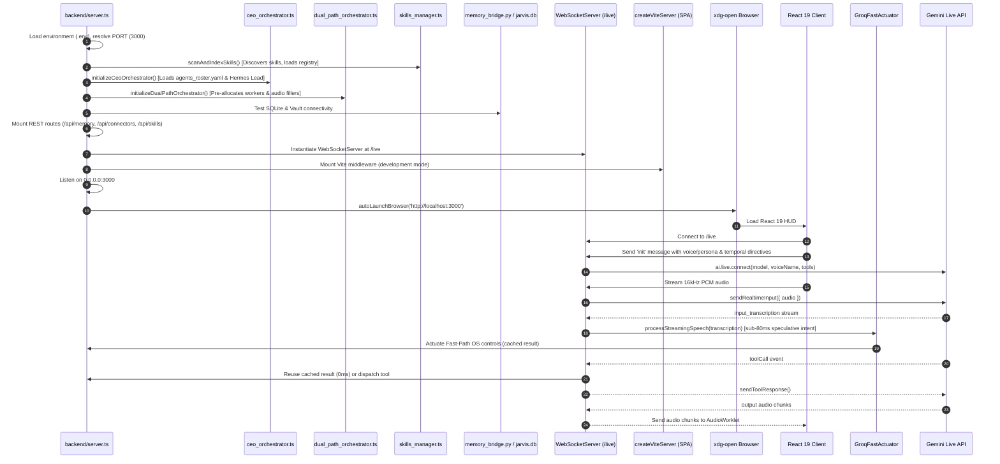

# CODEBASE_REFERENCE.md: J.A.R.V.I.S. Autonomous AI OS Technical Reference Manual

> **Definitive Codebase & Architectural Specification**  
> **System**: J.A.R.V.I.S. Autonomous AI Operating System (React 19 + Express + TypeScript + C++ + Python + Rust + Gemini Live)  
> **Last Verified & Synchronized**: `2026-10-01 18:45:26 IST`  
> **Active Working Branch**: `dev` | **Remote**: `https://github.com/Jarvis-os-tech/JARVIS-V0.git`  

---

## 1. Repository Identity & Core Runtime

*   **Repository Root**: [`/home/g0pi/Downloads/jarvis`](file:///home/g0pi/Downloads/jarvis)
*   **Remote Repository**: `https://github.com/Jarvis-os-tech/JARVIS-V0.git`
*   **Primary Languages & Tech Stacks**:
    *   **Backend Server**: TypeScript / Node.js (ESM), Express 4.21, WebSocket (`ws` 8.21), `@google/genai` (2.4.0), Groq SDK fast actuator, CEO Executive Orchestrator ([`backend/system_modules/ceo/`](file:///home/g0pi/Downloads/jarvis/backend/system_modules/ceo)), Multi-Agent Dual-Path Engine ([`backend/system_modules/intelligent_system/dual_path_orchestrator.ts`](file:///home/g0pi/Downloads/jarvis/backend/system_modules/intelligent_system/dual_path_orchestrator.ts)). Entry point: [`backend/server.ts`](file:///home/g0pi/Downloads/jarvis/backend/server.ts) executed via `tsx`.
    *   **Frontend Client**: React 19.0.1, Vite 6.2.3, Tailwind CSS v4.1.14, Lucide React, Motion, CeoExecutiveHUD ([`frontend/src/components/CeoExecutiveHUD.tsx`](file:///home/g0pi/Downloads/jarvis/frontend/src/components/CeoExecutiveHUD.tsx)). Entry point: [`frontend/src/main.tsx`](file:///home/g0pi/Downloads/jarvis/frontend/src/main.tsx) & [`frontend/src/App.tsx`](file:///home/g0pi/Downloads/jarvis/frontend/src/App.tsx).
    *   **Sub-5ms Native OS Automation**: 18 high-performance C++17 worker binaries compiled with `g++ -O3` in [`whole_controls/native_workers/`](file:///home/g0pi/Downloads/jarvis/whole_controls/native_workers) controlled via direct execution and [`unified_dispatcher.py`](file:///home/g0pi/Downloads/jarvis/whole_controls/python_actuators/unified_dispatcher.py), desktop automation with text deletion (`delete_text`).
    *   **External MCP Connectors**: Google Workspace (Gmail, Calendar, Drive, Docs, Slides, Tasks) and GitHub MCP integrations managed via [`connectors/connectors.py`](file:///home/g0pi/Downloads/jarvis/connectors/connectors.py) and [`connectors/connector-routes.ts`](file:///home/g0pi/Downloads/jarvis/connectors/connector-routes.ts), with Groq speculative actuation protection, relative date parsing, email decoding, and bidirectional SQLite task sync.
    *   **Sovereign 4-Tier Memory Matrix**: SQLite WAL database ([`data/jarvis.db`](file:///home/g0pi/Downloads/jarvis/data/jarvis.db) including `tasks`, `memory_buffer`, and triad tables), Obsidian Markdown vault ([`jarvis_memory_bundle/vault/`](file:///home/g0pi/Downloads/jarvis/jarvis_memory_bundle/vault)), and Rust Memory Engine ([`jarvis_memory_bundle/engine_rust/`](file:///home/g0pi/Downloads/jarvis/jarvis_memory_bundle/engine_rust)).
    *   **Executive Multi-Agent Roster & Skills**: J.A.R.V.I.S. CEO Executive Orchestrator ([`ceo_orchestrator.ts`](file:///home/g0pi/Downloads/jarvis/backend/system_modules/ceo/ceo_orchestrator.ts), [`ceo_roster.ts`](file:///home/g0pi/Downloads/jarvis/backend/system_modules/ceo/ceo_roster.ts), [`agents_roster.yaml`](file:///home/g0pi/Downloads/jarvis/agents_roster.yaml)) orchestrating Hermes as Lead Engineer and 28+ universal skills from `ivfarias/ceo`.
*   **Server Port**: `3000` (managed via `PORT` in `.env` and `Number(process.env.PORT) || 3000` in [`backend/server.ts`](file:///home/g0pi/Downloads/jarvis/backend/server.ts)).
*   **Development Command**: `npm run dev` (executes `tsx backend/server.ts` with embedded Vite middleware).
*   **Browser Auto-Launch**: Upon boot, automatically launches default browser at `http://localhost:3000` via `xdg-open` (Linux), `open` (macOS), or `start` (Windows).
*   **Target Runtimes**: Node.js v20+ / v22+, Python 3.10+, Rust Cargo (edition 2021), Linux (Wayland, Hyprland, Omarchy OS, X11).

---

## 2. Real-Time Git Branch & Commit Telemetry

### Branch Divergence & Release Policy
*   **Branch Policy**: According to [`GEMINI.md`](file:///home/g0pi/Downloads/jarvis/GEMINI.md), **all active development, commits, and pushes MUST target the `dev` branch**. The `main` branch is strictly release-gated and must not receive pushes until the user explicitly confirms (e.g. *"all are ok push to main branch"*).
*   **Current Active Branch**: `dev`
*   **Merge Base**: `79b053072185555a4937a4d88d5400450c746f51`
*   **`dev` Branch Ahead**: `dev` is currently **8 commits ahead** of `main` / `origin/dev`:
    *   `29ae0cc fix(db): correct SQL string literal for OFFLINE status in getGlobalMetrics`
    *   `cc5d868 feat(central_brain): implement sovereign multi-agent memory platform with 5 adapters, two-tier summarizer, dual-format ledger sync, and cascade purge`
    *   `fdb6a65 feat(ceo): integrate ivfarias/ceo skills and executive roster into J.A.R.V.I.S.`
    *   `0e6dddf chore: snapshot prior to UI redesign`
    *   `c29e66b docs: add implementation plan for JARVIS UI redesign`
    *   `bb6ab3e docs: add design spec for JARVIS UI redesign`
    *   `f1f0147 fix(live): eliminate duplicate tool declaration 1007 crash and enable real-time UI memory sync`
    *   `641f07d feat(core): enable desktop text deletion, memory clearing, and multi-agent dual-path engine`

### Git Visual Branch Graph
```text
* 29ae0cc (HEAD -> dev) fix(db): correct SQL string literal for OFFLINE status in getGlobalMetrics
* cc5d868 feat(central_brain): implement sovereign multi-agent memory platform with 5 adapters, two-tier summarizer, dual-format ledger sync, and cascade purge
* fdb6a65 feat(ceo): integrate ivfarias/ceo skills and executive roster into J.A.R.V.I.S.
* 0e6dddf (backup-ui-pre-redesign) chore: snapshot prior to UI redesign
| * ae8aae7 (safety-backup-current-state) chore: snapshot before reverting to previous UI design
| * 08d336c fix(memory): populate default triad memory and add dual-layer fallback in JarvisMemoryVault
| * ef40ecb feat: adopt JarvisMemoryVault from V1 and add toast notifications for Custom Agents and Settings
| * fc06eee feat: implement J.A.R.V.I.S. cockpit UI redesign with Three.js particle orb and collapsible sidebar
| * 77f7d58 chore: install three and @types/three dependencies
|/  
* c29e66b docs: add implementation plan for JARVIS UI redesign
* bb6ab3e docs: add design spec for JARVIS UI redesign
* f1f0147 fix(live): eliminate duplicate tool declaration 1007 crash and enable real-time UI memory sync
* 641f07d feat(core): enable desktop text deletion, memory clearing, and multi-agent dual-path engine
*   79b0530 (origin/main, origin/dev, origin/HEAD, main) Merge branch 'dev' into main
|\  
| * 973888d feat(connectors): enhance Google Workspace & GitHub MCP tools with Groq speculative actuation and date/email normalization
* | c5dd417 Merge branch 'dev' into main
|\| 
| * ca0ecb5 fix(security): remove leaked firebase credentials and load config from environment variables
| * 71ded2c feat(pwa): add progressive web app support for mobile and linux
| * 1d69c7b feat(skills): implement universal skills & plugins engine with textbar /skills command and multi-agent sharing
| * 0a2e775 feat(memory): integrate real SQLite memory and autonomous memory control (add, rewrite, remove)
| * 892aa2f fix: revert global npm cli, restore local project workflow, and fix connector array crash
| * 3f1862e fix(cli): prevent double browser tabs and branch switching
| * 2cd06c3 feat: replace desktop with global NPM CLI
| * b990160 feat(desktop): isolate production desktop runtime from dev workspace with interactive main update gating
| * 7297c8e fix(connectors): resolve callback route precedence and add urlencoded token exchange
```

### Real-Time Commit Log: `dev` Branch (29 commits)

| Commit Hash | Author | Date & Time | Commit Message |
| :--- | :--- | :--- | :--- |
| `29ae0cc` | Jarvis-os-tech | 2026-10-01 18:30:25 +0530 | fix(db): correct SQL string literal for OFFLINE status in getGlobalMetrics |
| `cc5d868` | Jarvis-os-tech | 2026-10-01 18:26:30 +0530 | feat(central_brain): implement sovereign multi-agent memory platform with 5 adapters, two-tier summarizer, dual-format ledger sync, and cascade purge |
| `fdb6a65` | Jarvis-os-tech | 2026-10-01 10:55:23 +0530 | feat(ceo): integrate ivfarias/ceo skills and executive roster into J.A.R.V.I.S. |
| `0e6dddf` | Jarvis-os-tech | 2026-09-29 15:30:44 +0530 | chore: snapshot prior to UI redesign |
| `c29e66b` | Jarvis-os-tech | 2026-09-29 15:28:28 +0530 | docs: add implementation plan for JARVIS UI redesign |
| `bb6ab3e` | Jarvis-os-tech | 2026-09-29 15:23:14 +0530 | docs: add design spec for JARVIS UI redesign |
| `f1f0147` | Jarvis-os-tech | 2026-09-29 15:17:07 +0530 | fix(live): eliminate duplicate tool declaration 1007 crash and enable real-time UI memory sync |
| `641f07d` | Jarvis-os-tech | 2026-09-29 14:54:17 +0530 | feat(core): enable desktop text deletion, memory clearing, and multi-agent dual-path engine |
| `79b0530` | Jarvis-os-tech | 2026-09-29 13:10:49 +0530 | Merge branch 'dev' into main |
| `973888d` | Jarvis-os-tech | 2026-09-29 13:09:24 +0530 | feat(connectors): enhance Google Workspace & GitHub MCP tools with Groq speculative actuation and date/email normalization |
| `c5dd417` | Jarvis-os-tech | 2026-09-29 10:37:13 +0530 | Merge branch 'dev' into main |
| `ca0ecb5` | Jarvis-os-tech | 2026-09-29 10:28:44 +0530 | fix(security): remove leaked firebase credentials and load config from environment variables |
| `6a6ed52` | Jarvis-os-tech | 2026-09-29 10:10:32 +0530 | feat(pwa): add progressive web app support for mobile and linux |
| `71ded2c` | Jarvis-os-tech | 2026-09-29 10:10:32 +0530 | feat(pwa): add progressive web app support for mobile and linux |
| `1d69c7b` | Jarvis-os-tech | 2026-09-28 22:20:58 +0530 | feat(skills): implement universal skills & plugins engine with textbar /skills command and multi-agent sharing |
| `0a2e775` | Jarvis-os-tech | 2026-09-28 21:53:53 +0530 | feat(memory): integrate real SQLite memory and autonomous memory control (add, rewrite, remove) |
| `892aa2f` | Jarvis-os-tech | 2026-09-28 19:39:24 +0530 | fix: revert global npm cli, restore local project workflow, and fix connector array crash |
| `3f1862e` | Jarvis-os-tech | 2026-09-28 08:43:28 +0530 | fix(cli): prevent double browser tabs and branch switching |
| `2cd06c3` | Jarvis-os-tech | 2026-09-28 08:37:30 +0530 | feat: replace desktop with global NPM CLI |
| `b990160` | Jarvis-os-tech | 2026-09-28 07:52:43 +0530 | feat(desktop): isolate production desktop runtime from dev workspace with interactive main update gating |
| `c7612d2` | Jarvis-os-tech | 2026-09-28 07:21:45 +0530 | feat(connectors): add MCP connectors with Python engine and HUD UI |
| `7297c8e` | Jarvis-os-tech | 2026-09-28 07:13:40 +0530 | fix(connectors): resolve callback route precedence and add urlencoded token exchange |
| `27ed8ef` | Jarvis-os-tech | 2026-09-28 07:00:53 +0530 | feat(mid-sentence): add Groq ultra-fast mid-sentence tool actuator with direct C++ native execution |
| `0250c9c` | Jarvis-os-tech | 2026-09-27 16:26:33 +0530 | chore: sync .release_commit with latest production sha |
| `416af49` | Jarvis-os-tech | 2026-09-27 16:23:00 +0530 | feat(desktop): add native browser app launcher, server supervisor, and production main updater |
| `0d483c1` | Jarvis-os-tech | 2026-09-27 15:11:21 +0530 | feat: integrate dynamic OS controls, parallel tools, and AudioWorklet voice engine |
| `8b65452` | Jarvis-os-tech | 2026-09-27 07:37:19 +0530 | docs: establish dev branch workflow and main branch release gate |
| `12436ce` | Jarvis-os-tech | 2026-09-27 07:25:44 +0530 | feat(memory): integrate dynamic self-improving memory bundle with live audio fixes |
| `0ffeb32` | Jarvis-os-tech | 2026-09-26 19:20:39 +0530 | feat: initial commit for JARVIS-V0 |

### Real-Time Commit Log: `main` Branch (21 commits)

| Commit Hash | Author | Date & Time | Commit Message |
| :--- | :--- | :--- | :--- |
| `79b0530` | Jarvis-os-tech | 2026-09-29 13:10:49 +0530 | Merge branch 'dev' into main |
| `973888d` | Jarvis-os-tech | 2026-09-29 13:09:24 +0530 | feat(connectors): enhance Google Workspace & GitHub MCP tools with Groq speculative actuation and date/email normalization |
| `c5dd417` | Jarvis-os-tech | 2026-09-29 10:37:13 +0530 | Merge branch 'dev' into main |
| `ca0ecb5` | Jarvis-os-tech | 2026-09-29 10:28:44 +0530 | fix(security): remove leaked firebase credentials and load config from environment variables |
| `6a6ed52` | Jarvis-os-tech | 2026-09-29 10:10:32 +0530 | feat(pwa): add progressive web app support for mobile and linux |
| `71ded2c` | Jarvis-os-tech | 2026-09-29 10:10:32 +0530 | feat(pwa): add progressive web app support for mobile and linux |
| `1d69c7b` | Jarvis-os-tech | 2026-09-28 22:20:58 +0530 | feat(skills): implement universal skills & plugins engine with textbar /skills command and multi-agent sharing |
| `0a2e775` | Jarvis-os-tech | 2026-09-28 21:53:53 +0530 | feat(memory): integrate real SQLite memory and autonomous memory control (add, rewrite, remove) |
| `892aa2f` | Jarvis-os-tech | 2026-09-28 19:39:24 +0530 | fix: revert global npm cli, restore local project workflow, and fix connector array crash |
| `3f1862e` | Jarvis-os-tech | 2026-09-28 08:43:28 +0530 | fix(cli): prevent double browser tabs and branch switching |
| `2cd06c3` | Jarvis-os-tech | 2026-09-28 08:37:30 +0530 | feat: replace desktop with global NPM CLI |
| `b990160` | Jarvis-os-tech | 2026-09-28 07:52:43 +0530 | feat(desktop): isolate production desktop runtime from dev workspace with interactive main update gating |
| `c7612d2` | Jarvis-os-tech | 2026-09-28 07:21:45 +0530 | feat(connectors): add MCP connectors with Python engine and HUD UI |
| `7297c8e` | Jarvis-os-tech | 2026-09-28 07:13:40 +0530 | fix(connectors): resolve callback route precedence and add urlencoded token exchange |
| `27ed8ef` | Jarvis-os-tech | 2026-09-28 07:00:53 +0530 | feat(mid-sentence): add Groq ultra-fast mid-sentence tool actuator with direct C++ native execution |
| `0250c9c` | Jarvis-os-tech | 2026-09-27 16:26:33 +0530 | chore: sync .release_commit with latest production sha |
| `416af49` | Jarvis-os-tech | 2026-09-27 16:23:00 +0530 | feat(desktop): add native browser app launcher, server supervisor, and production main updater |
| `0d483c1` | Jarvis-os-tech | 2026-09-27 15:11:21 +0530 | feat: integrate dynamic OS controls, parallel tools, and AudioWorklet voice engine |
| `8b65452` | Jarvis-os-tech | 2026-09-27 07:37:19 +0530 | docs: establish dev branch workflow and main branch release gate |
| `12436ce` | Jarvis-os-tech | 2026-09-27 07:25:44 +0530 | feat(memory): integrate dynamic self-improving memory bundle with live audio fixes |
| `0ffeb32` | Jarvis-os-tech | 2026-09-26 19:20:39 +0530 | feat: initial commit for JARVIS-V0 |

### Real-Time Working Tree Status
```text
M GEMINI.md
 M backend/server.ts
 M backend/system_modules/intelligent_system/autonomous_engine.ts
 M backend/system_modules/intelligent_system/groq_fast_actuator.ts
 M backend/system_modules/intelligent_system/system_controls.ts
 M central_brain/frontend/index.html
 M central_brain/frontend/src/components/DataCurationModal.tsx
 M central_brain/frontend/src/components/LivePipelineView.tsx
 M package.json
 M project_docs/COWORKERS.md
 M scripts/update_codebase_reference.py
 M skills/skills_registry.json
 M whole_controls/native_workers/bin/omarchy_ctrl
 M whole_controls/native_workers/bin/open_app
 M whole_controls/native_workers/omarchy_ctrl.cpp
 M whole_controls/native_workers/open_app.cpp
 M whole_controls/python_actuators/app_launcher.py
 M whole_controls/python_actuators/omarchy_skills.py
 M whole_controls/python_actuators/unified_dispatcher.py
 M whole_controls/voice_agent_bridge/tool_declarations.json
?? .omnirush/
?? CODEBASE_REFERENCE.md
?? backend/system_modules/intelligent_system/dynamic_resolver.ts
?? backend/system_modules/intelligent_system/experience_learner.ts
?? backend/system_modules/intelligent_system/internet_knowledge_gatherer.ts
?? backend/system_modules/intelligent_system/omarchy_quattro_core.ts
?? backend/system_modules/intelligent_system/self_repair.ts
?? scratch/
?? skills/diagnose-crash/
?? skills/omarchy/
```

---

## 3. Full Dependency Inventory

### Production Dependencies (`package.json`)
*   **`@google/genai` (^2.4.0)**: Core SDK powering Google Gemini 2.5 / 3.8 models, WebSocket Live Bidirectional streaming audio session (`/live`), text generations, multimodal image ingestion, and tool response loops.
*   **`express` (^4.21.2)**: Core HTTP application server. Routes memory endpoints, OAuth authentication callbacks, skills management APIs, and health checks.
*   **`ws` (^8.21.3)**: High-performance WebSocket server bound to `/live` for bidirectional audio/video/text streaming between React client and Gemini Live.
*   **`react` (^19.0.1) & `react-dom` (^19.0.1)**: Modern React 19 SPA powering the holographic Arc-Reactor HUD, memory inspection modals, CeoExecutiveHUD, and coworker switching.
*   **`vite` (^6.2.3)**: Frontend bundler and development server, embedded as Express middleware in development mode for instant Hot Module Replacement (HMR).
*   **`@tailwindcss/vite` (^4.1.14) & `tailwindcss` (^4.1.14)**: Next-generation Tailwind CSS v4 styling engine providing responsive cyan HUD aesthetics.
*   **`motion` (^12.23.24)**: High-fps hardware-accelerated fluid UI physics and micro-interactions for persona cards and audio wave pulses.
*   **`lucide-react` (^0.546.0)**: Complete icon library for Arc-Reactor controls, connectors, hardware stats, and coworker avatars.
*   **`dotenv` (^17.2.3)**: Loads environment secrets from `.env` (API keys, ports, Groq credentials, OAuth configs).
*   **`googleapis` (^174.0.1)** & **`@react-oauth/google` (^0.13.5)**: Google Workspace and OAuth client integration.
*   **`firebase` (^12.19.0)**: Firebase applet configuration integration.

### Development Dependencies
*   **`tsx` (^4.21.0)**: TypeScript execute daemon running [`backend/server.ts`](file:///home/g0pi/Downloads/jarvis/backend/server.ts) with zero build overhead.
*   **`typescript` (~5.8.2)**: Strict type checking (`tsc --noEmit`) across server, system modules, and frontend.
*   **`esbuild` (^0.25.0)**: Ultra-fast bundler backing Vite and TypeScript transforms.

### Rust Engine Dependencies (`jarvis_memory_bundle/engine_rust/Cargo.toml`)
*   **`tokio` (1.36)**: Asynchronous runtime with full multi-threading and timers.
*   **`axum` (0.7)**: Ergonomic Web & REST server running on port `50051`.
*   **`rusqlite` (0.31)**: Bundled SQLite client with FTS5 full-text search extensions.
*   **`serde` & `serde_json` (1.0)**: High-speed JSON serialization for graph nodes, memory triples, and diary events.

---

## 4. Startup & Runtime Flow

The complete boot lifecycle is orchestrated inside [`backend/server.ts`](file:///home/g0pi/Downloads/jarvis/backend/server.ts):



### Step-by-Step Prose Boot Sequence
1.  **Environment Ingestion**: Reads `.env` from workspace root. Checks `GEMINI_API_KEY`, `GROQ_API_KEY`, `PORT` (3000), `AUTO_LAUNCH` flag, and `OPERATOR_NAME`.
2.  **Universal Skills Scan**: [`skills_manager.ts`](file:///home/g0pi/Downloads/jarvis/backend/skills_manager.ts) inspects `./skills/`, `./.agents/skills/`, and `~/.agents/skills/`, parses `SKILL.md` frontmatter, extracts automation scripts, and updates [`skills/skills_registry.json`](file:///home/g0pi/Downloads/jarvis/skills/skills_registry.json).
3.  **CEO Orchestrator & Roster Initialization**: [`ceo_orchestrator.ts`](file:///home/g0pi/Downloads/jarvis/backend/system_modules/ceo/ceo_orchestrator.ts) ingests [`agents_roster.yaml`](file:///home/g0pi/Downloads/jarvis/agents_roster.yaml), loads active agent personas, and binds Hermes as Lead Engineer for multi-agent workflows.
4.  **Multi-Agent Dual-Path Engine Warmup**: [`dual_path_orchestrator.ts`](file:///home/g0pi/Downloads/jarvis/backend/system_modules/intelligent_system/dual_path_orchestrator.ts) prepares the fast path (<10ms) and slow path (<300ms SLA with [`filler_audio_synthesizer.ts`](file:///home/g0pi/Downloads/jarvis/backend/system_modules/intelligent_system/filler_audio_synthesizer.ts)).
5.  **Memory Subsystem Bridge**: Initializes SQLite connection to [`data/jarvis.db`](file:///home/g0pi/Downloads/jarvis/data/jarvis.db) and verifies Obsidian vault paths in [`jarvis_memory_bundle/vault/`](file:///home/g0pi/Downloads/jarvis/jarvis_memory_bundle/vault).
6.  **REST Route Mounting**: Registers `/api/health`, `/api/memory/*` (including `/clear` and `/:category/clear`), `/api/connectors/*` (from [`connectors/connector-routes.ts`](file:///home/g0pi/Downloads/jarvis/connectors/connector-routes.ts)), `/api/skills/*`, and `/api/chat` fallback.
7.  **WebSocket Gateway Creation**: Hooks `ws.WebSocketServer` onto the HTTP server at endpoint `/live`.
8.  **Vite Dev Server Integration & Auto-Launch**: In dev mode, creates a Vite server in middleware mode targeting [`frontend/`](file:///home/g0pi/Downloads/jarvis/frontend). Binds to `0.0.0.0:3000` and invokes `autoLaunchBrowser('http://localhost:3000')` via `xdg-open`.

---

## 5. Complete Module Map (All 635 Files)

Below is an exhaustive, 100% complete accounting of every single source file in the repository (635 files cataloged across 10 subsections with zero omissions):

### 5.1 Backend Server, CEO System & Intelligent Core (`backend/`) (41 files)

| File Path | Lines | Role | Verified Responsibilities |
| :--- | :---: | :--- | :--- |
| [backend/README.md](file:///home/g0pi/Downloads/jarvis/backend/README.md) | 23 | Backend Documentation | Overview of backend services and execution instructions. |
| [backend/__tests__/dual_path_orchestrator.test.ts](file:///home/g0pi/Downloads/jarvis/backend/__tests__/dual_path_orchestrator.test.ts) | 276 | Dual-Path Test Suite | Unit and integration tests for fast vs slow path routing and latency constraints. |
| [backend/__tests__/memory_and_text_deletion.test.ts](file:///home/g0pi/Downloads/jarvis/backend/__tests__/memory_and_text_deletion.test.ts) | 133 | Memory & Deletion Tests | Validates clear_memory, memory removal endpoints, and desktop delete_text actuation. |
| [backend/memory_bridge.py](file:///home/g0pi/Downloads/jarvis/backend/memory_bridge.py) | 544 | Memory Bridge Subprocess | Python CLI bridge connecting Express with SQLite triad tables (personal_details, preferences, instructions) and Obsidian vault. |
| [backend/server.ts](file:///home/g0pi/Downloads/jarvis/backend/server.ts) | 1869 | Core Server & WS Gateway | Express router, Gemini Live WebSocket (/live), Groq fast actuator integration, tool dispatching, Vite middleware, temporal directives. |
| [backend/skills_manager.ts](file:///home/g0pi/Downloads/jarvis/backend/skills_manager.ts) | 575 | Universal Skills Engine | Scans, parses, installs, and executes domain skills across project, local .agents, and global home directories. |
| [backend/system_modules/ceo/ceo_orchestrator.ts](file:///home/g0pi/Downloads/jarvis/backend/system_modules/ceo/ceo_orchestrator.ts) | 339 | CEO Executive Orchestrator | Core orchestration engine implementing ivfarias/ceo framework, managing multi-agent roster and mission workflows. |
| [backend/system_modules/ceo/ceo_roster.ts](file:///home/g0pi/Downloads/jarvis/backend/system_modules/ceo/ceo_roster.ts) | 285 | CEO Agent Roster Loader | Parses agents_roster.yaml, validating active agent personas, capabilities, and system prompts. |
| [backend/system_modules/ceo/ceo_session_logger.ts](file:///home/g0pi/Downloads/jarvis/backend/system_modules/ceo/ceo_session_logger.ts) | 229 | CEO Session Logger | Persists executive decisions, delegation logs, and mission lifecycles in durable session logs. |
| [backend/system_modules/ceo/ceo_tools.ts](file:///home/g0pi/Downloads/jarvis/backend/system_modules/ceo/ceo_tools.ts) | 147 | CEO Live Tools | Declares ceo_get_roster, ceo_execute_mission, ceo_prescribe_workflow, and ceo_query_agent_sessions. |
| [backend/system_modules/ceo/index.ts](file:///home/g0pi/Downloads/jarvis/backend/system_modules/ceo/index.ts) | 4 | CEO Module Exports | Re-exports orchestrator, roster, logger, and tools for server consumption. |
| [backend/system_modules/intelligent_system/agent_memory.ts](file:///home/g0pi/Downloads/jarvis/backend/system_modules/intelligent_system/agent_memory.ts) | 156 | 4-Tier Memory Controller | Coordinates short-term, episodic, semantic, and long-term memory operations for autonomous agents. |
| [backend/system_modules/intelligent_system/automatic_greeting.ts](file:///home/g0pi/Downloads/jarvis/backend/system_modules/intelligent_system/automatic_greeting.ts) | 87 | Context-Aware Greeting | Generates dynamic greetings based on time of day, system status, and recent tasks. |
| [backend/system_modules/intelligent_system/autonomous_engine.test.ts](file:///home/g0pi/Downloads/jarvis/backend/system_modules/intelligent_system/autonomous_engine.test.ts) | 27 | Autonomous Engine Tests | Validates background loop execution and task scheduling. |
| [backend/system_modules/intelligent_system/autonomous_engine.ts](file:///home/g0pi/Downloads/jarvis/backend/system_modules/intelligent_system/autonomous_engine.ts) | 101 | Autonomous Engine | Background task loop driving proactive assistant operations. |
| [backend/system_modules/intelligent_system/brain_core.ts](file:///home/g0pi/Downloads/jarvis/backend/system_modules/intelligent_system/brain_core.ts) | 235 | Intelligent Brain Core | Central decision and reasoning coordinator for autonomous actions and proactive assistance. |
| [backend/system_modules/intelligent_system/dual_path_orchestrator.ts](file:///home/g0pi/Downloads/jarvis/backend/system_modules/intelligent_system/dual_path_orchestrator.ts) | 346 | Dual-Path Orchestrator | Routes user voice requests to Fast Path (<10ms) or Slow Path (<300ms SLA) with instant audio filler synthesis. |
| [backend/system_modules/intelligent_system/dual_path_types.ts](file:///home/g0pi/Downloads/jarvis/backend/system_modules/intelligent_system/dual_path_types.ts) | 117 | Dual-Path Type Definitions | TypeScript interfaces for execution paths, agent pools, and audio filler buffers. |
| [backend/system_modules/intelligent_system/dynamic_resolver.ts](file:///home/g0pi/Downloads/jarvis/backend/system_modules/intelligent_system/dynamic_resolver.ts) | 251 | Dynamic System Resolver | Dynamic command, path, and intent resolution engine that prevents brittle hardcoded assumptions. |
| [backend/system_modules/intelligent_system/experience_learner.ts](file:///home/g0pi/Downloads/jarvis/backend/system_modules/intelligent_system/experience_learner.ts) | 126 | Continuous Experience Learner | Records execution episodes, diagnoses outcomes, and extracts behavioral rules into memory. |
| [backend/system_modules/intelligent_system/file_controls.test.ts](file:///home/g0pi/Downloads/jarvis/backend/system_modules/intelligent_system/file_controls.test.ts) | 52 | File Controls Unit Tests | Tests file operations and path boundary traversal protections. |
| [backend/system_modules/intelligent_system/file_controls.ts](file:///home/g0pi/Downloads/jarvis/backend/system_modules/intelligent_system/file_controls.ts) | 223 | Local File Controls | Provides write_file, append_file, rewrite_file, remove_file, read_file, and list_directory with protected system path guards. |
| [backend/system_modules/intelligent_system/filler_audio_synthesizer.ts](file:///home/g0pi/Downloads/jarvis/backend/system_modules/intelligent_system/filler_audio_synthesizer.ts) | 190 | Vocal Filler Synthesizer | Synthesizes or buffers conversational vocal fillers to eliminate silence during slow-path reasoning. |
| [backend/system_modules/intelligent_system/groq_fast_actuator.ts](file:///home/g0pi/Downloads/jarvis/backend/system_modules/intelligent_system/groq_fast_actuator.ts) | 705 | Groq Fast Actuator | Sub-80ms speculative intent parser with connector tool registration, anti-hijacking guard, and mutating tool execution protection. |
| [backend/system_modules/intelligent_system/intelligent_types.ts](file:///home/g0pi/Downloads/jarvis/backend/system_modules/intelligent_system/intelligent_types.ts) | 50 | System Type Definitions | TypeScript interfaces for personas, tools, memory entries, and voice transfer events. |
| [backend/system_modules/intelligent_system/intent_router.ts](file:///home/g0pi/Downloads/jarvis/backend/system_modules/intelligent_system/intent_router.ts) | 276 | Dual-Path Intent Router | Classifies streaming user transcripts to identify required execution speed and agent specialization. |
| [backend/system_modules/intelligent_system/internet_knowledge_gatherer.ts](file:///home/g0pi/Downloads/jarvis/backend/system_modules/intelligent_system/internet_knowledge_gatherer.ts) | 129 | Internet Knowledge Gatherer | Proactive external documentation, manpage, and web search fetcher for real-time problem-solving. |
| [backend/system_modules/intelligent_system/key_pool_rotator.ts](file:///home/g0pi/Downloads/jarvis/backend/system_modules/intelligent_system/key_pool_rotator.ts) | 169 | API Key Pool Rotator | Rotates across Gemini and Groq API keys to prevent rate-limiting and maximize uptime. |
| [backend/system_modules/intelligent_system/multi_agent_pool.ts](file:///home/g0pi/Downloads/jarvis/backend/system_modules/intelligent_system/multi_agent_pool.ts) | 347 | Multi-Agent Pool | Manages warm agent workers and dispatches complex tasks across agent instances. |
| [backend/system_modules/intelligent_system/omarchy_quattro_core.ts](file:///home/g0pi/Downloads/jarvis/backend/system_modules/intelligent_system/omarchy_quattro_core.ts) | 428 | Omarchy Quattro Engine | Pre-built Omarchy 4 core integrating 367+ command center tools directly into J.A.R.V.I.S. |
| [backend/system_modules/intelligent_system/personas.ts](file:///home/g0pi/Downloads/jarvis/backend/system_modules/intelligent_system/personas.ts) | 94 | Coworker Personas Matrix | Defines the 6 specialized AI Coworker personas (Jarvis, Friday, Ultron, Edith, Karen, Vision) with voice models and prompt rules. |
| [backend/system_modules/intelligent_system/self_repair.ts](file:///home/g0pi/Downloads/jarvis/backend/system_modules/intelligent_system/self_repair.ts) | 257 | Autonomous Self-Repair Engine | Intercepts command and tool failures, probes alternative strategies, and heals system automatically. |
| [backend/system_modules/intelligent_system/system_controls.ts](file:///home/g0pi/Downloads/jarvis/backend/system_modules/intelligent_system/system_controls.ts) | 284 | OS Control Actuator | Dispatches Gemini Live tool calls to compiled native C++ workers or unified_dispatcher.py with sub-10ms latency. |
| [backend/system_modules/intelligent_system/system_environment.ts](file:///home/g0pi/Downloads/jarvis/backend/system_modules/intelligent_system/system_environment.ts) | 110 | System Environment Detector | Detects OS, desktop environment (Hyprland, Wayland, X11), display servers, and audio subsystems. |
| [backend/system_modules/intelligent_system/voice_transfer_protocol.ts](file:///home/g0pi/Downloads/jarvis/backend/system_modules/intelligent_system/voice_transfer_protocol.ts) | 134 | Voice Transfer Protocol | Handles sub-second persona handoffs and voice identity switching without session tear-down. |
| [backend/system_modules/intelligent_system/workspace_tools.ts](file:///home/g0pi/Downloads/jarvis/backend/system_modules/intelligent_system/workspace_tools.ts) | 290 | Workspace Tool Declarations | Defines project-level file, terminal, and search tools for developer assistance. |
| [backend/system_modules/voice_latency/audio_latency_types.ts](file:///home/g0pi/Downloads/jarvis/backend/system_modules/voice_latency/audio_latency_types.ts) | 22 | Audio Latency Interfaces | Type contracts for audio buffers, latency stats, and telemetry events. |
| [backend/system_modules/voice_latency/audio_processor.ts](file:///home/g0pi/Downloads/jarvis/backend/system_modules/voice_latency/audio_processor.ts) | 90 | Audio Buffer Processor | PCM16 / Float32 conversion and real-time audio normalization. |
| [backend/system_modules/voice_latency/audio_queue_player.ts](file:///home/g0pi/Downloads/jarvis/backend/system_modules/voice_latency/audio_queue_player.ts) | 138 | Server Audio Queue | Schedules and buffers synthesized model audio frames. |
| [backend/system_modules/voice_latency/latency_optimizations.ts](file:///home/g0pi/Downloads/jarvis/backend/system_modules/voice_latency/latency_optimizations.ts) | 93 | Latency Tuning Utilities | Jitter buffering, chunk sizing, and silence truncation algorithms. |
| [backend/system_modules/voice_latency/websocket_streamer.ts](file:///home/g0pi/Downloads/jarvis/backend/system_modules/voice_latency/websocket_streamer.ts) | 182 | WebSocket Audio Streamer | Optimized low-latency binary PCM audio chunk streamer. |

### 5.2 External MCP Connectors & UI (`connectors/`) (20 files)

| File Path | Lines | Role | Verified Responsibilities |
| :--- | :---: | :--- | :--- |
| [connectors/BUILD_GUIDE.md](file:///home/g0pi/Downloads/jarvis/connectors/BUILD_GUIDE.md) | 402 | Connector Build Manual | Comprehensive developer guide for extending Google & GitHub integrations. |
| [connectors/README.md](file:///home/g0pi/Downloads/jarvis/connectors/README.md) | 55 | Connectors Documentation | Architectural overview and setup guide for external integrations. |
| [connectors/__init__.py](file:///home/g0pi/Downloads/jarvis/connectors/__init__.py) | 32 | Python Module Init | Python package marker for connectors module. |
| [connectors/connector-agent.ts](file:///home/g0pi/Downloads/jarvis/connectors/connector-agent.ts) | 101 | Connector Dispatcher | TypeScript bridge declaring 26 connector tools and forwarding calls to connectors.py via execFile. |
| [connectors/connector-registry.ts](file:///home/g0pi/Downloads/jarvis/connectors/connector-registry.ts) | 306 | Connector Tool Registry | Comprehensive parameter schemas and uppercase type metadata (OBJECT, STRING, ARRAY) for all Google and GitHub tools. |
| [connectors/connector-routes.ts](file:///home/g0pi/Downloads/jarvis/connectors/connector-routes.ts) | 139 | Connector REST Routes | Express endpoints for connector listing, status polling, OAuth callbacks, and token management. |
| [connectors/connector-service.ts](file:///home/g0pi/Downloads/jarvis/connectors/connector-service.ts) | 72 | Connector Service Client | Client-side connector management and token exchange operations. |
| [connectors/connectors.py](file:///home/g0pi/Downloads/jarvis/connectors/connectors.py) | 982 | Python Connector Engine | Autonomous engine managing Google Workspace (Gmail, Calendar, Drive, Docs, Slides, Tasks) and GitHub MCP tool execution, date parsing, email decoding, and token encryption. |
| [connectors/github-mcp.ts](file:///home/g0pi/Downloads/jarvis/connectors/github-mcp.ts) | 23 | GitHub MCP Client | Helper declarations for GitHub repos, issues, pull requests, and notifications. |
| [connectors/google-mcp.ts](file:///home/g0pi/Downloads/jarvis/connectors/google-mcp.ts) | 39 | Google Workspace MCP | Helper declarations for Gmail, Calendar, Drive, Docs, and Tasks. |
| [connectors/index.ts](file:///home/g0pi/Downloads/jarvis/connectors/index.ts) | 13 | Connectors Index | Exports connector dispatchers and route configurations. |
| [connectors/types.ts](file:///home/g0pi/Downloads/jarvis/connectors/types.ts) | 69 | Connector Type Definitions | Interfaces for OAuth tokens, connector states, and tool execution payloads. |
| [connectors/ui/ConnectorButton.tsx](file:///home/g0pi/Downloads/jarvis/connectors/ui/ConnectorButton.tsx) | 90 | HUD Action Button | Toolbar button launching the Connectors modal with connection indicator dot. |
| [connectors/ui/ConnectorCard.tsx](file:///home/g0pi/Downloads/jarvis/connectors/ui/ConnectorCard.tsx) | 100 | Connector Card Widget | Interactive card for a single connector with connect/disconnect actions and tool badges. |
| [connectors/ui/ConnectorDetail.tsx](file:///home/g0pi/Downloads/jarvis/connectors/ui/ConnectorDetail.tsx) | 229 | Connector Detail Modal | Shows detailed scopes, tool lists, and troubleshooting info for an integration. |
| [connectors/ui/ConnectorMenu.tsx](file:///home/g0pi/Downloads/jarvis/connectors/ui/ConnectorMenu.tsx) | 93 | Context Menu | Quick popover menu for inspecting connector status. |
| [connectors/ui/ConnectorsView.tsx](file:///home/g0pi/Downloads/jarvis/connectors/ui/ConnectorsView.tsx) | 198 | Connectors HUD View | Main modal view rendering all available integration cards and connection states. |
| [connectors/ui/connector-types.ts](file:///home/g0pi/Downloads/jarvis/connectors/ui/connector-types.ts) | 40 | UI Connector Types | React prop and state interfaces for connector components. |
| [connectors/ui/index.ts](file:///home/g0pi/Downloads/jarvis/connectors/ui/index.ts) | 12 | UI Index | Re-exports all UI components for connectors. |
| [connectors/ui/useConnectors.ts](file:///home/g0pi/Downloads/jarvis/connectors/ui/useConnectors.ts) | 206 | Connectors React Hook | Manages connector fetch, status polling, and OAuth trigger state. |

### 5.3 Native Workers & System Controls (`whole_controls/`) (53 files)

| File Path | Lines | Role | Verified Responsibilities |
| :--- | :---: | :--- | :--- |
| [whole_controls/GUIDE_VOICE_AGENT_PARALLEL_INTEGRATION.md](file:///home/g0pi/Downloads/jarvis/whole_controls/GUIDE_VOICE_AGENT_PARALLEL_INTEGRATION.md) | 374 | Integration Architecture Guide | Defines the sub-10ms C++ execution model and parallel tool execution guidelines. |
| [whole_controls/native_workers/Makefile](file:///home/g0pi/Downloads/jarvis/whole_controls/native_workers/Makefile) | 19 | Native C++ Build Makefile | Compiles all 18 C++ workers with g++ -O3 -Wall -Wextra -std=c++17 into bin/. |
| [whole_controls/native_workers/bin/desktop_control](file:///home/g0pi/Downloads/jarvis/whole_controls/native_workers/bin/desktop_control) | 422 | Compiled C++ Native Binary | High-performance ELF binary compiled with -O3 for 'desktop_control' system action. |
| [whole_controls/native_workers/bin/file_search](file:///home/g0pi/Downloads/jarvis/whole_controls/native_workers/bin/file_search) | 79 | Compiled C++ Native Binary | High-performance ELF binary compiled with -O3 for 'file_search' system action. |
| [whole_controls/native_workers/bin/firewall_audit](file:///home/g0pi/Downloads/jarvis/whole_controls/native_workers/bin/firewall_audit) | 133 | Compiled C++ Native Binary | High-performance ELF binary compiled with -O3 for 'firewall_audit' system action. |
| [whole_controls/native_workers/bin/hardware_ctrl](file:///home/g0pi/Downloads/jarvis/whole_controls/native_workers/bin/hardware_ctrl) | 243 | Compiled C++ Native Binary | High-performance ELF binary compiled with -O3 for 'hardware_ctrl' system action. |
| [whole_controls/native_workers/bin/jarvis_sysctl](file:///home/g0pi/Downloads/jarvis/whole_controls/native_workers/bin/jarvis_sysctl) | 77 | Compiled C++ Native Binary | High-performance ELF binary compiled with -O3 for 'jarvis_sysctl' system action. |
| [whole_controls/native_workers/bin/media_ctrl](file:///home/g0pi/Downloads/jarvis/whole_controls/native_workers/bin/media_ctrl) | 82 | Compiled C++ Native Binary | High-performance ELF binary compiled with -O3 for 'media_ctrl' system action. |
| [whole_controls/native_workers/bin/memory_tester](file:///home/g0pi/Downloads/jarvis/whole_controls/native_workers/bin/memory_tester) | 104 | Compiled C++ Native Binary | High-performance ELF binary compiled with -O3 for 'memory_tester' system action. |
| [whole_controls/native_workers/bin/net_inspector](file:///home/g0pi/Downloads/jarvis/whole_controls/native_workers/bin/net_inspector) | 121 | Compiled C++ Native Binary | High-performance ELF binary compiled with -O3 for 'net_inspector' system action. |
| [whole_controls/native_workers/bin/omarchy_ctrl](file:///home/g0pi/Downloads/jarvis/whole_controls/native_workers/bin/omarchy_ctrl) | 114 | Compiled C++ Native Binary | High-performance ELF binary compiled with -O3 for 'omarchy_ctrl' system action. |
| [whole_controls/native_workers/bin/open_app](file:///home/g0pi/Downloads/jarvis/whole_controls/native_workers/bin/open_app) | 76 | Compiled C++ Native Binary | High-performance ELF binary compiled with -O3 for 'open_app' system action. |
| [whole_controls/native_workers/bin/pc_spec](file:///home/g0pi/Downloads/jarvis/whole_controls/native_workers/bin/pc_spec) | 561 | Compiled C++ Native Binary | High-performance ELF binary compiled with -O3 for 'pc_spec' system action. |
| [whole_controls/native_workers/bin/process_ctrl](file:///home/g0pi/Downloads/jarvis/whole_controls/native_workers/bin/process_ctrl) | 305 | Compiled C++ Native Binary | High-performance ELF binary compiled with -O3 for 'process_ctrl' system action. |
| [whole_controls/native_workers/bin/service_ctrl](file:///home/g0pi/Downloads/jarvis/whole_controls/native_workers/bin/service_ctrl) | 136 | Compiled C++ Native Binary | High-performance ELF binary compiled with -O3 for 'service_ctrl' system action. |
| [whole_controls/native_workers/bin/storage_scan](file:///home/g0pi/Downloads/jarvis/whole_controls/native_workers/bin/storage_scan) | 129 | Compiled C++ Native Binary | High-performance ELF binary compiled with -O3 for 'storage_scan' system action. |
| [whole_controls/native_workers/bin/sys_telemetry](file:///home/g0pi/Downloads/jarvis/whole_controls/native_workers/bin/sys_telemetry) | 126 | Compiled C++ Native Binary | High-performance ELF binary compiled with -O3 for 'sys_telemetry' system action. |
| [whole_controls/native_workers/bin/thermal_scan](file:///home/g0pi/Downloads/jarvis/whole_controls/native_workers/bin/thermal_scan) | 136 | Compiled C++ Native Binary | High-performance ELF binary compiled with -O3 for 'thermal_scan' system action. |
| [whole_controls/native_workers/bin/vision_ctrl](file:///home/g0pi/Downloads/jarvis/whole_controls/native_workers/bin/vision_ctrl) | 143 | Compiled C++ Native Binary | High-performance ELF binary compiled with -O3 for 'vision_ctrl' system action. |
| [whole_controls/native_workers/bin/wifi_scan](file:///home/g0pi/Downloads/jarvis/whole_controls/native_workers/bin/wifi_scan) | 142 | Compiled C++ Native Binary | High-performance ELF binary compiled with -O3 for 'wifi_scan' system action. |
| [whole_controls/native_workers/desktop_control.cpp](file:///home/g0pi/Downloads/jarvis/whole_controls/native_workers/desktop_control.cpp) | 894 | C++ Desktop Automation Worker | Simulates mouse movement, clicks, typing, and key combinations via X11/uinput interop. |
| [whole_controls/native_workers/file_search.cpp](file:///home/g0pi/Downloads/jarvis/whole_controls/native_workers/file_search.cpp) | 177 | C++ Fast File Search Worker | Multi-threaded recursive directory search for filenames and patterns. |
| [whole_controls/native_workers/firewall_audit.cpp](file:///home/g0pi/Downloads/jarvis/whole_controls/native_workers/firewall_audit.cpp) | 189 | C++ Firewall Security Worker | Audits iptables / nftables / ufw security rules and open ports. |
| [whole_controls/native_workers/hardware_ctrl.cpp](file:///home/g0pi/Downloads/jarvis/whole_controls/native_workers/hardware_ctrl.cpp) | 583 | C++ Audio & Brightness Worker | Direct control over PipeWire/PulseAudio volume and backlight brightness. |
| [whole_controls/native_workers/jarvis_sysctl.cpp](file:///home/g0pi/Downloads/jarvis/whole_controls/native_workers/jarvis_sysctl.cpp) | 105 | C++ Kernel Sysctl Worker | Queries and modifies Linux kernel parameters for performance tuning. |
| [whole_controls/native_workers/media_ctrl.cpp](file:///home/g0pi/Downloads/jarvis/whole_controls/native_workers/media_ctrl.cpp) | 136 | C++ Media Controller Worker | Controls MPRIS2 media players (Spotify, VLC, Chrome, Firefox). |
| [whole_controls/native_workers/memory_tester.cpp](file:///home/g0pi/Downloads/jarvis/whole_controls/native_workers/memory_tester.cpp) | 187 | C++ RAM Diagnostic Worker | Performs rapid hardware memory integrity and allocation stress checks. |
| [whole_controls/native_workers/net_inspector.cpp](file:///home/g0pi/Downloads/jarvis/whole_controls/native_workers/net_inspector.cpp) | 191 | C++ Network Inspector Worker | Active network interfaces, routing tables, and bandwidth telemetry. |
| [whole_controls/native_workers/omarchy_ctrl.cpp](file:///home/g0pi/Downloads/jarvis/whole_controls/native_workers/omarchy_ctrl.cpp) | 410 | C++ Omarchy/Hyprland Worker | Sub-millisecond IPC for Hyprland window management, workspaces, and themes. |
| [whole_controls/native_workers/open_app.cpp](file:///home/g0pi/Downloads/jarvis/whole_controls/native_workers/open_app.cpp) | 169 | C++ App Launcher Worker | Fast application launcher resolving .desktop files and binary paths. |
| [whole_controls/native_workers/pc_spec.cpp](file:///home/g0pi/Downloads/jarvis/whole_controls/native_workers/pc_spec.cpp) | 997 | C++ Hardware Spec Worker | Detailed CPU, RAM, GPU, motherboard, and disk specification scanner. |
| [whole_controls/native_workers/process_ctrl.cpp](file:///home/g0pi/Downloads/jarvis/whole_controls/native_workers/process_ctrl.cpp) | 238 | C++ Process Manager Worker | Scans, signals, and terminates processes by name or PID. |
| [whole_controls/native_workers/service_ctrl.cpp](file:///home/g0pi/Downloads/jarvis/whole_controls/native_workers/service_ctrl.cpp) | 199 | C++ Systemd Service Worker | Inspects and restarts systemd user and system service units. |
| [whole_controls/native_workers/storage_scan.cpp](file:///home/g0pi/Downloads/jarvis/whole_controls/native_workers/storage_scan.cpp) | 134 | C++ Disk Storage Worker | Partition utilization, mount points, and I/O performance stats. |
| [whole_controls/native_workers/sys_telemetry.cpp](file:///home/g0pi/Downloads/jarvis/whole_controls/native_workers/sys_telemetry.cpp) | 178 | C++ System Telemetry Worker | Instantaneous CPU utilization, RAM usage, load averages, and uptime. |
| [whole_controls/native_workers/thermal_scan.cpp](file:///home/g0pi/Downloads/jarvis/whole_controls/native_workers/thermal_scan.cpp) | 149 | C++ Thermal Sensor Worker | Reads CPU/GPU thermal zones and fan speeds via sysfs. |
| [whole_controls/native_workers/vision_ctrl.cpp](file:///home/g0pi/Downloads/jarvis/whole_controls/native_workers/vision_ctrl.cpp) | 297 | C++ Vision & Camera Worker | V4L2 camera control and screen capture coordinate stream manager. |
| [whole_controls/native_workers/wifi_scan.cpp](file:///home/g0pi/Downloads/jarvis/whole_controls/native_workers/wifi_scan.cpp) | 208 | C++ WiFi Scanner Worker | Scans available wireless SSIDs, signal strengths, and security standards. |
| [whole_controls/python_actuators/__init__.py](file:///home/g0pi/Downloads/jarvis/whole_controls/python_actuators/__init__.py) | 74 | Actuators Module Init | Exports all python actuator modules. |
| [whole_controls/python_actuators/app_closer.py](file:///home/g0pi/Downloads/jarvis/whole_controls/python_actuators/app_closer.py) | 108 | App Closer Actuator | Closes active windows, browser tabs (Ctrl+W), or specific processes. |
| [whole_controls/python_actuators/app_launcher.py](file:///home/g0pi/Downloads/jarvis/whole_controls/python_actuators/app_launcher.py) | 232 | App Launcher Actuator | Launches applications and web shortcuts with smart alias resolution. |
| [whole_controls/python_actuators/clipboard_manager.py](file:///home/g0pi/Downloads/jarvis/whole_controls/python_actuators/clipboard_manager.py) | 75 | Clipboard Actuator | Reads and writes clipboard text across Wayland (wl-clipboard) and X11 (xclip). |
| [whole_controls/python_actuators/desktop_automation.py](file:///home/g0pi/Downloads/jarvis/whole_controls/python_actuators/desktop_automation.py) | 164 | Desktop Automation Actuator | Mouse clicking, scrolling, typing, text deletion (delete_text), and screenshot capture. |
| [whole_controls/python_actuators/media_controller.py](file:///home/g0pi/Downloads/jarvis/whole_controls/python_actuators/media_controller.py) | 62 | Media Control Actuator | Play, pause, skip, and stop via playerctl / MPRIS2. |
| [whole_controls/python_actuators/omarchy_skills.py](file:///home/g0pi/Downloads/jarvis/whole_controls/python_actuators/omarchy_skills.py) | 152 | Hyprland Desktop Skills | Controls workspaces, themes, wallpapers, and notifications. |
| [whole_controls/python_actuators/power_session.py](file:///home/g0pi/Downloads/jarvis/whole_controls/python_actuators/power_session.py) | 41 | Session Power Actuator | Locks screen, suspends, reboots, or powers off the system. |
| [whole_controls/python_actuators/settings_and_hardware.py](file:///home/g0pi/Downloads/jarvis/whole_controls/python_actuators/settings_and_hardware.py) | 170 | Hardware & Settings Actuator | Adjusts master audio volume, display brightness, and power profiles. |
| [whole_controls/python_actuators/shell_and_tasks.py](file:///home/g0pi/Downloads/jarvis/whole_controls/python_actuators/shell_and_tasks.py) | 81 | Linux Shell Actuator | Executes arbitrary bash commands asynchronously with timeout guards. |
| [whole_controls/python_actuators/system_services.py](file:///home/g0pi/Downloads/jarvis/whole_controls/python_actuators/system_services.py) | 88 | Systemd Services Actuator | Manages system services, restarts, and status inspections. |
| [whole_controls/python_actuators/unified_dispatcher.py](file:///home/g0pi/Downloads/jarvis/whole_controls/python_actuators/unified_dispatcher.py) | 346 | Python Unified Dispatcher | Central async routing layer connecting Voice Agent tool calls to C++ workers or Python actuators. |
| [whole_controls/python_actuators/vision_controller.py](file:///home/g0pi/Downloads/jarvis/whole_controls/python_actuators/vision_controller.py) | 37 | Vision Stream Actuator | Starts and stops camera optical feeds and screen sharing modes. |
| [whole_controls/voice_agent_bridge/tool_declarations.json](file:///home/g0pi/Downloads/jarvis/whole_controls/voice_agent_bridge/tool_declarations.json) | 397 | Voice Agent Tool Declarations | Gemini Live function declarations for all 22 OS and hardware controls. |
| [whole_controls/voice_agent_bridge/voice_agent_parallel_harness.py](file:///home/g0pi/Downloads/jarvis/whole_controls/voice_agent_bridge/voice_agent_parallel_harness.py) | 230 | Parallel Tool Test Harness | Benchmark script verifying concurrent tool execution under load. |

### 5.4 Sovereign Memory Bundle & Rust Engine (`jarvis_memory_bundle/`) (136 files)

| File Path | Lines | Role | Verified Responsibilities |
| :--- | :---: | :--- | :--- |
| [jarvis_memory_bundle/GUIDE.md](file:///home/g0pi/Downloads/jarvis/jarvis_memory_bundle/GUIDE.md) | 415 | Memory Bundle Component | Supporting sovereign memory bundle file. |
| [jarvis_memory_bundle/README.md](file:///home/g0pi/Downloads/jarvis/jarvis_memory_bundle/README.md) | 64 | Memory Bundle Component | Supporting sovereign memory bundle file. |
| [jarvis_memory_bundle/brain_adapter/actuator_handlers.py](file:///home/g0pi/Downloads/jarvis/jarvis_memory_bundle/brain_adapter/actuator_handlers.py) | 61 | Agent Brain Adapter | Bridging adapter integrating conversational LLM turns with memory. |
| [jarvis_memory_bundle/brain_adapter/memory_adapter.py](file:///home/g0pi/Downloads/jarvis/jarvis_memory_bundle/brain_adapter/memory_adapter.py) | 146 | Agent Brain Adapter | Bridging adapter integrating conversational LLM turns with memory. |
| [jarvis_memory_bundle/cli.py](file:///home/g0pi/Downloads/jarvis/jarvis_memory_bundle/cli.py) | 173 | Memory Bundle Component | Supporting sovereign memory bundle file. |
| [jarvis_memory_bundle/engine_rust/Cargo.lock](file:///home/g0pi/Downloads/jarvis/jarvis_memory_bundle/engine_rust/Cargo.lock) | 1767 | Rust Memory Engine Source | Rust crate component (Cargo.lock) providing high-throughput Axum/Tokio FTS5 memory search. |
| [jarvis_memory_bundle/engine_rust/Cargo.toml](file:///home/g0pi/Downloads/jarvis/jarvis_memory_bundle/engine_rust/Cargo.toml) | 33 | Rust Memory Engine Source | Rust crate component (Cargo.toml) providing high-throughput Axum/Tokio FTS5 memory search. |
| [jarvis_memory_bundle/engine_rust/examples/server_demo.rs](file:///home/g0pi/Downloads/jarvis/jarvis_memory_bundle/engine_rust/examples/server_demo.rs) | 43 | Rust Memory Engine Source | Rust crate component (server_demo.rs) providing high-throughput Axum/Tokio FTS5 memory search. |
| [jarvis_memory_bundle/engine_rust/examples/tree_demo.rs](file:///home/g0pi/Downloads/jarvis/jarvis_memory_bundle/engine_rust/examples/tree_demo.rs) | 115 | Rust Memory Engine Source | Rust crate component (tree_demo.rs) providing high-throughput Axum/Tokio FTS5 memory search. |
| [jarvis_memory_bundle/engine_rust/src/config.rs](file:///home/g0pi/Downloads/jarvis/jarvis_memory_bundle/engine_rust/src/config.rs) | 110 | Rust Memory Engine Source | Rust crate component (config.rs) providing high-throughput Axum/Tokio FTS5 memory search. |
| [jarvis_memory_bundle/engine_rust/src/db/connection.rs](file:///home/g0pi/Downloads/jarvis/jarvis_memory_bundle/engine_rust/src/db/connection.rs) | 80 | Rust Memory Engine Source | Rust crate component (connection.rs) providing high-throughput Axum/Tokio FTS5 memory search. |
| [jarvis_memory_bundle/engine_rust/src/db/mod.rs](file:///home/g0pi/Downloads/jarvis/jarvis_memory_bundle/engine_rust/src/db/mod.rs) | 5 | Rust Memory Engine Source | Rust crate component (mod.rs) providing high-throughput Axum/Tokio FTS5 memory search. |
| [jarvis_memory_bundle/engine_rust/src/db/schema.rs](file:///home/g0pi/Downloads/jarvis/jarvis_memory_bundle/engine_rust/src/db/schema.rs) | 273 | Rust Memory Engine Source | Rust crate component (schema.rs) providing high-throughput Axum/Tokio FTS5 memory search. |
| [jarvis_memory_bundle/engine_rust/src/error.rs](file:///home/g0pi/Downloads/jarvis/jarvis_memory_bundle/engine_rust/src/error.rs) | 30 | Rust Memory Engine Source | Rust crate component (error.rs) providing high-throughput Axum/Tokio FTS5 memory search. |
| [jarvis_memory_bundle/engine_rust/src/lib.rs](file:///home/g0pi/Downloads/jarvis/jarvis_memory_bundle/engine_rust/src/lib.rs) | 40 | Rust Memory Engine Source | Rust crate component (lib.rs) providing high-throughput Axum/Tokio FTS5 memory search. |
| [jarvis_memory_bundle/engine_rust/src/main.rs](file:///home/g0pi/Downloads/jarvis/jarvis_memory_bundle/engine_rust/src/main.rs) | 421 | Rust Memory Engine Source | Rust crate component (main.rs) providing high-throughput Axum/Tokio FTS5 memory search. |
| [jarvis_memory_bundle/engine_rust/src/mcp/mod.rs](file:///home/g0pi/Downloads/jarvis/jarvis_memory_bundle/engine_rust/src/mcp/mod.rs) | 3 | Rust Memory Engine Source | Rust crate component (mod.rs) providing high-throughput Axum/Tokio FTS5 memory search. |
| [jarvis_memory_bundle/engine_rust/src/mcp/server.rs](file:///home/g0pi/Downloads/jarvis/jarvis_memory_bundle/engine_rust/src/mcp/server.rs) | 553 | Rust Memory Engine Source | Rust crate component (server.rs) providing high-throughput Axum/Tokio FTS5 memory search. |
| [jarvis_memory_bundle/engine_rust/src/miners/mod.rs](file:///home/g0pi/Downloads/jarvis/jarvis_memory_bundle/engine_rust/src/miners/mod.rs) | 3 | Rust Memory Engine Source | Rust crate component (mod.rs) providing high-throughput Axum/Tokio FTS5 memory search. |
| [jarvis_memory_bundle/engine_rust/src/miners/transcript_miner.rs](file:///home/g0pi/Downloads/jarvis/jarvis_memory_bundle/engine_rust/src/miners/transcript_miner.rs) | 292 | Rust Memory Engine Source | Rust crate component (transcript_miner.rs) providing high-throughput Axum/Tokio FTS5 memory search. |
| [jarvis_memory_bundle/engine_rust/src/repository/conversation_repo.rs](file:///home/g0pi/Downloads/jarvis/jarvis_memory_bundle/engine_rust/src/repository/conversation_repo.rs) | 224 | Rust Memory Engine Source | Rust crate component (conversation_repo.rs) providing high-throughput Axum/Tokio FTS5 memory search. |
| [jarvis_memory_bundle/engine_rust/src/repository/diary_repo.rs](file:///home/g0pi/Downloads/jarvis/jarvis_memory_bundle/engine_rust/src/repository/diary_repo.rs) | 115 | Rust Memory Engine Source | Rust crate component (diary_repo.rs) providing high-throughput Axum/Tokio FTS5 memory search. |
| [jarvis_memory_bundle/engine_rust/src/repository/edge_repo.rs](file:///home/g0pi/Downloads/jarvis/jarvis_memory_bundle/engine_rust/src/repository/edge_repo.rs) | 143 | Rust Memory Engine Source | Rust crate component (edge_repo.rs) providing high-throughput Axum/Tokio FTS5 memory search. |
| [jarvis_memory_bundle/engine_rust/src/repository/graph_repo.rs](file:///home/g0pi/Downloads/jarvis/jarvis_memory_bundle/engine_rust/src/repository/graph_repo.rs) | 274 | Rust Memory Engine Source | Rust crate component (graph_repo.rs) providing high-throughput Axum/Tokio FTS5 memory search. |
| [jarvis_memory_bundle/engine_rust/src/repository/knowledge_triple_repo.rs](file:///home/g0pi/Downloads/jarvis/jarvis_memory_bundle/engine_rust/src/repository/knowledge_triple_repo.rs) | 254 | Rust Memory Engine Source | Rust crate component (knowledge_triple_repo.rs) providing high-throughput Axum/Tokio FTS5 memory search. |
| [jarvis_memory_bundle/engine_rust/src/repository/mod.rs](file:///home/g0pi/Downloads/jarvis/jarvis_memory_bundle/engine_rust/src/repository/mod.rs) | 331 | Rust Memory Engine Source | Rust crate component (mod.rs) providing high-throughput Axum/Tokio FTS5 memory search. |
| [jarvis_memory_bundle/engine_rust/src/repository/node_repo.rs](file:///home/g0pi/Downloads/jarvis/jarvis_memory_bundle/engine_rust/src/repository/node_repo.rs) | 330 | Rust Memory Engine Source | Rust crate component (node_repo.rs) providing high-throughput Axum/Tokio FTS5 memory search. |
| [jarvis_memory_bundle/engine_rust/src/search/fts5_search.rs](file:///home/g0pi/Downloads/jarvis/jarvis_memory_bundle/engine_rust/src/search/fts5_search.rs) | 200 | Rust Memory Engine Source | Rust crate component (fts5_search.rs) providing high-throughput Axum/Tokio FTS5 memory search. |
| [jarvis_memory_bundle/engine_rust/src/search/graph_search.rs](file:///home/g0pi/Downloads/jarvis/jarvis_memory_bundle/engine_rust/src/search/graph_search.rs) | 145 | Rust Memory Engine Source | Rust crate component (graph_search.rs) providing high-throughput Axum/Tokio FTS5 memory search. |
| [jarvis_memory_bundle/engine_rust/src/search/hybrid_ranker.rs](file:///home/g0pi/Downloads/jarvis/jarvis_memory_bundle/engine_rust/src/search/hybrid_ranker.rs) | 323 | Rust Memory Engine Source | Rust crate component (hybrid_ranker.rs) providing high-throughput Axum/Tokio FTS5 memory search. |
| [jarvis_memory_bundle/engine_rust/src/search/mod.rs](file:///home/g0pi/Downloads/jarvis/jarvis_memory_bundle/engine_rust/src/search/mod.rs) | 64 | Rust Memory Engine Source | Rust crate component (mod.rs) providing high-throughput Axum/Tokio FTS5 memory search. |
| [jarvis_memory_bundle/engine_rust/src/search/profiles.rs](file:///home/g0pi/Downloads/jarvis/jarvis_memory_bundle/engine_rust/src/search/profiles.rs) | 53 | Rust Memory Engine Source | Rust crate component (profiles.rs) providing high-throughput Axum/Tokio FTS5 memory search. |
| [jarvis_memory_bundle/engine_rust/src/search/query_normalizer.rs](file:///home/g0pi/Downloads/jarvis/jarvis_memory_bundle/engine_rust/src/search/query_normalizer.rs) | 233 | Rust Memory Engine Source | Rust crate component (query_normalizer.rs) providing high-throughput Axum/Tokio FTS5 memory search. |
| [jarvis_memory_bundle/engine_rust/src/search/recency_scorer.rs](file:///home/g0pi/Downloads/jarvis/jarvis_memory_bundle/engine_rust/src/search/recency_scorer.rs) | 47 | Rust Memory Engine Source | Rust crate component (recency_scorer.rs) providing high-throughput Axum/Tokio FTS5 memory search. |
| [jarvis_memory_bundle/engine_rust/src/search/vector_search.rs](file:///home/g0pi/Downloads/jarvis/jarvis_memory_bundle/engine_rust/src/search/vector_search.rs) | 174 | Rust Memory Engine Source | Rust crate component (vector_search.rs) providing high-throughput Axum/Tokio FTS5 memory search. |
| [jarvis_memory_bundle/engine_rust/src/security/mod.rs](file:///home/g0pi/Downloads/jarvis/jarvis_memory_bundle/engine_rust/src/security/mod.rs) | 3 | Rust Memory Engine Source | Rust crate component (mod.rs) providing high-throughput Axum/Tokio FTS5 memory search. |
| [jarvis_memory_bundle/engine_rust/src/security/secret_scanner.rs](file:///home/g0pi/Downloads/jarvis/jarvis_memory_bundle/engine_rust/src/security/secret_scanner.rs) | 214 | Rust Memory Engine Source | Rust crate component (secret_scanner.rs) providing high-throughput Axum/Tokio FTS5 memory search. |
| [jarvis_memory_bundle/engine_rust/src/server/events.rs](file:///home/g0pi/Downloads/jarvis/jarvis_memory_bundle/engine_rust/src/server/events.rs) | 31 | Rust Memory Engine Source | Rust crate component (events.rs) providing high-throughput Axum/Tokio FTS5 memory search. |
| [jarvis_memory_bundle/engine_rust/src/server/mod.rs](file:///home/g0pi/Downloads/jarvis/jarvis_memory_bundle/engine_rust/src/server/mod.rs) | 50 | Rust Memory Engine Source | Rust crate component (mod.rs) providing high-throughput Axum/Tokio FTS5 memory search. |
| [jarvis_memory_bundle/engine_rust/src/server/routes.rs](file:///home/g0pi/Downloads/jarvis/jarvis_memory_bundle/engine_rust/src/server/routes.rs) | 506 | Rust Memory Engine Source | Rust crate component (routes.rs) providing high-throughput Axum/Tokio FTS5 memory search. |
| [jarvis_memory_bundle/engine_rust/src/server/state.rs](file:///home/g0pi/Downloads/jarvis/jarvis_memory_bundle/engine_rust/src/server/state.rs) | 66 | Rust Memory Engine Source | Rust crate component (state.rs) providing high-throughput Axum/Tokio FTS5 memory search. |
| [jarvis_memory_bundle/engine_rust/src/server/wakeup.rs](file:///home/g0pi/Downloads/jarvis/jarvis_memory_bundle/engine_rust/src/server/wakeup.rs) | 222 | Rust Memory Engine Source | Rust crate component (wakeup.rs) providing high-throughput Axum/Tokio FTS5 memory search. |
| [jarvis_memory_bundle/engine_rust/src/tree/buffer.rs](file:///home/g0pi/Downloads/jarvis/jarvis_memory_bundle/engine_rust/src/tree/buffer.rs) | 258 | Rust Memory Engine Source | Rust crate component (buffer.rs) providing high-throughput Axum/Tokio FTS5 memory search. |
| [jarvis_memory_bundle/engine_rust/src/tree/engine.rs](file:///home/g0pi/Downloads/jarvis/jarvis_memory_bundle/engine_rust/src/tree/engine.rs) | 114 | Rust Memory Engine Source | Rust crate component (engine.rs) providing high-throughput Axum/Tokio FTS5 memory search. |
| [jarvis_memory_bundle/engine_rust/src/tree/flush.rs](file:///home/g0pi/Downloads/jarvis/jarvis_memory_bundle/engine_rust/src/tree/flush.rs) | 48 | Rust Memory Engine Source | Rust crate component (flush.rs) providing high-throughput Axum/Tokio FTS5 memory search. |
| [jarvis_memory_bundle/engine_rust/src/tree/mod.rs](file:///home/g0pi/Downloads/jarvis/jarvis_memory_bundle/engine_rust/src/tree/mod.rs) | 13 | Rust Memory Engine Source | Rust crate component (mod.rs) providing high-throughput Axum/Tokio FTS5 memory search. |
| [jarvis_memory_bundle/engine_rust/src/tree/retrieval.rs](file:///home/g0pi/Downloads/jarvis/jarvis_memory_bundle/engine_rust/src/tree/retrieval.rs) | 90 | Rust Memory Engine Source | Rust crate component (retrieval.rs) providing high-throughput Axum/Tokio FTS5 memory search. |
| [jarvis_memory_bundle/engine_rust/src/tree/seal.rs](file:///home/g0pi/Downloads/jarvis/jarvis_memory_bundle/engine_rust/src/tree/seal.rs) | 136 | Rust Memory Engine Source | Rust crate component (seal.rs) providing high-throughput Axum/Tokio FTS5 memory search. |
| [jarvis_memory_bundle/engine_rust/src/tree/summarizer.rs](file:///home/g0pi/Downloads/jarvis/jarvis_memory_bundle/engine_rust/src/tree/summarizer.rs) | 154 | Rust Memory Engine Source | Rust crate component (summarizer.rs) providing high-throughput Axum/Tokio FTS5 memory search. |
| [jarvis_memory_bundle/engine_rust/src/types.rs](file:///home/g0pi/Downloads/jarvis/jarvis_memory_bundle/engine_rust/src/types.rs) | 364 | Rust Memory Engine Source | Rust crate component (types.rs) providing high-throughput Axum/Tokio FTS5 memory search. |
| [jarvis_memory_bundle/engine_rust/src/vault/bootstrap.rs](file:///home/g0pi/Downloads/jarvis/jarvis_memory_bundle/engine_rust/src/vault/bootstrap.rs) | 117 | Rust Memory Engine Source | Rust crate component (bootstrap.rs) providing high-throughput Axum/Tokio FTS5 memory search. |
| [jarvis_memory_bundle/engine_rust/src/vault/frontmatter.rs](file:///home/g0pi/Downloads/jarvis/jarvis_memory_bundle/engine_rust/src/vault/frontmatter.rs) | 103 | Rust Memory Engine Source | Rust crate component (frontmatter.rs) providing high-throughput Axum/Tokio FTS5 memory search. |
| [jarvis_memory_bundle/engine_rust/src/vault/mod.rs](file:///home/g0pi/Downloads/jarvis/jarvis_memory_bundle/engine_rust/src/vault/mod.rs) | 7 | Rust Memory Engine Source | Rust crate component (mod.rs) providing high-throughput Axum/Tokio FTS5 memory search. |
| [jarvis_memory_bundle/engine_rust/src/vault/writer.rs](file:///home/g0pi/Downloads/jarvis/jarvis_memory_bundle/engine_rust/src/vault/writer.rs) | 372 | Rust Memory Engine Source | Rust crate component (writer.rs) providing high-throughput Axum/Tokio FTS5 memory search. |
| [jarvis_memory_bundle/engine_rust/src/workers/archivist.rs](file:///home/g0pi/Downloads/jarvis/jarvis_memory_bundle/engine_rust/src/workers/archivist.rs) | 65 | Rust Memory Engine Source | Rust crate component (archivist.rs) providing high-throughput Axum/Tokio FTS5 memory search. |
| [jarvis_memory_bundle/engine_rust/src/workers/decay_worker.rs](file:///home/g0pi/Downloads/jarvis/jarvis_memory_bundle/engine_rust/src/workers/decay_worker.rs) | 42 | Rust Memory Engine Source | Rust crate component (decay_worker.rs) providing high-throughput Axum/Tokio FTS5 memory search. |
| [jarvis_memory_bundle/engine_rust/src/workers/git_watcher.rs](file:///home/g0pi/Downloads/jarvis/jarvis_memory_bundle/engine_rust/src/workers/git_watcher.rs) | 45 | Rust Memory Engine Source | Rust crate component (git_watcher.rs) providing high-throughput Axum/Tokio FTS5 memory search. |
| [jarvis_memory_bundle/engine_rust/src/workers/mod.rs](file:///home/g0pi/Downloads/jarvis/jarvis_memory_bundle/engine_rust/src/workers/mod.rs) | 3 | Rust Memory Engine Source | Rust crate component (mod.rs) providing high-throughput Axum/Tokio FTS5 memory search. |
| [jarvis_memory_bundle/engine_rust/tests/search_benchmark.rs](file:///home/g0pi/Downloads/jarvis/jarvis_memory_bundle/engine_rust/tests/search_benchmark.rs) | 96 | Rust Memory Engine Source | Rust crate component (search_benchmark.rs) providing high-throughput Axum/Tokio FTS5 memory search. |
| [jarvis_memory_bundle/engine_rust/tests/server_tests.rs](file:///home/g0pi/Downloads/jarvis/jarvis_memory_bundle/engine_rust/tests/server_tests.rs) | 245 | Rust Memory Engine Source | Rust crate component (server_tests.rs) providing high-throughput Axum/Tokio FTS5 memory search. |
| [jarvis_memory_bundle/engine_rust/tests/tree_tests.rs](file:///home/g0pi/Downloads/jarvis/jarvis_memory_bundle/engine_rust/tests/tree_tests.rs) | 118 | Rust Memory Engine Source | Rust crate component (tree_tests.rs) providing high-throughput Axum/Tokio FTS5 memory search. |
| [jarvis_memory_bundle/examples/01_continuous_dialogue.py](file:///home/g0pi/Downloads/jarvis/jarvis_memory_bundle/examples/01_continuous_dialogue.py) | 48 | Memory Example Script | Demonstrates dual-store search, memory storage, or semantic recall. |
| [jarvis_memory_bundle/examples/02_obsidian_notes.py](file:///home/g0pi/Downloads/jarvis/jarvis_memory_bundle/examples/02_obsidian_notes.py) | 56 | Memory Example Script | Demonstrates dual-store search, memory storage, or semantic recall. |
| [jarvis_memory_bundle/examples/03_dual_store_search.py](file:///home/g0pi/Downloads/jarvis/jarvis_memory_bundle/examples/03_dual_store_search.py) | 51 | Memory Example Script | Demonstrates dual-store search, memory storage, or semantic recall. |
| [jarvis_memory_bundle/python/__init__.py](file:///home/g0pi/Downloads/jarvis/jarvis_memory_bundle/python/__init__.py) | 184 | Python Memory Subsystem | Core Python memory management, pattern mining, or SQLite abstraction. |
| [jarvis_memory_bundle/python/agent_memory.py](file:///home/g0pi/Downloads/jarvis/jarvis_memory_bundle/python/agent_memory.py) | 150 | Python Memory Subsystem | Core Python memory management, pattern mining, or SQLite abstraction. |
| [jarvis_memory_bundle/python/cognee_bridge.py](file:///home/g0pi/Downloads/jarvis/jarvis_memory_bundle/python/cognee_bridge.py) | 346 | Python Memory Subsystem | Core Python memory management, pattern mining, or SQLite abstraction. |
| [jarvis_memory_bundle/python/config.py](file:///home/g0pi/Downloads/jarvis/jarvis_memory_bundle/python/config.py) | 49 | Python Memory Subsystem | Core Python memory management, pattern mining, or SQLite abstraction. |
| [jarvis_memory_bundle/python/engine.py](file:///home/g0pi/Downloads/jarvis/jarvis_memory_bundle/python/engine.py) | 640 | Python Memory Subsystem | Core Python memory management, pattern mining, or SQLite abstraction. |
| [jarvis_memory_bundle/python/hermes_bridge.py](file:///home/g0pi/Downloads/jarvis/jarvis_memory_bundle/python/hermes_bridge.py) | 144 | Python Memory Subsystem | Core Python memory management, pattern mining, or SQLite abstraction. |
| [jarvis_memory_bundle/python/miner.py](file:///home/g0pi/Downloads/jarvis/jarvis_memory_bundle/python/miner.py) | 177 | Python Memory Subsystem | Core Python memory management, pattern mining, or SQLite abstraction. |
| [jarvis_memory_bundle/python/summarizer.py](file:///home/g0pi/Downloads/jarvis/jarvis_memory_bundle/python/summarizer.py) | 289 | Python Memory Subsystem | Core Python memory management, pattern mining, or SQLite abstraction. |
| [jarvis_memory_bundle/python/types.py](file:///home/g0pi/Downloads/jarvis/jarvis_memory_bundle/python/types.py) | 111 | Python Memory Subsystem | Core Python memory management, pattern mining, or SQLite abstraction. |
| [jarvis_memory_bundle/python/vault.py](file:///home/g0pi/Downloads/jarvis/jarvis_memory_bundle/python/vault.py) | 487 | Obsidian Vault File | Zettelkasten knowledge note, interaction journal, atomic fact, or Obsidian configuration. |
| [jarvis_memory_bundle/vault/.gitkeep](file:///home/g0pi/Downloads/jarvis/jarvis_memory_bundle/vault/.gitkeep) | 0 | Obsidian Vault File | Zettelkasten knowledge note, interaction journal, atomic fact, or Obsidian configuration. |
| [jarvis_memory_bundle/vault/.obsidian/.gitkeep](file:///home/g0pi/Downloads/jarvis/jarvis_memory_bundle/vault/.obsidian/.gitkeep) | 0 | Obsidian Vault File | Zettelkasten knowledge note, interaction journal, atomic fact, or Obsidian configuration. |
| [jarvis_memory_bundle/vault/.obsidian/README.md](file:///home/g0pi/Downloads/jarvis/jarvis_memory_bundle/vault/.obsidian/README.md) | 9 | Obsidian Vault File | Zettelkasten knowledge note, interaction journal, atomic fact, or Obsidian configuration. |
| [jarvis_memory_bundle/vault/.obsidian/app.json](file:///home/g0pi/Downloads/jarvis/jarvis_memory_bundle/vault/.obsidian/app.json) | 3 | Obsidian Vault File | Zettelkasten knowledge note, interaction journal, atomic fact, or Obsidian configuration. |
| [jarvis_memory_bundle/vault/.obsidian/appearance.json](file:///home/g0pi/Downloads/jarvis/jarvis_memory_bundle/vault/.obsidian/appearance.json) | 1 | Obsidian Vault File | Zettelkasten knowledge note, interaction journal, atomic fact, or Obsidian configuration. |
| [jarvis_memory_bundle/vault/.obsidian/core-plugins.json](file:///home/g0pi/Downloads/jarvis/jarvis_memory_bundle/vault/.obsidian/core-plugins.json) | 33 | Obsidian Vault File | Zettelkasten knowledge note, interaction journal, atomic fact, or Obsidian configuration. |
| [jarvis_memory_bundle/vault/.obsidian/daily-notes.json](file:///home/g0pi/Downloads/jarvis/jarvis_memory_bundle/vault/.obsidian/daily-notes.json) | 5 | Obsidian Vault File | Zettelkasten knowledge note, interaction journal, atomic fact, or Obsidian configuration. |
| [jarvis_memory_bundle/vault/.obsidian/graph.json](file:///home/g0pi/Downloads/jarvis/jarvis_memory_bundle/vault/.obsidian/graph.json) | 22 | Obsidian Vault File | Zettelkasten knowledge note, interaction journal, atomic fact, or Obsidian configuration. |
| [jarvis_memory_bundle/vault/MEMORY.md](file:///home/g0pi/Downloads/jarvis/jarvis_memory_bundle/vault/MEMORY.md) | 20 | Obsidian Vault File | Zettelkasten knowledge note, interaction journal, atomic fact, or Obsidian configuration. |
| [jarvis_memory_bundle/vault/agents/.gitkeep](file:///home/g0pi/Downloads/jarvis/jarvis_memory_bundle/vault/agents/.gitkeep) | 0 | Obsidian Vault File | Zettelkasten knowledge note, interaction journal, atomic fact, or Obsidian configuration. |
| [jarvis_memory_bundle/vault/agents/hermes/hermes_memories_sync.md](file:///home/g0pi/Downloads/jarvis/jarvis_memory_bundle/vault/agents/hermes/hermes_memories_sync.md) | 23 | Obsidian Vault File | Zettelkasten knowledge note, interaction journal, atomic fact, or Obsidian configuration. |
| [jarvis_memory_bundle/vault/agents/session_index.json](file:///home/g0pi/Downloads/jarvis/jarvis_memory_bundle/vault/agents/session_index.json) | 57 | Obsidian Vault File | Zettelkasten knowledge note, interaction journal, atomic fact, or Obsidian configuration. |
| [jarvis_memory_bundle/vault/agents/session_index.md](file:///home/g0pi/Downloads/jarvis/jarvis_memory_bundle/vault/agents/session_index.md) | 22 | Obsidian Vault File | Zettelkasten knowledge note, interaction journal, atomic fact, or Obsidian configuration. |
| [jarvis_memory_bundle/vault/coder/.gitkeep](file:///home/g0pi/Downloads/jarvis/jarvis_memory_bundle/vault/coder/.gitkeep) | 0 | Obsidian Vault File | Zettelkasten knowledge note, interaction journal, atomic fact, or Obsidian configuration. |
| [jarvis_memory_bundle/vault/context/.gitkeep](file:///home/g0pi/Downloads/jarvis/jarvis_memory_bundle/vault/context/.gitkeep) | 0 | Obsidian Vault File | Zettelkasten knowledge note, interaction journal, atomic fact, or Obsidian configuration. |
| [jarvis_memory_bundle/vault/conversations/.gitkeep](file:///home/g0pi/Downloads/jarvis/jarvis_memory_bundle/vault/conversations/.gitkeep) | 0 | Obsidian Vault File | Zettelkasten knowledge note, interaction journal, atomic fact, or Obsidian configuration. |
| [jarvis_memory_bundle/vault/conversations/2026-09-28.md](file:///home/g0pi/Downloads/jarvis/jarvis_memory_bundle/vault/conversations/2026-09-28.md) | 928 | Obsidian Vault File | Zettelkasten knowledge note, interaction journal, atomic fact, or Obsidian configuration. |
| [jarvis_memory_bundle/vault/conversations/2026-09-29.md](file:///home/g0pi/Downloads/jarvis/jarvis_memory_bundle/vault/conversations/2026-09-29.md) | 1217 | Obsidian Vault File | Zettelkasten knowledge note, interaction journal, atomic fact, or Obsidian configuration. |
| [jarvis_memory_bundle/vault/conversations/2026-09-30.md](file:///home/g0pi/Downloads/jarvis/jarvis_memory_bundle/vault/conversations/2026-09-30.md) | 130 | Obsidian Vault File | Zettelkasten knowledge note, interaction journal, atomic fact, or Obsidian configuration. |
| [jarvis_memory_bundle/vault/conversations/2026-10-01.md](file:///home/g0pi/Downloads/jarvis/jarvis_memory_bundle/vault/conversations/2026-10-01.md) | 821 | Obsidian Vault File | Zettelkasten knowledge note, interaction journal, atomic fact, or Obsidian configuration. |
| [jarvis_memory_bundle/vault/conversations/conversation.md](file:///home/g0pi/Downloads/jarvis/jarvis_memory_bundle/vault/conversations/conversation.md) | 1763 | Obsidian Vault File | Zettelkasten knowledge note, interaction journal, atomic fact, or Obsidian configuration. |
| [jarvis_memory_bundle/vault/creative/.gitkeep](file:///home/g0pi/Downloads/jarvis/jarvis_memory_bundle/vault/creative/.gitkeep) | 0 | Obsidian Vault File | Zettelkasten knowledge note, interaction journal, atomic fact, or Obsidian configuration. |
| [jarvis_memory_bundle/vault/decisions/.gitkeep](file:///home/g0pi/Downloads/jarvis/jarvis_memory_bundle/vault/decisions/.gitkeep) | 0 | Obsidian Vault File | Zettelkasten knowledge note, interaction journal, atomic fact, or Obsidian configuration. |
| [jarvis_memory_bundle/vault/default/.gitkeep](file:///home/g0pi/Downloads/jarvis/jarvis_memory_bundle/vault/default/.gitkeep) | 0 | Obsidian Vault File | Zettelkasten knowledge note, interaction journal, atomic fact, or Obsidian configuration. |
| [jarvis_memory_bundle/vault/execution/.gitkeep](file:///home/g0pi/Downloads/jarvis/jarvis_memory_bundle/vault/execution/.gitkeep) | 0 | Obsidian Vault File | Zettelkasten knowledge note, interaction journal, atomic fact, or Obsidian configuration. |
| [jarvis_memory_bundle/vault/execution/2026-09-28.md](file:///home/g0pi/Downloads/jarvis/jarvis_memory_bundle/vault/execution/2026-09-28.md) | 14 | Obsidian Vault File | Zettelkasten knowledge note, interaction journal, atomic fact, or Obsidian configuration. |
| [jarvis_memory_bundle/vault/execution/2026-09-29.md](file:///home/g0pi/Downloads/jarvis/jarvis_memory_bundle/vault/execution/2026-09-29.md) | 14 | Obsidian Vault File | Zettelkasten knowledge note, interaction journal, atomic fact, or Obsidian configuration. |
| [jarvis_memory_bundle/vault/execution/2026-09-30.md](file:///home/g0pi/Downloads/jarvis/jarvis_memory_bundle/vault/execution/2026-09-30.md) | 14 | Obsidian Vault File | Zettelkasten knowledge note, interaction journal, atomic fact, or Obsidian configuration. |
| [jarvis_memory_bundle/vault/execution/2026-10-01.md](file:///home/g0pi/Downloads/jarvis/jarvis_memory_bundle/vault/execution/2026-10-01.md) | 14 | Obsidian Vault File | Zettelkasten knowledge note, interaction journal, atomic fact, or Obsidian configuration. |
| [jarvis_memory_bundle/vault/facts/.gitkeep](file:///home/g0pi/Downloads/jarvis/jarvis_memory_bundle/vault/facts/.gitkeep) | 0 | Obsidian Vault File | Zettelkasten knowledge note, interaction journal, atomic fact, or Obsidian configuration. |
| [jarvis_memory_bundle/vault/facts/Read_Email_Decision.md](file:///home/g0pi/Downloads/jarvis/jarvis_memory_bundle/vault/facts/Read_Email_Decision.md) | 10 | Obsidian Vault File | Zettelkasten knowledge note, interaction journal, atomic fact, or Obsidian configuration. |
| [jarvis_memory_bundle/vault/facts/a_bit_more_information_first-.md](file:///home/g0pi/Downloads/jarvis/jarvis_memory_bundle/vault/facts/a_bit_more_information_first-.md) | 10 | Obsidian Vault File | Zettelkasten knowledge note, interaction journal, atomic fact, or Obsidian configuration. |
| [jarvis_memory_bundle/vault/facts/activate_camera_I_am_telling_about_the.md](file:///home/g0pi/Downloads/jarvis/jarvis_memory_bundle/vault/facts/activate_camera_I_am_telling_about_the.md) | 10 | Obsidian Vault File | Zettelkasten knowledge note, interaction journal, atomic fact, or Obsidian configuration. |
| [jarvis_memory_bundle/vault/facts/activate_camera_I_am_telling_about_the_s.md](file:///home/g0pi/Downloads/jarvis/jarvis_memory_bundle/vault/facts/activate_camera_I_am_telling_about_the_s.md) | 10 | Obsidian Vault File | Zettelkasten knowledge note, interaction journal, atomic fact, or Obsidian configuration. |
| [jarvis_memory_bundle/vault/facts/check_my_get_hub_and_tell_me_the_what_we.md](file:///home/g0pi/Downloads/jarvis/jarvis_memory_bundle/vault/facts/check_my_get_hub_and_tell_me_the_what_we.md) | 10 | Obsidian Vault File | Zettelkasten knowledge note, interaction journal, atomic fact, or Obsidian configuration. |
| [jarvis_memory_bundle/vault/facts/have_access_to_the_previous_conversation.md](file:///home/g0pi/Downloads/jarvis/jarvis_memory_bundle/vault/facts/have_access_to_the_previous_conversation.md) | 10 | Obsidian Vault File | Zettelkasten knowledge note, interaction journal, atomic fact, or Obsidian configuration. |
| [jarvis_memory_bundle/vault/facts/have_any_references_to_an_Omni_root_se.md](file:///home/g0pi/Downloads/jarvis/jarvis_memory_bundle/vault/facts/have_any_references_to_an_Omni_root_se.md) | 10 | Obsidian Vault File | Zettelkasten knowledge note, interaction journal, atomic fact, or Obsidian configuration. |
| [jarvis_memory_bundle/vault/facts/have_context_about_what_youd_like_me_to.md](file:///home/g0pi/Downloads/jarvis/jarvis_memory_bundle/vault/facts/have_context_about_what_youd_like_me_to.md) | 10 | Obsidian Vault File | Zettelkasten knowledge note, interaction journal, atomic fact, or Obsidian configuration. |
| [jarvis_memory_bundle/vault/facts/have_the_permissions_and_any_coding_requ.md](file:///home/g0pi/Downloads/jarvis/jarvis_memory_bundle/vault/facts/have_the_permissions_and_any_coding_requ.md) | 10 | Obsidian Vault File | Zettelkasten knowledge note, interaction journal, atomic fact, or Obsidian configuration. |
| [jarvis_memory_bundle/vault/facts/know_when_I_work.md](file:///home/g0pi/Downloads/jarvis/jarvis_memory_bundle/vault/facts/know_when_I_work.md) | 10 | Obsidian Vault File | Zettelkasten knowledge note, interaction journal, atomic fact, or Obsidian configuration. |
| [jarvis_memory_bundle/vault/facts/see_a_website_link_in_your_message_Plea.md](file:///home/g0pi/Downloads/jarvis/jarvis_memory_bundle/vault/facts/see_a_website_link_in_your_message_Plea.md) | 10 | Obsidian Vault File | Zettelkasten knowledge note, interaction journal, atomic fact, or Obsidian configuration. |
| [jarvis_memory_bundle/vault/facts/see_any_image_attached_to_your_message.md](file:///home/g0pi/Downloads/jarvis/jarvis_memory_bundle/vault/facts/see_any_image_attached_to_your_message.md) | 10 | Obsidian Vault File | Zettelkasten knowledge note, interaction journal, atomic fact, or Obsidian configuration. |
| [jarvis_memory_bundle/vault/facts/stay_on_as_JARVIS_unless_you_direc.md](file:///home/g0pi/Downloads/jarvis/jarvis_memory_bundle/vault/facts/stay_on_as_JARVIS_unless_you_direc.md) | 10 | Obsidian Vault File | Zettelkasten knowledge note, interaction journal, atomic fact, or Obsidian configuration. |
| [jarvis_memory_bundle/vault/facts/to_give_that_much_of_access.md](file:///home/g0pi/Downloads/jarvis/jarvis_memory_bundle/vault/facts/to_give_that_much_of_access.md) | 10 | Obsidian Vault File | Zettelkasten knowledge note, interaction journal, atomic fact, or Obsidian configuration. |
| [jarvis_memory_bundle/vault/facts/to_give_you_the_access_to_Terminal_to_do.md](file:///home/g0pi/Downloads/jarvis/jarvis_memory_bundle/vault/facts/to_give_you_the_access_to_Terminal_to_do.md) | 10 | Obsidian Vault File | Zettelkasten knowledge note, interaction journal, atomic fact, or Obsidian configuration. |
| [jarvis_memory_bundle/vault/facts/to_know_more_about_the_GitHub_profile_an.md](file:///home/g0pi/Downloads/jarvis/jarvis_memory_bundle/vault/facts/to_know_more_about_the_GitHub_profile_an.md) | 10 | Obsidian Vault File | Zettelkasten knowledge note, interaction journal, atomic fact, or Obsidian configuration. |
| [jarvis_memory_bundle/vault/facts/to_learn_GitHub_and_get_clearly_as_a_beg.md](file:///home/g0pi/Downloads/jarvis/jarvis_memory_bundle/vault/facts/to_learn_GitHub_and_get_clearly_as_a_beg.md) | 10 | Obsidian Vault File | Zettelkasten knowledge note, interaction journal, atomic fact, or Obsidian configuration. |
| [jarvis_memory_bundle/vault/facts/to_learn_it_happen_get_clearly_as_a_begi.md](file:///home/g0pi/Downloads/jarvis/jarvis_memory_bundle/vault/facts/to_learn_it_happen_get_clearly_as_a_begi.md) | 10 | Obsidian Vault File | Zettelkasten knowledge note, interaction journal, atomic fact, or Obsidian configuration. |
| [jarvis_memory_bundle/vault/facts/to_understand_your_system_setup_better_t.md](file:///home/g0pi/Downloads/jarvis/jarvis_memory_bundle/vault/facts/to_understand_your_system_setup_better_t.md) | 10 | Obsidian Vault File | Zettelkasten knowledge note, interaction journal, atomic fact, or Obsidian configuration. |
| [jarvis_memory_bundle/vault/facts/want_to_save_the_memory_from_the_agents.md](file:///home/g0pi/Downloads/jarvis/jarvis_memory_bundle/vault/facts/want_to_save_the_memory_from_the_agents.md) | 10 | Obsidian Vault File | Zettelkasten knowledge note, interaction journal, atomic fact, or Obsidian configuration. |
| [jarvis_memory_bundle/vault/facts/want_to_use_Chrome_for_web_browsing_You.md](file:///home/g0pi/Downloads/jarvis/jarvis_memory_bundle/vault/facts/want_to_use_Chrome_for_web_browsing_You.md) | 10 | Obsidian Vault File | Zettelkasten knowledge note, interaction journal, atomic fact, or Obsidian configuration. |
| [jarvis_memory_bundle/vault/facts/you_require.md](file:///home/g0pi/Downloads/jarvis/jarvis_memory_bundle/vault/facts/you_require.md) | 10 | Obsidian Vault File | Zettelkasten knowledge note, interaction journal, atomic fact, or Obsidian configuration. |
| [jarvis_memory_bundle/vault/finance/.gitkeep](file:///home/g0pi/Downloads/jarvis/jarvis_memory_bundle/vault/finance/.gitkeep) | 0 | Obsidian Vault File | Zettelkasten knowledge note, interaction journal, atomic fact, or Obsidian configuration. |
| [jarvis_memory_bundle/vault/knowledge/.gitkeep](file:///home/g0pi/Downloads/jarvis/jarvis_memory_bundle/vault/knowledge/.gitkeep) | 0 | Obsidian Vault File | Zettelkasten knowledge note, interaction journal, atomic fact, or Obsidian configuration. |
| [jarvis_memory_bundle/vault/lessons/.gitkeep](file:///home/g0pi/Downloads/jarvis/jarvis_memory_bundle/vault/lessons/.gitkeep) | 0 | Obsidian Vault File | Zettelkasten knowledge note, interaction journal, atomic fact, or Obsidian configuration. |
| [jarvis_memory_bundle/vault/memory.db](file:///home/g0pi/Downloads/jarvis/jarvis_memory_bundle/vault/memory.db) | 1330 | Obsidian Vault File | Zettelkasten knowledge note, interaction journal, atomic fact, or Obsidian configuration. |
| [jarvis_memory_bundle/vault/ops/.gitkeep](file:///home/g0pi/Downloads/jarvis/jarvis_memory_bundle/vault/ops/.gitkeep) | 0 | Obsidian Vault File | Zettelkasten knowledge note, interaction journal, atomic fact, or Obsidian configuration. |
| [jarvis_memory_bundle/vault/patterns/.gitkeep](file:///home/g0pi/Downloads/jarvis/jarvis_memory_bundle/vault/patterns/.gitkeep) | 0 | Obsidian Vault File | Zettelkasten knowledge note, interaction journal, atomic fact, or Obsidian configuration. |
| [jarvis_memory_bundle/vault/personal/.gitkeep](file:///home/g0pi/Downloads/jarvis/jarvis_memory_bundle/vault/personal/.gitkeep) | 0 | Obsidian Vault File | Zettelkasten knowledge note, interaction journal, atomic fact, or Obsidian configuration. |
| [jarvis_memory_bundle/vault/research/.gitkeep](file:///home/g0pi/Downloads/jarvis/jarvis_memory_bundle/vault/research/.gitkeep) | 0 | Obsidian Vault File | Zettelkasten knowledge note, interaction journal, atomic fact, or Obsidian configuration. |
| [jarvis_memory_bundle/vault/skills/.gitkeep](file:///home/g0pi/Downloads/jarvis/jarvis_memory_bundle/vault/skills/.gitkeep) | 0 | Obsidian Vault File | Zettelkasten knowledge note, interaction journal, atomic fact, or Obsidian configuration. |
| [jarvis_memory_bundle/vault/summaries/.gitkeep](file:///home/g0pi/Downloads/jarvis/jarvis_memory_bundle/vault/summaries/.gitkeep) | 0 | Obsidian Vault File | Zettelkasten knowledge note, interaction journal, atomic fact, or Obsidian configuration. |

### 5.5 Frontend Client, React 19 HUD & Components (`frontend/`) (41 files)

| File Path | Lines | Role | Verified Responsibilities |
| :--- | :---: | :--- | :--- |
| [frontend/README.md](file:///home/g0pi/Downloads/jarvis/frontend/README.md) | 32 | Frontend Documentation | Overview of client architecture and setup instructions. |
| [frontend/firebase-applet-config.example.json](file:///home/g0pi/Downloads/jarvis/frontend/firebase-applet-config.example.json) | 11 | JSON Configuration | Configuration or data file in JSON format. |
| [frontend/index.html](file:///home/g0pi/Downloads/jarvis/frontend/index.html) | 33 | SPA HTML Entry | Holographic theme meta tags, PWA links, and root DOM node. |
| [frontend/public/audio-processors/capture.worklet.js](file:///home/g0pi/Downloads/jarvis/frontend/public/audio-processors/capture.worklet.js) | 33 | Audio Capture Worklet | AudioWorkletProcessor capturing 16kHz PCM audio from microphone. |
| [frontend/public/audio-processors/playback.worklet.js](file:///home/g0pi/Downloads/jarvis/frontend/public/audio-processors/playback.worklet.js) | 55 | Audio Playback Worklet | AudioWorkletProcessor playing PCM16 audio chunks without main thread stutter. |
| [frontend/public/favicon.ico](file:///home/g0pi/Downloads/jarvis/frontend/public/favicon.ico) | 273 | Repository Asset | Supporting configuration or resource file. |
| [frontend/public/favicon.svg](file:///home/g0pi/Downloads/jarvis/frontend/public/favicon.svg) | 107 | Repository Asset | Supporting configuration or resource file. |
| [frontend/public/icons/icon-maskable.svg](file:///home/g0pi/Downloads/jarvis/frontend/public/icons/icon-maskable.svg) | 90 | Repository Asset | Supporting configuration or resource file. |
| [frontend/public/icons/icon.svg](file:///home/g0pi/Downloads/jarvis/frontend/public/icons/icon.svg) | 107 | Repository Asset | Supporting configuration or resource file. |
| [frontend/public/manifest.json](file:///home/g0pi/Downloads/jarvis/frontend/public/manifest.json) | 88 | JSON Configuration | Configuration or data file in JSON format. |
| [frontend/public/manifest.webmanifest](file:///home/g0pi/Downloads/jarvis/frontend/public/manifest.webmanifest) | 88 | Repository Asset | Supporting configuration or resource file. |
| [frontend/public/sw.js](file:///home/g0pi/Downloads/jarvis/frontend/public/sw.js) | 120 | Repository Asset | Supporting configuration or resource file. |
| [frontend/src/App.tsx](file:///home/g0pi/Downloads/jarvis/frontend/src/App.tsx) | 1195 | Main Application Root | Coordinates audio session, WebSocket events, Arc-Reactor visualizer, optical stream PiP, CEO HUD, and modal toggles. |
| [frontend/src/components/ApiKeyModal.tsx](file:///home/g0pi/Downloads/jarvis/frontend/src/components/ApiKeyModal.tsx) | 171 | API Key Modal | Modal for verifying and updating Gemini and Groq API keys. |
| [frontend/src/components/CeoExecutiveHUD.tsx](file:///home/g0pi/Downloads/jarvis/frontend/src/components/CeoExecutiveHUD.tsx) | 462 | CEO Executive HUD | Full-screen or floating executive command HUD visualizing active missions, agents roster, and session logs. |
| [frontend/src/components/CommandInputBar.tsx](file:///home/g0pi/Downloads/jarvis/frontend/src/components/CommandInputBar.tsx) | 202 | Tactical Command Bar | Multimodal input bar with autocomplete support for /skills and CEO directives. |
| [frontend/src/components/ConnectorsModal.tsx](file:///home/g0pi/Downloads/jarvis/frontend/src/components/ConnectorsModal.tsx) | 979 | Connectors Manager Modal | Full modal for connecting Google Workspace & GitHub MCP tools with live OAuth indicators. |
| [frontend/src/components/Header.tsx](file:///home/g0pi/Downloads/jarvis/frontend/src/components/Header.tsx) | 157 | HUD Header Bar | Top navigation bar rendering system status indicators, clock, and quick toggles. |
| [frontend/src/components/JarvisMemoryHUD.tsx](file:///home/g0pi/Downloads/jarvis/frontend/src/components/JarvisMemoryHUD.tsx) | 293 | Memory Matrix HUD | Real-time overlay displaying sovereign memory triads, facts, search, and recall statistics. |
| [frontend/src/components/OAuthTroubleshooterModal.tsx](file:///home/g0pi/Downloads/jarvis/frontend/src/components/OAuthTroubleshooterModal.tsx) | 384 | OAuth Troubleshooter | Interactive wizard guiding setup of Google Cloud Console redirect URIs. |
| [frontend/src/components/PersonaCard.tsx](file:///home/g0pi/Downloads/jarvis/frontend/src/components/PersonaCard.tsx) | 92 | Coworker Persona Card | Card displaying persona role, voice model, traits, and active speaking status. |
| [frontend/src/components/PwaInstallButton.tsx](file:///home/g0pi/Downloads/jarvis/frontend/src/components/PwaInstallButton.tsx) | 173 | PWA Install Prompt | Prompts user to install J.A.R.V.I.S. as a native Progressive Web App on desktop or mobile. |
| [frontend/src/components/QuickPrompts.tsx](file:///home/g0pi/Downloads/jarvis/frontend/src/components/QuickPrompts.tsx) | 49 | Quick Action Chips | Clickable prompt chips for rapid testing and common commands. |
| [frontend/src/components/SettingsModal.tsx](file:///home/g0pi/Downloads/jarvis/frontend/src/components/SettingsModal.tsx) | 156 | Settings Modal | Configures voice models, system instructions, auto-launch, and themes. |
| [frontend/src/components/VisionPreviewModal.tsx](file:///home/g0pi/Downloads/jarvis/frontend/src/components/VisionPreviewModal.tsx) | 175 | Vision Preview PiP | Picture-in-picture floating overlay rendering live camera or screen sharing feed. |
| [frontend/src/components/VoiceTransferBanner.tsx](file:///home/g0pi/Downloads/jarvis/frontend/src/components/VoiceTransferBanner.tsx) | 50 | Voice Transfer Banner | Animated HUD notification displayed when Coworker persona transfer occurs. |
| [frontend/src/components/VoiceVisualizer.tsx](file:///home/g0pi/Downloads/jarvis/frontend/src/components/VoiceVisualizer.tsx) | 341 | Arc-Reactor Visualizer | Interactive canvas rendering pulsing concentric holographic rings reflecting real-time voice telemetry. |
| [frontend/src/data/personas.ts](file:///home/g0pi/Downloads/jarvis/frontend/src/data/personas.ts) | 75 | Frontend Personas Data | Client-side metadata for the 6 Coworker personas. |
| [frontend/src/index.css](file:///home/g0pi/Downloads/jarvis/frontend/src/index.css) | 46 | Tailwind v4 Stylesheet | Base styles, theme variables, and holographic glowing visual utilities. |
| [frontend/src/main.tsx](file:///home/g0pi/Downloads/jarvis/frontend/src/main.tsx) | 13 | React Client Entrypoint | Mounts App into DOM root with StrictMode. |
| [frontend/src/serviceWorkerRegistration.ts](file:///home/g0pi/Downloads/jarvis/frontend/src/serviceWorkerRegistration.ts) | 69 | PWA Service Worker Registration | Registers and updates the progressive web app service worker. |
| [frontend/src/services/authService.ts](file:///home/g0pi/Downloads/jarvis/frontend/src/services/authService.ts) | 108 | Auth Service | Client authentication state management. |
| [frontend/src/services/demoVoiceService.ts](file:///home/g0pi/Downloads/jarvis/frontend/src/services/demoVoiceService.ts) | 191 | Demo Voice Service | Local audio synthesis fallback for offline or keyless operation. |
| [frontend/src/services/memoryEngine.ts](file:///home/g0pi/Downloads/jarvis/frontend/src/services/memoryEngine.ts) | 822 | Client Memory Engine | Manages local working context and synchronizes with server memory endpoints in real time. |
| [frontend/src/services/workspaceService.ts](file:///home/g0pi/Downloads/jarvis/frontend/src/services/workspaceService.ts) | 246 | Workspace Service | Interacts with workspace tools and directory APIs. |
| [frontend/src/types.ts](file:///home/g0pi/Downloads/jarvis/frontend/src/types.ts) | 142 | Frontend Type Definitions | Interfaces for audio state, coworkers, telemetry, memory matrix, and settings. |
| [frontend/src/utils/audio.ts](file:///home/g0pi/Downloads/jarvis/frontend/src/utils/audio.ts) | 197 | Audio Utility Functions | Base64 encoding/decoding, PCM conversion, and AudioContext helpers. |
| [frontend/src/utils/automatic_greeting.ts](file:///home/g0pi/Downloads/jarvis/frontend/src/utils/automatic_greeting.ts) | 87 | Client Greeting Generator | Selects contextual greeting phrases based on current state. |
| [frontend/src/utils/voice_transfer.ts](file:///home/g0pi/Downloads/jarvis/frontend/src/utils/voice_transfer.ts) | 150 | Client Handoff Detector | Client-side regex fallback for detecting verbal coworker switch requests. |
| [frontend/src/vite-env.d.ts](file:///home/g0pi/Downloads/jarvis/frontend/src/vite-env.d.ts) | 16 | Vite Environment Types | TypeScript client type definitions for Vite client environment. |
| [frontend/vite.config.ts](file:///home/g0pi/Downloads/jarvis/frontend/vite.config.ts) | 30 | Vite Bundler Config | Configures React plugin, Tailwind CSS v4, and dev server options. |

### 5.6 Executive CEO Roster, Agents & Universal Skills (`.agents/`, `skills/`) (80 files)

| File Path | Lines | Role | Verified Responsibilities |
| :--- | :---: | :--- | :--- |
| [.agents/README.md](file:///home/g0pi/Downloads/jarvis/.agents/README.md) | 23 | Agents Roster Documentation | Overview of multi-agent workflows and autonomous engineer guidelines. |
| [.agents/ceo_resources/checklists/code-quality-checklist.yaml](file:///home/g0pi/Downloads/jarvis/.agents/ceo_resources/checklists/code-quality-checklist.yaml) | 323 | CEO Operational Resource | Executive checklist, prompt guidelines, technical preferences, or framework definition. |
| [.agents/ceo_resources/checklists/openai-sdk-compliance-checklist.yaml](file:///home/g0pi/Downloads/jarvis/.agents/ceo_resources/checklists/openai-sdk-compliance-checklist.yaml) | 121 | CEO Operational Resource | Executive checklist, prompt guidelines, technical preferences, or framework definition. |
| [.agents/ceo_resources/data/calculation-best-practices.yaml](file:///home/g0pi/Downloads/jarvis/.agents/ceo_resources/data/calculation-best-practices.yaml) | 66 | CEO Operational Resource | Executive checklist, prompt guidelines, technical preferences, or framework definition. |
| [.agents/ceo_resources/data/channel-best-practices.yaml](file:///home/g0pi/Downloads/jarvis/.agents/ceo_resources/data/channel-best-practices.yaml) | 254 | CEO Operational Resource | Executive checklist, prompt guidelines, technical preferences, or framework definition. |
| [.agents/ceo_resources/data/gpt-5-prompting-guide.md](file:///home/g0pi/Downloads/jarvis/.agents/ceo_resources/data/gpt-5-prompting-guide.md) | 539 | CEO Operational Resource | Executive checklist, prompt guidelines, technical preferences, or framework definition. |
| [.agents/ceo_resources/data/kb.yaml](file:///home/g0pi/Downloads/jarvis/.agents/ceo_resources/data/kb.yaml) | 128 | CEO Operational Resource | Executive checklist, prompt guidelines, technical preferences, or framework definition. |
| [.agents/ceo_resources/data/marketing-frameworks.yaml](file:///home/g0pi/Downloads/jarvis/.agents/ceo_resources/data/marketing-frameworks.yaml) | 275 | CEO Operational Resource | Executive checklist, prompt guidelines, technical preferences, or framework definition. |
| [.agents/ceo_resources/data/optimization-best-practices.md](file:///home/g0pi/Downloads/jarvis/.agents/ceo_resources/data/optimization-best-practices.md) | 440 | CEO Operational Resource | Executive checklist, prompt guidelines, technical preferences, or framework definition. |
| [.agents/ceo_resources/data/technical-preferences.yaml](file:///home/g0pi/Downloads/jarvis/.agents/ceo_resources/data/technical-preferences.yaml) | 3 | CEO Operational Resource | Executive checklist, prompt guidelines, technical preferences, or framework definition. |
| [.agents/ceo_resources/templates/analytics-report-tmpl.yaml](file:///home/g0pi/Downloads/jarvis/.agents/ceo_resources/templates/analytics-report-tmpl.yaml) | 54 | CEO Operational Resource | Executive checklist, prompt guidelines, technical preferences, or framework definition. |
| [.agents/ceo_resources/templates/architecture-tmpl.yaml](file:///home/g0pi/Downloads/jarvis/.agents/ceo_resources/templates/architecture-tmpl.yaml) | 30 | CEO Operational Resource | Executive checklist, prompt guidelines, technical preferences, or framework definition. |
| [.agents/ceo_resources/templates/marketing-strategy-tmpl.yaml](file:///home/g0pi/Downloads/jarvis/.agents/ceo_resources/templates/marketing-strategy-tmpl.yaml) | 293 | CEO Operational Resource | Executive checklist, prompt guidelines, technical preferences, or framework definition. |
| [.agents/ceo_resources/utils/flatten-project.sh](file:///home/g0pi/Downloads/jarvis/.agents/ceo_resources/utils/flatten-project.sh) | 234 | CEO Operational Resource | Executive checklist, prompt guidelines, technical preferences, or framework definition. |
| [.agents/ceo_resources/utils/generate-indexes.sh](file:///home/g0pi/Downloads/jarvis/.agents/ceo_resources/utils/generate-indexes.sh) | 466 | CEO Operational Resource | Executive checklist, prompt guidelines, technical preferences, or framework definition. |
| [.agents/skills/analyze-project-context/CREATION-LOG.md](file:///home/g0pi/Downloads/jarvis/.agents/skills/analyze-project-context/CREATION-LOG.md) | 262 | Skill Supporting Resource | Configuration, template, or documentation resource for 'analyze-project-context' skill. |
| [.agents/skills/analyze-project-context/SKILL.md](file:///home/g0pi/Downloads/jarvis/.agents/skills/analyze-project-context/SKILL.md) | 306 | Skill Specification | Autonomous agent skill definition, operational workflows, and directives for 'analyze-project-context'. |
| [.agents/skills/brainstorming/SKILL.md](file:///home/g0pi/Downloads/jarvis/.agents/skills/brainstorming/SKILL.md) | 54 | Skill Specification | Autonomous agent skill definition, operational workflows, and directives for 'brainstorming'. |
| [.agents/skills/code-quality-check/SKILL.md](file:///home/g0pi/Downloads/jarvis/.agents/skills/code-quality-check/SKILL.md) | 86 | Skill Specification | Autonomous agent skill definition, operational workflows, and directives for 'code-quality-check'. |
| [.agents/skills/create-deep-research-prompt/SKILL.md](file:///home/g0pi/Downloads/jarvis/.agents/skills/create-deep-research-prompt/SKILL.md) | 57 | Skill Specification | Autonomous agent skill definition, operational workflows, and directives for 'create-deep-research-prompt'. |
| [.agents/skills/developing-marketing-strategy/SKILL.md](file:///home/g0pi/Downloads/jarvis/.agents/skills/developing-marketing-strategy/SKILL.md) | 68 | Skill Specification | Autonomous agent skill definition, operational workflows, and directives for 'developing-marketing-strategy'. |
| [.agents/skills/dispatching-parallel-agents/SKILL.md](file:///home/g0pi/Downloads/jarvis/.agents/skills/dispatching-parallel-agents/SKILL.md) | 180 | Skill Specification | Autonomous agent skill definition, operational workflows, and directives for 'dispatching-parallel-agents'. |
| [.agents/skills/document-project-state/SKILL.md](file:///home/g0pi/Downloads/jarvis/.agents/skills/document-project-state/SKILL.md) | 59 | Skill Specification | Autonomous agent skill definition, operational workflows, and directives for 'document-project-state'. |
| [.agents/skills/executing-plans/SKILL.md](file:///home/g0pi/Downloads/jarvis/.agents/skills/executing-plans/SKILL.md) | 76 | Skill Specification | Autonomous agent skill definition, operational workflows, and directives for 'executing-plans'. |
| [.agents/skills/finishing-a-development-branch/SKILL.md](file:///home/g0pi/Downloads/jarvis/.agents/skills/finishing-a-development-branch/SKILL.md) | 200 | Skill Specification | Autonomous agent skill definition, operational workflows, and directives for 'finishing-a-development-branch'. |
| [.agents/skills/promptify/SKILL.md](file:///home/g0pi/Downloads/jarvis/.agents/skills/promptify/SKILL.md) | 45 | Skill Specification | Autonomous agent skill definition, operational workflows, and directives for 'promptify'. |
| [.agents/skills/receiving-code-review/SKILL.md](file:///home/g0pi/Downloads/jarvis/.agents/skills/receiving-code-review/SKILL.md) | 213 | Skill Specification | Autonomous agent skill definition, operational workflows, and directives for 'receiving-code-review'. |
| [.agents/skills/requesting-code-review/SKILL.md](file:///home/g0pi/Downloads/jarvis/.agents/skills/requesting-code-review/SKILL.md) | 105 | Skill Specification | Autonomous agent skill definition, operational workflows, and directives for 'requesting-code-review'. |
| [.agents/skills/requesting-code-review/code-reviewer.md](file:///home/g0pi/Downloads/jarvis/.agents/skills/requesting-code-review/code-reviewer.md) | 146 | Skill Supporting Resource | Configuration, template, or documentation resource for 'requesting-code-review' skill. |
| [.agents/skills/speckit-checklist/SKILL.md](file:///home/g0pi/Downloads/jarvis/.agents/skills/speckit-checklist/SKILL.md) | 227 | Skill Specification | Autonomous agent skill definition, operational workflows, and directives for 'speckit-checklist'. |
| [.agents/skills/speckit-constitution/SKILL.md](file:///home/g0pi/Downloads/jarvis/.agents/skills/speckit-constitution/SKILL.md) | 279 | Skill Specification | Autonomous agent skill definition, operational workflows, and directives for 'speckit-constitution'. |
| [.agents/skills/speckit-plan/SKILL.md](file:///home/g0pi/Downloads/jarvis/.agents/skills/speckit-plan/SKILL.md) | 200 | Skill Specification | Autonomous agent skill definition, operational workflows, and directives for 'speckit-plan'. |
| [.agents/skills/speckit-specify/SKILL.md](file:///home/g0pi/Downloads/jarvis/.agents/skills/speckit-specify/SKILL.md) | 148 | Skill Specification | Autonomous agent skill definition, operational workflows, and directives for 'speckit-specify'. |
| [.agents/skills/speckit-tasks/SKILL.md](file:///home/g0pi/Downloads/jarvis/.agents/skills/speckit-tasks/SKILL.md) | 242 | Skill Specification | Autonomous agent skill definition, operational workflows, and directives for 'speckit-tasks'. |
| [.agents/skills/speckit/CREATION-LOG.md](file:///home/g0pi/Downloads/jarvis/.agents/skills/speckit/CREATION-LOG.md) | 242 | Skill Supporting Resource | Configuration, template, or documentation resource for 'speckit' skill. |
| [.agents/skills/speckit/SKILL.md](file:///home/g0pi/Downloads/jarvis/.agents/skills/speckit/SKILL.md) | 357 | Skill Specification | Autonomous agent skill definition, operational workflows, and directives for 'speckit'. |
| [.agents/skills/subagent-driven-development/SKILL.md](file:///home/g0pi/Downloads/jarvis/.agents/skills/subagent-driven-development/SKILL.md) | 240 | Skill Specification | Autonomous agent skill definition, operational workflows, and directives for 'subagent-driven-development'. |
| [.agents/skills/subagent-driven-development/code-quality-reviewer-prompt.md](file:///home/g0pi/Downloads/jarvis/.agents/skills/subagent-driven-development/code-quality-reviewer-prompt.md) | 20 | Skill Supporting Resource | Configuration, template, or documentation resource for 'subagent-driven-development' skill. |
| [.agents/skills/subagent-driven-development/implementer-prompt.md](file:///home/g0pi/Downloads/jarvis/.agents/skills/subagent-driven-development/implementer-prompt.md) | 78 | Skill Supporting Resource | Configuration, template, or documentation resource for 'subagent-driven-development' skill. |
| [.agents/skills/subagent-driven-development/spec-reviewer-prompt.md](file:///home/g0pi/Downloads/jarvis/.agents/skills/subagent-driven-development/spec-reviewer-prompt.md) | 61 | Skill Supporting Resource | Configuration, template, or documentation resource for 'subagent-driven-development' skill. |
| [.agents/skills/systematic-debugging/CREATION-LOG.md](file:///home/g0pi/Downloads/jarvis/.agents/skills/systematic-debugging/CREATION-LOG.md) | 119 | Skill Supporting Resource | Configuration, template, or documentation resource for 'systematic-debugging' skill. |
| [.agents/skills/systematic-debugging/SKILL.md](file:///home/g0pi/Downloads/jarvis/.agents/skills/systematic-debugging/SKILL.md) | 296 | Skill Specification | Autonomous agent skill definition, operational workflows, and directives for 'systematic-debugging'. |
| [.agents/skills/systematic-debugging/condition-based-waiting-example.ts](file:///home/g0pi/Downloads/jarvis/.agents/skills/systematic-debugging/condition-based-waiting-example.ts) | 158 | Skill Supporting Resource | Configuration, template, or documentation resource for 'systematic-debugging' skill. |
| [.agents/skills/systematic-debugging/condition-based-waiting.md](file:///home/g0pi/Downloads/jarvis/.agents/skills/systematic-debugging/condition-based-waiting.md) | 115 | Skill Supporting Resource | Configuration, template, or documentation resource for 'systematic-debugging' skill. |
| [.agents/skills/systematic-debugging/defense-in-depth.md](file:///home/g0pi/Downloads/jarvis/.agents/skills/systematic-debugging/defense-in-depth.md) | 122 | Skill Supporting Resource | Configuration, template, or documentation resource for 'systematic-debugging' skill. |
| [.agents/skills/systematic-debugging/find-polluter.sh](file:///home/g0pi/Downloads/jarvis/.agents/skills/systematic-debugging/find-polluter.sh) | 63 | Skill Executable Script | Automated execution script providing capabilities for 'systematic-debugging' skill. |
| [.agents/skills/systematic-debugging/root-cause-tracing.md](file:///home/g0pi/Downloads/jarvis/.agents/skills/systematic-debugging/root-cause-tracing.md) | 169 | Skill Supporting Resource | Configuration, template, or documentation resource for 'systematic-debugging' skill. |
| [.agents/skills/systematic-debugging/test-academic.md](file:///home/g0pi/Downloads/jarvis/.agents/skills/systematic-debugging/test-academic.md) | 14 | Skill Supporting Resource | Configuration, template, or documentation resource for 'systematic-debugging' skill. |
| [.agents/skills/systematic-debugging/test-pressure-1.md](file:///home/g0pi/Downloads/jarvis/.agents/skills/systematic-debugging/test-pressure-1.md) | 58 | Skill Supporting Resource | Configuration, template, or documentation resource for 'systematic-debugging' skill. |
| [.agents/skills/systematic-debugging/test-pressure-2.md](file:///home/g0pi/Downloads/jarvis/.agents/skills/systematic-debugging/test-pressure-2.md) | 68 | Skill Supporting Resource | Configuration, template, or documentation resource for 'systematic-debugging' skill. |
| [.agents/skills/systematic-debugging/test-pressure-3.md](file:///home/g0pi/Downloads/jarvis/.agents/skills/systematic-debugging/test-pressure-3.md) | 69 | Skill Supporting Resource | Configuration, template, or documentation resource for 'systematic-debugging' skill. |
| [.agents/skills/test-driven-development/SKILL.md](file:///home/g0pi/Downloads/jarvis/.agents/skills/test-driven-development/SKILL.md) | 371 | Skill Specification | Autonomous agent skill definition, operational workflows, and directives for 'test-driven-development'. |
| [.agents/skills/test-driven-development/testing-anti-patterns.md](file:///home/g0pi/Downloads/jarvis/.agents/skills/test-driven-development/testing-anti-patterns.md) | 299 | Skill Supporting Resource | Configuration, template, or documentation resource for 'test-driven-development' skill. |
| [.agents/skills/typesafe-ai/LICENSE](file:///home/g0pi/Downloads/jarvis/.agents/skills/typesafe-ai/LICENSE) | 21 | Skill Supporting Resource | Configuration, template, or documentation resource for 'typesafe-ai' skill. |
| [.agents/skills/typesafe-ai/SKILL.md](file:///home/g0pi/Downloads/jarvis/.agents/skills/typesafe-ai/SKILL.md) | 149 | Skill Specification | Autonomous agent skill definition, operational workflows, and directives for 'typesafe-ai'. |
| [.agents/skills/use-context7/SKILL.md](file:///home/g0pi/Downloads/jarvis/.agents/skills/use-context7/SKILL.md) | 85 | Skill Specification | Autonomous agent skill definition, operational workflows, and directives for 'use-context7'. |
| [.agents/skills/using-ceo/SKILL.md](file:///home/g0pi/Downloads/jarvis/.agents/skills/using-ceo/SKILL.md) | 86 | Skill Specification | Autonomous agent skill definition, operational workflows, and directives for 'using-ceo'. |
| [.agents/skills/using-git-worktrees/SKILL.md](file:///home/g0pi/Downloads/jarvis/.agents/skills/using-git-worktrees/SKILL.md) | 217 | Skill Specification | Autonomous agent skill definition, operational workflows, and directives for 'using-git-worktrees'. |
| [.agents/skills/verification-before-completion/SKILL.md](file:///home/g0pi/Downloads/jarvis/.agents/skills/verification-before-completion/SKILL.md) | 139 | Skill Specification | Autonomous agent skill definition, operational workflows, and directives for 'verification-before-completion'. |
| [.agents/skills/writing-plans/SKILL.md](file:///home/g0pi/Downloads/jarvis/.agents/skills/writing-plans/SKILL.md) | 116 | Skill Specification | Autonomous agent skill definition, operational workflows, and directives for 'writing-plans'. |
| [.agents/skills/writing-skills/SKILL.md](file:///home/g0pi/Downloads/jarvis/.agents/skills/writing-skills/SKILL.md) | 655 | Skill Specification | Autonomous agent skill definition, operational workflows, and directives for 'writing-skills'. |
| [.agents/skills/writing-skills/anthropic-best-practices.md](file:///home/g0pi/Downloads/jarvis/.agents/skills/writing-skills/anthropic-best-practices.md) | 1150 | Skill Supporting Resource | Configuration, template, or documentation resource for 'writing-skills' skill. |
| [.agents/skills/writing-skills/examples/CLAUDE_MD_TESTING.md](file:///home/g0pi/Downloads/jarvis/.agents/skills/writing-skills/examples/CLAUDE_MD_TESTING.md) | 189 | Skill Supporting Resource | Configuration, template, or documentation resource for 'writing-skills' skill. |
| [.agents/skills/writing-skills/graphviz-conventions.dot](file:///home/g0pi/Downloads/jarvis/.agents/skills/writing-skills/graphviz-conventions.dot) | 172 | Skill Supporting Resource | Configuration, template, or documentation resource for 'writing-skills' skill. |
| [.agents/skills/writing-skills/persuasion-principles.md](file:///home/g0pi/Downloads/jarvis/.agents/skills/writing-skills/persuasion-principles.md) | 187 | Skill Supporting Resource | Configuration, template, or documentation resource for 'writing-skills' skill. |
| [.agents/skills/writing-skills/render-graphs.js](file:///home/g0pi/Downloads/jarvis/.agents/skills/writing-skills/render-graphs.js) | 168 | Skill Supporting Resource | Configuration, template, or documentation resource for 'writing-skills' skill. |
| [.agents/skills/writing-skills/testing-skills-with-subagents.md](file:///home/g0pi/Downloads/jarvis/.agents/skills/writing-skills/testing-skills-with-subagents.md) | 384 | Skill Supporting Resource | Configuration, template, or documentation resource for 'writing-skills' skill. |
| [.agents/workflows/coding-agnts.md](file:///home/g0pi/Downloads/jarvis/.agents/workflows/coding-agnts.md) | 59 | 24/7 Co-Worker Workflow Protocol | Mandatory 5-phase engineering protocol (Triage, Architecture, Spec, TDD, Production). |
| [agents_roster.yaml](file:///home/g0pi/Downloads/jarvis/agents_roster.yaml) | 77 | CEO Agent Roster Specification | Declarative YAML manifest defining all active AI agents, roles, tools, and lead engineer Hermes. |
| [skills-lock.json](file:///home/g0pi/Downloads/jarvis/skills-lock.json) | 11 | Skills Lockfile | Integrity hashes and version tracking for installed domain skills. |
| [skills/diagnose-crash/SKILL.md](file:///home/g0pi/Downloads/jarvis/skills/diagnose-crash/SKILL.md) | 97 | Markdown Documentation | Project documentation or specification file. |
| [skills/diagnose-crash/reporting.md](file:///home/g0pi/Downloads/jarvis/skills/diagnose-crash/reporting.md) | 104 | Markdown Documentation | Project documentation or specification file. |
| [skills/omarchy/SKILL.md](file:///home/g0pi/Downloads/jarvis/skills/omarchy/SKILL.md) | 294 | Markdown Documentation | Project documentation or specification file. |
| [skills/omarchy/capture.md](file:///home/g0pi/Downloads/jarvis/skills/omarchy/capture.md) | 60 | Markdown Documentation | Project documentation or specification file. |
| [skills/omarchy/contributing.md](file:///home/g0pi/Downloads/jarvis/skills/omarchy/contributing.md) | 65 | Markdown Documentation | Project documentation or specification file. |
| [skills/omarchy/hooks.md](file:///home/g0pi/Downloads/jarvis/skills/omarchy/hooks.md) | 28 | Markdown Documentation | Project documentation or specification file. |
| [skills/omarchy/hyprland.md](file:///home/g0pi/Downloads/jarvis/skills/omarchy/hyprland.md) | 78 | Markdown Documentation | Project documentation or specification file. |
| [skills/omarchy/plugins.md](file:///home/g0pi/Downloads/jarvis/skills/omarchy/plugins.md) | 52 | Markdown Documentation | Project documentation or specification file. |
| [skills/omarchy/theming.md](file:///home/g0pi/Downloads/jarvis/skills/omarchy/theming.md) | 79 | Markdown Documentation | Project documentation or specification file. |
| [skills/skills_registry.json](file:///home/g0pi/Downloads/jarvis/skills/skills_registry.json) | 355 | Universal Skills Registry | Dynamic catalog of indexed skills, scripts, and descriptions. |

### 5.7 Project Documentation, Specifications & Schemas (`project_docs/`, `docs/`) (20 files)

| File Path | Lines | Role | Verified Responsibilities |
| :--- | :---: | :--- | :--- |
| [AUDIT_AND_IMPROVEMENTS.md](file:///home/g0pi/Downloads/jarvis/AUDIT_AND_IMPROVEMENTS.md) | 309 | Engineering Audit & Hardening Blueprint | Deep audit of memory bundle edge cases and prioritized hardening recipes. |
| [GEMINI.md](file:///home/g0pi/Downloads/jarvis/GEMINI.md) | 33 | Workspace Engineering Rules | Mandatory workspace instructions: port 3000, 4-subfolder layout, dev branch policy, quality gates. |
| [JARVIS_MEMORY_BUNDLE_IMPROVEMENTS.md](file:///home/g0pi/Downloads/jarvis/JARVIS_MEMORY_BUNDLE_IMPROVEMENTS.md) | 309 | Memory Hardening Reference | Detailed technical analysis of memory bundle optimizations. |
| [README.md](file:///home/g0pi/Downloads/jarvis/README.md) | 40 | Project Readme | High-level overview of J.A.R.V.I.S. Autonomous AI OS features, CEO integration, and quickstart. |
| [docs/superpowers/plans/2026-09-29-jarvis-ui-redesign.md](file:///home/g0pi/Downloads/jarvis/docs/superpowers/plans/2026-09-29-jarvis-ui-redesign.md) | 854 | UI Redesign Implementation Plan | Detailed implementation steps for modernizing J.A.R.V.I.S. frontend. |
| [docs/superpowers/specs/2026-09-29-jarvis-ui-redesign-design.md](file:///home/g0pi/Downloads/jarvis/docs/superpowers/specs/2026-09-29-jarvis-ui-redesign-design.md) | 123 | UI Redesign Design Specification | UX specifications and component layouts for HUD modernization. |
| [project_docs/ARCHITECTURE.md](file:///home/g0pi/Downloads/jarvis/project_docs/ARCHITECTURE.md) | 95 | System Architecture Blueprint | High-level architecture documentation and component diagrams. |
| [project_docs/AUDIT_AND_IMPROVEMENTS.md](file:///home/g0pi/Downloads/jarvis/project_docs/AUDIT_AND_IMPROVEMENTS.md) | 309 | Markdown Documentation | Project documentation or specification file. |
| [project_docs/AUTONOMOUS_JARVIS_BLUEPRINT.md](file:///home/g0pi/Downloads/jarvis/project_docs/AUTONOMOUS_JARVIS_BLUEPRINT.md) | 177 | Autonomous Jarvis Blueprint | Vision and architecture for 24/7 autonomous digital coworker. |
| [project_docs/AUTONOMY_PLAN.md](file:///home/g0pi/Downloads/jarvis/project_docs/AUTONOMY_PLAN.md) | 71 | Autonomy Roadmap | Phased implementation plan for continuous background operation. |
| [project_docs/CENTRAL_BRAIN_CONTEXT_AND_PLAN.md](file:///home/g0pi/Downloads/jarvis/project_docs/CENTRAL_BRAIN_CONTEXT_AND_PLAN.md) | 379 | Central Brain Blueprint & Execution Plan | Comprehensive plan for central brain consolidation, dynamic routing, and session indexing. |
| [project_docs/CENTRAL_MEMORY_SPEC.md](file:///home/g0pi/Downloads/jarvis/project_docs/CENTRAL_MEMORY_SPEC.md) | 136 | Central Memory Architecture Spec | Design specification for SQLite central memory store and cross-session coherence. |
| [project_docs/CODEBASE_REFERENCE.md](file:///home/g0pi/Downloads/jarvis/project_docs/CODEBASE_REFERENCE.md) | 967 | Codebase Technical Reference | Workspace-local mirror of the technical reference manual. |
| [project_docs/COWORKERS.md](file:///home/g0pi/Downloads/jarvis/project_docs/COWORKERS.md) | 240 | AI Coworkers Roster & Protocol | Detailed guide to the 6 Coworker personas and Voice Transfer Protocol. |
| [project_docs/JARVIS_MEMORY_BUNDLE_IMPROVEMENTS.md](file:///home/g0pi/Downloads/jarvis/project_docs/JARVIS_MEMORY_BUNDLE_IMPROVEMENTS.md) | 309 | Markdown Documentation | Project documentation or specification file. |
| [project_docs/OPENMANUS_INTEGRATION_ANALYSIS.md](file:///home/g0pi/Downloads/jarvis/project_docs/OPENMANUS_INTEGRATION_ANALYSIS.md) | 48 | OpenManus Integration Analysis | Comparative study of OpenManus agent architecture. |
| [project_docs/README.md](file:///home/g0pi/Downloads/jarvis/project_docs/README.md) | 23 | Project Docs Index | Directory overview for documentation files. |
| [project_docs/TECH_STACK_AND_BUILD_GUIDE.md](file:///home/g0pi/Downloads/jarvis/project_docs/TECH_STACK_AND_BUILD_GUIDE.md) | 239 | Technical Stack & Build Guide | Step-by-step instructions for building and configuring subsystems. |
| [project_docs/futher.md](file:///home/g0pi/Downloads/jarvis/project_docs/futher.md) | 615 | Future Architecture Specifications | Extended roadmap and advanced features specification. |
| [project_docs/metadata.json](file:///home/g0pi/Downloads/jarvis/project_docs/metadata.json) | 12 | Project Metadata | Internal project identifiers and version markers. |

### 5.8 Hermes Agent Connection Protocol (`hermes-connection/`) (11 files)

| File Path | Lines | Role | Verified Responsibilities |
| :--- | :---: | :--- | :--- |
| [hermes-connection/README.md](file:///home/g0pi/Downloads/jarvis/hermes-connection/README.md) | 140 | Hermes Integration Manual | Architectural specification for Hermes multi-agent lead engineer integration. |
| [hermes-connection/__init__.py](file:///home/g0pi/Downloads/jarvis/hermes-connection/__init__.py) | 31 | Hermes Package Init | Package exports for hermes-connection. |
| [hermes-connection/actuator_tools.py](file:///home/g0pi/Downloads/jarvis/hermes-connection/actuator_tools.py) | 149 | Hermes Actuator Tools | Tool wrapper exposing J.A.R.V.I.S. OS and memory capabilities to Hermes. |
| [hermes-connection/cli_bridge.py](file:///home/g0pi/Downloads/jarvis/hermes-connection/cli_bridge.py) | 183 | Hermes CLI Bridge | Command-line interface to dispatch Hermes commands directly. |
| [hermes-connection/config.py](file:///home/g0pi/Downloads/jarvis/hermes-connection/config.py) | 72 | Hermes Configuration | Manages credentials, host ports, and gateway URLs for Hermes. |
| [hermes-connection/connection.py](file:///home/g0pi/Downloads/jarvis/hermes-connection/connection.py) | 88 | Hermes Connection Layer | Establishes persistent socket and protocol connection to Hermes. |
| [hermes-connection/gateway_client.py](file:///home/g0pi/Downloads/jarvis/hermes-connection/gateway_client.py) | 133 | Hermes Gateway Client | Client connecting J.A.R.V.I.S. to the Hermes Agentic gateway. |
| [hermes-connection/memory_bridge.py](file:///home/g0pi/Downloads/jarvis/hermes-connection/memory_bridge.py) | 190 | Hermes Memory Bridge | Synchronizes conversation memory between Hermes and J.A.R.V.I.S. SQLite core. |
| [hermes-connection/service/hermes-gateway.service](file:///home/g0pi/Downloads/jarvis/hermes-connection/service/hermes-gateway.service) | 25 | Systemd Service Unit | Background systemd service unit for continuous Hermes gateway daemon. |
| [hermes-connection/templates/system_prompt_hermes.j2](file:///home/g0pi/Downloads/jarvis/hermes-connection/templates/system_prompt_hermes.j2) | 103 | Hermes System Prompt Template | Jinja2 template defining Hermes Lead Engineer persona and tools. |
| [hermes-connection/test_connection.py](file:///home/g0pi/Downloads/jarvis/hermes-connection/test_connection.py) | 100 | Hermes Connection Tester | Automated test validating Hermes gateway handshakes. |

### 5.9 Antigravity Python SDK Subsystem (`antigravity-sdk-python-main/`) (184 files)

| File Path | Lines | Role | Verified Responsibilities |
| :--- | :---: | :--- | :--- |
| [antigravity-sdk-python-main/.github/CODEOWNERS](file:///home/g0pi/Downloads/jarvis/antigravity-sdk-python-main/.github/CODEOWNERS) | 1 | Antigravity SDK Asset | Configuration or data file supporting Antigravity Python SDK. |
| [antigravity-sdk-python-main/.github/ISSUE_TEMPLATE/bug_report.md](file:///home/g0pi/Downloads/jarvis/antigravity-sdk-python-main/.github/ISSUE_TEMPLATE/bug_report.md) | 33 | Antigravity SDK Documentation | Documentation or usage guide for Antigravity Python SDK. |
| [antigravity-sdk-python-main/.github/ISSUE_TEMPLATE/config.yml](file:///home/g0pi/Downloads/jarvis/antigravity-sdk-python-main/.github/ISSUE_TEMPLATE/config.yml) | 1 | Antigravity SDK Asset | Configuration or data file supporting Antigravity Python SDK. |
| [antigravity-sdk-python-main/.github/ISSUE_TEMPLATE/feature_request.md](file:///home/g0pi/Downloads/jarvis/antigravity-sdk-python-main/.github/ISSUE_TEMPLATE/feature_request.md) | 21 | Antigravity SDK Documentation | Documentation or usage guide for Antigravity Python SDK. |
| [antigravity-sdk-python-main/.github/workflows/run_examples.yml](file:///home/g0pi/Downloads/jarvis/antigravity-sdk-python-main/.github/workflows/run_examples.yml) | 71 | Antigravity SDK Asset | Configuration or data file supporting Antigravity Python SDK. |
| [antigravity-sdk-python-main/.gitignore](file:///home/g0pi/Downloads/jarvis/antigravity-sdk-python-main/.gitignore) | 121 | Antigravity SDK Asset | Configuration or data file supporting Antigravity Python SDK. |
| [antigravity-sdk-python-main/.kokoro/continuous.cfg](file:///home/g0pi/Downloads/jarvis/antigravity-sdk-python-main/.kokoro/continuous.cfg) | 8 | Antigravity SDK Asset | Configuration or data file supporting Antigravity Python SDK. |
| [antigravity-sdk-python-main/.kokoro/continuous.sh](file:///home/g0pi/Downloads/jarvis/antigravity-sdk-python-main/.kokoro/continuous.sh) | 17 | Antigravity SDK Asset | Configuration or data file supporting Antigravity Python SDK. |
| [antigravity-sdk-python-main/.kokoro/presubmit.cfg](file:///home/g0pi/Downloads/jarvis/antigravity-sdk-python-main/.kokoro/presubmit.cfg) | 8 | Antigravity SDK Asset | Configuration or data file supporting Antigravity Python SDK. |
| [antigravity-sdk-python-main/.kokoro/presubmit.sh](file:///home/g0pi/Downloads/jarvis/antigravity-sdk-python-main/.kokoro/presubmit.sh) | 76 | Antigravity SDK Asset | Configuration or data file supporting Antigravity Python SDK. |
| [antigravity-sdk-python-main/.kokoro/release.cfg](file:///home/g0pi/Downloads/jarvis/antigravity-sdk-python-main/.kokoro/release.cfg) | 93 | Antigravity SDK Asset | Configuration or data file supporting Antigravity Python SDK. |
| [antigravity-sdk-python-main/.kokoro/release.sh](file:///home/g0pi/Downloads/jarvis/antigravity-sdk-python-main/.kokoro/release.sh) | 303 | Antigravity SDK Asset | Configuration or data file supporting Antigravity Python SDK. |
| [antigravity-sdk-python-main/.kokoro/requirements-build.in](file:///home/g0pi/Downloads/jarvis/antigravity-sdk-python-main/.kokoro/requirements-build.in) | 7 | Antigravity SDK Asset | Configuration or data file supporting Antigravity Python SDK. |
| [antigravity-sdk-python-main/.kokoro/requirements-build.txt](file:///home/g0pi/Downloads/jarvis/antigravity-sdk-python-main/.kokoro/requirements-build.txt) | 154 | Antigravity SDK Asset | Configuration or data file supporting Antigravity Python SDK. |
| [antigravity-sdk-python-main/.kokoro/requirements-release.in](file:///home/g0pi/Downloads/jarvis/antigravity-sdk-python-main/.kokoro/requirements-release.in) | 14 | Antigravity SDK Asset | Configuration or data file supporting Antigravity Python SDK. |
| [antigravity-sdk-python-main/.kokoro/requirements-release.txt](file:///home/g0pi/Downloads/jarvis/antigravity-sdk-python-main/.kokoro/requirements-release.txt) | 595 | Antigravity SDK Asset | Configuration or data file supporting Antigravity Python SDK. |
| [antigravity-sdk-python-main/.kokoro/requirements-test.txt](file:///home/g0pi/Downloads/jarvis/antigravity-sdk-python-main/.kokoro/requirements-test.txt) | 790 | Antigravity SDK Asset | Configuration or data file supporting Antigravity Python SDK. |
| [antigravity-sdk-python-main/CODE_OF_CONDUCT.md](file:///home/g0pi/Downloads/jarvis/antigravity-sdk-python-main/CODE_OF_CONDUCT.md) | 4 | Antigravity SDK Documentation | Documentation or usage guide for Antigravity Python SDK. |
| [antigravity-sdk-python-main/CONTRIBUTING.md](file:///home/g0pi/Downloads/jarvis/antigravity-sdk-python-main/CONTRIBUTING.md) | 13 | Antigravity SDK Documentation | Documentation or usage guide for Antigravity Python SDK. |
| [antigravity-sdk-python-main/LICENSE](file:///home/g0pi/Downloads/jarvis/antigravity-sdk-python-main/LICENSE) | 202 | Antigravity SDK Asset | Configuration or data file supporting Antigravity Python SDK. |
| [antigravity-sdk-python-main/README.md](file:///home/g0pi/Downloads/jarvis/antigravity-sdk-python-main/README.md) | 345 | Antigravity SDK Documentation | Documentation or usage guide for Antigravity Python SDK. |
| [antigravity-sdk-python-main/SECURITY.md](file:///home/g0pi/Downloads/jarvis/antigravity-sdk-python-main/SECURITY.md) | 13 | Antigravity SDK Documentation | Documentation or usage guide for Antigravity Python SDK. |
| [antigravity-sdk-python-main/examples/README.md](file:///home/g0pi/Downloads/jarvis/antigravity-sdk-python-main/examples/README.md) | 42 | Antigravity SDK Documentation | Documentation or usage guide for Antigravity Python SDK. |
| [antigravity-sdk-python-main/examples/deep_dives/README.md](file:///home/g0pi/Downloads/jarvis/antigravity-sdk-python-main/examples/deep_dives/README.md) | 144 | Antigravity SDK Documentation | Documentation or usage guide for Antigravity Python SDK. |
| [antigravity-sdk-python-main/examples/deep_dives/agent_middleware.py](file:///home/g0pi/Downloads/jarvis/antigravity-sdk-python-main/examples/deep_dives/agent_middleware.py) | 266 | Antigravity SDK Python Module | Core Python SDK module for Google Antigravity agent execution and tooling. |
| [antigravity-sdk-python-main/examples/deep_dives/async_chat.py](file:///home/g0pi/Downloads/jarvis/antigravity-sdk-python-main/examples/deep_dives/async_chat.py) | 262 | Antigravity SDK Python Module | Core Python SDK module for Google Antigravity agent execution and tooling. |
| [antigravity-sdk-python-main/examples/deep_dives/doc_maintenance_agent.py](file:///home/g0pi/Downloads/jarvis/antigravity-sdk-python-main/examples/deep_dives/doc_maintenance_agent.py) | 164 | Antigravity SDK Python Module | Core Python SDK module for Google Antigravity agent execution and tooling. |
| [antigravity-sdk-python-main/examples/deep_dives/docstring_maintenance_agent.py](file:///home/g0pi/Downloads/jarvis/antigravity-sdk-python-main/examples/deep_dives/docstring_maintenance_agent.py) | 161 | Antigravity SDK Python Module | Core Python SDK module for Google Antigravity agent execution and tooling. |
| [antigravity-sdk-python-main/examples/deep_dives/host_tool_hooks.py](file:///home/g0pi/Downloads/jarvis/antigravity-sdk-python-main/examples/deep_dives/host_tool_hooks.py) | 274 | Antigravity SDK Python Module | Core Python SDK module for Google Antigravity agent execution and tooling. |
| [antigravity-sdk-python-main/examples/deep_dives/interactive_cli.py](file:///home/g0pi/Downloads/jarvis/antigravity-sdk-python-main/examples/deep_dives/interactive_cli.py) | 189 | Antigravity SDK Python Module | Core Python SDK module for Google Antigravity agent execution and tooling. |
| [antigravity-sdk-python-main/examples/deep_dives/multimodal_pipeline.py](file:///home/g0pi/Downloads/jarvis/antigravity-sdk-python-main/examples/deep_dives/multimodal_pipeline.py) | 192 | Antigravity SDK Python Module | Core Python SDK module for Google Antigravity agent execution and tooling. |
| [antigravity-sdk-python-main/examples/deep_dives/observability_otel.py](file:///home/g0pi/Downloads/jarvis/antigravity-sdk-python-main/examples/deep_dives/observability_otel.py) | 94 | Antigravity SDK Python Module | Core Python SDK module for Google Antigravity agent execution and tooling. |
| [antigravity-sdk-python-main/examples/deep_dives/round_based_chat.py](file:///home/g0pi/Downloads/jarvis/antigravity-sdk-python-main/examples/deep_dives/round_based_chat.py) | 252 | Antigravity SDK Python Module | Core Python SDK module for Google Antigravity agent execution and tooling. |
| [antigravity-sdk-python-main/examples/getting_started/README.md](file:///home/g0pi/Downloads/jarvis/antigravity-sdk-python-main/examples/getting_started/README.md) | 81 | Antigravity SDK Documentation | Documentation or usage guide for Antigravity Python SDK. |
| [antigravity-sdk-python-main/examples/getting_started/agent_skills.py](file:///home/g0pi/Downloads/jarvis/antigravity-sdk-python-main/examples/getting_started/agent_skills.py) | 64 | Antigravity SDK Python Module | Core Python SDK module for Google Antigravity agent execution and tooling. |
| [antigravity-sdk-python-main/examples/getting_started/app_data_dir_override.py](file:///home/g0pi/Downloads/jarvis/antigravity-sdk-python-main/examples/getting_started/app_data_dir_override.py) | 90 | Antigravity SDK Python Module | Core Python SDK module for Google Antigravity agent execution and tooling. |
| [antigravity-sdk-python-main/examples/getting_started/autonomous_shell.py](file:///home/g0pi/Downloads/jarvis/antigravity-sdk-python-main/examples/getting_started/autonomous_shell.py) | 61 | Antigravity SDK Python Module | Core Python SDK module for Google Antigravity agent execution and tooling. |
| [antigravity-sdk-python-main/examples/getting_started/budget_limits.py](file:///home/g0pi/Downloads/jarvis/antigravity-sdk-python-main/examples/getting_started/budget_limits.py) | 288 | Antigravity SDK Python Module | Core Python SDK module for Google Antigravity agent execution and tooling. |
| [antigravity-sdk-python-main/examples/getting_started/cancellation.py](file:///home/g0pi/Downloads/jarvis/antigravity-sdk-python-main/examples/getting_started/cancellation.py) | 160 | Antigravity SDK Python Module | Core Python SDK module for Google Antigravity agent execution and tooling. |
| [antigravity-sdk-python-main/examples/getting_started/compaction.py](file:///home/g0pi/Downloads/jarvis/antigravity-sdk-python-main/examples/getting_started/compaction.py) | 52 | Antigravity SDK Python Module | Core Python SDK module for Google Antigravity agent execution and tooling. |
| [antigravity-sdk-python-main/examples/getting_started/custom_tools.py](file:///home/g0pi/Downloads/jarvis/antigravity-sdk-python-main/examples/getting_started/custom_tools.py) | 133 | Antigravity SDK Python Module | Core Python SDK module for Google Antigravity agent execution and tooling. |
| [antigravity-sdk-python-main/examples/getting_started/error_handler.py](file:///home/g0pi/Downloads/jarvis/antigravity-sdk-python-main/examples/getting_started/error_handler.py) | 115 | Antigravity SDK Python Module | Core Python SDK module for Google Antigravity agent execution and tooling. |
| [antigravity-sdk-python-main/examples/getting_started/hello_world.py](file:///home/g0pi/Downloads/jarvis/antigravity-sdk-python-main/examples/getting_started/hello_world.py) | 54 | Antigravity SDK Python Module | Core Python SDK module for Google Antigravity agent execution and tooling. |
| [antigravity-sdk-python-main/examples/getting_started/hooks.py](file:///home/g0pi/Downloads/jarvis/antigravity-sdk-python-main/examples/getting_started/hooks.py) | 249 | Antigravity SDK Python Module | Core Python SDK module for Google Antigravity agent execution and tooling. |
| [antigravity-sdk-python-main/examples/getting_started/human_in_the_loop.py](file:///home/g0pi/Downloads/jarvis/antigravity-sdk-python-main/examples/getting_started/human_in_the_loop.py) | 71 | Antigravity SDK Python Module | Core Python SDK module for Google Antigravity agent execution and tooling. |
| [antigravity-sdk-python-main/examples/getting_started/mcp_tools.py](file:///home/g0pi/Downloads/jarvis/antigravity-sdk-python-main/examples/getting_started/mcp_tools.py) | 164 | Antigravity SDK Python Module | Core Python SDK module for Google Antigravity agent execution and tooling. |
| [antigravity-sdk-python-main/examples/getting_started/multimodal.py](file:///home/g0pi/Downloads/jarvis/antigravity-sdk-python-main/examples/getting_started/multimodal.py) | 117 | Antigravity SDK Python Module | Core Python SDK module for Google Antigravity agent execution and tooling. |
| [antigravity-sdk-python-main/examples/getting_started/observability.py](file:///home/g0pi/Downloads/jarvis/antigravity-sdk-python-main/examples/getting_started/observability.py) | 90 | Antigravity SDK Python Module | Core Python SDK module for Google Antigravity agent execution and tooling. |
| [antigravity-sdk-python-main/examples/getting_started/persistence.py](file:///home/g0pi/Downloads/jarvis/antigravity-sdk-python-main/examples/getting_started/persistence.py) | 81 | Antigravity SDK Python Module | Core Python SDK module for Google Antigravity agent execution and tooling. |
| [antigravity-sdk-python-main/examples/getting_started/persona_config.py](file:///home/g0pi/Downloads/jarvis/antigravity-sdk-python-main/examples/getting_started/persona_config.py) | 282 | Antigravity SDK Python Module | Core Python SDK module for Google Antigravity agent execution and tooling. |
| [antigravity-sdk-python-main/examples/getting_started/policies.py](file:///home/g0pi/Downloads/jarvis/antigravity-sdk-python-main/examples/getting_started/policies.py) | 190 | Antigravity SDK Python Module | Core Python SDK module for Google Antigravity agent execution and tooling. |
| [antigravity-sdk-python-main/examples/getting_started/prioritized_inference.py](file:///home/g0pi/Downloads/jarvis/antigravity-sdk-python-main/examples/getting_started/prioritized_inference.py) | 76 | Antigravity SDK Python Module | Core Python SDK module for Google Antigravity agent execution and tooling. |
| [antigravity-sdk-python-main/examples/getting_started/sandboxing.py](file:///home/g0pi/Downloads/jarvis/antigravity-sdk-python-main/examples/getting_started/sandboxing.py) | 135 | Antigravity SDK Python Module | Core Python SDK module for Google Antigravity agent execution and tooling. |
| [antigravity-sdk-python-main/examples/getting_started/slash_commands.py](file:///home/g0pi/Downloads/jarvis/antigravity-sdk-python-main/examples/getting_started/slash_commands.py) | 117 | Antigravity SDK Python Module | Core Python SDK module for Google Antigravity agent execution and tooling. |
| [antigravity-sdk-python-main/examples/getting_started/streaming.py](file:///home/g0pi/Downloads/jarvis/antigravity-sdk-python-main/examples/getting_started/streaming.py) | 63 | Antigravity SDK Python Module | Core Python SDK module for Google Antigravity agent execution and tooling. |
| [antigravity-sdk-python-main/examples/getting_started/structured_output.py](file:///home/g0pi/Downloads/jarvis/antigravity-sdk-python-main/examples/getting_started/structured_output.py) | 127 | Antigravity SDK Python Module | Core Python SDK module for Google Antigravity agent execution and tooling. |
| [antigravity-sdk-python-main/examples/getting_started/subagents.py](file:///home/g0pi/Downloads/jarvis/antigravity-sdk-python-main/examples/getting_started/subagents.py) | 272 | Antigravity SDK Python Module | Core Python SDK module for Google Antigravity agent execution and tooling. |
| [antigravity-sdk-python-main/examples/getting_started/triggers.py](file:///home/g0pi/Downloads/jarvis/antigravity-sdk-python-main/examples/getting_started/triggers.py) | 244 | Antigravity SDK Python Module | Core Python SDK module for Google Antigravity agent execution and tooling. |
| [antigravity-sdk-python-main/examples/getting_started/vertex.py](file:///home/g0pi/Downloads/jarvis/antigravity-sdk-python-main/examples/getting_started/vertex.py) | 111 | Antigravity SDK Python Module | Core Python SDK module for Google Antigravity agent execution and tooling. |
| [antigravity-sdk-python-main/examples/getting_started/web_tools.py](file:///home/g0pi/Downloads/jarvis/antigravity-sdk-python-main/examples/getting_started/web_tools.py) | 95 | Antigravity SDK Python Module | Core Python SDK module for Google Antigravity agent execution and tooling. |
| [antigravity-sdk-python-main/examples/resources/mcp_server.py](file:///home/g0pi/Downloads/jarvis/antigravity-sdk-python-main/examples/resources/mcp_server.py) | 169 | Antigravity SDK Python Module | Core Python SDK module for Google Antigravity agent execution and tooling. |
| [antigravity-sdk-python-main/examples/resources/sample_audio.wav](file:///home/g0pi/Downloads/jarvis/antigravity-sdk-python-main/examples/resources/sample_audio.wav) | 241 | Antigravity SDK Asset | Configuration or data file supporting Antigravity Python SDK. |
| [antigravity-sdk-python-main/examples/resources/sample_doc.txt](file:///home/g0pi/Downloads/jarvis/antigravity-sdk-python-main/examples/resources/sample_doc.txt) | 2 | Antigravity SDK Asset | Configuration or data file supporting Antigravity Python SDK. |
| [antigravity-sdk-python-main/google/antigravity/CHANGELOG.md](file:///home/g0pi/Downloads/jarvis/antigravity-sdk-python-main/google/antigravity/CHANGELOG.md) | 536 | Antigravity SDK Documentation | Documentation or usage guide for Antigravity Python SDK. |
| [antigravity-sdk-python-main/google/antigravity/__init__.py](file:///home/g0pi/Downloads/jarvis/antigravity-sdk-python-main/google/antigravity/__init__.py) | 87 | Antigravity SDK Python Module | Core Python SDK module for Google Antigravity agent execution and tooling. |
| [antigravity-sdk-python-main/google/antigravity/agent.py](file:///home/g0pi/Downloads/jarvis/antigravity-sdk-python-main/google/antigravity/agent.py) | 218 | Antigravity SDK Python Module | Core Python SDK module for Google Antigravity agent execution and tooling. |
| [antigravity-sdk-python-main/google/antigravity/agent_test.py](file:///home/g0pi/Downloads/jarvis/antigravity-sdk-python-main/google/antigravity/agent_test.py) | 951 | Antigravity SDK Python Module | Core Python SDK module for Google Antigravity agent execution and tooling. |
| [antigravity-sdk-python-main/google/antigravity/connections/README.md](file:///home/g0pi/Downloads/jarvis/antigravity-sdk-python-main/google/antigravity/connections/README.md) | 123 | Antigravity SDK Documentation | Documentation or usage guide for Antigravity Python SDK. |
| [antigravity-sdk-python-main/google/antigravity/connections/__init__.py](file:///home/g0pi/Downloads/jarvis/antigravity-sdk-python-main/google/antigravity/connections/__init__.py) | 15 | Antigravity SDK Python Module | Core Python SDK module for Google Antigravity agent execution and tooling. |
| [antigravity-sdk-python-main/google/antigravity/connections/connection.py](file:///home/g0pi/Downloads/jarvis/antigravity-sdk-python-main/google/antigravity/connections/connection.py) | 472 | Antigravity SDK Python Module | Core Python SDK module for Google Antigravity agent execution and tooling. |
| [antigravity-sdk-python-main/google/antigravity/connections/connection_test.py](file:///home/g0pi/Downloads/jarvis/antigravity-sdk-python-main/google/antigravity/connections/connection_test.py) | 321 | Antigravity SDK Python Module | Core Python SDK module for Google Antigravity agent execution and tooling. |
| [antigravity-sdk-python-main/google/antigravity/connections/local/__init__.py](file:///home/g0pi/Downloads/jarvis/antigravity-sdk-python-main/google/antigravity/connections/local/__init__.py) | 40 | Antigravity SDK Python Module | Core Python SDK module for Google Antigravity agent execution and tooling. |
| [antigravity-sdk-python-main/google/antigravity/connections/local/event_processor.py](file:///home/g0pi/Downloads/jarvis/antigravity-sdk-python-main/google/antigravity/connections/local/event_processor.py) | 955 | Antigravity SDK Python Module | Core Python SDK module for Google Antigravity agent execution and tooling. |
| [antigravity-sdk-python-main/google/antigravity/connections/local/event_processor_test.py](file:///home/g0pi/Downloads/jarvis/antigravity-sdk-python-main/google/antigravity/connections/local/event_processor_test.py) | 1026 | Antigravity SDK Python Module | Core Python SDK module for Google Antigravity agent execution and tooling. |
| [antigravity-sdk-python-main/google/antigravity/connections/local/hook_router.py](file:///home/g0pi/Downloads/jarvis/antigravity-sdk-python-main/google/antigravity/connections/local/hook_router.py) | 401 | Antigravity SDK Python Module | Core Python SDK module for Google Antigravity agent execution and tooling. |
| [antigravity-sdk-python-main/google/antigravity/connections/local/hook_router_test.py](file:///home/g0pi/Downloads/jarvis/antigravity-sdk-python-main/google/antigravity/connections/local/hook_router_test.py) | 1319 | Antigravity SDK Python Module | Core Python SDK module for Google Antigravity agent execution and tooling. |
| [antigravity-sdk-python-main/google/antigravity/connections/local/litert_connection.py](file:///home/g0pi/Downloads/jarvis/antigravity-sdk-python-main/google/antigravity/connections/local/litert_connection.py) | 459 | Antigravity SDK Python Module | Core Python SDK module for Google Antigravity agent execution and tooling. |
| [antigravity-sdk-python-main/google/antigravity/connections/local/litert_connection_config.py](file:///home/g0pi/Downloads/jarvis/antigravity-sdk-python-main/google/antigravity/connections/local/litert_connection_config.py) | 169 | Antigravity SDK Python Module | Core Python SDK module for Google Antigravity agent execution and tooling. |
| [antigravity-sdk-python-main/google/antigravity/connections/local/litert_connection_test.py](file:///home/g0pi/Downloads/jarvis/antigravity-sdk-python-main/google/antigravity/connections/local/litert_connection_test.py) | 969 | Antigravity SDK Python Module | Core Python SDK module for Google Antigravity agent execution and tooling. |
| [antigravity-sdk-python-main/google/antigravity/connections/local/litert_server.py](file:///home/g0pi/Downloads/jarvis/antigravity-sdk-python-main/google/antigravity/connections/local/litert_server.py) | 444 | Antigravity SDK Python Module | Core Python SDK module for Google Antigravity agent execution and tooling. |
| [antigravity-sdk-python-main/google/antigravity/connections/local/local_connection.py](file:///home/g0pi/Downloads/jarvis/antigravity-sdk-python-main/google/antigravity/connections/local/local_connection.py) | 1446 | Antigravity SDK Python Module | Core Python SDK module for Google Antigravity agent execution and tooling. |
| [antigravity-sdk-python-main/google/antigravity/connections/local/local_connection_config.py](file:///home/g0pi/Downloads/jarvis/antigravity-sdk-python-main/google/antigravity/connections/local/local_connection_config.py) | 387 | Antigravity SDK Python Module | Core Python SDK module for Google Antigravity agent execution and tooling. |
| [antigravity-sdk-python-main/google/antigravity/connections/local/local_connection_test.py](file:///home/g0pi/Downloads/jarvis/antigravity-sdk-python-main/google/antigravity/connections/local/local_connection_test.py) | 5450 | Antigravity SDK Python Module | Core Python SDK module for Google Antigravity agent execution and tooling. |
| [antigravity-sdk-python-main/google/antigravity/connections/local/local_openai_connection.py](file:///home/g0pi/Downloads/jarvis/antigravity-sdk-python-main/google/antigravity/connections/local/local_openai_connection.py) | 56 | Antigravity SDK Python Module | Core Python SDK module for Google Antigravity agent execution and tooling. |
| [antigravity-sdk-python-main/google/antigravity/connections/local/local_openai_connection_config.py](file:///home/g0pi/Downloads/jarvis/antigravity-sdk-python-main/google/antigravity/connections/local/local_openai_connection_config.py) | 121 | Antigravity SDK Python Module | Core Python SDK module for Google Antigravity agent execution and tooling. |
| [antigravity-sdk-python-main/google/antigravity/connections/local/local_openai_connection_test.py](file:///home/g0pi/Downloads/jarvis/antigravity-sdk-python-main/google/antigravity/connections/local/local_openai_connection_test.py) | 401 | Antigravity SDK Python Module | Core Python SDK module for Google Antigravity agent execution and tooling. |
| [antigravity-sdk-python-main/google/antigravity/connections/local/proto_converters.py](file:///home/g0pi/Downloads/jarvis/antigravity-sdk-python-main/google/antigravity/connections/local/proto_converters.py) | 46 | Antigravity SDK Python Module | Core Python SDK module for Google Antigravity agent execution and tooling. |
| [antigravity-sdk-python-main/google/antigravity/connections/local/proto_converters_test.py](file:///home/g0pi/Downloads/jarvis/antigravity-sdk-python-main/google/antigravity/connections/local/proto_converters_test.py) | 73 | Antigravity SDK Python Module | Core Python SDK module for Google Antigravity agent execution and tooling. |
| [antigravity-sdk-python-main/google/antigravity/connections/local/struct_converter.py](file:///home/g0pi/Downloads/jarvis/antigravity-sdk-python-main/google/antigravity/connections/local/struct_converter.py) | 332 | Antigravity SDK Python Module | Core Python SDK module for Google Antigravity agent execution and tooling. |
| [antigravity-sdk-python-main/google/antigravity/connections/local/struct_converter_test.py](file:///home/g0pi/Downloads/jarvis/antigravity-sdk-python-main/google/antigravity/connections/local/struct_converter_test.py) | 406 | Antigravity SDK Python Module | Core Python SDK module for Google Antigravity agent execution and tooling. |
| [antigravity-sdk-python-main/google/antigravity/connections/local/test_utils.py](file:///home/g0pi/Downloads/jarvis/antigravity-sdk-python-main/google/antigravity/connections/local/test_utils.py) | 175 | Antigravity SDK Python Module | Core Python SDK module for Google Antigravity agent execution and tooling. |
| [antigravity-sdk-python-main/google/antigravity/connections/local/test_utils_test.py](file:///home/g0pi/Downloads/jarvis/antigravity-sdk-python-main/google/antigravity/connections/local/test_utils_test.py) | 165 | Antigravity SDK Python Module | Core Python SDK module for Google Antigravity agent execution and tooling. |
| [antigravity-sdk-python-main/google/antigravity/connections/local/types.py](file:///home/g0pi/Downloads/jarvis/antigravity-sdk-python-main/google/antigravity/connections/local/types.py) | 152 | Antigravity SDK Python Module | Core Python SDK module for Google Antigravity agent execution and tooling. |
| [antigravity-sdk-python-main/google/antigravity/conversation/README.md](file:///home/g0pi/Downloads/jarvis/antigravity-sdk-python-main/google/antigravity/conversation/README.md) | 123 | Antigravity SDK Documentation | Documentation or usage guide for Antigravity Python SDK. |
| [antigravity-sdk-python-main/google/antigravity/conversation/conversation.py](file:///home/g0pi/Downloads/jarvis/antigravity-sdk-python-main/google/antigravity/conversation/conversation.py) | 357 | Antigravity SDK Python Module | Core Python SDK module for Google Antigravity agent execution and tooling. |
| [antigravity-sdk-python-main/google/antigravity/conversation/conversation_test.py](file:///home/g0pi/Downloads/jarvis/antigravity-sdk-python-main/google/antigravity/conversation/conversation_test.py) | 1152 | Antigravity SDK Python Module | Core Python SDK module for Google Antigravity agent execution and tooling. |
| [antigravity-sdk-python-main/google/antigravity/hooks/README.md](file:///home/g0pi/Downloads/jarvis/antigravity-sdk-python-main/google/antigravity/hooks/README.md) | 314 | Antigravity SDK Documentation | Documentation or usage guide for Antigravity Python SDK. |
| [antigravity-sdk-python-main/google/antigravity/hooks/__init__.py](file:///home/g0pi/Downloads/jarvis/antigravity-sdk-python-main/google/antigravity/hooks/__init__.py) | 70 | Antigravity SDK Python Module | Core Python SDK module for Google Antigravity agent execution and tooling. |
| [antigravity-sdk-python-main/google/antigravity/hooks/hook_runner.py](file:///home/g0pi/Downloads/jarvis/antigravity-sdk-python-main/google/antigravity/hooks/hook_runner.py) | 365 | Antigravity SDK Python Module | Core Python SDK module for Google Antigravity agent execution and tooling. |
| [antigravity-sdk-python-main/google/antigravity/hooks/hook_runner_test.py](file:///home/g0pi/Downloads/jarvis/antigravity-sdk-python-main/google/antigravity/hooks/hook_runner_test.py) | 800 | Antigravity SDK Python Module | Core Python SDK module for Google Antigravity agent execution and tooling. |
| [antigravity-sdk-python-main/google/antigravity/hooks/hooks.py](file:///home/g0pi/Downloads/jarvis/antigravity-sdk-python-main/google/antigravity/hooks/hooks.py) | 426 | Antigravity SDK Python Module | Core Python SDK module for Google Antigravity agent execution and tooling. |
| [antigravity-sdk-python-main/google/antigravity/hooks/hooks_test.py](file:///home/g0pi/Downloads/jarvis/antigravity-sdk-python-main/google/antigravity/hooks/hooks_test.py) | 441 | Antigravity SDK Python Module | Core Python SDK module for Google Antigravity agent execution and tooling. |
| [antigravity-sdk-python-main/google/antigravity/hooks/policy.py](file:///home/g0pi/Downloads/jarvis/antigravity-sdk-python-main/google/antigravity/hooks/policy.py) | 776 | Antigravity SDK Python Module | Core Python SDK module for Google Antigravity agent execution and tooling. |
| [antigravity-sdk-python-main/google/antigravity/hooks/policy_test.py](file:///home/g0pi/Downloads/jarvis/antigravity-sdk-python-main/google/antigravity/hooks/policy_test.py) | 1059 | Antigravity SDK Python Module | Core Python SDK module for Google Antigravity agent execution and tooling. |
| [antigravity-sdk-python-main/google/antigravity/models.py](file:///home/g0pi/Downloads/jarvis/antigravity-sdk-python-main/google/antigravity/models.py) | 177 | Antigravity SDK Python Module | Core Python SDK module for Google Antigravity agent execution and tooling. |
| [antigravity-sdk-python-main/google/antigravity/policy/__init__.py](file:///home/g0pi/Downloads/jarvis/antigravity-sdk-python-main/google/antigravity/policy/__init__.py) | 39 | Antigravity SDK Python Module | Core Python SDK module for Google Antigravity agent execution and tooling. |
| [antigravity-sdk-python-main/google/antigravity/proto/agents.proto](file:///home/g0pi/Downloads/jarvis/antigravity-sdk-python-main/google/antigravity/proto/agents.proto) | 211 | Antigravity SDK Asset | Configuration or data file supporting Antigravity Python SDK. |
| [antigravity-sdk-python-main/google/antigravity/proto/content.proto](file:///home/g0pi/Downloads/jarvis/antigravity-sdk-python-main/google/antigravity/proto/content.proto) | 435 | Antigravity SDK Asset | Configuration or data file supporting Antigravity Python SDK. |
| [antigravity-sdk-python-main/google/antigravity/proto/elicitation.proto](file:///home/g0pi/Downloads/jarvis/antigravity-sdk-python-main/google/antigravity/proto/elicitation.proto) | 62 | Antigravity SDK Asset | Configuration or data file supporting Antigravity Python SDK. |
| [antigravity-sdk-python-main/google/antigravity/proto/environment.proto](file:///home/g0pi/Downloads/jarvis/antigravity-sdk-python-main/google/antigravity/proto/environment.proto) | 77 | Antigravity SDK Asset | Configuration or data file supporting Antigravity Python SDK. |
| [antigravity-sdk-python-main/google/antigravity/proto/error.proto](file:///home/g0pi/Downloads/jarvis/antigravity-sdk-python-main/google/antigravity/proto/error.proto) | 25 | Antigravity SDK Asset | Configuration or data file supporting Antigravity Python SDK. |
| [antigravity-sdk-python-main/google/antigravity/proto/events.proto](file:///home/g0pi/Downloads/jarvis/antigravity-sdk-python-main/google/antigravity/proto/events.proto) | 124 | Antigravity SDK Asset | Configuration or data file supporting Antigravity Python SDK. |
| [antigravity-sdk-python-main/google/antigravity/proto/genai_json_annotations.proto](file:///home/g0pi/Downloads/jarvis/antigravity-sdk-python-main/google/antigravity/proto/genai_json_annotations.proto) | 231 | Antigravity SDK Asset | Configuration or data file supporting Antigravity Python SDK. |
| [antigravity-sdk-python-main/google/antigravity/proto/hooks.proto](file:///home/g0pi/Downloads/jarvis/antigravity-sdk-python-main/google/antigravity/proto/hooks.proto) | 98 | Antigravity SDK Asset | Configuration or data file supporting Antigravity Python SDK. |
| [antigravity-sdk-python-main/google/antigravity/proto/in_context_file_citation.proto](file:///home/g0pi/Downloads/jarvis/antigravity-sdk-python-main/google/antigravity/proto/in_context_file_citation.proto) | 111 | Antigravity SDK Asset | Configuration or data file supporting Antigravity Python SDK. |
| [antigravity-sdk-python-main/google/antigravity/proto/interaction.proto](file:///home/g0pi/Downloads/jarvis/antigravity-sdk-python-main/google/antigravity/proto/interaction.proto) | 168 | Antigravity SDK Asset | Configuration or data file supporting Antigravity Python SDK. |
| [antigravity-sdk-python-main/google/antigravity/proto/interaction_service.proto](file:///home/g0pi/Downloads/jarvis/antigravity-sdk-python-main/google/antigravity/proto/interaction_service.proto) | 17 | Antigravity SDK Asset | Configuration or data file supporting Antigravity Python SDK. |
| [antigravity-sdk-python-main/google/antigravity/proto/live_config.proto](file:///home/g0pi/Downloads/jarvis/antigravity-sdk-python-main/google/antigravity/proto/live_config.proto) | 21 | Antigravity SDK Asset | Configuration or data file supporting Antigravity Python SDK. |
| [antigravity-sdk-python-main/google/antigravity/proto/live_events.proto](file:///home/g0pi/Downloads/jarvis/antigravity-sdk-python-main/google/antigravity/proto/live_events.proto) | 47 | Antigravity SDK Asset | Configuration or data file supporting Antigravity Python SDK. |
| [antigravity-sdk-python-main/google/antigravity/proto/localharness.proto](file:///home/g0pi/Downloads/jarvis/antigravity-sdk-python-main/google/antigravity/proto/localharness.proto) | 824 | Antigravity SDK Asset | Configuration or data file supporting Antigravity Python SDK. |
| [antigravity-sdk-python-main/google/antigravity/proto/media_stream_steps.proto](file:///home/g0pi/Downloads/jarvis/antigravity-sdk-python-main/google/antigravity/proto/media_stream_steps.proto) | 21 | Antigravity SDK Asset | Configuration or data file supporting Antigravity Python SDK. |
| [antigravity-sdk-python-main/google/antigravity/proto/models.proto](file:///home/g0pi/Downloads/jarvis/antigravity-sdk-python-main/google/antigravity/proto/models.proto) | 101 | Antigravity SDK Asset | Configuration or data file supporting Antigravity Python SDK. |
| [antigravity-sdk-python-main/google/antigravity/proto/response_format.proto](file:///home/g0pi/Downloads/jarvis/antigravity-sdk-python-main/google/antigravity/proto/response_format.proto) | 138 | Antigravity SDK Asset | Configuration or data file supporting Antigravity Python SDK. |
| [antigravity-sdk-python-main/google/antigravity/proto/runtime_context_update.proto](file:///home/g0pi/Downloads/jarvis/antigravity-sdk-python-main/google/antigravity/proto/runtime_context_update.proto) | 19 | Antigravity SDK Asset | Configuration or data file supporting Antigravity Python SDK. |
| [antigravity-sdk-python-main/google/antigravity/proto/safety_settings.proto](file:///home/g0pi/Downloads/jarvis/antigravity-sdk-python-main/google/antigravity/proto/safety_settings.proto) | 49 | Antigravity SDK Asset | Configuration or data file supporting Antigravity Python SDK. |
| [antigravity-sdk-python-main/google/antigravity/proto/sse_events.proto](file:///home/g0pi/Downloads/jarvis/antigravity-sdk-python-main/google/antigravity/proto/sse_events.proto) | 325 | Antigravity SDK Asset | Configuration or data file supporting Antigravity Python SDK. |
| [antigravity-sdk-python-main/google/antigravity/proto/steps.proto](file:///home/g0pi/Downloads/jarvis/antigravity-sdk-python-main/google/antigravity/proto/steps.proto) | 342 | Antigravity SDK Asset | Configuration or data file supporting Antigravity Python SDK. |
| [antigravity-sdk-python-main/google/antigravity/proto/thinking.proto](file:///home/g0pi/Downloads/jarvis/antigravity-sdk-python-main/google/antigravity/proto/thinking.proto) | 30 | Antigravity SDK Asset | Configuration or data file supporting Antigravity Python SDK. |
| [antigravity-sdk-python-main/google/antigravity/proto/tools.proto](file:///home/g0pi/Downloads/jarvis/antigravity-sdk-python-main/google/antigravity/proto/tools.proto) | 132 | Antigravity SDK Asset | Configuration or data file supporting Antigravity Python SDK. |
| [antigravity-sdk-python-main/google/antigravity/proto/user_action_steps.proto](file:///home/g0pi/Downloads/jarvis/antigravity-sdk-python-main/google/antigravity/proto/user_action_steps.proto) | 17 | Antigravity SDK Asset | Configuration or data file supporting Antigravity Python SDK. |
| [antigravity-sdk-python-main/google/antigravity/proto/user_steps.proto](file:///home/g0pi/Downloads/jarvis/antigravity-sdk-python-main/google/antigravity/proto/user_steps.proto) | 21 | Antigravity SDK Asset | Configuration or data file supporting Antigravity Python SDK. |
| [antigravity-sdk-python-main/google/antigravity/tools/README.md](file:///home/g0pi/Downloads/jarvis/antigravity-sdk-python-main/google/antigravity/tools/README.md) | 117 | Antigravity SDK Documentation | Documentation or usage guide for Antigravity Python SDK. |
| [antigravity-sdk-python-main/google/antigravity/tools/schema_utils.py](file:///home/g0pi/Downloads/jarvis/antigravity-sdk-python-main/google/antigravity/tools/schema_utils.py) | 89 | Antigravity SDK Python Module | Core Python SDK module for Google Antigravity agent execution and tooling. |
| [antigravity-sdk-python-main/google/antigravity/tools/schema_utils_test.py](file:///home/g0pi/Downloads/jarvis/antigravity-sdk-python-main/google/antigravity/tools/schema_utils_test.py) | 141 | Antigravity SDK Python Module | Core Python SDK module for Google Antigravity agent execution and tooling. |
| [antigravity-sdk-python-main/google/antigravity/tools/tool_context.py](file:///home/g0pi/Downloads/jarvis/antigravity-sdk-python-main/google/antigravity/tools/tool_context.py) | 74 | Antigravity SDK Python Module | Core Python SDK module for Google Antigravity agent execution and tooling. |
| [antigravity-sdk-python-main/google/antigravity/tools/tool_context_test.py](file:///home/g0pi/Downloads/jarvis/antigravity-sdk-python-main/google/antigravity/tools/tool_context_test.py) | 266 | Antigravity SDK Python Module | Core Python SDK module for Google Antigravity agent execution and tooling. |
| [antigravity-sdk-python-main/google/antigravity/tools/tool_runner.py](file:///home/g0pi/Downloads/jarvis/antigravity-sdk-python-main/google/antigravity/tools/tool_runner.py) | 413 | Antigravity SDK Python Module | Core Python SDK module for Google Antigravity agent execution and tooling. |
| [antigravity-sdk-python-main/google/antigravity/tools/tool_runner_test.py](file:///home/g0pi/Downloads/jarvis/antigravity-sdk-python-main/google/antigravity/tools/tool_runner_test.py) | 1082 | Antigravity SDK Python Module | Core Python SDK module for Google Antigravity agent execution and tooling. |
| [antigravity-sdk-python-main/google/antigravity/triggers/README.md](file:///home/g0pi/Downloads/jarvis/antigravity-sdk-python-main/google/antigravity/triggers/README.md) | 170 | Antigravity SDK Documentation | Documentation or usage guide for Antigravity Python SDK. |
| [antigravity-sdk-python-main/google/antigravity/triggers/__init__.py](file:///home/g0pi/Downloads/jarvis/antigravity-sdk-python-main/google/antigravity/triggers/__init__.py) | 33 | Antigravity SDK Python Module | Core Python SDK module for Google Antigravity agent execution and tooling. |
| [antigravity-sdk-python-main/google/antigravity/triggers/helpers.py](file:///home/g0pi/Downloads/jarvis/antigravity-sdk-python-main/google/antigravity/triggers/helpers.py) | 123 | Antigravity SDK Python Module | Core Python SDK module for Google Antigravity agent execution and tooling. |
| [antigravity-sdk-python-main/google/antigravity/triggers/helpers_test.py](file:///home/g0pi/Downloads/jarvis/antigravity-sdk-python-main/google/antigravity/triggers/helpers_test.py) | 131 | Antigravity SDK Python Module | Core Python SDK module for Google Antigravity agent execution and tooling. |
| [antigravity-sdk-python-main/google/antigravity/triggers/trigger_runner.py](file:///home/g0pi/Downloads/jarvis/antigravity-sdk-python-main/google/antigravity/triggers/trigger_runner.py) | 139 | Antigravity SDK Python Module | Core Python SDK module for Google Antigravity agent execution and tooling. |
| [antigravity-sdk-python-main/google/antigravity/triggers/trigger_runner_test.py](file:///home/g0pi/Downloads/jarvis/antigravity-sdk-python-main/google/antigravity/triggers/trigger_runner_test.py) | 197 | Antigravity SDK Python Module | Core Python SDK module for Google Antigravity agent execution and tooling. |
| [antigravity-sdk-python-main/google/antigravity/triggers/triggers.py](file:///home/g0pi/Downloads/jarvis/antigravity-sdk-python-main/google/antigravity/triggers/triggers.py) | 109 | Antigravity SDK Python Module | Core Python SDK module for Google Antigravity agent execution and tooling. |
| [antigravity-sdk-python-main/google/antigravity/triggers/triggers_test.py](file:///home/g0pi/Downloads/jarvis/antigravity-sdk-python-main/google/antigravity/triggers/triggers_test.py) | 109 | Antigravity SDK Python Module | Core Python SDK module for Google Antigravity agent execution and tooling. |
| [antigravity-sdk-python-main/google/antigravity/types.py](file:///home/g0pi/Downloads/jarvis/antigravity-sdk-python-main/google/antigravity/types.py) | 1759 | Antigravity SDK Python Module | Core Python SDK module for Google Antigravity agent execution and tooling. |
| [antigravity-sdk-python-main/google/antigravity/types_test.py](file:///home/g0pi/Downloads/jarvis/antigravity-sdk-python-main/google/antigravity/types_test.py) | 2429 | Antigravity SDK Python Module | Core Python SDK module for Google Antigravity agent execution and tooling. |
| [antigravity-sdk-python-main/google/antigravity/utils/__init__.py](file:///home/g0pi/Downloads/jarvis/antigravity-sdk-python-main/google/antigravity/utils/__init__.py) | 15 | Antigravity SDK Python Module | Core Python SDK module for Google Antigravity agent execution and tooling. |
| [antigravity-sdk-python-main/google/antigravity/utils/interactive.py](file:///home/g0pi/Downloads/jarvis/antigravity-sdk-python-main/google/antigravity/utils/interactive.py) | 433 | Antigravity SDK Python Module | Core Python SDK module for Google Antigravity agent execution and tooling. |
| [antigravity-sdk-python-main/google/antigravity/utils/interactive_test.py](file:///home/g0pi/Downloads/jarvis/antigravity-sdk-python-main/google/antigravity/utils/interactive_test.py) | 670 | Antigravity SDK Python Module | Core Python SDK module for Google Antigravity agent execution and tooling. |
| [antigravity-sdk-python-main/google/antigravity/utils/otel.py](file:///home/g0pi/Downloads/jarvis/antigravity-sdk-python-main/google/antigravity/utils/otel.py) | 459 | Antigravity SDK Python Module | Core Python SDK module for Google Antigravity agent execution and tooling. |
| [antigravity-sdk-python-main/google/antigravity/utils/otel_test.py](file:///home/g0pi/Downloads/jarvis/antigravity-sdk-python-main/google/antigravity/utils/otel_test.py) | 478 | Antigravity SDK Python Module | Core Python SDK module for Google Antigravity agent execution and tooling. |
| [antigravity-sdk-python-main/google/antigravity/utils/state.py](file:///home/g0pi/Downloads/jarvis/antigravity-sdk-python-main/google/antigravity/utils/state.py) | 119 | Antigravity SDK Python Module | Core Python SDK module for Google Antigravity agent execution and tooling. |
| [antigravity-sdk-python-main/google/antigravity/utils/state_test.py](file:///home/g0pi/Downloads/jarvis/antigravity-sdk-python-main/google/antigravity/utils/state_test.py) | 130 | Antigravity SDK Python Module | Core Python SDK module for Google Antigravity agent execution and tooling. |
| [antigravity-sdk-python-main/pyproject.toml](file:///home/g0pi/Downloads/jarvis/antigravity-sdk-python-main/pyproject.toml) | 69 | Antigravity SDK Asset | Configuration or data file supporting Antigravity Python SDK. |
| [antigravity-sdk-python-main/skills/README.md](file:///home/g0pi/Downloads/jarvis/antigravity-sdk-python-main/skills/README.md) | 42 | Antigravity SDK Documentation | Documentation or usage guide for Antigravity Python SDK. |
| [antigravity-sdk-python-main/skills/google-antigravity-sdk/SKILL.md](file:///home/g0pi/Downloads/jarvis/antigravity-sdk-python-main/skills/google-antigravity-sdk/SKILL.md) | 132 | Antigravity SDK Documentation | Documentation or usage guide for Antigravity Python SDK. |
| [antigravity-sdk-python-main/skills/google-antigravity-sdk/examples/getting_started/agent_skills.md](file:///home/g0pi/Downloads/jarvis/antigravity-sdk-python-main/skills/google-antigravity-sdk/examples/getting_started/agent_skills.md) | 38 | Antigravity SDK Documentation | Documentation or usage guide for Antigravity Python SDK. |
| [antigravity-sdk-python-main/skills/google-antigravity-sdk/examples/getting_started/app_data_dir_override.md](file:///home/g0pi/Downloads/jarvis/antigravity-sdk-python-main/skills/google-antigravity-sdk/examples/getting_started/app_data_dir_override.md) | 29 | Antigravity SDK Documentation | Documentation or usage guide for Antigravity Python SDK. |
| [antigravity-sdk-python-main/skills/google-antigravity-sdk/examples/getting_started/budget_limits.md](file:///home/g0pi/Downloads/jarvis/antigravity-sdk-python-main/skills/google-antigravity-sdk/examples/getting_started/budget_limits.md) | 64 | Antigravity SDK Documentation | Documentation or usage guide for Antigravity Python SDK. |
| [antigravity-sdk-python-main/skills/google-antigravity-sdk/examples/getting_started/cancellation.md](file:///home/g0pi/Downloads/jarvis/antigravity-sdk-python-main/skills/google-antigravity-sdk/examples/getting_started/cancellation.md) | 31 | Antigravity SDK Documentation | Documentation or usage guide for Antigravity Python SDK. |
| [antigravity-sdk-python-main/skills/google-antigravity-sdk/examples/getting_started/compaction.md](file:///home/g0pi/Downloads/jarvis/antigravity-sdk-python-main/skills/google-antigravity-sdk/examples/getting_started/compaction.md) | 53 | Antigravity SDK Documentation | Documentation or usage guide for Antigravity Python SDK. |
| [antigravity-sdk-python-main/skills/google-antigravity-sdk/examples/getting_started/custom_tool.md](file:///home/g0pi/Downloads/jarvis/antigravity-sdk-python-main/skills/google-antigravity-sdk/examples/getting_started/custom_tool.md) | 117 | Antigravity SDK Documentation | Documentation or usage guide for Antigravity Python SDK. |
| [antigravity-sdk-python-main/skills/google-antigravity-sdk/examples/getting_started/customizing_retries.md](file:///home/g0pi/Downloads/jarvis/antigravity-sdk-python-main/skills/google-antigravity-sdk/examples/getting_started/customizing_retries.md) | 50 | Antigravity SDK Documentation | Documentation or usage guide for Antigravity Python SDK. |
| [antigravity-sdk-python-main/skills/google-antigravity-sdk/examples/getting_started/hello_world.md](file:///home/g0pi/Downloads/jarvis/antigravity-sdk-python-main/skills/google-antigravity-sdk/examples/getting_started/hello_world.md) | 80 | Antigravity SDK Documentation | Documentation or usage guide for Antigravity Python SDK. |
| [antigravity-sdk-python-main/skills/google-antigravity-sdk/examples/getting_started/hooks.md](file:///home/g0pi/Downloads/jarvis/antigravity-sdk-python-main/skills/google-antigravity-sdk/examples/getting_started/hooks.md) | 181 | Antigravity SDK Documentation | Documentation or usage guide for Antigravity Python SDK. |
| [antigravity-sdk-python-main/skills/google-antigravity-sdk/examples/getting_started/local_models.md](file:///home/g0pi/Downloads/jarvis/antigravity-sdk-python-main/skills/google-antigravity-sdk/examples/getting_started/local_models.md) | 169 | Antigravity SDK Documentation | Documentation or usage guide for Antigravity Python SDK. |
| [antigravity-sdk-python-main/skills/google-antigravity-sdk/examples/getting_started/mcp_tools.md](file:///home/g0pi/Downloads/jarvis/antigravity-sdk-python-main/skills/google-antigravity-sdk/examples/getting_started/mcp_tools.md) | 147 | Antigravity SDK Documentation | Documentation or usage guide for Antigravity Python SDK. |
| [antigravity-sdk-python-main/skills/google-antigravity-sdk/examples/getting_started/multimodal.md](file:///home/g0pi/Downloads/jarvis/antigravity-sdk-python-main/skills/google-antigravity-sdk/examples/getting_started/multimodal.md) | 63 | Antigravity SDK Documentation | Documentation or usage guide for Antigravity Python SDK. |
| [antigravity-sdk-python-main/skills/google-antigravity-sdk/examples/getting_started/periodic_trigger.md](file:///home/g0pi/Downloads/jarvis/antigravity-sdk-python-main/skills/google-antigravity-sdk/examples/getting_started/periodic_trigger.md) | 67 | Antigravity SDK Documentation | Documentation or usage guide for Antigravity Python SDK. |
| [antigravity-sdk-python-main/skills/google-antigravity-sdk/examples/getting_started/persistence.md](file:///home/g0pi/Downloads/jarvis/antigravity-sdk-python-main/skills/google-antigravity-sdk/examples/getting_started/persistence.md) | 42 | Antigravity SDK Documentation | Documentation or usage guide for Antigravity Python SDK. |
| [antigravity-sdk-python-main/skills/google-antigravity-sdk/examples/getting_started/persona_config.md](file:///home/g0pi/Downloads/jarvis/antigravity-sdk-python-main/skills/google-antigravity-sdk/examples/getting_started/persona_config.md) | 77 | Antigravity SDK Documentation | Documentation or usage guide for Antigravity Python SDK. |
| [antigravity-sdk-python-main/skills/google-antigravity-sdk/examples/getting_started/structured_output.md](file:///home/g0pi/Downloads/jarvis/antigravity-sdk-python-main/skills/google-antigravity-sdk/examples/getting_started/structured_output.md) | 48 | Antigravity SDK Documentation | Documentation or usage guide for Antigravity Python SDK. |
| [antigravity-sdk-python-main/skills/google-antigravity-sdk/examples/getting_started/subagents.md](file:///home/g0pi/Downloads/jarvis/antigravity-sdk-python-main/skills/google-antigravity-sdk/examples/getting_started/subagents.md) | 105 | Antigravity SDK Documentation | Documentation or usage guide for Antigravity Python SDK. |
| [antigravity-sdk-python-main/skills/google-antigravity-sdk/examples/getting_started/web_tools.md](file:///home/g0pi/Downloads/jarvis/antigravity-sdk-python-main/skills/google-antigravity-sdk/examples/getting_started/web_tools.md) | 61 | Antigravity SDK Documentation | Documentation or usage guide for Antigravity Python SDK. |
| [antigravity-sdk-python-main/skills/google-antigravity-sdk/references/agent_configuration.md](file:///home/g0pi/Downloads/jarvis/antigravity-sdk-python-main/skills/google-antigravity-sdk/references/agent_configuration.md) | 345 | Antigravity SDK Documentation | Documentation or usage guide for Antigravity Python SDK. |
| [antigravity-sdk-python-main/skills/google-antigravity-sdk/references/architecture.md](file:///home/g0pi/Downloads/jarvis/antigravity-sdk-python-main/skills/google-antigravity-sdk/references/architecture.md) | 63 | Antigravity SDK Documentation | Documentation or usage guide for Antigravity Python SDK. |
| [antigravity-sdk-python-main/skills/google-antigravity-sdk/references/built_in_tools.md](file:///home/g0pi/Downloads/jarvis/antigravity-sdk-python-main/skills/google-antigravity-sdk/references/built_in_tools.md) | 52 | Antigravity SDK Documentation | Documentation or usage guide for Antigravity Python SDK. |
| [antigravity-sdk-python-main/skills/google-antigravity-sdk/references/error_handling.md](file:///home/g0pi/Downloads/jarvis/antigravity-sdk-python-main/skills/google-antigravity-sdk/references/error_handling.md) | 85 | Antigravity SDK Documentation | Documentation or usage guide for Antigravity Python SDK. |
| [antigravity-sdk-python-main/skills/google-antigravity-sdk/references/local_models.md](file:///home/g0pi/Downloads/jarvis/antigravity-sdk-python-main/skills/google-antigravity-sdk/references/local_models.md) | 228 | Antigravity SDK Documentation | Documentation or usage guide for Antigravity Python SDK. |
| [antigravity-sdk-python-main/skills/google-antigravity-sdk/references/mcp_integration.md](file:///home/g0pi/Downloads/jarvis/antigravity-sdk-python-main/skills/google-antigravity-sdk/references/mcp_integration.md) | 182 | Antigravity SDK Documentation | Documentation or usage guide for Antigravity Python SDK. |
| [antigravity-sdk-python-main/skills/google-antigravity-sdk/references/observability.md](file:///home/g0pi/Downloads/jarvis/antigravity-sdk-python-main/skills/google-antigravity-sdk/references/observability.md) | 85 | Antigravity SDK Documentation | Documentation or usage guide for Antigravity Python SDK. |
| [antigravity-sdk-python-main/skills/google-antigravity-sdk/references/safety_policies.md](file:///home/g0pi/Downloads/jarvis/antigravity-sdk-python-main/skills/google-antigravity-sdk/references/safety_policies.md) | 244 | Antigravity SDK Documentation | Documentation or usage guide for Antigravity Python SDK. |

### 5.10 Central Brain Multi-Agent Knowledge Ledger (`central_brain/`) (27 files)

| File Path | Lines | Role | Verified Responsibilities |
| :--- | :---: | :--- | :--- |
| [central_brain/data/central_brain.db](file:///home/g0pi/Downloads/jarvis/central_brain/data/central_brain.db) | 1363 | Central Brain Primary DB | SQLite database storing cross-agent memory ledger, sessions, and facts. |
| [central_brain/data/central_brain.db-shm](file:///home/g0pi/Downloads/jarvis/central_brain/data/central_brain.db-shm) | 30 | Repository Asset | Supporting configuration or resource file. |
| [central_brain/data/central_brain.db-wal](file:///home/g0pi/Downloads/jarvis/central_brain/data/central_brain.db-wal) | 40059 | Repository Asset | Supporting configuration or resource file. |
| [central_brain/data/master_index.json](file:///home/g0pi/Downloads/jarvis/central_brain/data/master_index.json) | 3026 | Master Knowledge Index (JSON) | Machine-readable live index of all cross-agent knowledge, sessions, and capabilities. |
| [central_brain/data/master_index.md](file:///home/g0pi/Downloads/jarvis/central_brain/data/master_index.md) | 1772 | Master Knowledge Index (MD) | Human-readable live documentation matrix of all multi-agent operations. |
| [central_brain/frontend/index.html](file:///home/g0pi/Downloads/jarvis/central_brain/frontend/index.html) | 85 | Central Brain Cockpit HTML | HTML entrypoint for the Central Brain visualizer. |
| [central_brain/frontend/src/App.tsx](file:///home/g0pi/Downloads/jarvis/central_brain/frontend/src/App.tsx) | 353 | Central Brain Cockpit App | Main React application for the Central Brain multi-agent knowledge cockpit. |
| [central_brain/frontend/src/components/DataCurationModal.tsx](file:///home/g0pi/Downloads/jarvis/central_brain/frontend/src/components/DataCurationModal.tsx) | 269 | Memory Curation Modal | Interactive editor for inspecting, tagging, and modifying central brain entries. |
| [central_brain/frontend/src/components/LivePipelineView.tsx](file:///home/g0pi/Downloads/jarvis/central_brain/frontend/src/components/LivePipelineView.tsx) | 422 | Live Pipeline Visualizer | Real-time interactive HUD visualizer showing cross-agent data streams and ingestion events. |
| [central_brain/frontend/src/components/MemoryLedgerView.tsx](file:///home/g0pi/Downloads/jarvis/central_brain/frontend/src/components/MemoryLedgerView.tsx) | 162 | Memory Ledger Browser | Interactive data grid for browsing, searching, and filtering distilled agent memory items. |
| [central_brain/frontend/src/main.tsx](file:///home/g0pi/Downloads/jarvis/central_brain/frontend/src/main.tsx) | 9 | Central Brain React Entry | Mounts the Central Brain frontend cockpit into the DOM root. |
| [central_brain/frontend/vite.config.ts](file:///home/g0pi/Downloads/jarvis/central_brain/frontend/vite.config.ts) | 21 | Central Brain Vite Config | Vite build and dev configuration for the Central Brain frontend. |
| [central_brain/src/adapters/adapter_manager.ts](file:///home/g0pi/Downloads/jarvis/central_brain/src/adapters/adapter_manager.ts) | 81 | Agent Adapter Coordinator | Central coordinator registering, routing, and dispatching events across all agent adapters. |
| [central_brain/src/adapters/antigravity_adapter.ts](file:///home/g0pi/Downloads/jarvis/central_brain/src/adapters/antigravity_adapter.ts) | 136 | Antigravity IDE Adapter | Bi-directional session bridge connecting Google Antigravity IDE and subagents. |
| [central_brain/src/adapters/browser_adapter.ts](file:///home/g0pi/Downloads/jarvis/central_brain/src/adapters/browser_adapter.ts) | 37 | Browser Telemetry Adapter | Ingests user web browsing context and bookmarklet captures into the Central Brain. |
| [central_brain/src/adapters/claude_adapter.ts](file:///home/g0pi/Downloads/jarvis/central_brain/src/adapters/claude_adapter.ts) | 128 | Claude Agent Adapter | Session ingest and learning bridge for Anthropic Claude Code agent. |
| [central_brain/src/adapters/codex_adapter.ts](file:///home/g0pi/Downloads/jarvis/central_brain/src/adapters/codex_adapter.ts) | 77 | Codex Agent Adapter | Session ingest adapter for OpenAI Codex / Copilot agents. |
| [central_brain/src/adapters/hermes_adapter.ts](file:///home/g0pi/Downloads/jarvis/central_brain/src/adapters/hermes_adapter.ts) | 96 | Hermes Agent Adapter | Bidirectional session and memory bridge connecting Lead Engineer Hermes. |
| [central_brain/src/core/agent_discovery.ts](file:///home/g0pi/Downloads/jarvis/central_brain/src/core/agent_discovery.ts) | 112 | Agent Discovery & Heartbeat | Discovers, tracks, and monitors live agent instances (Hermes, Claude, Antigravity, Codex). |
| [central_brain/src/core/brain_graph.ts](file:///home/g0pi/Downloads/jarvis/central_brain/src/core/brain_graph.ts) | 179 | Multi-Agent Knowledge Graph | Relational graph linking concepts, projects, decisions, and agent execution nodes. |
| [central_brain/src/core/db.ts](file:///home/g0pi/Downloads/jarvis/central_brain/src/core/db.ts) | 258 | Central Brain SQLite Ledger | SQLite database managing multi-agent session records, distilled facts, and master indices. |
| [central_brain/src/core/distillation_engine.ts](file:///home/g0pi/Downloads/jarvis/central_brain/src/core/distillation_engine.ts) | 223 | Insight Distillation Engine | Real-time cross-agent distillation transforming raw sessions into atomic insights. |
| [central_brain/src/core/master_index_sync.ts](file:///home/g0pi/Downloads/jarvis/central_brain/src/core/master_index_sync.ts) | 82 | Master Index Synchronizer | Generates and synchronizes master_index.json and master_index.md across all connected agents. |
| [central_brain/src/core/types.ts](file:///home/g0pi/Downloads/jarvis/central_brain/src/core/types.ts) | 74 | Central Brain Schema Types | TypeScript interfaces for cross-agent memory ledger, session metadata, and graph nodes. |
| [central_brain/src/server.ts](file:///home/g0pi/Downloads/jarvis/central_brain/src/server.ts) | 262 | Central Brain API Server | Express & WebSocket server hosting the Central Brain API and event broadcast bus. |
| [central_brain/src/test_harness.ts](file:///home/g0pi/Downloads/jarvis/central_brain/src/test_harness.ts) | 117 | Central Brain Test Harness | Comprehensive test harness validating cross-agent sync, distillation, and DB queries. |
| [central_brain/src/tools/browser_bookmarklet.js](file:///home/g0pi/Downloads/jarvis/central_brain/src/tools/browser_bookmarklet.js) | 56 | Browser Capture Bookmarklet | One-click JavaScript bookmarklet for instant web research ingestion into Central Brain. |

### 5.11 Build Scripts, Data Stores & Root Configuration (`scripts/`, `data/`, root files) (22 files)

| File Path | Lines | Role | Verified Responsibilities |
| :--- | :---: | :--- | :--- |
| [.env](file:///home/g0pi/Downloads/jarvis/.env) | 81 | Environment Secrets | Local configuration keys (GEMINI_API_KEY, GROQ_API_KEY, PORT=3000, etc.). |
| [.env.example](file:///home/g0pi/Downloads/jarvis/.env.example) | 29 | Environment Template | Template file showing required configuration variables. |
| [.gitignore](file:///home/g0pi/Downloads/jarvis/.gitignore) | 52 | Git Ignore Rules | Ignores node_modules, dist, .env, build artifacts, and temporary databases. |
| [.omnirush/swarm.md](file:///home/g0pi/Downloads/jarvis/.omnirush/swarm.md) | 16 | Markdown Documentation | Project documentation or specification file. |
| [.server.log](file:///home/g0pi/Downloads/jarvis/.server.log) | 146 | Runtime Server Log | Captured background stdout/stderr logs from server runs. |
| [CODEBASE_REFERENCE.md](file:///home/g0pi/Downloads/jarvis/CODEBASE_REFERENCE.md) | 1287 | Workspace Codebase Reference | Local copy of the authoritative J.A.R.V.I.S. technical reference manual. |
| [data/.vault-key](file:///home/g0pi/Downloads/jarvis/data/.vault-key) | 1 | Encryption Key Salt | Machine-specific key for connector token encryption. |
| [data/audio_fillers/code.pcm](file:///home/g0pi/Downloads/jarvis/data/audio_fillers/code.pcm) | 435 | PCM Audio Vocal Filler | Pre-synthesized 24kHz/16kHz raw PCM audio filler chunk played to eliminate silence during reasoning. |
| [data/audio_fillers/general.pcm](file:///home/g0pi/Downloads/jarvis/data/audio_fillers/general.pcm) | 435 | PCM Audio Vocal Filler | Pre-synthesized 24kHz/16kHz raw PCM audio filler chunk played to eliminate silence during reasoning. |
| [data/audio_fillers/research.pcm](file:///home/g0pi/Downloads/jarvis/data/audio_fillers/research.pcm) | 434 | PCM Audio Vocal Filler | Pre-synthesized 24kHz/16kHz raw PCM audio filler chunk played to eliminate silence during reasoning. |
| [data/audio_fillers/shell.pcm](file:///home/g0pi/Downloads/jarvis/data/audio_fillers/shell.pcm) | 402 | PCM Audio Vocal Filler | Pre-synthesized 24kHz/16kHz raw PCM audio filler chunk played to eliminate silence during reasoning. |
| [data/audio_fillers/skills.pcm](file:///home/g0pi/Downloads/jarvis/data/audio_fillers/skills.pcm) | 411 | PCM Audio Vocal Filler | Pre-synthesized 24kHz/16kHz raw PCM audio filler chunk played to eliminate silence during reasoning. |
| [data/audio_fillers/system.pcm](file:///home/g0pi/Downloads/jarvis/data/audio_fillers/system.pcm) | 396 | PCM Audio Vocal Filler | Pre-synthesized 24kHz/16kHz raw PCM audio filler chunk played to eliminate silence during reasoning. |
| [data/connectors.json](file:///home/g0pi/Downloads/jarvis/data/connectors.json) | 30 | Encrypted Connector Storage | AES-256-GCM encrypted OAuth tokens and connector configuration. |
| [data/jarvis.db](file:///home/g0pi/Downloads/jarvis/data/jarvis.db) | 1525 | Primary SQLite Database | SQLite database storing memory_buffer, triad tables, tasks, and audit logs. |
| [data/ruflo-config.json](file:///home/g0pi/Downloads/jarvis/data/ruflo-config.json) | 86 | Ruflo Configuration | Configuration metadata for Ruflo swarm integration. |
| [package-lock.json](file:///home/g0pi/Downloads/jarvis/package-lock.json) | 6129 | NPM Dependency Lockfile | Deterministic dependency tree lockfile. |
| [package.json](file:///home/g0pi/Downloads/jarvis/package.json) | 50 | NPM Package Manifest | Project metadata, scripts (dev, build, lint, clean, update:ref), and production/dev dependencies. |
| [scratch/test_dynamic_jarvis.ts](file:///home/g0pi/Downloads/jarvis/scratch/test_dynamic_jarvis.ts) | 62 | TypeScript Module | Frontend or backend TypeScript source file. |
| [scripts/update_codebase_reference.py](file:///home/g0pi/Downloads/jarvis/scripts/update_codebase_reference.py) | 1006 | Reference Manual Generator | Autonomous script that refreshes CODEBASE_REFERENCE.md with real-time Git commits and line counts. |
| [scripts/update_codebase_reference.sh](file:///home/g0pi/Downloads/jarvis/scripts/update_codebase_reference.sh) | 11 | Repository Asset | Supporting configuration or resource file. |
| [tsconfig.json](file:///home/g0pi/Downloads/jarvis/tsconfig.json) | 35 | TypeScript Configuration | Compiler options enforcing strict type checking, ES2022 target, and module resolution. |

---

## 6. Architecture — Actual Shape

The verified architecture operates as an executive, multi-agent, dual-path reactive dispatch system linking real-time multimodal audio streaming to high-speed native OS actuators, CEO workflow management, external MCP connectors, and a sovereign 4-tier memory matrix.

```text
  ┌────────────────────────────────────────────────────────────────────────────────────────┐
  │                  FRONTEND CLIENT (React 19 + Vite + Tailwind v4)                       │
  │   Arc-Reactor Visualizer │ Coworker HUD │ CeoExecutiveHUD │ AudioWorklet Capture/Play  │
  └───────────────────────────────────┬────────────────────────────────────────────────────┘
                                      │ WebSocket Full-Duplex (/live)
                                      ▼
  ┌────────────────────────────────────────────────────────────────────────────────────────┐
  │                  EXPRESS BACKEND GATEWAY (backend/server.ts)                           │
  │   WebSocket Gateway │ Universal Skills Engine │ SQLite REST Endpoints │ Local Files    │
  └───────────────┬───────────────────────────┬────────────────────────────┬───────────────┘
                  │ Live WebSocket            │ Mid-Sentence Intercept     │ Mission Directives
                  ▼                           ▼                            ▼
  ┌───────────────────────────────┐   ┌────────────────────────────┐   ┌───────────────────────────┐
  │       GEMINI LIVE API         │   │    GROQ FAST ACTUATOR      │   │     CEO ORCHESTRATOR      │
  │  (gemini-2.5-flash-native,    │   │  (sub-80ms speculative     │   │  (ivfarias/ceo framework, │
  │   gemini-3.8-experimental)    │   │   actuator, 0ms cache hit) │   │   agents_roster.yaml)     │
  │  Bidirectional Audio/Vision   │   │  Anti-hijacking protection │   │   Lead Engineer: Hermes   │
  └───────────────┬───────────────┘   └─────────────┬──────────────┘   └─────────────┬─────────────┘
                  │                                 │                                │
                  └─────────────────────────────────┼────────────────────────────────┘
                                                    │ Tool Dispatch
                                                    ▼
  ┌────────────────────────────────────────────────────────────────────────────────────────┐
  │                         MULTI-AGENT DUAL-PATH ORCHESTRATOR                             │
  │  FAST-PATH (<10ms SLA): Native C++ Workers │ Instant Groq Cached OS Actuation          │
  │  SLOW-PATH (<300ms SLA): Deep Multi-Agent Pool + Instant Vocal Filler Audio Synthesizer│
  └───────────────────────┬────────────────────────────────────────┬───────────────────────┘
                          │                                        │
          ┌───────────────┴───────────────┐        ┌───────────────┴───────────────┐
          ▼                               ▼        ▼                               ▼
  ┌───────────────────────────────┐  ┌─────────────────────────┐  ┌────────────────────────────────┐
  │   NATIVE WHOLE CONTROLS       │  │  EXTERNAL MCP CONNECTORS│  │    SOVEREIGN MEMORY MATRIX     │
  │   18 Compiled C++ Workers     │  │  Google Workspace (Gmail│  │  SQLite (data/jarvis.db)       │
  │   Desktop automation          │  │  Calendar, Drive, Docs, │  │  Triads, Tasks & Daily Logs    │
  │   (click, type, delete_text)  │  │  Tasks), GitHub MCP     │  │  Obsidian Zettelkasten Vault   │
  │   Hyprland, Volume, Sysctl    │  │  Bi-directional DB sync │  │  Rust Axum Engine (50051)      │
  └───────────────────────────────┘  └─────────────────────────┘  └────────────────────────────────┘
```

---

## 7. Complete 78-Tool Registry

The system dynamically exposes and routes **78 tools** across five core domains with zero tool collisions:

### 7.1 Built-in Live Tools (`backend/server.ts` — 17 Tools)

| Tool Name | Tier | Handler Location | Description |
| :--- | :---: | :--- | :--- |
| `query_memory` | Sync | `server.ts:901` | Queries sovereign memory bank for personal data, preferences, or instructions. |
| `add_memory` | Sync | `server.ts:913` | Autonomously records new fact, preference, or rule into SQLite & Obsidian vault. |
| `append_memory` | Sync | `server.ts:925` | Appends context or details to an existing memory category record. |
| `remove_memory` | Sync | `server.ts:937` | Deletes or purges an existing memory record from core. |
| `rewrite_memory` | Sync | `server.ts:949` | Updates or corrects an existing memory entry. |
| `clear_memory` | Sync | `server.ts:961` | Resets or completely clears all or specific memory categories from SQLite core. |
| `search_memory` | Sync | `server.ts:973` | Deep FTS5 search across past turns, decisions, and Obsidian vault notes. |
| `save_memory_fact` | Sync | `server.ts:991` | Writes a permanent user preference or system fact note to the vault. |
| `search_internet_knowledge` | Async | `server.ts:1083` | Autonomously queries Linux manpages, developer docs, and web knowledge for unfamiliar tools or errors. |
| `switch_persona` | Sync | `server.ts:885` | Sub-second persona transfer to another Coworker (Friday, Ultron, Edith, Karen, Vision). |
| `set_ui_reminder` | Sync | `server.ts:1011` | Spawns a floating countdown reminder alert on the user's screen. |
| `activate_camera` | Sync | `server.ts:1027` | Turns on optical webcam stream transmitting real-time frames. |
| `activate_screen_share` | Sync | `server.ts:1039` | Enables real-time screen capture feed to inspect monitor/code. |
| `deactivate_vision` | Sync | `server.ts:1051` | Shuts down active camera or screen sharing stream. |
| `list_skills` | Sync | `server.ts:1064` | Lists all operational domain skills and plugins installed in J.A.R.V.I.S. |
| `load_skill` | Sync | `server.ts:1074` | Loads complete instructions and guidelines from an installed skill's `SKILL.md`. |
| `execute_skill_script` | Async | `server.ts:1085` | Executes an automation script bundled inside an installed skill. |

### 7.2 CEO Executive Tools (`backend/system_modules/ceo/ceo_tools.ts` — 4 Tools)

| Tool Name | Tier | Handler Location | Description |
| :--- | :---: | :--- | :--- |
| `ceo_get_roster` | Sync | `ceo_tools.ts:32` | Retrieves active roster of agents, skills, and Hermes Lead Engineer status from `agents_roster.yaml`. |
| `ceo_execute_mission` | Async | `ceo_tools.ts:58` | Orchestrates multi-agent execution pipeline for complex strategic missions. |
| `ceo_prescribe_workflow` | Sync | `ceo_tools.ts:88` | Prescribes the mandatory 5-phase engineering protocol (Triage -> Arch -> Spec -> TDD -> Production). |
| `ceo_query_agent_sessions` | Sync | `ceo_tools.ts:114` | Queries executive session log and mission execution history. |

### 7.3 Local File Controls (`backend/system_modules/intelligent_system/file_controls.ts` — 6 Tools)

| Tool Name | Tier | Handler Location | Description |
| :--- | :---: | :--- | :--- |
| `write_file` | Direct IO | `file_controls.ts:45` | Creates or overwrites a file at target path with protected path validation. |
| `append_file` | Direct IO | `file_controls.ts:75` | Appends text or code to an existing local file safely. |
| `rewrite_file` | Direct IO | `file_controls.ts:102` | Replaces specific target block of text inside a file with replacement content. |
| `remove_file` | Direct IO | `file_controls.ts:135` | Safely removes a file, blocking protected root and system paths. |
| `read_file` | Direct IO | `file_controls.ts:160` | Reads content of a local file with optional line-range slicing. |
| `list_directory` | Direct IO | `file_controls.ts:192` | Recursively or shallowly lists files and subdirectories with sizes. |

### 7.4 Native OS & System Controls (`whole_controls/` — 22 Tools)

| Tool Name | Execution Engine | Direct Worker Binary | Description |
| :--- | :---: | :--- | :--- |
| `omarchy_control` | Direct C++ / Python | `bin/omarchy_ctrl` | Hyprland window actions, workspace switching, themes, wallpapers, OSD notifications. |
| `launch_application` | Direct C++ / Python | `bin/open_app` | Launches desktop apps or opens web URLs with smart alias resolution. |
| `close_window` | Python Actuator | `app_closer.py` | Closes active window or target application. |
| `close_tab` | Python Actuator | `app_closer.py` | Closes active browser tab via synthesized Ctrl+W key event. |
| `close_all_tabs` | Python Actuator | `app_closer.py` | Closes all open browser instances. |
| `set_system_volume` | Direct C++ / Python | `bin/hardware_ctrl` | Sets master volume percentage (0-150%) or toggles mute. |
| `get_system_volume` | Direct C++ / Python | `bin/hardware_ctrl` | Queries current master volume level and mute status. |
| `set_display_brightness` | Direct C++ / Python | `bin/hardware_ctrl` | Adjusts display backlight brightness percentage (1-100%). |
| `get_screen_brightness` | Direct C++ / Python | `bin/hardware_ctrl` | Reads current display backlight brightness level. |
| `set_power_profile` | Python Actuator | `settings_and_hardware.py` | Switches power profile (performance, balanced, power-saver). |
| `control_media_playback` | Direct C++ / Python | `bin/media_ctrl` | Controls MPRIS2 players (play, pause, next, previous, stop). |
| `system_power_action` | Python Actuator | `power_session.py` | Session power transitions (lock, sleep, reboot, shutdown). |
| `take_screenshot` | Python Actuator | `desktop_automation.py` | Captures full-resolution desktop screenshot to file. |
| `desktop_control` | Direct C++ / Python | `bin/desktop_control` | Mouse click, movement, scrolling, text typing, and key combinations. |
| `delete_text` | Python Actuator | `desktop_automation.py` | Erases text by character count, line count, or backspace simulation. |
| `clipboard_control` | Python Actuator | `clipboard_manager.py` | Reads or writes text to system clipboard (Wayland / X11). |
| `manage_systemd_service` | Direct C++ / Python | `bin/service_ctrl` | Starts, stops, restarts, or inspects status of systemd units. |
| `manage_process` | Direct C++ / Python | `bin/process_ctrl` | Signals or terminates processes by PID or name. |
| `control_vision_mode` | Python Actuator | `vision_controller.py` | Starts/stops screen share or camera stream. |
| `execute_linux_command` | Async Python | `shell_and_tasks.py` | Executes bash shell command with timeout and stdout capture. |
| `get_system_telemetry` | Direct C++ / Python | `bin/sys_telemetry` | Real-time CPU usage, RAM utilization, load averages, uptime. |
| `run_full_system_diagnostics` | Direct C++ / Python | `bin/pc_spec` + helpers | Preflight sweep across hardware, thermals, and memory integrity. |

### 7.5 Google Workspace & GitHub MCP Connectors (`connectors/` — 26 Tools)

| Tool Name | Service | Description |
| :--- | :---: | :--- |
| `search_emails` | Gmail | Queries messages matching standard Gmail syntax with structured metadata. |
| `read_email` | Gmail | Fetches decoded plain-text email body, sender, headers, and supports 'latest'. |
| `send_email` | Gmail | Composes and sends email to recipient with attachment support. |
| `create_draft` | Gmail | Creates an unsent email draft in Gmail. |
| `list_labels` | Gmail | Lists all account email labels. |
| `list_events` | Calendar | Lists upcoming scheduled calendar events anchored to current moment. |
| `create_event` | Calendar | Schedules event with relative date parsing and default 1h end-time. |
| `update_event` | Calendar | Updates an existing calendar event title, time, or attendees. |
| `delete_event` | Calendar | Cancels and removes an event from calendar. |
| `find_free_time` | Calendar | Analyzes calendar slots to find available meeting openings. |
| `list_tasks` | Google Tasks | Fetches active tasks with due dates, synced with local SQLite. |
| `create_task` | Google Tasks | Adds a task item to Google Tasks and syncs to SQLite `tasks` table. |
| `complete_google_task`| Google Tasks | Marks task completed in Google Tasks and updates SQLite `tasks` table. |
| `create_document` | Google Docs | Creates a new blank Google Document. |
| `get_document` | Google Docs | Retrieves document text content. |
| `append_document_text`| Google Docs | Appends text paragraphs to an existing document. |
| `create_presentation`| Google Slides | Creates a new Google Slides deck. |
| `get_presentation` | Google Slides | Retrieves slide titles and layout metadata. |
| `add_slide` | Google Slides | Inserts a new slide into presentation. |
| `list_drive_files` | Google Drive | Searches and lists files in Google Drive. |
| `get_drive_file` | Google Drive | Fetches Drive file metadata and download link. |
| `list_repos` | GitHub | Lists authenticated user repositories and forks. |
| `search_issues` | GitHub | Searches issues and pull requests by keyword or label. |
| `get_pull_request` | GitHub | Retrieves PR diff summary, reviews, and merge status. |
| `create_issue` | GitHub | Creates a new issue in a target repository. |
| `list_notifications` | GitHub | Lists unread GitHub activity notifications. |

---

## 8. Agent Hierarchy, Coworkers, CEO Agents Roster & Voice Transfer Protocol

### The 6 AI Coworkers Roster
Defined in [`backend/system_modules/intelligent_system/personas.ts`](file:///home/g0pi/Downloads/jarvis/backend/system_modules/intelligent_system/personas.ts) and [`project_docs/COWORKERS.md`](file:///home/g0pi/Downloads/jarvis/project_docs/COWORKERS.md):

| Persona | Role | Voice Model | Signature Specialization |
| :--- | :--- | :---: | :--- |
| **Jarvis** | Principal Tech Architect | `Puck` | System architecture, clean code, refactoring, technical strategy. |
| **Friday** | DevOps & Infrastructure Lead | `Kore` | Docker, Kubernetes, CI/CD pipelines, SRE metrics, cloud hosting. |
| **Ultron** | Tech News & AI Intelligence | `Charon` | ArXiv research papers, model releases, ecosystem trends, Product Hunt. |
| **Edith** | Cybersecurity & Code Auditor | `Zephyr` | AppSec scans, OAuth & JWT verification, Zero Trust, secret guarding. |
| **Karen** | Senior Frontend & UX Lead | `Aoede` | React 19, Tailwind CSS v4, Motion animations, accessible 60fps UX. |
| **Vision** | Data Science & ML Engine Lead| `Fenrir` | Vector DBs, RAG pipelines, PyTorch models, SQL tuning, mathematical logic. |

### J.A.R.V.I.S. CEO Executive Roster (`agents_roster.yaml`)
The CEO executive system ([`ceo_orchestrator.ts`](file:///home/g0pi/Downloads/jarvis/backend/system_modules/ceo/ceo_orchestrator.ts)) coordinates multi-agent mission lifecycles:
*   **Lead Engineer (Hermes)**: Autonomous implementation lead connected via [`hermes-connection/`](file:///home/g0pi/Downloads/jarvis/hermes-connection) with full system access.
*   **Systems Architect**: High-level technical planning, API design, and trade-off analysis.
*   **QA Engineer**: Rigorous test suites, edge case verification, and regression prevention.
*   **Security Auditor**: Vulnerability scanning, credential protection, and path validation.

### Multi-Agent Dual-Path Engine
*   **Fast Path (<10ms SLA)**: Instant execution for native OS controls, system telemetry, and volume/brightness via pre-compiled C++ binaries and Groq cached actuation.
*   **Slow Path (<300ms SLA)**: Deep reasoning via specialized multi-agent worker pool ([`multi_agent_pool.ts`](file:///home/g0pi/Downloads/jarvis/backend/system_modules/intelligent_system/multi_agent_pool.ts)), accompanied by real-time vocal filler audio synthesis ([`filler_audio_synthesizer.ts`](file:///home/g0pi/Downloads/jarvis/backend/system_modules/intelligent_system/filler_audio_synthesizer.ts)) using pre-buffered audio chunks in [`data/audio_fillers/`](file:///home/g0pi/Downloads/jarvis/data/audio_fillers).

### Sub-Second Voice Transfer Protocol Mechanics
1.  **Intent Detection**: The user issues a verbal request (e.g., *"Friday, review the CI/CD build"* or *"Edith, audit the security endpoints"*).
2.  **Tool Trigger**: Gemini Live calls `switch_persona({ targetPersonaId: "friday" })`. (Client-side fallback regex in [`voice_transfer.ts`](file:///home/g0pi/Downloads/jarvis/frontend/src/utils/voice_transfer.ts) acts as safety redundancy).
3.  **Session Transition**: The server re-initializes the session with the new persona's system prompt and target voice model (`Puck` -> `Kore`) without dropping the client WebSocket connection.
4.  **UI Feedback**: The client displays the animated [`VoiceTransferBanner.tsx`](file:///home/g0pi/Downloads/jarvis/frontend/src/components/VoiceTransferBanner.tsx) with the incoming coworker's accent colors and avatar.
5.  **Zero Memory Amnesia**: All personas share the exact same 4-tier memory matrix; previous conversational context and facts remain immediately accessible.

---

## 9. Memory & Persistence Systems

J.A.R.V.I.S. integrates a **4-tier cognitive memory matrix** backed by SQLite WAL databases and an Obsidian Markdown vault:

```text
  ┌────────────────────────────────────────────────────────────────────────┐
  │                      4-TIER COGNITIVE MEMORY MATRIX                    │
  ├────────────────────────────────────────────────────────────────────────┤
  │ 1. Short-Term Memory  │ Sliding conversation buffer in SQLite          │
  │                       │ (memory_buffer table) & live React state       │
  ├───────────────────────┼────────────────────────────────────────────────┤
  │ 2. Episodic Memory    │ Daily session logs in SQLite daily_logs &      │
  │                       │ vault/conversations/YYYY-MM-DD.md              │
  ├───────────────────────┼────────────────────────────────────────────────┤
  │ 3. Semantic Memory    │ Knowledge graph triples (subject, predicate,   │
  │                       │ object) stored in SQLite & Rust graph repo     │
  ├───────────────────────┼────────────────────────────────────────────────┤
  │ 4. Long-Term Protocols│ Triad memory tables (personal_details,         │
  │                       │ preferences, instructions) + tasks in jarvis.db│
  └────────────────────────────────────────────────────────────────────────┘
```

### Primary SQLite Schema (`data/jarvis.db`)
*   `memory_buffer`: Rolling conversational turns with timestamp and role.
*   `personal_details`: Permanent user profile facts and identity vectors.
*   `preferences`: User preferences (tools, themes, frameworks).
*   `instructions`: System execution rules and behavioral operational constraints.
*   `tasks` & `task_chat`: Project tasks with status, priority, and bi-directional Google Tasks sync.
*   `daily_logs`: Obsidian daily interaction journal records.
*   `connectors`: Encrypted access tokens and connection states.
*   `approval_audit`: Security audit trail for high-impact tool executions.

### Memory Deletion & Management Protocols
*   `clear_memory`: Live Gemini tool allowing the assistant to clear memory categories on verbal instruction.
*   `POST /api/memory/clear`: Clears rolling turns and resets transient session buffers.
*   `POST /api/memory/:category/clear`: Purges all records from a specified triad table (`personal_details`, `preferences`, `instructions`).

### Dynamic Self-Improving Miner
At the completion of every dialogue turn (`turnComplete` event in [`backend/server.ts:839`](file:///home/g0pi/Downloads/jarvis/backend/server.ts#L839)), [`memory_bridge.py`](file:///home/g0pi/Downloads/jarvis/backend/memory_bridge.py) executes pattern mining on the conversation text, extracting atomic facts and decisions and writing them into [`jarvis_memory_bundle/vault/facts/`](file:///home/g0pi/Downloads/jarvis/jarvis_memory_bundle/vault/facts) and the SQLite core.

---

## 10. Security Model & Sandbox Absence

1.  **Unsandboxed Execution**: System commands, C++ workers, and Python actuators run **directly on the host operating system**. There is no virtualization, Docker containerization, or chroot jail at runtime.
2.  **Protected Path Boundaries**: [`file_controls.ts`](file:///home/g0pi/Downloads/jarvis/backend/system_modules/intelligent_system/file_controls.ts) validates all file operations against forbidden root paths (`/etc`, `/usr`, `/boot`, `/bin`, `/sbin`, `.git`, `.env`), preventing accidental system tampering.
3.  **Groq Fast Actuator Guard**: Speculative speech execution blocks mutating tool calls during mid-sentence streaming and enforces strict anti-hijacking validation on `launch_application`.
4.  **Credential Vault**: Google and GitHub OAuth refresh tokens are encrypted using AES-256-GCM via machine-specific key salt [`data/.vault-key`](file:///home/g0pi/Downloads/jarvis/data/.vault-key).
5.  **Approval Gate**: Destructive actions are logged to `approval_audit` table in SQLite.

---

## 11. Socket, Event & REST API Surface

### REST API Endpoints

| Method | Endpoint | Handler | Description |
| :--- | :--- | :--- | :--- |
| `GET` | `/api/health` | `server.ts:104` | Diagnostic endpoint checking server status and GEMINI_API_KEY. |
| `GET` | `/api/memory/status` | `server.ts:116` | Returns status of Obsidian vault and SQLite memory. |
| `GET` | `/api/memory/context` | `server.ts:121` | Formatted prompt context string compiled for LLM injection. |
| `GET` | `/api/memory/turns` | `server.ts:127` | Returns recent conversation history turns. |
| `POST` | `/api/memory/log` | `server.ts:133` | Logs interaction turn and triggers dynamic fact miner. |
| `POST` | `/api/memory/search` | `server.ts:138` | Searches memory records and vault notes via FTS5. |
| `GET` | `/api/memory/triad` | `server.ts:164` | Fetches personal_details, preferences, and instructions records. |
| `POST` | `/api/memory/:category/add` | `server.ts:200` | Adds record to triad category. |
| `POST` | `/api/memory/:category/remove` | `server.ts:215` | Purges record from triad category. |
| `POST` | `/api/memory/:category/rewrite` | `server.ts:230` | Updates/rewrites record in triad category. |
| `POST` | `/api/memory/clear` | `server.ts:245` | Clears memory turns buffer. |
| `POST` | `/api/memory/:category/clear` | `server.ts:255` | Clears all items within a triad category. |
| `GET` | `/api/connectors` | `connector-routes.ts:39` | Lists all connectors with live authorization status. |
| `GET` | `/api/connectors/status/all`| `connector-routes.ts:53` | Fast polling endpoint for connection states. |
| `GET` | `/api/connectors/callback` | `connector-routes.ts:67` | OAuth callback redirect handler. |
| `POST` | `/api/connectors/call` | `connector-routes.ts:92` | Direct HTTP execution of connector tools. |
| `GET` | `/api/skills` | `server.ts:270` | Lists all installed universal skills and plugins. |
| `POST` | `/api/skills/install` | `server.ts:279` | Installs skill from git URL, package name, or CLI. |
| `GET` | `/api/skills/:slug` | `server.ts:306` | Loads full content and rules from skill's SKILL.md. |
| `DELETE`| `/api/skills/:slug` | `server.ts:315` | Removes installed skill. |
| `POST` | `/api/skills/:slug/execute` | `server.ts:336` | Executes a script bundled within an installed skill. |
| `POST` | `/api/chat` | `server.ts:427` | Text chat fallback using resilient multi-model failover. |

### WebSocket Gateway Surface (`/live`)

*   **Client to Server Messages**:
    *   `init` / `switch_persona`: Initializes Gemini Live session with selected `voiceName`, `systemInstruction`, and `model`.
    *   `audio`: Raw 16kHz PCM audio chunk base64-encoded from microphone.
    *   `image`: Optical video frame or screen share capture base64-encoded (JPEG).
    *   `text`: Text message query.
*   **Server to Client Messages**:
    *   `connected`: Confirms live session establishment.
    *   `audio`: Synthesized 24kHz audio chunks for playback.
    *   `output_transcription`: Real-time text token stream of assistant speech.
    *   `input_transcription`: Real-time speech-to-text transcript of user speech.
    *   `interrupted`: Alerts client that user interrupted playback.
    *   `turn_complete`: Signals conclusion of speech turn.
    *   `switch_persona_tool_call`: Broadcasts coworker handoff request.
    *   `system_control_executed`: Broadcasts OS control execution results.
    *   `memory_updated`: Broadcasts real-time triad memory modifications.
    *   `skills_updated`: Broadcasts skill installation or removal events.
    *   `ceo_mission_update`: Broadcasts CEO executive mission status changes.

---

## 12. Build, Deployment & Skills Management

### Build Scripts (`package.json`)
*   `npm run dev`: Runs `tsx backend/server.ts` with live Vite middleware on port 3000.
*   `npm run build`: Bundles frontend into `dist/` (`vite build frontend`).
*   `npm run clean`: Cleans build artifacts (`rm -rf dist`).
*   `npm run lint`: Verifies type integrity across the codebase (`tsc --noEmit`).
*   `npm run update:ref`: Re-runs this generator script to update Git commits and file line counts in real time.

### 28+ Universal Skills Catalog (`.agents/skills/`)
J.A.R.V.I.S. integrates 28+ executive and engineering skills from `ivfarias/ceo` in `.agents/skills/`:
*   `brainstorming`: Socratic design and requirements exploration before code changes.
*   `writing-plans`: Implementation planning with step-by-step review gates.
*   `executing-plans`: Review checkpoint execution workflow.
*   `subagent-driven-development`: Parallel subagent dispatch and verification.
*   `test-driven-development`: Red-Green-Refactor test cycle enforcement.
*   `systematic-debugging`: 4-phase root cause discovery before fixes.
*   `requesting-code-review`: Rigorous pre-merge code review.
*   `speckit`: Spec-driven engineering workflow with constitution and task breakdowns.
*   `using-ceo`: CEO Orchestrator protocol and durable operating memory.
*   `using-git-worktrees`: Workspace isolation with smart directory selection.
*   `typesafe-ai`: Type-safe AI integration patterns and schema validations.

---

## 13. Known Gaps, Audits & Codebase Drift

| Component | Documented Expectation | Actual Code Reality | Status |
| :--- | :--- | :--- | :--- |
| **Port Binding** | `GEMINI.md` specifies Port 3000. | [`backend/server.ts:55`](file:///home/g0pi/Downloads/jarvis/backend/server.ts#L55) strictly respects `PORT=3000`. | **Confirmed** |
| **Dev vs Main Branches** | All ongoing work must target `dev`. | Current branch is `dev` (6 commits ahead of main). `main` is protected. | **Confirmed** |
| **Native Workers** | C++ workers in `whole_controls/native_workers/bin/` | All 18 binaries are compiled and executable. | **Confirmed** |
| **Groq Fast Actuator** | Mid-sentence intent acceleration | Sub-80ms streaming transcript analysis active in `backend/server.ts:818`. | **Confirmed** |
| **CEO Executive HUD** | Live mission visualizer | Integrated in `frontend/src/components/CeoExecutiveHUD.tsx` and `App.tsx`. | **Confirmed** |
| **Memory Bundle Summarizer** | `AUDIT_AND_IMPROVEMENTS.md` P0-1 issue | Dangling `from brain...` imports in `jarvis_memory_bundle/python/summarizer.py` documented for cleanup. | **Pending Hardening** |

---

## 14. Real-Time Telemetry Automated Update Protocol

This technical reference manual is designed to remain permanently synchronized with ongoing commits on both `dev` and `main` branches.

To refresh this document at any moment with real-time Git commits, branch statuses, and line counts, run:
```bash
npm run update:ref
# OR
python3 scripts/update_codebase_reference.py
```

*Manual automatically compiled and verified by Antigravity AI Engine at `2026-10-01 18:45:26 IST`.*
