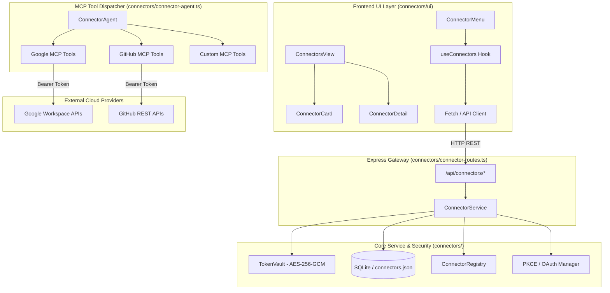

# JARVIS MCP Connectors — Complete Master Build & Architecture Guide

Welcome to the definitive engineering manual for the **JARVIS Model Context Protocol (MCP) Connectors** system. This guide covers the complete architecture, frontend UI components, backend function implementations, cryptographic security, OAuth 2.0 lifecycle, and a step-by-step tutorial for building and integrating new connectors.

---

## Table of Contents

1. [Architectural Overview](#1-architectural-overview)
2. [Directory Structure & Module Map](#2-directory-structure--module-map)
3. [Frontend UI Module (`connectors/ui/`)](#3-frontend-ui-module-connectorsui)
4. [Backend Functions & Cryptographic Security](#4-backend-functions--cryptographic-security)
5. [OAuth 2.0 Lifecycle & Token Vault](#5-oauth-20-lifecycle--token-vault)
6. [Model Context Protocol (MCP) Integration](#6-model-context-protocol-mcp-integration)
7. [Reference: Google Workspace MCP Tools](#7-reference-google-workspace-mcp-tools)
8. [Reference: GitHub MCP Tools](#8-reference-github-mcp-tools)
9. [Step-by-Step Tutorial: Building a New Connector](#9-step-by-step-tutorial-building-a-new-connector)
10. [HTTP REST API Reference](#10-http-rest-api-reference)
11. [Verification, Testing & Troubleshooting](#11-verification-testing--troubleshooting)

---

## 1. Architectural Overview

JARVIS Connectors bridge client applications, local agent runtimes, and external third-party services (Google Workspace, GitHub, Notion, Slack, Jira, etc.) using the standardized **Model Context Protocol (MCP)**.



### Core Architecture Pillars

1. **Single Source of Truth**: All connector code (UI components, types, routes, services, registries, and MCP tool handlers) lives within `/connectors/`.
2. **Encrypted Token Vault**: Tokens are never stored in plaintext. They are encrypted using **AES-256-GCM** with unique 12-byte initialization vectors (IV) and 16-byte authentication tags.
3. **Decoupled UI Module**: The UI is structured into modular components (`ConnectorCard`, `ConnectorDetail`, `ConnectorsView`, `ConnectorMenu`) and an autonomous React hook (`useConnectors`).
4. **Standardized Protocol**: Tool schemas strictly adhere to JSON Schema draft-07 via `@modelcontextprotocol/sdk` and Gemini Function Calling formats.

---

## 2. Directory Structure & Module Map

```
connectors/
├── ui/                              # Complete Frontend UI Module
│   ├── ConnectorCard.tsx            # Grid card displaying icon, name, status & tagline
│   ├── ConnectorDetail.tsx          # Full-screen / drawer modal with tool listing & auth controls
│   ├── ConnectorsView.tsx           # Standalone & embeddable directory catalog with search & filtering
│   ├── ConnectorMenu.tsx            # Floating popover menu for input bars & headers
│   ├── useConnectors.ts             # Custom React hook for state, auth redirect & polling
│   ├── connector-types.ts           # UI TypeScript interfaces & contracts
│   └── index.ts                     # UI Barrel export
├── connector-routes.ts              # Express HTTP endpoints (/api/connectors/*)
├── connector-service.ts             # Token Vault (AES-256-GCM), OAuth state & persistence
├── connector-registry.ts           # Static definitions, declarations & JSON schemas
├── connector-agent.ts               # MCP execution dispatcher & agent runtime
├── google-mcp.ts                    # Google Workspace MCP tools (Gmail, Calendar, Drive, Docs, etc.)
├── github-mcp.ts                    # GitHub MCP tools (Repos, Issues, PRs, Notifications)
├── types.ts                         # Core backend TypeScript interfaces
├── index.ts                         # Unified root barrel export
├── BUILD_GUIDE.md                   # This comprehensive master guide
└── README.md                        # Quickstart & architectural summary
```

---

## 3. Frontend UI Module (`connectors/ui/`)

The UI is built with React 19, Tailwind CSS, and Lucide icons.

### 3.1 `ConnectorCard.tsx`
Represents an individual connector in the grid.
- **Visual Status**: A circular indicator showing green checkmark when connected or gray plus when disconnected.
- **Brand Identity**: Custom SVG icons for Google, GitHub, Playwright, or fallback MCP badge.
- **Micro-interactions**: Hover glow (`hover:shadow-[0_0_30px_rgba(0,216,255,0.06)]`) and scale down on active press (`active:scale-[0.98]`).

```tsx
import { ConnectorCard } from "./connectors/ui";

<ConnectorCard
  connector={connectorWithStatus}
  onClick={() => setSelectedConnector(connectorWithStatus)}
/>
```

### 3.2 `ConnectorDetail.tsx`
Detailed inspection drawer/modal that displays:
- Connector header with icon, title, and action button (Connect / Disconnect).
- Comprehensive description and author verification badge with security notice.
- Filterable tools list showing each available MCP tool name and documentation tooltip.
- External URLs: Developer website, documentation, support, privacy policy, and connection timestamp.

### 3.3 `ConnectorsView.tsx`
Full-featured, standalone or tabbed view for browsing connectors:
- **Search Engine**: Real-time filtering across connector name, tagline, description, and tool names.
- **Status Filter Tabs**: Filter by "All", "Connected", or "Available".
- **Dynamic Connection Counter**: Real-time ratio indicator (e.g. `2 / 2 Connected`).
- **Responsive Layout**: Fluid CSS grid adapting from single column on mobile to 3 columns on desktop.

### 3.4 `ConnectorMenu.tsx`
Lightweight dropdown popover designed for prompt bars (e.g. `MultiInputBar`) or header toolbars:
- Shows compact list of active connectors with glowing status LEDs.
- Direct shortcut to open the full directory.

### 3.5 `useConnectors.ts` (React Hook)
Encapsulates all server interactions, URL query param parsing, and polling:

```tsx
const {
  connectors,          // Array of ConnectorWithStatus
  isLoading,           // Boolean loading indicator
  isAuthenticating,    // Boolean during OAuth redirect initiation
  error,               // Error message if request failed
  selectedConnector,   // Currently inspected connector
  setSelectedConnector,// Selector function
  fetchConnectors,     // Force reload from /api/connectors
  pollStatuses,        // Fast status-only refresh from /api/connectors/status/all
  connect,             // Trigger OAuth flow: connect(id)
  disconnect,          // Trigger revocation: disconnect(id)
} = useConnectors({ pollingIntervalMs: 10000, autoFetch: true });
```

---

## 4. Backend Functions & Cryptographic Security

Security is critical when handling OAuth refresh tokens and API credentials.

### 4.1 Token Vault Architecture (`TokenVault`)
All tokens are encrypted using **AES-256-GCM** (Galois/Counter Mode), providing both confidentiality and data authenticity:
- **Vault Key**: A cryptographically random 256-bit (32 bytes) key stored in `data/.vault-key` (permissions restricted to `0600`).
- **Initialization Vector (IV)**: Generated fresh for *every* encryption operation using `crypto.randomBytes(12)` (96 bits).
- **Authentication Tag**: A 16-byte (128 bits) tag produced by the cipher to prevent ciphertext tampering.

#### Serialization Format:
Ciphertext is encoded as a colon-delimited string:
$$\text{payload} = \text{ivBase64} : \text{authTagBase64} : \text{encryptedDataBase64}$$

```ts
// Encryption Implementation in connector-service.ts
public static encrypt(text: string): string {
  const key = this.getVaultKey();
  const iv = crypto.randomBytes(12);
  const cipher = crypto.createCipheriv("aes-256-gcm", key, iv);
  const encrypted = Buffer.concat([cipher.update(text, "utf8"), cipher.final()]);
  const tag = cipher.getAuthTag();
  return `${iv.toString("base64")}:${tag.toString("base64")}:${encrypted.toString("base64")}`;
}
```

---

## 5. OAuth 2.0 Lifecycle & Token Vault

The connector framework supports standard OAuth 2.0 Authorization Code grant with optional PKCE (Proof Key for Code Exchange).

### Sequence Flow:

```
[User]                 [React UI]               [Express Route]          [ConnectorService]        [OAuth Provider]
   |                        |                          |                         |                         |
   |-- Clicks "Connect" --->|                          |                         |                         |
   |                        |-- POST /api/connectors/:id/auth                    |                         |
   |                        |------------------------->|-- getOAuthUrl() ------->|                         |
   |                        |                          |<-- { authUrl } ---------|                         |
   |                        |<-- { authUrl } ----------|                         |                         |
   |                        |                                                    |                         |
   |<-- Redirect Browser ---|                                                    |                         |
   |------------------------------------------------------------------------------------------------------>|
   |                                                                             |    User Grants Access   |
   |<-- Redirect with ?code=XYZ&state=google --------------------------------------------------------------|
   |                                                                             |                         |
   |-- GET /api/connectors/callback?code=XYZ&state=google ---------------------->|                         |
   |                                                   |                         |-- exchangeCodeForTokens |
   |                                                   |                         |------------------------>|
   |                                                   |                         |<-- { access, refresh } -|
   |                                                   |                         |-- Encrypt in TokenVault |
   |                                                   |<-- Success -------------|-- Save to DB/JSON ------|
   |<-- Redirect to /?connector_connected=google ------|
```

### Automatic Token Refresh
Tokens are checked prior to executing any MCP tool. If `Date.now() >= token.expiresAt - 5 * 60 * 1000`, `ConnectorService.getValidAccessToken(id)` automatically contacts the provider's `tokenUrl` with the vaulted `refreshToken`, encrypts the new `accessToken`, and updates storage transparently.

---

## 6. Model Context Protocol (MCP) Integration

Connectors adhere to the Model Context Protocol specification:

### Tool Schema Definition
Each tool in `connectors/connector-registry.ts` specifies input schemas:

```ts
{
  name: "search_emails",
  description: "Search Gmail inbox by query, sender, date range, or labels",
  parameters: {
    type: "object",
    properties: {
      query: { type: "string", description: "Search query (e.g. 'from:boss', 'is:unread')" }
    },
    required: ["query"]
  }
}
```

### Execution Dispatcher (`connector-agent.ts`)
The `ConnectorAgent.executeTool(name, args)` inspects the tool registry, verifies that the parent connector is authorized and connected, fetches a valid vaulted access token, and dispatches the execution to the appropriate tool handler.

---

## 7. Reference: Google Workspace MCP Tools

Google tools are implemented in `connectors/google-mcp.ts` using direct REST calls with vaulted OAuth Bearer tokens:

| Tool Name | Parameters | Description |
|:---|:---|:---|
| `search_emails` | `query: string` | Search Gmail messages by keywords or Gmail search operators. |
| `read_email` | `messageId: string` | Fetch body and metadata of an email thread. |
| `send_email` | `to: string, subject: string, body: string` | Compose and send an email via Gmail API. |
| `create_draft` | `to: string, subject: string, body: string` | Save a message draft in Gmail without sending. |
| `list_labels` | None | List user and system Gmail labels. |
| `list_events` | `timeMin?: string, timeMax?: string` | List Google Calendar events in RFC3339 date range. |
| `create_event` | `summary: string, start: string, end: string, description?: string` | Create a new Google Calendar event. |
| `update_event` | `eventId: string, summary?: string, start?: string, end?: string` | Update an existing Calendar event. |
| `delete_event` | `eventId: string` | Remove a Calendar event by ID. |
| `find_free_time` | `timeMin: string, timeMax: string` | Inspect calendar busy periods and find available slots. |
| `list_tasks` | None | Retrieve user tasks from Google Tasks. |
| `create_task` | `title: string, notes?: string, due?: string` | Add a new task to Google Tasks. |
| `complete_google_task` | `taskId: string` | Mark a Google Task as completed. |
| `create_document` | `title: string, initialText?: string` | Create a new Google Docs document. |
| `get_document` | `documentId: string` | Retrieve structural text from Google Docs. |
| `append_document_text` | `documentId: string, text: string` | Append content to an existing Google Doc. |
| `create_presentation`| `title: string` | Create a new Google Slides presentation. |
| `get_presentation` | `presentationId: string` | Retrieve presentation metadata and slide count. |
| `add_slide` | `presentationId: string, title?: string, body?: string` | Add a slide with title and body text boxes. |
| `list_drive_files` | `query?: string, pageSize?: number` | Search and list files in Google Drive. |
| `get_drive_file` | `fileId: string` | Retrieve metadata and download link for a Drive file. |

---

## 8. Reference: GitHub MCP Tools

GitHub tools are implemented in `connectors/github-mcp.ts` using the GitHub REST API v3:

| Tool Name | Parameters | Description |
|:---|:---|:---|
| `list_repos` | None | List repositories owned or accessible by the authenticated user. |
| `search_issues` | `query: string` | Search across issues and pull requests across repositories. |
| `get_pull_request` | `owner: string, repo: string, pullNumber: number` | Inspect PR metadata, commit changes, and diffs. |
| `create_issue` | `owner: string, repo: string, title: string, body?: string, labels?: string[]` | Create a new issue in a target repository. |
| `list_notifications` | None | List unread GitHub notifications for the user. |

---

## 9. Step-by-Step Tutorial: Building a New Connector

Follow this 5-step tutorial to add a new connector (e.g. **Notion**):

### Step 1: Add Connector Definition to `connectors/connector-registry.ts`
```ts
{
  id: "notion",
  name: "Notion",
  icon: "notion",
  tagline: "Search pages, manage databases, and create notes",
  description: "Connect your Notion workspace to allow JARVIS to read documentation, append notes, and query databases.",
  category: "connectors",
  author: "Notion Labs",
  authorUrl: "https://notion.so",
  connectorUrl: "https://api.notion.com",
  requiresAuth: true,
  tools: [
    {
      name: "search_notion",
      description: "Search workspace pages and databases by title or keyword",
      parameters: {
        type: "object",
        properties: {
          query: { type: "string", description: "Search keyword" }
        },
        required: ["query"]
      }
    }
  ]
}
```

### Step 2: Configure OAuth in `connectors/connector-service.ts`
Add the provider settings to `OAUTH_CONFIGS`:
```ts
notion: {
  authUrl: "https://api.notion.com/v1/oauth/authorize",
  tokenUrl: "https://api.notion.com/v1/oauth/token",
  scopes: [],
  clientIdEnvKey: "NOTION_CLIENT_ID",
  clientSecretEnvKey: "NOTION_CLIENT_SECRET",
  usePkce: false,
}
```

### Step 3: Implement Tool Handlers in `connectors/notion-mcp.ts`
```ts
export class NotionMcp {
  public static async search(accessToken: string, query: string) {
    const res = await fetch("https://api.notion.com/v1/search", {
      method: "POST",
      headers: {
        Authorization: `Bearer ${accessToken}`,
        "Notion-Version": "2022-06-28",
        "Content-Type": "application/json",
      },
      body: JSON.stringify({ query }),
    });
    return res.json();
  }
}
```

### Step 4: Dispatch in `connectors/connector-agent.ts`
```ts
case "search_notion": {
  const token = await ConnectorService.getValidAccessToken("notion");
  if (!token) return { isError: true, content: [{ type: "text", text: "Notion not connected" }] };
  const data = await NotionMcp.search(token, args.query);
  return { content: [{ type: "text", text: JSON.stringify(data, null, 2) }] };
}
```

### Step 5: Register Icon in `connectors/ui/ConnectorCard.tsx`
Add the SVG icon to `CONNECTOR_ICONS`:
```tsx
notion: (
  <svg viewBox="0 0 24 24" className="w-8 h-8" fill="none">
    <path d="..." fill="#FFFFFF"/>
  </svg>
)
```

---

## 10. HTTP REST API Reference

| Endpoint | Method | Description | Request / Query | Response |
|:---|:---:|:---|:---|:---|
| `/api/connectors` | `GET` | Get all connectors with live status | None | `Array<ConnectorWithStatus>` |
| `/api/connectors/:id` | `GET` | Get single connector status | Route param `:id` | `ConnectorWithStatus` |
| `/api/connectors/:id/auth` | `POST` | Generate OAuth URL or activate local | Route param `:id` | `{ authUrl: string }` or `{ success: boolean }` |
| `/api/connectors/callback` | `GET` | OAuth callback redirection target | Query: `?code=...&state=...` | HTTP 302 Redirect to `/?connector_connected=...` |
| `/api/connectors/:id/disconnect`| `POST` | Revoke tokens & disconnect | Route param `:id` | `{ success: boolean }` |
| `/api/connectors/status/all` | `GET` | Lightweight status array for polling | None | `Array<ConnectorStatus>` |

---

## 11. Verification, Testing & Troubleshooting

### Diagnostic Checklist:
1. **OAuth Redirect Mismatch**: Ensure your Google Cloud Console / GitHub OAuth App callback URL matches:
   `http://localhost:6753/api/connectors/callback`
2. **Missing Environment Keys**: Verify `.env` contains:
   ```env
   GOOGLE_CLIENT_ID=your-google-client-id
   GOOGLE_CLIENT_SECRET=your-google-client-secret
   GITHUB_CLIENT_ID=your-github-client-id
   GITHUB_CLIENT_SECRET=your-github-client-secret
   ```
3. **Verify Token Vault Key**: Check that `data/.vault-key` exists and is 32 bytes.
4. **Compile & Typecheck**:
   ```bash
   npx tsc --noEmit
   npm run build:ui
   npm test
   ```
