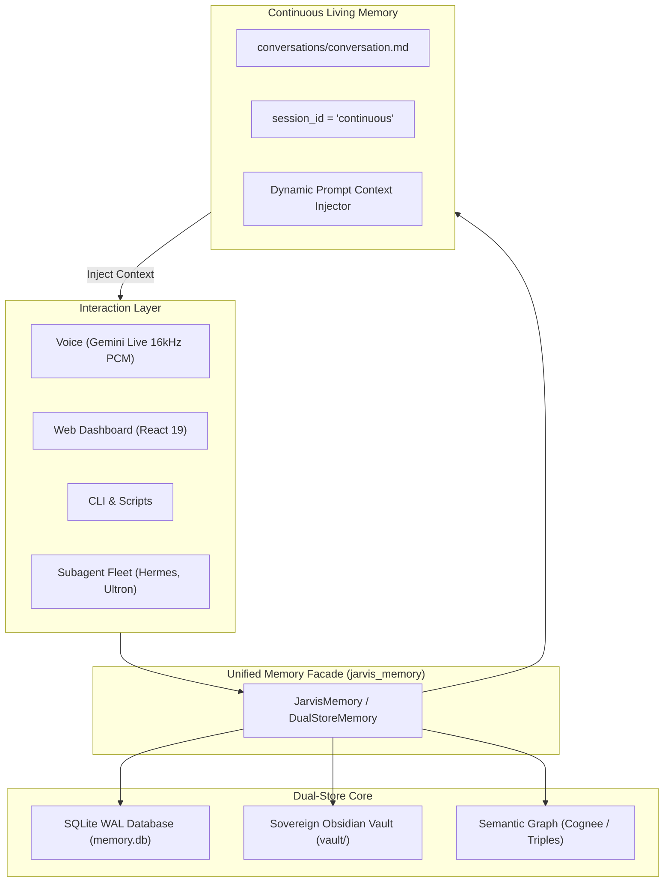

# 🧠 J.A.R.V.I.S. OS — Universal Memory, Continuous Living Memory & Sovereign Obsidian Vault Guide

> **Architectural Designation**: Sovereign Multi-Tier Memory Subsystem (Dual-Store SQLite WAL + Human-Readable Obsidian Vault + Continuous Living Dialogue Engine).  
> **Status**: Production-Ready, Self-Contained, and Fully Portable.  
> **Target Package**: `jarvis_memory_bundle/`  

---

## 📑 Table of Contents

1. [Executive Summary & Core Philosophy](#1-executive-summary--core-philosophy)
2. [Multi-Tier Memory Architecture](#2-multi-tier-memory-architecture)
3. [The Continuous Living Memory Engine](#3-the-continuous-living-memory-engine)
4. [Sovereign Obsidian Markdown Vault](#4-sovereign-obsidian-markdown-vault)
5. [Codebase Map & Directory Inventory](#5-codebase-map--directory-inventory)
6. [Actuator & Tool Reference](#6-actuator--tool-reference)
7. [Developer Cookbook & Code Recipes](#7-developer-cookbook--code-recipes)
8. [CLI Command Reference](#8-cli-command-reference)
9. [High-Performance Rust Memory Engine](#9-high-performance-rust-memory-engine)
10. [Portability & Standalone Migration Guide](#10-portability--standalone-migration-guide)

---

## 1. Executive Summary & Core Philosophy

Traditional AI assistants suffer from **state amnesia**: every session begins with a blank slate, historical context is discarded, and long-term memory is locked behind proprietary cloud silos.

J.A.R.V.I.S. OS solves this fundamentally through three sovereign engineering invariants:

1. **Perpetual Continuous Living Dialogue**: There are **zero isolated sessions**. The conversation between operator and assistant is a single, unbroken living timeline that persists across browser refreshes, voice sessions, CLI interactions, and system reboots.
2. **Dual-Store Sovereign Persistence**:
   - **Machine Tier (SQLite WAL + FTS5)**: Fast, ACID-compliant structured storage for millisecond turn retrieval, full-text token matching, and hierarchical tree indexing.
   - **Human Tier (Obsidian Markdown Vault)**: 100% human-readable, git-versionable Markdown files enriched with YAML frontmatter and bidirectional wikilinks (`[[...]]`) that open natively in the Obsidian app.
3. **Zero Lock-in & Complete Sovereignty**: All notes, facts, daily logs, and transcripts live locally on disk under your own file system. You own your knowledge.



---

## 2. Multi-Tier Memory Architecture

The memory engine organizes knowledge into 5 distinct operational tiers based on access velocity, mutability, and retention decay:

| Tier | Name | Storage Mechanism | Retention / TTL | Primary Purpose |
| :--- | :--- | :--- | :--- | :--- |
| **Tier 0** | **Working Buffer** | In-Memory Async Queues / RAM | Ephemeral (Session) | Active audio stream buffers, sub-second interruption tracking, live visualizer state. |
| **Tier 1** | **Continuous Timeline** | `conversation.md` + SQLite `session_id='continuous'` | Perpetual (Append-Only) | Immediate conversational ground truth. Last 30 turns hydrated to UI on connect. |
| **Tier 2** | **Structured Persistent Store** | SQLite WAL with FTS5 (`memory.db`) | Permanent (WAL sync) | Structured `memory_nodes`, entity triples, indexed turns, millisecond full-text keyword retrieval. |
| **Tier 3** | **Sovereign Markdown Vault** | Obsidian Vault (`vault/`) | Permanent & Human-Readable | Atomic facts (`facts/`), knowledge notes (`knowledge/`), skills (`skills/`), daily diaries (`conversations/YYYY-MM-DD.md`). |
| **Tier 4** | **Semantic Knowledge Graph** | Cognee Cloud / Local Graph Embeddings | Dynamic Graph Relations | Multi-hop reasoning, relational knowledge triples, cross-domain association. |

---

## 3. The Continuous Living Memory Engine

### 3.1 The Continuous Mandate
In J.A.R.V.I.S. OS, isolated chat windows and session resets are strictly banned. Every interaction from any interface routes into the exact same perpetual timeline.

- When the operator speaks via voice, the turn is appended to the continuous timeline.
- When the operator sends a message via text, it enters the same timeline.
- When the operator reboots the PC, restarts the backend, or opens a new browser tab, the system immediately **hydrates the last 30 turns** from disk into the client.

### 3.2 Dual Capture Execution Flow
Whenever a conversation turn occurs (`memory_engine.log_conversation_turn(speaker, text, role)`), two synchronous actions occur instantly:

1. **Perpetual Markdown Journal (`vault/conversations/conversation.md`)**:
   An append-only log formatted with Markdown headers:
   ```markdown
   ### [2026-09-26 17:04:32] [Operator Gopi]
   Jarvis, activate memory telemetry sweep.

   ### [2026-09-26 17:04:32] [JARVIS]
   Telemetry sweep active, Sir. All persistent vaults online.
   ```
2. **SQLite Structured Turn (`conversation_turns` Table)**:
   ```sql
   INSERT INTO conversation_turns (id, session_id, role, content, created_at)
   VALUES ('urn:turn:...', 'continuous', 'user', 'Jarvis, activate...', 1727351072);
   ```
3. **Daily Archive Mirror (`vault/conversations/YYYY-MM-DD.md`)**:
   The turn is also mirrored to today's dated log for date-based navigation, historical review, and midnight summarization.

### 3.3 Dynamic Prompt Injection
Before any LLM reasoning or Gemini Live session starts, the engine compiles a dynamic context block that injects the recent conversation history directly into the system prompt:

```text
=== 🔄 CONTINUOUS LIVING CONVERSATION CONTEXT ===
You are in a single, perpetual, unbroken conversation with your operator Gopi.
There are NO isolated sessions. You remember all preceding context, questions, and tasks.
Recent dialogue history:
[Operator Gopi]: Jarvis, activate memory telemetry sweep.
[JARVIS]: Telemetry sweep active, Sir. All persistent vaults online.
[Operator Gopi]: Remember that project Ironclad deadline is next Friday.
[JARVIS]: Acknowledged. Ironclad milestone recorded in your sovereign vault.
```

### 3.4 Automated Midnight Rollover & Summarization
- At 00:00:00 midnight (or upon first boot of a new day), `summarizer.py` identifies unsummarized previous days.
- It triggers a background LLM pass to compress the daily dialogue into structured bullets:
  - Key topics discussed
  - Commitments and decisions made
  - Action items pending
- The summary is saved to `vault/summaries/YYYY-MM-DD.md` and linked in `MEMORY.md`.

---

## 4. Sovereign Obsidian Markdown Vault

The `vault/` directory is an authentic, 100% compliant Obsidian Vault that can be opened directly with the [Obsidian](https://obsidian.md) app on Linux, macOS, Windows, iOS, or Android.

### 4.1 Vault Directory Structure

```
vault/
├── .obsidian/               # Obsidian configuration directory
│   ├── app.json             # Vault preferences & link settings
│   ├── appearance.json      # Theme and visual styling
│   ├── core-plugins.json    # Enabled plugins (Daily notes, Graph view, Backlinks)
│   ├── daily-notes.json     # Configuration pointing daily notes to conversations/
│   ├── graph.json           # Interactive Graph View display settings
│   └── workspace.json       # Workspace layout and open tabs
├── MEMORY.md                # 🧠 Sovereign persistent knowledge & operational rules
├── USER.md                  # 👤 Operator profile, preferences, and communication style
├── index.md                 # 🗺️ Master Map of Content (MOC) with [[wikilinks]]
├── memory.db                # 🗄️ SQLite WAL database (co-located in vault root)
├── conversations/           # 💬 Perpetual & daily conversation journals
│   ├── conversation.md      # 🔄 Single continuous living dialogue log
│   └── YYYY-MM-DD.md        # Daily dated conversation logs
├── execution/               # 🛠️ Telemetry logs for tool calls, latency, and actuator results
│   └── YYYY-MM-DD.md        # Daily tool execution telemetry
├── facts/                   # 📌 Atomic facts extracted from conversations
│   └── [Fact_Name].md       # Single fact notes with YAML frontmatter
├── knowledge/               # 📚 Synthesized architectural notes and references
├── skills/                  # ⚡ Discovered and forged system capabilities & SKILL.md
├── research/                # 🔬 Deep web research and multi-step synthesis notes
├── summaries/               # 📑 Daily conversation summaries
├── decisions/               # ⚖️ Architectural and project decision records
├── lessons/                 # 💡 Mistakes made, lessons learned, preventative rules
├── patterns/                # 🧩 Behavioral, coding, and prompt patterns
├── context/                 # 🎯 Active project execution contexts
└── agents/                  # 🤖 Subagent isolated scratchpads (hermes, ultron, prime)
```

### 4.2 YAML Frontmatter Schema
Every note created in the vault conforms to standard frontmatter metadata:

```markdown
---
title: "Quantum Neural Mesh Architecture"
created_at: "2026-09-26T17:04:32Z"
tags: [architecture, neural, mesh]
type: knowledge
category: system-design
---

# Quantum Neural Mesh Architecture

Body content here...
```

### 4.3 Opening in Obsidian
1. Download and install [Obsidian](https://obsidian.md).
2. Choose **"Open folder as vault"**.
3. Select your `vault/` directory (e.g. `/path/to/jarvis_memory_bundle/vault`).
4. Press `Ctrl + G` (or `Cmd + G`) to see the **Interactive Graph View** showing real-time links connecting your conversations, facts, skills, and daily notes!

---

## 5. Codebase Map & Directory Inventory

```
jarvis_memory_bundle/
├── GUIDE.md                      # This comprehensive master guide
├── README.md                     # Fast reference & quickstart
├── cli.py                        # Standalone terminal CLI for memory operations
├── python/                       # Core Python Memory Implementation
│   ├── __init__.py               # JarvisMemory facade & prompt context builder
│   ├── engine.py                 # SQLite WAL engine (FTS5 search, sanitized matching)
│   ├── vault.py                  # Obsidian Vault Manager (note CRUD, frontmatter, continuous log)
│   ├── agent_memory.py           # Per-agent isolated memory namespaces
│   ├── miner.py                  # Rule-based factual memory extraction
│   ├── summarizer.py             # LLM-powered conversation summarizer
│   ├── cognee_bridge.py          # Semantic graph memory bridge
│   ├── hermes_bridge.py          # Hermes CLI memory sync bridge
│   ├── config.py                 # Dynamic relative paths & content limits
│   └── types.py                  # Strongly typed Dataclasses (MemoryNode, Turn, etc.)
├── vault/                        # The live sovereign Obsidian Vault
├── engine_rust/                  # Rust Universal Memory Engine (Port 50051)
│   ├── Cargo.toml                # Tokio, Axum, SQLite, FTS5 dependencies
│   ├── src/                      # High-performance tree & repository code
│   ├── examples/                 # Rust server and tree demos
│   └── tests/                    # Integration and benchmark tests
├── brain_adapter/                # Plug-and-Play AI Brain Bridge
│   ├── memory_adapter.py         # DualStoreMemory singleton wrapper
│   └── actuator_handlers.py      # Ready-to-use tool dispatch handlers
└── examples/                     # Standalone Executable Python Demonstrations
    ├── 01_continuous_dialogue.py # Living conversation turn logging & context injection
    ├── 02_obsidian_notes.py      # Note creation, frontmatter parsing, appending, search
    └── 03_dual_store_search.py   # Multi-tier search across SQLite and Markdown files
```

---

## 6. Actuator & Tool Reference

These 7 tools provide complete programmatic control over the memory system for any AI agent, function-calling engine, or MCP server:

### 1. `obsidian_search`
- **Purpose**: Full-text search across all Markdown notes in the Obsidian vault.
- **Parameters**: `query: string`, `limit?: number (default: 10)`
- **Returns**: Array of matched notes with relative path, score, and content snippet.

### 2. `obsidian_read`
- **Purpose**: Reads a note from the vault, automatically parsing YAML frontmatter into a dictionary.
- **Parameters**: `path: string` (e.g. `knowledge/architecture.md` or `architecture`)
- **Returns**: `{"success": true, "path": "...", "frontmatter": {...}, "content": "..."}`

### 3. `obsidian_create`
- **Purpose**: Creates a new Markdown note in the vault with structured YAML frontmatter and automatically links it to `index.md`.
- **Parameters**: `title: string`, `content: string`, `folder?: string (default: 'knowledge')`, `tags?: string[]`
- **Returns**: `{"success": true, "path": "...", "title": "...", "bytes": number}`

### 4. `obsidian_append`
- **Purpose**: Appends timestamped findings, research logs, or task progress to an existing note.
- **Parameters**: `path: string`, `content: string`
- **Returns**: `{"success": true, "path": "...", "message": "..."}`

### 5. `jarvis_remember` / `save_memory`
- **Purpose**: Saves an atomic factual memory simultaneously to SQLite WAL and `vault/facts/[Key].md`.
- **Parameters**: `key: string`, `value: string`, `category?: string (default: 'custom')`
- **Returns**: `{"success": true, "message": "..."}`

### 6. `jarvis_recall` / `search_memory`
- **Purpose**: Executes hybrid search across SQLite FTS5 nodes, Markdown vault files, and Cognee knowledge graph.
- **Parameters**: `query: string`, `limit?: number (default: 10)`
- **Returns**: Consolidated list of results ranked by relevance.

### 7. `jarvis_vault_status`
- **Purpose**: Telemetry snapshot reporting vault connectivity, total notes, continuous turn count, and DB size.

---

## 7. Developer Cookbook & Code Recipes

### Recipe 1: Logging a Continuous Turn & Getting Prompt Context
```python
from brain_adapter.memory_adapter import memory_engine

# Log dialogue turns
memory_engine.log_conversation_turn("Operator Gopi", "Deploy the updated memory bundle.", role="user")
memory_engine.log_conversation_turn("JARVIS", "Bundle deployed and verified, Sir.", role="agent")

# Get formatted context to prepend to your LLM system prompt
prompt_context = memory_engine.get_context_for_prompt()
print(prompt_context)
```

### Recipe 2: Creating and Appending to an Obsidian Note
```python
# Create note
res = memory_engine.vault.create_note(
    title="Neural Gateway Specs",
    content="PipeWire audio ring buffer operates with 16kHz linear PCM.",
    folder="knowledge",
    tags=["pipewire", "audio", "gateway"]
)
print("Created note at:", res["path"])

# Append update
memory_engine.vault.append_note(
    res["path"],
    "Latency benchmark: 4.8ms average round-trip time."
)
```

### Recipe 3: Reading a Note with Frontmatter Parsing
```python
note = memory_engine.vault.read_note("knowledge/Neural_Gateway_Specs.md")
if note["success"]:
    print("Title:", note["frontmatter"].get("title"))
    print("Tags:", note["frontmatter"].get("tags"))
    print("Body:\n", note["content"])
```

### Recipe 4: Multi-Store Search
```python
# Searches SQLite FTS5 + Obsidian Vault Markdown + Cognee
results = memory_engine.search("PipeWire audio", limit=5)
for r in results:
    print(r)
```

---

## 8. CLI Command Reference

The bundle includes an executable CLI (`cli.py`) for instantaneous terminal operations:

```bash
# Check memory & vault health
python3 cli.py status

# Inspect the continuous living conversation (last 20 turns)
python3 cli.py continuous --limit 20

# Search memory notes & database
python3 cli.py search "neural mesh"

# Store an atomic fact
python3 cli.py remember "preferred_editor" "Neovim with Lua config" --category "tools"

# Create a new Obsidian note
python3 cli.py note create "Rust Engine Architecture" "Tokio + Axum on port 50051." --folder "knowledge" --tags "rust,engine,api"

# Read an Obsidian note
python3 cli.py note read "knowledge/Rust_Engine_Architecture.md"

# Append content to an existing note
python3 cli.py note append "knowledge/Rust_Engine_Architecture.md" "Verified zero-allocation audio streaming."

# Inspect system prompt injected context
python3 cli.py prompt

# Manually log a conversation turn
python3 cli.py turn "Gopi" "Run full diagnostic sweep." --role user
```

---

## 9. High-Performance Rust Memory Engine

Located under `engine_rust/`, this compiled engine provides sub-millisecond memory capabilities for large-scale production setups:

- **Technology**: Rust, Tokio async runtime, Axum web framework, `rusqlite` with WAL mode.
- **Default Port**: `50051` (HTTP REST + WebSocket event bus).
- **Core Modules**:
  - `src/tree/`: Hierarchical context tree with `CascadeSealer` for working context buffer compression.
  - `src/search/`: Hybrid ranker combining FTS5 lexical matching, recency scoring, and vector similarity.
  - `src/vault/`: Native Rust writer for Obsidian notes and YAML frontmatter.
  - `src/mcp/`: Built-in Model Context Protocol stdio server for Claude, Cursor, and Gemini integration.

### Compiling & Running the Rust Engine
```bash
cd engine_rust
cargo build --release
./target/release/jarvis-memory-engine serve --port 50051
```

---

## 10. Portability & Standalone Migration Guide

Because the user requested a folder they can **move elsewhere**, `jarvis_memory_bundle/` is engineered to be **100% self-contained**:

1. **Relative Path Autodetection**:
   - `python/config.py` detects its parent directory dynamically:
     ```python
     _sibling_vault = os.path.join(os.path.dirname(os.path.dirname(os.path.abspath(__file__))), "vault")
     VAULT_ROOT = _sibling_vault if os.path.exists(_sibling_vault) else os.path.dirname(os.path.abspath(__file__))
     DB_PATH = os.path.join(VAULT_ROOT, "memory.db")
     ```
   - No matter where you move `jarvis_memory_bundle/`, it will automatically point to its co-located `vault/` and `memory.db` without editing any config file.
2. **Moving the Folder**:
   ```bash
   # Move the entire bundle to your home directory or external drive:
   mv jarvis_memory_bundle ~/jarvis_memory_bundle
   # Or copy:
   cp -r jarvis_memory_bundle ~/my_new_project/memory
   ```
3. **Using in Any Python Project**:
   ```python
   import sys
   sys.path.insert(0, "/path/to/jarvis_memory_bundle")

   from brain_adapter.memory_adapter import memory_engine

   memory_engine.log_conversation_turn("User", "Hello new project!", role="user")
   ```
4. **Opening the Vault in Obsidian**:
   Simply launch Obsidian, select "Open folder as vault", and navigate to `/path/to/jarvis_memory_bundle/vault`!

---

*Authored for Operator Gopi — Sovereign AI Systems Architecture.*
