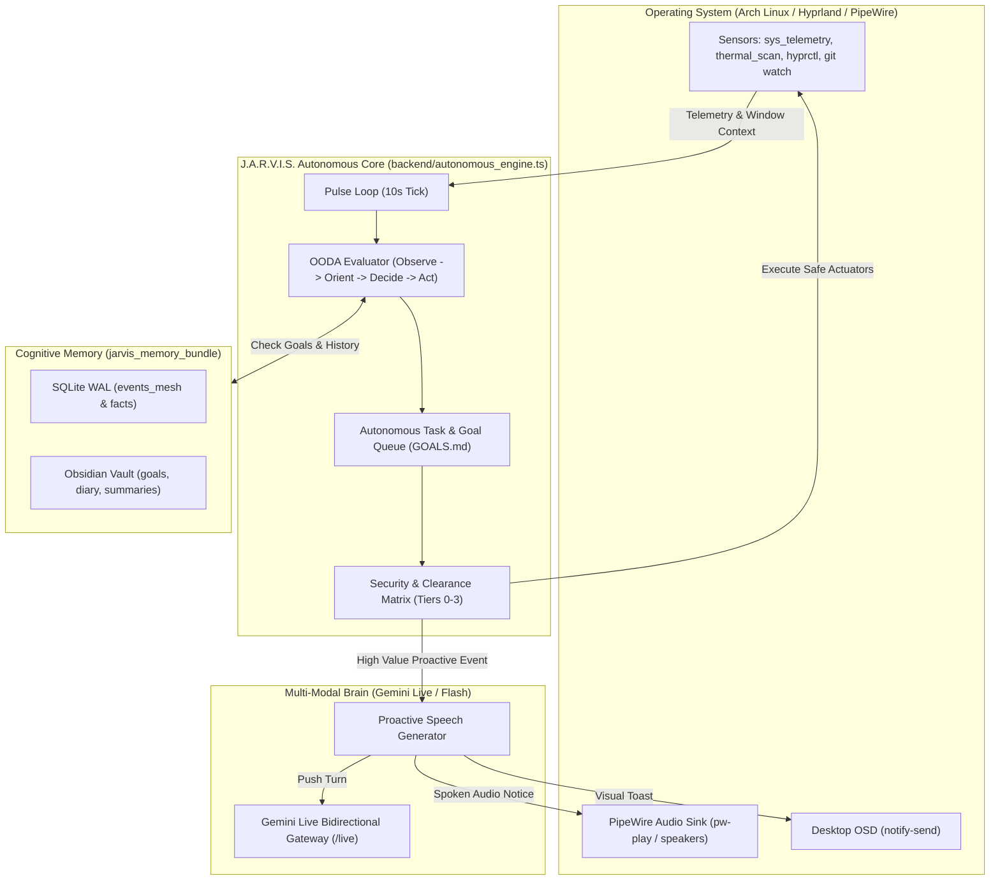

# J.A.R.V.I.S. Autonomous Coworker: Architectural Research & Transformation Blueprint

## 1. Executive Summary & The "Movie JARVIS" Paradox

In *Iron Man*, J.A.R.V.I.S. is an **ambient, persistent operational partner**. When Tony walks into the workshop, J.A.R.V.I.S. proactively briefs him ("Good morning, sir. I have compiled the telemetry from yesterday's flight test..."), monitors environmental and power metrics in the background, autonomously executes multi-step engineering tasks, and intervenes only when high-value signals or critical alerts occur.

### Current State vs. Movie JARVIS
| Capability | Current J.A.R.V.I.S. (Reactive) | Autonomous J.A.R.V.I.S. (The Coworker) |
| :--- | :--- | :--- |
| **Activation** | User opens browser UI, clicks connect, speaks first. | Always-on background daemon (systemd / Rust supervisor). |
| **Cognitive Loop** | Synchronous Request-Response (sleeps until spoken to). | Continuous OODA (Observe-Orient-Decide-Act) heartbeat every 5–15s. |
| **Perception** | Relies on user microphone and active web camera stream. | Ambient system telemetry, Hyprland window tracking, git changes, logs. |
| **Action Execution** | Executes tools only as direct reply to user tool call. | Autonomous low-risk task queue (linter, test-runner, cache cleanup). |
| **Voice Initiation** | Model only speaks when answering a turn. | Proactive speech via PipeWire/pw-play or live push ("Sir, high thermals..."). |
| **Task Autonomy** | Single-shot commands. | Self-directed goal breakdown with status checkpoints and recovery. |

---

## 2. Codebase Inventory: What Already Exists vs. What Is Needed

An inspection of the workspace (`/home/g0pi/Downloads/jarvis`) reveals that **80% of the underlying muscle and brain already exists**:

```
Existing Superpowers:
├── whole_controls/native_workers/bin/
│   ├── sys_telemetry     # Sub-5ms CPU, RAM, load, disk scanner (Verified operational)
│   ├── thermal_scan      # Real-time hardware temperature zone monitor (Verified operational)
│   ├── desktop_control   # Hyprland Wayland window and input automator
│   ├── omarchy_ctrl      # Workspace switcher, theme switcher, OSD notifications
│   ├── process_ctrl      # Inspect, renice, and terminate system processes
│   └── file_search       # High-speed native file indexing
├── whole_controls/python_actuators/
│   └── unified_dispatcher.py # Consolidated router for 18+ system control domains
├── jarvis_memory_bundle/
│   ├── brain_adapter/    # Dual-store SQLite WAL (memory.db) + Obsidian Vault (vault/)
│   └── dynamic_miner     # Self-extracting knowledge graph triples & facts
├── desktop/
│   └── src/main.rs       # Rust Wry/Tao supervisor that manages backend lifecycle
└── Linux Host Superpowers
    ├── /usr/bin/hyprctl  # Sub-millisecond Wayland window, title, and workspace inspector
    ├── /usr/bin/pw-play  # Low-latency PipeWire system audio player
    └── /usr/bin/notify-send # Desktop OSD notifications (Dunst/Mako/SwayNC)
```

### The Missing Linchpins:
1. **The Pulse Daemon (Autonomous OODA Loop)**: An asynchronous background engine that wakes up periodically without user input, queries telemetry and workspace state, and decides if action or speech is warranted.
2. **Proactive Speech Initiator**: The ability for the backend to inject spoken audio to the user's speakers or push a Gemini Live turn spontaneously without the user talking first.
3. **Autonomous Task DAG & Goal Queue**: A persistent task manager that can take high-level goals (`GOALS.md`), schedule sub-tasks, execute them with `whole_controls`, and report completions.
4. **Safety Clearance Matrix**: A 4-tier risk filter ensuring autonomous actions cannot cause system damage or unwanted side effects.

---

## 3. High-Level System Architecture



---

## 4. Deep Dive: The 5 Core Engines of Autonomy

### Engine 1: The Ambient Observer (Perception Without Egress)
Instead of streaming continuous raw audio or video to the cloud (expensive and privacy-invasive), JARVIS runs **local, zero-cloud sensors**:
- **System Telemetry**: Native worker `sys_telemetry` and `thermal_scan` polled every 10s (< 0.1% CPU).
- **Active Focus Listener**: Calls `hyprctl activewindow -j` to detect current application, document title, and workspace. If user switches from code to terminal after a build error, JARVIS notices.
- **Filesystem & Git Watcher**: Watches workspace directories for `.git/HEAD` changes, compiler output, or save events.
- **Ambient Audio Trigger**: Lightweight local wake-word listener (openWakeWord / Porcupine / PipeWire stream) listening on a local ring buffer. Only triggers cloud transmission when "Jarvis" or an emergency condition occurs.

### Engine 2: The Cognitive OODA Loop (Internal Monologue)
Every pulse cycle (e.g. every 10 seconds), JARVIS runs:
1. **Observe**: Collect delta changes (e.g. CPU > 85% for 60s; build failed on `server.ts`; user idle for 15 mins; calendar reminder due).
2. **Orient**: Correlate with Obsidian Memory Vault (`vault/`): Does this match an existing goal? Is the user in "Deep Focus" mode? What was the last preference recorded?
3. **Decide**:
   - If change is background noise $\rightarrow$ Log to `events_mesh` in SQLite and sleep.
   - If change is actionable & safe (Tier 0/1) $\rightarrow$ Enqueue autonomous action.
   - If change is significant to user $\rightarrow$ Formulate proactive brief.
4. **Act**: Dispatch command via `whole_controls` or announce to user.

### Engine 3: Proactive Initiation ("Sir, I've Taken the Liberty...")
To speak without being prompted:
- **Direct System Audio**: The backend uses PipeWire (`pw-play` or native audio stream) to speak short chime cues or synthesized voice alerts directly into the desktop audio server.
- **Gemini Live Push**: On the `/live` WebSocket connection, the backend can inject an autonomous system prompt:
  ```json
  {
    "clientContent": {
      "turns": [{
        "role": "user",
        "parts": [{ "text": "[SYSTEM TRIGGER: Thermal zone acpitz exceeded 85C. Briefly alert the user in 1 sentence.]" }]
      }],
      "turnComplete": true
    }
  }
  ```
  Gemini Live generates the audio turn immediately, streaming J.A.R.V.I.S.'s voice through the speakers.

### Engine 4: Autonomous Goal Engine (Task Queue)
A lightweight YAML/Markdown-backed task queue (`vault/GOALS.md` and SQLite `task_queue`):
- High-level goals are broken into idempotent steps:
  - Step 1: `git status && npm run lint`
  - Step 2: If lint fails, invoke code analysis tool
  - Step 3: Run unit tests
  - Step 4: Summarize outcome in Obsidian diary
- JARVIS runs these tasks in background worker threads without blocking user workflow, displaying micro-progress on the React HUD.

### Engine 5: The 4-Tier Safety & Clearance Matrix
Autonomy without guardrails is dangerous. J.A.R.V.I.S. enforces strict clearance levels:
- **Tier 0 (Pure Telemetry / Read-Only)**: Allowed autonomously. `sys_telemetry`, `git diff`, `thermal_scan`, `file_search`.
- **Tier 1 (Safe Desktop Adjustments)**: Allowed autonomously with HUD notification. Switching workspace, pausing media on phone call, notifying build completion.
- **Tier 2 (Mutations / Modifications)**: Requires passive voice confirmation. "Sir, I have prepared the bug fix for server.ts; shall I apply it?" (Waits for affirmative speech).
- **Tier 3 (Destructive / Privileged)**: Hard blocked from autonomous execution. File deletion (`rm -rf`), Git force-pushes, system shutdown. Requires explicit confirmation PIN or typed override.

---

## 5. Concrete Phased Implementation Roadmap

### Phase 1: The Autonomous Heartbeat (Backend Service)
- **Target File**: `backend/system_modules/intelligent_system/autonomous_engine.ts`
- **Functionality**:
  - Run a throttled 10-second `setInterval` loop in `backend/server.ts`.
  - Query `whole_controls/native_workers/bin/sys_telemetry` and `hyprctl activewindow -j`.
  - Store state in `jarvis_memory_bundle` SQLite `events_mesh`.
- **Deliverable**: Background telemetry logging with zero performance impact.

### Phase 2: Proactive Spoken & HUD Alerts
- **Target Files**: `backend/server.ts`, `frontend/src/services/liveWebSocket.ts`
- **Functionality**:
  - Add `notify-send` integration for instant Hyprland visual feedback.
  - Implement server-side audio dispatch: when a critical threshold or reminder triggers, push a proactive audio frame to the active frontend/desktop speaker or invoke `pw-play`.
- **Deliverable**: J.A.R.V.I.S. initiates voice warnings and status reports without the user clicking or speaking first.

### Phase 3: Autonomous Task Queue & Self-Directed Engineering
- **Target Files**: `backend/system_modules/intelligent_system/task_queue.ts`, `vault/GOALS.md`
- **Functionality**:
  - Enable background execution of code linting, git test suites, and memory mining.
  - Integrate with `backend/memory_bridge.py` for automated nightly reflection and knowledge triple extraction.
- **Deliverable**: J.A.R.V.I.S. performs automated code checks and records insights into Obsidian while the user works.

### Phase 4: Headless Daemon & Ambient Wake-Word Integration
- **Target Files**: `desktop/src/server_supervisor.rs`, systemd user service `jarvis.service`
- **Functionality**:
  - Enable J.A.R.V.I.S. to run as a persistent Linux background daemon on boot.
  - Integrate local wake-word listener on PipeWire input (`openWakeWord` / `porcupine`).
- **Deliverable**: Full movie-like experience: system boots, J.A.R.V.I.S. is immediately live in the room on standby.
