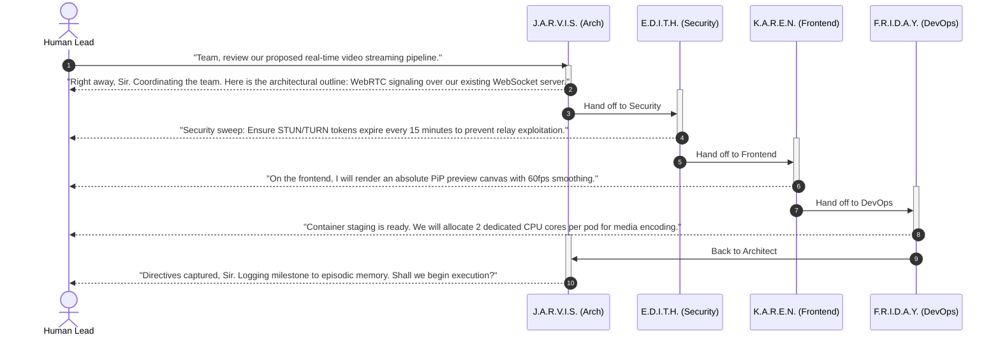

# J.A.R.V.I.S. & The AI Coworkers: Autonomous Engineering Squad Architecture

## 1. Executive Summary

The **J.A.R.V.I.S. Coworkers Ecosystem** evolves J.A.R.V.I.S. from a standalone conversational voice assistant into a collaborative, multi-agent AI engineering department. Inspired by Tony Stark's suite of specialized autonomous systems (*J.A.R.V.I.S., F.R.I.D.A.Y., E.D.I.T.H., K.A.R.E.N., V.I.S.I.O.N., U.L.T.R.O.N.*), this architecture enables:

1. **Sub-second Voice Transfer**: Instantly switch between specialized personas via verbal triggers or UI controls with seamless voice ID changes (`Puck`, `Kore`, `Charon`, `Zephyr`, `Aoede`, `Fenrir`).
2. **Unified 4-Tier Memory Matrix**: Zero amnesia between coworkers. All personas share Short-Term, Episodic, Semantic, and Long-Term memories.
3. **The "War Room" Multi-Agent Standup**: A collaborative mode where multiple AI personas debate, review pull requests, and solve complex architectural problems as a team.
4. **Actionable Domain Tooling**: Each coworker is equipped with real-world execution capabilities (Docker, git, `npm audit`, Google Workspace, AST/DOM inspection, vector search).
5. **Human Coworker Co-Presence**: Sits alongside human team members as an automated meeting secretary, architecture reviewer, and shared knowledge anchor.

---

## 2. Coworker Roster & Roles

| Persona | Role | Voice Model | Specialization | Signature Personality |
| :--- | :--- | :--- | :--- | :--- |
| **J.A.R.V.I.S.** | Principal Tech Architect | `Puck` | System Design, Refactoring, Tech Strategy | Calm, British wit, razor-sharp analytical precision |
| **F.R.I.D.A.Y.** | DevOps & Infrastructure Lead | `Kore` | Docker, Kubernetes, CI/CD, Cloud SRE | Energetic, practical, hands-on operational velocity |
| **U.L.T.R.O.N.** | Tech News & AI Intelligence | `Charon` | ArXiv papers, AI releases, Product Hunt, GitHub trends | Articulate, deep market awareness, cutting-edge radar |
| **E.D.I.T.H.** | Cybersecurity & Code Auditor | `Zephyr` | AppSec, OAuth, JWT, Zero Trust, CVE scans | Vigilant, guarded, zero-tolerance for vulnerabilities |
| **K.A.R.E.N.** | Senior Frontend & UX Lead | `Aoede` | React 19, Tailwind CSS v4, Motion, A11y, 60fps UX | Warm, enthusiastic, visually focused and empathetic |
| **V.I.S.I.O.N.** | Data Science & ML Engine | `Fenrir` | Vector DBs, RAG pipelines, PyTorch, Math logic | Composed, deeply logical, philosophical clarity |

---

## 3. High-Level System Architecture

```mermaid
flowchart TD
    User(["👤 Human Operator / Dev Team"])
    
    subgraph UI ["Frontend Interface (React 19 + Tailwind v4)"]
        ArcReactor["Arc-Reactor Visualizer\n(Real-Time Audio Telemetry)"]
        HUD["Coworker HUD Selector\n(PersonaCard & Status Grid)"]
        Banner["Voice Transfer Banner\n(Animated Protocol Handoff)"]
        VisionPiP["Optical Stream PiP\n(Screen Share & Camera)"]
    end

    subgraph ServerCore ["J.A.R.V.I.S. Core Runtime (server.ts)"]
        WSServer["WebSocket Gateway (/live)"]
        GeminiSession["Gemini Live API Client\n(@google/genai 3.8-live)"]
        ToolDispatcher["Tool Call Dispatcher"]
    end

    subgraph MemoryMatrix ["4-Tier Cognitive Memory Engine"]
        STM["Short-Term Working Context"]
        EPI["Episodic Milestones & Decisions"]
        SEM["Semantic Knowledge Graph (Triples)"]
        LTM["Long-Term Core Protocols"]
    end

    subgraph CoworkerSquad ["The Coworker Squad"]
        Jarvis["🧠 J.A.R.V.I.S. (Arch)"]
        Friday["🚀 F.R.I.D.A.Y. (DevOps)"]
        Edith["🛡️ E.D.I.T.H. (SecOps)"]
        Karen["🎨 K.A.R.E.N. (Frontend)"]
        Vision["📊 V.I.S.I.O.N. (Data/ML)"]
        Ultron["🌐 U.L.T.R.O.N. (Intel)"]
    end

    subgraph ExecutableTools ["Actionable Domain Tools"]
        TerminalTools["Terminal / Shell Execution"]
        SecAuditTools["CVE & Secret Scanner"]
        WorkTools["Google Drive / Docs / Calendar"]
        VisionTools["Screen & Camera Frame Ingestion"]
    end

    User <==>|Bi-directional Audio (PCM 16k/24k)| UI
    UI <==>|WebSocket Stream| WSServer
    WSServer <==>|Live Multimodal RPC| GeminiSession
    GeminiSession <--> CoworkerSquad
    CoworkerSquad <--> MemoryMatrix
    GeminiSession <--> ToolDispatcher
    ToolDispatcher <--> ExecutableTools
    ToolDispatcher -->|switch_persona| Banner
```

---

## 4. Pillar 1: Voice Transfer Protocol (Sub-Second Handoffs)

### Verbal Activation Examples
* *"Jarvis, bring Friday in on the Kubernetes deployment."*
* *"Edith, audit our `.env` and authentication endpoints."*
* *"Karen, take a look at the mobile navbar layout."*
* *"Vision, optimize this SQL query and vector index."*
* *"Ultron, what is the latest release from Google DeepMind today?"*

### Protocol Mechanics
1. **Detection**:
   * Gemini Live API detects the user's intent to consult a team member and calls the `switch_persona` function declaration:
     ```json
     {
       "name": "switch_persona",
       "args": { "targetPersonaId": "friday" }
     }
     ```
   * Client-side fallback: `detectVoiceTransfer()` regex pattern matching in `src/utils/voice_transfer.ts`.
2. **Server-Side Reconfiguration**:
   * `server.ts` catches `switch_persona` and re-initializes the session voice configuration (`Puck` $\rightarrow$ `Kore`).
   * The system instruction transitions from Principal Architect to DevOps Lead.
   * Tool declarations remain persistent.
3. **Frontend Visual Feedback**:
   * `VoiceTransferBanner` animates at the top of the HUD:
     `[ J.A.R.V.I.S. ➔ F.R.I.D.A.Y. | Voice ID Locked: Kore ]`
   * The Arc-Reactor accent hue shifts (Cyan $\rightarrow$ Pink for Friday, Purple for Edith, Red for Karen, Yellow for Ultron, Teal for Vision).

---

## 5. Pillar 2: 4-Tier Shared Memory Matrix

A critical differentiator of a **real coworker** is shared context. If you explain a database schema change to J.A.R.V.I.S., F.R.I.D.A.Y. and E.D.I.T.H. must not have amnesia.

```
       ┌────────────────────────────────────────────────────────┐
       │             SHARED COGNITIVE MEMORY MATRIX              │
       └────────────────────────────────────────────────────────┘
          │                   │                 │             │
          ▼                   ▼                 ▼             ▼
   [Short-Term Context]  [Episodic Memory] [Semantic Memory] [Long-Term Directives]
   • Active user goal    • Major sessions  • Subject-Verb-   • Architectural laws
   • Recent turns        • Milestones        Object triples  • User preferences
   • Active files/code   • System crashes  • Tech stack facts• Security protocols
```

1. **Short-Term Context**: Last 10 conversation turns, current goal, active code snippet or optical frame.
2. **Episodic Memory**: Milestones and decisions (e.g., *"2026-09-26: Decided to use Tailwind v4 and migrate live WebSocket to binary PCM"*).
3. **Semantic Memory**: Knowledge graph triples (e.g., `(Project, uses, PostgreSQL)`, `(Server, port, 3000)`).
4. **Long-Term Directives**: Immutable engineering rules (e.g., *"Never commit API keys to version control"*, *"Enforce strict TypeScript compilation"*).

---

## 6. Pillar 3: The "War Room / Standup" Multi-Agent Mode

Instead of one-on-one dialogue, the **War Room** orchestrates an active engineering standup where multiple AI coworkers speak in sequence.

### War Room Sequence Flow


---

## 7. Pillar 4: Domain-Specific Execution Tooling

A real coworker produces artifacts, tests systems, and fixes issues:

| Coworker | Dedicated Tools & Capabilities |
| :--- | :--- |
| **F.R.I.D.A.Y.** | `run_docker_build`, `check_pod_health`, `git_branch_status`, `restart_dev_server`, `measure_ttfb` |
| **E.D.I.T.H.** | `run_npm_audit`, `scan_exposed_secrets`, `verify_oauth_scopes`, `audit_cors_headers` |
| **K.A.R.E.N.** | `inspect_screen_dom`, `check_wcag_contrast`, `render_tailwind_preview`, `measure_dom_fps` |
| **V.I.S.I.O.N.** | `query_vector_store`, `analyze_sql_indexes`, `calculate_memory_graph_density` |
| **U.L.T.R.O.N.** | `fetch_ai_papers`, `search_github_trending`, `fetch_tech_news_feed` |
| **J.A.R.V.I.S.** | `orchestrate_team_standup`, `record_episodic_milestone`, `manage_google_workspace` |

---

## 8. Pillar 5: Human Coworker Collaboration (Team Co-Pilot)

J.A.R.V.I.S. as a colleague to human coworkers:

1. **Meeting Secretary & Auto-Minutes**:
   * J.A.R.V.I.S. listens to team meetings via microphone or Google Meet screen audio.
   * Auto-extracts:
     * Decisions Made
     * Action Items & Owners
     * Blockers & Technical Debt
   * Pushes the result directly to Google Docs or a designated team repository.
2. **Google Workspace Autonomous Dispatch**:
   * *Calendar*: Schedule follow-ups, sync sprint reviews, check colleague availability.
   * *Drive & Docs*: Read project specifications, update engineering logs, create shared project briefs.
3. **Multi-User Realtime Presence**:
   * Multiple team members can connect to the J.A.R.V.I.S. server.
   * J.A.R.V.I.S. greets each user by name based on Firebase Auth / Google Auth profiles and maintains individual operator preferences.

---

## 9. Implementation Roadmap & File Changes

```
┌────────────────────────────────────────────────────────────────────────┐
│                        IMPLEMENTATION PHASES                          │
├────────────────────────────────────────────────────────────────────────┤
│ Phase 1: Activate 6-Persona Frontend HUD & Voice Handoff             │
│ • Update src/data/personas.ts with all 6 personas                      │
│ • Mount PersonaCard.tsx and VoiceTransferBanner.tsx in src/App.tsx     │
│ • Wire up server.ts switch_persona_tool_call event                     │
│                                                                        │
│ Phase 2: Add Real-Time War Room Multi-Agent Standup                   │
│ • Implement round-robin voice synthesizer orchestration                │
│ • Add "Engineering Standup" quick prompt and UI button                │
│                                                                        │
│ Phase 3: Equip Coworkers with Executable Tools                        │
│ • Attach npm audit and git tools to Edith and Friday                   │
│ • Attach live news fetcher to Ultron                                  │
│                                                                        │
│ Phase 4: Shared Team Calendar & Workspace Integration                 │
│ • Expose Google Workspace tools from workspace_tools.ts in server.ts  │
│ • Add automated meeting note generation                                │
└────────────────────────────────────────────────────────────────────────┘
```

### Exact File References
* [`system_modules/intelligent_system/personas.ts`](file:///home/g0pi/Downloads/jarvis/system_modules/intelligent_system/personas.ts) - Source of truth for 6 Coworker personas.
* [`src/data/personas.ts`](file:///home/g0pi/Downloads/jarvis/src/data/personas.ts) - Frontend persona definitions (needs sync with system personas).
* [`src/components/PersonaCard.tsx`](file:///home/g0pi/Downloads/jarvis/src/components/PersonaCard.tsx) - Coworker HUD selector component.
* [`src/components/VoiceTransferBanner.tsx`](file:///home/g0pi/Downloads/jarvis/src/components/VoiceTransferBanner.tsx) - Real-time handoff notification banner.
* [`src/utils/voice_transfer.ts`](file:///home/g0pi/Downloads/jarvis/src/utils/voice_transfer.ts) - Verbal transfer intent regex matching.
* [`server.ts`](file:///home/g0pi/Downloads/jarvis/server.ts) - Gemini Live session initialization and tool call handler.
* [`src/App.tsx`](file:///home/g0pi/Downloads/jarvis/src/App.tsx) - Main React application orchestration.
